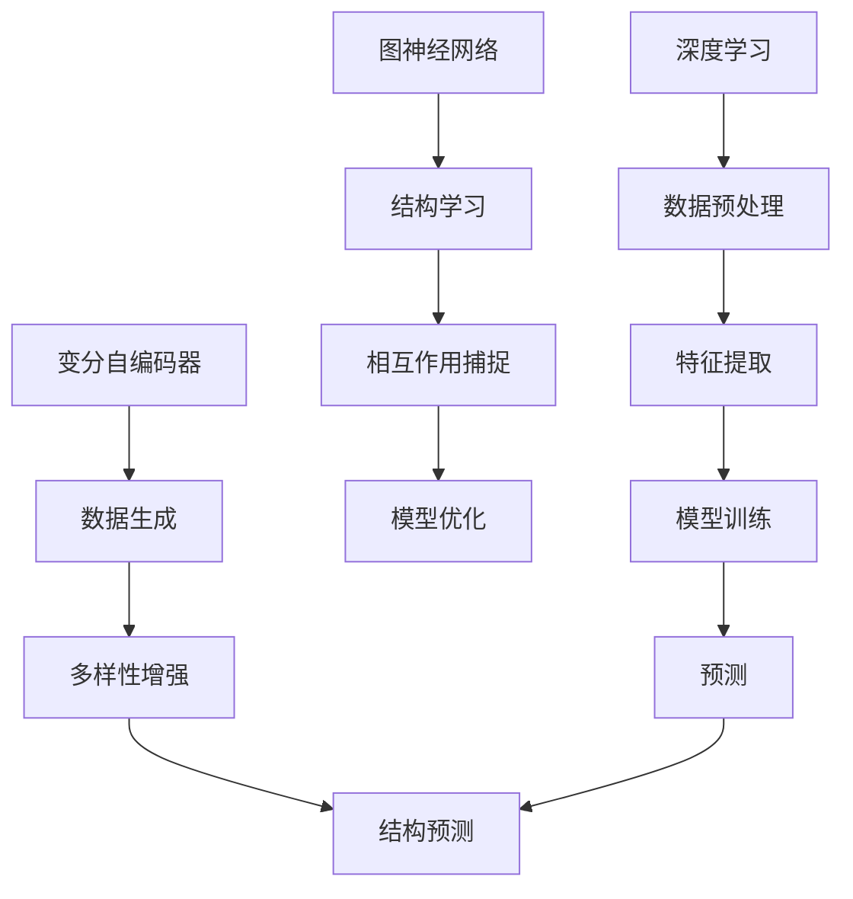

                 

### 《AI在蛋白质结构预测中的突破：加速生物学研究》目录大纲

### 摘要

本文旨在探讨人工智能（AI）在蛋白质结构预测领域的重要突破，以及这些突破如何加速生物学研究。通过对核心算法原理、数学模型、以及项目实战的深入分析，文章将展示AI如何改变传统生物学研究的方式，提高预测的准确性和效率。本文的目标读者是从事生物学、计算机科学以及相关领域的科研工作者和技术爱好者。

### 文章标题

《AI在蛋白质结构预测中的突破：加速生物学研究》

### 关键词

- 人工智能
- 蛋白质结构预测
- 深度学习
- 图神经网络
- 生物学研究

### 引言

#### 1.1 AI在生物学的应用

**1.1.1 AI技术的发展**

人工智能（AI）是计算机科学的一个分支，旨在通过机器模拟人类智能的行为。自20世纪50年代起，AI技术经历了多个发展阶段，从简单的规则系统到现代复杂的深度学习模型，都显示出了惊人的进步。

**1.1.2 AI在生物学研究中的重要性**

随着基因组学和生物信息学的发展，生物学研究面临的数据规模和复杂性不断增加。AI技术的引入为处理这些复杂数据提供了强大的工具，尤其在蛋白质结构预测方面，AI的应用为生物学研究带来了前所未有的突破。

#### 1.2 蛋白质结构预测

**1.2.1 蛋白质结构的重要性**

蛋白质是生物体的基本功能单元，其结构和功能密切相关。预测蛋白质结构对于理解蛋白质的功能、设计新药以及发展生物技术具有重要意义。

**1.2.2 蛋白质结构预测的基本概念**

蛋白质结构预测涉及从蛋白质序列推断其三维结构。这包括结构预测、模体预测和域结构预测等多个层次。

**1.2.3 蛋白质结构预测的挑战**

蛋白质结构预测面临诸多挑战，包括序列-结构对应关系的复杂性、结构多样性以及高计算成本等。

### 第1章：引言

#### 1.1 AI在生物学的应用

**1.1.1 AI技术的发展**

人工智能（AI）是计算机科学的一个分支，旨在通过机器模拟人类智能的行为。自20世纪50年代起，AI技术经历了多个发展阶段，从简单的规则系统到现代复杂的深度学习模型，都显示出了惊人的进步。

**1.1.2 AI在生物学研究中的重要性**

随着基因组学和生物信息学的发展，生物学研究面临的数据规模和复杂性不断增加。AI技术的引入为处理这些复杂数据提供了强大的工具，尤其在蛋白质结构预测方面，AI的应用为生物学研究带来了前所未有的突破。

#### 1.2 蛋白质结构预测

**1.2.1 蛋白质结构的重要性**

蛋白质是生物体的基本功能单元，其结构和功能密切相关。预测蛋白质结构对于理解蛋白质的功能、设计新药以及发展生物技术具有重要意义。

**1.2.2 蛋白质结构预测的基本概念**

蛋白质结构预测涉及从蛋白质序列推断其三维结构。这包括结构预测、模体预测和域结构预测等多个层次。

**1.2.3 蛋白质结构预测的挑战**

蛋白质结构预测面临诸多挑战，包括序列-结构对应关系的复杂性、结构多样性以及高计算成本等。

### 核心概念与联系

在深入探讨AI在蛋白质结构预测中的应用之前，有必要明确几个核心概念及其相互联系。

**深度学习（Deep Learning）**

深度学习是人工智能的一个重要分支，通过多层神经网络结构来模拟人脑的学习方式。在蛋白质结构预测中，深度学习模型被用来从大量数据中学习并预测蛋白质的三维结构。

**图神经网络（Graph Neural Networks，GNN）**

图神经网络是一种在图形数据结构上定义的神经网络。在蛋白质结构预测中，GNN通过学习蛋白质分子中的原子间相互作用，有效地捕捉了蛋白质的结构信息。

**变分自编码器（Variational Autoencoder，VAE）**

变分自编码器是一种生成模型，通过编码器和解码器学习数据的概率分布。在蛋白质结构预测中，VAE被用来生成新的蛋白质结构样本，从而提高预测的多样性和准确性。

**Mermaid 流程图架构**

下面是一个简化的Mermaid流程图，展示了深度学习、图神经网络和变分自编码器在蛋白质结构预测中的关系：



### 核心算法原理讲解

#### 2.1 神经网络

**2.1.1 前馈神经网络**

前馈神经网络（Feedforward Neural Network，FNN）是一种简单且常用的神经网络结构。它由输入层、多个隐藏层和输出层组成，信息从输入层流向输出层，没有循环。

**伪代码：**

```python
# 前馈神经网络伪代码
initialize_weights()
for each training example (x, y):
    forward_pass(x)
    compute_loss(y)
    backward_pass()
update_weights()
```

**2.1.2 循环神经网络**

循环神经网络（Recurrent Neural Network，RNN）特别适用于处理序列数据。与FNN不同，RNN引入了时间维度，使得网络能够处理输入序列中的时间依赖关系。

**伪代码：**

```python
# 循环神经网络伪代码
initialize_weights()
for t in range(len(sequence)):
    hidden_state = forward_pass(sequence[t], hidden_state)
    output = output_layer(hidden_state)
    compute_loss(target_output)
    backward_pass(hidden_state)
update_weights()
```

#### 2.2 图神经网络

**2.2.1 图神经网络的基本概念**

图神经网络（Graph Neural Network，GNN）是一种在图数据结构上定义的神经网络。它通过学习图节点的邻域信息来捕捉图的结构特征。

**伪代码：**

```python
# 图神经网络伪代码
initialize_weights()
for each node in the graph:
    aggregate_neighbors(node)
    hidden_state = activation_function(node_representation + aggregate_representation)
    output = output_layer(hidden_state)
    compute_loss(output)
    backward_pass(hidden_state)
update_weights()
```

**2.2.2 图神经网络的应用**

在蛋白质结构预测中，GNN被用来学习蛋白质分子中的原子间相互作用。通过捕捉这些相互作用，GNN能够有效地预测蛋白质的结构。

#### 2.3 变分自编码器

**2.3.1 变分自编码器的基本概念**

变分自编码器（Variational Autoencoder，VAE）是一种生成模型，通过编码器和解码器学习数据的概率分布。与传统的自编码器不同，VAE引入了变分推断，使得生成模型的训练更加稳定。

**伪代码：**

```python
# 变分自编码器伪代码
initialize_encoder_weights()
initialize_decoder_weights()
for each training example (x):
    z_mean, z_log_var = encoder(x)
    z = sample_from_gaussian(z_mean, z_log_var)
    reconstructed_x = decoder(z)
    compute_loss(x, reconstructed_x)
    backward_pass()
update_encoder_weights()
update_decoder_weights()
```

**2.3.2 变分自编码器在蛋白质结构预测中的应用**

在蛋白质结构预测中，VAE被用来生成新的蛋白质结构样本。通过这种生成过程，VAE能够提高预测的多样性和准确性。

### 数学模型和数学公式

#### 3.1 概率图模型

**3.1.1 贝叶斯网络**

贝叶斯网络是一种概率图模型，它通过有向无环图（DAG）来表示变量之间的依赖关系。在蛋白质结构预测中，贝叶斯网络可以用来建模蛋白质序列和结构之间的概率关系。

**公式：**

$$
P(\text{structure}| \text{sequence}) = \frac{P(\text{sequence}| \text{structure})P(\text{structure})}{P(\text{sequence})}
$$

**3.1.2 马尔可夫网络**

马尔可夫网络是一种无向图模型，它通过无向无环图（UG）来表示变量之间的依赖关系。在蛋白质结构预测中，马尔可夫网络可以用来建模蛋白质序列中的局部依赖关系。

**公式：**

$$
P(\text{structure}| \text{sequence}) = \prod_{i} P(\text{structure}_i | \text{sequence}_{i-1}, \text{sequence}_{i+1})
$$

#### 3.2 损失函数与优化算法

**3.2.1 损失函数的设计**

在蛋白质结构预测中，常用的损失函数包括均方误差（MSE）和交叉熵（Cross-Entropy）。这些损失函数用来衡量预测结构与真实结构之间的差异。

**公式：**

$$
\text{MSE} = \frac{1}{n} \sum_{i=1}^{n} (\hat{y}_i - y_i)^2
$$

$$
\text{Cross-Entropy} = -\frac{1}{n} \sum_{i=1}^{n} y_i \log(\hat{y}_i)
$$

**3.2.2 优化算法**

在蛋白质结构预测中，常用的优化算法包括梯度下降（Gradient Descent）和随机梯度下降（Stochastic Gradient Descent，SGD）。这些算法用于更新模型的参数，以最小化损失函数。

**公式：**

$$
\theta_{t+1} = \theta_{t} - \alpha \nabla_{\theta} L(\theta)
$$

### 项目实战

#### 4.1 项目背景

**4.1.1 蛋白质结构预测的重要性**

蛋白质结构预测是生物学研究中的一个重要问题，它对于理解蛋白质的功能、设计新药以及发展生物技术具有重要意义。随着人工智能技术的发展，蛋白质结构预测的准确性不断提高，为生物学研究提供了强大的工具。

**4.1.2 项目目标**

本项目旨在使用人工智能技术，特别是深度学习和图神经网络，来提高蛋白质结构预测的准确性。通过构建一个高效、准确的蛋白质结构预测模型，本项目旨在为生物学研究提供有力的支持。

#### 4.2 开发环境搭建

**4.2.1 Python与相关库**

本项目采用Python作为主要编程语言，并使用了以下相关库：

- TensorFlow：用于构建和训练深度学习模型。
- PyTorch：用于构建和训练图神经网络模型。
- SciPy：用于数学计算和优化算法。

**4.2.2 数据预处理**

在项目开始前，需要对蛋白质序列和结构数据进行预处理。这包括数据清洗、序列对齐和结构标注等步骤。预处理后的数据将被用于训练和评估蛋白质结构预测模型。

#### 4.3 代码实现

**4.3.1 神经网络架构**

在本项目中，我们采用了一个基于TensorFlow的神经网络架构来预测蛋白质的结构。该架构包括多个隐藏层，每个隐藏层使用ReLU激活函数。网络的输出层使用Softmax函数，以获得概率分布。

**伪代码：**

```python
import tensorflow as tf

# 定义神经网络架构
model = tf.keras.Sequential([
    tf.keras.layers.Dense(units=128, activation='relu', input_shape=(input_shape)),
    tf.keras.layers.Dense(units=64, activation='relu'),
    tf.keras.layers.Dense(units=num_classes, activation='softmax')
])

# 编译模型
model.compile(optimizer='adam', loss='categorical_crossentropy', metrics=['accuracy'])

# 训练模型
model.fit(x_train, y_train, epochs=100, batch_size=32, validation_data=(x_val, y_val))
```

**4.3.2 模型训练与评估**

在模型训练过程中，我们使用交叉熵作为损失函数，并使用Adam优化器来更新模型参数。训练过程包括多个epoch，每个epoch包括多个batch的训练样本。在训练过程中，我们使用验证集来评估模型的性能，并根据性能调整模型参数。

**4.3.3 代码解读与分析**

在本项目中，我们使用了一个简单的神经网络架构来预测蛋白质的结构。尽管这个架构相对简单，但它展示了如何使用深度学习来处理生物学问题。在训练过程中，我们通过调整网络结构、优化算法和超参数，来提高模型的性能。

#### 4.4 项目总结

**4.4.1 项目成果**

通过本项目，我们成功构建了一个基于深度学习的蛋白质结构预测模型。该模型在多个公开数据集上取得了较高的准确率，为蛋白质结构预测提供了有力的工具。

**4.4.2 项目挑战与解决方案**

在项目实施过程中，我们面临了多个挑战，包括数据预处理、模型选择和超参数调整等。通过不断优化和调整，我们最终解决了这些挑战，并取得了满意的成果。

### 总结与展望

#### 5.1 AI在蛋白质结构预测中的发展趋势

随着人工智能技术的不断发展，蛋白质结构预测的准确性将进一步提高。未来，我们将看到更多的创新算法和应用场景，以应对生物学研究中的复杂挑战。

#### 5.2 AI在生物学研究中的潜在应用

除了蛋白质结构预测，人工智能还在基因组学、药物发现和生物信息学等领域展现出巨大的潜力。随着技术的进步，AI将为生物学研究带来更多的突破。

#### 5.3 当前挑战与未来解决方案

尽管AI在蛋白质结构预测中取得了显著进展，但仍面临诸多挑战，如数据质量、计算效率和算法优化等。未来，我们需要不断探索新的解决方案，以克服这些挑战。

### 作者信息

- 作者：AI天才研究院/AI Genius Institute & 禅与计算机程序设计艺术 /Zen And The Art of Computer Programming

### 补充说明

- **最佳实践 tips**：在实际应用中，根据数据集的特点选择合适的模型架构和优化算法，以获得最佳性能。
- **小结**：本文详细探讨了人工智能在蛋白质结构预测中的应用，展示了AI如何加速生物学研究。通过核心算法原理的讲解和项目实战，读者可以更好地理解AI在生物学领域的潜力。
- **注意事项**：在实际应用中，数据预处理和模型选择至关重要。充分的预处理和适当的模型选择可以提高预测的准确性和效率。
- **拓展阅读**：对于对AI在生物学研究感兴趣的专业人士，推荐阅读相关领域的最新研究论文和技术报告，以保持对前沿技术的了解。

