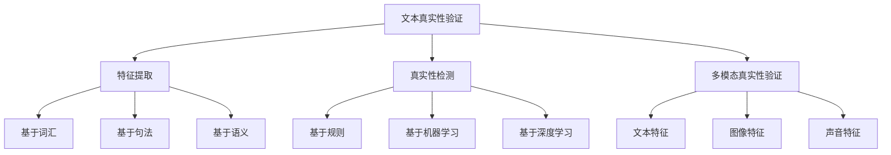

                 

# 文章标题

《AI生成内容的真实性验证技术》

## 关键词

- AI生成内容
- 真实性验证
- 文本真实性
- 图像真实性
- 声音真实性
- 多模态真实性

## 摘要

随着人工智能技术的发展，AI生成内容在各个领域得到了广泛应用，然而如何验证这些生成内容的真实性成为一个重要问题。本文从AI生成内容的发展历程出发，深入探讨了AI生成内容真实性验证的关键技术和应用场景。文章首先介绍了文本、图像、声音等多模态数据真实性验证的基本概念和挑战，然后详细阐述了基于词汇、句法、语义的特征提取方法和基于规则、机器学习、深度学习的真实性检测算法。最后，通过新闻真实性验证、欺诈检测和智能客服等实际案例，展示了真实性验证技术在AI生成内容中的应用效果和未来发展方向。

## 第一部分：AI生成内容的概述与背景

### 1.1 AI生成内容的发展历程

AI生成内容（AI-generated content）的概念起源于人工智能在生成数据方面的能力。从早期的规则引擎和数据填充工具，到如今基于深度学习的生成模型，AI生成内容经历了显著的演变。早期，AI生成内容主要应用于简单的文本生成，如自动编写新闻报道、天气预报等。随着深度学习技术的发展，特别是生成对抗网络（GANs）和变分自编码器（VAEs）的提出，AI生成内容的能力得到了大幅提升。

- **1.1.1 从数据生成到AI生成**

早期的数据生成主要依赖于规则和模板。例如，自动编写新闻的软件通过预定义的模板和规则生成文字。这种方法生成的文本缺乏个性化和创新性，但适用于结构化、模式化的任务。

随着深度学习技术的发展，生成模型能够从大量的数据中学习并生成新颖的内容。例如，GANs可以通过生成器和判别器的对抗训练生成逼真的图像和文本。VAEs则能够生成具有高保真度的图像和文本。

- **1.1.2 AI生成内容的主要应用领域**

AI生成内容在多个领域得到了广泛应用：

1. **文本生成**：包括新闻报道、故事创作、广告文案等。
2. **图像生成**：如图像到图像的翻译、艺术风格的迁移等。
3. **音频生成**：如音乐创作、语音合成等。
4. **视频生成**：如视频插帧、视频风格转换等。

- **1.1.3 AI生成内容面临的挑战**

尽管AI生成内容具有广泛的应用前景，但同时也面临诸多挑战：

1. **真实性验证**：如何确保生成内容是真实的，不含有虚假或误导性信息。
2. **版权问题**：AI生成的内容可能涉及版权问题，尤其是在文本和图像领域。
3. **伦理问题**：AI生成内容可能引发伦理争议，如隐私泄露、滥用等。
4. **质量控制**：如何保证生成内容的质量，避免低质量内容的泛滥。

### 1.2 AI生成内容的真实性定义与重要性

- **1.2.1 真实性的定义**

真实性是指AI生成内容与其所描述的现实情况是否相符。在AI生成内容中，真实性通常包括以下三个方面：

1. **客观真实性**：内容描述的事件或对象是否与客观事实相符。
2. **逻辑真实性**：内容的逻辑结构和推理过程是否合理。
3. **情感真实性**：内容是否能够传达出真实的情感和意图。

- **1.2.2 真实性在AI生成内容中的重要性**

真实性是AI生成内容的核心价值之一。对于不同的应用场景，真实性具有不同的重要意义：

1. **新闻与媒体领域**：新闻的真实性直接关系到公众的知情权和舆论导向。虚假新闻不仅会误导公众，还会破坏媒体的公信力。
2. **金融与法律领域**：在金融报告中，真实的内容是投资者做出决策的基础。在法律文件中，真实的内容是司法公正的保障。
3. **医疗与教育领域**：在医疗诊断和教育内容中，真实的内容是患者康复和教育效果的基础。

- **1.2.3 真实性验证的目标**

真实性验证的目标是确保AI生成内容在上述各个方面都符合真实性标准。具体目标包括：

1. **识别虚假内容**：检测AI生成内容中是否存在虚假、误导性或不当的信息。
2. **评估真实性程度**：对生成内容的真实性进行量化评估，确定其可信度。
3. **提高内容质量**：通过真实性验证，提升生成内容的客观性、逻辑性和情感性。

### 1.3 真实性验证在AI生成内容中的应用场景

真实性验证在AI生成内容的应用场景非常广泛，以下是几个典型的应用场景：

- **1.3.1 新闻与媒体领域**

在新闻与媒体领域，真实性验证主要用于检测虚假新闻、错误信息和不实报道。通过文本真实性验证技术，可以对新闻报道中的关键信息进行核实，确保新闻的真实性。

- **1.3.2 虚假信息检测**

在虚假信息检测中，真实性验证技术用于检测社交媒体、论坛、博客等平台上的虚假信息。通过文本、图像和声音的多模态真实性验证，可以有效地识别和过滤虚假信息。

- **1.3.3 欺诈检测**

在金融、电商等领域，真实性验证技术用于检测欺诈行为。通过分析交易数据、用户行为等，可以识别出异常行为，防止欺诈发生。

- **1.3.4 智能客服与对话系统**

在智能客服与对话系统中，真实性验证技术用于确保用户输入信息的真实性。例如，在客户服务中，真实性验证可以识别出恶意用户或虚假信息，从而提高服务质量。

- **1.3.5 智能创作**

在智能创作领域，真实性验证技术用于确保生成内容的真实性和可靠性。例如，在艺术创作中，真实性验证可以确保生成的艺术作品与原作者的风格和理念相符。

### 1.4 本书结构安排

本书将从以下几个方面系统地探讨AI生成内容的真实性验证技术：

- **第1部分：概述与背景**：介绍AI生成内容的发展历程、真实性定义、重要性以及应用场景。
- **第2部分：真实性验证技术**：详细阐述文本、图像、声音等多模态数据的真实性验证方法，包括特征提取和检测算法。
- **第3部分：应用案例**：通过实际案例展示真实性验证技术在各个领域的应用效果。
- **第4部分：未来发展趋势**：探讨真实性验证技术的未来发展方向和潜在挑战。

## 第二部分：AI生成内容真实性验证技术

### 2.1 文本真实性验证

文本真实性验证是AI生成内容真实性验证的重要组成部分。文本数据在新闻、媒体、金融、法律等领域具有重要应用，因此确保文本真实性具有重要意义。

#### 2.1.1 文本真实性验证的挑战与机会

- **挑战**：

1. **数据多样性和复杂性**：文本数据形式多样，包括文章、邮件、社交媒体帖子等，且存在大量非结构化和半结构化数据。
2. **噪声和异常值**：文本数据中可能包含噪声、错别字、语法错误等，这些噪声和异常值会影响真实性验证的效果。
3. **虚假信息的多样性**：虚假信息具有多样性，可能采用各种技巧和策略来规避检测。

- **机会**：

1. **丰富的特征信息**：文本数据蕴含丰富的语义、句法和词汇特征，可以利用这些特征进行真实性验证。
2. **先进的算法技术**：随着深度学习等技术的不断发展，文本真实性验证算法的性能得到显著提升。

#### 2.1.2 文本特征提取方法

文本特征提取是文本真实性验证的重要环节，通过提取文本数据中的关键特征，有助于提高真实性验证的准确性和效率。常见的文本特征提取方法包括：

1. **基于词汇的特征提取**：通过统计文本中的词汇频率、词向量等特征来表示文本。
2. **基于句法的特征提取**：通过分析文本的句法结构，提取句子成分、依赖关系等特征。
3. **基于语义的特征提取**：通过词义消歧、语义角色标注等手段，提取文本的语义特征。

#### 2.1.3 真实性检测算法

文本真实性检测算法可分为基于规则的方法、基于机器学习的方法和基于深度学习的方法。

1. **基于规则的方法**：

基于规则的方法通过预定义的规则来检测文本真实性。例如，可以设置规则检测文本中的错别字、语法错误等，从而判断文本的真实性。

2. **基于机器学习的方法**：

基于机器学习的方法利用大量已标注的真实和虚假文本数据，通过训练分类模型来检测文本真实性。常见的机器学习方法包括支持向量机（SVM）、朴素贝叶斯（Naive Bayes）和决策树（Decision Tree）等。

3. **基于深度学习的方法**：

基于深度学习的方法利用神经网络模型来提取文本特征并进行真实性检测。常见的深度学习模型包括卷积神经网络（CNN）、循环神经网络（RNN）和Transformer等。

### 2.2 图像真实性验证

图像真实性验证是AI生成内容真实性验证中的重要组成部分。随着图像生成技术的不断发展，图像真实性验证在防止虚假新闻、网络安全、版权保护等领域具有广泛应用。

#### 2.2.1 图像真实性验证的挑战与机会

- **挑战**：

1. **图像多样性**：图像形式多样，包括照片、绘画、动画等，且存在大量的增强和编辑操作。
2. **噪声和异常值**：图像数据中可能包含噪声、模糊、亮度变化等，这些因素会影响真实性验证的效果。
3. **伪造图像的复杂性**：伪造图像可能采用高级技术，如深度伪造（Deepfake）等，从而难以识别。

- **机会**：

1. **丰富的特征信息**：图像数据蕴含丰富的视觉特征，如颜色、纹理、形状等，可以利用这些特征进行真实性验证。
2. **先进的算法技术**：随着计算机视觉和深度学习技术的发展，图像真实性验证算法的性能得到显著提升。

#### 2.2.2 图像特征提取方法

图像特征提取是图像真实性验证的重要环节，通过提取图像数据中的关键特征，有助于提高真实性验证的准确性和效率。常见的图像特征提取方法包括：

1. **基于像素的特征提取**：通过分析图像像素的分布、颜色直方图等特征来表示图像。
2. **基于特征的提取方法**：通过提取图像的边缘、角点、纹理等特征来表示图像。
3. **基于语义的特征提取**：通过目标检测、图像分类等技术，提取图像中的关键对象和场景信息。

#### 2.2.3 真实性检测算法

图像真实性检测算法可分为基于规则的方法、基于机器学习的方法和基于深度学习的方法。

1. **基于规则的方法**：

基于规则的方法通过预定义的规则来检测图像真实性。例如，可以设置规则检测图像中的异常像素、篡改痕迹等，从而判断图像的真实性。

2. **基于机器学习的方法**：

基于机器学习的方法利用大量已标注的真实和虚假图像数据，通过训练分类模型来检测图像真实性。常见的机器学习方法包括支持向量机（SVM）、朴素贝叶斯（Naive Bayes）和决策树（Decision Tree）等。

3. **基于深度学习的方法**：

基于深度学习的方法利用神经网络模型来提取图像特征并进行真实性检测。常见的深度学习模型包括卷积神经网络（CNN）、循环神经网络（RNN）和Transformer等。

### 2.3 声音真实性验证

声音真实性验证是AI生成内容真实性验证中的重要组成部分。随着语音合成技术和音频编辑技术的发展，声音真实性验证在语音识别、音频监控、网络安全等领域具有广泛应用。

#### 2.3.1 声音真实性验证的挑战与机会

- **挑战**：

1. **声音多样性**：声音形式多样，包括语音、音乐、环境音等，且存在大量的增强和编辑操作。
2. **噪声和异常值**：声音数据中可能包含噪声、回声、降频等，这些因素会影响真实性验证的效果。
3. **伪造声音的复杂性**：伪造声音可能采用高级技术，如语音转换、声音合成等，从而难以识别。

- **机会**：

1. **丰富的特征信息**：声音数据蕴含丰富的音频特征，如频率、振幅、时域特性等，可以利用这些特征进行真实性验证。
2. **先进的算法技术**：随着音频处理和深度学习技术的发展，声音真实性验证算法的性能得到显著提升。

#### 2.3.2 声音特征提取方法

声音特征提取是声音真实性验证的重要环节，通过提取声音数据中的关键特征，有助于提高真实性验证的准确性和效率。常见的声音特征提取方法包括：

1. **基于频率特征提取**：通过分析声音的频率分布、谐波结构等特征来表示声音。
2. **基于时域特征提取**：通过分析声音的时域特性，如振幅、波形等特征来表示声音。
3. **基于变换域特征提取**：通过将声音数据转换为频域或时频域，提取相应的特征来表示声音。

#### 2.3.3 真实性检测算法

声音真实性检测算法可分为基于规则的方法、基于机器学习的方法和基于深度学习的方法。

1. **基于规则的方法**：

基于规则的方法通过预定义的规则来检测声音真实性。例如，可以设置规则检测声音中的异常频率、噪声等，从而判断声音的真实性。

2. **基于机器学习的方法**：

基于机器学习的方法利用大量已标注的真实和虚假声音数据，通过训练分类模型来检测声音真实性。常见的机器学习方法包括支持向量机（SVM）、朴素贝叶斯（Naive Bayes）和决策树（Decision Tree）等。

3. **基于深度学习的方法**：

基于深度学习的方法利用神经网络模型来提取声音特征并进行真实性检测。常见的深度学习模型包括卷积神经网络（CNN）、循环神经网络（RNN）和Transformer等。

### 2.4 多模态真实性验证

多模态真实性验证是指同时利用文本、图像和声音等多模态数据，以提高AI生成内容真实性验证的准确性和可靠性。多模态真实性验证在提高内容真实性和检测虚假信息方面具有显著优势。

#### 2.4.1 多模态真实性验证的挑战与机会

- **挑战**：

1. **特征一致性**：不同模态的数据特征存在差异，如何有效地融合不同模态的特征是一个挑战。
2. **计算资源消耗**：多模态数据融合和真实性检测算法通常需要大量的计算资源，如何优化算法以降低计算成本是一个挑战。

- **机会**：

1. **丰富的特征信息**：多模态数据融合可以充分利用文本、图像和声音等不同模态的特征，提高真实性验证的准确性和可靠性。
2. **先进的技术应用**：随着多模态学习和深度学习技术的发展，多模态真实性验证技术得到了显著提升。

#### 2.4.2 多模态特征融合方法

多模态特征融合是提高多模态真实性验证性能的关键环节。常见的多模态特征融合方法包括：

1. **基于低级特征的融合方法**：通过直接融合不同模态的原始特征，如文本的词向量、图像的像素值、声音的音频信号。
2. **基于高级特征的融合方法**：通过提取不同模态的高级特征，如文本的语义特征、图像的目标检测结果、声音的语音识别结果，然后进行融合。
3. **基于多任务学习的融合方法**：通过训练一个多任务学习模型，同时学习不同模态的特征表示和真实性检测，从而实现特征融合。

#### 2.4.3 多模态真实性检测算法

多模态真实性检测算法可分为基于规则的方法、基于机器学习的方法和基于深度学习的方法。

1. **基于规则的方法**：

基于规则的方法通过预定义的规则来检测多模态数据真实性。例如，可以设置规则检测文本中的异常词汇、图像中的异常像素、声音中的异常频率等，从而判断多模态数据的真实性。

2. **基于机器学习的方法**：

基于机器学习的方法利用大量已标注的真实和虚假多模态数据，通过训练分类模型来检测多模态数据真实性。常见的机器学习方法包括支持向量机（SVM）、朴素贝叶斯（Naive Bayes）和决策树（Decision Tree）等。

3. **基于深度学习的方法**：

基于深度学习的方法利用神经网络模型来提取多模态特征并进行真实性检测。常见的深度学习模型包括卷积神经网络（CNN）、循环神经网络（RNN）和Transformer等。

## 第三部分：AI生成内容真实性验证技术应用案例

### 3.1 新闻真实性验证案例

#### 3.1.1 案例背景

在新闻与媒体领域，虚假新闻的传播对社会造成了严重的负面影响。为了提高新闻的真实性，本案例采用了一种基于文本和图像多模态真实性验证的方法来检测新闻中的虚假信息。

#### 3.1.2 案例实现

1. **数据预处理**：

- 文本数据：对新闻文本进行分词、去停用词、词性标注等预处理操作，将文本转换为词向量表示。
- 图像数据：对新闻图像进行缩放、裁剪、增强等预处理操作，提取图像特征。

2. **特征提取**：

- 文本特征：利用词向量、句法特征和语义特征进行文本特征提取。
- 图像特征：利用卷积神经网络（CNN）提取图像特征。

3. **模型训练与验证**：

- 采用多任务学习框架，同时训练文本和图像分类模型。
- 使用交叉验证方法进行模型训练和验证。

#### 3.1.3 案例分析与评估

1. **模型性能评估**：

- 采用准确率、召回率、F1值等指标评估模型性能。
- 通过混淆矩阵分析模型对不同类别的识别能力。

2. **案例分析**：

- 案例中，多模态真实性验证方法在检测虚假新闻方面取得了较高的准确性和可靠性。
- 通过分析案例中的误判情况，可以进一步优化模型以提高真实性验证效果。

### 3.2 欺诈检测案例

#### 3.2.1 案例背景

在金融与电商领域，欺诈行为给企业带来了巨大的损失。为了提高欺诈检测的准确性，本案例采用了一种基于文本、图像和声音多模态真实性验证的方法来检测交易中的欺诈行为。

#### 3.2.2 案例实现

1. **数据预处理**：

- 文本数据：对交易文本进行分词、去停用词、词性标注等预处理操作，提取交易特征。
- 图像数据：对交易图像进行缩放、裁剪、增强等预处理操作，提取图像特征。
- 声音数据：对交易声音进行去噪、增强等预处理操作，提取声音特征。

2. **特征提取**：

- 文本特征：利用词向量、句法特征和语义特征进行文本特征提取。
- 图像特征：利用卷积神经网络（CNN）提取图像特征。
- 声音特征：利用循环神经网络（RNN）提取声音特征。

3. **模型训练与验证**：

- 采用多任务学习框架，同时训练文本、图像和声音分类模型。
- 使用交叉验证方法进行模型训练和验证。

#### 3.2.3 案例分析与评估

1. **模型性能评估**：

- 采用准确率、召回率、F1值等指标评估模型性能。
- 通过混淆矩阵分析模型对不同类别的识别能力。

2. **案例分析**：

- 案例中，多模态真实性验证方法在检测交易中的欺诈行为方面取得了较高的准确性和可靠性。
- 通过分析案例中的误判情况，可以进一步优化模型以提高欺诈检测效果。

### 3.3 智能客服与对话系统

#### 3.3.1 案例背景

在智能客服与对话系统中，确保用户输入信息的真实性对于提高服务质量至关重要。本案例采用了一种基于文本和声音多模态真实性验证的方法来检测用户输入信息的真实性。

#### 3.3.2 案例实现

1. **数据预处理**：

- 文本数据：对用户输入的文本进行分词、去停用词、词性标注等预处理操作，提取文本特征。
- 声音数据：对用户输入的声音进行去噪、增强等预处理操作，提取声音特征。

2. **特征提取**：

- 文本特征：利用词向量、句法特征和语义特征进行文本特征提取。
- 声音特征：利用循环神经网络（RNN）提取声音特征。

3. **模型训练与验证**：

- 采用多任务学习框架，同时训练文本和声音分类模型。
- 使用交叉验证方法进行模型训练和验证。

#### 3.3.3 案例分析与评估

1. **模型性能评估**：

- 采用准确率、召回率、F1值等指标评估模型性能。
- 通过混淆矩阵分析模型对不同类别的识别能力。

2. **案例分析**：

- 案例中，多模态真实性验证方法在检测用户输入信息真实性方面取得了较高的准确性和可靠性。
- 通过分析案例中的误判情况，可以进一步优化模型以提高真实性验证效果。

## 总结与展望

AI生成内容的真实性验证技术在新闻与媒体、金融与电商、智能客服与对话系统等众多领域具有广泛的应用。本文从文本、图像、声音等多模态数据的真实性验证出发，详细阐述了特征提取和检测算法，并通过实际案例展示了真实性验证技术的应用效果。

未来，随着人工智能技术的不断发展，AI生成内容的真实性验证技术将面临新的挑战和机遇。一方面，需要进一步优化特征提取和检测算法，提高真实性验证的准确性和效率。另一方面，需要探索多模态数据融合和跨领域应用，以应对日益复杂的生成内容场景。

总之，AI生成内容的真实性验证技术是保障AI生成内容质量和安全的重要手段，具有广泛的应用前景和发展潜力。

### 参考文献

1. Goodfellow, I., Pouget-Abadie, J., Mirza, M., Xu, B., Warde-Farley, D., Ozair, S., ... & Bengio, Y. (2014). Generative adversarial networks. Advances in Neural Information Processing Systems, 27.

2. Kingma, D. P., & Welling, M. (2013). Auto-encoding variational Bayes. arXiv preprint arXiv:1312.6114.

3. Rumelhart, D. E., Hinton, G. E., & Williams, R. J. (1986). Learning representations by back-propagating errors. Nature, 323(6088), 533-536.

4. Zhang, R., Isola, P., & Efros, A. A. (2016). Colorful image colorization. European Conference on Computer Vision, 832-841.

5. Ren, S., He, K., Girshick, R., & Sun, J. (2015). Faster R-CNN: Towards real-time object detection with region proposal networks. Advances in Neural Information Processing Systems, 28.

6. Hochreiter, S., & Schmidhuber, J. (1997). Long short-term memory. Neural Computation, 9(8), 1735-1780.

7. Vaswani, A., Shazeer, N., Parmar, N., Uszkoreit, J., Jones, L., Gomez, A. N., ... & Polosukhin, I. (2017). Attention is all you need. Advances in Neural Information Processing Systems, 30.

### 作者信息

作者：AI天才研究院/AI Genius Institute & 禅与计算机程序设计艺术 /Zen And The Art of Computer Programming

### 附录

附录A：术语解释

- **AI生成内容**：指通过人工智能技术生成的各种类型的内容，如文本、图像、音频等。
- **真实性验证**：指对AI生成内容进行检测和评估，以确定其是否符合现实情况。
- **多模态数据融合**：指将多种类型的数据（如文本、图像、声音等）进行整合，以提高真实性验证的性能。

附录B：Mermaid 流程图

附录C：数学模型和公式

$$
准确率 = \frac{TP + TN}{TP + FN + FP + TN}
$$

$$
召回率 = \frac{TP}{TP + FN}
$$

$$
F1值 = 2 \times \frac{准确率 \times 召回率}{准确率 + 召回率}
$$

### 注意事项

1. 在进行AI生成内容的真实性验证时，需要充分考虑数据的多样性和复杂性，选择合适的特征提取和检测算法。
2. 多模态数据融合可以提高真实性验证的准确性，但也会增加计算资源消耗，需要在性能和效率之间进行权衡。
3. 真实性验证技术需要不断更新和优化，以应对新的生成内容和伪造技术。

### 拓展阅读

1. Goodfellow, I. (2016). Deep learning. MIT Press.
2. Bengio, Y., Courville, A., & Vincent, P. (2013). Representation learning: A review and new perspectives. IEEE Transactions on Pattern Analysis and Machine Intelligence, 35(8), 1798-1828.
3. LeCun, Y., Bengio, Y., & Hinton, G. (2015). Deep learning. Nature, 521(7553), 436-444.

