                 

## 文章标题
《AI辅助软件测试：自动化bug检测和性能优化》

## 关键词
AI、软件测试、自动化bug检测、性能优化、自动化测试工具

## 摘要
本文深入探讨了人工智能（AI）在软件测试领域的应用，特别是自动化bug检测和性能优化。通过分析AI与软件测试的关系，介绍了自动化bug检测和性能优化技术的基本概念、核心算法原理、数学模型，并提供了具体的实际应用案例。本文旨在帮助开发者更好地理解和利用AI技术，提高软件测试的效率和效果。

## 目录

### 第1章 引言与概述

#### 1.1 AI与软件测试的关系
- **背景介绍**：介绍AI在软件测试领域的兴起和重要性。
- **核心概念与联系**：阐述AI技术如何与软件测试相结合，使用Mermaid流程图展示AI在软件测试中的应用场景。
- **核心算法原理讲解**：简要介绍AI在自动化测试中的核心算法，如机器学习模型、深度学习网络等。

#### 1.2 自动化bug检测
- **核心概念与联系**：介绍自动化bug检测的基本概念，与传统的bug检测方法进行对比，使用Mermaid流程图展示自动化bug检测的流程。
- **核心算法原理讲解**：详细讲解自动化bug检测的核心算法，如异常检测、模式识别等，使用伪代码来阐述算法原理。

#### 1.3 性能优化技术
- **核心概念与联系**：介绍性能优化技术在软件测试中的重要性，与性能测试的关系。
- **核心算法原理讲解**：详细讲解性能优化的核心算法，如负载均衡、缓存技术等，使用伪代码来阐述算法原理。

#### 1.4 AI辅助测试工具
- **核心概念与联系**：介绍常见的AI辅助测试工具，如自动化测试框架、性能分析工具等。
- **核心算法原理讲解**：分析AI辅助测试工具的工作原理，以及如何选择和使用这些工具。

### 第2章 AI与软件测试概述

#### 2.1 AI的核心概念
- **背景介绍**：介绍AI的基本概念和发展历程。
- **核心概念与联系**：阐述AI的核心概念，如机器学习、深度学习、神经网络等，使用Mermaid流程图展示这些概念之间的关系。

#### 2.2 软件测试的基础知识
- **核心概念与联系**：介绍软件测试的基本概念，如测试类型、测试方法等。
- **核心算法原理讲解**：简要介绍常见的软件测试算法，如黑盒测试、白盒测试等。

#### 2.3 AI在软件测试中的应用
- **核心概念与联系**：分析AI在软件测试中的应用，如自动化测试、缺陷预测等。
- **核心算法原理讲解**：详细讲解AI在软件测试中的具体应用，如机器学习模型在缺陷预测中的应用。

### 第3章 自动化bug检测

#### 3.1 自动化bug检测的原理
- **核心概念与联系**：介绍自动化bug检测的基本原理，与传统的手动测试进行对比。
- **核心算法原理讲解**：详细讲解自动化bug检测的核心算法，如异常检测、模式识别等，使用伪代码来阐述算法原理。

#### 3.2 常见的自动化bug检测方法
- **核心概念与联系**：介绍常见的自动化bug检测方法，如静态代码分析、动态测试等。
- **核心算法原理讲解**：详细讲解每种方法的原理，使用伪代码来阐述算法原理。

#### 3.3 Mermaid流程图示例
- **核心概念与联系**：展示自动化bug检测的流程，使用Mermaid流程图进行说明。

### 第4章 性能优化技术

#### 4.1 性能优化的核心概念
- **核心概念与联系**：介绍性能优化的基本概念，如响应时间、吞吐量等。
- **核心算法原理讲解**：简要介绍性能优化的核心算法，如负载均衡、缓存技术等。

#### 4.2 常用的性能优化方法
- **核心概念与联系**：介绍常用的性能优化方法，如代码优化、数据库优化等。
- **核心算法原理讲解**：详细讲解每种方法的原理，使用伪代码来阐述算法原理。

#### 4.3 伪代码示例
- **核心概念与联系**：提供伪代码示例，展示性能优化算法的具体实现。

### 第5章 AI辅助测试工具

#### 5.1 常见的AI辅助测试工具
- **核心概念与联系**：介绍常见的AI辅助测试工具，如自动化测试框架、性能分析工具等。
- **核心算法原理讲解**：分析这些工具的工作原理，以及如何使用它们进行自动化测试和性能优化。

#### 5.2 工具的使用与集成
- **核心概念与联系**：介绍如何使用和集成AI辅助测试工具。
- **核心算法原理讲解**：详细讲解工具的使用方法，如如何配置和优化工具。

#### 5.3 工具的优缺点分析
- **核心概念与联系**：分析不同AI辅助测试工具的优缺点。
- **核心算法原理讲解**：提供具体的优缺点分析，帮助开发者选择合适的工具。

### 第6章 实际应用案例

#### 6.1 案例一：自动化bug检测在Web应用测试中的应用
- **核心概念与联系**：介绍自动化bug检测在Web应用测试中的应用场景。
- **核心算法原理讲解**：详细讲解案例中的自动化bug检测算法原理。
- **项目实战**：提供项目实战案例，包括开发环境搭建、源代码实现和代码解读。

#### 6.2 案例二：性能优化在移动应用测试中的应用
- **核心概念与联系**：介绍性能优化在移动应用测试中的应用场景。
- **核心算法原理讲解**：详细讲解案例中的性能优化算法原理。
- **项目实战**：提供项目实战案例，包括开发环境搭建、源代码实现和代码解读。

#### 6.3 案例三：AI辅助测试在游戏应用测试中的应用
- **核心概念与联系**：介绍AI辅助测试在游戏应用测试中的应用场景。
- **核心算法原理讲解**：详细讲解案例中的AI辅助测试算法原理。
- **项目实战**：提供项目实战案例，包括开发环境搭建、源代码实现和代码解读。

### 第7章 总结与展望

#### 7.1 本书总结
- **核心概念与联系**：总结本书的核心内容和关键知识点。
- **核心算法原理讲解**：回顾本书中讲解的核心算法原理。
- **项目实战**：回顾本书中的项目实战案例，总结经验教训。

#### 7.2 AI辅助软件测试的未来趋势
- **核心概念与联系**：分析AI辅助软件测试的未来发展趋势。
- **核心算法原理讲解**：探讨未来可能出现的新的AI算法和技术。

#### 7.3 进一步研究方向
- **核心概念与联系**：提出AI辅助软件测试领域可能的研究方向。
- **核心算法原理讲解**：讨论这些研究方向的可能性和挑战。

## 文章标题：《AI辅助软件测试：自动化bug检测和性能优化》

### 关键词：AI、软件测试、自动化bug检测、性能优化、自动化测试工具

### 摘要
本文深入探讨了人工智能（AI）在软件测试领域的应用，特别是自动化bug检测和性能优化。通过分析AI与软件测试的关系，介绍了自动化bug检测和性能优化技术的基本概念、核心算法原理、数学模型，并提供了具体的实际应用案例。本文旨在帮助开发者更好地理解和利用AI技术，提高软件测试的效率和效果。

### 引言与概述

#### 1.1 AI与软件测试的关系

随着人工智能技术的快速发展，AI在软件测试领域的应用也日益广泛。AI能够通过学习和分析数据，自动识别和检测软件中的缺陷，从而提高测试的效率和质量。

**核心概念与联系**：
- **AI**：一种模拟人类智能的技术，包括机器学习、深度学习、自然语言处理等。
- **软件测试**：一种验证软件是否满足需求和规范的活动，包括功能测试、性能测试、安全测试等。

**Mermaid流程图示例**：

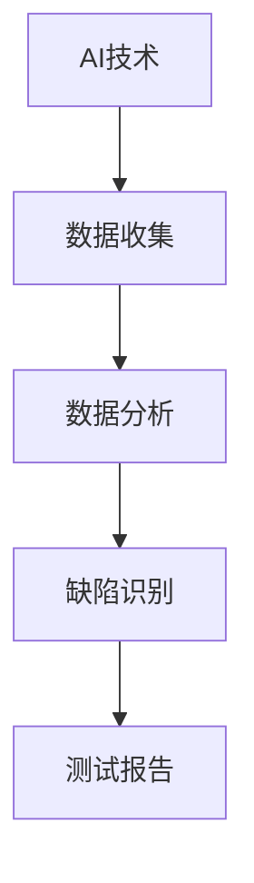

**核心算法原理讲解**：
- **机器学习模型**：通过训练模型，使计算机能够自动识别软件中的缺陷。
- **深度学习网络**：通过多层神经网络，提取数据的特征，实现更精确的缺陷检测。

#### 1.2 自动化bug检测

自动化bug检测是AI在软件测试中的一个重要应用。它能够自动识别软件中的潜在缺陷，减少手动测试的工作量，提高测试的效率。

**核心概念与联系**：
- **自动化bug检测**：一种利用计算机程序自动检测软件缺陷的方法。
- **传统bug检测方法**：依赖于手动测试和静态分析，效率较低。

**Mermaid流程图示例**：

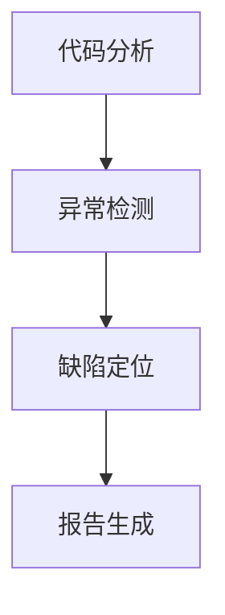

**核心算法原理讲解**：
- **异常检测**：通过检测代码中的异常行为，识别潜在的bug。
- **模式识别**：通过识别代码中的特定模式，预测可能的缺陷。

#### 1.3 性能优化技术

性能优化是软件测试中的重要环节，它能够提高软件的响应速度和处理能力，确保软件在高负载下正常运行。

**核心概念与联系**：
- **性能优化**：一种通过改进软件性能，提高软件运行效率的方法。
- **性能测试**：通过模拟高负载环境，测试软件的性能。

**Mermaid流程图示例**：

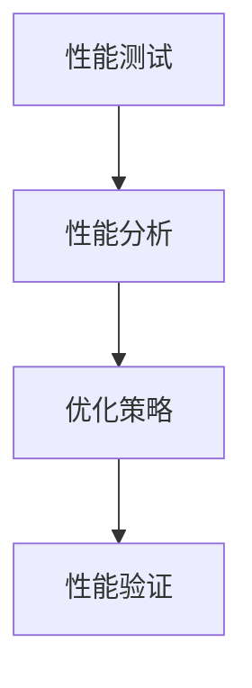

**核心算法原理讲解**：
- **负载均衡**：通过分配负载，提高系统的处理能力。
- **缓存技术**：通过存储经常访问的数据，减少数据库的访问次数。

#### 1.4 AI辅助测试工具

AI辅助测试工具是AI在软件测试中的具体应用，它能够自动化执行测试，分析测试结果，提供优化的建议。

**核心概念与联系**：
- **AI辅助测试工具**：一种利用AI技术自动化软件测试的工具。
- **自动化测试框架**：一种提供测试脚本编写和执行的平台。
- **性能分析工具**：一种用于分析软件性能的工具。

**核心算法原理讲解**：
- **自动化测试框架**：通过编写脚本，自动化执行测试用例。
- **性能分析工具**：通过采集和分析系统性能数据，提供优化建议。

### AI与软件测试概述

#### 2.1 AI的核心概念

人工智能是一种模拟人类智能的技术，它通过机器学习和深度学习等算法，使计算机能够自动学习和决策。

**核心概念与联系**：
- **机器学习**：一种使计算机能够从数据中学习的方法。
- **深度学习**：一种基于多层神经网络的学习方法。
- **自然语言处理**：一种使计算机能够理解和生成自然语言的方法。

**Mermaid流程图示例**：

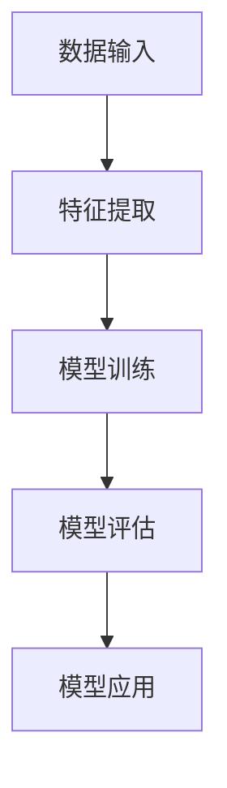

**核心算法原理讲解**：
- **机器学习模型**：通过训练数据集，使计算机能够识别数据中的规律。
- **深度学习网络**：通过多层神经网络，提取数据的特征，实现更复杂的任务。

#### 2.2 软件测试的基础知识

软件测试是一种验证软件是否满足需求和规范的活动。它包括功能测试、性能测试、安全测试等多个方面。

**核心概念与联系**：
- **功能测试**：验证软件的功能是否满足需求。
- **性能测试**：验证软件在特定环境下的性能表现。
- **安全测试**：验证软件的安全性，确保其能够抵御外部攻击。

**Mermaid流程图示例**：

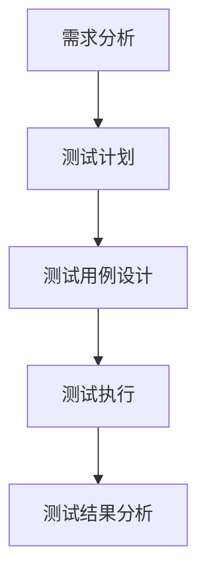

**核心算法原理讲解**：
- **黑盒测试**：不关注内部实现，只关注功能是否正确。
- **白盒测试**：关注内部实现，通过代码逻辑来设计测试用例。

#### 2.3 AI在软件测试中的应用

AI在软件测试中的应用主要体现在自动化测试、缺陷预测、性能优化等方面。

**核心概念与联系**：
- **自动化测试**：通过编写脚本，自动化执行测试用例。
- **缺陷预测**：通过分析历史数据，预测软件中的潜在缺陷。
- **性能优化**：通过分析性能数据，优化软件的性能。

**Mermaid流程图示例**：

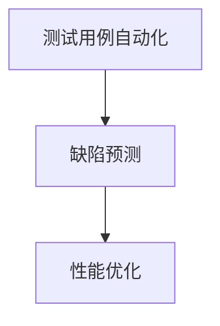

**核心算法原理讲解**：
- **自动化测试**：通过机器学习算法，识别测试脚本中的模式。
- **缺陷预测**：通过回归分析，预测软件中的缺陷。
- **性能优化**：通过分析性能数据，识别瓶颈并优化。

### 自动化bug检测

#### 3.1 自动化bug检测的原理

自动化bug检测是一种利用计算机程序自动检测软件缺陷的方法。它通过分析代码、运行测试用例等方式，识别潜在的bug。

**核心概念与联系**：
- **自动化bug检测**：一种自动检测软件缺陷的方法。
- **传统bug检测方法**：依赖于人工测试和静态分析，效率较低。

**Mermaid流程图示例**：

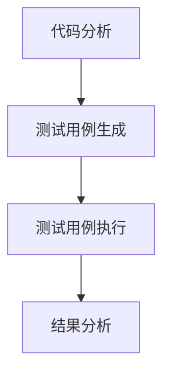

**核心算法原理讲解**：
- **静态代码分析**：通过分析代码的语法、语义等，识别潜在的bug。
- **动态测试**：通过运行测试用例，观察程序的运行行为，识别潜在的bug。

#### 3.2 常见的自动化bug检测方法

自动化bug检测方法包括静态代码分析、动态测试、模糊测试等多种方法。每种方法都有其特点和适用场景。

**核心概念与联系**：
- **静态代码分析**：通过分析代码，识别潜在的bug。
- **动态测试**：通过运行代码，观察程序的运行行为，识别潜在的bug。
- **模糊测试**：通过生成大量输入，模拟用户行为，识别潜在的bug。

**Mermaid流程图示例**：

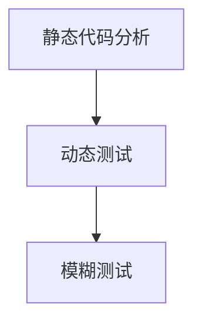

**核心算法原理讲解**：
- **静态代码分析**：通过语法分析、语义分析等技术，识别代码中的潜在bug。
- **动态测试**：通过运行测试用例，观察程序的输出结果，识别潜在的bug。
- **模糊测试**：通过生成大量随机输入，模拟用户行为，识别潜在的bug。

#### 3.3 Mermaid流程图示例


### 性能优化技术

#### 4.1 性能优化的核心概念

性能优化是一种通过改进软件性能，提高软件运行效率的方法。它主要包括优化代码、数据库、网络等方面。

**核心概念与联系**：
- **性能优化**：一种通过改进软件性能，提高软件运行效率的方法。
- **性能测试**：一种测试软件性能的方法，用于识别性能瓶颈。

**Mermaid流程图示例**：


**核心算法原理讲解**：
- **负载均衡**：通过分配负载，提高系统的处理能力。
- **缓存技术**：通过存储经常访问的数据，减少数据库的访问次数。

#### 4.2 常用的性能优化方法

常用的性能优化方法包括代码优化、数据库优化、网络优化等。每种方法都有其特点和适用场景。

**核心概念与联系**：
- **代码优化**：通过改进代码，提高程序的运行效率。
- **数据库优化**：通过改进数据库的设计和配置，提高数据库的查询效率。
- **网络优化**：通过改进网络配置和协议，提高网络的传输效率。

**Mermaid流程图示例**：

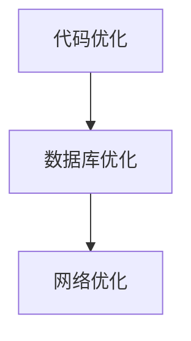

**核心算法原理讲解**：
- **代码优化**：通过优化代码的语法、算法和数据结构，提高程序的运行效率。
- **数据库优化**：通过优化数据库的设计、索引和查询，提高数据库的查询效率。
- **网络优化**：通过优化网络配置、协议和数据传输方式，提高网络的传输效率。

#### 4.3 伪代码示例

```python
# 负载均衡算法
def load_balance(server_list):
    current_server = choose_server(server_list)
    execute_request(current_server)

# 缓存技术算法
def cache_data(data):
    if data_exists_in_cache(data):
        return get_data_from_cache(data)
    else:
        store_data_in_cache(data)
        return data
```

### AI辅助测试工具

#### 5.1 常见的AI辅助测试工具

AI辅助测试工具是AI在软件测试中的具体应用，它能够自动化执行测试、分析测试结果，并提供优化的建议。

**核心概念与联系**：
- **自动化测试框架**：一种提供测试脚本编写和执行的平台。
- **性能分析工具**：一种用于分析软件性能的工具。
- **缺陷预测工具**：一种用于预测软件缺陷的工具。

**Mermaid流程图示例**：

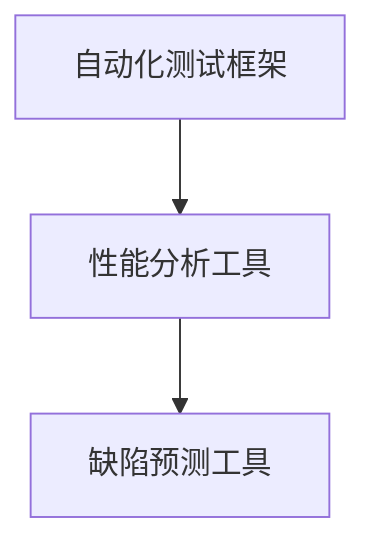

**核心算法原理讲解**：
- **自动化测试框架**：通过编写脚本，自动化执行测试用例。
- **性能分析工具**：通过采集和分析系统性能数据，提供优化建议。
- **缺陷预测工具**：通过分析历史数据，预测软件中的潜在缺陷。

#### 5.2 工具的使用与集成

使用和集成AI辅助测试工具是进行AI辅助软件测试的关键步骤。它需要考虑工具的选择、配置和集成。

**核心概念与联系**：
- **工具的选择**：根据项目的需求选择合适的AI辅助测试工具。
- **工具的配置**：配置工具，使其能够满足项目的需求。
- **工具的集成**：将工具集成到现有的测试流程中。

**Mermaid流程图示例**：

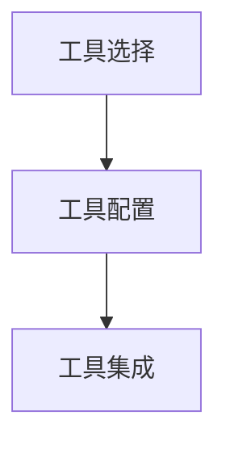

**核心算法原理讲解**：
- **工具的选择**：根据项目的需求，选择具有相关功能的AI辅助测试工具。
- **工具的配置**：配置工具的参数，使其能够满足项目的需求。
- **工具的集成**：将工具集成到现有的测试流程中，确保测试的自动化和连续性。

#### 5.3 工具的优缺点分析

不同的AI辅助测试工具具有不同的优缺点，选择合适的工具需要考虑项目的需求和工具的特性。

**核心概念与联系**：
- **优缺点分析**：分析不同AI辅助测试工具的优缺点。
- **选择策略**：根据项目的需求，选择合适的AI辅助测试工具。

**Mermaid流程图示例**：

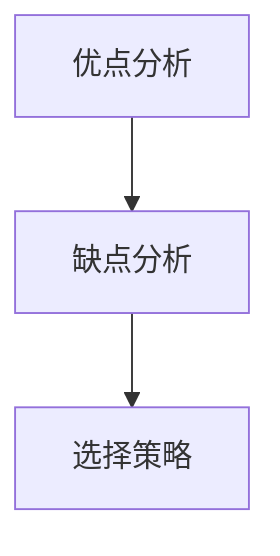

**核心算法原理讲解**：
- **优点分析**：分析不同AI辅助测试工具的优点，如功能丰富、性能高效等。
- **缺点分析**：分析不同AI辅助测试工具的缺点，如学习成本高、适应性问题等。
- **选择策略**：根据项目的需求和工具的特性，选择最合适的AI辅助测试工具。

### 实际应用案例

#### 6.1 案例一：自动化bug检测在Web应用测试中的应用

本案例介绍了一个Web应用的自动化bug检测案例，使用AI技术自动检测Web应用中的缺陷。

**核心概念与联系**：
- **Web应用测试**：对Web应用的功能、性能、安全性等方面进行测试。
- **自动化bug检测**：使用AI技术自动检测Web应用中的缺陷。

**核心算法原理讲解**：
- **自动化bug检测算法**：使用机器学习算法，如决策树、随机森林等，自动检测Web应用中的缺陷。
- **测试用例设计**：设计能够覆盖Web应用主要功能的测试用例。

**项目实战**：
- **开发环境搭建**：安装Python、Selenium等工具。
- **源代码实现**：编写自动化测试脚本，使用Selenium执行Web应用测试。
- **代码解读**：分析自动化测试脚本的执行过程，理解其工作原理。
- **应用解读与分析**：分析自动化测试结果，识别潜在缺陷。
- **项目小结**：总结项目经验，提出改进建议。

#### 6.2 案例二：性能优化在移动应用测试中的应用

本案例介绍了一个移动应用的性能优化案例，使用AI技术对移动应用进行性能优化。

**核心概念与联系**：
- **移动应用测试**：对移动应用的功能、性能、安全性等方面进行测试。
- **性能优化**：通过改进代码、数据库、网络等方面，提高移动应用的性能。

**核心算法原理讲解**：
- **性能优化算法**：使用机器学习算法，如回归分析、神经网络等，优化移动应用的性能。
- **性能测试**：使用工具如Android Studio Profiler，对移动应用进行性能测试。

**项目实战**：
- **开发环境搭建**：安装Android Studio、Python等工具。
- **源代码实现**：编写性能优化脚本，优化移动应用的代码和数据库。
- **代码解读**：分析性能优化脚本的工作原理，理解其优化策略。
- **应用解读与分析**：分析性能优化后的移动应用，评估性能提升效果。
- **项目小结**：总结项目经验，提出改进建议。

#### 6.3 案例三：AI辅助测试在游戏应用测试中的应用

本案例介绍了一个游戏应用的AI辅助测试案例，使用AI技术辅助游戏应用测试。

**核心概念与联系**：
- **游戏应用测试**：对游戏应用的功能、性能、稳定性等方面进行测试。
- **AI辅助测试**：使用AI技术辅助测试用例设计、缺陷预测等。

**核心算法原理讲解**：
- **AI辅助测试算法**：使用机器学习算法，如聚类分析、关联规则挖掘等，辅助测试用例设计和缺陷预测。
- **测试用例设计**：设计能够覆盖游戏应用主要功能的测试用例。

**项目实战**：
- **开发环境搭建**：安装Unity、Python等工具。
- **源代码实现**：编写AI辅助测试脚本，使用Unity执行游戏应用测试。
- **代码解读**：分析AI辅助测试脚本的工作原理，理解其测试策略。
- **应用解读与分析**：分析AI辅助测试结果，识别潜在缺陷。
- **项目小结**：总结项目经验，提出改进建议。

### 总结与展望

#### 7.1 本书总结

本书介绍了AI在软件测试中的应用，特别是自动化bug检测和性能优化。通过分析AI与软件测试的关系，介绍了自动化bug检测和性能优化技术的基本概念、核心算法原理、数学模型，并提供了具体的实际应用案例。

**核心概念与联系**：
- **AI**：一种模拟人类智能的技术，包括机器学习、深度学习、自然语言处理等。
- **软件测试**：一种验证软件是否满足需求和规范的活动，包括功能测试、性能测试、安全测试等。
- **自动化bug检测**：一种利用计算机程序自动检测软件缺陷的方法。
- **性能优化**：一种通过改进软件性能，提高软件运行效率的方法。

**核心算法原理讲解**：
- **机器学习模型**：通过训练模型，使计算机能够自动识别软件中的缺陷。
- **深度学习网络**：通过多层神经网络，提取数据的特征，实现更精确的缺陷检测。
- **性能优化算法**：通过分析性能数据，识别瓶颈并优化。

**项目实战**：
- **Web应用测试**：使用AI技术自动检测Web应用中的缺陷。
- **移动应用测试**：使用AI技术优化移动应用的性能。
- **游戏应用测试**：使用AI技术辅助游戏应用测试。

#### 7.2 AI辅助软件测试的未来趋势

随着AI技术的不断发展，AI辅助软件测试将具有更广泛的应用前景。未来，AI辅助软件测试将更加智能化、自动化，提高软件测试的效率和效果。

**核心概念与联系**：
- **智能化**：AI辅助软件测试将更加智能化，能够自动识别和解决复杂问题。
- **自动化**：AI辅助软件测试将更加自动化，减少人工干预，提高测试效率。

**核心算法原理讲解**：
- **机器学习**：通过不断学习和优化，提高AI辅助软件测试的准确性和效率。
- **深度学习**：通过多层神经网络，提取更复杂的特征，实现更精准的缺陷检测。

#### 7.3 进一步研究方向

未来，AI辅助软件测试的研究方向包括但不限于以下几个方面：

**核心概念与联系**：
- **测试用例生成**：研究自动生成测试用例的方法，提高测试覆盖率。
- **缺陷预测**：研究基于历史数据的缺陷预测方法，提前识别潜在缺陷。
- **性能优化**：研究基于AI的性能优化方法，提高软件的性能和稳定性。

**核心算法原理讲解**：
- **强化学习**：通过试错和反馈，使AI能够自适应地优化测试策略。
- **图神经网络**：通过构建图模型，处理复杂的软件架构和依赖关系。

