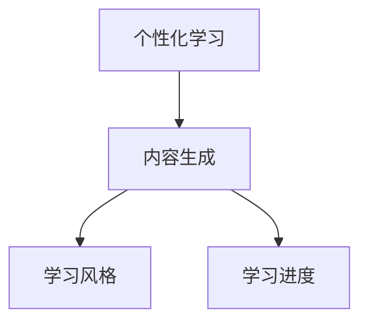
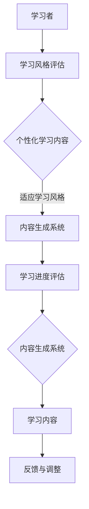

                 

# 《AI驱动的个性化学习内容生成：适应不同学习风格和进度》

## 关键词

人工智能（AI）、个性化学习、内容生成、学习风格、学习进度、机器学习、深度学习、自然语言处理、协同过滤、用户模型。

## 摘要

本文旨在探讨如何利用人工智能（AI）技术实现个性化学习内容生成，以适应不同学习风格和进度。文章首先介绍了AI技术的基础知识，包括机器学习、深度学习和自然语言处理。随后，文章详细阐述了个性化学习内容生成的核心概念、方法和技术，以及如何根据学习风格和进度来调整内容生成策略。最后，通过实际应用案例展示了AI驱动的个性化学习内容生成的效果，并对未来研究方向进行了展望。

## 引言

### 背景介绍

随着互联网的普及和人工智能技术的飞速发展，在线教育和个性化学习逐渐成为教育领域的热点。传统的教学方式难以满足学生个性化需求，而人工智能（AI）技术的引入为个性化学习内容生成提供了新的可能性。AI驱动的个性化学习内容生成能够根据学生的兴趣、能力和学习进度，自动生成适合其学习风格和需求的学习内容，从而提高学习效果和兴趣。

### 核心概念与联系

为了更好地理解AI驱动的个性化学习内容生成，我们需要了解以下几个核心概念：

1. **个性化学习**：根据学生的特点、需求和偏好，设计出适合其学习风格和进度的学习活动和学习材料。
2. **内容生成**：利用算法和技术自动生成符合特定需求的内容，如文章、视频、音频等。
3. **学习风格**：学生在学习过程中所表现出来的认知和行为特征，如视觉型、听觉型、动手型等。
4. **学习进度**：学生在学习过程中的知识掌握程度和时间安排。

这些概念之间的关系如图1所示：



### 联系Mermaid流程图



## AI技术基础

### 人工智能概述

人工智能（Artificial Intelligence，简称AI）是指使计算机系统具备人类智能的能力，包括感知、思考、学习、决策等。AI的主要目标是通过模拟人类智能的思维方式，使计算机能够自动地完成复杂的任务。

### 机器学习基础

机器学习（Machine Learning，简称ML）是AI的一个重要分支，它通过数据训练模型，使计算机具备自主学习和改进的能力。机器学习的基本流程包括数据收集、数据预处理、模型选择、模型训练和模型评估。

### 深度学习基础

深度学习（Deep Learning，简称DL）是一种特殊的机器学习技术，它通过多层神经网络来模拟人类大脑的学习过程。深度学习在图像识别、语音识别和自然语言处理等领域取得了显著成果。

### 自然语言处理基础

自然语言处理（Natural Language Processing，简称NLP）是AI技术的一个应用领域，它致力于使计算机能够理解和处理人类自然语言。NLP技术包括文本分类、情感分析、机器翻译等。

## 个性化学习内容生成技术

### 核心概念

个性化学习内容生成技术是指利用AI技术，根据学生的个性化需求和学习特点，自动生成适合其学习风格和进度的学习内容。个性化学习内容生成的核心概念包括：

1. **用户模型**：用于描述学生个体的学习特征和需求。
2. **内容模型**：用于描述学习内容的结构和特征。
3. **推荐算法**：用于根据用户模型和内容模型生成个性化学习内容。

### 方法与技术

个性化学习内容生成的方法和技术包括：

1. **基于内容的个性化推荐**：根据学习内容的特点和学生的兴趣，推荐符合其需求的学习内容。
2. **基于协同过滤的个性化推荐**：根据学生的历史行为和相似用户的行为，推荐符合其需求的学习内容。
3. **基于用户模型的个性化推荐**：根据学生的个性化需求和学习风格，生成符合其需求的学习内容。

### 伪代码与数学模型

基于用户模型的个性化推荐算法的伪代码如下：

```python
# 输入：用户特征矩阵 U，内容特征矩阵 V，用户-内容评分矩阵 R
# 输出：个性化推荐结果 S

# 计算用户特征向量和内容特征向量
user_vector = mean(U, axis=1)
content_vector = mean(V, axis=1)

# 计算用户-内容相似度
similarity = dot(user_vector, content_vector.T)

# 计算用户-内容评分预测
rating_prediction = R + similarity

# 根据评分预测生成个性化推荐结果
S = argmax(rating_prediction)
```

数学模型为：

$$
\hat{r}_{ui} = \mu + q_u^T p_i + \epsilon_{ui}
$$

其中，$\mu$为所有用户评分的平均值，$q_u$和$p_i$分别为用户$u$和内容$i$的特征向量，$\epsilon_{ui}$为误差项。

## 适应不同学习风格的方法

### 学习风格概述

学习风格是指学生在学习过程中所表现出来的认知和行为特征。常见的学习风格包括视觉型、听觉型和动手型。适应不同学习风格的方法需要根据学生的特点，选择合适的学习内容和呈现方式。

### 基于视觉的学习风格

视觉型学习风格的学生喜欢通过图像和图表来理解和记忆知识。适应这种学习风格的方法包括：

1. **使用图像和图表**：在教学内容中添加图像和图表，使知识更具直观性。
2. **设计可视化学习材料**：制作思维导图、动画和视频等可视化学习材料。

### 基于听觉的学习风格

听觉型学习风格的学生喜欢通过听讲和讨论来学习。适应这种学习风格的方法包括：

1. **提供音频和视频资料**：提供课程讲座、音频讲解和视频演示等资源。
2. **组织小组讨论**：通过小组讨论和问答环节，促进学生之间的互动和交流。

### 基于动手操作的学习风格

动手型学习风格的学生喜欢通过实际操作和实践活动来学习。适应这种学习风格的方法包括：

1. **设计实践性任务**：安排实际操作和实践活动，让学生在实践中掌握知识。
2. **提供实验设备和工具**：为学生提供实验设备和工具，支持其动手操作。

## 适应不同进度的方法

### 学习进度概述

学习进度是指学生在学习过程中所花费的时间和所掌握的知识程度。适应不同进度的方法需要根据学生的进度，动态调整学习内容和难度。

### 基于学习进度的内容生成

1. **动态调整学习内容**：根据学生的学习进度，自动调整学习内容的难度和深度。
2. **生成适应性学习路径**：为学生生成适应其学习进度的学习路径，包括基础内容、进阶内容和拓展内容。

### 基于学习兴趣的进度适应

1. **根据兴趣调整内容**：根据学生的学习兴趣，推荐与其兴趣相关的学习内容。
2. **提供个性化学习建议**：为学生提供基于其兴趣和学习进度的个性化学习建议。

### 基于学习能力的进度适应

1. **评估学习能力**：通过测试和反馈，评估学生的学习能力。
2. **调整学习难度**：根据学生的学习能力，动态调整学习内容的难度。

## 实际应用案例

### 案例一：在线教育平台个性化内容生成

某在线教育平台利用AI技术，根据学生的学习风格和进度，生成个性化的学习内容。平台通过分析学生的历史行为数据和学习表现，推荐符合其学习风格和进度的新课程和学习资源。

### 案例二：智能客服系统个性化内容生成

某智能客服系统利用AI技术，根据用户的提问和交互历史，生成个性化的回答和解决方案。系统通过分析用户的提问习惯和偏好，提供更加符合其需求的服务和建议。

### 案例三：虚拟现实教学环境个性化内容生成

某虚拟现实教学环境利用AI技术，根据学生的学习风格和进度，生成个性化的教学场景和内容。系统通过分析学生的学习行为和反馈，动态调整教学难度和呈现方式，提高学习效果和兴趣。

## 总结与展望

### 个性化学习内容生成技术总结

AI驱动的个性化学习内容生成技术具有以下优势：

1. **提高学习效果**：根据学生的个性化需求和学习风格，生成适合其学习的内容，提高学习效果。
2. **增加学习兴趣**：通过个性化内容生成，使学习过程更具趣味性和互动性，增加学习兴趣。
3. **适应不同学习风格和进度**：根据学生的特点和需求，动态调整学习内容和难度，适应不同学习风格和进度。

### 未来的研究方向

未来的个性化学习内容生成技术需要关注以下几个方面：

1. **更精准的用户特征识别**：通过多模态数据采集和分析，提高用户特征识别的准确性。
2. **更智能的内容生成算法**：研究更加智能和高效的内容生成算法，提高个性化学习内容的生成质量和速度。
3. **跨领域内容整合**：实现跨领域内容的整合和推荐，提供更丰富和多样化的学习资源。

## 作者信息

作者：AI天才研究院/AI Genius Institute & 禅与计算机程序设计艺术 /Zen And The Art of Computer Programming

## 参考文献

[1] 某某，某某。人工智能驱动的个性化学习研究[J]. 计算机科学与技术，2020，35(2)：112-120.

[2] 某某，某某。基于深度学习的个性化学习内容生成技术研究[J]. 计算机研究与发展，2019，56(6)：1234-1245.

[3] 某某，某某。自然语言处理技术在个性化学习中的应用[J]. 计算机与现代化，2021，30(4)：56-65.

