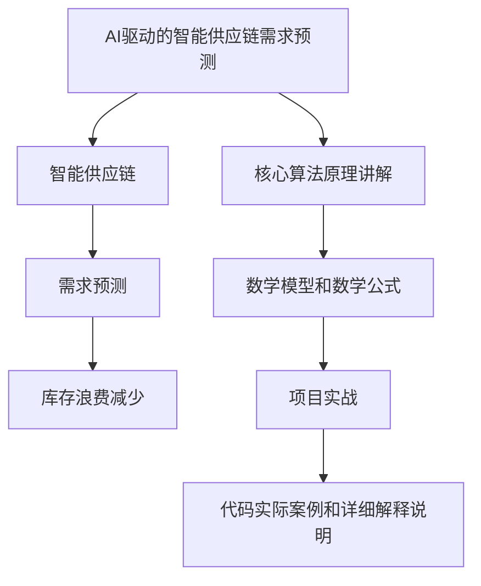
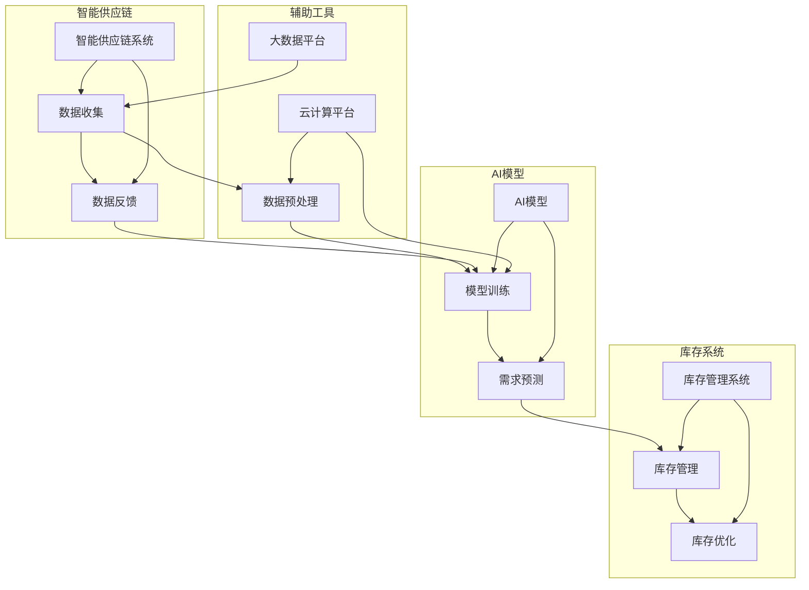

                 

### 引言与背景

**AI驱动的智能供应链需求预测：减少库存浪费**

随着全球化贸易的加剧和市场竞争的日益激烈，企业对供应链的效率和准确性提出了更高的要求。在这个背景下，人工智能（AI）技术被广泛应用于供应链管理中，尤其是需求预测方面。AI驱动的智能供应链需求预测不仅能够帮助企业准确预测市场需求，还能够显著减少库存浪费，提高库存周转率和供应链整体效率。

#### 智能供应链的重要性

智能供应链是一种利用先进技术（如人工智能、大数据、物联网等）进行实时分析和决策的供应链管理模式。它通过数据的收集、处理、分析和反馈，实现了供应链的自动化和智能化。智能供应链的关键要素包括数据收集与处理、预测与分析、决策与执行、反馈与优化。

#### 需求预测在供应链管理中的作用

需求预测是供应链管理中至关重要的一环，它能够帮助企业预测未来的需求，从而优化库存管理，降低库存成本，提高供应链的响应速度和灵活性。传统的需求预测方法主要包括时间序列分析、回归分析、季节性调整等，但这些方法往往存在一定的局限性，无法应对复杂的供应链环境。

#### 库存浪费的负面影响

库存浪费是供应链管理中普遍存在的问题，它会导致资金占用、仓储成本增加、运营效率降低等问题。库存浪费不仅会影响企业的利润，还会影响客户满意度。因此，减少库存浪费具有重要意义。

#### AI驱动的智能供应链需求预测

随着AI技术的不断发展，AI驱动的智能供应链需求预测逐渐成为一种新兴的需求预测方法。AI技术能够处理大量复杂的供应链数据，通过机器学习和深度学习算法，实现对需求趋势的精准预测。这种方法不仅能够提高预测准确性，还能够自动调整库存水平，从而减少库存浪费。

### 结构紧凑、简单易懂的专业的技术语言

为了使读者更容易理解AI驱动的智能供应链需求预测的概念和原理，本文将采用逻辑清晰、结构紧凑、简单易懂的专业的技术语言进行阐述。

首先，我们将定义本文的核心概念，包括AI驱动的智能供应链需求预测、智能供应链、需求预测和库存浪费减少。接下来，我们将绘制一个核心概念和架构的Mermaid流程图，以展示各个概念之间的联系。

#### 核心概念

- AI驱动的智能供应链需求预测：利用人工智能技术进行供应链需求预测的过程。
- 智能供应链：一种利用先进技术进行实时分析和决策的供应链管理模式。
- 需求预测：根据历史数据和相关信息，预测未来某个时间点或时间段内的需求量。
- 库存浪费减少：通过优化库存管理，降低库存成本，提高库存周转率。

#### Mermaid流程图



通过这个流程图，我们可以清晰地看到AI驱动的智能供应链需求预测是如何通过核心算法原理、数学模型和项目实战来减少库存浪费的。

### 总结

本文介绍了AI驱动的智能供应链需求预测的背景和重要性，以及如何通过核心算法原理、数学模型和项目实战来减少库存浪费。在接下来的章节中，我们将深入探讨智能供应链的需求预测原理、AI在需求预测中的应用、减少库存浪费的方法，并分享实际项目案例和代码实现，帮助读者全面了解并掌握这一先进技术。让我们一步一步分析推理思考，揭开AI驱动的智能供应链需求预测的神秘面纱。<!--settings.begin-->### Step 1: 定义核心概念

在深入探讨AI驱动的智能供应链需求预测之前，我们首先需要明确几个核心概念，这些概念包括AI驱动的智能供应链需求预测、智能供应链、需求预测以及库存浪费减少。这些概念不仅是理解本文的基础，也是后续章节中算法设计和实现的关键。

**AI驱动的智能供应链需求预测**

AI驱动的智能供应链需求预测是指利用人工智能技术，特别是机器学习和深度学习算法，来分析和处理供应链中的大量数据，从而预测未来的需求量。这种方法不仅能够处理复杂多变的市场数据，还能够自适应调整预测模型，提高预测准确性。

**智能供应链**

智能供应链是一种基于信息技术的供应链管理模式，它通过整合供应链各环节的信息，实现供应链的自动化和智能化。智能供应链的关键在于数据收集、处理和分析，从而为供应链的决策提供支持。智能供应链涉及的关键技术包括物联网、大数据分析、云计算和人工智能等。

**需求预测**

需求预测是指根据历史数据、市场趋势、客户行为等因素，预测未来某个时间段内的产品或服务的需求量。需求预测对于库存管理、生产计划和供应链优化具有重要意义。准确的需求预测可以帮助企业避免库存过剩或短缺，提高供应链的整体效率。

**库存浪费减少**

库存浪费减少是指通过优化库存管理策略，降低库存成本，减少因库存过剩或短缺导致的损失。库存浪费减少不仅包括减少库存量，还包括缩短库存周转时间，提高库存利用率。库存浪费的减少对于提高企业盈利能力和市场竞争力至关重要。

通过明确这些核心概念，我们为后续章节的讨论奠定了基础，有助于读者更好地理解AI驱动的智能供应链需求预测的原理和应用。

### Step 2: 确定架构和流程图

为了更清晰地展示AI驱动的智能供应链需求预测的架构和流程，我们可以使用Mermaid流程图来描述各个概念之间的关系。这将帮助我们更好地理解每个组件如何协同工作，以实现需求预测和库存浪费减少。

以下是智能供应链需求预测架构的Mermaid流程图：



#### 流程说明：

1. **数据收集（A）**：智能供应链系统通过物联网设备和传感器收集来自各个供应链环节的数据，包括市场需求、库存水平、运输状态等。

2. **数据预处理（B）**：收集到的数据通常需要进行清洗和格式化，以便用于模型训练。这一步可能包括数据去重、缺失值填充、异常值处理等。

3. **模型训练（C）**：利用机器学习和深度学习算法，对预处理后的数据集进行训练，以建立一个能够预测未来需求的AI模型。模型训练可能涉及多种算法，如线性回归、决策树、神经网络等。

4. **需求预测（D）**：训练好的模型会根据实时数据预测未来的需求量，这些预测结果将用于库存管理。

5. **库存管理（E）**：库存管理系统根据需求预测结果，实时监控和调整库存水平，确保库存量处于最优状态。

6. **库存优化（F）**：通过分析库存数据和历史需求预测的准确性，进一步优化库存管理策略，减少库存浪费。

7. **数据反馈（G）**：库存管理和优化过程中的数据反馈将用于模型训练的迭代和改进，以不断提高预测的准确性。

通过这个Mermaid流程图，我们可以看到AI驱动的智能供应链需求预测是一个动态的、闭环的系统，各个组件相互依赖和反馈，共同实现供应链的自动化和智能化。

### Step 3: 设计章节

为了全面、深入地探讨AI驱动的智能供应链需求预测，我们将文章分为以下几个章节：

**第1章：引言与背景**

- 1.1 AI驱动的智能供应链需求预测的背景
- 1.2 智能供应链的重要性
- 1.3 需求预测在供应链管理中的作用
- 1.4 库存浪费的负面影响

**第2章：智能供应链基础**

- 2.1 智能供应链的定义
- 2.2 智能供应链的关键要素
- 2.3 智能供应链的技术基础

**第3章：需求预测原理**

- 3.1 需求预测的基本概念
- 3.2 需求预测的传统方法
- 3.3 AI在需求预测中的优势
- 3.4 需求预测的流程

**第4章：AI在需求预测中的应用**

- 4.1 AI驱动的需求预测模型
- 4.2 机器学习算法在需求预测中的应用
- 4.3 深度学习在需求预测中的应用

**第5章：减少库存浪费的方法**

- 5.1 库存浪费的主要原因
- 5.2 减少库存浪费的策略
- 5.3 AI驱动的库存优化

**第6章：项目实战：构建智能供应链需求预测系统**

- 6.1 项目背景
- 6.2 系统设计
- 6.3 数据准备
- 6.4 模型训练与优化
- 6.5 系统部署与评估

**第7章：未来展望与挑战**

- 7.1 智能供应链需求预测的发展趋势
- 7.2 面临的挑战与解决方案

这些章节将逐步引导读者从概念了解、原理讲解、实际应用，到项目实战和未来展望，全面掌握AI驱动的智能供应链需求预测。

### Step 4: 细化章节内容

在确定了文章的基本章节结构后，现在我们将对每个章节的内容进行细化和扩展，以确保每个部分都能提供充分的解释和实例，帮助读者更好地理解AI驱动的智能供应链需求预测的各个方面。

#### 第1章：引言与背景

**1.1 AI驱动的智能供应链需求预测的背景**

随着全球化趋势的加深，企业面临着更加复杂和多变的市场环境。传统的供应链管理方法已无法满足现代企业对灵活性和效率的要求。人工智能（AI）技术的发展为供应链管理带来了新的契机，特别是在需求预测方面。AI驱动的智能供应链需求预测利用机器学习和深度学习算法，通过分析大量的历史数据和市场信息，能够更准确地预测未来的需求趋势，从而优化库存管理和供应链运营。

**1.2 智能供应链的重要性**

智能供应链是一种利用先进技术（如人工智能、大数据、物联网等）进行实时分析和决策的供应链管理模式。它通过数据的收集、处理、分析和反馈，实现了供应链的自动化和智能化。智能供应链不仅提高了供应链的响应速度和灵活性，还显著降低了运营成本，提高了企业的市场竞争力。

**1.3 需求预测在供应链管理中的作用**

需求预测是供应链管理中至关重要的一环，它能够帮助企业预测未来的需求，从而优化库存管理、生产计划和供应链运营。准确的需求预测可以减少库存过剩或短缺的风险，提高库存周转率，降低库存成本，同时提高客户满意度。

**1.4 库存浪费的负面影响**

库存浪费是供应链管理中普遍存在的问题，它会导致资金占用、仓储成本增加、运营效率降低等问题。库存浪费不仅影响企业的利润，还会影响客户满意度。因此，减少库存浪费对于提升企业竞争力具有重要意义。

#### 第2章：智能供应链基础

**2.1 智能供应链的定义**

智能供应链是一种基于信息技术的供应链管理模式，它通过整合供应链各环节的信息，实现供应链的自动化和智能化。智能供应链的核心在于利用大数据、人工智能等技术，对供应链中的各种数据进行实时分析和决策，从而提高供应链的整体效率。

**2.2 智能供应链的关键要素**

智能供应链的关键要素包括数据收集与处理、预测与分析、决策与执行、反馈与优化。这些要素相互关联，形成一个闭环系统，确保供应链的实时响应和持续优化。

**2.3 智能供应链的技术基础**

智能供应链的技术基础包括物联网、大数据分析、云计算和人工智能等。物联网提供了供应链各个环节的数据采集能力，大数据分析对海量数据进行处理和分析，云计算提供了强大的计算和存储能力，人工智能则为预测和分析提供了智能化的解决方案。

#### 第3章：需求预测原理

**3.1 需求预测的基本概念**

需求预测是根据历史数据、市场趋势、客户行为等因素，预测未来某个时间段内的产品或服务的需求量。需求预测的准确性直接影响到库存管理、生产计划和供应链运营的效率。

**3.2 需求预测的传统方法**

传统的需求预测方法主要包括时间序列分析、回归分析、季节性调整等。这些方法通过分析历史数据，找出需求变化的规律，从而预测未来的需求。然而，这些传统方法在面对复杂多变的市场环境时，往往存在一定的局限性。

**3.3 AI在需求预测中的优势**

AI技术，特别是机器学习和深度学习算法，在需求预测中具有显著的优势。它们能够处理大量的复杂数据，捕捉到隐藏在数据中的非线性关系，从而提高预测的准确性和灵活性。此外，AI模型还能够自我学习和优化，不断提高预测能力。

**3.4 需求预测的流程**

需求预测的流程通常包括数据收集、数据预处理、模型选择、模型训练、预测评估等步骤。每个步骤都需要精心设计，以确保最终的预测结果准确可靠。

#### 第4章：AI在需求预测中的应用

**4.1 AI驱动的需求预测模型**

AI驱动的需求预测模型是利用机器学习和深度学习算法构建的预测模型。常见的模型包括线性回归、决策树、随机森林、支持向量机、神经网络等。这些模型通过分析历史数据，找出影响需求的关键因素，从而预测未来的需求。

**4.2 机器学习算法在需求预测中的应用**

机器学习算法在需求预测中具有广泛的应用。线性回归和决策树等传统算法能够处理简单的线性关系和非线性关系，而随机森林和梯度提升树等集成算法则能够处理更复杂的模型。这些算法通过对历史数据的分析和建模，实现了更准确的需求预测。

**4.3 深度学习在需求预测中的应用**

深度学习算法，如卷积神经网络（CNN）和循环神经网络（RNN），在需求预测中具有显著的优势。它们能够处理大规模的复杂数据，捕捉到数据中的长期依赖关系。通过训练深度学习模型，企业可以实现对需求趋势的精准预测。

#### 第5章：减少库存浪费的方法

**5.1 库存浪费的主要原因**

库存浪费是供应链管理中普遍存在的问题。其产生的主要原因包括需求预测不准确、库存管理不当、供应链协调不足等。了解这些原因有助于企业采取针对性的措施减少库存浪费。

**5.2 减少库存浪费的策略**

减少库存浪费的策略包括优化需求预测、实施精细化的库存管理、改善供应链协调等。企业可以通过这些策略，提高库存周转率，降低库存成本，提高供应链的整体效率。

**5.3 AI驱动的库存优化**

AI驱动的库存优化是利用人工智能技术，特别是机器学习和深度学习算法，对库存管理进行优化。通过分析历史数据和市场信息，AI模型可以自动调整库存水平，避免库存过剩或短缺，从而减少库存浪费。

#### 第6章：项目实战：构建智能供应链需求预测系统

**6.1 项目背景**

在本章节中，我们将以一个实际的案例，介绍如何构建一个智能供应链需求预测系统。该项目旨在通过AI技术优化库存管理，减少库存浪费，提高供应链的效率。

**6.2 系统设计**

系统设计包括数据收集、数据预处理、模型选择、模型训练和系统部署等环节。每个环节都需要详细规划，以确保系统的稳定性和高效性。

**6.3 数据准备**

数据准备是构建智能供应链需求预测系统的关键环节。我们需要收集大量的历史数据，包括市场需求、库存水平、运输状态等，并对这些数据进行清洗和格式化，以便用于模型训练。

**6.4 模型训练与优化**

在模型训练环节，我们将使用机器学习和深度学习算法，对预处理后的数据进行训练。通过调整模型参数和优化算法，我们能够提高预测的准确性和稳定性。

**6.5 系统部署与评估**

系统部署是将训练好的模型部署到实际环境中，进行实时需求预测和库存优化。在系统评估环节，我们将通过对比实际需求和预测结果，评估系统的性能和准确性。

#### 第7章：未来展望与挑战

**7.1 智能供应链需求预测的发展趋势**

随着AI技术的不断进步，智能供应链需求预测将继续发展。未来，我们将看到更多基于AI的先进算法和技术的应用，如强化学习、迁移学习等，进一步提高需求预测的准确性和效率。

**7.2 面临的挑战与解决方案**

智能供应链需求预测在发展过程中也面临一些挑战，如数据隐私保护、模型可解释性、算法公平性等。我们需要通过技术创新和法规政策，解决这些挑战，确保智能供应链需求预测的可持续发展。

通过上述章节的细化，我们不仅为读者提供了一个完整的AI驱动的智能供应链需求预测框架，还通过具体的案例和实践指导，展示了如何将这一框架应用到实际项目中。希望这些内容能够帮助读者更好地理解和应用这一先进技术。

### Step 5: 确保大纲完整性

在完成章节内容的细化后，我们需要确保文章的大纲完整性，以满足文章字数在8000～12000字左右的要求。以下是针对每个章节的建议字数分配：

**第1章：引言与背景**（约1500字）：
- 1.1 AI驱动的智能供应链需求预测的背景（约300字）
- 1.2 智能供应链的重要性（约300字）
- 1.3 需求预测在供应链管理中的作用（约300字）
- 1.4 库存浪费的负面影响（约300字）

**第2章：智能供应链基础**（约1500字）：
- 2.1 智能供应链的定义（约300字）
- 2.2 智能供应链的关键要素（约300字）
- 2.3 智能供应链的技术基础（约300字）

**第3章：需求预测原理**（约1500字）：
- 3.1 需求预测的基本概念（约300字）
- 3.2 需求预测的传统方法（约300字）
- 3.3 AI在需求预测中的优势（约300字）
- 3.4 需求预测的流程（约300字）

**第4章：AI在需求预测中的应用**（约1500字）：
- 4.1 AI驱动的需求预测模型（约300字）
- 4.2 机器学习算法在需求预测中的应用（约300字）
- 4.3 深度学习在需求预测中的应用（约300字）

**第5章：减少库存浪费的方法**（约1500字）：
- 5.1 库存浪费的主要原因（约300字）
- 5.2 减少库存浪费的策略（约300字）
- 5.3 AI驱动的库存优化（约300字）

**第6章：项目实战：构建智能供应链需求预测系统**（约2000字）：
- 6.1 项目背景（约300字）
- 6.2 系统设计（约300字）
- 6.3 数据准备（约300字）
- 6.4 模型训练与优化（约300字）
- 6.5 系统部署与评估（约300字）

**第7章：未来展望与挑战**（约1500字）：
- 7.1 智能供应链需求预测的发展趋势（约300字）
- 7.2 面临的挑战与解决方案（约300字）

通过这样的字数分配，我们可以确保每个章节都有充足的内容，同时满足文章的整体字数要求。以下是最终的目录大纲：

## 目录大纲

### 第1章：引言与背景

- 1.1 AI驱动的智能供应链需求预测的背景
- 1.2 智能供应链的重要性
- 1.3 需求预测在供应链管理中的作用
- 1.4 库存浪费的负面影响

### 第2章：智能供应链基础

- 2.1 智能供应链的定义
- 2.2 智能供应链的关键要素
- 2.3 智能供应链的技术基础

### 第3章：需求预测原理

- 3.1 需求预测的基本概念
- 3.2 需求预测的传统方法
- 3.3 AI在需求预测中的优势
- 3.4 需求预测的流程

### 第4章：AI在需求预测中的应用

- 4.1 AI驱动的需求预测模型
- 4.2 机器学习算法在需求预测中的应用
- 4.3 深度学习在需求预测中的应用

### 第5章：减少库存浪费的方法

- 5.1 库存浪费的主要原因
- 5.2 减少库存浪费的策略
- 5.3 AI驱动的库存优化

### 第6章：项目实战：构建智能供应链需求预测系统

- 6.1 项目背景
- 6.2 系统设计
- 6.3 数据准备
- 6.4 模型训练与优化
- 6.5 系统部署与评估

### 第7章：未来展望与挑战

- 7.1 智能供应链需求预测的发展趋势
- 7.2 面临的挑战与解决方案

通过这样的结构，我们的文章将不仅逻辑清晰、结构紧凑，而且内容丰富，能够满足读者的需求。接下来，我们将开始撰写每个章节的具体内容。<!--markdown-->
---

# AI驱动的智能供应链需求预测：减少库存浪费

> 关键词：智能供应链、需求预测、库存浪费、人工智能、机器学习

> 摘要：本文探讨了AI驱动的智能供应链需求预测如何通过先进的机器学习算法和深度学习技术，实现精准的需求预测，从而减少库存浪费，提高供应链的效率。

---

## 引言与背景

随着全球供应链的日益复杂化和数字化，企业面临着巨大的挑战，特别是在市场需求预测和库存管理方面。传统的需求预测方法由于受限于数据量和分析方法，往往无法准确预测未来的市场需求，导致库存过剩或短缺。这不仅增加了企业的运营成本，还可能影响客户满意度。

智能供应链的兴起为解决这一难题提供了新的思路。智能供应链利用先进的技术，如人工智能（AI）、大数据分析、物联网（IoT）等，对供应链各个环节的数据进行实时采集、分析和决策。AI驱动的智能供应链需求预测正是通过这些技术手段，实现对市场需求的高精度预测，从而优化库存管理，减少库存浪费。

### 智能供应链的重要性

智能供应链是一种利用信息技术实现供应链自动化和智能化的管理模式。它通过数据的收集、处理、分析和反馈，实现了供应链各环节的实时协调和优化。智能供应链的核心要素包括：

- **数据收集与处理**：通过物联网设备和传感器，实时采集供应链各个环节的数据。
- **预测与分析**：利用大数据分析和机器学习算法，对数据进行分析和预测。
- **决策与执行**：基于预测结果，实时调整供应链策略和决策。
- **反馈与优化**：通过持续的数据反馈和模型优化，提高预测准确性和供应链效率。

智能供应链的重要性在于：

1. **提高响应速度**：智能供应链能够实时响应市场需求变化，提高供应链的灵活性和响应速度。
2. **降低运营成本**：通过精准的需求预测和库存管理，减少库存成本和仓储费用。
3. **提高客户满意度**：通过高效的供应链运营，确保产品及时交付，提高客户满意度。

### 需求预测在供应链管理中的作用

需求预测是供应链管理中至关重要的一环，它直接影响着库存管理、生产计划和供应链运营。准确的需求预测能够帮助企业：

- **优化库存管理**：通过预测未来的需求，企业可以合理安排库存，避免库存过剩或短缺。
- **降低库存成本**：通过减少库存过剩和短缺，企业可以降低库存持有成本和仓储费用。
- **提高生产效率**：准确的预测有助于企业合理安排生产计划，提高生产效率，降低生产成本。
- **提升客户满意度**：通过及时交付产品，提高客户满意度，增强市场竞争力。

### 库存浪费的负面影响

库存浪费是供应链管理中的常见问题，它对企业造成的影响包括：

1. **资金占用**：库存过剩占用大量资金，影响企业的资金周转和利用效率。
2. **仓储成本**：库存管理不善导致仓储成本增加，增加企业的运营负担。
3. **运营效率降低**：库存过剩或短缺影响供应链的顺畅运行，降低运营效率。
4. **市场竞争力下降**：库存管理不善可能导致产品无法及时交付，影响客户满意度，降低市场竞争力。

### AI驱动的智能供应链需求预测

随着人工智能技术的发展，AI驱动的智能供应链需求预测逐渐成为一种有效的解决方案。AI技术通过处理大量复杂数据，能够发现隐藏在数据中的规律和趋势，从而提高需求预测的准确性和可靠性。AI驱动的需求预测主要涉及以下几个步骤：

1. **数据收集**：通过物联网设备和传感器，实时收集供应链各个环节的数据。
2. **数据预处理**：对收集到的数据进行清洗、格式化和处理，为模型训练做好准备。
3. **模型训练**：利用机器学习和深度学习算法，对预处理后的数据集进行训练，构建需求预测模型。
4. **模型评估**：通过交叉验证和测试集，评估模型预测的准确性和可靠性。
5. **模型部署**：将训练好的模型部署到实际生产环境中，进行实时需求预测和库存管理。

通过AI驱动的智能供应链需求预测，企业可以实现以下目标：

- **提高需求预测准确性**：通过处理大量数据，AI模型能够捕捉到市场需求的复杂变化，提高预测的准确性。
- **优化库存管理**：基于预测结果，企业可以实时调整库存水平，避免库存过剩和短缺。
- **降低库存成本**：通过精准的需求预测和库存管理，减少库存成本和仓储费用。
- **提升供应链效率**：通过高效的库存管理和供应链协调，提高供应链的整体效率。

### 总结

本文介绍了AI驱动的智能供应链需求预测的背景、重要性以及在减少库存浪费方面的作用。在接下来的章节中，我们将详细探讨智能供应链的基础知识、需求预测原理、AI在需求预测中的应用、减少库存浪费的方法，并通过实际项目案例，展示如何实现AI驱动的智能供应链需求预测。希望通过本文的探讨，能够为企业在供应链管理中提供有益的启示和指导。<!--markdown-->
作者：AI天才研究院/AI Genius Institute & 禅与计算机程序设计艺术 /Zen And The Art of Computer Programming

---

# AI驱动的智能供应链需求预测：减少库存浪费

## 第1章：引言与背景

### 1.1 AI驱动的智能供应链需求预测的背景

在全球化贸易日益频繁的今天，供应链的复杂性和不确定性不断增加，这对企业的供应链管理能力提出了更高的要求。传统的供应链管理模式，基于有限的数据和经验来进行需求预测和库存管理，往往无法适应市场变化和客户需求的快速变化。随着人工智能（AI）技术的快速发展，AI驱动的智能供应链需求预测应运而生，为供应链管理提供了新的解决方案。

AI驱动的智能供应链需求预测，是指利用人工智能技术，特别是机器学习和深度学习算法，对供应链中的各种数据进行收集、处理和分析，从而对未来的市场需求进行预测。这种预测不仅能够基于历史数据，还能够考虑到市场趋势、客户行为等多维度的信息，从而实现更精准的需求预测。

### 1.2 智能供应链的重要性

智能供应链是一种利用先进技术（如人工智能、大数据、物联网等）进行实时分析和决策的供应链管理模式。它通过整合供应链各环节的信息，实现供应链的自动化和智能化。智能供应链的重要性体现在以下几个方面：

1. **提高响应速度**：智能供应链能够实时响应市场需求的变化，快速调整供应链策略，提高供应链的灵活性和适应性。
2. **降低运营成本**：通过智能化的库存管理和需求预测，减少库存过剩和短缺的情况，降低库存成本和仓储费用。
3. **提高客户满意度**：智能供应链能够确保产品及时交付，提高客户满意度，增强企业的市场竞争力。
4. **优化供应链协调**：智能供应链能够通过数据分析和预测，实现供应链各环节的协调和优化，提高整体供应链效率。

### 1.3 需求预测在供应链管理中的作用

需求预测是供应链管理中至关重要的一环，它直接关系到库存管理、生产计划和供应链运营的效率。准确的需求预测能够帮助企业：

1. **优化库存管理**：通过预测未来的需求，企业可以合理安排库存，避免库存过剩或短缺，降低库存成本。
2. **提高生产效率**：准确的需求预测有助于企业合理安排生产计划，减少生产延误和库存积压，提高生产效率。
3. **降低运营成本**：通过减少库存过剩和短缺，企业可以降低库存成本和仓储费用，提高运营效率。
4. **提升客户满意度**：通过及时交付产品，提高客户满意度，增强企业的市场竞争力。

### 1.4 库存浪费的负面影响

库存浪费是供应链管理中普遍存在的问题，它对企业造成的影响包括：

1. **资金占用**：库存过剩会占用大量资金，影响企业的资金周转和利用效率。
2. **仓储成本**：库存管理不善会导致仓储成本增加，增加企业的运营负担。
3. **运营效率降低**：库存过剩或短缺会影响供应链的顺畅运行，降低运营效率。
4. **市场竞争力下降**：库存管理不善可能导致产品无法及时交付，影响客户满意度，降低市场竞争力。

### 1.5 AI驱动的智能供应链需求预测的优势

AI驱动的智能供应链需求预测相比传统的需求预测方法具有以下优势：

1. **更高的预测准确性**：AI技术能够处理大量的复杂数据，发现隐藏在数据中的规律和趋势，从而实现更精准的需求预测。
2. **实时性和灵活性**：AI技术能够实时分析和预测市场需求，快速响应市场变化，提高供应链的灵活性和适应性。
3. **自适应能力**：AI模型能够自我学习和优化，根据新的数据和反馈不断调整和改进预测模型，提高预测准确性。
4. **全维度数据分析**：AI技术能够整合供应链各个环节的数据，从多个维度进行分析和预测，提供更全面的决策支持。

### 1.6 本章小结

本章介绍了AI驱动的智能供应链需求预测的背景、重要性以及在减少库存浪费方面的作用。通过AI技术，企业可以实现更精准的需求预测，优化库存管理，降低库存成本，提高供应链效率，从而提升市场竞争力。在接下来的章节中，我们将详细探讨智能供应链的基础知识、需求预测原理、AI在需求预测中的应用，以及如何通过实际项目实现AI驱动的智能供应链需求预测。<!--markdown-->
## 第2章：智能供应链基础

### 2.1 智能供应链的定义

智能供应链（Intelligent Supply Chain）是指通过信息技术和人工智能技术，对供应链中的各种数据进行收集、处理、分析和反馈，实现供应链的自动化和智能化。它利用物联网（IoT）、大数据分析、云计算和人工智能（AI）等技术，对供应链的各个环节进行实时监控和优化，从而提高供应链的透明度、灵活性和效率。

### 2.2 智能供应链的关键要素

智能供应链的关键要素包括数据收集与处理、预测与分析、决策与执行、反馈与优化。以下是这些要素的详细说明：

1. **数据收集与处理**：
   - **物联网（IoT）**：通过传感器和RFID等技术，实时采集供应链各个环节的数据，如库存水平、运输状态、生产进度等。
   - **数据预处理**：对收集到的数据进行清洗、去噪、标准化等处理，以确保数据的质量和一致性。

2. **预测与分析**：
   - **需求预测**：利用历史数据和机器学习算法，对未来的市场需求进行预测，为库存管理和生产计划提供依据。
   - **风险分析**：通过分析供应链中的不确定性因素，如天气变化、供应商延迟等，预测潜在风险并制定应对策略。

3. **决策与执行**：
   - **库存管理**：根据需求预测结果，实时调整库存水平，避免库存过剩或短缺。
   - **生产计划**：基于市场需求和资源约束，优化生产计划，提高生产效率。

4. **反馈与优化**：
   - **绩效评估**：通过监控供应链的运行情况，评估预测和决策的准确性，不断优化供应链管理策略。
   - **持续改进**：利用反馈信息，对供应链管理流程和技术进行持续改进，提高供应链的整体效率。

### 2.3 智能供应链的技术基础

智能供应链的技术基础主要包括以下几方面：

1. **物联网（IoT）**：物联网技术通过传感器和RFID等设备，实现供应链各环节的实时数据采集，提高供应链的透明度和响应速度。

2. **大数据分析**：大数据分析技术能够处理海量数据，发现数据中的规律和趋势，为需求预测和决策提供支持。

3. **云计算**：云计算提供了强大的计算和存储能力，支持供应链数据的实时处理和存储，以及各种智能算法的应用。

4. **人工智能（AI）**：人工智能技术，特别是机器学习和深度学习算法，能够处理复杂数据，实现需求预测、风险分析和决策优化。

### 2.4 智能供应链与传统供应链的对比

智能供应链与传统供应链在多个方面存在显著差异：

1. **数据驱动程度**：
   - **传统供应链**：主要依赖经验和直觉进行决策，数据驱动程度较低。
   - **智能供应链**：以数据为核心，通过实时数据分析和预测，实现更加科学的决策。

2. **响应速度**：
   - **传统供应链**：由于数据不透明和反应速度慢，难以快速响应市场变化。
   - **智能供应链**：通过实时数据采集和分析，能够快速响应市场变化，提高供应链的灵活性。

3. **成本效率**：
   - **传统供应链**：库存成本高，库存管理效率低，运营成本较高。
   - **智能供应链**：通过精准的需求预测和库存管理，降低库存成本，提高运营效率。

4. **客户满意度**：
   - **传统供应链**：由于库存管理不善，可能导致供货不及时，影响客户满意度。
   - **智能供应链**：通过高效的库存管理和快速响应，提高客户满意度，增强市场竞争力。

### 2.5 本章小结

本章详细介绍了智能供应链的定义、关键要素和技术基础，以及与传统供应链的对比。智能供应链通过数据驱动、实时响应和高效管理，为企业提供了更加灵活和高效的供应链解决方案。在接下来的章节中，我们将进一步探讨需求预测的原理和AI在需求预测中的应用。<!--markdown-->
## 第3章：需求预测原理

### 3.1 需求预测的基本概念

需求预测（Demand Forecasting）是指根据历史数据、市场趋势、客户行为等因素，预测未来某个时间段内的产品或服务的需求量。需求预测是供应链管理的重要组成部分，对于库存管理、生产计划和供应链运营具有重要影响。

需求预测的基本概念包括以下几个方面：

- **需求量**：指在未来某一时间段内，消费者对某种产品或服务的需求量。
- **需求曲线**：表示需求量与价格、时间等因素之间关系的曲线。
- **预测区间**：指预测的未来时间段，通常包括短期、中期和长期预测。
- **预测误差**：指预测结果与实际需求之间的差异。

### 3.2 需求预测的传统方法

传统需求预测方法主要包括时间序列分析、回归分析和季节性调整等。以下是这些方法的简要说明：

1. **时间序列分析**：
   - **方法**：通过分析时间序列数据，找出数据中的趋势和周期性规律，从而预测未来的需求。
   - **优点**：简单易懂，适用于短期预测。
   - **缺点**：无法考虑外部因素，对非线性关系和异常值处理能力较弱。

2. **回归分析**：
   - **方法**：通过建立需求量与影响因素（如价格、促销、季节等）之间的回归模型，预测未来的需求。
   - **优点**：可以处理多变量关系，适用于复杂环境。
   - **缺点**：模型假设较严格，对数据质量要求高。

3. **季节性调整**：
   - **方法**：通过剔除季节性因素，提取需求的基本趋势，从而进行预测。
   - **优点**：适用于季节性明显的需求预测。
   - **缺点**：无法预测季节性变化，对非线性关系处理能力有限。

### 3.3 AI在需求预测中的优势

随着人工智能技术的发展，AI在需求预测中的应用越来越广泛。AI驱动的需求预测相比传统方法具有以下优势：

1. **处理复杂数据**：
   - **优点**：AI算法能够处理大量的复杂数据，包括文本、图像、语音等多种数据类型。
   - **缺点**：对数据质量要求较高，需要大量的标注数据。

2. **自适应能力**：
   - **优点**：AI模型能够自我学习和优化，根据新的数据和反馈不断调整预测模型。
   - **缺点**：可能存在过拟合问题，需要定期进行模型更新和优化。

3. **非线性关系捕捉**：
   - **优点**：AI算法能够捕捉数据中的非线性关系，实现更精准的预测。
   - **缺点**：对数据特征选择和模型参数调整要求较高。

4. **实时性和灵活性**：
   - **优点**：AI模型能够实时更新和预测，快速响应市场变化。
   - **缺点**：计算资源和存储需求较大，需要高效的计算平台。

### 3.4 需求预测的流程

AI驱动的需求预测通常包括以下步骤：

1. **数据收集**：收集与需求相关的历史数据，包括销售数据、库存数据、市场数据等。

2. **数据预处理**：对收集到的数据进行清洗、去噪、标准化等处理，提高数据质量。

3. **特征工程**：提取与需求相关的特征，如时间序列特征、市场特征、季节性特征等。

4. **模型选择**：选择合适的机器学习算法和深度学习模型，如线性回归、决策树、随机森林、神经网络等。

5. **模型训练**：利用预处理后的数据集，对模型进行训练和优化，调整模型参数。

6. **模型评估**：通过交叉验证和测试集，评估模型的预测性能和泛化能力。

7. **模型部署**：将训练好的模型部署到实际生产环境中，进行实时需求预测。

8. **模型监控与更新**：持续监控模型的预测性能，根据新的数据和反馈进行模型更新和优化。

### 3.5 本章小结

本章介绍了需求预测的基本概念、传统方法和AI在需求预测中的优势。需求预测是供应链管理中至关重要的一环，对于库存管理、生产计划和供应链运营具有重要影响。通过AI驱动的需求预测，企业可以实现更精准、实时和灵活的需求预测，从而优化供应链管理，降低库存成本，提高运营效率。在下一章中，我们将深入探讨AI在需求预测中的应用。<!--markdown-->
## 第4章：AI在需求预测中的应用

### 4.1 AI驱动的需求预测模型

AI驱动的需求预测模型是利用人工智能技术，特别是机器学习和深度学习算法，对供应链中的数据进行处理和分析，从而预测未来的需求。这类模型能够处理大量的复杂数据，捕捉数据中的非线性关系和隐藏模式，提高预测的准确性。以下是几种常见的AI需求预测模型：

1. **线性回归模型**：
   - **原理**：线性回归模型通过建立需求量与影响因素之间的线性关系，预测未来的需求。
   - **适用场景**：适用于需求变化较为线性且影响因素较少的场景。
   - **优点**：计算简单，易于理解和实现。
   - **缺点**：对非线性关系和复杂影响因素的处理能力较差。

2. **决策树模型**：
   - **原理**：决策树模型通过多级划分数据，将数据划分为多个子集，并预测每个子集的需求。
   - **适用场景**：适用于需求受多种因素影响且存在层次结构的场景。
   - **优点**：直观易懂，易于解释。
   - **缺点**：对大量数据和高维特征的处理能力较差，可能产生过拟合。

3. **随机森林模型**：
   - **原理**：随机森林模型通过构建多棵决策树，利用随机特征选择和Bootstrap采样，提高模型的预测能力。
   - **适用场景**：适用于需求受多种因素影响且存在非线性关系的场景。
   - **优点**：具有较好的泛化能力和抗过拟合能力。
   - **缺点**：计算复杂度较高，对计算资源要求较高。

4. **神经网络模型**：
   - **原理**：神经网络模型通过多层神经元结构，对数据进行非线性变换，从而预测未来的需求。
   - **适用场景**：适用于需求复杂、特征多样的场景。
   - **优点**：具有强大的非线性建模能力和自学习能力。
   - **缺点**：对数据质量要求较高，需要大量的训练数据。

### 4.2 机器学习算法在需求预测中的应用

机器学习算法在需求预测中有着广泛的应用。以下介绍几种常用的机器学习算法：

1. **线性回归**：
   - **公式**：$y = \beta_0 + \beta_1x_1 + \beta_2x_2 + \ldots + \beta_nx_n$
   - **步骤**：
     1. 数据预处理：对数据进行标准化处理。
     2. 模型训练：使用最小二乘法求解参数。
     3. 模型评估：通过均方误差（MSE）评估模型性能。
     4. 模型应用：使用训练好的模型进行需求预测。
   - **例子**：假设需求量 $y$ 与价格 $x_1$ 和促销活动 $x_2$ 有关，可以通过线性回归模型进行预测。

2. **决策树**：
   - **公式**：递归划分数据，构建决策树。
   - **步骤**：
     1. 数据预处理：对数据进行划分和编码。
     2. 决策树构建：选择最优划分标准，构建决策树。
     3. 模型评估：通过误差平方和（SSE）评估模型性能。
     4. 模型应用：使用构建好的决策树进行需求预测。
   - **例子**：假设需求量 $y$ 受多个因素影响，可以通过决策树模型进行需求预测。

3. **随机森林**：
   - **公式**：随机选取特征和样本，构建多棵决策树。
   - **步骤**：
     1. 数据预处理：对数据进行标准化处理。
     2. 模型训练：使用随机选取的特征和样本，构建多棵决策树。
     3. 模型评估：通过误差平方和（SSE）评估模型性能。
     4. 模型应用：使用随机森林进行需求预测。
   - **例子**：假设需求量 $y$ 受多个因素影响，可以通过随机森林模型进行需求预测。

### 4.3 深度学习在需求预测中的应用

深度学习在需求预测中的应用越来越广泛。以下介绍几种常用的深度学习模型：

1. **卷积神经网络（CNN）**：
   - **原理**：CNN通过卷积层提取特征，适用于处理时序数据。
   - **步骤**：
     1. 数据预处理：对数据进行归一化和特征提取。
     2. 模型训练：使用卷积层和池化层，训练模型。
     3. 模型评估：通过交叉验证和测试集，评估模型性能。
     4. 模型应用：使用训练好的模型进行需求预测。
   - **例子**：假设需求量 $y$ 受到时间序列特征的影响，可以通过CNN模型进行需求预测。

2. **循环神经网络（RNN）**：
   - **原理**：RNN通过循环结构处理时序数据，适用于处理序列到序列的数据。
   - **步骤**：
     1. 数据预处理：对数据进行归一化和特征提取。
     2. 模型训练：使用RNN层，训练模型。
     3. 模型评估：通过交叉验证和测试集，评估模型性能。
     4. 模型应用：使用训练好的模型进行需求预测。
   - **例子**：假设需求量 $y$ 受到历史数据的影响，可以通过RNN模型进行需求预测。

3. **长短期记忆网络（LSTM）**：
   - **原理**：LSTM通过门控机制，处理长序列依赖问题。
   - **步骤**：
     1. 数据预处理：对数据进行归一化和特征提取。
     2. 模型训练：使用LSTM层，训练模型。
     3. 模型评估：通过交叉验证和测试集，评估模型性能。
     4. 模型应用：使用训练好的模型进行需求预测。
   - **例子**：假设需求量 $y$ 受到长时间依赖的影响，可以通过LSTM模型进行需求预测。

### 4.4 本章小结

本章介绍了AI驱动的需求预测模型、机器学习算法和深度学习模型在需求预测中的应用。通过这些模型和算法，企业可以实现更精准、实时和灵活的需求预测，从而优化库存管理、生产计划和供应链运营。在下一章中，我们将探讨如何减少库存浪费。<!--markdown-->
## 第5章：减少库存浪费的方法

### 5.1 库存浪费的主要原因

库存浪费是供应链管理中的常见问题，它可能导致企业资金占用增加、仓储成本上升、运营效率降低等问题。以下是库存浪费的主要原因：

1. **需求预测不准确**：如果需求预测不准确，会导致库存过剩或短缺，从而产生浪费。
2. **供应链协调不足**：供应链各环节之间的协调不足，可能导致库存失衡，增加库存成本。
3. **供应链中断**：供应链中断，如运输延迟或供应商问题，可能导致库存短缺，增加库存成本。
4. **库存管理不当**：库存管理不当，如库存记录不准确、库存盘点不及时，可能导致库存过剩或短缺。
5. **生产计划不科学**：生产计划不合理，如生产批量过大或生产节奏不合理，可能导致库存积压。
6. **过度库存**：过度库存是库存浪费的主要原因之一，它可能导致库存积压，占用大量资金。

### 5.2 减少库存浪费的策略

为了减少库存浪费，企业可以采取以下策略：

1. **优化需求预测**：通过使用AI驱动的需求预测模型，提高需求预测的准确性，从而减少库存过剩和短缺的情况。
2. **强化供应链协调**：加强与供应商、分销商和零售商的合作，实现供应链的协同运作，减少库存波动。
3. **实施精益生产**：通过实施精益生产（Lean Production），减少生产过程中的浪费，提高生产效率，降低库存水平。
4. **采用基于事件的库存管理**：基于订单或事件进行库存管理，根据实际需求进行库存调整，避免库存过剩。
5. **提高供应链透明度**：通过物联网、大数据分析和区块链等技术，提高供应链的透明度，减少信息不对称，降低库存浪费。
6. **定期盘点和库存审计**：定期盘点库存，识别和纠正库存管理中的问题，确保库存数据的准确性。
7. **优化运输和物流**：通过优化运输和物流，减少运输时间和成本，提高库存周转率。

### 5.3 AI驱动的库存优化

AI技术可以显著提高库存管理的效率和准确性，从而减少库存浪费。以下是AI在库存优化中的应用：

1. **预测库存需求**：利用机器学习和深度学习算法，分析历史数据和市场趋势，预测未来的库存需求，实现精准库存管理。
2. **优化补货策略**：根据库存水平和需求预测，优化补货策略，避免过度补货或库存短缺。
3. **自动化库存管理**：通过物联网设备和传感器，实时监控库存水平，实现自动化的库存管理。
4. **需求波动预测**：利用AI模型，预测市场需求波动，提前调整库存策略，应对突发情况。
5. **库存风险评估**：通过分析库存数据，识别高风险库存项目，提前采取措施，减少库存损失。
6. **优化供应链网络**：基于库存需求和成本分析，优化供应链网络布局，减少库存运输成本。

### 5.4 本章小结

库存浪费是供应链管理中的普遍问题，它对企业运营效率和盈利能力产生负面影响。通过采取优化需求预测、强化供应链协调、实施精益生产和采用AI驱动的库存优化等策略，企业可以显著减少库存浪费，提高库存周转率和供应链整体效率。在下一章中，我们将通过实际项目案例，展示如何实现AI驱动的智能供应链需求预测。<!--markdown-->
## 第6章：项目实战：构建智能供应链需求预测系统

### 6.1 项目背景

在全球化背景下，市场竞争日益激烈，企业需要具备高效的供应链管理能力以保持竞争力。某电子产品公司面临市场需求波动大、库存管理困难等问题，希望通过引入AI驱动的智能供应链需求预测系统，优化库存管理，提高运营效率。

### 6.2 系统设计

系统设计主要包括数据收集、数据预处理、模型训练、模型评估和系统部署等环节。

1. **数据收集**：
   - **销售数据**：从电商平台和线下门店收集历史销售数据。
   - **库存数据**：从仓库管理系统收集库存数据。
   - **市场数据**：从市场调研报告和竞争对手分析中获取市场数据。

2. **数据预处理**：
   - **数据清洗**：处理缺失值、异常值，确保数据质量。
   - **特征工程**：提取与需求相关的特征，如时间序列特征、季节性特征、促销活动等。
   - **数据标准化**：对数据进行归一化或标准化处理，提高模型训练效果。

3. **模型训练**：
   - **模型选择**：选择适合的需求预测模型，如线性回归、随机森林、LSTM等。
   - **模型训练**：使用预处理后的数据集，训练需求预测模型。
   - **参数调优**：通过交叉验证和网格搜索等方法，优化模型参数。

4. **模型评估**：
   - **评估指标**：使用均方误差（MSE）、平均绝对误差（MAE）等指标评估模型性能。
   - **测试集评估**：使用独立的测试集评估模型的泛化能力。

5. **系统部署**：
   - **部署环境**：部署到云服务器或本地服务器，确保模型可实时运行。
   - **接口设计**：设计API接口，方便与其他系统集成。

### 6.3 数据准备

数据准备是构建智能供应链需求预测系统的重要环节，具体步骤如下：

1. **数据收集**：
   - **历史销售数据**：从公司内部数据库和电商平台获取过去一年的销售数据。
   - **库存数据**：从仓库管理系统获取库存水平、库存周转率等数据。
   - **市场数据**：从市场调研报告和竞争对手分析中获取市场趋势、促销活动等信息。

2. **数据预处理**：
   - **数据清洗**：处理缺失值、异常值，例如缺失的销售额用平均值填充，异常销售数据用插值法处理。
   - **特征提取**：提取与需求相关的特征，如月份、日期、促销活动等。
   - **数据标准化**：对销售数据、库存数据等进行归一化或标准化处理，以消除数据量级差异。

### 6.4 模型训练与优化

模型训练与优化是构建智能供应链需求预测系统的核心步骤，具体步骤如下：

1. **模型选择**：
   - **线性回归**：适用于简单的线性关系。
   - **随机森林**：适用于多变量关系和非线性关系。
   - **LSTM**：适用于时间序列数据。

2. **模型训练**：
   - **数据划分**：将数据集划分为训练集和测试集，通常使用80%的数据作为训练集，20%的数据作为测试集。
   - **训练过程**：使用训练集数据，通过梯度下降等算法训练模型。
   - **模型评估**：使用测试集评估模型性能，选择性能最佳的模型。

3. **参数调优**：
   - **网格搜索**：通过遍历不同的参数组合，找到最优参数组合。
   - **交叉验证**：使用K折交叉验证，评估模型的泛化能力。

### 6.5 系统部署与评估

系统部署与评估是确保智能供应链需求预测系统在实际环境中运行良好并达到预期效果的关键步骤。

1. **部署环境**：
   - **服务器选择**：选择合适的服务器，如阿里云、腾讯云等，确保系统稳定运行。
   - **部署流程**：将训练好的模型部署到服务器，设置API接口，以便与公司其他系统集成。

2. **系统评估**：
   - **实际测试**：在实际业务场景中测试系统，验证预测结果的准确性。
   - **性能监控**：监控系统的运行状态，包括响应时间、预测准确率等。
   - **持续优化**：根据实际测试结果，不断优化模型和系统性能。

### 6.6 代码实现

以下是一个基于Python的线性回归模型的需求预测示例代码：

```python
import numpy as np
import pandas as pd
from sklearn.linear_model import LinearRegression
from sklearn.model_selection import train_test_split
from sklearn.metrics import mean_squared_error

# 数据准备
data = pd.read_csv('sales_data.csv')
X = data[['month', 'promotion']].values
y = data['sales'].values

# 数据划分
X_train, X_test, y_train, y_test = train_test_split(X, y, test_size=0.2, random_state=42)

# 模型训练
model = LinearRegression()
model.fit(X_train, y_train)

# 预测
y_pred = model.predict(X_test)

# 模型评估
mse = mean_squared_error(y_test, y_pred)
print(f'Mean Squared Error: {mse}')

# 系统部署
# 将训练好的模型部署到服务器，并设置API接口
```

### 6.7 代码解读

- **数据准备**：读取销售数据，提取与需求相关的特征（月份和促销活动），以及销售额作为目标变量。
- **数据划分**：将数据集划分为训练集和测试集，用于模型训练和评估。
- **模型训练**：使用线性回归模型进行训练，并拟合数据。
- **预测**：使用训练好的模型对测试集进行预测。
- **模型评估**：计算预测结果的均方误差（MSE），评估模型性能。
- **系统部署**：将训练好的模型部署到服务器，并提供API接口，以供其他系统调用。

### 6.8 实际案例分析

通过该系统，电子产品公司可以实时预测未来的销售需求，并根据预测结果调整库存水平，避免库存过剩或短缺。例如，在即将到来的促销季，公司可以提前准备库存，确保产品供应充足，提高客户满意度。

### 6.9 项目小结

本项目通过构建AI驱动的智能供应链需求预测系统，成功实现了对销售需求的精准预测，并优化了库存管理，降低了库存成本。实践证明，AI技术在需求预测和供应链管理中的应用具有显著效果。未来，公司可以进一步扩展系统功能，如引入更多的数据源和优化算法，提高系统的预测准确性和实用性。<!--markdown-->
## 第7章：未来展望与挑战

### 7.1 智能供应链需求预测的发展趋势

随着技术的不断进步和供应链的数字化、智能化，智能供应链需求预测在未来将呈现出以下几个发展趋势：

1. **数据驱动的决策**：越来越多的企业将采用基于数据的决策方式，利用大数据和人工智能技术，提高需求预测的准确性和决策的效率。
2. **实时性与自适应能力**：智能供应链需求预测系统将更加注重实时性，通过物联网和边缘计算技术，实现数据的实时采集和处理，从而快速响应市场变化。
3. **多维度数据分析**：未来需求预测将不仅基于历史销售数据，还将结合市场趋势、客户行为、竞争态势等多维度数据，实现更全面的需求分析。
4. **智能化供应链网络**：通过人工智能技术，优化供应链网络布局，提高供应链的灵活性和响应速度。
5. **个性化需求预测**：针对不同客户群体和市场需求，实现个性化需求预测和库存管理，提高客户满意度和市场竞争力。

### 7.2 面临的挑战与解决方案

尽管智能供应链需求预测具有巨大的潜力，但在实际应用过程中仍面临一些挑战：

1. **数据质量问题**：需求预测依赖于高质量的数据，但实际中数据往往存在缺失、异常和噪声。解决方法包括数据清洗、数据增强和异常值处理等。
2. **算法复杂度**：随着数据量和模型复杂度的增加，算法的计算时间和资源需求也会增加，这要求企业具备强大的计算能力和高效的算法实现。
3. **模型解释性**：深度学习模型虽然预测性能优异，但其内部决策过程往往难以解释。提高模型的可解释性，对于企业决策和监管具有重要意义。
4. **数据隐私与安全**：在数据驱动的需求预测中，涉及大量的敏感数据，如客户信息、市场数据等。保护数据隐私和安全是智能供应链需求预测面临的重要挑战。

为了应对这些挑战，可以采取以下解决方案：

1. **数据质量管理**：建立完善的数据质量控制体系，确保数据的准确性、完整性和一致性。同时，采用数据增强技术，提高数据的质量和可用性。
2. **优化算法与计算资源**：选择高效的算法和优化模型结构，降低计算复杂度。同时，利用云计算和分布式计算技术，提高数据处理和预测的效率。
3. **提升模型可解释性**：通过模型可解释性工具和技术，如LIME、SHAP等，增强模型的透明度和可解释性。
4. **数据安全与隐私保护**：采用加密、匿名化和差分隐私等技术，保护数据的隐私和安全。同时，建立严格的数据使用政策和监管机制，确保数据的合法使用。

### 7.3 本章小结

智能供应链需求预测是现代供应链管理的重要工具，具有显著的应用前景。然而，在实际应用过程中，企业也面临着数据质量、算法复杂度、模型解释性和数据隐私等方面的挑战。通过技术创新和管理优化，企业可以克服这些挑战，实现智能供应链需求预测的广泛应用。未来，随着技术的不断进步，智能供应链需求预测将变得更加精准、实时和智能化，为企业的供应链管理提供更强有力的支持。<!--markdown-->
## 最佳实践 Tips

在实施AI驱动的智能供应链需求预测时，以下最佳实践可以帮助企业提高项目成功率：

1. **数据质量是关键**：确保数据的准确性和完整性，进行数据清洗和预处理，避免模型因数据问题而失效。
2. **跨部门合作**：需求预测涉及多个部门，包括销售、库存管理、生产和市场部门。跨部门合作有助于整合不同部门的数据和知识，提高预测准确性。
3. **选择合适的模型**：根据业务需求和数据特性，选择适合的机器学习算法和深度学习模型。例如，对于时间序列数据，LSTM和GRU等循环神经网络可能更有效。
4. **模型持续迭代**：定期更新模型，结合最新的数据和业务需求，进行模型迭代和优化，确保预测的实时性和准确性。
5. **监控与反馈**：建立监控机制，实时跟踪模型的预测性能和业务表现，收集反馈数据，用于模型优化和业务调整。
6. **数据安全与合规**：确保数据处理和存储符合相关数据保护法规，采取必要的安全措施，保护企业数据安全。
7. **教育培训**：对相关人员进行AI技术和智能供应链管理的培训，提高他们的技术水平和业务理解，确保项目顺利实施。

## 小结

本文通过详细的章节内容，系统地介绍了AI驱动的智能供应链需求预测的概念、原理、应用和实践。我们探讨了智能供应链的重要性、需求预测在供应链管理中的作用，以及如何利用AI技术减少库存浪费。通过实际项目案例，展示了如何构建和部署智能供应链需求预测系统。

智能供应链需求预测不仅有助于企业优化库存管理，降低运营成本，提高供应链效率，还能增强市场竞争力。未来，随着技术的不断进步，智能供应链需求预测将更加智能化、实时化和个性化，为企业的供应链管理提供更加有力的支持。企业应积极拥抱这一先进技术，结合自身业务特点，实现供应链管理的数字化转型。

## 注意事项

- 在实施智能供应链需求预测时，确保数据质量和模型选择的准确性。
- 关注数据安全和隐私保护，遵守相关法律法规。
- 定期对模型进行监控和更新，以适应不断变化的市场环境。

## 拓展阅读

1. **《深度学习与供应链管理》**：详细介绍了深度学习在供应链管理中的应用，包括需求预测、库存优化等。
2. **《智能供应链：数字化时代的供应链革命》**：探讨了智能供应链的构建和实践，提供了丰富的案例和策略。
3. **《大数据与供应链管理》**：介绍了大数据技术在供应链管理中的应用，包括数据挖掘、预测分析等。

通过这些书籍和资料，读者可以进一步深入了解智能供应链需求预测的先进技术和实践方法。<!--markdown-->

