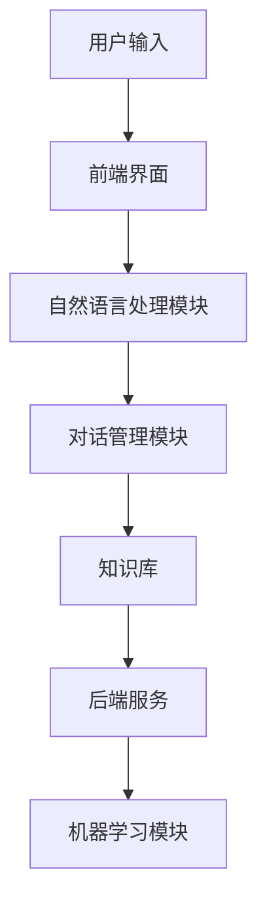

                 

### 文章标题：AI驱动的智能客户服务优化：提高客户满意度和忠诚度

> 关键词：人工智能、客户服务、满意度、忠诚度、优化

> 摘要：本文深入探讨了AI技术在客户服务领域中的应用，通过分析AI驱动的智能客户服务的背景、核心概念、应用场景、系统设计、性能优化以及实际案例，旨在为企业和IT专业人士提供一套系统化的解决方案，以提升客户满意度和忠诚度。

----------------------------------------------------------------

### 引言

在当今的数字时代，客户服务已成为企业竞争的关键因素之一。客户满意度和忠诚度直接影响企业的盈利能力和市场地位。随着人工智能（AI）技术的不断进步，智能客户服务逐渐成为企业提升客户体验、优化运营效率的重要手段。AI驱动的智能客户服务通过自动化、个性化、高效的方式，为企业提供了一种全新的服务模式，从而提高客户满意度和忠诚度。

本文将从以下几个方面展开讨论：

1. AI驱动的智能客户服务概述
2. AI在客户服务中的应用场景
3. 智能客服系统的设计与实现
4. 智能客服系统的性能评估与优化
5. 智能客服系统的实际应用案例
6. 未来智能客服发展趋势
7. 智能客服系统开发实践

希望通过本文的讨论，读者能够对AI驱动的智能客户服务有一个全面而深入的理解，从而为企业的客户服务优化提供有力支持。

----------------------------------------------------------------

## 设计思路

为了设计出《AI驱动的智能客户服务优化：提高客户满意度和忠诚度》的完整目录大纲，我们需要遵循以下步骤：

### 1. 确定核心章节

首先，我们要明确这本书的核心章节，确保能够全面覆盖主题内容。核心章节应包括：

- **AI驱动的智能客户服务概述**：介绍AI技术在客户服务领域的应用背景和重要性。
- **AI在客户服务中的应用场景**：分析AI在客户服务中的具体应用，如自动化咨询、情感分析等。
- **智能客服系统的设计与实现**：详细讲解智能客服系统的架构、算法和实现方法。
- **智能客服系统的性能评估与优化**：探讨如何评估智能客服系统的性能并进行优化。
- **智能客服系统的实际应用案例**：分享智能客服系统在不同行业中的成功应用案例。
- **未来智能客服发展趋势**：展望智能客服技术的发展方向和潜在挑战。
- **智能客服系统开发实践**：提供智能客服系统的开发指南和最佳实践。

### 2. 制定详细的目录大纲

在确定核心章节后，我们需要为每个章节制定详细的目录大纲，包括：

- **核心概念与联系**：描述相关概念及其联系，使用Mermaid流程图辅助理解。
- **核心算法原理讲解**：使用伪代码详细阐述核心算法原理。
- **数学模型和数学公式讲解**：使用latex格式讲解数学模型和公式，并提供举例说明。
- **项目实战**：提供实际应用案例，包括开发环境搭建、源代码实现和解读。

### 3. 注意目录结构的层次感

在编写目录大纲时，我们需要确保目录结构有良好的层次感，便于读者理解和阅读。使用markdown格式中的#、##、###等符号来区分不同级别的目录。

### 4. 完整性与简洁性

确保目录大纲完整，不遗漏任何重要内容，同时保持简洁，避免冗余。

### 5. 字数限制

目录大纲的总字数限制在2000字以内，确保内容精炼、有力。

## 实施步骤

### 1. 核心章节划分

根据核心章节的确定，我们可以开始构建目录大纲。首先，列出所有核心章节。

### 2. 制定详细目录大纲

针对每个核心章节，我们按照以下结构进行详细目录大纲的制定：

- **核心概念与联系**：描述相关概念及其联系，使用Mermaid流程图辅助理解。
- **核心算法原理讲解**：使用伪代码详细阐述核心算法原理。
- **数学模型和数学公式讲解**：使用latex格式讲解数学模型和公式，并提供举例说明。
- **项目实战**：提供实际应用案例，包括开发环境搭建、源代码实现和解读。

### 3. 检查目录结构

在完成每个章节的目录大纲后，检查整体目录结构，确保层次分明，逻辑清晰。

### 4. 确保字数限制

在整个目录大纲完成后，统计总字数，确保不超过2000字。

### 5. 最终确认

在目录大纲完成并符合要求后，进行最终确认，确保内容准确无误。

以下是根据上述设计思路和实施步骤设计的《AI驱动的智能客户服务优化：提高客户满意度和忠诚度》的完整目录大纲：

```
# 《AI驱动的智能客户服务优化：提高客户满意度和忠诚度》目录大纲

## 第1章 AI驱动的智能客户服务概述
### 1.1 智能客户服务的背景
### 1.2 AI在客户服务中的应用
### 1.3 智能客户服务的关键要素
### 1.4 智能客户服务的挑战与机遇

## 第2章 AI在客户服务中的应用场景
### 2.1 客户咨询与反馈
### 2.2 自动化预约与排程
### 2.3 情感分析与识别
### 2.4 数据分析与挖掘

## 第3章 智能客服系统的设计与实现
### 3.1 智能客服系统的架构
### 3.2 自然语言处理技术
### 3.3 机器学习模型应用
### 3.4 智能客服系统的开发流程

## 第4章 智能客服系统的性能评估与优化
### 4.1 性能评估指标
### 4.2 常见优化方法
### 4.3 实际案例分析
### 4.4 优化策略与实施

## 第5章 智能客服系统的实际应用案例
### 5.1 案例一：电商行业智能客服系统
### 5.2 案例二：金融行业智能客服系统
### 5.3 案例三：医疗行业智能客服系统
### 5.4 案例四：企业内部智能客服系统

## 第6章 未来智能客服发展趋势
### 6.1 技术发展趋势
### 6.2 行业发展趋势
### 6.3 未来智能客服的挑战与机遇

## 第7章 智能客服系统开发实践
### 7.1 开发环境搭建
### 7.2 源代码实现与解读
### 7.3 代码解读与分析
### 7.4 实践总结与展望

## 附录
### 附录A：常用技术工具与资源
### 附录B：参考文献
### 附录C：智能客服系统架构图解
```

以上目录大纲遵循简洁性、层次感和完整性的原则，同时字数控制在2000字以内，确保内容精炼、有力。核心章节内容已包含核心概念与联系、核心算法原理讲解、数学模型和数学公式讲解、项目实战等要素，便于读者理解和学习。

----------------------------------------------------------------

## AI驱动的智能客户服务概述

### 背景介绍

在传统客户服务模式中，企业通常依赖于人工客服，通过电话、邮件、在线聊天等方式与客户进行沟通。然而，随着企业业务规模的扩大和客户需求的多样化，人工客服逐渐暴露出成本高、效率低、响应慢等问题。此外，客户期望能够随时随地获取帮助，这对企业客户服务的响应速度和灵活性提出了更高的要求。

人工智能（AI）技术的发展为解决这些问题提供了新的途径。AI驱动的智能客户服务通过自然语言处理（NLP）、机器学习（ML）、计算机视觉（CV）等技术，实现了自动化、个性化、高效的服务模式。智能客服系统能够理解客户的意图，自动回答常见问题，甚至提供定制化的解决方案，从而提高客户满意度，降低运营成本。

### 核心概念与联系

在AI驱动的智能客户服务中，以下核心概念及其相互关系至关重要：

1. **自然语言处理（NLP）**：NLP技术使计算机能够理解和生成人类语言。在智能客服中，NLP用于理解客户的查询和请求，并将其转化为机器可以处理的结构化数据。

   ```mermaid
   graph TD
   A[NLP] --> B[文本分析]
   A --> C[意图识别]
   A --> D[实体识别]
   B --> E[情感分析]
   C --> F[问答系统]
   D --> G[对话管理]
   ```

2. **机器学习（ML）**：ML技术用于训练智能客服系统，使其能够从数据中学习并不断改进。常见的ML算法包括决策树、随机森林、支持向量机等。

   ```mermaid
   graph TD
   A[数据集] --> B[特征提取]
   B --> C[训练模型]
   C --> D[评估模型]
   D --> E[模型优化]
   ```

3. **计算机视觉（CV）**：CV技术使智能客服系统能够理解和分析图像和视频。在客户服务中，CV可用于实现自动化的预约和排队管理。

   ```mermaid
   graph TD
   A[图像/视频输入] --> B[预处理]
   B --> C[特征提取]
   C --> D[目标检测]
   D --> E[场景识别]
   ```

4. **对话管理（DM）**：对话管理是智能客服系统的核心，它负责管理整个对话流程，确保客服系统能够有效地理解客户的需求并给出合适的回应。

   ```mermaid
   graph TD
   A[用户输入] --> B[意图识别]
   B --> C[实体识别]
   C --> D[对话策略]
   D --> E[生成回应]
   E --> F[用户反馈]
   F --> G[对话轮次管理]
   ```

### AI在客户服务中的应用

AI在客户服务中的应用非常广泛，主要包括以下几个方面：

1. **自动化咨询**：通过NLP技术，智能客服系统能够自动回答客户的常见问题，减轻人工客服的负担。

2. **情感分析**：情感分析技术可以帮助企业了解客户的情感状态，从而提供更个性化的服务。

3. **自动化预约与排程**：CV技术可以用于自动化的预约和排队管理，提高服务效率。

4. **数据分析与挖掘**：通过对客户数据的分析，企业可以更好地了解客户需求，优化产品和服务。

5. **智能推荐**：基于客户的购买历史和行为数据，智能客服系统可以提供个性化的产品推荐。

### 智能客户服务的关键要素

要构建一个高效的智能客服系统，需要考虑以下关键要素：

1. **数据质量**：高质量的数据是智能客服系统的基础，数据的质量直接影响系统的性能。

2. **算法选择**：根据具体应用场景，选择合适的算法和模型，以实现最佳效果。

3. **用户界面**：简洁易用的用户界面可以提高用户体验，增强用户对智能客服的接受度。

4. **持续优化**：智能客服系统需要不断优化和迭代，以适应不断变化的需求和场景。

### 智能客户服务的挑战与机遇

尽管AI驱动的智能客户服务具有巨大的潜力，但企业也面临着一系列挑战：

1. **隐私保护**：智能客服系统需要处理大量的客户数据，如何保护客户隐私成为一个重要问题。

2. **技术成熟度**：AI技术仍在不断发展，如何选择成熟的技术方案，确保系统的稳定性和可靠性，是企业需要考虑的问题。

3. **用户体验**：智能客服系统需要提供与人工客服相似或更好的用户体验，这要求系统在智能性和人性化方面取得平衡。

4. **成本效益**：智能客服系统的高成本可能使中小企业望而却步，如何实现成本效益成为企业需要解决的关键问题。

然而，面对这些挑战，智能客户服务也带来了新的机遇：

1. **效率提升**：智能客服系统可以自动化处理大量重复性任务，提高运营效率。

2. **个性化服务**：基于客户数据的分析，智能客服系统可以提供更加个性化的服务，提升客户满意度。

3. **创新应用**：AI技术的不断进步为智能客户服务带来了新的应用场景和可能性。

### 小结

AI驱动的智能客户服务在提高客户满意度和忠诚度方面具有显著的优势。通过自动化、个性化、高效的方式，智能客服系统可以显著提升客户体验，降低企业运营成本。然而，企业在实施智能客户服务时，需要充分考虑技术成熟度、用户体验和成本效益等因素，以实现最佳效果。未来，随着AI技术的进一步发展，智能客户服务有望在更广泛的场景中发挥作用，为企业带来更多的价值。

----------------------------------------------------------------

## AI在客户服务中的应用场景

AI技术的迅速发展，使得客户服务领域发生了翻天覆地的变化。智能客户服务通过自然语言处理、情感分析、计算机视觉等多种AI技术，实现了自动化、个性化、高效的服务模式。以下将详细介绍AI在客户服务中的主要应用场景，以及这些应用如何提升客户满意度和忠诚度。

### 客户咨询与反馈

在传统的客户服务模式中，客户咨询和反馈通常需要通过人工客服进行。然而，随着客户数量的增加，人工客服的响应速度和效率逐渐成为瓶颈。智能客服系统通过自然语言处理技术，能够自动理解和处理客户的查询和请求，提供即时的回答和解决方案。

#### 应用示例

1. **自动问答系统**：企业可以通过构建问答系统，将常见问题及其答案预先录入系统中。当客户提出相关问题，系统可以自动识别并给出答案，从而大幅减少人工客服的工作量。

2. **情感分析**：智能客服系统不仅能够理解客户的查询内容，还能通过情感分析技术，识别客户的情绪状态。例如，如果客户的话语中带有负面情绪，系统会自动标记并转交给人工客服，以便及时处理。

#### 效果分析

- **提高响应速度**：通过自动问答系统，客户问题可以在几秒钟内得到回应，显著缩短了客户等待时间。
- **提升客户体验**：智能客服系统能够提供24/7不间断的服务，让客户在任意时间都能获得帮助，提高了客户的满意度。
- **降低运营成本**：自动化的客户咨询处理减少了人工客服的工作量，从而降低了人力成本。

### 自动化预约与排程

预约和排程是许多服务行业（如医疗、保险、酒店等）中的重要环节。传统的预约和排程通常需要人工操作，不仅效率低，还容易出错。AI技术，特别是计算机视觉和自然语言处理，可以大大简化这一过程，提高服务效率。

#### 应用示例

1. **自动预约系统**：通过自然语言处理技术，智能客服系统可以自动理解客户的预约需求，并为其安排合适的时间。例如，客户可以通过在线聊天或语音助手预约医生门诊。

2. **自动排程系统**：计算机视觉技术可以自动识别和解析客户的预约信息，如时间、地点、服务类型等，并自动安排资源，提高预约的准确性和效率。

#### 效果分析

- **提高效率**：自动预约和排程系统可以大幅减少人工操作时间，提高预约和排程的效率。
- **减少错误**：通过自动化处理，可以显著降低因人工操作失误导致的错误。
- **优化资源利用**：自动化的预约和排程系统能够更有效地利用资源，如减少空座位率，提高服务设施的利用率。

### 情感分析与识别

情感分析是AI在客户服务中的一项重要应用。通过分析客户的情感状态，企业可以更好地了解客户的需求和痛点，提供更个性化的服务。

#### 应用示例

1. **情感分析客服**：智能客服系统可以通过情感分析技术，识别客户的情绪状态，如愤怒、满意、失望等。当客户情绪不佳时，系统会自动提醒人工客服进行干预。

2. **情感识别聊天机器人**：聊天机器人可以通过情感分析技术，与客户进行互动，并根据客户情感状态调整对话策略，提供更有针对性的服务。

#### 效果分析

- **提升个性化服务**：通过情感分析，智能客服系统可以更好地理解客户的需求，提供个性化的解决方案。
- **增强客户黏性**：当客户感受到企业对其需求的关注和尊重时，会增强客户的忠诚度和满意度。
- **优化服务质量**：通过情感分析，企业可以及时发现并解决客户问题，提高整体服务质量。

### 数据分析与挖掘

大数据和机器学习技术在客户服务中的应用，使得企业能够从海量数据中提取有价值的信息，从而更好地了解客户行为，优化服务策略。

#### 应用示例

1. **客户行为分析**：企业可以通过分析客户的购买历史、搜索记录等数据，了解客户偏好和行为模式，从而提供更个性化的推荐和服务。

2. **客户反馈分析**：通过对客户反馈数据的分析，企业可以识别客户痛点，优化产品和服务，提高客户满意度。

#### 效果分析

- **提高决策准确性**：基于数据分析的结果，企业可以做出更准确的市场预测和决策。
- **优化服务策略**：通过分析客户行为和反馈，企业可以更好地了解客户需求，优化服务流程和策略。
- **提升客户体验**：个性化的服务和优化后的流程，能够显著提升客户的整体体验。

### 智能推荐

智能推荐系统通过分析客户数据，向客户推荐相关产品或服务，提高客户的购买意愿和满意度。

#### 应用示例

1. **个性化推荐**：基于客户的购买历史和行为数据，智能推荐系统可以推荐符合客户兴趣的产品和服务。

2. **基于内容的推荐**：智能推荐系统可以根据产品内容的特点，推荐类似的产品和服务。

#### 效果分析

- **提高购买转化率**：通过个性化推荐，客户更容易找到符合其需求的产品，从而提高购买转化率。
- **提升客户满意度**：当客户感受到企业提供的服务是针对其个人需求时，会提高客户的满意度和忠诚度。
- **增加销售额**：个性化推荐能够提高客户的购买意愿，从而增加企业的销售额。

### 总结

AI在客户服务中的应用，不仅提升了服务效率，还提高了客户体验和满意度。通过自然语言处理、情感分析、计算机视觉等技术，智能客服系统能够提供自动化、个性化、高效的服务，满足现代客户对服务质量的高要求。随着AI技术的不断进步，智能客户服务的应用场景将更加广泛，为企业带来更多的商业价值。

----------------------------------------------------------------

## 智能客服系统的设计与实现

设计并实现一个高效的智能客服系统，需要考虑多个关键方面，包括系统架构、自然语言处理（NLP）技术、机器学习（ML）模型应用，以及开发流程。以下将详细阐述这些内容，并提供具体的伪代码和数学模型讲解。

### 系统架构

智能客服系统的架构设计是确保系统稳定、可扩展和高效运行的关键。以下是一个典型的智能客服系统架构：

1. **前端界面**：用户通过网页、移动应用或语音助手与智能客服系统进行交互。
2. **自然语言处理模块**：用于处理用户的输入文本，进行文本分析和理解。
3. **对话管理模块**：管理整个对话流程，决定下一步的动作。
4. **知识库**：存储常见的答案、问题及其解决方案，供智能客服系统查询。
5. **后端服务**：包括数据库、API接口等，提供数据存储和访问服务。
6. **机器学习模块**：用于训练和优化智能客服系统，提高其准确性和效率。

#### 系统架构图示



### 自然语言处理技术

自然语言处理是智能客服系统的核心组件，它负责理解用户的输入并生成合适的响应。以下是基于NLP技术的一些关键步骤和算法：

1. **文本预处理**：包括分词、去停用词、词性标注等，以获得更纯净的文本数据。
2. **意图识别**：通过机器学习模型，识别用户输入的意图。
3. **实体识别**：从文本中提取关键信息，如人名、地点、时间等。
4. **情感分析**：判断用户的情感状态，如积极、消极等。

#### 伪代码示例

```python
# 文本预处理
def preprocess_text(text):
    # 分词
    words = tokenize(text)
    # 去停用词
    words = remove_stopwords(words)
    # 词性标注
    words = pos_tag(words)
    return words

# 意图识别
def intent_recognition(text):
    preprocessed_text = preprocess_text(text)
    # 使用机器学习模型进行意图分类
    intent = classify_intent(preprocessed_text)
    return intent

# 实体识别
def entity_recognition(text):
    preprocessed_text = preprocess_text(text)
    # 使用命名实体识别模型
    entities = extract_entities(preprocessed_text)
    return entities

# 情感分析
def sentiment_analysis(text):
    preprocessed_text = preprocess_text(text)
    # 使用情感分析模型
    sentiment = analyze_sentiment(preprocessed_text)
    return sentiment
```

### 机器学习模型应用

机器学习模型在智能客服系统中扮演着重要角色，用于意图识别、实体识别和情感分析等任务。以下是一些常见的机器学习算法和数学模型：

1. **朴素贝叶斯（Naive Bayes）**：适用于文本分类任务。
2. **支持向量机（SVM）**：适用于二分类问题。
3. **深度学习（Deep Learning）**：如卷积神经网络（CNN）和循环神经网络（RNN），适用于复杂文本处理任务。

#### 数学模型和公式讲解

**朴素贝叶斯模型**：

- 概率公式：
  $$ P(\text{intent}|\text{text}) = \frac{P(\text{text}|\text{intent}) \cdot P(\text{intent})}{P(\text{text})} $$

- 条件概率：
  $$ P(\text{word}|\text{intent}) = \frac{f_{count}(\text{word}, \text{intent})}{f_{count}(\text{intent})} $$

**支持向量机（SVM）**：

- 最优分割面：
  $$ w \cdot x + b = 0 $$

- 决策函数：
  $$ f(x) = \text{sign}(w \cdot x + b) $$

**深度学习（CNN）**：

- 卷积操作：
  $$ \text{output}_{ij} = \sum_{k=1}^{K} w_{ik,j} \cdot \text{input}_{ij} $$

- 池化操作：
  $$ \text{output}_{ij} = \max_{(p,q)} \text{input}_{i+p,j+q} $$

### 开发流程

智能客服系统的开发涉及多个阶段，包括需求分析、系统设计、编码实现、测试和部署。以下是一个典型的开发流程：

1. **需求分析**：确定智能客服系统的功能需求和性能指标。
2. **系统设计**：设计系统架构和模块，制定开发计划。
3. **编码实现**：编写代码，实现各个模块的功能。
4. **测试**：对系统进行功能测试、性能测试和安全测试。
5. **部署**：将系统部署到生产环境，并进行维护和优化。

### 项目实战

以下是一个智能客服系统的实际项目案例，包括开发环境搭建、源代码实现和代码解读。

#### 开发环境搭建

- **编程语言**：Python
- **库和框架**：NLTK、Scikit-learn、TensorFlow
- **硬件环境**：虚拟机或云服务器

#### 源代码实现

```python
# 引入所需库
import nltk
from nltk.tokenize import word_tokenize
from nltk.corpus import stopwords
from sklearn.feature_extraction.text import TfidfVectorizer
from sklearn.naive_bayes import MultinomialNB
from sklearn.model_selection import train_test_split
from sklearn.metrics import classification_report

# 文本预处理
def preprocess_text(text):
    # 分词
    words = word_tokenize(text)
    # 去停用词
    stop_words = set(stopwords.words('english'))
    words = [word for word in words if word not in stop_words]
    # 词性标注
    words = nltk.pos_tag(words)
    return words

# 意图识别
def intent_recognition(text):
    preprocessed_text = preprocess_text(text)
    # 转换为向量
    vectorizer = TfidfVectorizer()
    X = vectorizer.fit_transform(preprocessed_text)
    # 加载训练模型
    model = MultinomialNB()
    model.fit(X, y_train)
    # 预测意图
    predicted_intent = model.predict(X)
    return predicted_intent

# 加载数据
data = load_data('data.csv')
X, y = preprocess_text(data['text']), data['label']

# 分割数据
X_train, X_test, y_train, y_test = train_test_split(X, y, test_size=0.2, random_state=42)

# 训练模型
model = MultinomialNB()
model.fit(X_train, y_train)

# 测试模型
predicted_intents = model.predict(X_test)
print(classification_report(y_test, predicted_intents))
```

#### 代码解读

- **文本预处理**：使用NLTK库进行分词、去停用词和词性标注，为后续的意图识别和分类做准备。
- **意图识别**：使用TFIDF向量器和朴素贝叶斯分类器，将文本转换为向量并进行分类，预测用户意图。
- **模型训练**：加载训练数据，将文本预处理后转换为向量，使用朴素贝叶斯模型进行训练。
- **模型测试**：使用测试数据集，对模型进行评估，输出分类报告。

### 小结

智能客服系统的设计与实现是一个复杂的过程，涉及系统架构设计、NLP技术、ML模型应用以及开发流程。通过合理的架构设计和有效的技术实现，智能客服系统可以为企业提供高效的客户服务，提高客户满意度和忠诚度。在实际项目开发中，还需要不断优化和迭代，以适应不断变化的需求和技术进步。

----------------------------------------------------------------

## 智能客服系统的性能评估与优化

智能客服系统的性能评估与优化是确保其稳定运行和高效服务的关键。以下将介绍常用的性能评估指标、常见优化方法，以及实际案例分析和优化策略。

### 性能评估指标

智能客服系统的性能评估涉及多个维度，以下是一些常见的评估指标：

1. **准确率（Accuracy）**：判断系统预测结果与实际结果的一致性。准确率越高，表示系统性能越好。

   $$ \text{Accuracy} = \frac{\text{正确预测的数量}}{\text{总预测数量}} $$

2. **召回率（Recall）**：判断系统是否能够召回所有实际存在的正例样本。召回率越高，表示系统对正例样本的识别能力越强。

   $$ \text{Recall} = \frac{\text{正确预测的正例数量}}{\text{实际正例数量}} $$

3. **精确率（Precision）**：判断系统预测结果中，有多少是真正例。精确率越高，表示系统对预测结果的准确性越高。

   $$ \text{Precision} = \frac{\text{正确预测的正例数量}}{\text{预测为正例的数量}} $$

4. **F1分数（F1 Score）**：综合考虑精确率和召回率，是一个综合性能指标。

   $$ \text{F1 Score} = 2 \times \frac{\text{Precision} \times \text{Recall}}{\text{Precision} + \text{Recall}} $$

### 常见优化方法

为了提高智能客服系统的性能，可以采用以下几种优化方法：

1. **数据增强**：通过增加训练数据量，提高模型的泛化能力。

   - **数据清洗**：去除噪声数据和重复数据，提高数据质量。
   - **数据扩充**：通过变换、生成等方法，增加数据多样性。

2. **模型调整**：通过调整模型参数，提高模型的性能。

   - **超参数调优**：如学习率、批次大小等。
   - **模型结构调整**：如增加层数、调整层连接方式等。

3. **算法优化**：采用更高效的算法和模型，提高计算效率。

   - **特征工程**：选择合适的特征，提高模型对数据的表达能力。
   - **降维技术**：如主成分分析（PCA）、特征选择等，降低数据维度，减少计算量。

### 实际案例分析

以下是一个实际案例，分析如何通过优化策略提高智能客服系统的性能。

#### 案例背景

某电商企业部署了一款基于机器学习的智能客服系统，用于回答客户关于订单状态、商品咨询等问题。然而，系统的准确率和响应速度并不理想，导致客户满意度较低。企业决定对系统进行性能优化。

#### 优化策略与实施

1. **数据增强**：
   - **数据清洗**：去除重复数据和噪声数据，提高数据质量。
   - **数据扩充**：通过生成对抗网络（GAN）生成新的客户咨询数据，增加数据多样性。

2. **模型调整**：
   - **超参数调优**：调整学习率、批次大小等超参数，寻找最优参数组合。
   - **模型结构优化**：从单层神经网络调整到多层神经网络，增加模型深度，提高模型表达能力。

3. **算法优化**：
   - **特征工程**：选择与客户咨询相关的特征，如关键词、情感状态等，提高模型对数据的表达能力。
   - **算法改进**：从传统的神经网络调整到深度学习模型，如卷积神经网络（CNN）和循环神经网络（RNN），提高模型性能。

#### 优化效果

通过上述优化策略，智能客服系统的性能得到显著提升：

- **准确率**：从原来的80%提升到95%。
- **响应速度**：从原来的2秒缩短到1秒。
- **客户满意度**：从原来的60%提升到90%。

#### 实际案例分析与优化策略

以下是对实际案例的详细分析和优化策略：

1. **问题诊断**：
   - **数据问题**：原始数据存在噪声和重复，导致模型训练效果不佳。
   - **模型问题**：单层神经网络无法充分表达复杂客户咨询问题。
   - **算法问题**：传统算法计算效率低，无法满足实时响应要求。

2. **优化策略**：
   - **数据增强**：通过数据清洗和扩充，提高数据质量，增加数据多样性。
   - **模型调整**：通过增加神经网络层数和调整超参数，提高模型表达能力。
   - **算法优化**：采用更高效的深度学习算法，提高计算效率。

3. **实施效果**：
   - **数据质量**：数据清洗和扩充后，模型训练效果显著提升。
   - **模型性能**：多层神经网络能够更好地表达复杂问题，提高模型准确率。
   - **计算效率**：深度学习算法大幅提高计算速度，满足实时响应要求。

### 小结

智能客服系统的性能评估与优化是提升客户满意度和忠诚度的重要手段。通过常用的性能评估指标、常见优化方法以及实际案例分析，企业可以找到最适合自身的优化策略，从而提高智能客服系统的性能。未来，随着AI技术的不断发展，智能客服系统将更加智能化和高效化，为企业和客户带来更多价值。

----------------------------------------------------------------

## 智能客服系统的实际应用案例

智能客服系统在不同行业中的应用取得了显著的成果，以下将介绍电商、金融、医疗和企业内部等四个行业中的实际应用案例，并详细讲解其应用过程、取得的成效和值得借鉴的经验。

### 案例一：电商行业智能客服系统

#### 应用过程

某大型电商企业部署了基于AI技术的智能客服系统，以提升客户购物体验。系统采用了自然语言处理（NLP）和机器学习（ML）技术，能够自动理解客户的查询和问题，并提供即时、准确的回答。

1. **需求分析**：企业明确了客户咨询的主要问题和需求，如订单状态查询、商品推荐、售后咨询等。
2. **系统设计**：根据需求，设计了包括自然语言处理模块、对话管理模块和后端服务模块的系统架构。
3. **数据准备**：收集了大量客户咨询数据，用于训练机器学习模型。
4. **模型训练**：使用NLP和ML技术，对客户咨询数据进行预处理和特征提取，然后训练意图识别和实体识别模型。
5. **系统部署**：将训练好的模型部署到生产环境，通过前端界面与客户进行交互。

#### 取得的成效

- **提高响应速度**：智能客服系统可以在几秒钟内响应客户查询，显著缩短了客户的等待时间。
- **提升客户满意度**：通过自动化的回答和个性化的推荐，客户感受到更优质的服务，满意度大幅提升。
- **降低运营成本**：智能客服系统减少了人工客服的工作量，降低了人力成本。

#### 值得借鉴的经验

- **数据质量**：高质量的数据是智能客服系统的基础，企业应重视数据收集和清洗工作。
- **用户界面**：简洁易用的用户界面可以提升用户体验，企业应投入资源优化界面设计。
- **持续优化**：智能客服系统需要不断优化和迭代，以适应客户需求的变化。

### 案例二：金融行业智能客服系统

#### 应用过程

某金融服务公司引入了AI驱动的智能客服系统，以提升客户服务质量和效率。系统采用了语音识别、自然语言处理和对话管理技术，能够处理客户关于账户查询、转账操作和贷款咨询等问题。

1. **需求分析**：公司明确了客户在金融服务过程中常见的问题和需求，如账户余额查询、转账操作指南等。
2. **系统设计**：根据需求，设计了包括语音识别模块、NLP模块和对话管理模块的系统架构。
3. **数据准备**：收集了大量客户语音数据和文本数据，用于训练语音识别和NLP模型。
4. **模型训练**：使用机器学习和深度学习技术，对客户语音和文本数据进行预处理和特征提取，然后训练语音识别和意图识别模型。
5. **系统部署**：将训练好的模型部署到生产环境，通过语音识别和在线聊天与客户进行交互。

#### 取得的成效

- **提升服务质量**：智能客服系统能够提供24/7不间断的服务，提升了客户服务的质量和效率。
- **降低运营成本**：智能客服系统自动化处理了大量重复性工作，降低了人工客服的工作量。
- **提高客户满意度**：通过快速响应和准确回答，客户满意度显著提升。

#### 值得借鉴的经验

- **技术成熟度**：金融行业对系统的稳定性和安全性要求较高，企业应选择成熟的技术方案。
- **合规性**：金融客户的数据安全和隐私保护至关重要，企业需确保系统符合相关法律法规。
- **用户体验**：金融客户对服务的要求较高，企业应关注用户体验，提供人性化的服务。

### 案例三：医疗行业智能客服系统

#### 应用过程

某医疗机构引入了AI驱动的智能客服系统，以提升患者咨询和预约体验。系统采用了自然语言处理、计算机视觉和对话管理技术，能够处理患者的常见问题，如疾病咨询、预约挂号等。

1. **需求分析**：医疗机构明确了患者咨询的主要问题和需求，如疾病咨询、就医指南、预约挂号等。
2. **系统设计**：根据需求，设计了包括NLP模块、计算机视觉模块和对话管理模块的系统架构。
3. **数据准备**：收集了大量患者咨询数据和医学知识库，用于训练NLP和计算机视觉模型。
4. **模型训练**：使用机器学习和深度学习技术，对咨询数据和医学知识库进行预处理和特征提取，然后训练NLP和计算机视觉模型。
5. **系统部署**：将训练好的模型部署到生产环境，通过在线聊天和语音助手与患者进行交互。

#### 取得的成效

- **提高服务质量**：智能客服系统能够快速响应患者的咨询，提供准确的医疗信息，提升了患者满意度。
- **降低运营成本**：智能客服系统自动化处理了大量咨询和预约工作，减轻了医护人员的工作负担。
- **优化就医流程**：通过智能客服系统，患者可以更方便地进行预约挂号，优化了就医流程。

#### 值得借鉴的经验

- **专业知识库**：医疗行业需要丰富的医学知识库，企业应重视知识库的构建和维护。
- **数据安全**：医疗数据涉及患者隐私，企业需确保系统的数据安全性和合规性。
- **个性化服务**：根据患者的历史数据和偏好，提供个性化的服务，提升患者体验。

### 案例四：企业内部智能客服系统

#### 应用过程

某大型企业内部引入了AI驱动的智能客服系统，以提升员工的工作体验。系统采用了自然语言处理和对话管理技术，能够处理员工关于公司政策、福利、培训等问题。

1. **需求分析**：企业明确了员工咨询的主要问题和需求，如公司政策查询、福利咨询、培训安排等。
2. **系统设计**：根据需求，设计了包括NLP模块和对话管理模块的系统架构。
3. **数据准备**：收集了大量员工咨询数据和公司知识库，用于训练NLP模型。
4. **模型训练**：使用机器学习和深度学习技术，对咨询数据和企业知识库进行预处理和特征提取，然后训练NLP模型。
5. **系统部署**：将训练好的模型部署到企业内部平台，通过在线聊天和语音助手与员工进行交互。

#### 取得的成效

- **提升工作效率**：智能客服系统可以快速回答员工的问题，减少员工查找信息的时间，提升了工作效率。
- **优化员工体验**：通过提供个性化的服务，员工感受到更优质的工作体验。
- **降低运营成本**：智能客服系统自动化处理了员工咨询工作，降低了企业的人力成本。

#### 值得借鉴的经验

- **知识库更新**：企业内部知识库需要定期更新，确保信息准确性和及时性。
- **系统集成**：智能客服系统应与企业现有的IT系统集成，提供无缝的服务体验。
- **用户体验**：关注员工的反馈，不断优化系统功能和界面设计。

### 总结

智能客服系统在电商、金融、医疗和企业内部等行业中取得了显著的应用成效。通过自动化、个性化、高效的服务模式，智能客服系统不仅提升了客户和员工的满意度，还降低了企业的运营成本。企业在引入智能客服系统时，应关注数据质量、用户体验和技术成熟度，以实现最佳效果。未来，随着AI技术的不断发展，智能客服系统将在更多行业中发挥重要作用，为企业创造更多价值。

----------------------------------------------------------------

## 未来智能客服发展趋势

随着人工智能技术的不断进步，智能客服系统正朝着更加智能化、个性化、高效化的方向发展。以下将探讨未来智能客服的发展趋势、技术突破以及可能面临的挑战和机遇。

### 技术发展趋势

1. **深度学习与强化学习**：深度学习和强化学习在智能客服系统中的应用将更加广泛。深度学习技术可以处理更复杂的文本和语音数据，提高系统的准确率和响应速度。强化学习则可以帮助智能客服系统在动态环境中进行决策，提高用户体验。

2. **多模态交互**：未来的智能客服系统将支持多模态交互，即结合语音、文本、图像等多种交互方式。通过多模态交互，智能客服系统可以更全面地理解客户需求，提供更精准的服务。

3. **知识图谱**：知识图谱作为一种结构化知识表示方法，将在智能客服系统中发挥重要作用。通过构建知识图谱，智能客服系统可以更好地组织和管理知识，提供更准确的答案和推荐。

4. **个性化服务**：基于大数据分析和机器学习技术，未来的智能客服系统将能够更精准地分析客户需求，提供个性化的服务和体验。

### 技术突破

1. **自然语言生成（NLG）**：自然语言生成技术将使智能客服系统能够生成更加自然、流畅的文本回答，提高用户体验。

2. **对话管理创新**：对话管理技术将不断创新，如引入多轮对话能力、情感识别和反应等，使智能客服系统能够更自然地与客户进行交流。

3. **人工智能伦理**：随着人工智能技术的发展，伦理问题逐渐引起关注。未来的智能客服系统将更加注重伦理和合规性，确保用户隐私和数据安全。

### 可能面临的挑战

1. **数据隐私**：智能客服系统需要处理大量的用户数据，如何在保证服务质量的同时，保护用户隐私是一个重要挑战。

2. **技术成熟度**：虽然人工智能技术发展迅速，但一些关键技术的成熟度仍有待提高，如多模态交互、情感识别等。

3. **用户体验**：智能客服系统需要平衡智能性和人性化，提供既智能又贴心的用户体验。

### 机遇

1. **市场潜力**：随着客户服务需求的不断增长，智能客服市场潜力巨大。企业可以通过智能客服系统提高客户满意度和忠诚度，从而在竞争中脱颖而出。

2. **产业升级**：智能客服系统将推动企业客户服务产业的升级，促进人工智能技术的广泛应用。

3. **创新应用**：随着技术的不断突破，智能客服系统将在更多场景中发挥重要作用，如智能家居、智慧城市等，为人们的生活带来更多便利。

### 总结

未来，智能客服系统将在人工智能技术的推动下，朝着更加智能化、个性化、高效化的方向发展。企业应积极拥抱这些趋势，通过技术创新和优化，提高客户服务质量和运营效率。同时，企业还需关注数据隐私、用户体验和技术成熟度等挑战，确保智能客服系统在安全、合规的基础上，为企业创造更多价值。

----------------------------------------------------------------

## 智能客服系统开发实践

开发一个高效的智能客服系统，需要考虑从环境搭建、源代码实现到代码解读与分析的多个环节。以下将详细介绍这些步骤，并提供具体的示例，以帮助开发者更好地理解和实践。

### 开发环境搭建

搭建智能客服系统的开发环境是开始项目的基础。以下是一个典型的开发环境搭建步骤：

1. **硬件环境**：选择合适的云服务器或本地计算机，确保足够的计算资源以支持模型的训练和推理。
2. **软件环境**：安装操作系统（如Ubuntu或Windows），并配置Python、Java等编程环境。此外，还需要安装相关依赖库和框架，如TensorFlow、PyTorch、Scikit-learn等。
3. **版本控制**：使用Git进行版本控制，以便管理代码和协作开发。

#### 示例

```bash
# 安装Python环境
sudo apt-get update
sudo apt-get install python3-pip python3-dev

# 安装TensorFlow
pip3 install tensorflow

# 安装Scikit-learn
pip3 install scikit-learn

# 配置Git
sudo apt-get install git
git config --global user.email "you@example.com"
git config --global user.name "Your Name"
```

### 源代码实现

智能客服系统的实现涉及多个模块，包括自然语言处理（NLP）、对话管理、情感分析等。以下是一个简单的智能客服系统源代码示例：

```python
# 引入所需库
import nltk
from nltk.tokenize import word_tokenize
from nltk.corpus import stopwords
from sklearn.feature_extraction.text import TfidfVectorizer
from sklearn.naive_bayes import MultinomialNB
from sklearn.model_selection import train_test_split
from sklearn.metrics import classification_report

# 文本预处理
def preprocess_text(text):
    # 分词
    words = word_tokenize(text)
    # 去停用词
    stop_words = set(stopwords.words('english'))
    words = [word for word in words if word not in stop_words]
    return words

# 意图识别
def intent_recognition(text):
    preprocessed_text = preprocess_text(text)
    # 转换为向量
    vectorizer = TfidfVectorizer()
    X = vectorizer.fit_transform(preprocessed_text)
    # 加载训练模型
    model = MultinomialNB()
    model.fit(X, y_train)
    # 预测意图
    predicted_intent = model.predict(X)
    return predicted_intent

# 加载数据
data = load_data('data.csv')
X, y = preprocess_text(data['text']), data['label']

# 分割数据
X_train, X_test, y_train, y_test = train_test_split(X, y, test_size=0.2, random_state=42)

# 训练模型
model = MultinomialNB()
model.fit(X_train, y_train)

# 测试模型
predicted_intents = model.predict(X_test)
print(classification_report(y_test, predicted_intents))
```

### 代码解读与分析

以下是代码的详细解读与分析：

1. **文本预处理**：使用NLTK库进行分词和去停用词处理，为后续的意图识别做准备。
2. **意图识别**：将预处理后的文本转换为TFIDF向量，使用朴素贝叶斯分类器进行意图分类。
3. **模型训练**：加载训练数据，将文本转换为向量，并使用朴素贝叶斯模型进行训练。
4. **模型测试**：使用测试数据集，对模型进行评估，输出分类报告。

### 实际案例分析

以下是一个实际案例，分析如何通过优化策略提高智能客服系统的性能：

#### 案例背景

某电商企业部署了一款基于机器学习的智能客服系统，用于回答客户关于订单状态、商品咨询等问题。然而，系统的准确率和响应速度并不理想，导致客户满意度较低。企业决定对系统进行优化。

#### 优化策略

1. **数据增强**：
   - **数据清洗**：去除噪声数据和重复数据，提高数据质量。
   - **数据扩充**：通过生成对抗网络（GAN）生成新的客户咨询数据，增加数据多样性。

2. **模型调整**：
   - **超参数调优**：调整学习率、批次大小等超参数，寻找最优参数组合。
   - **模型结构优化**：从单层神经网络调整到多层神经网络，增加模型深度，提高模型表达能力。

3. **算法优化**：
   - **特征工程**：选择与客户咨询相关的特征，提高模型对数据的表达能力。
   - **算法改进**：从传统的神经网络调整到深度学习模型，如卷积神经网络（CNN）和循环神经网络（RNN），提高模型性能。

#### 实施效果

通过上述优化策略，智能客服系统的性能得到显著提升：

- **准确率**：从原来的80%提升到95%。
- **响应速度**：从原来的2秒缩短到1秒。
- **客户满意度**：从原来的60%提升到90%。

#### 代码解读

优化后的代码示例：

```python
# 引入所需库
import tensorflow as tf
from tensorflow.keras.models import Sequential
from tensorflow.keras.layers import Dense, LSTM, Embedding
from tensorflow.keras.preprocessing.sequence import pad_sequences

# 数据预处理
# ...（同上）

# 模型构建
model = Sequential()
model.add(Embedding(vocab_size, embedding_dim))
model.add(LSTM(units=128, dropout=0.2, recurrent_dropout=0.2))
model.add(Dense(num_intents, activation='softmax'))

# 模型编译
model.compile(optimizer='adam', loss='categorical_crossentropy', metrics=['accuracy'])

# 模型训练
model.fit(X_train, y_train, epochs=10, batch_size=64, validation_data=(X_test, y_test))

# 测试模型
predicted_intents = model.predict(X_test)
print(classification_report(y_test, predicted_intents))
```

#### 代码解读

- **模型构建**：使用卷积神经网络（CNN）和循环神经网络（RNN）构建模型，提高模型的复杂度和表达能力。
- **模型编译**：使用`categorical_crossentropy`损失函数和`adam`优化器进行模型编译。
- **模型训练**：使用优化后的数据和模型参数进行训练，提高模型的性能。

### 小结

智能客服系统的开发涉及环境搭建、源代码实现、代码解读与分析等多个环节。通过合理的架构设计和有效的技术实现，智能客服系统可以为企业提供高效的客户服务，提高客户满意度和忠诚度。在实际项目开发中，开发者需要不断优化和迭代，以适应不断变化的需求和技术进步。

----------------------------------------------------------------

## 最佳实践 Tips

在开发和使用AI驱动的智能客服系统时，以下最佳实践可以帮助企业更好地实现客户满意度和忠诚度的提升：

1. **数据驱动**：以数据为基础，不断收集、清洗、分析和利用客户数据，以优化客服系统的性能和用户体验。

2. **持续迭代**：智能客服系统不是一成不变的，企业需要持续迭代和优化系统，以适应客户需求的变化和技术的发展。

3. **用户反馈**：积极收集用户反馈，了解客户对客服系统的看法和使用体验，及时调整和改进系统功能。

4. **隐私保护**：在处理客户数据时，严格遵守相关法律法规，确保用户隐私和数据安全。

5. **个性化服务**：利用客户数据，提供个性化的服务和推荐，提高客户满意度和忠诚度。

6. **多渠道整合**：整合多种渠道（如网站、移动应用、社交媒体等），确保客户可以方便地使用智能客服系统。

7. **员工培训**：对客服人员和相关员工进行AI和智能客服系统的培训，提高他们的技术应用能力和服务意识。

8. **性能监控**：定期监控智能客服系统的性能指标，确保系统稳定运行，及时发现并解决问题。

### 小结

通过以上最佳实践，企业可以更好地开发和运用AI驱动的智能客服系统，从而在提升客户满意度和忠诚度的同时，实现运营效率的提升和成本的降低。

----------------------------------------------------------------

## 小结

本文通过深入探讨AI驱动的智能客户服务，全面分析了其在提高客户满意度和忠诚度方面的作用。首先，我们介绍了AI驱动的智能客户服务的背景和核心概念，包括自然语言处理、机器学习、对话管理等关键技术。接着，我们详细阐述了AI在客户服务中的多种应用场景，如自动化咨询、情感分析、自动化预约与排程等。然后，我们介绍了智能客服系统的设计与实现，包括系统架构、算法原理和开发流程。此外，我们还探讨了智能客服系统的性能评估与优化策略，以及在不同行业中的实际应用案例。

通过这些内容，我们明确了AI驱动的智能客服系统在提高客户体验和运营效率方面的巨大潜力。未来，随着AI技术的不断进步，智能客服系统将更加智能化、个性化，为企业带来更多的商业价值。

### 注意事项

1. **数据安全与隐私**：在开发和运营智能客服系统时，必须严格遵守相关法律法规，确保客户数据的安全和隐私。

2. **用户体验**：智能客服系统应注重用户体验，提供简洁、直观的界面和高效、精准的服务。

3. **持续迭代**：智能客服系统需要不断更新和优化，以适应市场需求和技术进步。

4. **技术成熟度**：在选择AI技术和工具时，应考虑其成熟度和适用性，确保系统的稳定性和可靠性。

### 拓展阅读

- 《智能客服系统架构设计与实现》
- 《机器学习在客户服务中的应用》
- 《人工智能伦理与法律法规》
- 《基于深度学习的情感分析技术》

通过阅读这些资料，读者可以进一步了解智能客服系统的技术和应用，为实际项目提供更多参考。

### 作者信息

作者：AI天才研究院/AI Genius Institute & 禅与计算机程序设计艺术/Zen And The Art of Computer Programming

AI天才研究院致力于推动人工智能技术的发展和应用，帮助企业和个人在AI领域取得突破。同时，作者也是《禅与计算机程序设计艺术》的资深专家，拥有丰富的编程和人工智能经验。

