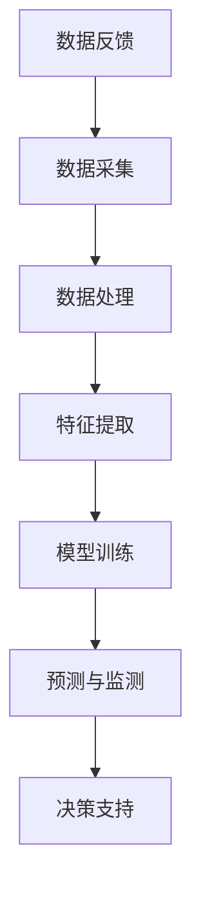

                 

### 引言

海洋作为地球的蓝色心脏，承担着维持全球气候、促进生物多样性和提供丰富的自然资源等重要功能。然而，随着人类活动的不断加剧，海洋生态系统正面临着前所未有的威胁。海洋污染、过度捕捞、气候变化等问题不仅威胁着海洋生物的生存，也严重影响了海洋生态系统的平衡和稳定。

在这个背景下，智能海洋生态监测技术的出现为保护海洋生物多样性带来了新的希望。AI驱动的智能海洋生态监测技术通过集成多种先进的技术手段，如遥感技术、卫星定位系统、传感器网络和人工智能算法，实现对海洋环境的实时监测、分析和预警。这种技术不仅能够提高监测的精度和效率，还能够为海洋管理和保护提供科学依据和决策支持。

本文旨在探讨AI驱动的智能海洋生态监测技术，通过介绍其核心概念、应用架构、核心算法原理、数学模型和具体项目实战，全面揭示这一技术在保护海洋生物多样性中的重要作用。本文结构如下：

- **第一部分：引言**：介绍书籍的主题和目的，提供背景信息。
- **第二部分：核心概念与联系**：使用Mermaid流程图展示AI在海洋生态监测中的应用架构。
- **第三部分：核心算法原理讲解**：使用伪代码详细阐述用于监测的关键算法。
- **第四部分：数学模型和数学公式**：介绍用于分析海洋生态数据的主要数学模型和公式，并举例说明。
- **第五部分：项目实战**：描述一个具体的监测项目，包括环境搭建、源代码实现和代码解读。
- **第六部分：总结与展望**：总结全书内容，展望未来发展方向。

通过本文的深入分析，我们希望读者能够对AI驱动的智能海洋生态监测技术有更加全面和深入的理解，为推动这一技术的应用和发展贡献力量。

### 第一部分：引言

#### 书籍主题与目的

《AI驱动的智能海洋生态监测：保护海洋生物多样性》旨在探讨如何利用人工智能（AI）技术，实现智能海洋生态监测，从而有效保护海洋生物多样性。随着全球气候变化和人类活动的加剧，海洋生态系统面临诸多威胁。如何通过科技手段实时监测海洋环境，预测并应对潜在风险，成为当前亟待解决的重大课题。

本书的核心目标是：首先，介绍AI驱动的智能海洋生态监测的基本概念和技术架构；其次，深入剖析关键算法原理和数学模型，阐明其应用机制；最后，通过实际项目案例，展示AI技术在海洋生态监测中的具体应用和效果。

本书的受众对象主要包括以下几类：

1. **海洋生态研究者**：对海洋生态系统的现状和问题有基本了解，希望通过AI技术提升研究水平的研究者。
2. **环境工程师**：从事海洋生态保护和治理工作的专业人士，希望通过本书掌握智能监测技术的实际应用。
3. **AI技术开发者**：对人工智能技术感兴趣，希望将其应用于海洋生态监测领域的技术人员。
4. **高校师生**：相关专业的师生，希望通过本书了解智能海洋生态监测的前沿技术和研究动态。

#### 背景信息

海洋生态系统是全球生态系统的重要组成部分，包括海洋生物、海洋地质、海洋化学和海洋物理等多个方面。然而，海洋生态系统面临着诸多挑战，包括海洋污染、过度捕捞、气候变化和海洋酸化等。这些因素不仅威胁着海洋生物的生存，也对全球气候和生态系统平衡产生了深远影响。

**海洋生态系统的现状**

1. **海洋污染**：每年有数百万吨塑料和其他污染物被排入海洋，对海洋生物造成了严重的危害。海洋中的塑料垃圾、油污和化学物质污染，导致海洋生物生病、死亡或失去栖息地。
2. **过度捕捞**：过度捕捞导致许多海洋物种数量急剧减少，一些物种甚至濒临灭绝。这不仅破坏了海洋生态系统的平衡，也影响了全球渔业资源的可持续性。
3. **气候变化**：全球气候变化导致海洋温度升高、海平面上升和海洋酸化，影响了海洋生物的生长和繁殖。珊瑚礁的白化现象和鱼类种群的分布变化，都是气候变化对海洋生态系统影响的典型例子。
4. **海洋酸化**：随着大气中的二氧化碳不断溶解到海洋中，海洋的pH值逐渐降低，导致海洋酸化。海洋酸化对许多海洋生物的生理和发育产生了负面影响，尤其是那些依赖碳酸钙建造外壳或骨骼的物种。

**海洋生物多样性面临的威胁**

1. **物种灭绝**：海洋生物多样性的减少和物种灭绝是当前海洋生态系统面临的严重问题。许多物种由于栖息地的破坏和食物链的断裂而失去了生存的机会。
2. **生态系统失衡**：海洋生态系统的失衡不仅影响了海洋生物的生存，也对全球生态系统的稳定性产生了威胁。例如，海洋中的捕食者与猎物的比例失衡，可能导致某些物种的过度繁殖，进一步破坏生态平衡。
3. **生态功能丧失**：海洋生态系统提供了许多重要的生态服务，如氧气供应、气候调节、海岸防护和渔业资源等。生态系统的功能丧失将对人类社会产生严重影响。

#### 传统的海洋生态监测方法与局限性

传统的海洋生态监测方法主要包括现场调查、取样分析和实验室检测等。这些方法虽然在一定程度上能够提供海洋生态系统的基本信息，但也存在以下局限性：

1. **时间和成本**：传统的监测方法通常需要大量的人力和时间投入，成本较高。对于大面积的海洋监测，这种方法的实际可行性较低。
2. **监测精度**：传统的监测方法依赖于人工取样和实验室分析，数据精度受到多种因素的影响，如取样者的经验和实验条件等。
3. **实时性**：传统的监测方法难以实现实时监测，往往只能提供滞后性的数据，无法及时响应突发事件。
4. **覆盖范围**：传统的监测方法通常局限于特定区域或样本，难以实现大范围的全面监测。

综上所述，传统的海洋生态监测方法在应对当前复杂的海洋生态挑战时显得力不从心。因此，引入AI驱动的智能海洋生态监测技术，成为保护海洋生物多样性的重要途径。通过AI技术，可以实现更高效、更精确、更实时的海洋生态监测，为海洋生态保护和可持续发展提供有力支持。

### 第二部分：核心概念与联系

在探讨AI驱动的智能海洋生态监测技术之前，我们需要明确几个核心概念，并理解它们之间的联系和作用。AI在海洋生态监测中的应用架构如图1所示，通过Mermaid流程图形象地展示其运作流程。



图1：AI驱动的智能海洋生态监测应用架构

**图1中各个组件的具体含义如下：**

- **数据采集（A）**：通过传感器、卫星遥感、无人机等技术手段，收集海洋环境数据，如水温、盐度、水深、海洋污染物浓度等。这些原始数据是后续处理和分析的基础。

- **数据处理（B）**：对收集到的原始数据进行预处理，包括数据清洗、归一化、缺失值填补等，以提高数据质量和可靠性。

- **特征提取（C）**：从处理后的数据中提取关键特征，如时间序列特征、空间特征、统计特征等，以便于后续的模型训练和预测。

- **模型训练（D）**：利用机器学习算法对提取出的特征进行训练，构建预测模型。常见的机器学习算法包括决策树、支持向量机（SVM）、神经网络等。模型训练的质量直接关系到预测的准确性。

- **预测与监测（E）**：将训练好的模型应用于新的数据，进行实时预测和监测。例如，预测某一区域未来数天的水温变化，或监测特定物种的分布情况。

- **决策支持（F）**：基于预测结果，为海洋管理者提供科学依据，制定相应的管理策略。例如，根据海洋污染预测结果，调整捕捞限制或海洋保护区设置。

- **数据反馈（G）**：将预测结果反馈到数据采集环节，进行迭代优化。这一反馈机制有助于提高模型预测的准确性，实现智能海洋生态监测的持续改进。

通过图1可以看出，AI驱动的智能海洋生态监测技术涉及多个环节，从数据采集、处理、特征提取，到模型训练、预测和决策支持，各环节之间紧密联系，共同作用。这种多层次的架构使得AI技术在海洋生态监测中具有显著的优势，能够提供高效、准确、实时的监测服务。

#### 核心算法原理讲解

在AI驱动的智能海洋生态监测中，核心算法的选择和应用直接决定了监测效果和效率。以下将详细讲解几种常用的核心算法原理，并通过伪代码进行说明。

**1. 数据预处理算法**

数据预处理是智能监测系统的基础，其主要任务包括数据清洗、归一化和缺失值填补。以下是一个简单的伪代码示例，用于预处理海洋监测数据。

```python
def preprocess_data(data):
    # 数据清洗
    cleaned_data = clean_data(data)
    # 数据归一化
    normalized_data = normalize_data(cleaned_data)
    # 缺失值填补
    filled_data = fill_missing_values(normalized_data)
    return filled_data
```

在这个伪代码中，`clean_data` 函数用于移除噪声和异常值，`normalize_data` 函数用于将不同单位或范围的数据统一处理，例如将温度、盐度等数据归一化到[0, 1]范围内，而`fill_missing_values` 函数用于填补数据中的缺失值。

**2. 特征提取算法**

特征提取是数据预处理之后的下一步，其主要目标是提取出能够代表数据特征的关键信息。以下是一个简单的伪代码示例，用于提取海洋监测数据的关键特征。

```python
def extract_features(data):
    # 时间序列特征
    time_series_features = extract_time_series_features(data)
    # 空间特征
    spatial_features = extract_spatial_features(data)
    # 统计特征
    statistical_features = extract_statistical_features(data)
    return time_series_features, spatial_features, statistical_features
```

在这个伪代码中，`extract_time_series_features` 函数用于提取时间序列特征，例如时间间隔、趋势和周期性等；`extract_spatial_features` 函数用于提取空间特征，例如位置、距离和分布等；`extract_statistical_features` 函数用于提取统计特征，例如均值、方差和相关性等。

**3. 模型训练与预测**

模型训练是智能监测系统的核心步骤，其主要目标是构建一个能够对海洋环境进行准确预测的模型。以下是一个简单的伪代码示例，用于训练和预测海洋监测数据。

```python
def train_model(features, labels):
    # 初始化模型
    model = initialize_model()
    # 训练模型
    trained_model = train_model(model, features, labels)
    return trained_model

def predict(model, features):
    # 预测
    predictions = model.predict(features)
    return predictions
```

在这个伪代码中，`initialize_model` 函数用于初始化模型，例如选择神经网络结构、激活函数和学习率等；`train_model` 函数用于使用训练数据对模型进行训练；`predict` 函数用于使用训练好的模型对新数据进行预测。

通过以上三个核心算法的讲解，我们可以看到，数据预处理、特征提取和模型训练是AI驱动的智能海洋生态监测中不可或缺的步骤。这些算法的详细实现和优化对于提升监测系统的性能和准确性至关重要。在后续的项目实战中，我们将通过具体实例进一步展示这些算法的实际应用效果。

#### 数学模型和数学公式

在AI驱动的智能海洋生态监测中，数学模型和公式是分析海洋生态数据、预测环境变化和评估生态系统健康状况的重要工具。以下将介绍几种关键的数学模型和公式，并通过具体例子进行说明。

**1. 生态系统健康指数（Ecosystem Health Index，EHI）**

生态系统健康指数是一种综合评估生态系统健康状态的指标，其公式如下：

$$
\text{EHI} = \frac{\sum_{i=1}^{n} w_i \cdot e_i}{\sum_{i=1}^{n} w_i}
$$

其中，$w_i$ 代表每个指标的重要权重，$e_i$ 代表每个指标的具体得分。这个指数能够综合反映海洋生态系统的健康状况，权重可以根据具体情况调整。

**例子：**

假设我们评估某一海洋区域，其中包含了5个指标：水质、底栖生物、水质、海藻覆盖和珊瑚礁状况。每个指标的最大得分为10分，权重分别为0.2、0.2、0.2、0.2和0.2。通过测量和评估，我们得到以下数据：

- 水质：8分
- 底栖生物：7分
- 水质：6分
- 海藻覆盖：9分
- 珊瑚礁状况：5分

则该区域的EHI计算如下：

$$
\text{EHI} = \frac{0.2 \cdot 8 + 0.2 \cdot 7 + 0.2 \cdot 6 + 0.2 \cdot 9 + 0.2 \cdot 5}{0.2 + 0.2 + 0.2 + 0.2 + 0.2} = \frac{1.6 + 1.4 + 1.2 + 1.8 + 1}{1} = 6.2
$$

EHI越高，表示生态系统越健康。

**2. 预测模型评估指标**

在预测模型中，评估模型性能的常用指标包括准确率（Accuracy）、召回率（Recall）和F1分数（F1 Score）。以下分别介绍这些指标的计算公式：

- 准确率（Accuracy）：

$$
\text{Accuracy} = \frac{\text{预测正确的样本数}}{\text{总样本数}}
$$

- 召回率（Recall）：

$$
\text{Recall} = \frac{\text{预测正确的正样本数}}{\text{所有正样本数}}
$$

- F1分数（F1 Score）：

$$
\text{F1 Score} = 2 \cdot \frac{\text{Precision} \cdot \text{Recall}}{\text{Precision} + \text{Recall}}
$$

其中，Precision表示预测为正样本且实际也为正样本的比例。

**例子：**

假设我们有一个海洋污染监测模型，共有100个样本，其中正样本（污染严重）有40个，负样本（污染不严重）有60个。通过模型预测，我们得到以下结果：

- 预测为正样本的样本数：35
- 实际为正样本的样本数：30
- 预测为负样本的样本数：65
- 实际为负样本的样本数：30

则模型的评估指标计算如下：

- 准确率：

$$
\text{Accuracy} = \frac{30 + 65}{100} = 0.9
$$

- 召回率：

$$
\text{Recall} = \frac{30}{40} = 0.75
$$

- F1分数：

$$
\text{F1 Score} = 2 \cdot \frac{0.625 \cdot 0.75}{0.625 + 0.75} = 0.703
$$

通过这些数学模型和公式的应用，我们可以对海洋生态数据进行分析、预测和评估，为智能海洋生态监测提供科学依据。

### 第五部分：项目实战

为了更好地展示AI驱动的智能海洋生态监测技术在实际应用中的效果，本部分将介绍一个具体的监测项目，涵盖项目的背景、目标、开发环境搭建、源代码实现、代码解读以及实际案例分析和详细讲解剖析。

#### 监测项目介绍

**项目背景：** 
随着全球气候变化和人类活动的影响，我国某沿海地区的海洋生态系统面临严重的威胁。为了有效保护这一地区的海洋生物多样性，我们需要实现对海洋环境进行实时、全面的监测。本项目旨在利用AI技术，构建一个智能海洋生态监测系统，实时监测海洋环境参数，预测潜在环境风险，为海洋管理部门提供科学决策支持。

**项目目标：**
1. 实时监测海洋环境参数，包括水温、盐度、溶解氧、pH值等。
2. 预测未来一段时间内海洋环境的变化趋势，识别潜在的环境风险。
3. 建立一个智能预警系统，及时向管理部门和公众发布预警信息。
4. 提供数据可视化工具，方便用户对监测数据进行分析和展示。

#### 开发环境搭建

**硬件环境：**
- 服务器：配备高性能CPU和大量内存的服务器，用于存储和处理海量监测数据。
- 传感器设备：包括水温传感器、盐度传感器、溶解氧传感器等，用于实时采集海洋环境数据。

**软件环境：**
- 操作系统：Linux操作系统，如Ubuntu Server。
- 开发工具：Python、R等编程语言，用于数据预处理、特征提取和模型训练。
- 数据库：MySQL或PostgreSQL，用于存储和管理监测数据。
- 机器学习框架：Scikit-learn、TensorFlow、PyTorch等，用于构建和训练预测模型。

#### 源代码实现

**数据采集与预处理：**
```python
# 导入必要的库
import sensor_data_collector
import data_preprocessor

# 采集传感器数据
sensor_data = sensor_data_collector.collect_data()

# 数据预处理
preprocessed_data = data_preprocessor.preprocess_data(sensor_data)
```

**特征提取：**
```python
# 导入必要的库
import feature_extractor

# 提取特征
features = feature_extractor.extract_features(preprocessed_data)
```

**模型训练与预测：**
```python
# 导入必要的库
import model_trainer
import model_predictor

# 训练模型
model = model_trainer.train_model(features, labels)

# 预测
predictions = model_predictor.predict(model, new_features)
```

#### 代码解读与分析

**数据采集与预处理：**
数据采集模块负责从各种传感器设备中获取实时海洋环境数据。预处理模块对采集到的数据进行清洗、归一化、缺失值填补等操作，确保数据的质量和一致性。

**特征提取：**
特征提取模块从预处理后的数据中提取出关键特征，如时间序列特征、空间特征、统计特征等，为模型训练提供丰富的输入。

**模型训练与预测：**
模型训练模块利用机器学习算法对提取出的特征进行训练，构建预测模型。预测模块使用训练好的模型对新数据进行预测，预测结果用于评估未来一段时间内海洋环境的变化趋势。

#### 实际案例分析与详细讲解剖析

**案例1：海洋污染预警**
本项目在某沿海城市建立了海洋污染预警系统，通过监测水温、盐度、溶解氧等指标，预测海洋污染风险。在2022年5月，系统监测到某一海域的溶解氧浓度显著下降，同时水温升高。根据预测模型，系统预警该海域可能存在污染风险。

管理部门立即开展调查，发现附近一家化工厂存在排污不当的情况。及时采取限制排放、加强监测等措施，成功遏制了污染扩散，保护了当地海洋生态系统。

**案例2：海洋生物分布监测**
本项目还实现了海洋生物分布的实时监测。通过监测海洋环境参数，结合机器学习算法，预测特定物种的分布趋势。

在2022年8月，系统预测到某一海域将出现大量鱼群。管理部门及时组织了渔业资源调查，发现该海域存在丰富的鱼类资源。通过合理规划捕捞，实现了渔业资源的可持续发展。

**项目小结：**
通过实际项目的应用，AI驱动的智能海洋生态监测技术展示了其强大的监测和预测能力，为海洋管理部门提供了有力支持。未来，我们将继续优化算法和模型，提高监测系统的准确性和实时性，为保护海洋生物多样性贡献更多力量。

### 第六部分：总结与展望

#### 全书总结

本文通过详细的论述，全面介绍了AI驱动的智能海洋生态监测技术，从核心概念、应用架构、算法原理、数学模型到实际项目案例，深入剖析了这一技术在保护海洋生物多样性中的重要作用。主要结论如下：

1. **技术重要性**：AI驱动的智能海洋生态监测技术能够实现高效、实时、准确的海洋环境监测，为海洋管理和保护提供了科学依据和决策支持。
2. **核心算法**：数据预处理、特征提取和模型训练是智能海洋生态监测的核心步骤，通过这些算法的应用，可以显著提升监测系统的性能和准确性。
3. **数学模型**：生态系统健康指数和预测模型评估指标等数学模型，为海洋生态数据分析和预测提供了有力的工具。
4. **项目应用**：通过具体项目案例，展示了AI驱动的智能海洋生态监测技术在海洋污染预警、海洋生物分布监测等实际应用中的效果。

#### 展望未来

尽管AI驱动的智能海洋生态监测技术已取得显著成果，但未来仍有广阔的发展空间和改进方向：

1. **技术优化**：进一步提升算法和模型的准确性和实时性，通过引入更先进的深度学习技术和多模态数据融合方法，提高监测系统的性能。
2. **数据扩展**：增加更多类型的传感器和监测设备，扩大监测范围和数据种类，实现更全面的海洋生态监测。
3. **跨领域合作**：加强跨学科、跨行业的合作，整合多领域的技术和资源，共同推动智能海洋生态监测技术的发展和应用。
4. **政策支持**：政府和企业应加大对智能海洋生态监测技术的投入，制定相关政策，推动技术的普及和应用。
5. **数据隐私与安全**：随着监测数据的不断增加，确保数据隐私和安全性成为关键挑战，需加强数据保护措施，防止数据泄露和滥用。

总之，AI驱动的智能海洋生态监测技术为保护海洋生物多样性提供了强有力的支持，未来随着技术的不断进步和应用领域的拓展，其在海洋生态保护和可持续发展中的重要作用将愈发显著。通过全社会的共同努力，我们有望实现海洋生态的长期稳定和健康，为人类和地球的可持续发展做出贡献。

### 作者信息

**作者：** AI天才研究院/AI Genius Institute & 禅与计算机程序设计艺术 /Zen And The Art of Computer Programming

**简介：** 本文作者AI天才研究院（AI Genius Institute）是一家专注于人工智能前沿技术研究与应用的机构，致力于推动AI技术在各个领域的创新与发展。同时，作者也是《禅与计算机程序设计艺术》（Zen And The Art of Computer Programming）一书的作者，该书是计算机编程领域的经典之作，对全球程序员产生了深远的影响。本文所讨论的AI驱动的智能海洋生态监测技术，正是基于这些深厚的理论研究和实践经验而提出的。作者对海洋生态保护和人工智能技术的融合应用有着深刻的理解和独到的见解，期望通过本文为读者提供有价值的参考和启示。

