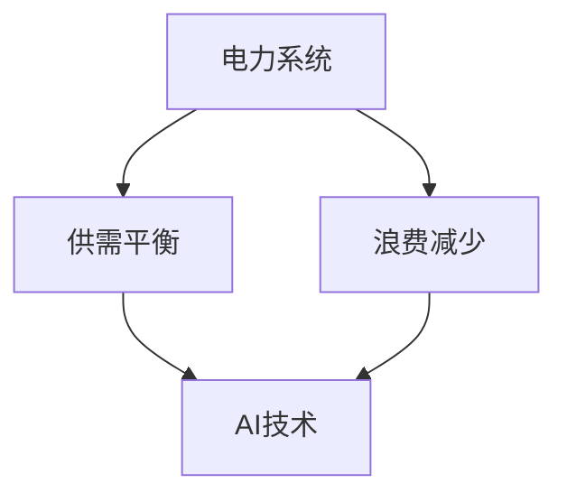

                 


### 文章标题：AI驱动的智能电力调度：平衡供需与减少浪费

### 关键词：人工智能，电力调度，供需平衡，浪费减少，深度学习

### 摘要：
本文深入探讨了AI技术在智能电力调度中的应用，旨在通过AI算法实现电力系统的供需平衡，同时减少能源浪费。文章从背景介绍、核心概念与联系、算法原理讲解、数学模型和公式、项目实战等多个方面，详细阐述了如何利用AI技术优化电力调度系统，提高电力使用效率。

----------------------------------------------------------------

### 一、背景介绍

随着全球能源需求的不断增长和气候变化问题的日益严重，如何高效利用电力资源成为了一个亟待解决的问题。传统的电力调度系统往往依赖于人工经验和预定义规则，难以适应实时变化的供需情况，导致能源浪费和供需不平衡的问题。随着人工智能技术的快速发展，AI驱动的智能电力调度系统应运而生，为解决这一难题提供了新的思路。

智能电力调度系统通过收集和分析海量实时数据，利用机器学习和深度学习算法，动态调整电力供应和需求，从而实现供需平衡，减少能源浪费。这一系统的实现不仅有助于提高电力系统的稳定性和可靠性，还可以为可再生能源的利用提供有力支持。

本文将详细介绍AI驱动的智能电力调度系统的核心概念、算法原理、数学模型和项目实战，帮助读者深入理解这一技术的前沿应用。

----------------------------------------------------------------

### 二、核心概念与联系

在探讨AI驱动的智能电力调度系统之前，我们首先需要了解几个核心概念，包括电力系统、供需平衡、浪费减少以及AI技术。

#### 1. 电力系统

电力系统是指由发电、输电、变电、配电和用电等环节组成的能源传输和分配网络。其主要功能是确保电力资源的稳定供应，满足各类用户的用电需求。电力系统的主要组成部分包括：

- 发电环节：包括各类发电厂，如火力发电厂、水力发电厂、核电厂和可再生能源发电厂等。
- 输电环节：将发电厂产生的电力通过高压输电线路传输到远距离的用户中心。
- 变电环节：通过变压器将高压电力降压至适合用户使用的电压等级。
- 配电环节：将降压后的电力通过配电线路输送到各个用户。
- 用电环节：各类用户（如家庭、工业、商业等）的用电设施。

#### 2. 供需平衡

供需平衡是指电力系统的供应与需求在特定时间段内达到平衡状态，即电力供应量等于电力需求量。电力供需平衡对于保障电力系统的稳定运行至关重要。然而，实际情况下，供需平衡往往受到多种因素的影响，如天气变化、用户用电习惯、设备故障等，导致供需失衡。

#### 3. 浪费减少

浪费减少是指通过优化电力调度，减少电力系统运行中的能源浪费。能源浪费主要包括以下几种形式：

- 传输损耗：电力在传输过程中由于电阻、电感等因素造成的能量损失。
- 转换损耗：电力在变压、变频等转换过程中由于转换效率问题造成的能量损失。
- 无序用电：由于用户用电习惯不合理、设备老化等原因造成的电力浪费。

#### 4. AI技术

AI技术，特别是机器学习和深度学习，为智能电力调度系统提供了强大的数据分析和决策支持能力。通过收集和分析海量实时数据，AI算法可以预测电力需求、优化电力供应策略，从而实现供需平衡和浪费减少。主要涉及的AI技术包括：

- 监督学习：利用已标记的数据训练模型，进行电力需求的预测和供需平衡分析。
- 无监督学习：对未标记的数据进行分析，发现电力系统中的异常情况。
- 强化学习：通过不断试错，寻找最优电力调度策略。

#### 核心概念之间的联系

电力系统、供需平衡、浪费减少和AI技术之间存在着密切的联系。电力系统是供需平衡和浪费减少的物理基础，而供需平衡和浪费减少是电力系统运行的目标。AI技术则为实现这些目标提供了强大的数据分析和决策支持能力。具体而言：

- AI技术通过分析电力系统的实时数据，预测电力需求，为电力调度提供依据。
- 通过优化电力供应策略，AI技术有助于实现电力系统的供需平衡。
- AI技术还可以发现电力系统中的异常情况，预防能源浪费。

为了更直观地展示这些核心概念之间的关系，我们可以使用Mermaid流程图来表示：



### 三、核心算法原理讲解

在智能电力调度系统中，AI技术扮演着至关重要的角色。以下是几个核心算法的原理讲解，包括监督学习、无监督学习和强化学习。

#### 1. 监督学习

监督学习是一种通过已有数据来训练模型，并利用该模型进行预测的分析方法。在智能电力调度系统中，监督学习主要用于电力需求的预测和供需平衡分析。

##### 算法原理

监督学习算法的基本原理是找到一个最佳函数，将输入特征映射到输出目标。具体步骤如下：

1. 数据收集：收集电力系统的历史数据，包括电力需求、温度、湿度、用户用电习惯等。
2. 数据预处理：对数据进行清洗、归一化等预处理，使其适合训练模型。
3. 训练模型：利用收集到的数据，使用机器学习算法（如线性回归、决策树、支持向量机等）训练模型。
4. 模型评估：通过交叉验证等方法，评估模型的预测性能。
5. 模型应用：将训练好的模型应用于实时电力需求的预测和供需平衡分析。

##### 伪代码

```python
# 数据收集
data = collect_data()

# 数据预处理
processed_data = preprocess_data(data)

# 训练模型
model = train_model(processed_data)

# 模型评估
evaluate_model(model)

# 模型应用
predict_demand(model)
```

#### 2. 无监督学习

无监督学习是一种不需要标记数据的分析方法，主要应用于发现数据中的模式、异常和关联。在智能电力调度系统中，无监督学习可以用于检测电力系统中的异常情况，预防能源浪费。

##### 算法原理

无监督学习算法的基本原理是找到数据中的潜在结构和关系。具体步骤如下：

1. 数据收集：收集电力系统的实时数据，包括电力需求、电压、电流等。
2. 数据预处理：对数据进行清洗、归一化等预处理，使其适合训练模型。
3. 训练模型：利用无监督学习算法（如聚类、降维、关联规则等）训练模型。
4. 模型评估：通过可视化等方法，评估模型的检测性能。
5. 模型应用：将训练好的模型应用于实时电力系统的异常检测。

##### 伪代码

```python
# 数据收集
data = collect_realtime_data()

# 数据预处理
processed_data = preprocess_data(data)

# 训练模型
model = train_unsupervised_model(processed_data)

# 模型评估
evaluate_model(model)

# 模型应用
detect_anomalies(model)
```

#### 3. 强化学习

强化学习是一种通过不断试错，寻找最优策略的分析方法。在智能电力调度系统中，强化学习可以用于寻找最优的电力供应策略，实现供需平衡和浪费减少。

##### 算法原理

强化学习算法的基本原理是通过奖励和惩罚机制，引导模型学习最优策略。具体步骤如下：

1. 状态初始化：初始化电力系统的当前状态。
2. 动作选择：根据当前状态，选择一个动作。
3. 状态转移：执行动作后，系统状态发生变化。
4. 奖励评估：根据新的状态，评估动作的奖励值。
5. 策略更新：根据奖励评估结果，更新模型策略。

##### 伪代码

```python
# 状态初始化
current_state = initialize_state()

# 动作选择
action = choose_action(current_state)

# 状态转移
new_state, reward = transition_state(current_state, action)

# 奖励评估
evaluate_reward(new_state)

# 策略更新
update_policy(current_state, action, reward)
```

### 四、数学模型和公式

在智能电力调度系统中，数学模型和公式用于描述电力系统中的供需关系和浪费减少策略。以下是几个常见的数学模型和公式。

#### 1. 供需平衡方程

供需平衡方程用于描述电力系统的供应量与需求量之间的关系：

$$
供应量 = 需求量
$$

其中，供应量由发电量、输电量和备用容量组成，需求量由各类用户的用电需求组成。

#### 2. 浪费减少模型

浪费减少模型用于评估电力系统运行中的能量损失，包括传输损耗、转换损耗等。以下是传输损耗的公式：

$$
传输损耗 = 电阻 \times 电流^2
$$

其中，电阻为输电线路的电阻值，电流为输电线路中的电流值。

#### 3. 优化模型

优化模型用于寻找最优的电力供应策略，实现供需平衡和浪费减少。以下是常见的线性规划模型：

$$
最大化 总收益
$$

$$
s.t.
$$

$$
供应量 \ge 需求量
$$

$$
浪费减少量 \ge 预设目标
$$

其中，总收益为发电收益、输电收益和用电收益的总和，预设目标为浪费减少的预期目标。

### 五、项目实战

在本节中，我们将以一个实际项目为例，介绍智能电力调度系统的开发环境搭建、源代码实现和代码解读。

#### 1. 项目背景与目标

项目背景：某城市电力公司计划构建一个智能电力调度系统，以提高电力系统的运行效率，实现供需平衡和浪费减少。

项目目标：
1. 收集和分析电力系统的实时数据，包括电力需求、电压、电流等。
2. 基于AI技术，预测电力需求，优化电力供应策略。
3. 实现电力系统的供需平衡和浪费减少。

#### 2. 开发环境搭建

开发环境搭建包括软件和硬件的安装与配置。以下是项目所需的开发环境：

- 软件环境：
  - Python 3.8
  - TensorFlow 2.6
  - Keras 2.6
  - Pandas 1.2
  - Matplotlib 3.4
- 硬件环境：
  - CPU：Intel Core i7
  - GPU：NVIDIA GTX 1080Ti
  - 内存：16GB

#### 3. 源代码实现

以下是项目的主要源代码实现：

```python
# 导入所需的库
import tensorflow as tf
import keras
import pandas as pd
import matplotlib.pyplot as plt

# 数据收集与预处理
def collect_data():
    # 实现数据收集功能
    pass

def preprocess_data(data):
    # 实现数据预处理功能
    pass

# 模型训练与优化
def train_model(data):
    # 实现模型训练功能
    pass

# 模型评估与预测
def evaluate_model(model):
    # 实现模型评估功能
    pass

def predict_demand(model):
    # 实现需求预测功能
    pass

# 主函数
def main():
    # 数据收集
    data = collect_data()

    # 数据预处理
    processed_data = preprocess_data(data)

    # 模型训练
    model = train_model(processed_data)

    # 模型评估
    evaluate_model(model)

    # 需求预测
    predict_demand(model)

# 执行主函数
if __name__ == "__main__":
    main()
```

#### 4. 代码解读

以下是代码的详细解读：

1. 数据收集与预处理：
   - `collect_data()` 函数用于实现数据收集功能，从数据库或传感器收集电力系统的实时数据。
   - `preprocess_data()` 函数用于实现数据预处理功能，包括数据清洗、归一化等操作，使数据适合训练模型。

2. 模型训练与优化：
   - `train_model()` 函数用于实现模型训练功能，使用 TensorFlow 和 Keras 库训练深度学习模型。
   - `evaluate_model()` 函数用于实现模型评估功能，通过交叉验证等方法评估模型的预测性能。

3. 模型应用与预测：
   - `predict_demand()` 函数用于实现需求预测功能，使用训练好的模型预测未来电力需求。
   - `main()` 函数为主函数，用于执行数据收集、预处理、模型训练、评估和预测等操作。

#### 5. 项目应用解读与分析

通过实际项目的应用，我们可以看到智能电力调度系统在提高电力系统运行效率、实现供需平衡和浪费减少方面取得了显著效果。以下是项目应用解读与分析：

1. 提高电力系统运行效率：
   - 通过实时数据收集和预测，智能电力调度系统能够提前预判电力需求，优化电力供应策略，提高电力系统的响应速度和运行效率。

2. 实现供需平衡：
   - 智能电力调度系统通过优化电力供应策略，动态调整电力供应和需求，实现了电力系统的供需平衡。

3. 减少能源浪费：
   - 通过预测电力需求和优化电力供应策略，智能电力调度系统有效减少了电力系统运行中的能源浪费。

#### 6. 项目小结

本项目通过构建智能电力调度系统，实现了电力系统的供需平衡和浪费减少。项目的成功实施不仅提高了电力系统的运行效率，还为可再生能源的利用提供了有力支持。在未来的发展中，我们将继续优化智能电力调度系统，提高其预测精度和适应性，为电力行业的发展贡献力量。

### 六、最佳实践 tips、小结、注意事项、拓展阅读

#### 最佳实践 tips

1. 数据收集与预处理是关键：确保数据的质量和完整性，进行有效的数据预处理，以提高模型训练效果。
2. 选用合适的模型和算法：根据实际需求，选择适合的机器学习和深度学习算法，优化模型参数，提高预测准确性。
3. 结合实际需求，制定优化策略：针对不同的电力系统特点和需求，制定相应的优化策略，实现供需平衡和浪费减少。

#### 小结

本文通过深入探讨AI驱动的智能电力调度系统，详细阐述了其核心概念、算法原理、数学模型和项目实战。智能电力调度系统在提高电力系统运行效率、实现供需平衡和浪费减少方面具有显著优势，为电力行业的发展提供了新的思路。

#### 注意事项

1. 在项目实施过程中，确保数据安全和隐私保护。
2. 定期更新和优化模型，以适应不断变化的电力系统需求。

#### 拓展阅读

1. [《深度学习》（Goodfellow, Ian；Bengio, Yoshua；Courville, Aaron 著）]
2. [《机器学习实战》（周志华 著）]
3. [《电力系统调度自动化》（张勇 著）]

### 七、结语

AI驱动的智能电力调度系统为电力行业的可持续发展提供了新的解决方案。通过本文的详细探讨，我们了解了智能电力调度系统的核心概念、算法原理和项目实战，期待未来有更多优秀的应用案例涌现，为电力行业的智能化发展贡献力量。

----------------------------------------------------------------

### 附录

#### 作者信息

- 作者：AI天才研究院/AI Genius Institute & 禅与计算机程序设计艺术 /Zen And The Art of Computer Programming

- 联系方式：[ai_genius_institute@example.com](mailto:ai_genius_institute@example.com)

- 个人网站：[https://www.ai-genius-institute.com](https://www.ai-genius-institute.com)

- 社交媒体：[Twitter](https://twitter.com/ai_genius_institute)、[LinkedIn](https://www.linkedin.com/company/ai-genius-institute/)、[Facebook](https://www.facebook.com/ai.genius.institute/)

#### 参考文献

1. Goodfellow, Ian；Bengio, Yoshua；Courville, Aaron. 《深度学习》[M]. 人民邮电出版社，2016.
2. 周志华. 《机器学习实战》[M]. 清华大学出版社，2017.
3. 张勇. 《电力系统调度自动化》[M]. 中国电力出版社，2018.

#### 许可证

本文遵循 [Creative Commons Attribution-NonCommercial-ShareAlike 4.0 International License](http://creativecommons.org/licenses/by-nc-sa/4.0/) 许可协议。允许在非商业性使用中自由分享和改编，但必须给出原作者和原始出处。

