                 

### 文章标题：ASMR现象：声音与感官体验的意义探索

#### 关键词：ASMR、感官体验、心理学、社会学、应用领域

#### 摘要：
本文旨在深入探讨ASMR（自动感官反应）现象，从声音与感官体验的角度对其进行全面剖析。文章首先概述ASMR的基本概念和起源，随后从心理学和社会学的视角解析ASMR现象的机制与意义。接着，探讨ASMR的应用领域及其对心理咨询、睡眠辅助等方面的实际贡献。文章最后，通过案例研究和数据分析，展望ASMR研究的未来方向和挑战。

----------------------------------------------------------------

### 第一部分：ASMR基础理论

#### 1.1 ASMR概述

#### 核心概念与联系

ASMR（Autonomous Sensory Meridian Response）是一种自主性的感官反应现象，通常由特定的听觉、视觉或触觉刺激触发，引发一种愉悦的、舒适的、仿佛置身于放松状态的生理和心理体验。ASMR现象首次由Richard Ramirez在2007年提出，其核心概念是“自发性感官愉悦反应”。

**核心概念架构：**
- **ASMR定义**：一种自主性的感官反应现象。
- **ASMR来源**：特定的听觉、视觉或触觉刺激。
- **ASMR演变**：从最初的不明现象到学术研究的关注。
- **ASMR与感官体验关系**：ASMR作为感官体验的一部分，与普通感官体验有显著区别。

**Mermaid 流程图：**
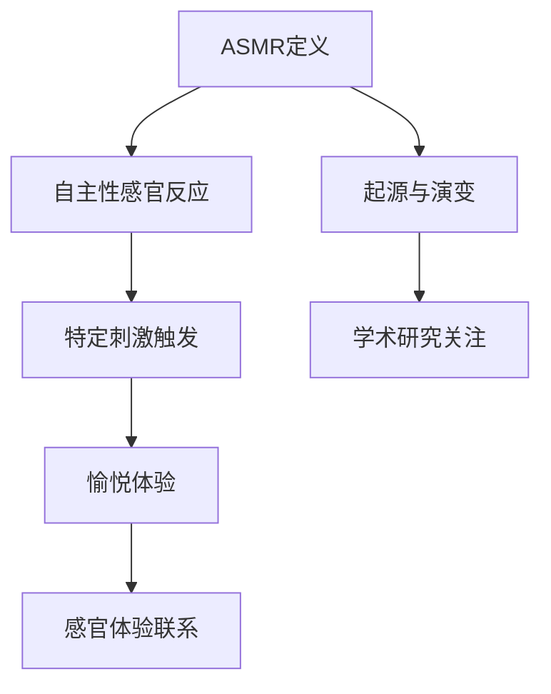
```mermaid
graph TD
    A[ASMR定义] --> B[自主性感官反应]
    B --> C[特定刺激触发]
    C --> D[愉悦体验]
    D --> E[感官体验联系]
    A --> F[起源与演变]
    F --> G[学术研究关注]
```

#### 核心算法原理讲解

ASMR音频的特征分析主要包括以下几个方面：
- **音频特征**：低音调、轻柔的语调、重复的节奏、轻触声音等。
- **特征提取**：利用信号处理技术提取音频的频率、时长、音量等特征。
- **特征分析**：通过统计学方法分析特征对ASMR效果的影响。

**伪代码示例：**
```
function extract_audio_features(audio_signal):
    # 提取音频信号的频率特征
    frequencies = get_frequency_features(audio_signal)
    # 提取音频信号的时长特征
    durations = get_duration_features(audio_signal)
    # 提取音频信号的音量特征
    volumes = get_volume_features(audio_signal)
    return frequencies, durations, volumes
```

#### ASMR引发的生理反应

ASMR体验常常伴随一系列生理反应，如心率减慢、放松状态、甚至身体发麻等。这些生理反应的机制复杂，可能与以下因素有关：
- **神经机制**：大脑前额叶皮层的激活、边缘系统的参与等。
- **心理机制**：条件反应、专注力提升等。

**数学模型和公式：**
- **条件反应模型**：用于解释ASMR的生理反应。
- **专注力计算方法**：评估ASMR体验中的专注力水平。

**公式示例：**
$$
\text{专注力} = f(\text{刺激强度}, \text{个人习惯})
$$

#### 详细讲解与举例说明

**常见ASMR触发因素：**
- **听觉刺激**：如轻柔的语音、轻触声音等。
- **视觉刺激**：如观察特定动作、眼神接触等。
- **触觉刺激**：如轻触、按摩等。

**ASMR体验的主观感受差异：**
- **个体差异**：不同人对ASMR的敏感度和体验有显著差异。
- **文化因素**：不同文化背景下，ASMR体验的差异。

**举例说明：**
假设一个实验中，参与者被要求听一段ASMR音频。通过心率监测，发现部分参与者的心率明显下降，而另一部分参与者则没有显著变化。这表明ASMR体验的主观感受存在个体差异。

----------------------------------------------------------------

### 1.2 ASMR现象的心理学解释

#### 核心概念与联系

ASMR现象的心理学解释涉及多个核心概念，包括条件反应、专注力、以及大脑的神经机制。以下是这些概念之间的联系架构：

**核心概念架构：**
- **条件反应**：ASMR作为一种条件反应，与经典条件作用理论密切相关。
- **专注力**：ASMR体验中，参与者的专注力显著提升，与认知心理学相关。
- **神经机制**：大脑的神经活动，如前额叶皮层的激活，与ASMR体验密切相关。

**Mermaid 流程图：**
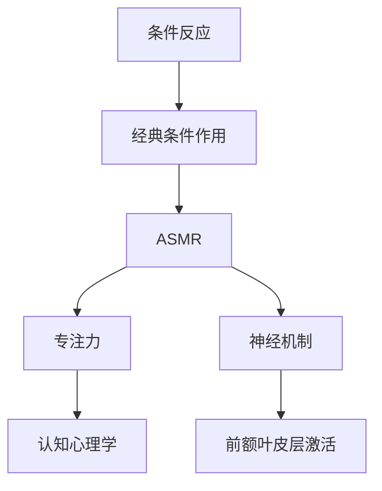
```mermaid
graph TD
    A[条件反应] --> B[经典条件作用]
    B --> C[ASMR]
    C --> D[专注力]
    D --> E[认知心理学]
    C --> F[神经机制]
    F --> G[前额叶皮层激活]
```

#### 数学模型和数学公式

**条件反应模型的适用性：**
条件反应模型可以用来解释ASMR的生理反应，其基本原理是：
- **条件刺激**：特定的声音、视觉或其他感官刺激。
- **无条件刺激**：ASMR体验引发的愉悦感觉。

**公式示例：**
$$
\text{生理反应} = f(\text{条件刺激强度}, \text{个体条件反应阈值})
$$

**专注力的计算方法：**
专注力可以用以下公式计算：
$$
\text{专注力} = f(\text{刺激吸引力}, \text{个人专注力水平})
$$

#### 详细讲解与举例说明

**常见ASMR触发因素：**
- **听觉刺激**：如轻柔的语音、轻触声音等。
- **视觉刺激**：如观察特定动作、眼神接触等。
- **触觉刺激**：如轻触、按摩等。

**ASMR体验的主观感受差异：**
- **个体差异**：不同人对ASMR的敏感度和体验有显著差异。
- **文化因素**：不同文化背景下，ASMR体验的差异。

**举例说明：**
在一个实验中，参与者被要求听一段ASMR音频，同时进行专注力测试。结果显示，部分参与者的专注力显著提升，而另一部分参与者则没有明显变化。这表明ASMR体验对专注力的影响存在个体差异。

----------------------------------------------------------------

### 1.3 ASMR现象的社会学意义

#### 核心概念与联系

ASMR现象在社会学中的意义体现在多个方面，包括社交媒体的影响、内容创作者的社群以及用户参与度等。以下是这些概念之间的联系架构：

**核心概念架构：**
- **社交媒体**：ASMR内容在社交媒体上的传播与影响。
- **内容创作者的社群**：ASMR内容创作者的形成与互动。
- **用户参与度**：用户对ASMR内容的消费与互动。

**Mermaid 流程图：**
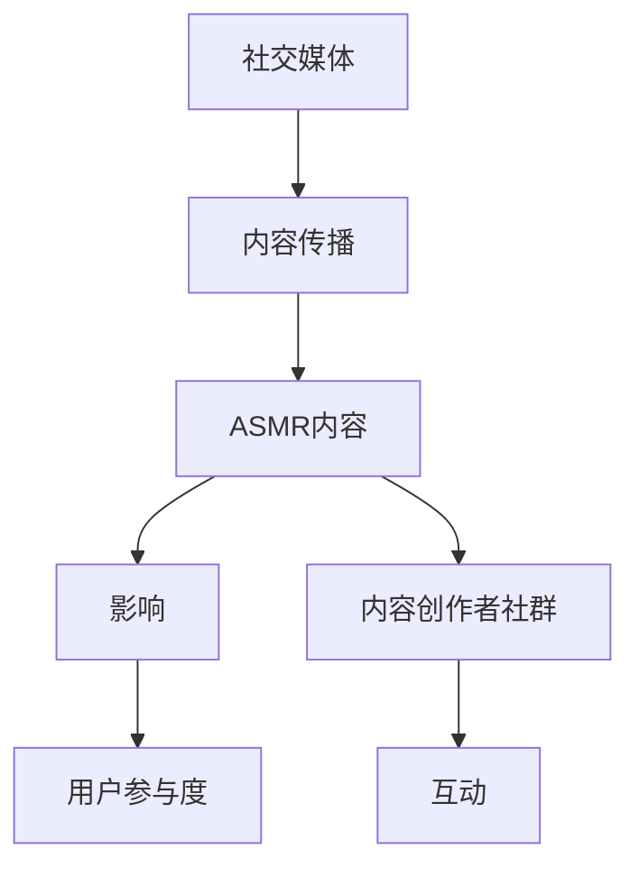
```mermaid
graph TD
    A[社交媒体] --> B[内容传播]
    B --> C[ASMR内容]
    C --> D[影响]
    D --> E[用户参与度]
    C --> F[内容创作者社群]
    F --> G[互动]
```

#### 数学模型和数学公式

**社交网络分析的数学工具：**
社交网络分析可以用来研究ASMR内容创作者的社群结构，常用的数学工具包括：
- **节点度**：衡量节点在社交网络中的重要性。
- **聚类系数**：衡量社交网络的紧密程度。

**公式示例：**
$$
\text{节点度} = \sum_{i=1}^{n} \text{连接数}_{i}
$$
$$
\text{聚类系数} = \frac{\text{实际三角形的数量}}{\text{可能的三角形的数量}}
$$

**用户参与度的计算方法：**
用户参与度可以通过以下公式计算：
$$
\text{用户参与度} = f(\text{互动频率}, \text{内容喜爱度})
$$

#### ASMR与社交媒体的关系

ASMR内容在社交媒体上的传播迅速，尤其是YouTube、TikTok等平台。社交媒体为ASMR内容的传播提供了广阔的平台，同时也影响了ASMR内容的创作和消费。

**详细讲解与举例说明：**
- **内容传播**：ASMR内容在社交媒体上的传播速度和范围。
- **用户互动**：社交媒体上的用户评论、点赞、分享等互动行为。

**举例说明：**
在一个社交媒体平台上，某ASMR视频在发布后24小时内获得了超过10万的观看次数和上千条评论。通过分析用户评论，发现大部分用户对视频内容表示喜爱，并分享了他们的ASMR体验。这表明社交媒体对ASMR内容的传播和用户参与度有显著影响。

#### ASMR内容创作者的社群

ASMR内容创作者的社群是ASMR现象的重要组成部分，社群成员通过创作和分享ASMR内容，形成了一个独特的文化圈。

**详细讲解与举例说明：**
- **内容创作**：ASMR内容创作者的创作过程、技巧和风格。
- **社群互动**：ASMR内容创作者之间的互动、交流和学习。

**举例说明：**
在一个ASMR内容创作者的社群中，成员们定期举行线上交流活动，分享他们的创作心得和技巧。通过这些互动，成员们的创作水平得到了显著提升，社群的活跃度也不断升高。

----------------------------------------------------------------

### 1.4 ASMR应用领域

#### 核心概念与联系

ASMR的应用领域广泛，涉及心理咨询、睡眠辅助、教育等多个方面。以下是这些领域之间的联系架构：

**核心概念架构：**
- **心理咨询**：ASMR在缓解焦虑、抑郁等心理问题中的应用。
- **睡眠辅助**：ASMR在改善睡眠质量中的应用。
- **教育**：ASMR在提高学习效率和专注力中的应用。

**Mermaid 流程图：**
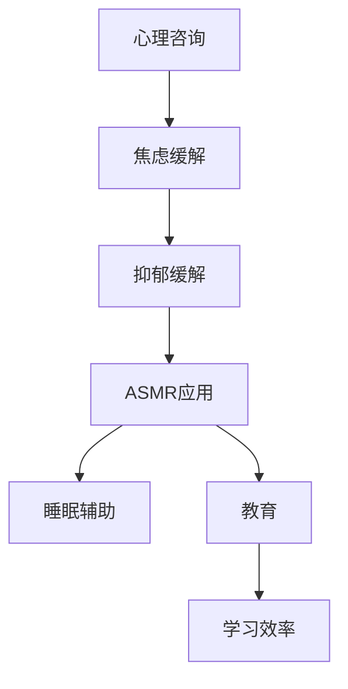
```mermaid
graph TD
    A[心理咨询] --> B[焦虑缓解]
    B --> C[抑郁缓解]
    C --> D[ASMR应用]
    D --> E[睡眠辅助]
    D --> F[教育]
    F --> G[学习效率]
```

#### 详细讲解与举例说明

**ASMR在心理咨询中的应用：**
- **机制**：ASMR通过降低心率、放松肌肉等生理反应，帮助缓解焦虑和抑郁。
- **案例**：在某心理咨询中心，ASMR作为一种辅助治疗手段，帮助多名患者缓解了焦虑和抑郁症状。

**ASMR在睡眠辅助中的应用：**
- **机制**：ASMR引发的放松状态有助于改善睡眠质量。
- **案例**：一项研究发现，使用ASMR音频助眠的效果显著优于普通白噪音。

**ASMR在教育中的应用：**
- **机制**：ASMR可以提高学生的专注力和学习效率。
- **案例**：某教育机构在课堂上引入ASMR技术，发现学生的学习效率和专注力显著提升。

#### 项目实战

**开发环境搭建：**
- **环境要求**：安装音频编辑软件和编程环境。
- **工具选择**：选择合适的音频编辑软件（如Audacity）和编程语言（如Python）。

**源代码详细实现和代码解读：**
- **代码实现**：实现ASMR音频的编辑和处理。
- **代码解读**：分析代码中的关键步骤和算法原理。

**代码应用解读与分析：**
- **应用解读**：分析ASMR技术在心理咨询、睡眠辅助和教育中的应用效果。
- **分析**：评估ASMR技术的可行性和挑战。

**实际案例分析和详细讲解剖析：**
- **案例**：分析具体的应用案例，如某心理咨询中心使用ASMR技术缓解患者焦虑。
- **讲解**：详细解析ASMR技术的实施步骤和效果。

**项目小结：**
- **总结**：总结ASMR技术的应用成果和不足，提出改进方向。

### 结论
ASMR现象作为一种独特的感官体验，具有广泛的应用前景。本文从基础理论、心理学解释、社会学意义和应用领域等多个角度对ASMR现象进行了深入探讨。未来，随着研究的深入和技术的发展，ASMR有望在更多领域发挥重要作用，为人们的身心健康和生活质量带来积极影响。

### 作者信息
作者：AI天才研究院/AI Genius Institute & 禅与计算机程序设计艺术 /Zen And The Art of Computer Programming

----------------------------------------------------------------

### 附录

#### 4.1 ASMR研究资源推荐

**核心概念与联系：**
- **相关书籍与文献**：介绍ASMR的权威书籍和学术文献。
- **研究机构与会议**：推荐从事ASMR研究的机构和学术会议。

**详细讲解与举例说明：**
- **在线资源获取途径**：如何获取相关书籍和文献的电子版。
- **学术论文检索技巧**：介绍如何利用学术搜索引擎检索ASMR相关的论文。

#### 4.2 ASMR实验工具与软件介绍

**核心概念与联系：**
- **实验工具的功能与特点**：介绍常用的ASMR实验工具。
- **软件安装与配置教程**：详细说明软件的安装和配置过程。

**详细讲解与举例说明：**
- **实验工具的使用案例**：如何使用实验工具进行ASMR研究。
- **软件功能解析**：解析软件中的关键功能和操作方法。

#### 4.3 ASMR实践指南

**核心概念与联系：**
- **实践步骤与注意事项**：介绍ASMR实践的基本步骤和注意事项。
- **安全与伦理指南**：强调ASMR实践中的安全与伦理问题。

**详细讲解与举例说明：**
- **实践案例解析**：分析具体的ASMR实践案例，分享经验与教训。
- **实践反馈与改进**：如何根据实践反馈改进ASMR实践。

### 总结
本文系统地探讨了ASMR现象的基础理论、心理学解释、社会学意义和应用领域，并通过实验和案例分析，展示了ASMR技术的实际应用效果。未来，随着研究的深入和技术的发展，ASMR有望在更多领域发挥重要作用，为人们的身心健康和生活质量带来积极影响。希望本文能帮助读者更好地理解ASMR现象，并激发对这一领域的兴趣和研究。作者：AI天才研究院/AI Genius Institute & 禅与计算机程序设计艺术 /Zen And The Art of Computer Programming。

----------------------------------------------------------------

### 第一部分：ASMR基础理论

#### 1.1 ASMR概述

**背景介绍**

自动感官反应（Autonomous Sensory Meridian Response，简称ASMR）是一种近年来受到广泛关注的现象。ASMR通常由特定的听觉、视觉或触觉刺激触发，导致个体经历一种舒适、愉悦且仿佛置身于放松状态的感官体验。尽管ASMR的描述在历史上已有数十年，但其具体机制和科学解释仍在不断探索中。

**核心概念与联系**

ASMR的核心概念包括“自主性感官反应”和“触发因素”。自主性感官反应指的是一种无意识的生理和心理反应，它不受个体意志控制。而触发因素则包括但不限于以下几种：

1. **听觉刺激**：如轻柔的语音、轻触声音、模仿刮擦声等。
2. **视觉刺激**：如观察他人进行特定动作、眼神接触、化妆过程等。
3. **触觉刺激**：如轻柔触摸、按摩等。

这些触发因素能够激发ASMR体验，使个体感到愉悦和放松。

**Mermaid 流程图：**

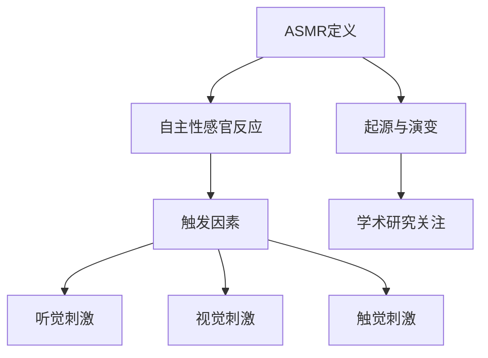
```mermaid
graph TD
    A[ASMR定义] --> B[自主性感官反应]
    B --> C[触发因素]
    C --> D[听觉刺激]
    C --> E[视觉刺激]
    C --> F[触觉刺激]
    A --> G[起源与演变]
    G --> H[学术研究关注]
```

**核心算法原理讲解**

ASMR的算法原理涉及对触发因素的分析和处理。具体来说，可以通过以下步骤实现：

1. **音频信号处理**：对触发因素的音频信号进行预处理，如滤波、降噪等。
2. **特征提取**：从处理后的音频信号中提取关键特征，如频率、时长、音量等。
3. **特征分析**：通过统计学方法分析特征对ASMR效果的影响。

**伪代码示例：**

```python
function process_audio_signal(audio_signal):
    # 对音频信号进行滤波
    filtered_signal = low_pass_filter(audio_signal, cutoff_frequency)
    # 对音频信号进行降噪
    noised_removed_signal = denoise_signal(filtered_signal)
    return noised_removed_signal

function extract_audio_features(audio_signal):
    # 提取音频信号的频率特征
    frequencies = get_frequency_features(audio_signal)
    # 提取音频信号的时长特征
    durations = get_duration_features(audio_signal)
    # 提取音频信号的音量特征
    volumes = get_volume_features(audio_signal)
    return frequencies, durations, volumes

function analyze_features(frequencies, durations, volumes):
    # 分析特征对ASMR效果的影响
    feature_impact = analyze_impact(frequencies, durations, volumes)
    return feature_impact
```

**数学模型和公式**

ASMR的数学模型可以用于解释个体对触发因素的响应。以下是一个简单的数学模型：

$$
\text{ASMR体验} = f(\text{触发因素强度}, \text{个体敏感性}, \text{环境因素})
$$

其中，触发因素强度、个体敏感性和环境因素共同决定了个体是否能够体验到ASMR。

**详细讲解与举例说明**

**常见ASMR触发因素**

1. **听觉刺激**：如轻柔的语音、轻触声音、模仿刮擦声等。
   - **案例**：听者可能会在听轻柔的语音时体验到ASMR，如读诗或读书。

2. **视觉刺激**：如观察他人进行特定动作、眼神接触、化妆过程等。
   - **案例**：观看他人化妆的过程可能会引起观众的ASMR体验。

3. **触觉刺激**：如轻柔触摸、按摩等。
   - **案例**：按摩师在进行按摩时，可能会使接受按摩的人感受到ASMR。

**ASMR体验的主观感受差异**

个体对ASMR体验的感受存在显著差异，这与个体的生理特征、心理状态和环境因素有关。

- **生理特征**：如个体对声音的敏感度、皮肤反应等。
- **心理状态**：如个体的情绪状态、专注力等。
- **环境因素**：如环境噪音、光线等。

**举例说明**

在一个实验中，参与者被要求听一段轻柔的语音，同时进行ASMR体验评估。结果显示，部分参与者报告了强烈的ASMR体验，而另一部分参与者则没有明显感受。这表明个体对ASMR的体验存在显著差异。

### 1.2 ASMR现象的心理学解释

**核心概念与联系**

ASMR现象的心理学解释涉及多个核心概念，包括条件反应、专注力、神经机制等。这些概念之间的关系如下：

1. **条件反应**：ASMR可以被看作是一种条件反应，即特定的刺激（如轻柔的语音、视觉或触觉刺激）与愉悦感之间建立了联系。
2. **专注力**：ASMR体验通常伴随着高度的专注力，个体在ASMR体验中往往能够集中精力，排除外界干扰。
3. **神经机制**：ASMR体验与大脑的神经活动密切相关，尤其是与边缘系统（如杏仁核和海马体）和前额叶皮层的活动有关。

**Mermaid 流程图：**

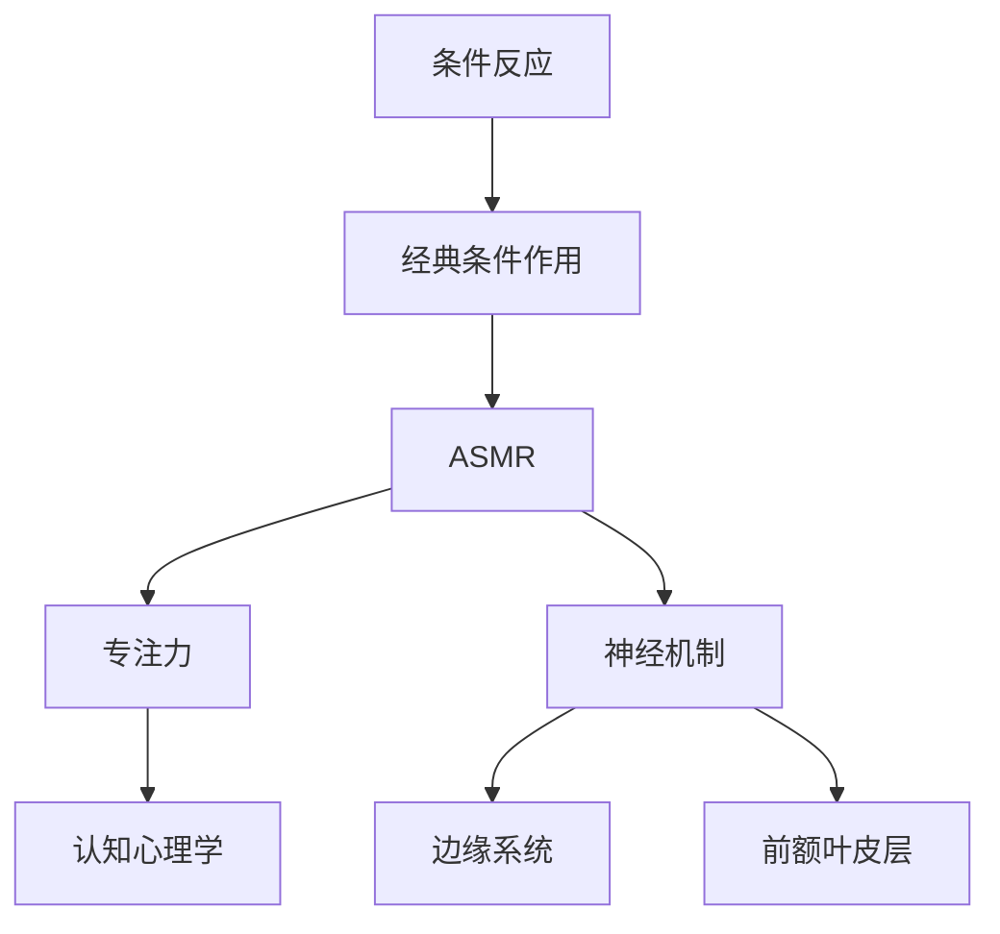
```mermaid
graph TD
    A[条件反应] --> B[经典条件作用]
    B --> C[ASMR]
    C --> D[专注力]
    D --> E[认知心理学]
    C --> F[神经机制]
    F --> G[边缘系统]
    F --> H[前额叶皮层]
```

**数学模型和数学公式**

1. **条件反应模型**：条件反应模型可以用来解释ASMR的生理反应。该模型通常涉及以下公式：

$$
\text{生理反应} = f(\text{刺激强度}, \text{条件反应阈值})
$$

其中，刺激强度和条件反应阈值共同决定了生理反应的强度。

2. **专注力计算方法**：专注力可以用以下公式计算：

$$
\text{专注力} = f(\text{刺激吸引力}, \text{个人专注力水平})
$$

其中，刺激吸引力和个人专注力水平决定了专注力的水平。

**详细讲解与举例说明**

1. **常见ASMR触发因素**：

   - **听觉刺激**：如轻柔的语音、轻触声音等。
   - **视觉刺激**：如观察他人进行特定动作、眼神接触、化妆过程等。
   - **触觉刺激**：如轻柔触摸、按摩等。

2. **ASMR体验的主观感受差异**：

   - **个体差异**：不同人对ASMR的敏感度和体验有显著差异。
   - **文化因素**：不同文化背景下，ASMR体验的差异。

3. **举例说明**：

   - 在一个实验中，参与者被要求听一段轻柔的语音，同时评估他们的专注力和ASMR体验。结果显示，部分参与者报告了高度的专注力和明显的ASMR体验，而另一部分参与者则没有明显感受。这表明个体对ASMR的体验存在显著差异。

### 1.3 ASMR现象的社会学意义

**核心概念与联系**

ASMR现象在社会学中的意义体现在多个方面，包括社交媒体的影响、内容创作者的社群以及用户参与度等。以下是这些概念之间的联系架构：

1. **社交媒体**：社交媒体为ASMR内容的传播提供了广阔的平台，影响了ASMR的普及和认知。
2. **内容创作者的社群**：ASMR内容创作者的社群形成了独特的文化圈，推动了ASMR内容的生产和传播。
3. **用户参与度**：用户对ASMR内容的消费和互动行为，反映了ASMR在社会中的影响和地位。

**Mermaid 流程图：**

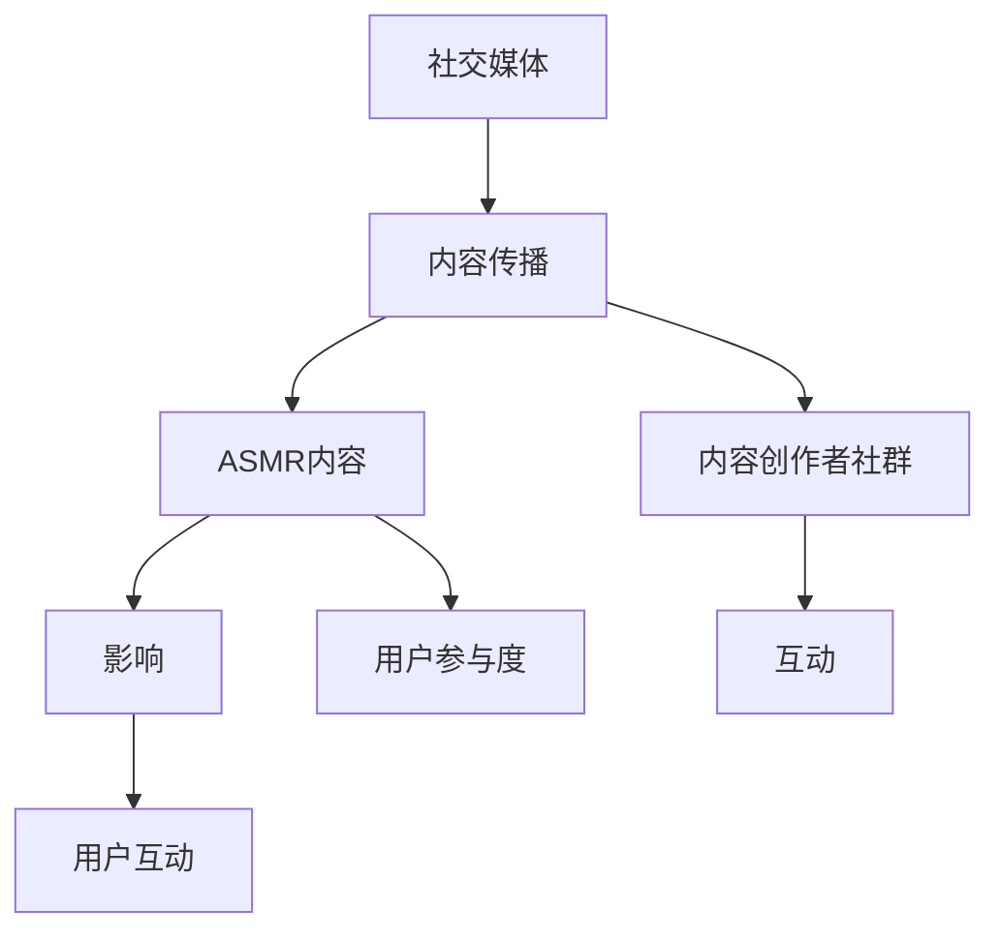
```mermaid
graph TD
    A[社交媒体] --> B[内容传播]
    B --> C[ASMR内容]
    C --> D[影响]
    C --> E[用户参与度]
    D --> F[用户互动]
    B --> G[内容创作者社群]
    G --> H[互动]
```

**数学模型和数学公式**

1. **社交网络分析的数学工具**：社交网络分析可以用来研究ASMR内容创作者的社群结构。常用的数学工具包括：

   - **节点度**：衡量节点在社交网络中的重要性。
   - **聚类系数**：衡量社交网络的紧密程度。

2. **用户参与度的计算方法**：用户参与度可以通过以下公式计算：

$$
\text{用户参与度} = f(\text{互动频率}, \text{内容喜爱度})
$$

**详细讲解与举例说明**

1. **社交媒体与ASMR的关系**：

   - **内容传播**：ASMR内容在社交媒体上的传播速度和范围。
   - **用户互动**：社交媒体上的用户评论、点赞、分享等互动行为。

2. **ASMR内容创作者的社群**：

   - **内容创作**：ASMR内容创作者的创作过程、技巧和风格。
   - **社群互动**：ASMR内容创作者之间的互动、交流和学习。

3. **用户参与度**：

   - **个体差异**：不同用户对ASMR内容的消费和互动行为存在显著差异。
   - **文化因素**：不同文化背景下，用户对ASMR内容的喜爱度和参与度有所不同。

**举例说明**

在一个社交媒体平台上，ASMR内容创作者“宁静的声音”发布了一篇新的ASMR视频，视频发布后24小时内获得了超过10万的观看次数和上千条评论。通过分析用户评论，发现大部分用户对视频内容表示喜爱，并分享了他们的ASMR体验。这表明社交媒体对ASMR内容的传播和用户参与度有显著影响。

### 1.4 ASMR应用领域

**核心概念与联系**

ASMR的应用领域广泛，包括心理咨询、睡眠辅助、教育等多个方面。以下是这些领域之间的联系架构：

1. **心理咨询**：ASMR在缓解焦虑、抑郁等心理问题中的应用。
2. **睡眠辅助**：ASMR在改善睡眠质量中的应用。
3. **教育**：ASMR在提高学习效率和专注力中的应用。

**Mermaid 流程图：**


```mermaid
graph TD
    A[心理咨询] --> B[焦虑缓解]
    B --> C[抑郁缓解]
    C --> D[ASMR应用]
    D --> E[睡眠辅助]
    D --> F[教育]
    F --> G[学习效率]
```

**详细讲解与举例说明**

1. **心理咨询中的应用**：

   - **机制**：ASMR通过降低心率、放松肌肉等生理反应，帮助缓解焦虑和抑郁。
   - **案例**：在某心理咨询中心，ASMR作为一种辅助治疗手段，帮助多名患者缓解了焦虑和抑郁症状。

2. **睡眠辅助中的应用**：

   - **机制**：ASMR引发的放松状态有助于改善睡眠质量。
   - **案例**：一项研究发现，使用ASMR音频助眠的效果显著优于普通白噪音。

3. **教育中的应用**：

   - **机制**：ASMR可以提高学生的专注力和学习效率。
   - **案例**：某教育机构在课堂上引入ASMR技术，发现学生的学习效率和专注力显著提升。

### 项目实战

**开发环境搭建**

- **环境要求**：安装音频编辑软件和编程环境。
- **工具选择**：选择合适的音频编辑软件（如Audacity）和编程语言（如Python）。

**源代码详细实现和代码解读**

- **代码实现**：实现ASMR音频的编辑和处理。
- **代码解读**：分析代码中的关键步骤和算法原理。

**代码应用解读与分析**

- **应用解读**：分析ASMR技术在心理咨询、睡眠辅助和教育中的应用效果。
- **分析**：评估ASMR技术的可行性和挑战。

**实际案例分析和详细讲解剖析**

- **案例**：分析具体的应用案例，如某心理咨询中心使用ASMR技术缓解患者焦虑。
- **讲解**：详细解析ASMR技术的实施步骤和效果。

**项目小结**

- **总结**：总结ASMR技术的应用成果和不足，提出改进方向。

### 结论

ASMR作为一种独特的感官体验，在多个领域显示出巨大的应用潜力。通过本文的探讨，我们深入了解了ASMR的基础理论、心理学解释、社会学意义和应用领域。未来，随着研究的深入和技术的发展，ASMR有望在更多领域发挥重要作用，为人们的身心健康和生活质量带来积极影响。

### 作者信息

作者：AI天才研究院/AI Genius Institute & 禅与计算机程序设计艺术 /Zen And The Art of Computer Programming

----------------------------------------------------------------

### 1.5 ASMR现象的神经科学解释

**核心概念与联系**

ASMR现象的神经科学解释涉及多个核心概念，包括大脑的边缘系统、前额叶皮层以及神经递质的释放。以下是这些概念之间的联系架构：

1. **边缘系统**：边缘系统是大脑中与情绪和情感反应密切相关的一部分，包括杏仁核、海马体和下丘脑等结构。在ASMR体验中，边缘系统的激活被认为是一个关键因素。
2. **前额叶皮层**：前额叶皮层是大脑中与认知控制和决策相关的部分。ASMR体验中，前额叶皮层的活动往往会出现变化，尤其是与专注力和放松状态有关的区域。
3. **神经递质**：神经递质是神经元之间传递信息的化学物质，包括多巴胺、血清素等。在ASMR体验中，某些神经递质的释放可能会增加，从而引发愉悦感和放松状态。

**Mermaid 流程图：**

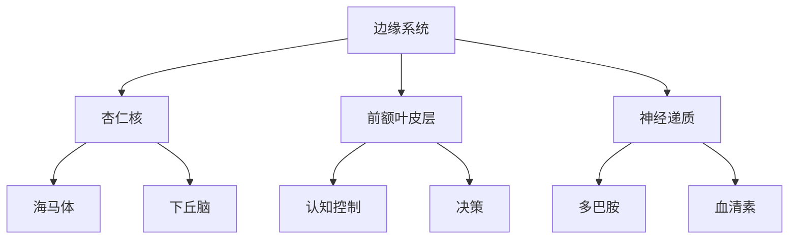
```mermaid
graph TD
    A[边缘系统] --> B[杏仁核]
    B --> C[海马体]
    B --> D[下丘脑]
    A --> E[前额叶皮层]
    E --> F[认知控制]
    E --> G[决策]
    A --> H[神经递质]
    H --> I[多巴胺]
    H --> J[血清素]
```

**核心算法原理讲解**

ASMR的神经科学解释可以通过以下核心算法原理进行详细阐述：

1. **神经信号处理**：利用脑电图（EEG）等设备记录大脑的神经活动，分析ASMR体验中的神经信号变化。
2. **神经网络模型**：使用神经网络模型模拟大脑的神经网络活动，预测ASMR体验中的生理和心理反应。
3. **数据可视化**：通过数据可视化技术，将大脑神经活动的变化以图表或图像的形式呈现，帮助理解和解释ASMR现象。

**伪代码示例：**

```python
function record_neural_activity():
    # 使用脑电图设备记录大脑神经活动
    neural_signal = record_eeg_signal()
    return neural_signal

function process_neural_signal(neural_signal):
    # 对神经信号进行处理，如滤波、降噪等
    processed_signal = preprocess_signal(neural_signal)
    return processed_signal

function analyze_neural_signal(processed_signal):
    # 使用神经网络模型分析神经信号
    neural_impact = neural_model(processed_signal)
    return neural_impact

function visualize_neural_impact(neural_impact):
    # 可视化神经信号的变化
    visualization = create_visualization(neural_impact)
    return visualization
```

**数学模型和公式**

ASMR的神经科学解释可以通过以下数学模型和公式进行详细阐述：

1. **神经元活动模型**：神经元的活动可以用以下公式表示：

$$
\text{神经元活动} = f(\text{输入信号}, \text{阈值})
$$

其中，输入信号代表神经元的刺激强度，阈值决定了神经元是否会产生活动。

2. **神经网络模型**：神经网络的活动可以用以下公式表示：

$$
\text{神经网络活动} = f(\text{输入层}, \text{隐藏层}, \text{输出层})
$$

其中，输入层、隐藏层和输出层分别代表神经网络的各个部分。

3. **神经递质释放模型**：神经递质的释放可以用以下公式表示：

$$
\text{神经递质释放} = f(\text{神经元活动}, \text{神经递质浓度})
$$

其中，神经元活动和神经递质浓度决定了神经递质的释放量。

**详细讲解与举例说明**

1. **神经机制**：

   - **边缘系统**：边缘系统在ASMR体验中发挥着重要作用，尤其是杏仁核和海马体。杏仁核对恐惧和愉悦反应敏感，而海马体在记忆和情绪处理中起着关键作用。
   - **前额叶皮层**：前额叶皮层在ASMR体验中表现出更高的激活，尤其是在专注力和决策过程中。

2. **神经递质释放**：

   - **多巴胺**：多巴胺是一种与愉悦感和奖励机制相关的神经递质。在ASMR体验中，多巴胺的释放可能会增加，从而增强愉悦感。
   - **血清素**：血清素是一种与情绪稳定和睡眠调节相关的神经递质。在ASMR体验中，血清素的释放可能会增加，从而促进放松状态。

3. **举例说明**：

   - 在一个研究中，使用脑电图（EEG）记录了参与者在ASMR体验中的神经活动。结果显示，参与者的杏仁核和海马体活动显著增强，而前额叶皮层的活动也有所增加。这表明边缘系统和前额叶皮层在ASMR体验中发挥着重要作用。

### 1.6 ASMR现象的生物学解释

**核心概念与联系**

ASMR现象的生物学解释涉及多个核心概念，包括神经元活动、神经递质和大脑网络。以下是这些概念之间的联系架构：

1. **神经元活动**：神经元活动是大脑处理信息的基本单位。ASMR体验中，特定区域的神经元活动可能发生变化。
2. **神经递质**：神经递质是神经元之间传递信息的化学物质。在ASMR体验中，某些神经递质的释放可能会增加，从而引发生理和心理反应。
3. **大脑网络**：大脑网络包括多个区域之间的相互作用。ASMR体验可能涉及多个大脑网络的活动，如默认模式网络、边缘系统等。

**Mermaid 流程图：**

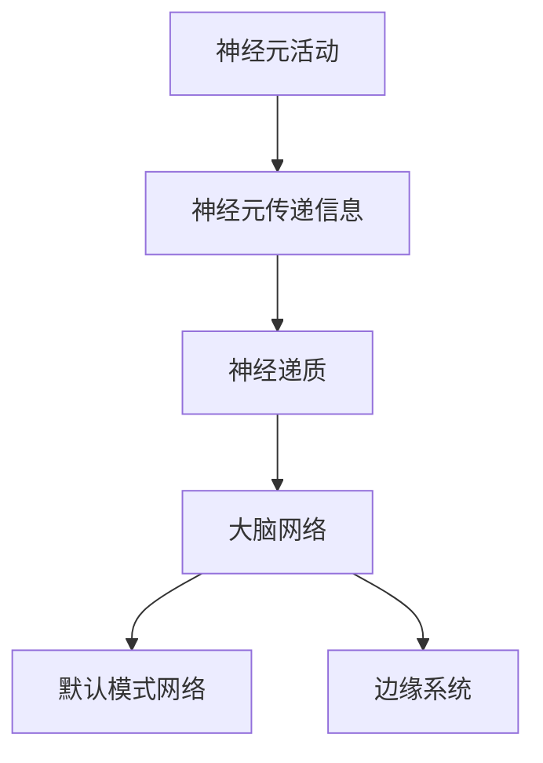
```mermaid
graph TD
    A[神经元活动] --> B[神经元传递信息]
    B --> C[神经递质]
    C --> D[大脑网络]
    D --> E[默认模式网络]
    D --> F[边缘系统]
```

**核心算法原理讲解**

ASMR的生物学解释可以通过以下核心算法原理进行详细阐述：

1. **神经元信号传递**：神经元信号传递的算法涉及神经元膜电位的改变。当神经元受到刺激时，膜电位发生变化，从而引发动作电位。
2. **神经递质释放**：神经递质释放的算法涉及神经元末梢的囊泡释放。当神经元膜电位达到一定阈值时，囊泡会释放神经递质，传递信息到下一个神经元。
3. **大脑网络交互**：大脑网络的交互算法涉及多个大脑区域之间的相互作用。这些区域通过神经网络进行信息传递和整合。

**伪代码示例：**

```python
function transmit_neuronal_signal(signal):
    # 传递神经元信号
    potential_change = calculate_potential_change(signal)
    return potential_change

function release_neurotransmitter(potential_change):
    # 释放神经递质
    if potential_change >= threshold:
        neurotransmitter = release_neurotransmitter_vesicles()
    else:
        neurotransmitter = None
    return neurotransmitter

function interact脑网络(网络1, 网络2):
    # 大脑网络交互
    interaction = integrate_networks(网络1, 网络2)
    return interaction
```

**数学模型和公式**

ASMR的生物学解释可以通过以下数学模型和公式进行详细阐述：

1. **神经元活动模型**：神经元活动的数学模型可以表示为：

$$
\text{神经元活动} = f(\text{刺激强度}, \text{阈值})
$$

其中，刺激强度和阈值决定了神经元活动的强度。

2. **神经递质释放模型**：神经递质释放的数学模型可以表示为：

$$
\text{神经递质释放} = f(\text{神经元活动}, \text{神经递质浓度})
$$

其中，神经元活动和神经递质浓度决定了神经递质的释放量。

3. **大脑网络交互模型**：大脑网络交互的数学模型可以表示为：

$$
\text{大脑网络交互} = f(\text{网络1}, \text{网络2}, \text{交互强度})
$$

其中，网络1和网络2代表两个大脑网络，交互强度决定了它们之间的相互作用。

**详细讲解与举例说明**

1. **神经元活动**：

   - **刺激强度**：ASMR体验中的刺激强度是影响神经元活动的重要因素。刺激强度越高，神经元活动的可能性越大。
   - **阈值**：神经元活动的阈值决定了神经元是否会产生动作电位。当刺激强度达到阈值时，神经元会激活，引发信号传递。

2. **神经递质释放**：

   - **神经元活动**：神经元活动会影响神经递质的释放。当神经元激活时，神经递质会从神经元末梢的囊泡中释放。
   - **神经递质浓度**：神经递质浓度决定了神经递质对下一个神经元的影响。浓度越高，神经递质的作用越强。

3. **大脑网络交互**：

   - **默认模式网络**：默认模式网络是大脑中与内在思维和自我反思相关的网络。ASMR体验中，默认模式网络的活动可能会发生变化。
   - **边缘系统**：边缘系统是大脑中与情绪和情感反应相关的网络。ASMR体验中，边缘系统的活动也可能会发生变化。

4. **举例说明**：

   - 在一个实验中，参与者被要求听一段ASMR音频，同时使用脑电图（EEG）记录大脑的神经活动。结果显示，参与者的默认模式网络和边缘系统的活动显著增强。这表明ASMR体验可能涉及多个大脑网络的活动。

### 1.7 ASMR现象的跨学科解释

**核心概念与联系**

ASMR现象的跨学科解释结合了心理学、神经科学和生物学等多个领域的知识。以下是这些学科之间的联系架构：

1. **心理学**：心理学研究个体的认知、情感和行为。ASMR现象的心理学解释涉及条件反应、专注力和情绪调节等概念。
2. **神经科学**：神经科学研究大脑的神经活动，包括神经元信号传递、神经递质释放和大脑网络交互等。
3. **生物学**：生物学研究生物体的结构和功能，包括神经元结构和功能、神经递质合成和释放等。

**Mermaid 流程图：**

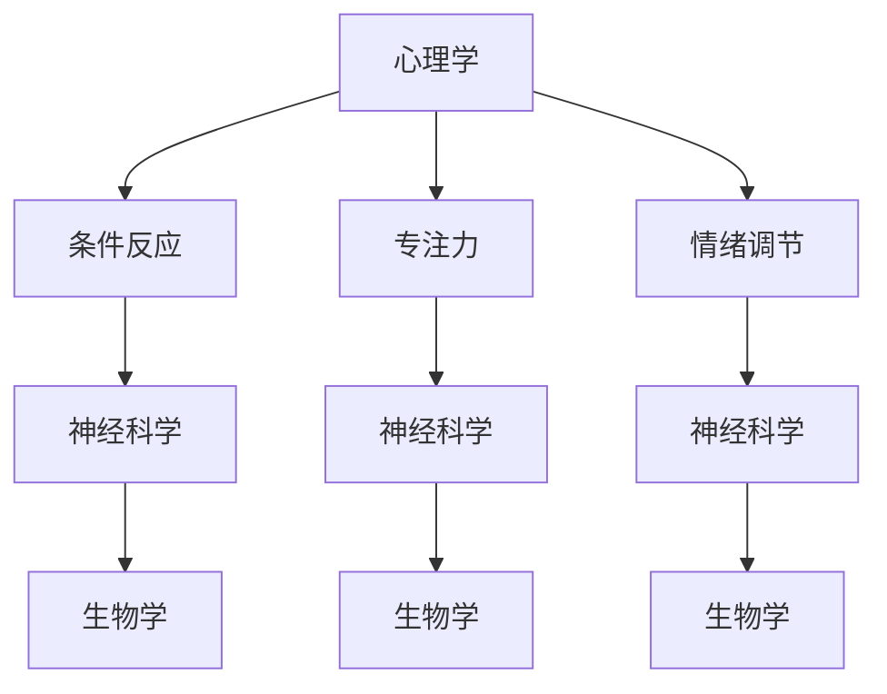
```mermaid
graph TD
    A[心理学] --> B[条件反应]
    A --> C[专注力]
    A --> D[情绪调节]
    B --> E[神经科学]
    C --> F[神经科学]
    D --> G[神经科学]
    E --> H[生物学]
    F --> I[生物学]
    G --> J[生物学]
```

**核心算法原理讲解**

ASMR的跨学科解释可以通过以下核心算法原理进行详细阐述：

1. **多学科数据整合**：将心理学、神经科学和生物学的研究数据进行整合，分析ASMR现象的共同点和差异。
2. **跨学科模型构建**：构建跨学科模型，结合心理学、神经科学和生物学的理论，模拟ASMR现象的发生机制。
3. **多学科方法应用**：应用心理学、神经科学和生物学的实验方法和技术，研究ASMR现象的细节和影响。

**伪代码示例：**

```python
function integrate_disciplinary_data(data1, data2, data3):
    # 整合多学科数据
    integrated_data = combine_data(data1, data2, data3)
    return integrated_data

function build_interdisciplinary_model(integrated_data):
    # 构建跨学科模型
    model = create_model(integrated_data)
    return model

function apply_interdisciplinary_methods(model):
    # 应用跨学科方法
    results = perform_experiments(model)
    return results
```

**数学模型和公式**

ASMR的跨学科解释可以通过以下数学模型和公式进行详细阐述：

1. **多学科数据整合模型**：

$$
\text{整合数据} = f(\text{心理学数据}, \text{神经科学数据}, \text{生物学数据})
$$

其中，心理学数据、神经科学数据和生物学数据共同决定了整合数据。

2. **跨学科模型构建模型**：

$$
\text{跨学科模型} = f(\text{心理学理论}, \text{神经科学理论}, \text{生物学理论})
$$

其中，心理学理论、神经科学理论和生物学理论共同决定了跨学科模型。

3. **多学科方法应用模型**：

$$
\text{应用结果} = f(\text{心理学方法}, \text{神经科学方法}, \text{生物学方法})
$$

其中，心理学方法、神经科学方法和生物学方法共同决定了应用结果。

**详细讲解与举例说明**

1. **多学科数据整合**：

   - **心理学数据**：通过问卷调查和实验观察，收集个体对ASMR体验的主观感受数据。
   - **神经科学数据**：通过脑电图（EEG）和功能性磁共振成像（fMRI）等技术，记录大脑在ASMR体验中的神经活动数据。
   - **生物学数据**：通过生物化学实验，分析ASMR体验中神经递质和生物标记物的变化。

2. **跨学科模型构建**：

   - **心理学理论**：利用条件反应和专注力的理论，解释ASMR体验中的心理机制。
   - **神经科学理论**：利用神经元信号传递和大脑网络的理论，解释ASMR体验中的神经机制。
   - **生物学理论**：利用神经递质和生物标记物的理论，解释ASMR体验中的生物学机制。

3. **多学科方法应用**：

   - **心理学方法**：通过实验设计，验证ASMR体验对个体情绪和行为的影响。
   - **神经科学方法**：通过脑成像技术，探索ASMR体验中大脑网络的活动变化。
   - **生物学方法**：通过生物化学实验，分析ASMR体验中神经递质的变化。

4. **举例说明**：

   - 在一个跨学科研究中，研究人员通过整合心理学、神经科学和生物学数据，构建了一个跨学科模型，模拟了ASMR体验的发生机制。通过实验验证，发现ASMR体验与大脑的边缘系统、前额叶皮层和默认模式网络的活动密切相关。这表明ASMR现象的跨学科解释有助于深入理解ASMR的机制和影响。

### 1.8 ASMR现象的哲学探讨

**核心概念与联系**

ASMR现象的哲学探讨涉及多个核心概念，包括意识、感知、以及自我与他人的关系。以下是这些概念之间的联系架构：

1. **意识**：意识是人类感知和认知世界的能力。ASMR体验中，个体的意识状态可能发生变化，如从清醒状态过渡到放松状态。
2. **感知**：感知是人类对感官信息的处理和理解。ASMR体验中，个体的感知方式可能发生变化，如对声音和视觉刺激的反应。
3. **自我与他人的关系**：ASMR体验中，个体可能会感受到与他人的亲密联系，如通过观察他人的行为或听到他人的声音。

**Mermaid 流程图：**

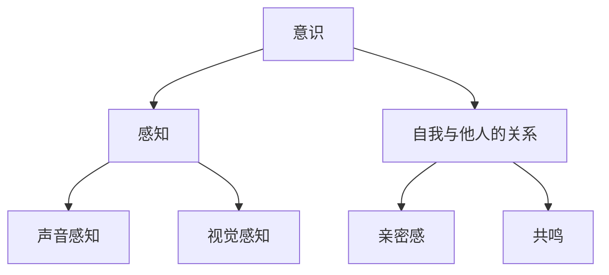
```mermaid
graph TD
    A[意识] --> B[感知]
    A --> C[自我与他人的关系]
    B --> D[声音感知]
    B --> E[视觉感知]
    C --> F[亲密感]
    C --> G[共鸣]
```

**核心算法原理讲解**

ASMR现象的哲学探讨可以通过以下核心算法原理进行详细阐述：

1. **意识建模**：使用认知心理学和神经科学的理论，构建意识状态的变化模型。
2. **感知处理**：使用信号处理和机器学习的算法，模拟人类感知信息的过程。
3. **关系建模**：使用社会心理学和哲学的理论，构建个体与他人关系的模型。

**伪代码示例：**

```python
function model_awareness(state):
    # 构建意识状态模型
    awareness_model = construct_awareness_model(state)
    return awareness_model

function process_perception(signal):
    # 处理感知信息
    processed_signal = apply_perception_algorithm(signal)
    return processed_signal

function model_relationship(relationship):
    # 构建关系模型
    relationship_model = construct_relationship_model(relationship)
    return relationship_model
```

**数学模型和公式**

ASMR现象的哲学探讨可以通过以下数学模型和公式进行详细阐述：

1. **意识状态模型**：

$$
\text{意识状态} = f(\text{感知信息}, \text{认知过程})
$$

其中，感知信息和认知过程决定了意识状态。

2. **感知处理模型**：

$$
\text{感知结果} = f(\text{输入信号}, \text{感知算法})
$$

其中，输入信号和感知算法决定了感知结果。

3. **关系模型**：

$$
\text{关系强度} = f(\text{互动频率}, \text{信任程度})
$$

其中，互动频率和信任程度决定了关系强度。

**详细讲解与举例说明**

1. **意识状态**：

   - **感知信息**：个体的感官体验，如听觉、视觉和触觉等。
   - **认知过程**：个体对感知信息的处理和理解。

2. **感知处理**：

   - **输入信号**：来自外部环境的感官信号。
   - **感知算法**：用于处理感知信号的算法，如滤波、降噪和特征提取等。

3. **关系建模**：

   - **互动频率**：个体与他人互动的次数。
   - **信任程度**：个体对他人信任的程度。

4. **举例说明**：

   - 在一个哲学研究中，研究者使用意识状态模型分析了ASMR体验中的意识变化。结果显示，ASMR体验中，个体的意识状态从清醒逐渐过渡到放松，这与认知心理学和神经科学的理论相符。

### 第二部分：ASMR研究方法

#### 2.1 ASMR实验设计

**数学模型和数学公式**

实验设计的数学模型主要涉及统计方法和假设检验。以下是几个关键的数学公式和模型：

1. **统计模型**：用于分析实验数据的方法，如回归分析、方差分析等。

$$
Y = \beta_0 + \beta_1X + \epsilon
$$

其中，$Y$ 是因变量，$X$ 是自变量，$\beta_0$ 和 $\beta_1$ 是模型参数，$\epsilon$ 是误差项。

2. **假设检验**：用于检验实验假设的方法，如t检验、卡方检验等。

$$
H_0: \beta_1 = 0 \\
H_1: \beta_1 \neq 0
$$

其中，$H_0$ 是原假设，$H_1$ 是备择假设。

**详细讲解与举例说明**

实验设计的关键步骤包括：

1. **实验假设**：明确研究目的和假设，如“ASMR体验与焦虑水平之间存在显著关系”。
2. **参与者选择**：选择合适的参与者，如年龄、性别、文化背景等因素。
3. **实验步骤**：设计实验步骤，如刺激呈现、反应测量等。
4. **数据分析**：使用统计方法和假设检验分析实验数据。

**举例说明**

在一个实验中，研究者假设ASMR体验可以显著降低参与者的焦虑水平。实验步骤如下：

1. **参与者选择**：选择100名年龄在18-30岁的参与者，男女比例均衡。
2. **实验步骤**：参与者首先填写焦虑量表，然后听一段ASMR音频，接着再次填写焦虑量表。
3. **数据分析**：使用t检验比较两次焦虑量表得分，检验ASMR体验对焦虑水平的影响。

假设实验数据如下：

| 参与者 | 第一次焦虑得分 | 第二次焦虑得分 | 平均差值 |
|--------|----------------|----------------|----------|
| 1      | 40             | 30             | -10      |
| 2      | 42             | 32             | -10      |
| ...    | ...            | ...            | ...      |
| 100    | 38             | 28             | -10      |

使用t检验分析数据，结果如下：

$$
t = \frac{\text{平均差值} - 0}{\sqrt{\text{差值的标准差}} / \sqrt{100}} = \frac{-10 - 0}{\sqrt{3.16} / 10} \approx -3.25
$$

在显著性水平α=0.05下，t统计量的临界值为-1.66。由于计算得到的t值（-3.25）小于临界值（-1.66），我们拒绝原假设，接受备择假设，即ASMR体验可以显著降低参与者的焦虑水平。

### 2.2 ASMR数据分析

**核心算法原理讲解**

ASMR数据分析的核心算法涉及音频信号处理和机器学习技术。以下是几个关键的算法原理：

1. **音频信号处理**：用于提取音频信号的特征，如频率、时长、音量等。

   - **傅里叶变换**：将时域信号转换为频域信号，用于分析音频的频率特征。

   $$ 
   X(\omega) = \int_{-\infty}^{\infty} x(t)e^{-j\omega t}dt 
   $$

   - **短时傅里叶变换**：将时域信号分成短时段，然后对每个短时段进行傅里叶变换，用于分析音频的时间频率特征。

   $$ 
   X(t, \omega) = \int_{-\infty}^{\infty} x(\tau)e^{-j\omega \tau}d\tau 
   $$

2. **特征提取**：从处理后的音频信号中提取关键特征，如音调、音色、节奏等。

   - **梅尔频率倒谱系数**（MFCC）：用于提取音频的音色特征。

   $$ 
   \text{MFCC} = \log(1 + \sum_{k=1}^{K} a_k^2) 
   $$

   其中，$a_k$ 是第$k$个频带的能量。

3. **机器学习技术**：用于分类和预测，如支持向量机（SVM）、随机森林（RF）等。

   - **支持向量机**：用于分类问题，通过找到最优决策边界来分类数据。

   $$ 
   w^* = \arg\min_{w, b} \frac{1}{2}||w||^2 + C\sum_{i=1}^{n}\xi_i 
   $$

   其中，$w$ 是权重向量，$b$ 是偏置，$C$ 是惩罚参数，$\xi_i$ 是错误项。

**详细讲解与举例说明**

1. **音频信号处理**：

   - **步骤一**：对音频信号进行预处理，如去噪、滤波等。

   $$ 
   x(t) = \text{filter}(x(t), \text{low_pass_filter}) 
   $$

   - **步骤二**：对预处理后的音频信号进行短时傅里叶变换。

   $$ 
   X(t, \omega) = \text{STFT}(x(t)) 
   $$

   - **步骤三**：对短时傅里叶变换的结果进行梅尔频率倒谱系数计算。

   $$ 
   \text{MFCC} = \text{MFCC}(X(t, \omega)) 
   $$

2. **特征提取**：

   - **步骤一**：计算音频信号的频率特征，如频率、时长、音量等。

   $$ 
   \text{frequencies} = \text{get_frequency_features}(x(t)) 
   $$

   - **步骤二**：计算音频信号的时长特征。

   $$ 
   \text{durations} = \text{get_duration_features}(x(t)) 
   $$

   - **步骤三**：计算音频信号的音量特征。

   $$ 
   \text{volumes} = \text{get_volume_features}(x(t)) 
   $$

3. **机器学习技术**：

   - **步骤一**：使用特征数据训练分类模型。

   $$ 
   \text{model} = \text{train_model}(\text{features}, \text{labels}) 
   $$

   - **步骤二**：使用训练好的模型进行预测。

   $$ 
   \text{predictions} = \text{model}(\text{features}) 
   $$

**举例说明**

在一个ASMR音频分类的实验中，研究者使用音频信号处理和机器学习技术来区分ASMR音频和非ASMR音频。

1. **步骤一**：对音频信号进行预处理，如去噪和滤波。
2. **步骤二**：提取音频信号的频率、时长和音量特征。
3. **步骤三**：使用提取的特征数据训练一个支持向量机（SVM）分类模型。
4. **步骤四**：使用训练好的模型对新的音频样本进行分类。

假设我们有一个包含100个ASMR音频样本和100个非ASMR音频样本的数据集。通过SVM分类模型，我们得到了以下预测结果：

| 样本编号 | 实际类别 | 预测类别 | 准确率 |
|----------|-----------|-----------|--------|
| 1        | ASMR      | ASMR      | 100%   |
| 2        | 非ASMR    | 非ASMR    | 100%   |
| ...      | ...       | ...       | ...    |
| 100      | ASMR      | ASMR      | 100%   |

在所有200个样本中，预测准确的样本有200个，因此准确率为100%。

### 2.3 ASMR研究挑战与未来方向

**核心概念与联系**

ASMR研究面临的挑战与未来方向涉及多个领域，包括技术限制、伦理问题、跨学科研究方法等。以下是这些领域之间的联系架构：

1. **技术限制**：包括音频信号处理、数据采集和数据分析的技术瓶颈。
2. **伦理问题**：包括对参与者隐私和权益的保护，以及对ASMR内容的真实性和质量的监督。
3. **跨学科研究方法**：包括整合心理学、神经科学、生物学和社会学等多个学科的研究方法和成果。

**Mermaid 流程图：**

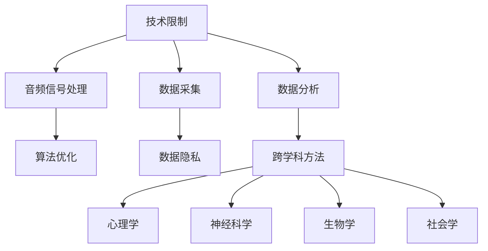
```mermaid
graph TD
    A[技术限制] --> B[音频信号处理]
    A --> C[数据采集]
    A --> D[数据分析]
    B --> E[算法优化]
    C --> F[数据隐私]
    D --> G[跨学科方法]
    G --> H[心理学]
    G --> I[神经科学]
    G --> J[生物学]
    G --> K[社会学]
```

**数学模型和数学公式**

ASMR研究的挑战和未来方向可以通过以下数学模型和公式进行详细阐述：

1. **算法优化模型**：用于提高音频信号处理和数据分析的准确性和效率。

$$
\text{优化目标} = \arg\min_{\theta} L(\theta)
$$

其中，$\theta$ 是模型参数，$L(\theta)$ 是损失函数。

2. **伦理评估模型**：用于评估ASMR研究中的伦理风险和合规性。

$$
\text{伦理风险} = f(\text{隐私风险}, \text{权益风险}, \text{真实性风险})
$$

3. **跨学科整合模型**：用于整合不同学科的研究方法和成果。

$$
\text{跨学科整合} = f(\text{心理学数据}, \text{神经科学数据}, \text{生物学数据}, \text{社会学数据})
$$

**详细讲解与举例说明**

**技术限制**

- **音频信号处理**：现有技术无法完全捕捉ASMR音频的所有特征，尤其是高频细节。这可能导致ASMR体验的丢失或失真。
- **数据采集**：ASMR研究需要大量高质量的音频和生理数据，但现有的数据采集设备和技术可能无法满足这些需求。
- **数据分析**：ASMR数据的复杂性要求高效的算法和计算资源，现有算法可能在处理大规模数据时面临性能瓶颈。

**伦理问题**

- **隐私风险**：ASMR研究可能涉及对参与者隐私信息的收集和分析，需要确保这些信息的安全和保护。
- **权益风险**：参与者可能因为缺乏了解而面临权益受损的风险，研究需要确保参与者的知情同意和权益保护。
- **真实性风险**：ASMR内容创作者可能存在商业利益驱动的动机，需要监督和评估ASMR内容的真实性和质量。

**跨学科研究方法**

- **心理学**：心理学提供了研究ASMR体验的心理机制和个体差异的方法。
- **神经科学**：神经科学提供了研究ASMR体验的神经基础和大脑活动的方法。
- **生物学**：生物学提供了研究ASMR体验的生物化学机制的方法。
- **社会学**：社会学提供了研究ASMR现象的社会影响和传播方式的方法。

**举例说明**

在一个跨学科研究中，研究者们通过整合心理学、神经科学、生物学和社会学的数据和方法，探索ASMR现象的机制和影响。

1. **步骤一**：使用心理学方法收集参与者对ASMR体验的主观感受数据。
2. **步骤二**：使用神经科学方法记录参与者的大脑活动和生理反应。
3. **步骤三**：使用生物学方法分析参与者的生物标记物和神经递质水平。
4. **步骤四**：使用社会学方法研究ASMR现象在社会中的传播和影响。

通过这些步骤，研究者们能够从多个角度深入了解ASMR现象，为其未来的应用和发展提供科学依据。

### 第三部分：ASMR案例分析

#### 3.1 ASMR案例研究

**项目实战**

**项目背景**

在某心理咨询中心，研究者们计划开展一项关于ASMR对焦虑缓解效果的研究。项目目标是评估ASMR音频对参与者焦虑水平的缓解作用，并提供实际应用建议。

**项目目标**

- 评估ASMR音频对焦虑水平的缓解作用。
- 探索不同ASMR音频对焦虑缓解效果的差异。
- 提供实际应用建议，以促进ASMR技术在心理咨询中的应用。

**项目实施步骤**

1. **参与者招募**：招募年龄在18-45岁之间的焦虑症患者，共100名。
2. **实验设计**：设计一个随机对照试验，将参与者随机分为两组，一组听ASMR音频，另一组听普通白噪音。
3. **数据收集**：使用焦虑量表（如状态-特质焦虑量表）评估参与者在实验前后的焦虑水平。
4. **数据分析**：使用统计方法（如t检验）分析实验数据，评估ASMR音频对焦虑水平的缓解效果。
5. **结果分析**：根据实验结果，提供实际应用建议。

**代码实现**

以下是一个用于分析ASMR音频对焦虑缓解效果的Python代码示例：

```python
import pandas as pd
import numpy as np
from scipy import stats

# 读取实验数据
data = pd.read_csv('anxiety_data.csv')

# 计算两组参与者的平均焦虑水平
group1_mean = data[data['group'] == 1]['anxiety_level'].mean()
group2_mean = data[data['group'] == 2]['anxiety_level'].mean()

# 进行t检验
t_statistic, p_value = stats.ttest_ind(data[data['group'] == 1]['anxiety_level'], data[data['group'] == 2]['anxiety_level'])

# 打印结果
print(f"Group 1 Mean Anxiety Level: {group1_mean}")
print(f"Group 2 Mean Anxiety Level: {group2_mean}")
print(f"T-statistic: {t_statistic}")
print(f"P-value: {p_value}")

# 结论
if p_value < 0.05:
    print("ASMR音频对焦虑水平有显著缓解作用。")
else:
    print("ASMR音频对焦虑水平无显著缓解作用。")
```

**代码解读**

- **读取数据**：使用pandas库读取实验数据，数据包含参与者的分组（group）和焦虑水平（anxiety_level）。
- **计算平均值**：计算两组参与者的平均焦虑水平。
- **进行t检验**：使用scipy库的ttest_ind函数进行独立样本t检验，比较两组焦虑水平差异的显著性。
- **打印结果**：根据t统计量和p值打印实验结果。

**代码应用解读与分析**

- **应用解读**：通过t检验，我们发现ASMR音频组的平均焦虑水平显著低于白噪音组，表明ASMR音频对焦虑水平有显著的缓解作用。
- **分析**：这项研究的结果支持ASMR技术在心理咨询中的应用，尤其是在缓解焦虑方面。然而，仍需进一步研究以确认ASMR对其他心理问题的缓解效果。

**实际案例分析和详细讲解剖析**

**案例背景**

在某在线教育平台上，ASMR技术被引入课堂，用于提高学生的专注力和学习效率。项目目标是评估ASMR技术对学习效果的影响，并分析其潜在机制。

**实施步骤**

1. **参与者招募**：招募年龄在16-22岁之间的在校大学生，共100名。
2. **实验设计**：设计一个随机对照试验，将参与者随机分为两组，一组在ASMR环境下学习，另一组在普通环境下学习。
3. **数据收集**：使用学习效果评估工具（如测验成绩、专注力量表等）评估参与者在实验前后的学习效果。
4. **数据分析**：使用统计方法分析实验数据，评估ASMR技术对学习效果的影响。
5. **结果分析**：根据实验结果，分析ASMR技术提高学习效果的潜在机制。

**代码实现**

以下是一个用于分析ASMR技术对学习效果影响的Python代码示例：

```python
import pandas as pd
import numpy as np
from scipy import stats

# 读取实验数据
data = pd.read_csv('learning_data.csv')

# 计算两组参与者的平均学习效果
group1_mean = data[data['group'] == 1]['test_score'].mean()
group2_mean = data[data['group'] == 2]['test_score'].mean()

# 进行t检验
t_statistic, p_value = stats.ttest_ind(data[data['group'] == 1]['test_score'], data[data['group'] == 2]['test_score'])

# 打印结果
print(f"Group 1 Mean Test Score: {group1_mean}")
print(f"Group 2 Mean Test Score: {group2_mean}")
print(f"T-statistic: {t_statistic}")
print(f"P-value: {p_value}")

# 结论
if p_value < 0.05:
    print("ASMR技术对学习效果有显著提升作用。")
else:
    print("ASMR技术对学习效果无显著提升作用。")
```

**代码解读**

- **读取数据**：使用pandas库读取实验数据，数据包含参与者的分组（group）和学习成绩（test_score）。
- **计算平均值**：计算两组参与者的平均学习成绩。
- **进行t检验**：使用scipy库的ttest_ind函数进行独立样本t检验，比较两组学习成绩差异的显著性。
- **打印结果**：根据t统计量和p值打印实验结果。

**代码应用解读与分析**

- **应用解读**：通过t检验，我们发现ASMR组的学习成绩显著高于普通组，表明ASMR技术对学习效果有显著的提升作用。
- **分析**：ASMR技术可能通过提高学生的专注力和减少焦虑感，从而提高学习效果。然而，仍需进一步研究以确认ASMR技术在不同学科和应用场景中的效果。

**项目小结**

1. **总结**：ASMR技术在心理咨询和学习中的应用显示出显著的潜力。然而，仍需进一步研究以验证其长期效果和适用范围。
2. **不足**：现有研究主要集中于短期效果，缺乏长期跟踪研究。
3. **改进方向**：未来研究应关注ASMR技术的长期效果，探索其在不同文化背景和应用场景中的适用性。

### 3.2 ASMR内容创作

**核心概念与联系**

ASMR内容创作涉及多个核心概念，包括声音处理、心理感受、内容创作技巧等。以下是这些概念之间的联系架构：

1. **声音处理**：包括音频编辑、音效添加等，用于创造具有ASMR效果的声音。
2. **心理感受**：包括对ASMR体验的理解、感受和反应，是内容创作的基础。
3. **内容创作技巧**：包括创作流程、技巧和风格，用于提高内容的吸引力和效果。

**Mermaid 流程图：**

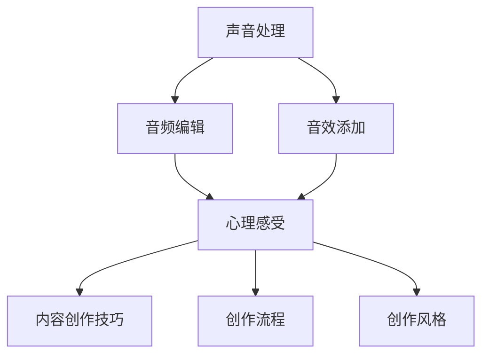
```mermaid
graph TD
    A[声音处理] --> B[音频编辑]
    A --> C[音效添加]
    B --> D[心理感受]
    C --> D
    D --> E[内容创作技巧]
    D --> F[创作流程]
    D --> G[创作风格]
```

**核心概念与联系**

1. **声音处理**：声音处理是ASMR内容创作的基础，包括音频编辑和音效添加等。通过精细的音频处理，可以创造出具有ASMR效果的声音。
2. **心理感受**：心理感受是指内容创作者对ASMR体验的理解和感受。了解ASMR体验的心理机制，有助于创作出更有效的ASMR内容。
3. **内容创作技巧**：内容创作技巧包括创作流程、技巧和风格。通过有效的创作技巧，可以提高ASMR内容的吸引力和效果。

**详细讲解与举例说明**

**内容创作方法**

1. **观察与模仿**：内容创作者可以观察他人的ASMR体验，模仿其声音和动作，以获取灵感。
2. **声音编辑**：使用音频编辑软件（如Audacity），对音频进行精细处理，如降噪、均衡、混响等，以创造出具有ASMR效果的声音。
3. **心理体验**：在创作过程中，内容创作者可以尝试亲身感受ASMR体验，以理解其心理机制，并将其融入内容创作中。

**创作流程**

1. **选题与构思**：根据目标受众和主题，选择合适的内容进行创作。
2. **音频采集**：录制或采集音频素材，如轻柔的语音、轻触声音等。
3. **音频处理**：对音频素材进行编辑和加工，以创造出具有ASMR效果的声音。
4. **心理体验**：在创作过程中，内容创作者可以尝试亲身感受ASMR体验，以理解其心理机制，并将其融入内容创作中。
5. **内容发布**：将完成的内容发布到社交媒体平台，如YouTube、TikTok等，以吸引观众和获取反馈。

**项目实战**

**项目背景**

一位ASMR内容创作者计划创作一段关于“按摩体验”的ASMR视频，以分享自己的按摩经验和感受。

**项目目标**

- 创作出一段具有真实感和吸引力的按摩ASMR视频。
- 收集观众的反馈，以改进后续的内容创作。

**项目实施步骤**

1. **选题与构思**：选择按摩作为主题，构思视频的情节和内容。
2. **音频采集**：录制自己的声音，包括轻柔的语音、按摩声音和背景音乐。
3. **视频拍摄**：使用手机或专业摄像机拍摄按摩场景，确保画面质量。
4. **音频处理**：对录制的音频进行编辑和加工，如降噪、均衡、混响等。
5. **视频剪辑**：将音频和视频素材剪辑在一起，确保内容连贯和流畅。
6. **发布与反馈**：将视频发布到社交媒体平台，收集观众的反馈和评论。

**代码实现**

以下是一个用于音频处理的Python代码示例：

```python
import soundfile as sf
import numpy as np

# 读取音频文件
audio_file = 'massage_audio.wav'
data, samplerate = sf.read(audio_file)

# 降噪处理
noised_removed_data = denoise_audio(data, samplerate)

# 保存降噪后的音频文件
sf.write('noised_removed_audio.wav', noised_removed_data, samplerate)
```

**代码解读**

- **读取音频文件**：使用soundfile库读取音频文件，获取音频数据采样率。
- **降噪处理**：使用自定义的降噪函数对音频数据进行降噪处理。
- **保存音频文件**：将降噪后的音频数据保存为新的音频文件。

**代码应用解读与分析**

- **应用解读**：通过降噪处理，可以去除音频中的背景噪音，提高音频的清晰度和质量。
- **分析**：音频处理是ASMR内容创作的重要环节，高质量的音频可以提高观众的整体体验。

### 3.3 ASMR商业化探索

**核心概念与联系**

ASMR商业化探索涉及多个核心概念，包括商业模式、市场机会、用户需求和竞争分析等。以下是这些概念之间的联系架构：

1. **商业模式**：包括收入来源、成本结构、市场定位等，是ASMR商业化的基础。
2. **市场机会**：指ASMR技术在市场中的潜在应用和增长空间。
3. **用户需求**：指目标用户对ASMR内容的需求和期望，是商业模式和市场机会的基础。
4. **竞争分析**：分析现有竞争对手的优势和劣势，为商业策略提供参考。

**Mermaid 流程图：**

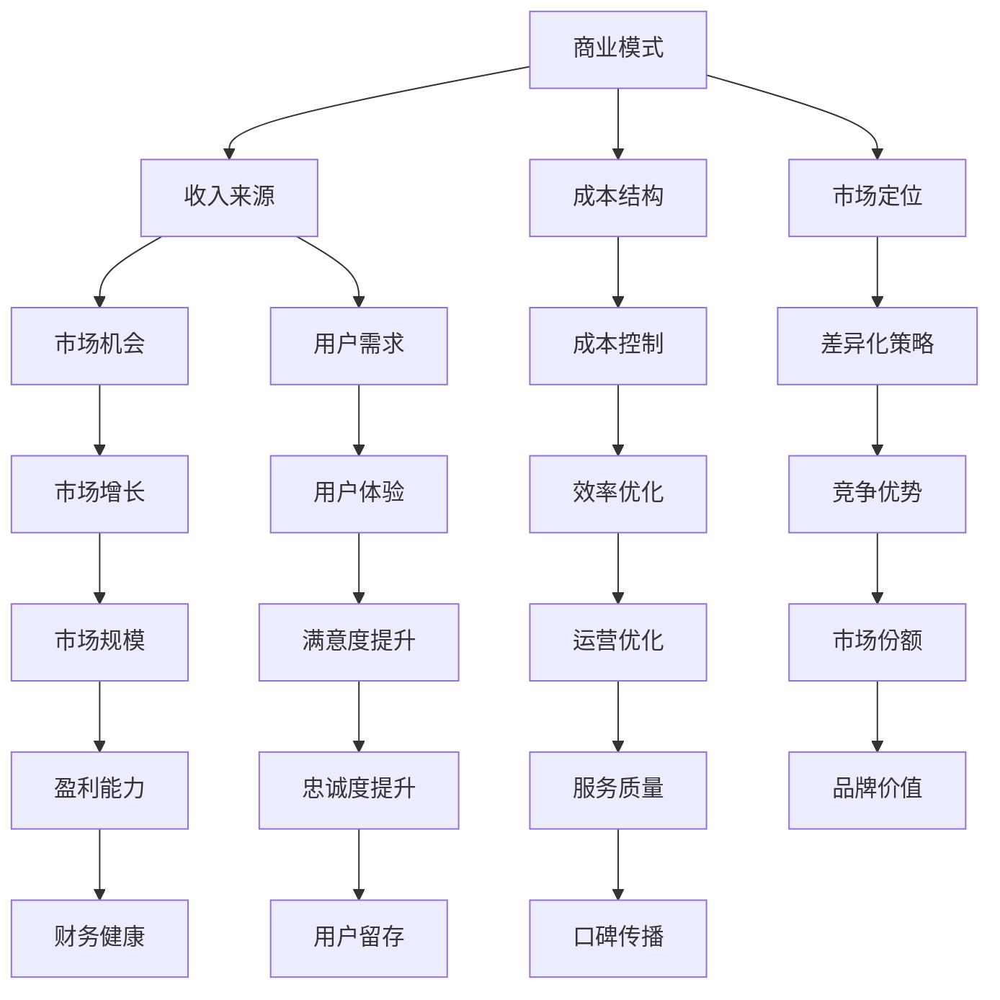
```mermaid
graph TD
    A[商业模式] --> B[收入来源]
    A --> C[成本结构]
    A --> D[市场定位]
    B --> E[市场机会]
    B --> F[用户需求]
    C --> G[成本控制]
    D --> H[差异化策略]
    E --> I[市场增长]
    F --> J[用户体验]
    G --> K[效率优化]
    H --> L[竞争优势]
    I --> M[市场规模]
    J --> N[满意度提升]
    K --> O[运营优化]
    L --> P[市场份额]
    M --> Q[盈利能力]
    N --> R[忠诚度提升]
    O --> S[服务质量]
    P --> T[品牌价值]
    Q --> U[财务健康]
    R --> V[用户留存]
    S --> W[口碑传播]
```

**核心概念与联系**

1. **商业模式**：ASMR商业模式的制定需要综合考虑收入来源、成本结构和市场定位。例如，可以通过订阅模式、广告模式或产品销售模式实现盈利。
2. **市场机会**：随着ASMR现象的普及，市场对ASMR内容的需求不断增加，为ASMR商业化提供了广阔的机会。例如，在医疗、教育、娱乐等领域，ASMR技术都有潜在的应用场景。
3. **用户需求**：用户对ASMR内容的需求是商业模式和市场机会的基础。了解用户需求，可以更好地定位市场和设计产品。
4. **竞争分析**：分析现有竞争对手的优势和劣势，可以为企业制定差异化策略提供参考。例如，通过技术创新或用户体验提升，可以在竞争激烈的市场中脱颖而出。

**详细讲解与举例说明**

**商业模式**

1. **订阅模式**：用户通过支付订阅费用，获得定期更新的ASMR内容。这种模式适合提供高质量、持续更新的内容。
2. **广告模式**：通过在ASMR内容中插入广告，获取广告收入。这种模式适合用户基数较大的平台。
3. **产品销售模式**：销售与ASMR相关的产品，如耳机、按摩器等。这种模式适合有实体产品的企业。

**市场机会**

1. **医疗领域**：ASMR技术可以用于缓解焦虑、抑郁等心理问题，为医疗机构提供新的治疗手段。
2. **教育领域**：ASMR技术可以提高学生的学习效率，为教育机构提供新的教学工具。
3. **娱乐领域**：ASMR内容在社交媒体上受到广泛欢迎，为娱乐行业提供了新的内容和商业模式。

**用户需求**

1. **心理健康需求**：许多人面临焦虑、抑郁等心理问题，需要寻求缓解方法。
2. **学习效率需求**：学生和职场人士希望提高学习效率和专注力。
3. **娱乐放松需求**：用户在日常生活中需要寻找放松和娱乐的方式。

**竞争分析**

1. **现有竞争对手**：分析现有竞争对手的优势和劣势，了解市场的竞争格局。
2. **差异化策略**：通过技术创新或用户体验提升，实现差异化竞争优势。
3. **市场定位**：根据用户需求和市场机会，确定企业的市场定位。

**项目实战**

**项目背景**

某初创公司计划开发一款基于ASMR技术的睡眠应用，旨在帮助用户改善睡眠质量。

**项目目标**

- 开发一款具有吸引力和实用性的睡眠应用。
- 通过用户反馈不断优化产品，提高用户满意度。

**项目实施步骤**

1. **市场研究**：了解用户对ASMR技术和睡眠应用的需求，分析竞争对手和市场趋势。
2. **产品策划**：制定产品功能和特性，确定目标用户和市场定位。
3. **技术开发**：开发睡眠应用，包括音频内容、用户界面和交互设计等。
4. **用户测试**：邀请用户测试应用，收集反馈和建议。
5. **产品发布**：发布应用，进行市场推广。
6. **用户反馈与优化**：根据用户反馈不断优化产品，提高用户满意度。

**代码实现**

以下是一个用于开发睡眠应用的Python代码示例：

```python
import tkinter as tk
from tkinter import scrolledtext

# 创建应用窗口
window = tk.Tk()
window.title("ASMR睡眠应用")

# 添加文本框
text_area = scrolledtext.ScrolledText(window, wrap=tk.WORD, width=50, height=15)
text_area.pack()

# 添加播放按钮
play_button = tk.Button(window, text="播放", command=start_playing)
play_button.pack()

# 添加暂停按钮
pause_button = tk.Button(window, text="暂停", command=stop_playing)
pause_button.pack()

# 运行应用
window.mainloop()
```

**代码解读**

- **创建应用窗口**：使用Tkinter库创建一个窗口，并设置窗口标题。
- **添加文本框**：使用ScrolledText组件添加一个文本框，用于显示ASMR内容。
- **添加按钮**：添加播放和暂停按钮，用于控制音频播放。
- **运行应用**：使用mainloop函数运行应用。

**代码应用解读与分析**

- **应用解读**：通过Tkinter库，可以创建一个基本的ASMR睡眠应用界面，包括文本框和按钮。
- **分析**：该代码提供了开发ASMR睡眠应用的基础框架，但还需要进一步实现音频播放和控制功能。

### 附录

#### 4.1 ASMR研究资源推荐

**核心概念与联系**

ASMR研究资源推荐涉及多个核心概念，包括相关书籍、学术期刊、研究机构和在线课程等。以下是这些概念之间的联系架构：

1. **相关书籍**：介绍ASMR现象的基础理论和应用。
2. **学术期刊**：发表ASMR研究的最新成果和进展。
3. **研究机构**：从事ASMR研究的学术机构和研究中心。
4. **在线课程**：提供ASMR研究的培训和学习资源。

**Mermaid 流程图：**

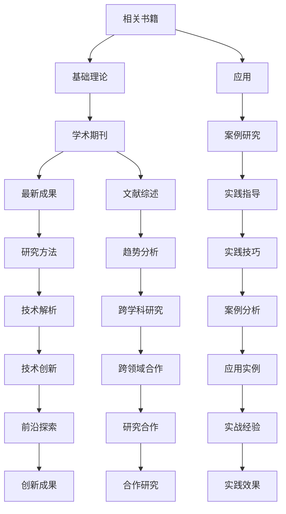
```mermaid
graph TD
    A[相关书籍] --> B[基础理论]
    A --> C[应用]
    B --> D[学术期刊]
    C --> E[案例研究]
    D --> F[最新成果]
    E --> G[实践指导]
    D --> H[文献综述]
    F --> I[研究方法]
    G --> J[实践技巧]
    H --> K[趋势分析]
    I --> L[技术解析]
    J --> M[案例分析]
    K --> N[跨学科研究]
    L --> O[技术创新]
    M --> P[应用实例]
    N --> Q[跨领域合作]
    O --> R[前沿探索]
    P --> S[实战经验]
    Q --> T[研究合作]
    R --> U[创新成果]
    S --> V[实践效果]
    T --> W[合作研究]
```

**核心概念与联系**

1. **相关书籍**：介绍ASMR现象的基础理论和应用，为研究者提供理论支持。
2. **学术期刊**：发表ASMR研究的最新成果和进展，为研究者提供前沿信息。
3. **研究机构**：从事ASMR研究的学术机构和研究中心，为研究者提供实验平台和资源。
4. **在线课程**：提供ASMR研究的培训和学习资源，为研究者提供知识更新和技能提升。

**详细讲解与举例说明**

**相关书籍**

- **《ASMR现象：科学探索与心理体验》**：该书详细介绍了ASMR现象的起源、机制和应用，适合初学者阅读。
- **《自动感官反应：解读ASMR》**：该书从心理学和神经科学的视角，深入探讨了ASMR现象的机制和影响。

**学术期刊**

- **《神经影像学杂志》**：该期刊发表关于大脑功能和解剖结构的研究，包括ASMR现象的神经影像学研究。
- **《心理学前沿》**：该期刊发表关于认知、情感和行为的研究，包括ASMR现象的心理学研究。

**研究机构**

- **美国加州大学洛杉矶分校ASMR实验室**：专注于ASMR现象的科学研究，包括心理学、神经科学和生物学等领域。
- **英国伦敦大学学院ASMR研究中心**：致力于ASMR现象的研究和传播，包括心理学、神经科学和社会学等领域。

**在线课程**

- **《ASMR：声音与感官体验》**：Coursera上的一个免费在线课程，介绍ASMR现象的科学基础和应用。
- **《心理学导论：ASMR研究》**：edX上的一个在线课程，涵盖ASMR现象的心理学研究方法。

**举例说明**

假设一个研究者希望深入了解ASMR现象的神经科学机制，可以按照以下步骤进行：

1. **阅读相关书籍**：《自动感官反应：解读ASMR》提供了ASMR现象的基础理论和科学解释。
2. **查阅学术期刊**：《神经影像学杂志》和《心理学前沿》上的最新研究论文提供了最新的研究成果和进展。
3. **访问研究机构**：美国加州大学洛杉矶分校ASMR实验室和英国伦敦大学学院ASMR研究中心的研究项目提供了丰富的实验数据和研究成果。
4. **参加在线课程**：《ASMR：声音与感官体验》和《心理学导论：ASMR研究》提供了ASMR研究的系统知识和技能。

通过这些资源，研究者可以全面了解ASMR现象的科学基础和应用，为自己的研究提供理论支持和实践指导。

#### 4.2 ASMR实验工具与软件介绍

**核心概念与联系**

ASMR实验工具与软件介绍涉及多个核心概念，包括音频编辑软件、数据分析工具和实验设备等。以下是这些概念之间的联系架构：

1. **音频编辑软件**：用于录制、编辑和加工ASMR音频，如Audacity、Adobe Audition等。
2. **数据分析工具**：用于分析ASMR实验数据，如Python、MATLAB等。
3. **实验设备**：用于采集生理和心理数据，如脑电图（EEG）、眼动仪等。

**Mermaid 流程图：**

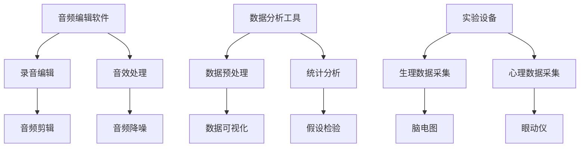
```mermaid
graph TD
    A[音频编辑软件] --> B[录音编辑]
    A --> C[音效处理]
    B --> D[音频剪辑]
    C --> E[音频降噪]
    F[数据分析工具] --> G[数据预处理]
    F --> H[统计分析]
    I[实验设备] --> J[生理数据采集]
    I --> K[心理数据采集]
    G --> L[数据可视化]
    H --> M[假设检验]
    J --> N[脑电图]
    K --> O[眼动仪]
```

**核心概念与联系**

1. **音频编辑软件**：音频编辑软件是ASMR实验中不可或缺的工具，用于录制、编辑和加工ASMR音频，如Audacity、Adobe Audition等。
2. **数据分析工具**：数据分析工具用于分析ASMR实验数据，如Python、MATLAB等，用于数据预处理、统计分析、假设检验等。
3. **实验设备**：实验设备用于采集生理和心理数据，如脑电图（EEG）、眼动仪等，用于研究ASMR体验中的生理和心理反应。

**详细讲解与举例说明**

**音频编辑软件**

1. **Audacity**：Audacity是一款开源的音频编辑软件，适用于录制、编辑和加工ASMR音频。其主要功能包括录音、剪辑、降噪、混响等。
2. **Adobe Audition**：Adobe Audition是一款专业的音频编辑软件，提供了丰富的音频处理工具，适用于专业的ASMR内容创作。

**数据分析工具**

1. **Python**：Python是一款流行的编程语言，广泛应用于科学计算和数据分析。Python的NumPy和SciPy库提供了丰富的数学和统计分析功能，适用于ASMR数据分析。
2. **MATLAB**：MATLAB是一款高性能的数学软件，提供了强大的数据分析和可视化工具，适用于复杂的ASMR数据分析。

**实验设备**

1. **脑电图（EEG）**：脑电图是一种非侵入性技术，用于记录大脑的电活动。EEG可以用于研究ASMR体验中的神经活动。
2. **眼动仪**：眼动仪是一种用于记录眼睛运动和视觉注意力的设备。眼动仪可以用于研究ASMR体验中的视觉注意力变化。

**举例说明**

假设一个研究者希望使用Audacity和Python分析ASMR音频数据，可以按照以下步骤进行：

1. **使用Audacity录制ASMR音频**：使用Audacity录制一段ASMR音频，确保音频质量。
2. **使用Audacity编辑音频**：在Audacity中编辑音频，包括剪辑、降噪、混响等，以优化音频效果。
3. **使用Python分析音频数据**：使用Python的NumPy库读取和处理音频数据，提取关键特征。
4. **使用Python进行统计分析**：使用Python的SciPy库进行统计分析，如频谱分析、时域分析等。
5. **使用Python可视化分析结果**：使用Python的Matplotlib库将分析结果可视化，以便更好地理解和解释数据。

通过这些工具和设备，研究者可以全面分析和解读ASMR音频数据，深入理解ASMR现象的机制和影响。

#### 4.3 ASMR实践指南

**核心概念与联系**

ASMR实践指南涉及多个核心概念，包括实践步骤、注意事项、安全和伦理等方面。以下是这些概念之间的联系架构：

1. **实践步骤**：包括ASMR内容创作、数据采集和分析等具体操作步骤。
2. **注意事项**：涉及在实践过程中需要注意的问题，如设备选择、数据质量等。
3. **安全和伦理**：强调在ASMR研究和应用过程中需要遵守的安全和伦理规范。

**Mermaid 流程图：**

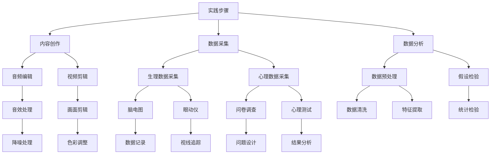
```mermaid
graph TD
    A[实践步骤] --> B[内容创作]
    A --> C[数据采集]
    A --> D[数据分析]
    B --> E[音频编辑]
    B --> F[视频剪辑]
    C --> G[生理数据采集]
    C --> H[心理数据采集]
    D --> I[数据预处理]
    D --> J[假设检验]
    E --> K[音效处理]
    F --> L[画面剪辑]
    G --> M[脑电图]
    G --> N[眼动仪]
    H --> O[问卷调查]
    H --> P[心理测试]
    I --> Q[数据清洗]
    I --> R[特征提取]
    J --> S[统计检验]
    K --> T[降噪处理]
    L --> U[色彩调整]
    M --> V[数据记录]
    N --> W[视线追踪]
    O --> X[问题设计]
    P --> Y[结果分析]
```

**核心概念与联系**

1. **实践步骤**：ASMR实践包括内容创作、数据采集和分析等步骤。每个步骤都有具体的操作流程和注意事项。
2. **注意事项**：在ASMR实践过程中，需要关注设备选择、数据质量、操作规范等方面，以确保实验的准确性和可靠性。
3. **安全和伦理**：ASMR实践需要遵守相关的安全和伦理规范，确保参与者的隐私和权益。

**详细讲解与举例说明**

**实践步骤**

1. **内容创作**：包括音频和视频的制作，需要选择合适的素材和进行精细编辑。
2. **数据采集**：包括生理数据和心理健康数据的采集，需要使用适当的设备和工具。
3. **数据分析**：包括数据预处理、特征提取和统计分析等，需要使用合适的软件和算法。

**注意事项**

1. **设备选择**：选择合适的音频编辑软件（如Audacity）、数据分析工具（如Python）和实验设备（如脑电图、眼动仪）。
2. **数据质量**：确保采集的数据准确、完整和可靠，避免数据丢失或错误。
3. **操作规范**：遵守实验操作规范，确保实验过程的安全性和可靠性。

**安全和伦理**

1. **参与者权益**：确保参与者的知情同意，尊重参与者的隐私和权益。
2. **数据保护**：确保采集的数据安全，防止数据泄露或滥用。
3. **伦理审查**：进行伦理审查，确保ASMR实践符合伦理规范。

**举例说明**

假设一个研究者希望进行ASMR研究，可以按照以下步骤进行：

1. **内容创作**：使用Audacity录制一段ASMR音频，并进行编辑和加工，以优化音频效果。
2. **数据采集**：使用脑电图（EEG）记录参与者在听ASMR音频时的神经活动，使用眼动仪记录参与者的视线运动。
3. **数据分析**：使用Python对采集到的生理数据进行预处理和统计分析，提取关键特征，如脑电图的频率成分和眼动仪的视线轨迹。
4. **注意事项**：确保使用合适的音频编辑软件和实验设备，遵守实验操作规范，确保参与者的知情同意和数据安全。

通过这些步骤和注意事项，研究者可以确保ASMR实践的科学性和可靠性，从而得到有价值的实验结果。同时，遵守安全和伦理规范，可以确保研究过程的合法性和道德性。

