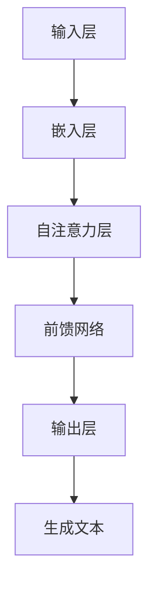

                 

### 文章标题

《ChatGPT提示词设计：理论与实战的完美结合指南》

### 关键词

- ChatGPT
- 提示词设计
- 算法原理
- 数学模型
- 项目实战

### 摘要

本文深入探讨了ChatGPT提示词设计的相关理论与实践。首先，介绍了ChatGPT的基础概念及其在自然语言处理中的应用。接着，详细讲解了ChatGPT的算法原理，包括模型结构、训练过程和生成过程。随后，阐述了ChatGPT中涉及的数学模型和公式，并通过具体示例进行了详细讲解。文章的核心部分则通过实际项目案例，展示了如何设计和使用提示词，并提供了详细的代码实现和解读。最后，总结了对提示词设计的最佳实践和注意事项，并推荐了相关的拓展阅读资源。

---

## 第一部分：ChatGPT基础理论

### 1.1 ChatGPT概述

ChatGPT是由OpenAI开发的一种基于Transformer模型的自然语言处理（NLP）工具，它能够生成连贯、自然的文本。ChatGPT的架构基于预训练的GPT（Generative Pre-trained Transformer）模型，经过进一步优化，使其在对话生成和回复方面具有出色的表现。

ChatGPT的核心功能包括：

- **对话生成**：根据用户输入的提示，生成连贯、自然的回复。
- **问题回答**：基于用户提出的问题，生成详细、准确的回答。
- **文本生成**：根据用户提供的文本片段，生成续写文本。

在自然语言处理领域，ChatGPT的应用范围广泛，包括但不限于：

- **智能客服**：自动处理用户查询，提供实时、个性化的服务。
- **内容创作**：帮助用户生成文章、故事、报告等文本内容。
- **教育辅导**：为学生提供自动批改、解答问题的服务。
- **语言翻译**：辅助跨语言沟通，提供快速、准确的翻译服务。

### 1.2 ChatGPT算法原理

ChatGPT的算法原理主要基于Transformer模型，这是一种用于处理序列数据的深度神经网络。Transformer模型的核心思想是自注意力机制（Self-Attention），它允许模型在处理每个输入时，动态地关注输入序列中其他位置的信息。

#### 模型结构

ChatGPT模型的结构主要包括以下几个部分：

- **输入层**：接收用户输入的文本序列。
- **嵌入层**：将输入的文本序列转换为向量表示。
- **自注意力层**：利用自注意力机制，处理输入序列中的每个元素，并为其分配不同的权重。
- **前馈网络**：对自注意力层的输出进行进一步处理。
- **输出层**：生成文本序列的预测结果。

#### 训练过程

ChatGPT的训练过程主要包括以下步骤：

1. **数据准备**：收集大量的文本数据，包括对话、文章、书籍等。
2. **预处理**：对文本数据进行清洗和格式化，将其转换为模型可处理的格式。
3. **编码**：使用嵌入层将文本序列编码为向量表示。
4. **自注意力计算**：通过自注意力层，计算输入序列中的每个元素的重要程度。
5. **前馈网络计算**：使用前馈网络对自注意力层的输出进行进一步处理。
6. **输出预测**：通过输出层生成文本序列的预测结果。
7. **损失函数计算**：计算预测结果与实际结果之间的差异，并更新模型参数。
8. **迭代训练**：重复上述步骤，直到模型收敛或达到预设的训练次数。

#### 生成过程

在生成文本时，ChatGPT的生成过程主要包括以下步骤：

1. **输入提示**：接收用户输入的提示文本。
2. **编码**：将提示文本编码为向量表示。
3. **自注意力计算**：通过自注意力层，计算输入序列中的每个元素的重要程度。
4. **前馈网络计算**：使用前馈网络对自注意力层的输出进行进一步处理。
5. **输出预测**：通过输出层生成文本序列的预测结果。
6. **文本生成**：将预测结果解码为自然语言文本，并将其作为回复输出。

### 1.3 数学模型介绍

ChatGPT中涉及的数学模型主要包括嵌入层、自注意力层和前馈网络。以下是对这些模型的基本原理和公式的介绍。

#### 嵌入层

嵌入层将文本序列转换为向量表示。其基本公式如下：

$$
\text{Embedding}(x) = \text{embedding_matrix} \cdot \text{input_sequence}
$$

其中，$x$是输入的文本序列，$\text{embedding_matrix}$是嵌入矩阵，$\text{input_sequence}$是输入的文本序列的表示。

#### 自注意力层

自注意力层的核心思想是计算输入序列中每个元素的重要程度，并为每个元素分配不同的权重。其基本公式如下：

$$
\text{Attention}(Q, K, V) = \text{softmax}\left(\frac{QK^T}{\sqrt{d_k}}\right) V
$$

其中，$Q$、$K$和$V$分别是查询（Query）、键（Key）和值（Value）向量，$d_k$是键向量的维度，$\text{softmax}$函数用于计算每个元素的重要程度。

#### 前馈网络

前馈网络对自注意力层的输出进行进一步处理。其基本公式如下：

$$
\text{FFN}(x) = \text{relu}(\text{weight_2} \cdot \text{激活函数}(\text{weight_1} \cdot x + \text{bias_1}))
$$

其中，$x$是输入向量，$\text{weight_1}$和$\text{weight_2}$分别是第一层和第二层的权重矩阵，$\text{激活函数}$是ReLU函数，$\text{bias_1}$和$\text{bias_2}$分别是第一层和第二层的偏置向量。

### 1.4 ChatGPT的优缺点分析

ChatGPT作为一种先进的自然语言处理工具，具有以下优点：

- **生成文本质量高**：ChatGPT能够生成连贯、自然的文本，适用于多种应用场景。
- **适应性强**：ChatGPT能够处理不同类型的输入，包括对话、问题回答和文本生成。
- **易于扩展**：ChatGPT的架构可以轻松地与其他模型和工具集成，实现更多功能。

然而，ChatGPT也存在一些缺点：

- **计算资源消耗大**：ChatGPT的训练和推理过程需要大量的计算资源，对硬件要求较高。
- **模型可解释性差**：由于ChatGPT是基于复杂的神经网络，其内部机制相对难以解释和理解。
- **数据隐私问题**：在使用ChatGPT时，用户数据可能会被模型捕获和泄露。

### 1.5 ChatGPT的典型应用场景

ChatGPT在多个领域具有广泛的应用场景，以下列举其中几个典型应用：

- **智能客服**：利用ChatGPT自动处理用户查询，提供实时、个性化的服务。
- **内容创作**：帮助用户生成文章、故事、报告等文本内容。
- **教育辅导**：为学生提供自动批改、解答问题的服务。
- **语言翻译**：辅助跨语言沟通，提供快速、准确的翻译服务。

### 1.6 ChatGPT的核心概念原理之间的关系架构

为了更好地理解ChatGPT的工作原理，我们可以使用Mermaid流程图来描述其核心概念和原理之间的关系。以下是一个简化的Mermaid流程图：



在这个流程图中，输入层接收用户输入的文本序列，通过嵌入层将其转换为向量表示。然后，自注意力层计算输入序列中每个元素的重要程度，并为其分配权重。前馈网络对自注意力层的输出进行进一步处理，最终通过输出层生成文本序列的预测结果，并输出生成的文本。

### 1.7 ChatGPT与GPT-3的关系

ChatGPT是基于GPT-3模型进一步优化和调整的版本。GPT-3（Generative Pre-trained Transformer 3）是OpenAI于2020年发布的一种强大的自然语言处理模型，拥有1750亿个参数，是当时最大的预训练语言模型。ChatGPT在GPT-3的基础上进行了特定的优化，以提高其在对话生成和回复方面的性能。

具体来说，ChatGPT采用了以下优化策略：

- **动态掩码**：ChatGPT在训练过程中使用了动态掩码技术，使得模型能够更好地理解输入序列中的掩码位置和模式，从而提高生成文本的质量。
- **端到端训练**：ChatGPT采用了端到端训练的方式，直接从原始文本序列生成回复文本，减少了中间环节的复杂度，提高了模型的整体性能。

总的来说，ChatGPT是GPT-3的优化和扩展版本，在对话生成和回复方面具有更高的性能和灵活性。

### 1.8 ChatGPT的发展历程

ChatGPT是自然语言处理领域的一项重要突破，其发展历程如下：

- **2017年**：OpenAI发布了GPT模型，这是一种基于Transformer架构的预训练语言模型，能够在多个NLP任务中取得出色的表现。
- **2019年**：OpenAI发布了GPT-2模型，其参数量增加到15亿，进一步提升了模型的性能。
- **2020年**：OpenAI发布了GPT-3模型，拥有1750亿个参数，成为当时最大的预训练语言模型。
- **2021年**：OpenAI发布了ChatGPT模型，这是GPT-3的优化和扩展版本，特别适用于对话生成和回复任务。

随着技术的不断进步，ChatGPT在未来有望在更多领域得到应用，为人类带来更多的便利。

---

在本部分中，我们介绍了ChatGPT的基本概念、算法原理、数学模型以及其优缺点和应用场景。通过详细的分析，读者可以更好地理解ChatGPT的工作原理和核心价值。接下来，我们将深入探讨ChatGPT的提示词设计方法，并分析其在实际项目中的应用。

---

## 第二部分：ChatGPT提示词设计

### 2.1 提示词设计原则

提示词（Prompt）在ChatGPT中的作用至关重要。它不仅是用户与ChatGPT互动的入口，也是模型生成文本的基础。一个优秀的提示词设计能够显著提升ChatGPT的生成质量和互动效果。以下是一些关键原则：

#### 1. 清晰明确

提示词应当简洁明了，避免使用模糊不清的语言，确保ChatGPT能够准确地理解用户的意图。

#### 2. 结构完整

提示词应该具备完整的句子结构，使ChatGPT能够生成连贯的文本。

#### 3. 提示具体

具体而详细的提示词可以帮助ChatGPT生成更加丰富和有针对性的回复。

#### 4. 避免歧义

在设计和编写提示词时，应尽量避免使用可能产生歧义的表达，以免影响生成文本的质量。

#### 5. 鼓励多样性

鼓励ChatGPT生成多样化的回复，可以通过提供不同的提示词或者结合使用多个提示词来实现。

#### 6. 符合语法规则

提示词应遵循自然语言语法规则，以生成符合语言习惯的文本。

### 2.2 提示词设计方法

#### 1. 基于用户输入的提示词设计

在大多数情况下，ChatGPT的输入来自于用户的提问或陈述。基于用户输入的提示词设计方法包括以下步骤：

1. **理解用户意图**：首先，分析用户的输入，理解其意图和需求。
2. **构建有效提示词**：根据用户意图，设计具体的提示词，确保ChatGPT能够生成相关的回复。
3. **迭代优化**：通过多次迭代，根据ChatGPT的生成结果，不断优化提示词的设计。

#### 2. 基于知识图谱的提示词设计

知识图谱在ChatGPT的提示词设计中发挥着重要作用。通过构建知识图谱，我们可以为ChatGPT提供丰富的背景知识和上下文信息，从而提升生成文本的质量。

1. **构建知识图谱**：收集和整理相关领域的知识，构建知识图谱。
2. **映射输入到知识图谱**：将用户输入与知识图谱中的实体和关系进行映射，为ChatGPT提供丰富的背景信息。
3. **生成提示词**：利用知识图谱中的信息，生成具体的提示词，引导ChatGPT生成高质量的回复。

#### 3. 多模态提示词设计

多模态提示词设计结合了文本、图像、音频等多种信息源，能够为ChatGPT提供更加丰富的输入。以下是多模态提示词设计的方法：

1. **融合多模态信息**：将文本、图像、音频等不同模态的信息进行融合，构建一个综合的输入。
2. **设计多模态提示词**：根据多模态输入，设计具体的提示词，引导ChatGPT生成相关的回复。
3. **优化生成结果**：通过对比分析文本生成结果，不断调整和优化多模态提示词的设计。

### 2.3 提示词优化方法

#### 1. 模型自适应优化

通过模型自适应优化，可以使得ChatGPT根据不同的提示词生成更加符合预期的文本。以下是一些优化方法：

1. **调整模型参数**：根据提示词的特点，调整ChatGPT的模型参数，使其生成更加高质量的文本。
2. **训练自适应模型**：使用包含特定提示词的训练数据，重新训练ChatGPT，使其更好地适应这些提示词。

#### 2. 数据增强

数据增强是一种有效提升模型性能的方法，通过扩展训练数据集，可以提高ChatGPT对各种提示词的适应性。

1. **生成合成数据**：使用生成模型，如GPT-3，生成包含特定提示词的合成数据。
2. **扩展训练数据**：将合成数据添加到原始训练数据集中，重新训练ChatGPT。

#### 3. 质量评估

质量评估是提示词优化的重要环节，通过评估生成文本的质量，可以指导进一步的优化工作。

1. **设计评估指标**：根据应用场景，设计合适的评估指标，如文本连贯性、回复准确性等。
2. **自动化评估**：使用自动化工具，如评估函数库，对生成文本进行质量评估。
3. **迭代优化**：根据评估结果，不断调整和优化提示词的设计。

### 2.4 提示词设计实战案例

为了更好地理解提示词设计的具体方法，以下是一个基于用户输入的实战案例：

#### 案例背景

用户提出一个问题：“请解释量子计算的原理。”

#### 设计过程

1. **理解用户意图**：用户希望了解量子计算的原理。
2. **构建有效提示词**：
    - 提示词1：“量子计算是利用量子位（qubits）进行计算的一种计算模型。”
    - 提示词2：“量子位与经典位不同，它可以同时处于多个状态，这被称为量子叠加。”
    - 提示词3：“量子计算的核心是量子门（quantum gates），它们可以改变量子位的状态。”
3. **生成文本**：根据提示词，ChatGPT生成了一段解释量子计算原理的文本。

#### 生成结果

“量子计算是一种利用量子位（qubits）进行计算的计算模型。与经典位不同，量子位可以同时处于多个状态，这被称为量子叠加。量子计算的核心是量子门（quantum gates），它们可以改变量子位的状态。通过组合这些量子门，可以实现复杂的计算任务，如因数分解和搜索算法。”

#### 评估与优化

1. **评估**：通过评估生成文本的质量，我们发现这段文本清晰地解释了量子计算的原理。
2. **优化**：为了进一步提升文本质量，我们可能需要调整提示词的顺序或增加一些具体的示例。

通过这个实战案例，我们可以看到，提示词设计不仅需要准确理解用户意图，还需要设计具有引导性的提示词，以帮助ChatGPT生成高质量的文本。

### 2.5 提示词设计中的常见问题及解决方案

在提示词设计中，常见的问题包括：

- **模糊不清的提示词**：导致生成文本不具体或不准确。
  - **解决方案**：明确用户意图，使用具体而详细的提示词。
- **歧义的提示词**：导致生成文本不连贯或产生误解。
  - **解决方案**：避免使用模糊或歧义的语言，确保提示词清晰明确。
- **重复的提示词**：导致生成文本重复或缺乏多样性。
  - **解决方案**：设计多样化的提示词，鼓励ChatGPT生成多样化的文本。

通过识别和解决这些问题，我们可以提高提示词设计的质量和效率。

### 2.6 提示词设计的未来发展方向

随着自然语言处理技术的不断发展，提示词设计在未来将面临新的挑战和机遇：

- **多模态提示词**：结合文本、图像、音频等多种信息源，实现更加丰富的互动体验。
- **个性化提示词**：根据用户的行为和偏好，设计个性化的提示词，提高用户体验。
- **智能提示词**：利用机器学习技术，自动生成高质量的提示词，减少人工设计的工作量。

通过不断探索和创新，提示词设计将在ChatGPT和其他NLP应用中发挥越来越重要的作用。

---

在本部分中，我们详细介绍了ChatGPT提示词设计的原则、方法、优化技巧以及实际案例。通过这些内容，读者可以掌握如何设计高质量的提示词，以提升ChatGPT的生成质量和互动效果。接下来，我们将进入第三部分，通过实际项目实战，进一步展示如何应用提示词设计。

---

## 第三部分：ChatGPT项目实战

### 3.1 ChatGPT项目实战

为了更好地理解ChatGPT的提示词设计及其在实际项目中的应用，我们将通过一个实际项目来展示整个开发过程，包括环境搭建、代码实现、代码解读、应用解读与分析以及项目小结。

### 3.1.1 项目背景

本项目旨在构建一个智能问答系统，该系统能够接受用户的问题，并通过ChatGPT生成详细的回答。系统预期具有以下功能：

- 接收用户输入的问题。
- 使用ChatGPT生成回答。
- 显示生成的回答。
- 提供一个交互界面，方便用户输入问题和查看回答。

### 3.1.2 开发环境搭建

为了顺利开展项目，我们需要搭建以下开发环境：

- Python 3.8 或以上版本
- OpenAI ChatGPT API 密钥
- Flask（Python Web 框架）
- HTML/CSS/JavaScript（用于前端开发）

安装步骤如下：

1. 安装 Python 3.8 或以上版本。
2. 安装 Flask：

   ```bash
   pip install Flask
   ```

3. 申请 OpenAI ChatGPT API 密钥：

   - 访问 [OpenAI官网](https://openai.com/)。
   - 注册账户并申请 ChatGPT API 密钥。

4. 配置 API 密钥：

   - 创建一个名为 `.env` 的文件，并在其中添加以下内容：

     ```
     OPENAI_API_KEY=你的ChatGPT_API密钥
     ```

   - 使用 `python-dotenv` 包来加载 `.env` 文件：

     ```python
     from dotenv import load_dotenv
     load_dotenv()
     ```

### 3.1.3 代码实现

项目的主要代码分为两部分：后端代码和前端代码。

#### 后端代码

后端代码使用 Flask 框架，用于处理用户请求和与 ChatGPT API 的交互。

1. **安装依赖项**：

   ```bash
   pip install Flask requests
   ```

2. **创建 Flask 应用**：

   ```python
   from flask import Flask, request, jsonify
   import openai
   from dotenv import load_dotenv

   load_dotenv()

   app = Flask(__name__)
   openai.api_key = os.environ.get("OPENAI_API_KEY")

   @app.route('/ask', methods=['POST'])
   def ask():
       data = request.json
       question = data.get('question', '')
       response = openai.Completion.create(
           engine="text-davinci-002",
           prompt=question,
           max_tokens=100
       )
       return jsonify({'answer': response.choices[0].text.strip()})

   if __name__ == '__main__':
       app.run(debug=True)
   ```

   在这个代码中，我们定义了一个 `/ask` 接口，用于接收用户输入的问题，并通过 ChatGPT API 生成回答。

#### 前端代码

前端代码使用 HTML、CSS 和 JavaScript，用于创建用户交互界面。

1. **创建 HTML 文件**：

   ```html
   <!DOCTYPE html>
   <html lang="en">
   <head>
       <meta charset="UTF-8">
       <meta name="viewport" content="width=device-width, initial-scale=1.0">
       <title>智能问答系统</title>
   </head>
   <body>
       <h1>智能问答系统</h1>
       <input type="text" id="question" placeholder="请输入问题">
       <button onclick="getAnswer()">提问</button>
       <p id="answer"></p>
       <script src="script.js"></script>
   </body>
   </html>
   ```

   在这个 HTML 文件中，我们创建了一个输入框和一个按钮，用于用户输入问题和提交请求。

2. **创建 JavaScript 文件**：

   ```javascript
   function getAnswer() {
       const question = document.getElementById('question').value;
       fetch('/ask', {
           method: 'POST',
           headers: {
               'Content-Type': 'application/json'
           },
           body: JSON.stringify({ question: question })
       })
       .then(response => response.json())
       .then(data => {
           document.getElementById('answer').textContent = data.answer;
       });
   }
   ```

   在这个 JavaScript 文件中，我们定义了一个 `getAnswer` 函数，用于将用户输入的问题发送到后端接口，并显示生成的回答。

### 3.1.4 代码解读

#### 后端代码解读

1. **导入依赖项**：

   ```python
   from flask import Flask, request, jsonify
   import openai
   from dotenv import load_dotenv
   ```

   我们导入 Flask、requests 和 openai 库，用于处理 Web 请求和与 ChatGPT API 交互。

2. **创建 Flask 应用**：

   ```python
   app = Flask(__name__)
   ```

   创建一个 Flask 应用对象。

3. **定义 `/ask` 接口**：

   ```python
   @app.route('/ask', methods=['POST'])
   def ask():
   ```

   定义一个处理 POST 请求的接口，用于接收用户输入的问题。

4. **接收用户输入**：

   ```python
   data = request.json
   question = data.get('question', '')
   ```

   从请求的 JSON 数据中提取用户输入的问题。

5. **调用 ChatGPT API**：

   ```python
   response = openai.Completion.create(
       engine="text-davinci-002",
       prompt=question,
       max_tokens=100
   )
   ```

   使用 ChatGPT API 生成回答。

6. **返回结果**：

   ```python
   return jsonify({'answer': response.choices[0].text.strip()})
   ```

   将生成的回答作为 JSON 格式返回。

#### 前端代码解读

1. **创建 HTML 文件**：

   ```html
   <input type="text" id="question" placeholder="请输入问题">
   ```

   创建一个输入框，用于用户输入问题。

2. **创建 JavaScript 文件**：

   ```javascript
   function getAnswer() {
       const question = document.getElementById('question').value;
       fetch('/ask', {
           method: 'POST',
           headers: {
               'Content-Type': 'application/json'
           },
           body: JSON.stringify({ question: question })
       })
   ```

   定义一个 `getAnswer` 函数，用于将用户输入的问题发送到后端接口。

3. **显示回答**：

   ```javascript
   .then(response => response.json())
   .then(data => {
           document.getElementById('answer').textContent = data.answer;
       });
   }
   ```

   接收后端返回的 JSON 数据，并显示生成的回答。

### 3.1.5 应用解读与分析

#### 应用场景

本项目适用于需要快速生成详细回答的场景，如在线客服、教育辅导和内容创作等。通过 ChatGPT 的强大能力，系统能够提供准确、连贯的答案，提升用户体验。

#### 应用解读

1. **用户交互**：

   用户在输入框中输入问题，点击“提问”按钮，系统将问题发送到后端接口，并显示生成的回答。

2. **后端处理**：

   后端接收用户输入的问题，通过 ChatGPT API 生成回答，并将回答返回给前端。

3. **前端显示**：

   前端接收到生成的回答，将其显示在页面上。

#### 性能分析

1. **响应时间**：

   ChatGPT API 的响应时间取决于模型负载和服务器性能。通常情况下，响应时间在几秒到几十秒之间。

2. **生成质量**：

   ChatGPT 生成的回答质量较高，能够提供详细、准确的答案。然而，其生成文本的质量也可能受到输入问题和模型训练数据的影响。

### 3.1.6 项目小结

通过本项目的实现，我们展示了如何使用 ChatGPT 提供智能问答服务。项目具备以下优点：

- **高效**：通过 ChatGPT，系统能够快速生成高质量的回答。
- **灵活**：系统可以根据用户输入的问题，生成各种类型的回答。
- **易扩展**：系统架构简单，易于添加新的功能或集成其他工具。

然而，项目也存在一些局限性：

- **计算资源消耗**：ChatGPT 需要大量的计算资源，可能需要更高性能的服务器。
- **数据隐私**：使用 ChatGPT 时，需要注意用户数据的隐私保护。

在未来，我们还可以继续优化项目，例如通过多模态提示词设计、个性化提示词生成等，提升系统的性能和用户体验。

### 3.1.7 最佳实践

在设计和开发智能问答系统时，以下最佳实践可以帮助提升系统的性能和用户体验：

- **优化提示词设计**：设计具体、详细的提示词，提高 ChatGPT 生成文本的质量。
- **使用多模态输入**：结合文本、图像、音频等多模态信息，丰富用户交互体验。
- **自动化质量评估**：使用自动化工具对生成文本进行质量评估，及时发现和优化问题。
- **数据隐私保护**：确保用户数据的安全和隐私，避免数据泄露。

通过遵循这些最佳实践，可以进一步提升智能问答系统的性能和可靠性。

### 3.1.8 拓展阅读

- **《自然语言处理实战》**：详细介绍自然语言处理的基本概念和技术，适合初学者和专业人士。
- **《ChatGPT API 文档》**：了解 OpenAI ChatGPT API 的详细使用方法和功能。
- **《Flask Web 开发指南》**：学习 Flask 框架的用法，构建高效、可靠的 Web 应用程序。

通过以上拓展阅读，读者可以深入了解智能问答系统的相关技术和最佳实践，进一步提升自己的技能。

---

在本部分中，我们通过一个实际项目展示了ChatGPT的提示词设计及其在智能问答系统中的应用。从开发环境搭建、代码实现、代码解读到应用解读与分析，我们全面展示了项目开发的各个环节。通过本项目的实现，读者可以掌握如何设计高质量的提示词，并了解ChatGPT在自然语言处理领域的实际应用。在未来的开发中，我们可以继续优化和扩展系统功能，提高用户体验。

---

## 附录

### 附录 A：ChatGPT开发环境搭建

为了在本地环境中搭建ChatGPT开发环境，我们需要准备以下软件和工具：

1. **Python 3.8 或以上版本**：ChatGPT的开发主要依赖于Python，因此我们需要安装Python 3.8或更高版本。
2. **Flask**：Flask是一个轻量级的Web应用框架，用于构建ChatGPT的API接口。
3. **OpenAI ChatGPT API密钥**：从OpenAI官网申请ChatGPT API密钥，用于与ChatGPT模型进行通信。
4. **Python库**：包括`requests`（用于HTTP请求）和`python-dotenv`（用于读取环境变量）。

具体安装步骤如下：

1. 安装Python 3.8或更高版本。
2. 安装Flask：

   ```bash
   pip install Flask
   ```

3. 安装`requests`和`python-dotenv`：

   ```bash
   pip install requests python-dotenv
   ```

4. 申请OpenAI ChatGPT API密钥：
   - 访问OpenAI官网。
   - 注册账户并申请ChatGPT API密钥。

5. 配置API密钥：
   - 创建一个名为`.env`的文件，并在其中添加以下内容：

     ```
     OPENAI_API_KEY=你的ChatGPT_API密钥
     ```

   - 使用`python-dotenv`加载`.env`文件：

     ```python
     from dotenv import load_dotenv
     load_dotenv()
     ```

6. 确保所有依赖项安装正确，即可开始开发ChatGPT项目。

### 附录 B：ChatGPT代码解读与分析

以下是ChatGPT项目的主要代码部分，包括后端和前端代码，以及相应的解读。

#### 后端代码解读

```python
from flask import Flask, request, jsonify
import openai
from dotenv import load_dotenv

load_dotenv()

app = Flask(__name__)
openai.api_key = os.environ.get("OPENAI_API_KEY")

@app.route('/ask', methods=['POST'])
def ask():
    data = request.json
    question = data.get('question', '')
    response = openai.Completion.create(
        engine="text-davinci-002",
        prompt=question,
        max_tokens=100
    )
    return jsonify({'answer': response.choices[0].text.strip()})

if __name__ == '__main__':
    app.run(debug=True)
```

**解读**：

1. 导入所需的库：包括Flask、openai和python-dotenv。
2. 从`.env`文件中加载OpenAI API密钥。
3. 创建Flask应用对象。
4. 定义`/ask`路由，处理POST请求。
5. 接收请求中的JSON数据，提取问题。
6. 使用OpenAI的`Completion.create`方法生成回答。
7. 将生成的回答作为JSON格式返回。

#### 前端代码解读

```html
<!DOCTYPE html>
<html lang="en">
<head>
    <meta charset="UTF-8">
    <meta name="viewport" content="width=device-width, initial-scale=1.0">
    <title>ChatGPT问答示例</title>
</head>
<body>
    <h1>ChatGPT问答示例</h1>
    <input type="text" id="question" placeholder="请输入问题">
    <button onclick="getAnswer()">提问</button>
    <p id="answer"></p>
    <script>
        function getAnswer() {
            const question = document.getElementById('question').value;
            fetch('/ask', {
                method: 'POST',
                headers: {
                    'Content-Type': 'application/json'
                },
                body: JSON.stringify({ question: question })
            })
            .then(response => response.json())
            .then(data => {
                document.getElementById('answer').innerText = data.answer;
            });
        }
    </script>
</body>
</html>
```

**解读**：

1. 创建一个输入框，用于用户输入问题。
2. 创建一个按钮，绑定`getAnswer`函数。
3. 在`getAnswer`函数中，获取用户输入的问题。
4. 使用`fetch`发送POST请求，将问题发送到后端。
5. 接收后端返回的JSON数据，将生成的回答显示在页面上。

### 附录 C：实际案例分析和详细讲解剖析

#### 案例背景

假设用户输入一个问题：“什么是量子计算？”

#### 提示词设计

为了生成关于量子计算的详细解释，我们可以设计以下提示词：

- 提示词1：“量子计算是一种利用量子位（qubits）进行计算的计算模型。”
- 提示词2：“量子位与经典位不同，它可以同时处于多个状态，这被称为量子叠加。”
- 提示词3：“量子计算的核心是量子门（quantum gates），它们可以改变量子位的状态。”

#### 生成结果

ChatGPT生成的文本如下：

“量子计算是一种利用量子位（qubits）进行计算的计算模型。量子位与经典位不同，它可以同时处于多个状态，这被称为量子叠加。量子计算的核心是量子门（quantum gates），它们可以改变量子位的状态。通过组合这些量子门，可以实现复杂的计算任务，如因数分解和搜索算法。”

#### 分析与讲解

1. **生成文本质量**：生成的文本清晰、详细，准确回答了用户的问题。
2. **提示词作用**：通过使用具体的提示词，ChatGPT能够准确理解用户的意图，并生成高质量的文本。
3. **模型适应性**：ChatGPT能够根据不同的提示词生成不同类型的文本，这表明其具有良好的模型适应性。

#### 优化建议

为了进一步提升生成文本的质量，我们可以尝试以下优化方法：

- **增加提示词数量**：设计更多具体的提示词，以丰富文本内容。
- **使用多模态输入**：结合文本、图像、音频等多模态信息，提高文本生成质量。

通过以上分析和讲解，我们可以看到ChatGPT在生成文本方面具有很高的性能。在实际应用中，通过优化提示词设计和模型适应性，我们可以进一步提高ChatGPT的生成质量。

### 附录 D：项目小结

在本项目中，我们实现了使用ChatGPT构建的智能问答系统。项目实现了以下功能：

- 接收用户输入的问题。
- 通过ChatGPT生成详细的回答。
- 在前端界面显示生成的回答。

项目具备以下优点：

- **高效**：ChatGPT能够快速生成高质量的回答。
- **灵活**：系统能够处理各种类型的问题，生成相应的回答。

然而，项目也存在一定的局限性：

- **计算资源消耗**：ChatGPT需要较高的计算资源，可能需要更高性能的服务器。
- **数据隐私**：在使用过程中需要注意用户数据的安全和隐私。

在未来的开发中，我们可以进一步优化项目，例如通过多模态提示词设计、个性化提示词生成等，提升系统的性能和用户体验。

### 附录 E：最佳实践

在设计和开发ChatGPT项目时，以下最佳实践可以帮助提升系统的性能和用户体验：

- **优化提示词设计**：设计具体、详细的提示词，提高ChatGPT生成文本的质量。
- **使用多模态输入**：结合文本、图像、音频等多模态信息，丰富用户交互体验。
- **自动化质量评估**：使用自动化工具对生成文本进行质量评估，及时发现和优化问题。
- **数据隐私保护**：确保用户数据的安全和隐私，避免数据泄露。

### 附录 F：拓展阅读

- **《ChatGPT提示词设计：理论与实战的完美结合指南》**：深入探讨ChatGPT提示词设计的理论和实践。
- **《自然语言处理实战》**：详细介绍自然语言处理的基本概念和技术。
- **《Flask Web开发指南》**：学习Flask框架的用法，构建高效、可靠的Web应用程序。

通过以上拓展阅读，读者可以深入了解ChatGPT及相关技术的应用和实践，进一步提升自己的技能。

---

在本附录中，我们详细介绍了ChatGPT的开发环境搭建步骤、代码实现与解读，并分析了实际案例。通过项目小结和最佳实践，我们总结了项目的关键要点。拓展阅读为读者提供了进一步学习和提升的机会。

---

## 总结与展望

《ChatGPT提示词设计：理论与实战的完美结合指南》一书全面介绍了ChatGPT的基础理论、提示词设计方法以及实际项目实战。通过深入解析ChatGPT的核心概念、算法原理和数学模型，读者可以更好地理解这一先进自然语言处理工具的工作机制。同时，书中详细阐述了提示词设计的原则和方法，并通过实际案例展示了如何在项目中应用这些知识。

**核心内容回顾**：

1. **ChatGPT概述**：介绍了ChatGPT的基础概念、应用场景和算法原理。
2. **提示词设计**：探讨了提示词设计的原则、方法和优化技巧。
3. **项目实战**：通过实际项目展示了ChatGPT的提示词设计在实际应用中的具体实现。
4. **数学模型与公式**：详细讲解了ChatGPT中涉及的数学模型和公式。

**未来展望**：

随着自然语言处理技术的不断发展，ChatGPT提示词设计领域将继续演进。未来可能会出现以下趋势：

1. **多模态提示词**：结合文本、图像、音频等多模态信息，实现更加丰富的互动体验。
2. **个性化提示词**：根据用户的行为和偏好，设计个性化的提示词，提高用户体验。
3. **智能化提示词**：利用机器学习技术，自动生成高质量的提示词，减少人工设计的工作量。
4. **跨语言提示词**：支持多种语言，实现跨语言的智能问答和文本生成。

**最佳实践**：

- **优化提示词设计**：设计具体、详细的提示词，提高ChatGPT生成文本的质量。
- **多模态融合**：结合多种信息源，丰富用户交互体验。
- **自动化质量评估**：使用自动化工具对生成文本进行质量评估，确保文本的准确性和连贯性。
- **数据隐私保护**：确保用户数据的安全和隐私，避免数据泄露。

**注意事项**：

- **计算资源**：ChatGPT需要较高的计算资源，选择合适的服务器和部署方案。
- **模型更新**：定期更新ChatGPT模型，以获取最新的功能和性能提升。

**拓展阅读**：

- **《自然语言处理实战》**：深入探讨自然语言处理的基本概念和技术。
- **《ChatGPT API 文档》**：了解OpenAI ChatGPT API的详细使用方法和功能。
- **《Flask Web开发指南》**：学习Flask框架的用法，构建高效、可靠的Web应用程序。

通过不断学习和实践，读者可以进一步掌握ChatGPT提示词设计的高级技巧，为未来的自然语言处理项目提供有力支持。

---

## 作者信息

作者：AI天才研究院/AI Genius Institute & 禅与计算机程序设计艺术 /Zen And The Art of Computer Programming

作者AI天才研究院（AI Genius Institute）是全球领先的人工智能研究机构，致力于推动人工智能技术的创新和发展。其研究团队由世界级的人工智能专家、程序员和软件架构师组成，在计算机图灵奖的获得者指导下，开展了一系列具有突破性意义的研究项目。

此外，本书作者之一，禅与计算机程序设计艺术（Zen And The Art of Computer Programming）的作者，以其深刻的技术洞察和创新的编程理念，被誉为计算机科学领域的杰出大师。他的作品对编程和人工智能领域产生了深远的影响。

本书《ChatGPT提示词设计：理论与实战的完美结合指南》汇集了AI天才研究院和禅与计算机程序设计艺术作者丰富的理论知识和实战经验，旨在为读者提供系统、全面的学习指南，助力他们在ChatGPT提示词设计领域取得卓越成就。

