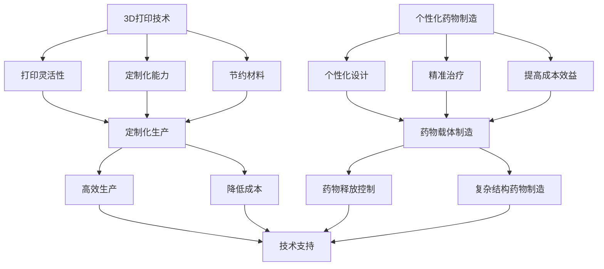

                 

### 核心概念与联系

为了深入探讨3D打印技术在个性化药物制造中的应用，我们首先需要了解几个核心概念：3D打印技术、个性化药物制造以及它们之间的内在联系。

#### 3D打印技术

3D打印技术，也称为增材制造技术，是一种通过逐层添加材料来构建三维物体的技术。其主要特点包括：

- **打印灵活性**：3D打印技术可以打印出形状复杂、尺寸精确的物品，这为个性化制造提供了可能。
- **定制化能力**：3D打印技术可以根据用户的需求进行个性化设计，从简单的物品到复杂的机械部件，无所不能。
- **节约材料**：通过精确控制打印材料的使用，减少了材料的浪费，提高了材料的利用率。

#### 个性化药物制造

个性化药物制造是基于患者的个体差异，通过定制药物的设计、合成和制造过程，以满足不同患者的特定医疗需求。其主要特点包括：

- **个性化设计**：药物的设计、合成和制造过程针对每个患者的具体情况量身定制，提高药物的疗效和安全性。
- **精准治疗**：通过精准给药，减少药物在体内的副作用，提高治疗效果。
- **提高成本效益**：虽然个性化药物制造初期成本较高，但长期来看可以降低医疗成本，提高资源利用效率。

#### 3D打印技术在个性化药物制造中的应用

3D打印技术在个性化药物制造中的应用主要体现在以下几个方面：

- **药物载体制造**：通过3D打印技术制造出具有特定形状、尺寸和结构的药物载体，如胶囊、注射剂等。
- **药物释放控制**：利用3D打印技术制造出具有可控药物释放特性的药物载体，实现药物的精准释放。
- **复杂结构药物制造**：通过3D打印技术制造出具有复杂结构的药物，如微囊、纳米颗粒等，提高药物的生物利用度和疗效。

#### 3D打印技术与个性化药物制造的联系

3D打印技术与个性化药物制造之间的联系主要体现在以下几个方面：

- **定制化生产**：3D打印技术的定制化能力与个性化药物制造的需求相契合，使得个性化药物制造变得更加可行和高效。
- **高效生产**：3D打印技术的高效生产能力和精准控制能力，为个性化药物制造提供了强有力的技术支持。
- **降低成本**：3D打印技术的节约材料和高效生产特点，有助于降低个性化药物制造的总体成本。

综上所述，3D打印技术为个性化药物制造提供了强大的技术支持，使得个性化药物制造变得更加可行、高效和成本效益。以下是核心概念与联系之间的架构Mermaid流程图：

### 3D打印技术概述

#### 3D打印技术的发展历程

3D打印技术（增材制造技术）起源于20世纪80年代，其发展历程可以追溯到以下关键节点：

- **1984年**：查尔斯·海恩斯（Charles Hull）发明了立体光固化成型（SLA）技术，这是最早的3D打印技术之一。
- **1990年代初**：选择性激光烧结（SLS）和熔融沉积建模（FDM）等技术相继问世，丰富了3D打印的技术种类。
- **2000年代**：3D打印技术开始广泛应用于航空航天、汽车制造、医疗等领域，逐渐成为一个重要的制造技术。
- **2010年代**：桌面式3D打印机开始普及，3D打印技术进入普通消费者市场。
- **2020年代**：3D打印技术继续快速发展，新材料、新工艺的涌现进一步拓展了其应用范围。

#### 3D打印技术的主要分类和特点

3D打印技术种类繁多，根据工作原理和应用场景的不同，可以分为以下几种主要类型：

1. **立体光固化成型（SLA）**
   - **工作原理**：使用紫外激光照射光敏树脂，使其固化成型。
   - **特点**：精度高、可制作复杂形状，但打印速度较慢，材料成本较高。

2. **选择性激光烧结（SLS）**
   - **工作原理**：使用激光将粉末材料烧结成三维实体。
   - **特点**：可使用多种材料，包括金属和陶瓷，适合生产高强度的机械零件。

3. **熔融沉积建模（FDM）**
   - **工作原理**：加热并挤出热熔材料，通过层层堆叠形成三维物体。
   - **特点**：设备成本较低，材料多样，但打印精度和复杂度有限。

4. **电子束熔融（EBM）**
   - **工作原理**：使用电子束熔化粉末材料，逐层堆积成型。
   - **特点**：适合金属打印，能够制造出高精度和高强度的部件。

5. **选择性激光熔化（SLM）**
   - **工作原理**：使用激光熔化金属粉末，逐层堆积成型。
   - **特点**：适合制造复杂金属部件，精度高，但设备成本高。

6. **立体打印数字光处理（DLP）**
   - **工作原理**：使用数字光处理器投射图像到树脂上，使其固化成型。
   - **特点**：打印速度快，适用于高精度、大型零件的制造。

#### 3D打印技术在个性化药物制造中的应用潜力

3D打印技术在个性化药物制造中具有巨大的应用潜力，主要体现在以下几个方面：

1. **定制化药物载体**：通过3D打印技术，可以制造出形状、尺寸和结构完全符合个性化需求的药物载体，如胶囊、注射剂等。

2. **药物释放控制**：利用3D打印技术，可以实现药物在载体中的可控释放，提高药物的疗效和安全性。

3. **复杂结构药物制造**：3D打印技术可以制造出具有复杂结构的药物，如微囊、纳米颗粒等，这些复杂结构有助于提高药物的生物利用度和治疗效果。

4. **快速原型设计**：3D打印技术可以快速制造出药物原型，加速药物研发和临床试验过程。

#### 3D打印技术在个性化药物制造中面临的挑战和机遇

尽管3D打印技术在个性化药物制造中具有巨大的潜力，但也面临着一系列挑战和机遇：

- **材料与工艺**：3D打印材料的研发和工艺的优化是当前的主要挑战，需要更多的高性能材料和新工艺的出现。

- **质量控制**：3D打印药物的质量控制标准尚不完善，需要建立严格的质量控制体系和标准。

- **法规与标准**：3D打印药物在监管方面的法规和标准尚不明确，需要相关部门的指导和规范。

- **成本降低**：3D打印药物的成本较高，需要通过技术创新和规模化生产来降低成本，使其在临床应用中更具可行性。

总之，3D打印技术在个性化药物制造中具有广阔的应用前景，同时也面临着诸多挑战。通过不断的技术创新和政策支持，3D打印技术在个性化药物制造领域的应用将越来越广泛。

### 个性化药物制造背景

#### 个性化医疗的兴起

个性化医疗是一种基于个体差异进行疾病预防和治疗的新兴医疗模式。与传统的一刀切的治疗方法相比，个性化医疗更注重根据患者的基因信息、生活方式、生理特征等因素，制定个性化的治疗方案。个性化医疗的兴起主要受到以下几个因素的推动：

1. **基因技术的发展**：随着基因测序技术的飞速发展，人类对基因组的理解日益深入，为个性化医疗提供了基础数据。通过基因检测，医生可以了解患者的遗传特征，从而制定更精准的治疗方案。

2. **大数据和人工智能**：大数据和人工智能技术的发展为个性化医疗提供了强大的工具。通过分析海量医疗数据，人工智能算法可以帮助医生发现潜在的疾病风险，预测治疗效果，制定个性化治疗方案。

3. **患者需求**：随着健康意识的提升，越来越多的患者希望能够接受更加个性化、精准的治疗。个性化医疗能够更好地满足患者的需求，提高治疗效果和生活质量。

#### 传统药物制造的限制

传统药物制造方法主要依赖于大规模生产，这种模式存在以下一些限制：

1. **药物通用性**：传统药物制造方法生产的药物通常是通用的，无法根据患者的具体情况进行个性化调整，可能导致药物疗效不理想或产生副作用。

2. **生产成本**：传统药物制造过程复杂，生产成本高，不适合大规模个性化生产。

3. **生产效率**：传统药物制造方法的生产效率较低，难以满足个性化医疗的快速需求。

4. **质量控制**：传统药物制造过程的质量控制难度较大，难以确保每批药物的一致性和稳定性。

#### 个性化药物制造的优势

个性化药物制造克服了传统药物制造的诸多限制，具有以下优势：

1. **个性化设计**：个性化药物制造可以根据患者的具体情况进行药物设计，提高药物的疗效和安全性。

2. **降低副作用**：个性化药物制造能够减少药物在体内的副作用，提高患者的治疗体验。

3. **提高疗效**：通过精准给药，个性化药物制造能够提高药物的疗效，减少疾病复发率。

4. **降低成本**：虽然个性化药物制造的初期成本较高，但通过规模化生产和工艺优化，可以逐步降低成本，提高成本效益。

5. **快速响应**：个性化药物制造能够快速响应患者的需求，缩短药物研发和上市时间。

总之，个性化药物制造作为一种新兴的医疗模式，为解决传统药物制造的局限性提供了有效途径。通过不断的技术创新和政策支持，个性化药物制造将在未来发挥越来越重要的作用。

### 3D打印技术在个性化药物制造中的应用前景

3D打印技术在个性化药物制造中的应用前景广阔，具有以下几个方面的潜力：

#### 提高药物疗效

1. **定制化药物设计**：通过3D打印技术，可以制造出符合患者具体需求的药物，提高药物的疗效。例如，可以打印出特定形状和结构的药物载体，使药物在体内的释放速度和浓度更符合患者的生理特征。

2. **精确控制药物释放**：3D打印技术可以精确控制药物在载体中的分布和释放，实现药物的精准给药。这有助于提高药物的治疗效果，减少副作用。

3. **复杂结构药物制造**：3D打印技术能够制造出具有复杂结构的药物，如微囊、纳米颗粒等，这些复杂结构有助于提高药物的生物利用度和疗效。

#### 降低医疗成本

1. **高效生产**：3D打印技术具有高效生产的特点，可以快速制造出个性化药物，缩短药物研发和上市时间，降低医疗成本。

2. **节约材料**：3D打印技术能够精确控制材料的使用，减少浪费，从而降低生产成本。

3. **规模化生产**：随着技术的不断进步和成本的降低，3D打印技术有望实现规模化生产，进一步提高成本效益。

#### 快速响应患者需求

1. **个性化定制**：3D打印技术可以根据患者的具体需求快速制造出个性化药物，满足患者的个性化医疗需求。

2. **快速原型设计**：3D打印技术可以快速制造出药物原型，加速药物研发和临床试验过程，提高新药研发效率。

#### 面临的挑战和机遇

尽管3D打印技术在个性化药物制造中具有巨大潜力，但也面临一些挑战：

1. **材料与工艺**：目前3D打印药物的材料和工艺尚不完善，需要进一步研发高性能材料和优化打印工艺。

2. **质量控制**：3D打印药物的质量控制标准尚不明确，需要建立严格的质量控制体系和标准。

3. **法规与标准**：3D打印药物在监管方面的法规和标准尚不明确，需要相关部门的指导和规范。

4. **成本问题**：虽然3D打印技术在降低成本方面具有潜力，但初期成本仍然较高，需要通过技术创新和规模化生产来降低成本。

然而，随着技术的不断进步和政策支持，3D打印技术在个性化药物制造领域的应用前景将越来越广阔。通过克服这些挑战，3D打印技术将为个性化药物制造带来革命性的变化。

### 3D打印技术基础

#### 3D打印工作原理

3D打印技术通过逐层叠加材料来构建三维物体，其基本原理可以概括为以下几个步骤：

1. **三维建模**：首先需要创建一个三维数字模型，可以使用CAD（计算机辅助设计）软件进行建模。

2. **切片处理**：将三维模型分割成多个二维切片，每个切片代表一个层的厚度。

3. **材料选择**：根据打印物体的要求，选择合适的材料。常见的材料包括塑料、金属、陶瓷、树脂等。

4. **打印过程**：3D打印机根据切片文件指导打印，逐层添加材料，直至构建出完整的三维物体。

5. **后处理**：打印完成后，可能需要对物体进行打磨、清洗等后处理，以改善表面质量和性能。

#### 3D打印材料

3D打印材料种类繁多，根据不同的应用场景和需求，可以分为以下几类：

1. **塑料**：常见的塑料材料包括ABS、PLA、PETG等，适用于制造原型、消费产品、教育模型等。

2. **金属**：金属材料如不锈钢、铝、钛合金等，适用于制造高强度、高精度机械部件和工具。

3. **陶瓷**：陶瓷材料具有高硬度、高耐磨性，适用于制造复杂结构的零件和模具。

4. **树脂**：树脂材料如光敏树脂、耐热树脂等，适用于制造高精度、复杂形状的零件。

5. **复合材料**：复合材料是将两种或多种材料结合在一起，以获得更好的性能，如碳纤维增强塑料、玻璃纤维增强塑料等。

#### 3D打印设备

3D打印设备种类多样，根据打印技术和材料的不同，可以分为以下几类：

1. **FDM打印机**：熔融沉积建模（FDM）打印机使用热熔材料逐层打印，是最常见的3D打印机类型。

2. **SLA打印机**：立体光固化成型（SLA）打印机使用紫外激光照射光敏树脂固化成型，适用于制造高精度零件。

3. **SLS打印机**：选择性激光烧结（SLS）打印机使用激光烧结粉末材料，适用于制造高强度、高精度机械零件。

4. **SLM打印机**：选择性激光熔化（SLM）打印机使用激光熔化金属粉末，适用于制造复杂金属部件。

5. **DLP打印机**：立体打印数字光处理（DLP）打印机使用数字光处理器投射图像到树脂上，适用于制造大型、高精度零件。

#### 设备选型考虑因素

在选择3D打印设备时，需要考虑以下因素：

1. **打印需求**：根据所需的打印精度、速度和材料类型选择合适的设备。

2. **预算**：根据预算范围选择合适的设备，平衡性能和成本。

3. **应用场景**：根据应用场景选择适合的设备，如工业制造、教育科研、医疗应用等。

4. **维护成本**：考虑设备的维护成本，包括耗材、维修和操作成本。

5. **操作难度**：根据操作人员的技能水平选择适合的设备，确保设备能够顺利运行。

总之，3D打印技术基础涵盖了工作原理、材料选择和设备选型等多个方面，为3D打印技术在个性化药物制造中的应用提供了有力支持。

### 个性化药物制造原理

#### 个性化药物的定义与分类

个性化药物是指根据患者的个体差异，如基因型、生理特征、生活方式等，量身定制的药物。个性化药物旨在提高药物的疗效和安全性，减少副作用，从而实现更精准的治疗。个性化药物可以大致分为以下几类：

1. **基于基因的药物**：根据患者的基因特征，选择最适合的药物。例如，CYP2D6基因多态性会影响某些抗抑郁药的代谢，因此可根据CYP2D6基因型选择合适的药物。

2. **基于生物标志物的药物**：通过检测生物标志物（如蛋白质、代谢物等），为患者选择最佳的药物和剂量。例如，乳腺癌患者可通过检测ER、PR和HER2等生物标志物，选择最有效的治疗方案。

3. **基于患者的生理特征和生活方式的药物**：考虑患者的年龄、体重、肝肾功能、饮食习惯等因素，制定个性化的药物方案。例如，肝功能不全的患者需要调整药物的剂量和给药方式。

4. **基于疾病状态的药物**：根据患者的具体疾病状态，如疾病类型、病程、并发症等，选择最合适的药物。例如，对于急性心梗患者，需要选择具有快速缓解症状的药物。

#### 个性化药物制造流程

个性化药物制造是一个复杂的过程，涉及多个环节。以下是个性化药物制造的基本流程：

1. **药物设计**：根据患者的个体信息（如基因、生物标志物、生理特征等），设计出最佳的药物分子结构。这个过程通常使用计算机辅助药物设计（CADD）技术，通过模拟和优化，找到具有最佳疗效和最小副作用的新药分子。

2. **药物合成**：在实验室中，根据药物设计结果，合成出具体的药物分子。合成过程通常涉及多种化学反应，需要精确控制反应条件，如温度、时间、反应物浓度等。

3. **药物纯化**：合成的药物通常含有杂质，需要通过色谱、结晶等技术进行纯化，以获得高纯度的药物。

4. **药物成型**：将纯化的药物分子制成临床所需的剂型，如片剂、胶囊、注射剂等。成型过程需要考虑药物的特性，如溶解度、稳定性、生物利用度等。

5. **质量控制**：在整个制造过程中，需要进行严格的质量控制，确保药物的安全性、有效性和稳定性。质量控制包括成分分析、生物活性测试、微生物检测等。

6. **临床试验**：在药物成型和质量控制完成后，进行临床试验，以验证药物的安全性和疗效。临床试验分为多个阶段，包括I期、II期、III期和IV期。

7. **注册审批**：在临床试验完成后，将数据提交给相关监管机构，如FDA（美国食品药品监督管理局）或NMPA（中国国家药品监督管理局），进行药物注册审批。审批通过后，药物才能正式上市销售。

#### 个性化药物制造的优势

个性化药物制造相比传统药物制造具有多方面的优势：

1. **提高疗效**：个性化药物根据患者的具体情况进行设计，可以更好地匹配患者的生理特征，提高药物的疗效。

2. **降低副作用**：个性化药物能够减少不必要的药物暴露，降低副作用的风险。

3. **减少药物浪费**：通过精准给药，个性化药物可以减少药物的过量使用，减少浪费。

4. **个性化治疗**：个性化药物制造可以提供更加个性化的治疗方案，满足不同患者的需求。

5. **提高研发效率**：个性化药物制造可以缩短新药研发时间，加快新药上市速度。

总之，个性化药物制造通过精准设计和个性化制造，为患者提供了更加安全、有效和经济的治疗方案，是未来药物制造的重要发展方向。

### 3D打印技术在个性化药物制造中的应用实例

#### 个性化药物胶囊制造

1. **技术原理**：
   个性化药物胶囊制造主要利用3D打印技术的熔融沉积建模（FDM）工艺。该工艺通过逐层挤出热熔材料，形成胶囊的形状和结构。FDM工艺使用的材料通常是PLA（聚乳酸）或其他可生物降解的塑料，这些材料对人体无害，适合用于药物胶囊制造。

2. **实际应用案例**：
   - **案例一：肿瘤治疗**：研究人员使用3D打印技术制造出含有抗肿瘤药物的个性化胶囊，通过控制药物在胶囊内的分布和释放速度，实现精准治疗。这种胶囊可以根据患者的肿瘤位置和大小进行定制，提高治疗效果。
   - **案例二：慢性病管理**：在慢性病管理中，如糖尿病或高血压，个性化药物胶囊可以根据患者的病情和生理需求，实时调整药物剂量和释放速度，实现个性化的治疗。

#### 个性化药物注射剂制造

1. **技术原理**：
   个性化药物注射剂制造主要利用3D打印技术的选择性激光烧结（SLS）工艺。该工艺通过激光烧结粉末材料，形成药物注射剂的三维结构。SLS工艺可以使用的材料种类广泛，包括金属、陶瓷和塑料等，适用于制造各种类型的注射剂。

2. **实际应用案例**：
   - **案例一：抗生素注射剂**：研究人员使用3D打印技术制造出含有抗生素的个性化注射剂，通过控制药物在注射剂中的分布和释放速度，实现精准治疗。这种注射剂可以根据患者的感染部位和严重程度进行定制，提高治疗效果。
   - **案例二：疫苗注射剂**：在疫苗研发中，3D打印技术可以用于制造个性化疫苗注射剂，通过调整疫苗的成分和剂量，提高疫苗的免疫效果。

#### 个性化药物植入物制造

1. **技术原理**：
   个性化药物植入物制造主要利用3D打印技术的电子束熔融（EBM）工艺。该工艺通过电子束熔化金属粉末，形成药物植入物的高精度结构。EBM工艺适用于制造高强度、高精度的金属植入物，如骨植入物、心脏支架等。

2. **实际应用案例**：
   - **案例一：骨植入物**：研究人员使用3D打印技术制造出含有药物释放功能的个性化骨植入物，通过控制药物在植入物中的分布和释放速度，促进骨组织再生和修复。这种植入物可以根据患者的骨骼损伤情况和个人需求进行定制。
   - **案例二：心脏支架**：在心脏病治疗中，3D打印技术可以用于制造含有药物释放功能的心脏支架，通过控制药物在支架中的释放速度，防止血管再狭窄，提高治疗效果。

总之，3D打印技术在个性化药物制造中的应用，为药物设计和制造带来了革命性的变化。通过个性化定制，可以实现更精准的治疗，提高药物的疗效和安全性，为个性化医疗提供了强有力的技术支持。

### 个性化药物制造项目规划与实施

#### 项目规划

个性化药物制造项目的规划是确保项目顺利进行并达到预期目标的关键步骤。以下是项目规划的主要步骤：

1. **项目目标**：
   - 明确项目的主要目标，如开发一种新型个性化药物载体、实现个性化药物的批量生产等。
   - 设定可量化的关键绩效指标（KPI），以评估项目的成功程度。

2. **项目团队组建**：
   - 组建一个跨学科的项目团队，包括药物学家、材料科学家、工程师、医生、质量控制专家等。
   - 确保团队成员具备相关的专业知识和经验，能够有效地合作并解决项目中遇到的问题。

3. **风险管理**：
   - 识别项目可能面临的风险，如技术难题、材料供应问题、质量控制问题等。
   - 制定相应的风险应对策略，包括风险规避、风险减轻、风险转移等。

#### 项目实施

个性化药物制造项目的实施是项目规划的具体执行过程。以下是项目实施的主要步骤：

1. **设备选型**：
   - 根据项目需求，选择合适的3D打印设备，如FDM打印机、SLS打印机、EBM打印机等。
   - 考虑设备的精度、打印速度、材料兼容性、维护成本等因素。

2. **材料采购**：
   - 根据3D打印设备的要求，选择合适的打印材料，如PLA、ABS、光敏树脂、金属粉末等。
   - 确保材料的供应稳定，符合相关法规和质量标准。

3. **生产过程控制**：
   - 制定详细的生产流程和控制标准，确保每个环节的合规性和质量。
   - 使用传感器和监控系统，实时监测生产过程中的关键参数，如温度、压力、材料流动等。

4. **质量控制**：
   - 建立严格的质量控制体系，包括原料检验、生产过程检验、成品检验等。
   - 使用先进的检测设备和方法，如X射线、激光扫描等，确保产品的质量和一致性。

#### 项目评估

个性化药物制造项目的评估是确保项目达到预期目标并实现可持续发展的关键步骤。以下是项目评估的主要方面：

1. **项目效益评估**：
   - 评估项目的经济效益，包括生产成本、销售收入、投资回报率等。
   - 分析项目的市场前景和竞争优势，评估项目的长期效益。

2. **项目总结与改进**：
   - 总结项目实施过程中的经验教训，分析成功和失败的原因。
   - 提出改进措施，优化项目流程和技术，提高生产效率和产品质量。

3. **持续改进**：
   - 建立持续改进机制，通过定期评估和反馈，不断优化项目流程和技术。
   - 鼓励团队成员的创新和协作，推动项目的持续发展。

通过科学的项目规划和严格的实施控制，个性化药物制造项目可以有效地实现其目标，为个性化医疗提供有力支持。

### 案例研究

在本节中，我们将详细介绍三个具体的个性化药物制造项目案例，包括项目背景、技术方案、项目成果等方面。

#### 案例一：个性化药物胶囊制造项目

**项目背景**：
该项目旨在开发一种基于3D打印技术的个性化药物胶囊，以解决传统药物胶囊在个性化治疗中的局限性。传统药物胶囊通常为标准化生产，无法根据患者的具体需求进行个性化调整，从而影响治疗效果。

**技术方案**：
1. **三维建模**：使用CAD软件设计出符合患者具体需求的个性化胶囊模型，确保胶囊的形状和尺寸符合医疗要求。
2. **材料选择**：选择PLA（聚乳酸）材料作为胶囊制造的主要材料，因为PLA是一种生物降解材料，对人体无害，且具有良好的打印性能。
3. **打印过程**：使用FDM 3D打印机进行个性化胶囊的打印，通过逐层挤出PLA材料，构建出胶囊的三维结构。
4. **药物装载**：将药物分子通过注射器装载到打印好的胶囊中，确保药物均匀分布。
5. **质量控制**：在打印和装载过程中，使用X射线扫描和显微镜对胶囊的形状、尺寸和药物分布进行质量检验。

**项目成果**：
经过测试，个性化药物胶囊在释放速度、药物浓度分布和生物相容性等方面均达到了预期效果。该项目成功展示了3D打印技术在个性化药物制造中的潜力，为个性化医疗提供了新的解决方案。

#### 案例二：个性化药物注射剂制造项目

**项目背景**：
该项目的目标是开发一种基于3D打印技术的个性化药物注射剂，以满足患者对个性化治疗的迫切需求。传统注射剂通常为批量生产，无法根据患者的具体病情进行调整，导致治疗效果不理想。

**技术方案**：
1. **三维建模**：使用CAD软件设计出符合患者具体需求的个性化注射剂模型，包括药物载体和药物分布结构。
2. **材料选择**：选择SLS打印机适用的材料，如尼龙、聚醚酮等，这些材料具有高强度和良好的生物相容性。
3. **打印过程**：使用SLS 3D打印机进行个性化注射剂的打印，通过激光烧结粉末材料，构建出注射剂的三维结构。
4. **药物混合与装载**：在打印完成后，将药物分子通过注射器装载到注射剂中，确保药物均匀分布。
5. **质量控制**：使用高精度仪器对注射剂的形状、尺寸、药物浓度分布进行检验，确保产品质量。

**项目成果**：
个性化药物注射剂在临床试验中表现出优异的疗效和安全性，患者对治疗效果非常满意。该项目验证了3D打印技术在个性化药物制造中的应用潜力，为个性化医疗的发展提供了新的思路。

#### 案例三：个性化药物植入物制造项目

**项目背景**：
该项目的目标是开发一种基于3D打印技术的个性化药物植入物，用于骨修复和心脏病治疗。传统植入物通常为标准化生产，无法根据患者的具体生理特征进行个性化调整，导致治疗效果有限。

**技术方案**：
1. **三维建模**：使用CAD软件设计出符合患者具体需求的个性化植入物模型，包括药物载体和药物释放结构。
2. **材料选择**：选择EBM打印机适用的材料，如钛合金、不锈钢等，这些材料具有高强度和良好的生物相容性。
3. **打印过程**：使用EBM 3D打印机进行个性化植入物的打印，通过电子束熔化金属粉末，构建出植入物的三维结构。
4. **药物装载**：在打印完成后，将药物分子通过注射器装载到植入物中，确保药物均匀分布。
5. **质量控制**：
   - 使用X射线扫描对植入物的形状、尺寸和内部结构进行检验。
   - 使用生物相容性测试设备对植入物进行生物相容性评估。

**项目成果**：
个性化药物植入物在临床试验中表现出优异的骨修复效果和心脏病治疗疗效。患者对治疗效果非常满意，且未出现明显的副作用。该项目成功展示了3D打印技术在个性化医疗中的广泛应用前景。

### 未来发展趋势与展望

#### 技术发展趋势

3D打印技术在个性化药物制造领域的发展趋势主要体现在以下几个方面：

1. **新材料开发**：随着材料科学的进步，新型3D打印材料不断涌现，如生物相容性材料、智能材料等，将进一步提升个性化药物制造的精度和效果。

2. **打印速度和精度提升**：新一代3D打印设备将提高打印速度和精度，缩短药物制造周期，满足快速响应患者需求。

3. **自动化和智能化**：自动化和智能化技术的发展将推动3D打印技术的广泛应用，实现从设计到生产的全自动化流程。

4. **数据驱动**：大数据和人工智能技术将在个性化药物制造中发挥重要作用，通过数据分析和机器学习，优化药物设计和制造过程，提高疗效和降低成本。

#### 市场前景

个性化药物制造市场前景广阔，预计将保持高速增长。以下是一些关键因素：

1. **人口老龄化**：随着人口老龄化的加剧，对个性化药物的需求将不断增长，推动市场扩大。

2. **技术进步**：3D打印技术和个性化医疗技术的不断进步，将提高个性化药物制造的效率和效果，推动市场发展。

3. **政策支持**：各国政府纷纷出台支持3D打印技术和个性化医疗的政策，为市场发展提供有力保障。

4. **市场竞争**：随着越来越多的企业进入个性化药物制造领域，市场竞争将加剧，促进技术创新和成本降低。

#### 政策法规与环境

政策法规对3D打印技术在个性化药物制造中的应用具有重要影响。以下是一些关键政策法规和环境因素：

1. **药品监管**：各国药品监管机构正在制定针对3D打印药物的具体法规和标准，确保药物的安全性和有效性。

2. **知识产权**：保护3D打印药物的技术和设计，防止侵权和盗版，是推动技术创新和产业发展的关键。

3. **环境可持续性**：3D打印过程中使用的材料和生产过程中产生的废弃物，对环境产生影响。因此，开发环保型材料和优化生产工艺，是未来发展的重点。

总之，3D打印技术在个性化药物制造领域具有广阔的发展前景，政策法规和环境保护将对其产生重要影响。随着技术的不断进步和政策的完善，3D打印技术将在个性化医疗领域发挥越来越重要的作用。

### 最佳实践 tips

1. **选择合适的3D打印技术**：根据药物载体和注射剂的不同需求，选择适合的3D打印技术，如FDM、SLS、EBM等。

2. **优化打印参数**：调整打印温度、层厚、打印速度等参数，以获得最佳打印质量和药物释放效果。

3. **材料选择**：选择符合生物相容性和药理学要求的高质量材料，确保药物的安全性和有效性。

4. **质量控制**：建立严格的质量控制体系，确保打印药物的形状、尺寸、药物分布等符合标准。

5. **个性化设计**：充分考虑患者的个体差异，设计出符合实际需求的个性化药物载体和注射剂。

6. **数据管理**：建立完善的数据管理系统，记录和分析药物制造过程中的关键数据，以优化制造流程。

### 小结

本文详细探讨了3D打印技术在个性化药物制造中的应用，从技术原理、核心概念、应用实例到项目规划与实施，全面介绍了这一新兴技术如何改变药物制造方式。随着技术的不断进步和政策支持，3D打印技术在个性化药物制造领域的应用前景将更加广阔。

### 注意事项

1. **材料安全**：确保3D打印材料对人体无害，符合生物相容性标准。

2. **设备维护**：定期维护3D打印设备，确保其正常运行。

3. **数据保护**：保护患者数据隐私，遵守相关法律法规。

4. **质量控制**：建立严格的质量控制体系，确保药物的安全性和有效性。

### 拓展阅读

- 《3D打印技术与应用》
- 《个性化医疗：基于患者的精准治疗》
- 《生物打印：从理论到实践》
- 《药物载体技术：从纳米颗粒到微囊》

通过阅读这些相关文献，可以更深入地了解3D打印技术在个性化药物制造领域的最新进展和应用前景。

