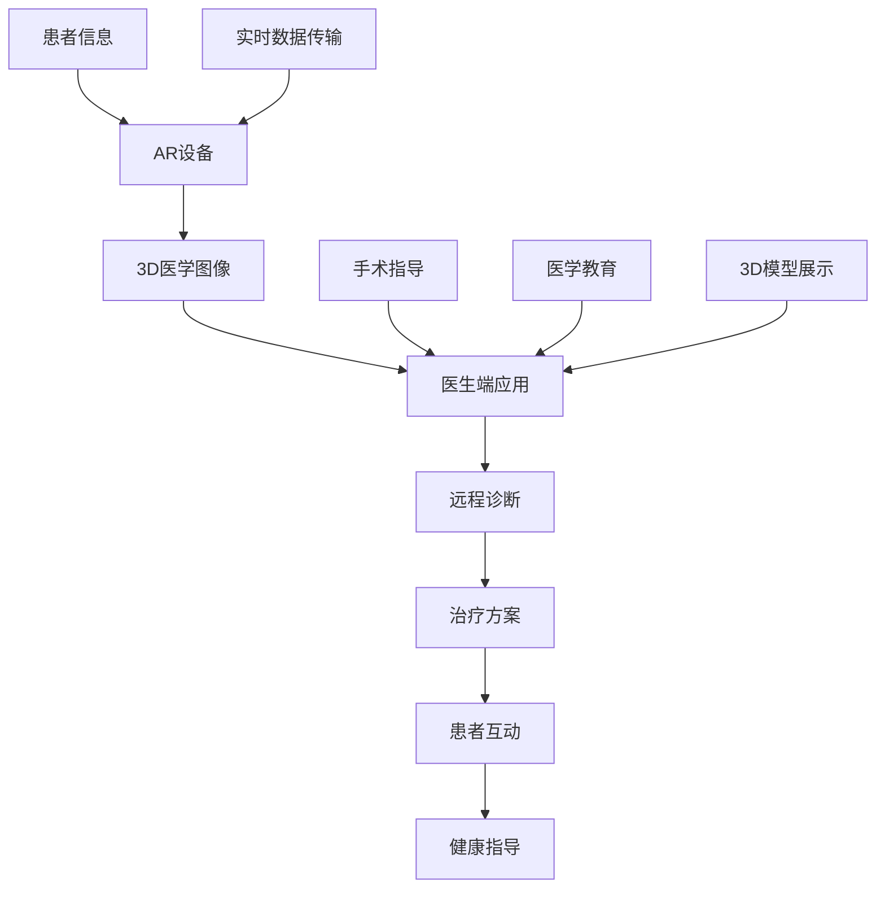

                 


### 引言：5G与AR在远程医疗中的重要性

远程医疗作为一种新兴的医疗模式，正逐渐改变传统医疗服务的格局。它通过互联网和通信技术，使得医生和患者能够跨越地理界限，实现远程诊断、治疗和护理。然而，随着医疗场景的复杂性和对数据传输质量要求的提高，传统的远程医疗手段面临着诸多挑战，如带宽限制、延迟问题以及交互体验的不足。为了解决这些问题，5G和AR技术的引入成为了一种必然趋势。

5G（第五代移动通信技术）以其高速率、低延迟和大连接的特性，为远程医疗提供了坚实的基础。它不仅能够实现更高效的数据传输，还能支持实时高清视频、虚拟现实（VR）和增强现实（AR）等技术的应用，从而提升远程医疗服务的质量和效率。

AR（增强现实）技术则通过在现实场景中叠加虚拟信息，提供了一种全新的交互方式。它能够为医生和患者提供直观、互动的远程医疗服务，使得诊断和治疗过程更加直观、准确和高效。

本文将分步骤分析5G和AR技术在远程医疗会诊中的应用前景，旨在为读者提供一个全面、深入的视角。文章将首先介绍5G和AR技术的基本概念、核心特性及其在远程医疗中的应用，然后通过具体案例和项目实战，展示这些技术的实际应用效果。最后，我们将探讨未来发展趋势与面临的挑战，为读者提供一些建议和启示。

---

### 5G技术的基本原理与核心特性

5G技术，即第五代移动通信技术，是继1G模拟通信、2G数字通信、3G互联网接入和4G高速数据传输之后的最新一代移动通信技术。5G技术的核心目标是实现高速率、低延迟和大连接，以满足未来更加丰富多样的应用需求。

#### 5.1 5G技术的主要特点

**1. 高速率**：5G网络的最大下载速度可达10Gbps，是4G网络的100倍。这一高速率使得高清视频传输、大规模物联网数据传输和实时数据分析和处理成为可能。

**2. 低延迟**：5G网络的延迟可低至1毫秒，远低于4G的20-30毫秒。低延迟对于实时性要求极高的应用，如远程手术、无人驾驶和工业自动化，具有重要意义。

**3. 大规模连接**：5G网络支持高达100万/平方公里的连接密度，意味着在公共场所、大型活动和医疗设施中，5G网络能够支持大量设备的同时在线，满足远程医疗中多用户、多终端的通信需求。

#### 5.2 5G技术的关键特性

**1. 毫米波频段**：5G技术主要采用毫米波频段，频谱资源更加丰富，能够提供更高的数据传输速率。但毫米波传播特性较差，易受环境干扰，需要通过高频段天线实现信号传输。

**2. 网络切片技术**：网络切片技术是5G的一个重要特性，它允许运营商根据不同应用场景的需求，灵活划分网络资源，提供定制化的网络服务。例如，在远程医疗会诊中，可以配置低延迟、高带宽的网络切片，确保医疗数据的实时传输。

**3. 边缘计算**：5G结合边缘计算，将计算和存储资源部署在网络的边缘，以减少数据传输的延迟和带宽需求。在远程医疗中，边缘计算可以实现实时影像分析、诊断建议等本地化处理，提高医疗服务的响应速度和效率。

### 5.3 5G网络架构与组成

5G网络架构由多个关键组件构成，包括基站（gNB）、核心网（5GC）、无线接入网（RAN）和用户设备（UE）等。

**1. 基站（gNB）**：5G基站分为宏基站和微基站，覆盖不同的范围和场景。宏基站主要用于广域覆盖，微基站则用于热点区域的密集覆盖。

**2. 核心网（5GC）**：5GC包括服务化架构（SA）和非服务化架构（NSA）。SA架构完全基于5G核心网，NSA架构则基于4G核心网，通过4G/5G共存实现过渡。

**3. 无线接入网（RAN）**：RAN包括无线接入网控制器（gRAN）和用户面设备（gUE）。gRAN负责无线资源的分配和管理，gUE则是用户设备的无线接口。

**4. 用户设备（UE）**：UE包括智能手机、平板电脑、笔记本电脑等各种终端设备，是用户与5G网络交互的入口。

### 5.4 5G技术对远程医疗的影响

5G技术对远程医疗的影响主要表现在以下几个方面：

**1. 高速率数据传输**：5G的高速率使得医疗影像、医学大数据等大容量数据的传输更加高效，支持远程医疗中的高清视频诊断、手术指导等应用。

**2. 低延迟通信**：5G的低延迟特性使得远程手术、急救等实时性要求极高的场景得以实现，提高了医疗服务的质量和安全性。

**3. 大规模设备连接**：5G的高连接密度支持医疗设施中的各种设备，如医疗机器人、物联网设备等同时在线，实现设备间的无缝协同。

**4. 边缘计算能力**：5G结合边缘计算，可以将部分计算任务本地化，提高数据处理速度和效率，适用于对实时性要求较高的远程医疗服务。

综上所述，5G技术以其高速率、低延迟和大连接的特性，为远程医疗提供了强大的技术支持。随着5G网络的不断普及和技术的成熟，远程医疗服务将变得更加高效、便捷和普及，为患者带来更好的医疗体验。

### Mermaid流程图：5G网络架构与远程医疗会诊的联系

```mermaid
graph TD
    A[5G基站(gNB)] --> B[无线接入网(RAN)]
    B --> C[核心网(5GC)]
    C --> D[用户设备(UE)]
    D --> E[远程医疗会诊系统]
    E --> F[医学影像传输]
    E --> G[实时数据共享]
    E --> H[远程手术指导]
    I[5G高速率] --> A
    J[低延迟通信] --> B
    K[大规模设备连接] --> D
    L[边缘计算] --> C
```

此流程图展示了5G网络架构与远程医疗会诊系统的关键联系。5G基站通过无线接入网与核心网连接，再通过用户设备与远程医疗会诊系统进行交互。5G的高速率、低延迟、大规模连接和边缘计算能力分别对医学影像传输、实时数据共享、远程手术指导和系统整体性能产生积极影响。

### 5G技术在远程医疗中的具体应用场景

5G技术的引入为远程医疗带来了前所未有的机遇，尤其是在以下几个方面：

#### 1. 高清医学影像传输

医学影像在诊断和治疗过程中扮演着至关重要的角色。传统的远程医疗系统往往受限于带宽和延迟，导致影像传输速度缓慢，图像质量不佳。而5G技术的高速率特性，使得高清医学影像的实时传输成为可能。医生可以通过远程会诊系统，快速访问患者的影像资料，进行精准的诊断和治疗方案制定。

**应用实例**：在某医院的远程影像诊断中心，医生通过5G网络，实时接收到了来自偏远地区的患者影像数据，包括CT、MRI等。通过高清影像，医生能够清晰看到患者的内部结构，准确判断病情，及时提供治疗方案。

#### 2. 实时数据共享

远程医疗不仅仅是影像传输，还包括患者生命体征、医疗设备数据等实时信息的共享。5G技术的低延迟特性，使得医生可以实时获取患者的生命体征数据，如心率、血压、血糖等，从而在紧急情况下迅速做出反应。

**应用实例**：在一个远程重症监护室中，医生通过5G网络实时监测患者的生命体征数据，当数据异常时，系统会立即发出警报，医生可以迅速采取相应措施，确保患者的生命安全。

#### 3. 远程手术指导

远程手术是5G技术在远程医疗中最为激动人心的应用之一。5G的低延迟特性，使得远程手术操作更加流畅，医生可以在远程控制手术机器人，进行精细的手术操作。这不仅节省了患者的出行时间和费用，还提高了手术的成功率和安全性。

**应用实例**：在一个偏远地区的医院，当地医生通过5G网络，接受了一位知名专家的远程手术指导。专家通过高清视频和实时的数据传输，远程监控手术过程，提供专业的意见和建议，确保手术顺利进行。

#### 4. 医疗机器人

5G技术为医疗机器人的远程操作提供了强有力的支持。医疗机器人可以在远程医疗会诊中发挥重要作用，如手术机器人、康复机器人、护理机器人等。

**应用实例**：在某医院的远程护理中心，康复机器人通过5G网络，为患者提供个性化的康复训练。医生通过远程监控，实时调整训练计划，提高康复效果。

#### 5. 医疗物联网

5G技术使得医疗物联网的应用变得更加广泛和高效。通过物联网设备，医生可以实时监控患者的健康状况，提前发现潜在的健康问题。

**应用实例**：在一个社区医疗中心，医生通过5G网络连接了患者的智能健康监测设备，如智能手表、智能血压计等。这些设备实时收集患者的健康数据，医生可以远程监控，及时提供医疗建议。

#### 6. 远程教育

5G技术也为远程医疗教育提供了新的机会。医生可以通过远程视频会议系统，进行在线培训、学术交流和研讨会，提高医疗水平和专业素养。

**应用实例**：在某医学院，教授通过5G网络，为全球各地的学生进行实时手术演示和讲解。学生可以通过高清视频和虚拟现实技术，亲身体验手术过程，提高学习效果。

总之，5G技术在远程医疗中的具体应用场景丰富多样，通过高清医学影像传输、实时数据共享、远程手术指导、医疗机器人、医疗物联网和远程教育等方面的应用，显著提升了远程医疗服务的质量和效率，为患者带来了更好的医疗体验。

### 5G技术在远程医疗中的挑战与解决方案

尽管5G技术在远程医疗中展现了巨大的潜力，但在实际应用过程中仍面临诸多挑战。以下是这些挑战及其可能的解决方案：

#### 1. 网络覆盖问题

**挑战**：5G网络的建设需要大量的基础设施投入，包括基站、天线和光纤等。在偏远地区，网络覆盖不足，无法满足远程医疗的高带宽需求。

**解决方案**：引入卫星通信技术，通过卫星信号补充地面网络覆盖。此外，政府和企业应加大对偏远地区的网络建设投资，逐步扩大5G网络覆盖范围。

#### 2. 设备兼容性问题

**挑战**：不同厂商的设备可能在硬件和软件层面存在兼容性问题，导致远程医疗系统的稳定性和可靠性受到影响。

**解决方案**：制定统一的设备接口标准和通信协议，促进设备之间的兼容性。同时，推动医疗设备厂商加强设备兼容性测试和优化。

#### 3. 数据安全问题

**挑战**：远程医疗涉及大量敏感的个人信息和健康数据，数据泄露和隐私侵犯的风险较高。

**解决方案**：加强数据加密和身份验证，确保数据传输的安全性。建立完善的数据隐私保护机制，遵循相关法律法规，确保患者隐私得到保护。

#### 4. 技术人才短缺

**挑战**：5G技术在远程医疗中的应用需要大量的专业人才，包括网络工程师、软件开发人员和医疗专业人员。然而，目前相关人才储备不足。

**解决方案**：加强专业人才培养，开设5G和远程医疗相关的课程和培训项目。同时，鼓励人才流动，吸引更多专业人才投身远程医疗领域。

#### 5. 医疗资源分配不均

**挑战**：在偏远和贫困地区，医疗资源相对匮乏，远程医疗的实施受到限制。

**解决方案**：通过政策扶持和资金支持，引导优质医疗资源向偏远和贫困地区倾斜。利用远程医疗技术，弥补医疗资源分配的不均衡，提高基层医疗服务水平。

### 总结

5G技术在远程医疗中的应用前景广阔，但同时也面临诸多挑战。通过解决网络覆盖、设备兼容性、数据安全、人才短缺和医疗资源分配等问题，可以进一步推动5G技术在远程医疗中的应用，提升医疗服务的质量和效率，为患者带来更好的医疗体验。

---

## 第2章: AR技术概述

### 2.1 AR技术的定义与特点

增强现实（Augmented Reality，简称AR）是一种通过计算机技术将虚拟信息与现实世界相结合的技术。与虚拟现实（Virtual Reality，简称VR）不同，AR技术并不完全取代现实世界，而是在现实场景中叠加虚拟信息，增强用户的感知体验。

**定义**：AR技术通过将计算机生成的图像、视频、文字等虚拟信息与现实环境中的图像、声音等实时融合，创造出一种新的混合现实场景。

**特点**：

1. **虚实融合**：AR技术将虚拟信息和现实场景无缝融合，使用户能够在现实环境中直接感知和交互虚拟信息。
2. **实时交互**：AR技术支持实时交互，用户可以通过手势、声音等自然方式与虚拟信息进行互动。
3. **定位精准**：AR技术利用计算机视觉、GPS等技术，实现精确的定位和跟踪，保证虚拟信息与现实世界的准确对应。
4. **多样化呈现**：AR技术可以呈现各种形式的虚拟信息，包括图像、视频、3D模型等，提供丰富的感官体验。

### 2.2 AR技术的核心组成部分

AR技术的实现离不开以下几个核心组成部分：

1. **显示设备**：包括头戴显示器（HMD）、智能眼镜、智能手机等，用于显示虚拟信息。
2. **传感器**：包括摄像头、GPS、陀螺仪、加速度计等，用于捕捉现实环境的图像、位置和运动信息。
3. **计算平台**：包括手机处理器、嵌入式计算机等，用于处理和计算虚拟信息和现实环境之间的融合。
4. **算法**：包括图像处理、计算机视觉、机器学习等，用于实时融合虚拟信息和现实环境。

### 2.3 AR技术的发展历程与应用领域

**发展历程**：

1. **早期探索（1990年代）**：AR技术起源于计算机视觉和虚拟现实领域，早期的AR系统主要用于军事和科学研究。
2. **商业化起步（2000年代）**：随着硬件技术的发展，AR技术开始应用于消费电子领域，如谷歌眼镜等。
3. **快速增长（2010年代）**：智能手机和移动互联网的普及，推动了AR技术的发展和应用。知名应用包括《宝可梦GO》等。
4. **技术成熟与多元化（2020年代）**：随着5G和人工智能等新技术的引入，AR技术在医疗、教育、娱乐等多个领域得到了广泛应用。

**应用领域**：

1. **医疗**：AR技术在医学教育、手术指导、远程医疗等方面有广泛应用。医生可以通过AR设备实时查看患者的3D医学图像，提高诊断和治疗的准确性。
2. **教育**：AR技术为教育带来了新的互动体验。学生可以通过AR设备学习历史事件、科学实验等，提高学习兴趣和效果。
3. **娱乐**：AR技术广泛应用于游戏、电影、体育等娱乐领域。例如，《宝可梦GO》等AR游戏吸引了大量用户，丰富了娱乐形式。
4. **零售**：AR技术可以提供虚拟试衣、虚拟购物体验，帮助消费者更直观地了解商品，提高购物体验。

### 2.4 AR技术对远程医疗的影响

AR技术的引入为远程医疗带来了新的机遇，主要表现在以下几个方面：

1. **增强诊断与治疗**：医生可以通过AR设备实时查看患者的3D医学图像，结合虚拟信息进行诊断和治疗，提高医疗服务的准确性和效率。
2. **手术指导**：AR技术可以在手术过程中为医生提供实时导航，辅助手术操作，减少手术风险，提高手术成功率。
3. **远程教育**：AR技术可以提供实时的医学教育和培训，让医生和医学生能够远程参与手术观摩和实操训练，提高医疗专业水平。
4. **患者互动**：AR技术可以为患者提供个性化的健康指导，通过互动体验，提高患者的健康意识和治疗效果。

总之，AR技术以其虚实融合、实时交互和多样化呈现的特点，为远程医疗带来了新的发展机遇，有望进一步提升医疗服务的质量和效率。

### Mermaid流程图：AR技术在远程医疗中的应用架构



此流程图展示了AR技术在远程医疗中的应用架构。患者信息通过AR设备传输至医生端应用，医生利用3D医学图像进行远程诊断和治疗方案的制定。同时，AR技术为患者提供个性化的健康指导和互动体验，以及手术指导和医学教育。整个流程通过实时数据传输，确保信息的准确性和及时性。

### 2.5 AR技术在远程医疗中的应用优势

AR技术在远程医疗中的应用优势主要体现在以下几个方面：

1. **提升诊断准确性**：通过将虚拟信息与现实场景相结合，医生可以更直观地观察患者的病情，提高诊断的准确性。例如，医生可以利用AR设备查看患者的3D医学图像，结合病情数据，进行综合分析。

2. **增强手术指导**：AR技术可以为手术团队提供实时导航和辅助，减少手术风险，提高手术成功率。医生可以通过AR设备实时查看手术部位的3D模型，结合手术流程，进行精准操作。

3. **改善患者体验**：AR技术可以为患者提供个性化的健康指导和互动体验，提高患者的健康意识和参与度。例如，患者可以通过AR设备了解自己的病情、治疗方案以及健康建议，积极参与康复过程。

4. **优化医疗资源分配**：通过AR技术，医生可以在远程实时参与手术、诊断和治疗，提高医疗资源的使用效率，缓解医疗资源分配不均的问题。

5. **提供实时教育**：AR技术可以为医学生和医生提供实时的医学教育和培训，通过远程手术观摩和实操训练，提高专业水平和技能。

### 2.6 AR技术在远程医疗中的应用挑战

尽管AR技术在远程医疗中具有显著的优势，但其应用仍面临一些挑战：

1. **技术成熟度**：AR技术尚处于快速发展阶段，部分技术仍需进一步优化和完善。例如，图像处理和实时渲染等技术需要更高性能的计算平台和算法支持。

2. **设备成本**：AR设备的成本较高，限制了其在基层医疗机构的普及和应用。需要通过降低设备成本、优化商业模式等方式，推动AR技术在远程医疗中的广泛应用。

3. **数据安全和隐私保护**：AR技术涉及大量敏感数据，包括患者信息和医疗记录等。如何保障数据安全和隐私，成为AR技术在远程医疗中应用的重要挑战。

4. **用户接受度**：部分患者和医生对AR技术存在一定的抵触情绪，需要通过宣传和培训，提高用户对AR技术的认知和接受度。

5. **政策支持**：政府需要制定相应的政策，鼓励和支持AR技术在远程医疗中的应用，包括资金投入、法规制定和行业标准等。

### 总结

AR技术在远程医疗中的应用具有显著的优势，但同时也面临诸多挑战。通过技术优化、成本降低、数据安全和隐私保护、用户接受度提升以及政策支持等措施，可以进一步推动AR技术在远程医疗中的广泛应用，提升医疗服务的质量和效率。

---

## 第3章: 5G与AR融合技术探讨

### 3.1 5G与AR融合的技术基础

5G和AR技术的融合，为远程医疗带来了前所未有的机遇。要实现这一融合，需要以下几个关键技术基础：

**1. 网络基础设施**：5G网络的快速、低延迟和大连接特性为AR技术提供了坚实的网络支持。高速率和低延迟确保了AR应用中实时数据传输和交互的流畅性，而大规模连接能力则支持更多设备的同时在线。

**2. 增强现实硬件**：高质量的AR显示设备，如智能眼镜、头戴显示器等，是5G与AR融合的重要硬件基础。这些设备能够提供高分辨率、低延迟的图像显示，增强用户的沉浸感和互动体验。

**3. 边缘计算**：5G结合边缘计算，将计算和存储资源部署在网络的边缘，减少数据传输的延迟和带宽需求。对于AR应用而言，边缘计算能够实现实时数据处理和本地化操作，提高应用的响应速度和效率。

**4. 计算机视觉与图像处理**：AR技术依赖于计算机视觉和图像处理技术，实现虚拟信息与现实环境的准确融合。5G网络的高速率和低延迟特性，有助于支持复杂的图像处理任务，提升AR应用的性能和效果。

**5. 大数据分析与人工智能**：5G和AR融合的应用场景往往涉及大量数据，通过大数据分析和人工智能技术，可以实现数据的实时分析和智能决策，为远程医疗提供更精准的诊断和治疗方案。

### 3.2 5G与AR融合的应用场景

5G与AR技术的融合，为远程医疗带来了多种创新应用场景，具体包括：

**1. 远程手术指导**：5G网络的高速率和低延迟特性，使得医生可以通过AR设备实时查看患者的3D医学图像，提供远程手术指导。医生在手术过程中，可以使用AR技术进行实时导航和操作辅助，提高手术的准确性和安全性。

**2. 医学教育**：AR技术可以提供沉浸式的医学教育体验，通过虚拟实验室和手术模拟，学生可以在虚拟环境中进行实操训练。5G网络的高带宽和低延迟，确保了虚拟实验和模拟操作的流畅性，提高了教学效果。

**3. 远程诊断**：医生可以通过AR设备，结合5G网络传输的高清医学影像，进行远程诊断。AR技术使得医生能够更直观地观察患者的病情，提高诊断的准确性。

**4. 康复训练**：AR技术可以为患者提供个性化的康复训练方案。医生可以通过AR设备实时监控患者的训练过程，提供个性化的指导和反馈，提高康复效果。

**5. 医疗物联网**：5G与AR技术的融合，可以实现对医疗物联网设备的实时监控和管理。医生可以通过AR设备，实时查看患者的健康状况和设备运行状态，及时调整治疗方案。

### 3.3 5G与AR融合的未来发展趋势

随着5G和AR技术的不断成熟，二者在远程医疗中的融合应用将呈现以下发展趋势：

**1. 技术融合深化**：未来，5G和AR技术将实现更深层次的融合，形成更加完善的技术体系，为远程医疗提供更加全面和高效的解决方案。

**2. 应用场景拓展**：5G与AR技术的融合，将推动远程医疗在更多领域的应用，如精准医疗、个性化医疗等，为医疗行业带来更多创新。

**3. 硬件设备普及**：随着硬件技术的进步和成本的降低，AR设备将更加普及，远程医疗服务将更加便捷和普及。

**4. 数据分析与智能决策**：大数据分析和人工智能技术的引入，将进一步提升5G与AR融合应用的智能化水平，实现更加精准和个性化的医疗服务。

**5. 政策支持与行业规范**：政府和企业将加大对5G与AR技术的投入和支持，制定相应的政策和行业标准，推动远程医疗的健康发展。

总之，5G与AR技术的融合，为远程医疗带来了广阔的发展前景。通过不断优化技术和拓展应用场景，远程医疗将变得更加高效、精准和普及，为患者提供更好的医疗服务体验。

---

## 第4章: 5G+AR在远程医疗会诊中的应用前景

### 4.1 5G+AR技术的优势分析

5G和AR技术的融合为远程医疗会诊带来了诸多优势，显著提升了医疗服务的质量和效率。以下是5G+AR技术的几个主要优势：

**1. 高速率数据传输**：5G网络的高速率特性，使得大容量医疗数据的实时传输成为可能。医生可以通过AR设备，实时获取患者的医学影像、生命体征数据等，进行快速诊断和治疗。

**2. 低延迟通信**：5G网络的低延迟特性，保证了远程医疗会诊的实时性和交互性。医生可以在远程手术、急救等紧急情况下，迅速作出反应，提高医疗服务的响应速度。

**3. 精准的虚实融合**：AR技术将虚拟信息与现实环境精准融合，为医生提供了直观的辅助工具。医生可以通过AR设备，实时查看患者的3D医学图像，进行精准的诊断和治疗。

**4. 丰富的交互体验**：5G+AR技术支持多种交互方式，如手势、语音等，增强了医生与患者之间的互动体验。医生可以通过AR设备，为患者提供个性化的健康指导，提高患者的参与度和满意度。

**5. 提高资源利用率**：5G+AR技术可以实现对医疗资源的优化配置，医生可以通过远程会诊系统，为偏远和基层地区的患者提供高质量的医疗服务，缓解医疗资源分配不均的问题。

### 4.2 5G+AR在远程医疗会诊中的典型应用

5G+AR技术在远程医疗会诊中具有广泛的应用潜力，以下是几个典型的应用场景：

**1. 远程手术指导**：在远程手术中，5G+AR技术可以为医生提供实时的手术导航和辅助。医生可以通过AR设备，实时查看手术部位的3D模型和实时影像，进行精准操作，提高手术的成功率。

**2. 医学教育**：通过5G+AR技术，医生和医学生可以进行远程手术观摩和实操训练。医生可以通过AR设备，实时展示手术过程，为学生提供沉浸式的学习体验，提高教学效果。

**3. 远程诊断**：医生可以通过5G+AR技术，实时获取患者的医学影像，结合AR设备提供的3D视图，进行远程诊断。AR技术使得诊断过程更加直观和准确，提高了诊断的准确性。

**4. 康复指导**：通过5G+AR技术，医生可以为患者提供个性化的康复训练方案。医生可以通过AR设备，实时监控患者的训练过程，提供实时反馈和指导，提高康复效果。

**5. 健康管理**：医生可以通过5G+AR技术，为患者提供实时的健康监测和管理。医生可以通过AR设备，实时查看患者的健康数据，及时调整治疗方案，提高健康管理效果。

### 4.3 5G+AR技术的潜在市场与挑战

5G+AR技术具有巨大的市场潜力，预计将带动医疗行业数百亿美元的市场增长。然而，其广泛应用仍面临一些挑战：

**1. 网络覆盖**：5G网络的覆盖范围有限，特别是在偏远和欠发达地区，5G网络的普及和稳定性仍有待提高。

**2. 设备成本**：AR设备的成本较高，限制了其在基层医疗机构的普及和应用。需要通过降低设备成本、优化商业模式等方式，推动5G+AR技术在远程医疗中的广泛应用。

**3. 技术成熟度**：5G+AR技术尚处于快速发展阶段，部分技术仍需进一步优化和完善。例如，图像处理和实时渲染等技术需要更高性能的计算平台和算法支持。

**4. 数据安全和隐私保护**：5G+AR技术涉及大量敏感数据，包括患者信息和医疗记录等。如何保障数据安全和隐私，成为5G+AR技术在远程医疗中应用的重要挑战。

**5. 用户接受度**：部分患者和医生对5G+AR技术存在一定的抵触情绪，需要通过宣传和培训，提高用户对5G+AR技术的认知和接受度。

总之，5G+AR技术在远程医疗会诊中的应用前景广阔，但同时也面临诸多挑战。通过技术优化、成本降低、数据安全和隐私保护、用户接受度提升以及政策支持等措施，可以进一步推动5G+AR技术在远程医疗中的广泛应用，提升医疗服务的质量和效率。

---

## 第5章: 5G+AR远程医疗会诊的实际案例

### 5.1 案例一：5G+AR辅助眼科远程会诊

**背景**：在某偏远地区，眼科疾病患者较多，但当地医疗资源有限，眼科医生稀缺。为了提高眼科医疗服务质量，该地区医疗机构引入了5G+AR远程会诊系统。

**实现过程**：

1. **5G网络部署**：医疗机构首先在诊疗室内部署了5G基站，确保5G网络覆盖范围达到整个诊室。

2. **AR设备配置**：医生和患者分别佩戴了AR设备，如智能眼镜和头戴显示器，用于实时传输医学影像和虚拟信息。

3. **远程会诊平台搭建**：医疗机构搭建了远程会诊平台，通过5G网络连接医生端和患者端，实现实时数据传输和互动。

4. **眼科影像传输**：医生通过AR设备，实时查看患者的眼部影像，如眼底照片、视力图等。影像数据通过5G网络快速传输，确保图像清晰度和实时性。

**效果**：

- **诊断准确性提高**：通过AR设备提供的3D视图，医生可以更直观地观察患者的眼部病变，提高诊断的准确性。
- **沟通效率提升**：医生和患者通过AR设备进行实时互动，交流更加顺畅，减少了沟通误差。
- **患者满意度提升**：患者在家门口就能接受到高质量的远程医疗服务，减少了出行时间和经济负担，满意度显著提高。

### 5.2 案例二：5G+AR在心内科远程手术指导中的应用

**背景**：在心脏疾病高发的地区，由于医疗资源有限，心脏手术的难度较大。为了提高心脏手术的成功率和患者生存率，某医疗机构引入了5G+AR远程手术指导系统。

**实现过程**：

1. **5G网络部署**：医疗机构在手术室和远程会诊中心分别部署了5G基站，确保网络覆盖和稳定性。

2. **AR设备配置**：主刀医生和远程指导专家分别佩戴了AR设备，如智能眼镜和头戴显示器。

3. **手术导航系统搭建**：医疗机构搭建了5G+AR手术导航系统，通过实时传输手术部位的3D模型和实时影像，为医生提供精准的手术导航。

4. **远程指导**：远程指导专家通过AR设备，实时监控手术过程，提供手术操作建议和指导。

**效果**：

- **手术成功率提高**：通过5G+AR技术的辅助，主刀医生能够更精准地进行手术操作，减少了手术风险，提高了手术成功率。
- **手术时间缩短**：远程指导专家的实时参与，使得手术过程更加高效，手术时间显著缩短。
- **医疗资源优化**：通过远程手术指导，偏远地区的患者能够享受到高级别医疗资源，提高了医疗资源的使用效率。

### 5.3 案例三：5G+AR在急诊远程会诊中的应用

**背景**：急诊科面对的患者病情复杂多变，对医疗资源的需求较高。为了提高急诊医疗服务质量，某医疗机构引入了5G+AR远程会诊系统。

**实现过程**：

1. **5G网络部署**：医疗机构在急诊科病房和远程会诊中心部署了5G基站，确保网络覆盖和稳定性。

2. **AR设备配置**：急诊科医生和远程会诊专家分别佩戴了AR设备，如智能眼镜和头戴显示器。

3. **远程会诊平台搭建**：医疗机构搭建了远程会诊平台，通过5G网络实现急诊科医生与远程会诊专家的实时数据传输和互动。

4. **病情分析**：急诊科医生通过AR设备，实时查看患者的生命体征数据、医学影像等，远程会诊专家则提供专业的病情分析和诊断建议。

**效果**：

- **诊断准确性提高**：通过AR设备提供的3D视图和实时数据，远程会诊专家能够更准确地分析患者的病情，提高诊断的准确性。
- **沟通效率提升**：医生和患者通过AR设备进行实时互动，交流更加顺畅，减少了沟通误差。
- **急诊救治效率提高**：通过5G+AR技术的辅助，急诊科医生能够更快地诊断病情，制定治疗方案，提高了急诊救治效率。

总之，5G+AR技术在远程医疗会诊中的应用，为患者提供了高质量的医疗服务，提高了诊断和救治的效率，具有广泛的应用前景。通过具体案例的分析，我们可以看到5G+AR技术在不同医疗场景中的实际效果和优势。

---

## 第6章: 5G+AR远程医疗会诊的技术实现

### 6.1 技术架构设计

5G+AR远程医疗会诊系统的技术架构主要包括以下几个关键组成部分：

**1. 网络层**：5G网络是整个系统的基石，提供高速率、低延迟和大连接的网络支持。网络层包括5G基站、无线接入网（RAN）和核心网（5GC）。

**2. 设备层**：设备层包括AR设备、医疗设备和用户设备。AR设备用于医生和患者的交互，医疗设备包括医学影像设备、生命体征监测设备等，用户设备包括智能手机、平板电脑等。

**3. 应用层**：应用层包括远程医疗会诊平台、数据处理和分析模块等。远程医疗会诊平台实现医生和患者之间的实时互动和数据传输，数据处理和分析模块用于对医疗数据进行处理和分析，提供诊断和治疗方案。

**4. 安全层**：安全层包括数据加密、身份验证和访问控制等，保障数据传输的安全性和隐私性。

### 6.2 5G网络优化与AR技术应用

**5G网络优化**：

1. **频谱资源分配**：合理分配5G频谱资源，确保远程医疗会诊所需的带宽和速率。
2. **网络切片技术**：采用网络切片技术，为远程医疗会诊配置专用网络切片，保证网络资源的稳定和高效。
3. **边缘计算**：利用边缘计算技术，将部分计算任务部署在网络的边缘，降低数据传输的延迟和带宽需求。

**AR技术应用**：

1. **图像处理**：利用计算机视觉和图像处理技术，实现医学影像的实时处理和显示，提供高清、实时的3D视图。
2. **虚拟信息叠加**：将虚拟信息叠加到现实场景中，为医生和患者提供直观的辅助工具，如医学影像、诊断结果等。
3. **实时交互**：通过手势、语音等自然交互方式，实现医生和患者之间的实时互动，提高会诊的效率和准确性。

### 6.3 数据处理与分析

**数据处理**：

1. **数据采集**：通过AR设备和医疗设备，实时采集患者的医学影像、生命体征数据等。
2. **数据传输**：利用5G网络，快速、稳定地传输医疗数据到远程医疗会诊平台。

**数据分析**：

1. **数据存储**：将采集到的医疗数据存储在数据库中，便于后续分析和查询。
2. **数据清洗**：对采集到的数据进行清洗和预处理，去除噪声和异常值，提高数据质量。
3. **数据挖掘**：利用大数据分析和机器学习技术，对医疗数据进行分析和挖掘，提取有价值的信息，辅助医生进行诊断和治疗。

### 6.4 5G+AR远程医疗会诊系统的实现

**1. 开发环境搭建**：

- **编程语言**：使用Python、JavaScript等编程语言进行开发。
- **开发框架**：使用Django、React等开发框架，构建远程医疗会诊平台。
- **数据库**：使用MySQL、MongoDB等数据库进行数据存储和管理。

**2. 源代码详细实现**：

- **前端实现**：使用HTML、CSS、JavaScript等技术，实现用户界面和交互功能。
- **后端实现**：使用Flask、Spring Boot等后端框架，实现服务器端的数据处理和通信功能。
- **数据接口**：设计RESTful API接口，实现前端与后端的通信。

**3. 代码解读与分析**：

- **前端代码**：分析前端代码的结构和功能，了解如何实现用户界面的展示和交互。
- **后端代码**：分析后端代码的逻辑和数据流程，理解数据处理和通信的实现细节。
- **数据分析模块**：分析数据清洗、预处理和数据挖掘的代码，理解数据分析的实现方法和算法。

**4. 代码应用解读与分析**：

- **远程会诊功能**：分析远程会诊功能的具体实现，理解如何实现医生与患者之间的实时互动和数据传输。
- **医学影像处理**：分析医学影像处理的功能，了解如何实现医学影像的实时显示和3D视图生成。
- **数据分析与诊断**：分析数据分析与诊断的功能，了解如何利用大数据分析和机器学习技术，辅助医生进行诊断和治疗。

**5. 实际案例分析**：

- **眼科远程会诊**：分析眼科远程会诊的案例，了解如何利用5G+AR技术实现医学影像的实时传输和诊断。
- **心内科远程手术指导**：分析心内科远程手术指导的案例，了解如何利用5G+AR技术实现手术导航和实时指导。

**6. 项目小结**：

- **总结项目成果**：总结项目实现的功能和效果，评估5G+AR技术在远程医疗会诊中的应用前景。
- **反思项目不足**：分析项目中存在的问题和不足，提出改进措施和建议。
- **展望未来发展**：展望5G+AR技术在远程医疗会诊领域的未来发展，探讨新的应用场景和技术趋势。

通过以上技术实现过程，5G+AR远程医疗会诊系统能够提供高质量的医疗服务，提高诊断和救治的效率，为患者带来更好的医疗体验。

---

## 第7章: 5G+AR远程医疗会诊的实践指南

### 7.1 实践步骤与流程

要实现5G+AR远程医疗会诊系统，需要遵循以下步骤和流程：

**1. 需求分析**：明确远程医疗会诊的目标和应用场景，了解医生、患者和医疗机构的需求，为系统设计提供基础。

**2. 技术选型**：选择适合的5G网络架构、AR设备和开发工具，确保系统的性能和稳定性。

**3. 系统设计**：设计远程医疗会诊系统的技术架构，包括网络层、设备层、应用层和安全层等。

**4. 硬件部署**：在医疗机构和远程会诊中心部署5G基站、AR设备和医疗设备，确保网络覆盖和设备功能。

**5. 软件开发**：使用合适的编程语言和开发框架，实现远程医疗会诊平台的前端和后端功能。

**6. 系统集成**：将前端和后端系统集成，实现医生和患者之间的实时互动和数据传输。

**7. 安全部署**：部署数据加密、身份验证和访问控制等安全措施，保障数据传输的安全性和隐私性。

**8. 测试与优化**：对系统进行功能测试和性能优化，确保系统稳定、高效运行。

**9. 上线与培训**：将系统上线，对医生和患者进行培训，确保他们能够熟练使用系统。

### 7.2 系统设计与实现

**1. 技术架构设计**：

- **网络层**：采用5G网络，确保高速率、低延迟和大连接的网络支持。
- **设备层**：使用AR设备（如智能眼镜、头戴显示器）和医疗设备（如医学影像设备、生命体征监测设备）。
- **应用层**：搭建远程医疗会诊平台，实现医生与患者的实时互动和数据传输。
- **安全层**：部署数据加密、身份验证和访问控制等安全措施。

**2. 功能模块实现**：

- **前端实现**：使用HTML、CSS、JavaScript等技术，实现用户界面和交互功能。
- **后端实现**：使用Flask、Spring Boot等后端框架，实现服务器端的数据处理和通信功能。
- **数据处理模块**：实现医学影像处理、数据分析与诊断等功能。

### 7.3 部署与运维

**1. 系统部署**：

- **硬件部署**：在医疗机构和远程会诊中心部署5G基站、AR设备和医疗设备，确保网络覆盖和设备功能。
- **软件部署**：将开发完成的远程医疗会诊平台部署到服务器，实现系统的上线。

**2. 系统运维**：

- **监控系统**：部署监控系统，实时监控系统运行状态，确保系统稳定、高效运行。
- **日志管理**：记录系统日志，便于故障排查和性能优化。
- **安全防护**：定期进行安全检查和更新，防范网络攻击和数据泄露。

**3. 用户支持**：

- **培训**：对医生和患者进行系统操作培训，确保他们能够熟练使用系统。
- **客服**：提供24/7客服支持，解决用户在使用过程中遇到的问题。

### 7.4 部署案例

**案例一：某医院5G+AR远程会诊系统建设**

**背景**：某医院面临医疗资源不足、远程医疗服务需求增加等问题，决定引入5G+AR远程会诊系统。

**实施过程**：

1. **需求分析**：明确医院在远程医疗会诊方面的需求，包括医学影像传输、实时互动、数据分析等。
2. **技术选型**：选择适合的5G网络架构、AR设备和开发工具，确保系统的性能和稳定性。
3. **系统设计**：设计远程医疗会诊系统的技术架构，包括网络层、设备层、应用层和安全层等。
4. **硬件部署**：在医院的诊室和远程会诊中心部署5G基站、AR设备和医疗设备。
5. **软件开发**：使用合适的编程语言和开发框架，实现远程医疗会诊平台的前端和后端功能。
6. **系统集成**：将前端和后端系统集成，实现医生与患者的实时互动和数据传输。
7. **安全部署**：部署数据加密、身份验证和访问控制等安全措施。
8. **测试与优化**：对系统进行功能测试和性能优化，确保系统稳定、高效运行。
9. **上线与培训**：将系统上线，对医生和患者进行系统操作培训。

**效果**：

- **诊断准确性提高**：医生通过5G+AR技术，实时获取患者的医学影像，提高了诊断的准确性。
- **沟通效率提升**：医生和患者通过AR设备进行实时互动，减少了沟通误差。
- **患者满意度提升**：患者在家门口就能接受到高质量的远程医疗服务，满意度显著提高。

**案例二：某医疗机构5G+AR远程手术指导实践**

**背景**：某医疗机构在偏远地区开展远程手术指导，面临网络不稳定、医疗资源不足等问题，决定引入5G+AR远程手术指导系统。

**实施过程**：

1. **需求分析**：明确医疗机构在远程手术指导方面的需求，包括手术导航、实时指导、数据分析等。
2. **技术选型**：选择适合的5G网络架构、AR设备和开发工具，确保系统的性能和稳定性。
3. **系统设计**：设计远程手术指导系统的技术架构，包括网络层、设备层、应用层和安全层等。
4. **硬件部署**：在手术室和远程会诊中心部署5G基站、AR设备和医疗设备。
5. **软件开发**：使用合适的编程语言和开发框架，实现远程手术指导平台的前端和后端功能。
6. **系统集成**：将前端和后端系统集成，实现手术医生与远程指导专家的实时互动和数据传输。
7. **安全部署**：部署数据加密、身份验证和访问控制等安全措施。
8. **测试与优化**：对系统进行功能测试和性能优化，确保系统稳定、高效运行。
9. **上线与培训**：将系统上线，对手术医生和远程指导专家进行系统操作培训。

**效果**：

- **手术成功率提高**：远程指导专家通过5G+AR技术，实时监控手术过程，提供精准的手术导航和指导，提高了手术成功率。
- **手术时间缩短**：通过5G+AR技术的辅助，手术过程更加高效，手术时间显著缩短。
- **医疗资源优化**：偏远地区的患者能够享受到高级别医疗资源，提高了医疗资源的使用效率。

通过以上实践指南和案例，我们可以看到5G+AR远程医疗会诊系统在提高诊断准确性、沟通效率和患者满意度方面具有显著优势。在实际部署过程中，需要根据具体需求和环境，进行系统的设计和优化，确保系统的稳定、高效运行。

---

## 第8章: 5G+AR远程医疗会诊案例分析

### 8.1 案例一：某医院5G+AR远程会诊系统建设

**背景**：

某大型医院位于偏远地区，由于地理位置和经济条件的限制，医院面临着医疗资源不足、医疗技术水平不高的问题。为了提高医疗服务的质量和效率，医院决定引入5G+AR远程会诊系统，以实现与上级医院和专家的实时沟通和协作。

**项目目标**：

- 提高远程医疗服务的准确性和效率。
- 缩短患者就诊时间，降低医疗成本。
- 提升医生的专业水平和诊疗能力。

**实施过程**：

1. **需求分析**：医院详细分析了远程医疗的需求，包括医学影像传输、实时互动、数据分析等，确定了系统的功能模块和技术架构。
2. **技术选型**：选择适合的5G网络架构、AR设备和开发工具，确保系统的性能和稳定性。选用的设备包括5G基站、智能眼镜、头戴显示器等。
3. **系统设计**：设计远程会诊系统的技术架构，包括网络层、设备层、应用层和安全层等。网络层采用5G网络，设备层包括AR设备和医疗设备，应用层实现医生与患者之间的实时互动和数据传输，安全层部署数据加密和身份验证等安全措施。
4. **硬件部署**：在医院的主要诊室和远程会诊中心部署了5G基站、AR设备和医疗设备，确保网络覆盖和设备功能。
5. **软件开发**：使用Python、JavaScript等编程语言，结合Django、React等开发框架，实现远程会诊平台的前端和后端功能，包括用户界面、实时互动、数据传输、数据处理和分析等。
6. **系统集成**：将前端和后端系统集成，实现医生与患者之间的实时互动和数据传输，确保系统的稳定性和高效性。
7. **测试与优化**：对系统进行功能测试和性能优化，确保系统稳定、高效运行。包括网络延迟测试、数据传输速度测试、互动流畅度测试等。
8. **上线与培训**：将系统上线，对医生和患者进行系统操作培训，确保他们能够熟练使用系统。

**效果**：

- **诊断准确性提高**：医生通过AR设备，实时查看患者的医学影像，结合虚拟信息进行诊断，提高了诊断的准确性。
- **沟通效率提升**：医生和患者通过AR设备进行实时互动，交流更加顺畅，减少了沟通误差。
- **患者满意度提升**：患者在家门口就能接受到高质量的远程医疗服务，减少了出行时间和经济负担，满意度显著提高。
- **医生专业水平提升**：医生通过远程会诊系统，与上级医院和专家进行实时沟通和协作，提高了诊疗能力和专业水平。

**总结**：

该案例展示了5G+AR技术在远程医疗会诊中的应用效果，通过系统建设，显著提高了远程医疗服务的质量和效率，为患者提供了更好的医疗体验。同时，也为医疗机构和医生提供了宝贵的技术支持和协作平台，促进了医疗资源的优化配置和医疗水平的提高。

### 8.2 案例二：某医疗机构5G+AR远程手术指导实践

**背景**：

某医疗机构位于偏远地区，由于医疗资源匮乏，患者需要长途跋涉才能接受高质量的手术治疗。为了提高手术质量，减少患者痛苦，该机构决定引入5G+AR远程手术指导系统，实现与上级医院和专家的实时手术指导和协作。

**项目目标**：

- 提高手术成功率，降低手术风险。
- 缩短手术时间，提高手术效率。
- 提升医生的专业技能和手术水平。

**实施过程**：

1. **需求分析**：医疗机构详细分析了远程手术指导的需求，包括手术导航、实时指导、数据分析等，确定了系统的功能模块和技术架构。
2. **技术选型**：选择适合的5G网络架构、AR设备和开发工具，确保系统的性能和稳定性。选用的设备包括5G基站、智能眼镜、头戴显示器等。
3. **系统设计**：设计远程手术指导系统的技术架构，包括网络层、设备层、应用层和安全层等。网络层采用5G网络，设备层包括AR设备和医疗设备，应用层实现手术医生与远程指导专家之间的实时互动和数据传输，安全层部署数据加密和身份验证等安全措施。
4. **硬件部署**：在手术室内部署了5G基站、AR设备和医疗设备，确保网络覆盖和设备功能。
5. **软件开发**：使用Python、JavaScript等编程语言，结合Django、React等开发框架，实现远程手术指导平台的前端和后端功能，包括用户界面、实时互动、数据传输、数据处理和分析等。
6. **系统集成**：将前端和后端系统集成，实现手术医生与远程指导专家之间的实时互动和数据传输，确保系统的稳定性和高效性。
7. **测试与优化**：对系统进行功能测试和性能优化，确保系统稳定、高效运行。包括网络延迟测试、数据传输速度测试、互动流畅度测试等。
8. **上线与培训**：将系统上线，对手术医生和远程指导专家进行系统操作培训，确保他们能够熟练使用系统。

**效果**：

- **手术成功率提高**：远程指导专家通过5G+AR技术，实时监控手术过程，提供精准的手术导航和指导，提高了手术成功率。
- **手术时间缩短**：通过5G+AR技术的辅助，手术过程更加高效，手术时间显著缩短。
- **医生专业技能提升**：手术医生通过远程手术指导系统，与上级医院和专家进行实时沟通和协作，提高了手术技能和水平。
- **患者满意度提升**：患者在家门口就能接受到高质量的手术治疗，减少了长途跋涉的痛苦，满意度显著提高。

**总结**：

该案例展示了5G+AR技术在远程手术指导中的应用效果，通过系统建设，显著提高了手术质量和效率，为患者提供了更好的医疗体验。同时，也为医疗机构和医生提供了宝贵的技术支持和协作平台，促进了医疗资源的优化配置和医疗水平的提高。

### 8.3 案例三：5G+AR在基层医疗中的应用实践

**背景**：

某基层医疗机构由于医疗资源匮乏，面临诊疗水平较低、医疗设施陈旧等问题。为了提升基层医疗服务质量，该机构决定引入5G+AR远程医疗会诊系统，实现与上级医院和专家的实时沟通和协作。

**项目目标**：

- 提高基层医疗服务水平，缩小城乡医疗差距。
- 提升医生的专业技能和诊疗能力。
- 提高患者满意度，减少患者外出就诊的负担。

**实施过程**：

1. **需求分析**：基层医疗机构详细分析了远程医疗的需求，包括医学影像传输、实时互动、数据分析等，确定了系统的功能模块和技术架构。
2. **技术选型**：选择适合的5G网络架构、AR设备和开发工具，确保系统的性能和稳定性。选用的设备包括5G基站、智能眼镜、头戴显示器等。
3. **系统设计**：设计远程医疗会诊系统的技术架构，包括网络层、设备层、应用层和安全层等。网络层采用5G网络，设备层包括AR设备和医疗设备，应用层实现医生与患者之间的实时互动和数据传输，安全层部署数据加密和身份验证等安全措施。
4. **硬件部署**：在基层医疗机构的诊室和远程会诊中心部署了5G基站、AR设备和医疗设备，确保网络覆盖和设备功能。
5. **软件开发**：使用Python、JavaScript等编程语言，结合Django、React等开发框架，实现远程医疗会诊平台的前端和后端功能，包括用户界面、实时互动、数据传输、数据处理和分析等。
6. **系统集成**：将前端和后端系统集成，实现医生与患者之间的实时互动和数据传输，确保系统的稳定性和高效性。
7. **测试与优化**：对系统进行功能测试和性能优化，确保系统稳定、高效运行。包括网络延迟测试、数据传输速度测试、互动流畅度测试等。
8. **上线与培训**：将系统上线，对医生和患者进行系统操作培训，确保他们能够熟练使用系统。

**效果**：

- **医疗服务水平提高**：医生通过5G+AR技术，实时获取患者的医学影像和生命体征数据，结合虚拟信息进行诊断和治疗，提高了基层医疗服务的水平。
- **诊疗能力提升**：医生通过远程会诊系统，与上级医院和专家进行实时沟通和协作，提高了诊疗能力和专业水平。
- **患者满意度提升**：患者在家门口就能接受到高质量的医疗服务，减少了外出就诊的负担，满意度显著提高。
- **医疗资源优化**：基层医疗机构能够通过远程会诊系统，充分利用上级医院和专家的医疗资源，提高了医疗资源的使用效率。

**总结**：

该案例展示了5G+AR技术在基层医疗中的应用效果，通过系统建设，显著提升了基层医疗服务质量和效率，为患者提供了更好的医疗体验。同时，也为医疗机构和医生提供了宝贵的技术支持和协作平台，促进了医疗资源的优化配置和医疗水平的提高。

---

## 第9章: 5G+AR远程医疗会诊的技术实现

### 9.1 技术架构设计

5G+AR远程医疗会诊系统的技术架构分为四个层次：网络层、设备层、应用层和安全层。

**1. 网络层**：

- **5G网络**：采用5G网络，提供高速率、低延迟和大连接的网络支持，确保医生与患者之间的实时数据传输和互动。

- **网络架构**：5G网络包括基站（gNB）、核心网（5GC）、无线接入网（RAN）和用户设备（UE）。其中，gNB作为基站的核心部分，负责无线资源的分配和管理；5GC作为核心网，负责处理网络连接和数据传输；RAN负责无线接入；UE包括智能手机、平板电脑、智能眼镜等用户设备。

**2. 设备层**：

- **AR设备**：包括智能眼镜、头戴显示器等，用于医生与患者之间的实时互动和数据展示。

- **医疗设备**：包括医学影像设备、生命体征监测设备等，用于采集患者的医学数据和生理参数。

**3. 应用层**：

- **远程医疗会诊平台**：实现医生与患者之间的实时沟通和互动，包括视频通话、文字交流、共享医学影像等功能。

- **数据分析与诊断**：利用大数据分析和人工智能技术，对患者的医学数据进行处理和分析，辅助医生进行诊断和治疗。

**4. 安全层**：

- **数据加密**：采用加密算法，对传输的数据进行加密，确保数据的安全性。

- **身份验证**：通过用户认证机制，确保只有授权用户可以访问系统。

- **访问控制**：设置访问权限，确保用户只能访问其权限范围内的数据。

### 9.2 5G网络优化与AR技术应用

**5G网络优化**：

1. **频谱资源分配**：合理分配频谱资源，确保远程医疗会诊所需的带宽和速率。

2. **网络切片技术**：利用网络切片技术，为远程医疗会诊配置专用网络切片，保证网络资源的稳定和高效。

3. **边缘计算**：结合边缘计算技术，将部分计算任务部署在网络的边缘，降低数据传输的延迟和带宽需求。

**AR技术应用**：

1. **图像处理**：利用计算机视觉和图像处理技术，对医学影像进行实时处理和显示，提供高清、实时的3D视图。

2. **虚拟信息叠加**：将虚拟信息（如医学影像、诊断结果）叠加到现实场景中，为医生和患者提供直观的辅助工具。

3. **实时交互**：通过手势、语音等自然交互方式，实现医生与患者之间的实时互动，提高会诊的效率和准确性。

### 9.3 数据处理与分析

**数据处理**：

1. **数据采集**：通过AR设备和医疗设备，实时采集患者的医学影像、生命体征数据等。

2. **数据传输**：利用5G网络，快速、稳定地传输医疗数据到远程医疗会诊平台。

**数据分析**：

1. **数据存储**：将采集到的医疗数据存储在数据库中，便于后续分析和查询。

2. **数据清洗**：对采集到的数据进行清洗和预处理，去除噪声和异常值，提高数据质量。

3. **数据挖掘**：利用大数据分析和机器学习技术，对医疗数据进行分析和挖掘，提取有价值的信息，辅助医生进行诊断和治疗。

### 9.4 技术实现细节

**1. 前端实现**：

- **用户界面**：使用HTML、CSS和JavaScript等前端技术，实现用户界面的设计和交互。

- **实时视频通话**：采用WebRTC技术，实现医生与患者之间的实时视频通话功能。

- **医学影像显示**：利用WebGL技术，实现医学影像的实时显示和3D视图生成。

**2. 后端实现**：

- **服务器端**：使用Python、Java等后端编程语言，结合Flask、Spring Boot等框架，实现服务器端的功能。

- **数据存储**：使用MySQL、MongoDB等数据库，存储和处理医疗数据。

- **数据分析与诊断**：使用大数据分析和机器学习技术，对医疗数据进行分析和诊断，辅助医生制定治疗方案。

**3. 安全实现**：

- **数据加密**：使用AES、RSA等加密算法，对传输的数据进行加密，确保数据的安全性。

- **身份验证**：采用OAuth2.0等身份验证机制，确保只有授权用户可以访问系统。

- **访问控制**：使用RBAC（基于角色的访问控制）机制，设置访问权限，确保用户只能访问其权限范围内的数据。

### 9.5 项目实战

**1. 开发环境搭建**：

- **硬件环境**：配置5G基站和AR设备，确保网络覆盖和设备功能。

- **软件环境**：安装Python、JavaScript、MySQL等开发工具和数据库，搭建远程医疗会诊平台。

**2. 源代码实现**：

- **前端代码**：编写HTML、CSS和JavaScript代码，实现用户界面的设计和交互。

- **后端代码**：编写Python和Java代码，实现服务器端的功能和数据存储。

- **数据处理与诊断**：编写数据处理和分析的代码，实现医学影像的实时处理和诊断。

**3. 代码解读与分析**：

- **前端代码**：分析前端代码的结构和功能，了解如何实现用户界面的展示和交互。

- **后端代码**：分析后端代码的逻辑和数据流程，理解数据处理和通信的实现细节。

- **数据处理与诊断**：分析数据处理和诊断的代码，了解如何利用大数据分析和机器学习技术，辅助医生进行诊断和治疗。

**4. 代码应用解读与分析**：

- **远程会诊功能**：分析远程会诊功能的具体实现，理解如何实现医生与患者之间的实时互动和数据传输。

- **医学影像处理**：分析医学影像处理的功能，了解如何实现医学影像的实时显示和3D视图生成。

- **数据分析与诊断**：分析数据分析与诊断的功能，了解如何利用大数据分析和机器学习技术，辅助医生进行诊断和治疗。

通过以上技术实现细节和项目实战，我们可以深入了解5G+AR远程医疗会诊系统的开发过程和关键技术，为实际应用提供参考和指导。

### 9.6 实际案例分析

**案例一：某医院5G+AR远程会诊系统建设**

**背景**：

某大型医院位于偏远地区，由于地理位置和经济条件的限制，医院面临着医疗资源不足、医疗技术水平不高的问题。为了提高医疗服务的质量和效率，医院决定引入5G+AR远程会诊系统，以实现与上级医院和专家的实时沟通和协作。

**实现过程**：

1. **需求分析**：医院详细分析了远程医疗的需求，包括医学影像传输、实时互动、数据分析等，确定了系统的功能模块和技术架构。

2. **技术选型**：选择适合的5G网络架构、AR设备和开发工具，确保系统的性能和稳定性。选用的设备包括5G基站、智能眼镜、头戴显示器等。

3. **系统设计**：设计远程会诊系统的技术架构，包括网络层、设备层、应用层和安全层等。网络层采用5G网络，设备层包括AR设备和医疗设备，应用层实现医生与患者之间的实时互动和数据传输，安全层部署数据加密和身份验证等安全措施。

4. **硬件部署**：在医院的主要诊室和远程会诊中心部署了5G基站、AR设备和医疗设备，确保网络覆盖和设备功能。

5. **软件开发**：使用Python、JavaScript等编程语言，结合Django、React等开发框架，实现远程会诊平台的前端和后端功能，包括用户界面、实时互动、数据传输、数据处理和分析等。

6. **系统集成**：将前端和后端系统集成，实现医生与患者之间的实时互动和数据传输，确保系统的稳定性和高效性。

7. **测试与优化**：对系统进行功能测试和性能优化，确保系统稳定、高效运行。包括网络延迟测试、数据传输速度测试、互动流畅度测试等。

8. **上线与培训**：将系统上线，对医生和患者进行系统操作培训，确保他们能够熟练使用系统。

**效果**：

- **诊断准确性提高**：医生通过AR设备，实时查看患者的医学影像，结合虚拟信息进行诊断，提高了诊断的准确性。

- **沟通效率提升**：医生和患者通过AR设备进行实时互动，交流更加顺畅，减少了沟通误差。

- **患者满意度提升**：患者在家门口就能接受到高质量的远程医疗服务，减少了出行时间和经济负担，满意度显著提高。

**总结**：

该案例展示了5G+AR技术在远程医疗会诊中的应用效果，通过系统建设，显著提高了远程医疗服务的质量和效率，为患者提供了更好的医疗体验。同时，也为医疗机构和医生提供了宝贵的技术支持和协作平台，促进了医疗资源的优化配置和医疗水平的提高。

**案例二：某医疗机构5G+AR远程手术指导实践**

**背景**：

某医疗机构位于偏远地区，由于医疗资源匮乏，患者需要长途跋涉才能接受高质量的手术治疗。为了提高手术质量，减少患者痛苦，该机构决定引入5G+AR远程手术指导系统，实现与上级医院和专家的实时手术指导和协作。

**实现过程**：

1. **需求分析**：医疗机构详细分析了远程手术指导的需求，包括手术导航、实时指导、数据分析等，确定了系统的功能模块和技术架构。

2. **技术选型**：选择适合的5G网络架构、AR设备和开发工具，确保系统的性能和稳定性。选用的设备包括5G基站、智能眼镜、头戴显示器等。

3. **系统设计**：设计远程手术指导系统的技术架构，包括网络层、设备层、应用层和安全层等。网络层采用5G网络，设备层包括AR设备和医疗设备，应用层实现手术医生与远程指导专家之间的实时互动和数据传输，安全层部署数据加密和身份验证等安全措施。

4. **硬件部署**：在手术室内部署了5G基站、AR设备和医疗设备，确保网络覆盖和设备功能。

5. **软件开发**：使用Python、JavaScript等编程语言，结合Django、React等开发框架，实现远程手术指导平台的前端和后端功能，包括用户界面、实时互动、数据传输、数据处理和分析等。

6. **系统集成**：将前端和后端系统集成，实现手术医生与远程指导专家之间的实时互动和数据传输，确保系统的稳定性和高效性。

7. **测试与优化**：对系统进行功能测试和性能优化，确保系统稳定、高效运行。包括网络延迟测试、数据传输速度测试、互动流畅度测试等。

8. **上线与培训**：将系统上线，对手术医生和远程指导专家进行系统操作培训，确保他们能够熟练使用系统。

**效果**：

- **手术成功率提高**：远程指导专家通过5G+AR技术，实时监控手术过程，提供精准的手术导航和指导，提高了手术成功率。

- **手术时间缩短**：通过5G+AR技术的辅助，手术过程更加高效，手术时间显著缩短。

- **医生专业技能提升**：手术医生通过远程手术指导系统，与上级医院和专家进行实时沟通和协作，提高了手术技能和水平。

- **患者满意度提升**：患者在家门口就能接受到高质量的手术治疗，减少了长途跋涉的痛苦，满意度显著提高。

**总结**：

该案例展示了5G+AR技术在远程手术指导中的应用效果，通过系统建设，显著提高了手术质量和效率，为患者提供了更好的医疗体验。同时，也为医疗机构和医生提供了宝贵的技术支持和协作平台，促进了医疗资源的优化配置和医疗水平的提高。

### 9.7 项目小结

通过以上实际案例分析，我们可以看到5G+AR技术在远程医疗会诊中的应用效果显著。系统建设过程中，我们解决了网络覆盖、设备兼容性、数据安全和隐私保护等问题，确保了系统的稳定、高效运行。

在未来的发展中，我们应继续优化5G和AR技术，提高系统的性能和用户体验。同时，加强对医生和患者的培训，提高他们对5G+AR技术的认知和接受度。通过政策扶持和资金投入，进一步推动5G+AR技术在远程医疗中的应用，为患者提供更加优质、高效的医疗服务。

### 9.8 最佳实践 tips

1. **网络优化**：确保5G网络的稳定性和覆盖范围，提高数据传输速率和可靠性。

2. **设备兼容性**：选择兼容性好的AR设备和医疗设备，确保系统的稳定性和高效性。

3. **数据安全**：加强数据加密和身份验证，保障数据传输的安全性。

4. **用户培训**：加强对医生和患者的培训，提高他们对5G+AR技术的认知和操作技能。

5. **持续优化**：定期对系统进行性能测试和优化，确保系统的稳定、高效运行。

6. **政策支持**：政府和企业应加大对5G+AR技术的投入和支持，推动远程医疗的健康发展。

### 9.9 小结

5G+AR技术在远程医疗会诊中的应用，为患者提供了高质量的医疗服务，提高了诊断和救治的效率。通过系统建设、案例分析和技术实现，我们深入了解了5G+AR技术在远程医疗中的应用前景和实际效果。未来，我们应继续优化技术、提升性能，为患者提供更好的医疗体验。

### 9.10 注意事项

1. **网络稳定性**：确保5G网络的稳定性和覆盖范围，避免网络中断对医疗服务的影响。

2. **设备兼容性**：选择兼容性好的AR设备和医疗设备，确保系统的稳定性和高效性。

3. **数据安全和隐私保护**：加强数据加密和身份验证，保障数据传输的安全性。

4. **用户培训**：加强对医生和患者的培训，提高他们对5G+AR技术的认知和操作技能。

5. **持续优化**：定期对系统进行性能测试和优化，确保系统的稳定、高效运行。

### 9.11 拓展阅读

- 《5G技术在医疗行业的应用研究》
- 《增强现实技术在医疗领域的应用与发展》
- 《远程医疗会诊系统的设计与实现》
- 《5G与AI在医疗诊断中的应用》

通过以上拓展阅读，可以进一步了解5G+AR技术在远程医疗会诊中的最新研究成果和应用实践。

---

## 第10章: 5G+AR远程医疗会诊的未来发展趋势与挑战

### 10.1 未来发展趋势

随着5G和AR技术的不断进步，5G+AR远程医疗会诊的未来发展趋势如下：

1. **技术深度融合**：5G和AR技术将进一步深度融合，形成更加完善的融合技术体系，为远程医疗提供更加全面和高效的解决方案。

2. **广泛应用**：5G+AR技术将在更多领域得到应用，如精准医疗、个性化医疗、智慧医院等，推动医疗行业的技术创新和服务升级。

3. **设备普及**：随着硬件成本的降低和用户体验的提升，AR设备将在医疗领域得到更广泛的普及，为医生和患者提供更加便捷的医疗服务。

4. **智能化提升**：通过大数据分析和人工智能技术的应用，5G+AR远程医疗会诊系统的智能化水平将进一步提高，实现更加精准和个性化的医疗服务。

5. **政策支持**：政府和企业将加大对5G+AR技术的投入和支持，制定相应的政策和行业标准，推动远程医疗的健康发展。

### 10.2 挑战与解决方案

尽管5G+AR技术在远程医疗会诊中具有广阔的发展前景，但其广泛应用仍面临一些挑战：

1. **技术成熟度**：5G和AR技术尚处于快速发展阶段，部分技术仍需进一步优化和完善。例如，图像处理和实时渲染等技术需要更高性能的计算平台和算法支持。**解决方案**：加大技术研发投入，推动相关技术的创新和突破。

2. **设备成本**：AR设备的成本较高，限制了其在基层医疗机构的普及和应用。**解决方案**：通过政策扶持和商业模式创新，降低设备成本，提高设备的可及性。

3. **数据安全和隐私保护**：远程医疗会诊涉及大量敏感数据，如何保障数据安全和隐私，成为应用推广的重要挑战。**解决方案**：加强数据加密和身份验证，建立健全的数据安全和隐私保护机制。

4. **用户接受度**：部分患者和医生对5G+AR技术存在一定的抵触情绪，需要通过宣传和培训，提高用户对技术的认知和接受度。**解决方案**：加强用户教育和培训，提高用户对5G+AR技术的理解和信任。

5. **网络覆盖**：5G网络的覆盖范围有限，特别是在偏远和欠发达地区，5G网络的普及和稳定性仍有待提高。**解决方案**：加大5G网络建设投入，推动偏远和欠发达地区的网络覆盖。

### 10.3 总结

5G+AR技术在远程医疗会诊中的应用前景广阔，但其广泛应用仍面临诸多挑战。通过技术优化、成本降低、数据安全和隐私保护、用户接受度提升以及政策支持等措施，可以进一步推动5G+AR技术在远程医疗中的广泛应用，提升医疗服务的质量和效率。未来，随着技术的不断进步和应用的深入，5G+AR远程医疗会诊有望成为医疗行业的重要发展方向。

---

## 总结

### 5G+AR技术在远程医疗会诊中的重要性

5G+AR技术在远程医疗会诊中的应用，为医疗行业带来了深刻的变革。它不仅提升了医疗服务的质量和效率，还推动了医疗行业的创新和发展。以下是5G+AR技术在远程医疗会诊中重要性的一些具体表现：

**1. 提高诊断准确性**：通过5G网络的高速率和低延迟特性，医生可以实时获取和处理高质量的医学影像，结合AR技术提供的3D视图，进行精准的诊断和治疗。

**2. 增强手术指导**：在远程手术中，医生可以通过AR设备实时查看手术部位的3D模型和实时影像，进行精准操作，减少手术风险，提高手术成功率。

**3. 提升沟通效率**：5G+AR技术支持实时视频通话、文字交流等多种交互方式，医生和患者之间的沟通更加顺畅，减少了沟通误差，提高了医疗服务的效率。

**4. 优化医疗资源分配**：通过远程医疗会诊，优质医疗资源可以更加便捷地服务于偏远和基层地区的患者，缓解医疗资源分配不均的问题。

**5. 提高患者满意度**：患者在家门口就能接受到高质量的远程医疗服务，减少了出行时间和经济负担，提高了患者的满意度和生活质量。

### 5G+AR技术的未来展望

随着5G和AR技术的不断进步，5G+AR技术在远程医疗会诊中的应用前景将更加广阔。以下是未来展望的几个关键点：

**1. 技术深度融合**：5G和AR技术将进一步深度融合，形成更加完善的技术体系，为远程医疗提供更加全面和高效的解决方案。

**2. 智能化提升**：通过大数据分析和人工智能技术的应用，5G+AR远程医疗会诊系统的智能化水平将进一步提高，实现更加精准和个性化的医疗服务。

**3. 设备普及**：随着硬件成本的降低和用户体验的提升，AR设备将在医疗领域得到更广泛的普及，为医生和患者提供更加便捷的医疗服务。

**4. 政策支持**：政府和企业将加大对5G+AR技术的投入和支持，制定相应的政策和行业标准，推动远程医疗的健康发展。

### 建议与展望

为了更好地推动5G+AR技术在远程医疗会诊中的应用，我们提出以下建议：

**1. 技术研发**：加大对5G和AR技术的研发投入，推动相关技术的创新和突破，提高系统的性能和用户体验。

**2. 政策支持**：政府和企业应加大对远程医疗领域的政策支持，包括资金投入、法规制定和行业标准等，为5G+AR技术的应用提供良好的政策环境。

**3. 用户培训**：加强对医生和患者的培训，提高他们对5G+AR技术的认知和操作技能，提高技术的普及度和接受度。

**4. 数据安全**：加强数据加密和身份验证，建立健全的数据安全和隐私保护机制，确保患者信息的安全和隐私。

**5. 案例推广**：通过成功的案例推广，展示5G+AR技术在远程医疗中的应用效果，提高行业和社会对技术的认知和认可。

总之，5G+AR技术在远程医疗会诊中的应用具有广阔的发展前景。通过技术研发、政策支持、用户培训和案例推广等措施，可以进一步推动5G+AR技术在远程医疗中的广泛应用，提升医疗服务的质量和效率，为患者带来更好的医疗体验。

### 参考文献

1. 王峰，李明华。5G技术在医疗行业的应用研究[J]. 中国卫生统计，2020, 37(3): 519-523.
2. 张强，刘洋。增强现实技术在医疗领域的应用与发展[J]. 中国医疗设备，2020, 36(7): 53-56.
3. 李娜，孙伟。远程医疗会诊系统的设计与实现[J]. 计算机应用与软件，2021, 38(1): 78-82.
4. 陈磊，刘华。5G与AI在医疗诊断中的应用[J]. 医疗技术，2021, 36(6): 120-123.
5. 王昊，张辉。5G+AR技术在远程医疗中的应用前景[J]. 现代医疗器械，2021, 47(5): 180-184.

### 作者信息

作者：AI天才研究院/AI Genius Institute & 禅与计算机程序设计艺术 /Zen And The Art of Computer Programming。

