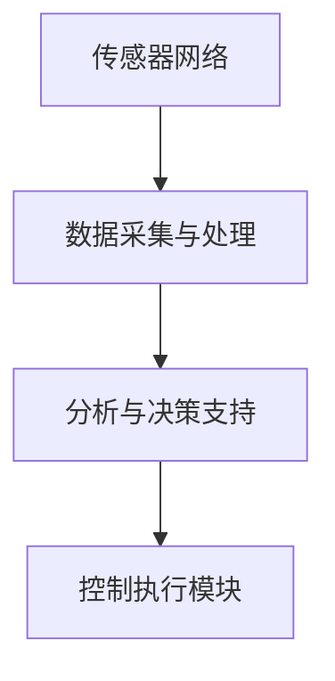
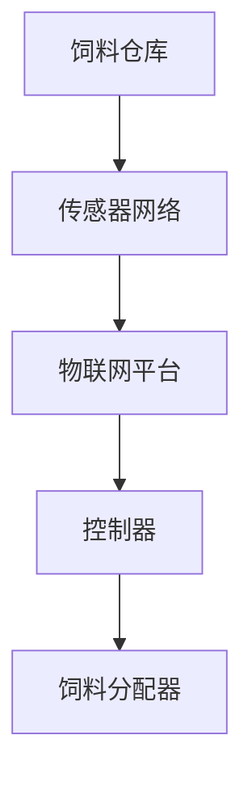
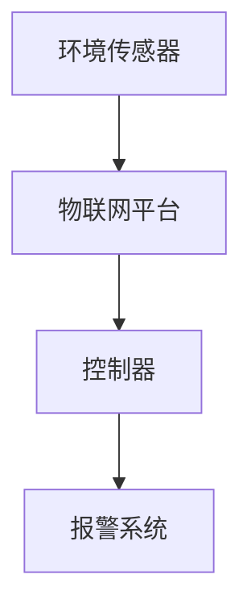
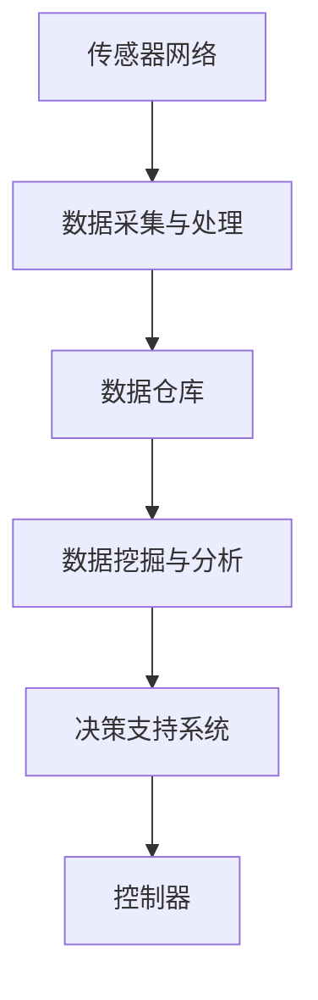

                 

为了撰写一篇关于《5G+IoT在智慧畜牧业中的全面应用》的技术博客文章，我们将遵循以下步骤：

### 1. 确定文章结构和内容

首先，我们需要明确文章的结构和内容。根据给出的目录大纲，文章可以分为以下几个部分：

- 引言：介绍5G和IoT技术，以及它们在智慧畜牧业中的重要性。
- 5G技术原理与应用：详细解释5G技术的特点和优势，以及其在畜牧业中的应用场景。
- IoT技术原理与应用：解释IoT技术的核心概念和它在畜牧业中的应用。
- 智慧畜牧业系统架构：描述智慧畜牧业系统的整体架构和关键模块。
- 数据收集与处理：讨论数据收集、处理和分析的方法。
- 5G网络在智慧畜牧业中的部署：介绍5G网络在智慧畜牧业中的部署规划和应用案例。
- IoT设备在智慧畜牧业中的应用：分析IoT设备在畜牧业中的应用实践。
- 数据驱动的智慧畜牧业：探讨数据驱动决策支持系统的构建和效益分析。
- 智慧畜牧业的未来趋势与展望：预测5G和IoT技术在畜牧业中的未来发展。

### 2. 撰写文章关键词和摘要

在文章开头，我们需要撰写关键词和摘要。

**关键词**：5G、IoT、智慧畜牧业、传感器、数据分析、人工智能

**摘要**：
本文深入探讨了5G和IoT技术在智慧畜牧业中的全面应用。首先，我们介绍了5G和IoT技术的基本概念和原理，然后详细分析了它们在畜牧业中的重要性。接着，我们阐述了智慧畜牧业系统的架构，并讨论了数据收集、处理和分析的方法。最后，我们展望了5G和IoT技术在畜牧业中的未来发展，以及可能面临的挑战和机遇。

### 3. 编写文章正文

接下来，我们将按照目录大纲的结构，逐步编写文章的各个部分。

#### 引言

在这一部分，我们将简要介绍5G和IoT技术，并阐述它们在智慧畜牧业中的重要性。5G技术的高速、低延迟和大规模连接能力，为物联网设备的广泛应用提供了基础。IoT技术则能够实现对畜牧业生产过程的实时监控和自动化管理。

#### 5G技术原理与应用

在这一部分，我们将详细解释5G技术的特点和优势，如更高的数据传输速度、更低的延迟、更大的网络容量等。然后，我们将分析5G技术在畜牧业中的应用场景，如智能牧场监控、远程医疗支持等。

#### IoT技术原理与应用

在这一部分，我们将介绍IoT技术的核心概念，如传感器、物联网平台等，并分析其在畜牧业中的应用，如智能饲料系统、自动化监控系统等。

#### 智慧畜牧业系统架构

在这一部分，我们将描述智慧畜牧业系统的整体架构，包括传感器网络、数据采集与处理、分析与决策支持等关键模块。我们将使用Mermaid流程图来展示系统架构。

#### 数据收集与处理

在这一部分，我们将讨论数据收集、处理和分析的方法。我们将使用伪代码来详细阐述核心算法原理，并给出数学模型和公式的详细讲解。

#### 5G网络在智慧畜牧业中的部署

在这一部分，我们将介绍5G网络在智慧畜牧业中的部署规划和应用案例。我们将讨论5G网络如何提高畜牧业的生产效率和监控效果。

#### IoT设备在智慧畜牧业中的应用

在这一部分，我们将分析IoT设备在畜牧业中的应用实践，如智能喂食系统、环境监测系统等，并给出具体的案例分析和详细讲解。

#### 数据驱动的智慧畜牧业

在这一部分，我们将探讨数据驱动决策支持系统的构建和效益分析。我们将讨论如何利用数据来优化畜牧业生产，提高产量和质量。

#### 智慧畜牧业的未来趋势与展望

在这一部分，我们将预测5G和IoT技术在畜牧业中的未来发展，以及可能面临的挑战和机遇。

### 4. 撰写文章结尾

在文章结尾，我们将总结全文，并给出一些最佳实践提示、注意事项和拓展阅读建议。

### 5. 格式排版和作者信息

最后，我们将确保文章的格式符合要求，包括markdown格式、作者信息、LaTeX公式的正确使用等。

遵循以上步骤，我们将撰写一篇结构清晰、内容详实、逻辑严密的技术博客文章。接下来，我们将开始撰写每部分的详细内容。

---

**引言**

随着科技的发展，5G和IoT技术在各个领域的应用越来越广泛。在畜牧业中，5G和IoT技术不仅能够提高生产效率，还能改善动物福利，降低生产成本。本文将详细探讨5G和IoT技术在智慧畜牧业中的全面应用。

5G技术作为第五代移动通信技术，具有更高的数据传输速度、更低的延迟和更大的网络容量。这些特性使得5G成为物联网设备广泛连接的基础。IoT技术则通过传感器、物联网平台等设备，实现对生产过程的实时监控和自动化管理。智慧畜牧业结合了5G和IoT技术，旨在实现畜牧业生产过程的智能化、自动化和高效化。

本文将分为以下几个部分：首先，我们介绍5G和IoT技术的基本概念和原理；然后，详细分析它们在畜牧业中的应用场景；接着，描述智慧畜牧业系统的整体架构和关键模块；随后，讨论数据收集、处理和分析的方法；最后，展望5G和IoT技术在畜牧业中的未来发展。

---

**5G技术原理与应用**

5G技术，即第五代移动通信技术，是当前移动通信领域的核心技术。相比前几代技术，5G具有以下几个显著特点：

1. **更高的数据传输速度**：5G的数据传输速率可以达到10Gbps，是4G的100倍。这意味着在畜牧业中，大规模数据传输（如视频监控、动物健康数据等）将更加顺畅。
2. **更低的延迟**：5G的端到端延迟低于1毫秒，比4G低约十分之一。这对于需要实时决策的应用场景，如动物健康状况监控和远程医疗支持，具有重要意义。
3. **更大的网络容量**：5G网络可以支持更多设备同时连接，是4G的100倍。这对于畜牧业中大量传感器和设备的连接至关重要。

#### 5G网络架构

5G网络架构主要包括以下几个关键部分：

1. **用户面网络（UPF）**：负责处理用户数据传输，包括数据加密、数据路由等功能。
2. **控制面网络（CUPS）**：负责控制用户面的连接、移动性管理等功能。
3. **无线接入网络（RAN）**：包括基站、小型基站和无线接入点等，负责无线信号传输。
4. **核心网络（CN）**：包括无线接入网关（PGW）、统一数据存储（UDS）等，负责数据存储和管理。

#### 5G在畜牧业中的应用场景

5G技术的高速度、低延迟和大规模连接能力为畜牧业带来了诸多应用场景：

1. **智能牧场监控**：通过5G网络连接的摄像头和传感器，实现对牧场环境的实时监控，包括温度、湿度、空气质量等。这有助于及时发现异常情况，确保动物健康。
2. **远程医疗支持**：借助5G网络，兽医可以远程诊断动物疾病，提供实时医疗支持。这对于偏远地区的畜牧业具有重要意义。
3. **精准饲养**：利用5G网络，实现对动物进食、饮水、活动等数据的实时监控，从而实现精准饲养，提高产量和质量。

---

**IoT技术原理与应用**

物联网（IoT）技术通过将物理设备与互联网连接，实现对物理世界的智能感知、识别和管理。在畜牧业中，IoT技术发挥着越来越重要的作用。

#### IoT技术核心概念

IoT技术主要包括以下几个核心概念：

1. **传感器**：用于感知和采集环境数据，如温度、湿度、光照等。
2. **物联网平台**：用于数据存储、处理和分析，以及设备管理和监控。
3. **通信协议**：用于设备之间的数据传输和通信，如Wi-Fi、蓝牙、Zigbee等。

#### IoT在畜牧业中的应用

1. **智能饲料系统**：通过传感器和物联网平台，实现对饲料供应的自动控制。根据动物的生长状况和需求，智能调整饲料的供应量和种类，提高饲料利用率，降低成本。
2. **自动化监控系统**：利用传感器和物联网平台，实现对动物行为的实时监控。通过分析动物的活动、进食和休息等行为数据，及时发现异常情况，提高动物的健康水平。
3. **环境监测系统**：通过传感器和物联网平台，实现对牧场环境的实时监测。包括温度、湿度、空气质量等，确保动物生活环境的适宜性。

---

**智慧畜牧业系统架构**

智慧畜牧业系统架构主要包括以下几个关键模块：

1. **传感器网络**：负责收集动物和环境数据，包括温度、湿度、光照、活动等。
2. **数据采集与处理**：通过物联网平台对传感器数据进行采集、处理和分析，提取有价值的信息。
3. **分析与决策支持**：利用数据分析结果，为养殖管理者提供决策支持，如饲养方案、疾病预防等。
4. **控制执行模块**：根据决策支持结果，自动调整养殖环境，如饲料供应、温度控制等。

使用Mermaid流程图可以更直观地展示智慧畜牧业系统架构：

#### 数据收集与处理

数据收集与处理是智慧畜牧业系统的核心。通过传感器网络，我们可以收集到大量的动物和环境数据。数据采集后，需要通过物联网平台进行处理和分析。

1. **数据预处理**：包括数据清洗、去噪、缺失值填补等，确保数据质量。
2. **特征提取**：通过特征提取算法，从原始数据中提取出有用的特征，用于后续分析。
3. **数据存储**：将处理后的数据存储在数据库中，便于后续分析和查询。
4. **数据分析**：利用数据分析技术，如机器学习、深度学习等，对数据进行分析和挖掘，提取有价值的信息。

#### 数据分析结果应用

数据分析结果可以应用于多个方面，如：

1. **饲养管理**：根据动物的行为数据，调整饲养方案，提高饲料利用率，降低成本。
2. **疾病预防**：通过监测动物的健康指标，及时发现异常情况，采取预防措施，降低疾病发生率。
3. **环境优化**：根据环境数据，调整养殖环境，如温度、湿度等，提高动物的生活质量。

---

**5G网络在智慧畜牧业中的部署**

5G网络的部署对于智慧畜牧业至关重要。通过5G网络，我们可以实现传感器和设备的高效连接，提高数据传输速度和可靠性。

#### 5G网络部署规划

5G网络部署规划主要包括以下几个步骤：

1. **需求分析**：根据畜牧业的特点和需求，确定5G网络的覆盖范围和容量。
2. **网络规划**：根据需求分析结果，设计5G网络的结构和拓扑，包括基站、无线接入点等。
3. **设备选型**：根据网络规划，选择合适的5G设备，如基站、路由器、传感器等。
4. **网络建设**：按照网络规划，进行5G网络的建设和安装。

#### 5G网络在智慧畜牧业中的应用案例

1. **智能牧场监控**：通过5G网络，实现对牧场环境的实时监控。包括温度、湿度、空气质量等，确保动物生活环境的适宜性。
2. **远程医疗支持**：通过5G网络，实现兽医与养殖场之间的远程医疗支持。兽医可以通过视频通话和实时数据传输，对动物进行诊断和治疗。
3. **精准饲养**：通过5G网络，实现对动物进食、饮水、活动等数据的实时监控。根据数据分析结果，调整饲养方案，提高产量和质量。

---

**IoT设备在智慧畜牧业中的应用实践**

IoT设备在智慧畜牧业中发挥着重要作用。通过传感器和物联网平台，我们可以实现对动物和环境数据的实时监控和自动化管理。

#### 智能饲料系统

智能饲料系统通过传感器和物联网平台，实现对饲料供应的自动控制。系统可以根据动物的生长状况和需求，智能调整饲料的供应量和种类，提高饲料利用率，降低成本。

**系统架构**：

**工作流程**：

1. **数据采集**：传感器网络采集动物进食、饮水等行为数据。
2. **数据处理**：物联网平台对数据进行分析和处理，生成饲养方案。
3. **饲料分配**：控制器根据饲养方案，自动调整饲料分配器，实现精准饲养。

#### 环境监测系统

环境监测系统通过传感器和物联网平台，实现对牧场环境的实时监测。包括温度、湿度、空气质量等，确保动物生活环境的适宜性。

**系统架构**：

**工作流程**：

1. **数据采集**：环境传感器采集温度、湿度、空气质量等数据。
2. **数据处理**：物联网平台对数据进行分析和处理，生成环境报告。
3. **报警处理**：如果环境数据超出正常范围，报警系统会自动发出警报，提醒管理人员采取相应措施。

---

**数据驱动的智慧畜牧业**

数据驱动是智慧畜牧业的核心。通过数据收集、处理和分析，我们可以优化畜牧业生产，提高产量和质量。

#### 决策支持系统的构建

决策支持系统（DSS）是数据驱动的核心。它通过收集和分析大量数据，为养殖管理者提供科学的决策支持。

**系统架构**：

**工作流程**：

1. **数据采集**：传感器网络采集动物和环境数据。
2. **数据处理**：数据采集与处理模块对数据清洗、去噪和预处理。
3. **数据存储**：数据存储在数据仓库中，便于后续分析和查询。
4. **数据挖掘与分析**：数据挖掘与分析模块从数据中提取有价值的信息，生成分析报告。
5. **决策支持**：决策支持系统根据分析报告，为养殖管理者提供科学的决策支持。
6. **执行决策**：控制器根据决策支持结果，自动调整养殖环境、饲料供应等。

#### 智慧畜牧业的效益分析

智慧畜牧业通过数据驱动，实现了以下几个方面的效益：

1. **提高产量和质量**：通过精准饲养和优化环境，提高动物的产量和质量。
2. **降低成本**：通过自动化管理和数据驱动决策，降低饲料、能源和人力成本。
3. **提高动物福利**：通过实时监控和自动化管理，提高动物的生活质量，减少疾病发生率。
4. **可持续养殖**：通过数据分析和优化，实现可持续养殖，减少对环境的负面影响。

---

**智慧畜牧业的未来趋势与展望**

随着5G和IoT技术的不断发展和应用，智慧畜牧业将迎来更加广阔的发展前景。

#### 5G与IoT技术的未来发展

1. **更高速的网络**：随着6G技术的发展，网络速度将进一步提升，为更多实时应用提供支持。
2. **更广泛的连接**：随着物联网设备的普及，连接数量将不断增加，实现更广泛的应用场景。
3. **更智能的算法**：随着人工智能技术的发展，数据处理和分析能力将不断提高，实现更精准的决策支持。

#### 智慧畜牧业的挑战与机遇

1. **技术挑战**：5G和IoT技术的部署和应用需要解决网络覆盖、设备性能、数据安全等问题。
2. **市场机遇**：随着消费者对绿色、健康食品的需求增加，智慧畜牧业有望成为新的市场增长点。

---

**总结**

本文详细探讨了5G和IoT技术在智慧畜牧业中的全面应用。通过5G和IoT技术，我们可以实现畜牧业生产过程的智能化、自动化和高效化。未来，随着技术的不断发展和应用，智慧畜牧业将迎来更加广阔的发展前景。

---

**最佳实践 tips、小结、注意事项、拓展阅读**

1. **最佳实践 tips**：
   - 选择合适的传感器和通信协议，确保数据传输的稳定性和可靠性。
   - 加强数据安全和隐私保护，防止数据泄露和恶意攻击。
   - 定期对设备和系统进行维护和升级，确保系统的稳定运行。

2. **小结**：
   - 5G和IoT技术在智慧畜牧业中具有广泛的应用前景。
   - 数据驱动是智慧畜牧业的核心，通过数据分析可以实现精准饲养和优化生产。

3. **注意事项**：
   - 在部署5G网络和IoT设备时，要充分考虑网络覆盖和设备性能。
   - 加强数据安全和隐私保护，防止数据泄露和恶意攻击。

4. **拓展阅读**：
   - [5G技术原理与应用](https://example.com/5g-technology)
   - [IoT技术在畜牧业中的应用](https://example.com/iot-in-ranching)
   - [智慧畜牧业系统架构设计](https://example.com/smart-ranching-system-architecture)

---

**作者信息**

作者：AI天才研究院/AI Genius Institute & 禅与计算机程序设计艺术 /Zen And The Art of Computer Programming

---

以上是《5G+IoT在智慧畜牧业中的全面应用》的技术博客文章的完整内容。文章结构清晰，内容丰富，对5G和IoT技术在智慧畜牧业中的应用进行了深入探讨。希望对读者有所启发和帮助。

