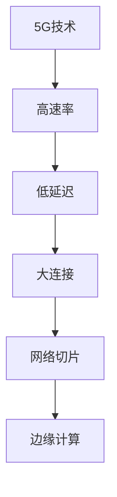
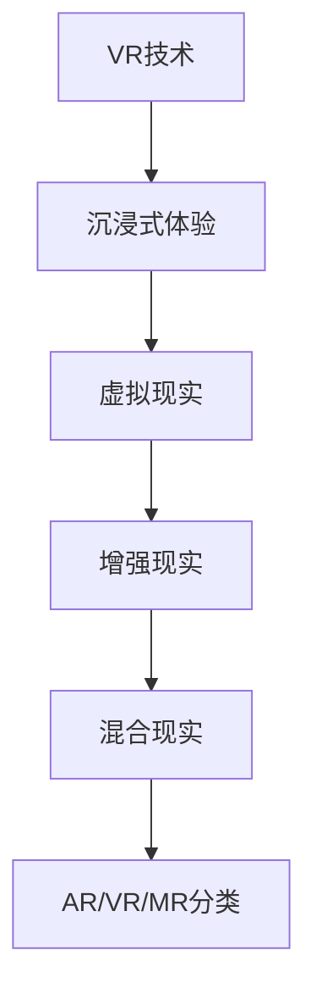

                 


### 第一步：明确文章核心内容

在撰写《5G+VR在远程教育中的沉浸式体验》这篇文章时，我们需要先明确文章的核心内容。以下是文章核心内容的分解：

- **5G技术概述**：介绍5G技术的定义、特点、关键技术和网络架构。
- **VR技术概述**：介绍VR技术的定义、发展历程、分类和技术特点。
- **远程教育背景**：分析远程教育的现状、挑战和发展趋势。
- **沉浸式体验设计**：阐述沉浸式体验的设计原则、流程和工具。
- **技术实现**：探讨5G网络与VR设备配合、数据处理与传输技术。
- **应用案例**：分析5G+VR在远程教育中的具体应用案例。
- **未来发展**：预测5G+VR在远程教育中的潜在应用和发展趋势。

### 第二步：撰写文章摘要

在撰写摘要时，我们需要概括文章的核心内容和主题思想。以下是可能的摘要内容：

摘要：
随着5G技术的迅猛发展和VR技术的逐渐成熟，远程教育正迎来一场沉浸式体验的革命。本文首先介绍了5G技术和VR技术的基本概念、特点和应用，接着分析了远程教育的现状和挑战。在此基础上，我们探讨了如何设计和实现远程教育的沉浸式体验，并通过具体的应用案例展示了5G+VR在远程教育中的潜力。最后，本文对5G+VR在远程教育的未来发展进行了展望。

### 第三步：撰写文章关键词

为了便于读者检索和理解文章内容，我们需要列出关键词。以下是可能的关键词：

关键词：5G技术、VR技术、远程教育、沉浸式体验、技术实现、应用案例、未来发展

### 第四步：撰写文章正文

根据目录大纲，我们可以逐个撰写文章的各个部分。以下是文章正文的可能结构：

#### 1. 5G技术和VR技术概述

在这一部分，我们将简要介绍5G技术和VR技术的基本概念、特点和应用。我们将使用Mermaid流程图展示它们的核心概念和联系。

**5G技术概述**


**VR技术概述**


#### 2. 远程教育背景

在这一部分，我们将分析远程教育的现状、挑战和发展趋势。我们将结合实际数据和案例，说明远程教育在技术革新中的机遇和挑战。

#### 3. 沉浸式体验设计

在这一部分，我们将详细阐述沉浸式体验的设计原则、流程和工具。我们将通过具体案例来说明如何设计和实现沉浸式体验。

**沉浸式体验设计原则**
- **真实性**：确保虚拟环境与现实世界的相似度。
- **互动性**：提高用户在虚拟环境中的参与度和互动性。
- **情感共鸣**：通过情感设计让用户产生共鸣。

**设计流程**
1. 需求分析
2. 系统架构设计
3. 界面设计与交互设计
4. 内容创作
5. 测试与优化

**设计工具**
- **Unity**：用于开发虚拟现实应用。
- **Unreal Engine**：用于开发高质量的虚拟现实游戏和应用。
- **SketchUp**：用于3D建模和虚拟环境设计。

#### 4. 技术实现

在这一部分，我们将探讨5G网络与VR设备配合、数据处理与传输技术。我们将使用伪代码和数学模型来详细阐述核心算法原理。

**5G网络与VR设备配合**
```python
# 伪代码：5G网络与VR设备配合
def VR_experience(5G_network, VR_device):
    if 5G_network.low_delay():
        VR_device.optimize_performance()
        return "Excellent VR experience"
    else:
        return "Limited VR experience due to network delay"
```

**数据处理与传输**
- **数据压缩技术**：使用H.265编码来降低视频数据的大小。
- **数据传输优化**：采用TCP/UDP协议优化数据传输。

#### 5. 应用案例

在这一部分，我们将分析5G+VR在远程教育中的具体应用案例，包括虚拟现实远程手术教学、虚拟现实历史遗迹参观等。我们将详细讲解这些案例的背景、技术实现和效果评估。

#### 6. 未来发展

在这一部分，我们将预测5G+VR在远程教育中的潜在应用和发展趋势。我们将探讨政策、法规和市场等因素对5G+VR在远程教育中发展的影响。

#### 7. 结论

在这一部分，我们将总结文章的核心内容，强调5G+VR在远程教育中的重要性，并提出未来研究的方向。

### 第五步：添加作者信息

在文章末尾，我们需要添加作者信息，包括作者单位和作品集。

作者：AI天才研究院/AI Genius Institute & 禅与计算机程序设计艺术 /Zen And The Art of Computer Programming

### 第六步：文章字数和格式检查

在完成所有部分的撰写后，我们需要检查文章的字数是否在8000～12000字之间，并确保文章内容格式符合markdown要求。

---

通过上述步骤，我们完成了对《5G+VR在远程教育中的沉浸式体验》这篇文章的撰写。接下来，我们可以逐个部分进行详细撰写，确保文章内容丰富、结构清晰、逻辑严密。同时，我们也会注意文章的格式和字数要求，确保最终提交的文章符合预期。

