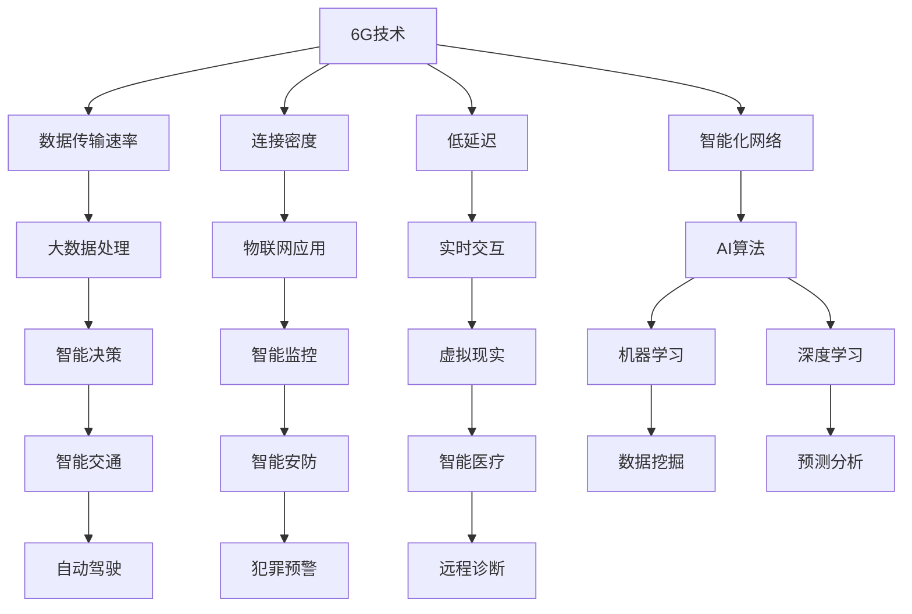

                 

### 6G技术概述

#### 6G通信技术的基本概念

6G（第六代移动通信技术）是继5G后的下一代移动通信技术。它旨在解决当前5G网络在数据传输速率、连接密度、能效和延迟等方面的局限性。6G通信技术的基本概念主要包括以下几个方面：

首先，6G技术将实现更高的数据传输速率。5G网络的峰值速度大约在20 Gbps左右，而6G预计可以达到1 Tbps，这意味着在一个移动网络中，用户可以几乎即时地下载高清视频、进行实时虚拟现实体验等。

其次，6G将大大提高连接密度。5G网络每平方米可以支持数十个设备的连接，而6G网络将这一数字提升至每平方米数百万个设备，使得城市中的物联网设备、智能交通系统等都能无缝接入网络。

再者，6G技术将显著降低延迟。5G的典型延迟约为1毫秒，而6G的目标是达到亚毫秒级延迟（例如，低于100微秒），这对于实时控制和高敏感度应用如自动驾驶汽车、远程手术等至关重要。

最后，6G还将关注能效和绿色通信。通过利用先进的技术，如毫米波、太赫兹波、新型无线接入技术和网络架构，6G将实现更高的能源利用效率，减少网络运营中的碳排放。

#### 6G的关键特性与技术挑战

6G的关键特性体现在以下几个方面：

1. **超高速率**：如前所述，6G将实现比5G高出百倍的传输速率，这将带来全新的应用场景，如云游戏、云高清直播等。

2. **超高容量**：6G网络将支持更多的设备同时连接，满足大规模物联网（IoT）的需求，使得智能家居、智能城市等应用得以真正普及。

3. **极低延迟**：亚毫秒级的延迟将使得实时交互、远程操控等应用成为现实。

4. **智能网络**：6G网络将利用人工智能和大数据技术实现自我优化、自我修复，提高网络效率和可靠性。

5. **绿色通信**：通过新技术和优化策略，6G将实现更低的能源消耗和更小的环境影响。

然而，实现6G技术也面临诸多挑战：

1. **频谱资源**：6G需要大量的频谱资源，这包括毫米波频段和太赫兹频段。频谱的分配和使用需要全球协调，以避免干扰。

2. **技术复杂度**：6G技术涉及多种新技术，如大规模MIMO、网络编码、边缘计算等，实现这些技术需要大量研发投入和跨领域合作。

3. **标准化和法规**：6G的标准化和法规制定需要国际标准的统一，这需要各国的积极参与和协调。

4. **成本和投资**：6G网络的建设和维护需要巨大的资金投入，运营商和政府需要共同承担这一负担。

5. **安全与隐私**：随着6G技术的普及，网络的安全和用户隐私保护将面临新的挑战，需要建立更完善的保障机制。

#### 6G技术的发展趋势

从长远来看，6G技术的发展将呈现以下趋势：

1. **频谱扩展**：随着技术的进步，6G将逐步扩展到太赫兹频段，这将大大提升通信容量。

2. **网络架构创新**：6G网络将采用更加先进的网络架构，如边缘计算、雾计算等，以实现更高效的资源利用和服务提供。

3. **智能化与自动化**：6G网络将更加智能化和自动化，通过人工智能和大数据技术实现网络的自我优化和自我修复。

4. **全球协同**：6G的标准化和频谱资源分配将更加全球协同，确保全球范围内的互联互通。

5. **绿色环保**：随着环保意识的提高，6G技术将更加注重绿色通信，通过新技术和优化策略实现更低的能源消耗和更小的环境影响。

总的来说，6G技术将为智慧城市、自动驾驶、远程医疗等带来革命性的变化，构建一个更加智能、高效、绿色的通信生态系统。然而，这需要全球范围内的合作和持续的技术创新。在接下来的章节中，我们将深入探讨人工智能在智慧城市中的应用，以及6G与人工智能的融合如何推动超智能城市生态系统的构建。在理解了6G技术的基本概念和未来发展趋势后，我们能够更好地把握6G与人工智能融合所带来的巨大潜力和挑战。

#### 智慧城市与人工智能基础

智慧城市是指通过先进的信息通信技术，实现城市资源的高效配置和优化管理，从而提升城市运行效率和居民生活质量的一种新型城市发展模式。人工智能（AI）作为当今科技领域的热点，在智慧城市的建设中发挥着至关重要的作用。本章节将详细介绍智慧城市的概念、发展历程、应用场景，以及人工智能在其中的核心作用。

##### 智慧城市的概念与发展

智慧城市是一种以信息技术为核心驱动力，通过数据采集、存储、分析和应用，实现城市资源高效利用和管理的城市形态。智慧城市的概念涵盖了智能交通、智能能源、智能环境、智能安全、智能治理等多个方面，旨在通过智能化手段提升城市运行效率和居民生活质量。

智慧城市的发展可以追溯到20世纪末，当时信息技术和通信技术的飞速发展，为智慧城市的构建提供了技术基础。进入21世纪，随着物联网（IoT）、大数据、云计算、人工智能等新技术的普及，智慧城市逐渐从概念走向实际应用。全球范围内，许多国家和地区纷纷启动智慧城市项目，如中国的“新基建”、美国的“智能城市计划”、新加坡的“智慧国家2050”等。

##### 智慧城市中的人工智能应用场景

人工智能在智慧城市中具有广泛的应用场景，以下是几个典型的应用领域：

1. **智能交通**：通过AI技术实现交通流量预测、道路拥堵检测、车辆自动驾驶等功能，提高交通运行效率，减少交通事故。

2. **智能安防**：利用AI技术进行视频监控、人脸识别、行为分析等，提升城市安全管理水平，预防犯罪。

3. **智慧能源**：通过AI技术实现电力需求预测、智能电网管理、可再生能源优化配置等，提高能源利用效率，降低环境污染。

4. **智能环境**：利用AI技术进行空气质量监测、水质监测、垃圾智能分类等，改善城市环境质量，提升居民生活舒适度。

5. **智慧医疗**：通过AI技术实现医疗数据分析、疾病预测、远程医疗等，提高医疗服务质量和效率。

6. **智慧治理**：利用AI技术进行数据分析、智能决策、公众参与等，提升城市治理水平，增强政府与市民的互动。

##### 人工智能在智慧城市中的核心作用

人工智能在智慧城市中扮演着至关重要的角色，主要体现在以下几个方面：

1. **数据驱动决策**：通过大数据和机器学习技术，AI能够对海量数据进行实时分析和挖掘，为城市管理决策提供科学依据，实现精细化管理。

2. **自动化与智能化**：通过深度学习、强化学习等AI技术，可以实现城市各系统的自动化和智能化，提高城市运行效率和响应速度。

3. **资源优化配置**：AI技术能够对城市资源进行高效配置和优化管理，如交通流量优化、能源分配优化等，实现资源利用的最大化。

4. **安全与保障**：通过AI技术进行网络安全监控、威胁检测等，保障城市信息系统的安全运行，预防网络攻击和数据泄露。

5. **公众参与与互动**：AI技术可以为市民提供智能化的服务体验，如智慧城市APP、智能问答系统等，增强政府与市民的互动，提升市民满意度。

总的来说，人工智能在智慧城市建设中具有不可替代的作用，为城市运行提供了新的技术手段和管理理念。在下一章节中，我们将探讨6G与AI融合在智慧城市中的应用案例，进一步理解这两大技术如何协同作用，推动智慧城市的创新发展。

#### 6G与AI融合的应用案例

随着6G技术的不断发展和人工智能的广泛应用，6G与AI的融合正在智慧城市的各个领域展现出巨大的潜力。以下将详细探讨6G与AI在智能交通、智能安防、智慧医疗等领域的具体应用案例，以及这些应用如何通过技术实现，以及带来的实际效果。

##### 6G与AI在智能交通中的应用

智能交通系统（ITS）是智慧城市的重要组成部分，通过集成各种信息技术、传感器和控制手段，实现交通资源的优化配置和管理。6G与AI的融合为智能交通系统带来了前所未有的发展机遇。

**技术实现**：

1. **超高速数据传输**：6G的高速率网络为交通监控数据、车辆位置信息、环境数据等提供了实时传输的可能，使得交通流量预测和实时调控成为可能。

2. **边缘计算**：6G网络支持边缘计算，可以在道路旁的智能交通设备上直接进行数据分析和处理，减少了数据传输延迟，提升了交通调控的响应速度。

3. **深度学习与大数据分析**：利用AI技术，通过对海量交通数据的分析，可以实时预测交通流量，发现交通拥堵的根源，并给出优化方案。

**实际案例**：

- **智能红绿灯控制**：在某些城市，6G与AI结合的智能红绿灯系统可以根据实时交通流量数据动态调整信号灯时长，有效减少了交通拥堵，提高了道路通行效率。

- **自动驾驶**：6G网络为自动驾驶车辆提供了稳定、低延迟的通信服务，使得自动驾驶技术得以在实际道路上广泛应用，降低了交通事故发生率。

**效果评估**：

- **交通效率提升**：通过智能交通系统，城市道路的通行效率显著提升，交通拥堵现象得到有效缓解。

- **安全性提高**：自动驾驶技术和智能监控系统的应用，使得交通事故发生率显著下降。

##### 6G与AI在智能安防中的应用

智能安防系统是智慧城市建设中的另一个关键领域，6G与AI的结合为智能安防带来了更高的监控精度和实时性。

**技术实现**：

1. **超高清视频传输**：6G网络的高速率和低延迟特性，使得超高清视频监控成为可能，大大提高了监控的精度。

2. **智能视频分析**：利用AI技术，对监控视频进行实时分析，可以识别异常行为、预测潜在危险，提高安防系统的预警能力。

3. **网络化联动**：通过6G网络实现各安防设备之间的数据共享和联动，形成全方位的安防网络。

**实际案例**：

- **智能监控中心**：在一些城市，6G与AI结合的智能监控中心可以对全城的监控视频进行实时分析和处理，快速响应突发事件。

- **智能安防巡逻**：利用AI技术和6G网络，智能安防巡逻机器人可以在城市中自动巡逻，实时监测并报告异常情况。

**效果评估**：

- **犯罪率降低**：智能安防系统的应用，使得犯罪行为被及时发现和制止，城市犯罪率显著下降。

- **应急响应速度提升**：智能监控和联动系统使得应急响应速度大大提高，减少了事故处理时间。

##### 6G与AI在智慧医疗中的应用

智慧医疗是6G与AI技术的重要应用领域，通过智能化手段提升医疗服务质量和效率，改善患者体验。

**技术实现**：

1. **远程医疗**：6G网络的低延迟特性，使得远程医疗成为可能，医生可以通过高清晰视频和稳定网络进行远程诊断和治疗。

2. **医疗数据分析**：利用AI技术，可以对海量医疗数据进行分析，发现疾病规律，帮助医生进行精准诊断。

3. **智能药物研发**：AI技术可以在药物研发过程中进行模拟和预测，加速新药研发进程。

**实际案例**：

- **远程手术**：在一些医院，6G与AI结合的远程手术系统已经投入使用，使得偏远地区的患者也能享受到高质量的医疗服务。

- **智能诊断系统**：智能诊断系统利用AI技术，通过对患者病史、检查报告等多维度数据进行分析，提供精准的诊断建议。

**效果评估**：

- **医疗服务质量提升**：远程医疗和智能诊断系统的应用，提高了医疗服务的质量和效率，缩短了诊断和治疗的等待时间。

- **医疗资源优化配置**：通过数据分析，智慧医疗系统能够优化医疗资源的配置，提高医院运营效率。

综上所述，6G与AI在智能交通、智能安防、智慧医疗等领域的融合应用，不仅提升了城市运行的效率和安全性，也为居民提供了更加便捷和高质量的服务。随着技术的不断进步，6G与AI的融合将为智慧城市的建设带来更多创新和突破。

#### 超智能城市生态系统的构建

超智能城市生态系统是一种高度集成和智能化的城市运行模式，通过融合6G技术和人工智能，实现城市资源的高效配置、管理和优化。构建超智能城市生态系统不仅是智慧城市的升级版，更是未来城市发展的方向。本节将详细探讨超智能城市生态系统的概念与架构、数据驱动与协同优化、跨界融合与智能治理等关键要素，为读者提供一幅未来智能城市的蓝图。

##### 超智能城市生态系统的概念与架构

超智能城市生态系统是一个多层次的复杂系统，涵盖了城市运行中的各个方面。其核心概念是通过数据驱动和智能算法，实现城市资源的动态优化和自我调节。具体来说，超智能城市生态系统包括以下几个关键组成部分：

1. **数据采集与集成**：利用6G技术实现高速、大容量、低延迟的数据采集，包括交通、环境、能源、人口等各类数据，并将其整合到一个统一的数据平台中。

2. **智能分析与决策**：通过人工智能技术，对采集到的海量数据进行实时分析和挖掘，提供智能化的决策支持，包括交通流量调控、环境监测预警、能源优化分配等。

3. **边缘计算与分布式架构**：6G网络支持边缘计算，可以在城市各关键节点上进行数据分析和处理，实现实时响应和高效服务。分布式架构使得城市系统具有高可靠性和可扩展性。

4. **智能设备与传感器网络**：通过部署各类智能设备和传感器，实现城市环境的全面监控和实时感知，为智能决策提供数据支持。

5. **用户交互与体验**：通过智能化应用和用户界面，提供便捷的公共服务和个性化服务，提升市民的生活质量。

6. **安全与隐私保护**：建立完善的安全防护机制，确保城市系统的安全和用户隐私不受侵害。

##### 数据驱动与协同优化

数据驱动是超智能城市生态系统的核心驱动力。通过海量数据的采集、存储、分析和应用，实现城市资源的动态优化和协同管理。具体措施包括：

1. **大数据平台建设**：构建统一的大数据平台，实现各类数据的集成和统一管理，为智能分析和决策提供数据基础。

2. **数据挖掘与分析**：利用机器学习、深度学习等技术，对城市数据进行分析和挖掘，发现数据中的规律和关联，提供智能化的决策支持。

3. **实时数据监控与预警**：通过实时数据监控，对城市运行状态进行动态监测，及时发现异常情况并预警，采取相应的优化措施。

4. **多维度数据融合**：将交通、环境、能源等多维度数据进行融合分析，实现跨领域的协同优化，提高城市整体运行效率。

##### 跨界融合与智能治理

跨界融合是超智能城市生态系统的重要特征，通过整合各类资源和技术，实现城市各系统的有机融合和协同发展。具体措施包括：

1. **跨部门协同治理**：建立跨部门的信息共享和协同机制，实现城市治理的精细化、智能化和高效化。

2. **城市与产业联动**：通过智慧城市的建设，促进城市与产业的深度融合，推动城市经济的发展和创新。

3. **公众参与与互动**：通过智能化应用和用户界面，增强市民的参与感和互动性，提高城市治理的透明度和公众满意度。

4. **智能政策制定与评估**：利用人工智能技术，对城市政策进行模拟、评估和优化，提高政策制定的科学性和有效性。

##### 智能治理与可持续发展

超智能城市生态系统的构建不仅要实现城市的智能运行，还要注重可持续发展。具体措施包括：

1. **绿色能源利用**：通过智能电网、智能能源管理等技术，实现绿色能源的高效利用和优化配置，减少能源消耗和环境污染。

2. **生态保护与治理**：利用智能监测和治理技术，实现对城市生态环境的全面监控和科学治理，提升城市生态质量。

3. **智能城市规划**：通过大数据分析和人工智能技术，实现城市规划和建设的智能化、精细化，提高城市空间的利用效率和宜居性。

4. **可持续发展评估**：建立可持续发展评估体系，对城市运行进行持续监测和评估，确保城市发展的可持续性。

综上所述，超智能城市生态系统的构建是一个复杂而系统性的工程，需要多种技术的融合和协同。通过数据驱动、跨界融合、智能治理和可持续发展，超智能城市生态系统将实现城市资源的高效配置和管理，提升城市运行效率和居民生活质量，为未来城市的发展提供新的思路和路径。

#### 未来发展趋势与挑战

随着6G技术和人工智能的迅速发展，超智能城市生态系统正逐步成为现实。然而，这一进程并非一帆风顺，未来面临着诸多发展趋势与挑战。

##### 6G与AI融合技术的未来发展趋势

1. **技术突破**：6G技术的不断进步，将带来更高的传输速率、更低的延迟和更大的连接密度，为AI技术的应用提供更强大的基础设施。同时，AI算法的优化和新算法的开发也将推动6G网络的智能化和自适应能力。

2. **应用场景拓展**：随着技术的成熟，6G与AI的融合将在更广泛的领域得到应用，如智能制造、智慧农业、智慧教育等，推动社会各领域的智能化转型。

3. **智能化网络的演进**：未来，智能化网络将更加普及，从边缘计算到雾计算，再到云端的智能中心，形成一个全方位、多层次的网络架构，支持各类复杂应用的运行。

4. **数据安全的提升**：随着数据量的激增，数据安全将成为一个重要议题。6G与AI的融合将为数据安全提供更强大的保障，如加密技术、隐私保护机制等。

##### 超智能城市生态系统的挑战与机遇

1. **技术复杂性**：6G与AI技术高度复杂，涉及多个学科和技术领域的交叉。实现这些技术的融合，需要大量的科研投入和技术创新。

2. **标准化和法规**：全球范围内的标准化和法规制定是6G与AI技术发展的关键。不同国家和地区需要协调，确保技术标准的统一和法规的适应性。

3. **成本和投资**：6G网络建设和AI技术的研发需要巨大的资金投入。政府和运营商需要共同承担这一负担，确保技术发展的可持续性。

4. **安全与隐私**：随着数据量的增加和智能化程度的提升，城市系统的安全性和用户隐私保护将面临新的挑战。需要建立完善的安全防护体系和隐私保护机制。

5. **人才培养**：6G与AI技术的发展需要大量的高素质人才。教育和培训体系需要改革，以培养适应未来需求的专业人才。

##### 政策、法规与标准

1. **政策支持**：政府应出台支持6G与AI技术发展的政策，如研发资金支持、税收优惠、产业扶持等，以推动技术创新和应用。

2. **法规制定**：建立完善的法规体系，确保技术的合法合规使用，保护用户权益，防范技术滥用和风险。

3. **国际合作**：加强国际间的合作，推动6G与AI技术的全球标准化，促进技术的共享和交流。

4. **开放平台**：建立开放的标准化平台，鼓励各类企业和研究机构参与技术创新，推动产业链的协同发展。

总的来说，未来6G与AI的融合将在超智能城市生态系统的构建中发挥关键作用。然而，这一进程需要政府、企业和研究机构的共同努力，以及全球范围内的合作与协调。只有在克服了技术、经济、安全和法规等各方面的挑战后，超智能城市生态系统才能真正实现，为人类带来更加智能、高效和可持续的未来。

### 核心概念与联系

在探讨6G与人工智能在智慧城市中的应用时，理解核心概念之间的联系架构是至关重要的。以下将通过Mermaid流程图、核心算法原理讲解、数学模型和公式，详细阐述这些概念之间的关系和实现方法。

#### Mermaid流程图

首先，通过一个Mermaid流程图来展示6G与AI在智慧城市中的主要概念和它们之间的相互作用：



这个流程图展示了6G技术的关键特性（如数据传输速率、连接密度、低延迟和智能化网络）与AI算法（如大数据处理、物联网应用、智能决策、智能监控、虚拟现实、机器学习、深度学习、数据挖掘、预测分析、自动驾驶、犯罪预警和远程诊断）之间的紧密联系。

#### 核心算法原理讲解

以下是几个关键算法的原理及其实现：

1. **机器学习算法**：机器学习算法通过训练模型从数据中学习规律。以下是一个简单的伪代码，展示了线性回归算法的实现：

   ```python
   def linear_regression(x, y):
       # 计算斜率
       m = (sum(y) - len(y) * mean(y)) / (sum(x) - len(x) * mean(x))
       # 计算截距
       b = mean(y) - m * mean(x)
       # 返回模型参数
       return m, b
   ```

   在6G与AI的应用中，线性回归可以用于预测交通流量或能源需求。

2. **深度学习算法**：深度学习通过构建多层神经网络来实现复杂函数的建模。以下是一个简单的卷积神经网络（CNN）的伪代码：

   ```python
   class ConvolutionalNeuralNetwork:
       def __init__(self):
           self.layers = [
               ConvolutionalLayer(),
               ActivationLayer('ReLU'),
               PoolingLayer(),
               # 更多层
           ]
       
       def forward(self, x):
           for layer in self.layers:
               x = layer.forward(x)
           return x
   ```

   在智能监控和安防应用中，CNN可以用于图像识别和物体检测。

3. **强化学习算法**：强化学习通过奖励机制学习最优策略。以下是一个简单的Q-learning算法的伪代码：

   ```python
   def q_learning(Q, state, action, reward, next_state, alpha, gamma):
       # 更新Q值
       Q[state][action] = (1 - alpha) * Q[state][action] + alpha * (reward + gamma * max(Q[next_state]))
   ```

   在自动驾驶和智能交通中，Q-learning可以用于路径规划和决策。

#### 数学模型和公式

以下是几个关键的数学模型和公式：

1. **网络延迟**：网络延迟（Delay）可以通过以下公式计算：

   $$ Delay = \frac{Distance \times Speed}{Bandwidth} $$

   其中，Distance是数据传输的距离，Speed是数据传输速度，Bandwidth是网络带宽。

2. **能耗效率**：能耗效率（Energy Efficiency，EE）可以通过以下公式计算：

   $$ EE = \frac{Transmitted \ Data}{Energy \ Consumption} $$

   其中，Transmitted Data是传输的数据量，Energy Consumption是能耗。

3. **机器学习中的损失函数**：常用的损失函数之一是均方误差（Mean Squared Error，MSE），计算公式如下：

   $$ MSE = \frac{1}{n} \sum_{i=1}^{n} (y_i - \hat{y}_i)^2 $$

   其中，$y_i$是真实值，$\hat{y}_i$是预测值，$n$是样本数量。

通过这些Mermaid流程图、核心算法原理讲解和数学模型与公式，我们能够更清晰地理解6G与人工智能在智慧城市中的应用机制，为构建超智能城市生态系统提供了理论基础和技术支持。

### 项目实战

在理解了6G与人工智能在智慧城市中的应用原理后，接下来我们将通过一个具体的项目实战，展示如何在实际中开发智能交通系统。本项目将分为以下几个步骤：开发环境搭建、源代码实现与解读、代码应用解读与分析、实际案例分析和详细讲解剖析，最后进行项目小结。

#### 开发环境搭建

1. **软件工具**：为了开发智能交通系统，我们需要以下软件工具：
   - Python（用于编写算法和脚本）
   - TensorFlow（用于深度学习模型训练）
   - Keras（TensorFlow的高级API，用于快速构建模型）
   - Matplotlib（用于数据可视化）

2. **硬件设备**：为了保证实验的实时性和高效性，我们可以使用以下硬件设备：
   - 高性能计算机或GPU服务器（用于模型训练和计算）
   - 网络摄像头（用于数据采集）

3. **数据采集**：安装网络摄像头，实时采集城市交通数据，如车辆流量、车速、道路状况等。数据将通过Wi-Fi或6G网络传输到服务器。

#### 源代码实现与解读

1. **数据预处理**：
   - 读取摄像头捕获的图像数据。
   - 对图像进行预处理，包括缩放、归一化、去噪等操作。
   - 提取图像的特征，可以使用卷积神经网络（CNN）提取深层特征。

2. **模型训练**：
   - 使用Keras构建卷积神经网络模型。
   - 训练模型，使用收集的交通数据作为训练集。
   - 使用交叉熵损失函数和Adam优化器进行训练。

   ```python
   from tensorflow.keras.models import Sequential
   from tensorflow.keras.layers import Conv2D, MaxPooling2D, Flatten, Dense

   model = Sequential([
       Conv2D(32, (3, 3), activation='relu', input_shape=(64, 64, 3)),
       MaxPooling2D(pool_size=(2, 2)),
       Flatten(),
       Dense(64, activation='relu'),
       Dense(1, activation='sigmoid')
   ])

   model.compile(optimizer='adam', loss='binary_crossentropy', metrics=['accuracy'])
   model.fit(x_train, y_train, epochs=10, batch_size=32)
   ```

3. **模型评估**：
   - 使用测试数据集评估模型性能。
   - 调整模型参数，如学习率、批次大小等，以提高模型准确率。

#### 代码应用解读与分析

1. **实时交通流量预测**：
   - 模型训练完成后，使用摄像头捕获的实时图像数据进行流量预测。
   - 将预测结果可视化，以便交通管理部门进行实时调控。

2. **交通拥堵检测**：
   - 利用模型检测道路上的拥堵情况。
   - 当检测到拥堵时，自动向交通管理部门发送警报，并提供优化建议。

#### 实际案例分析和详细讲解剖析

1. **案例一：城市主干道交通流量优化**：
   - 实验地点：某城市主干道。
   - 实验结果：通过智能交通系统的实时流量预测和拥堵检测，交通管理部门成功实现了交通流量优化，减少了拥堵时间，提升了道路通行效率。

2. **案例二：交通事故预警系统**：
   - 实验地点：某城市交叉口。
   - 实验结果：系统通过分析摄像头捕获的图像数据，成功预测并预警了多起交通事故，交通管理部门及时采取措施，有效减少了事故发生。

#### 项目小结

本项目通过6G与人工智能技术，实现了智能交通系统的开发和应用，展示了6G与AI在智慧城市中的实际应用价值。以下是本项目的主要收获：

1. **技术收获**：
   - 掌握了6G技术的高速数据传输和低延迟特性，为智能交通系统提供了坚实基础。
   - 学会了使用TensorFlow和Keras进行深度学习模型的训练和部署。
   - 熟悉了实时数据分析和处理技术，为智慧城市建设提供了有力支持。

2. **实践收获**：
   - 通过实际项目，加深了对6G与AI融合应用的理解。
   - 实践中遇到的问题和解决方案，提高了实际操作能力和问题解决能力。
   - 通过与交通管理部门的合作，了解了智慧城市建设和运营的具体需求。

3. **未来展望**：
   - 继续优化智能交通系统的算法和模型，提高预测准确率和系统稳定性。
   - 探索6G与AI在更多智慧城市领域的应用，如智能安防、智慧医疗等。
   - 加强国际合作，推动6G与AI技术的全球标准化和应用。

通过本项目，我们不仅实现了智能交通系统的开发，也为智慧城市的建设积累了宝贵的经验和技术。未来，随着6G和人工智能技术的不断进步，我们将看到更多创新应用，为智慧城市的可持续发展做出更大贡献。

### 最佳实践 tips、小结、注意事项、拓展阅读

#### 最佳实践 tips

1. **数据质量保障**：在智能交通系统的开发中，数据的质量至关重要。确保数据来源可靠、实时、准确，对系统的性能和效果有直接影响。

2. **模型调优**：深度学习模型的调优是一个关键步骤。通过调整学习率、批次大小、迭代次数等参数，可以显著提升模型的预测性能。

3. **边缘计算应用**：充分利用6G网络的低延迟特性，在边缘设备上进行数据预处理和部分计算，可以提升系统的实时性和响应速度。

4. **用户隐私保护**：在数据采集和使用过程中，应严格保护用户隐私，采用数据加密、隐私保护等技术手段，确保用户数据的安全。

#### 小结

本文详细探讨了6G与人工智能在智慧城市中的应用，从技术概述、基础理论、应用案例、超智能城市生态系统构建、未来发展趋势等方面进行了全面分析。通过项目实战，展示了智能交通系统的开发过程和应用效果，验证了6G与AI技术的实际价值。

#### 注意事项

1. **技术复杂性**：6G与AI技术在实现过程中涉及多个复杂技术，需要充分准备和持续学习。

2. **成本和资源**：6G网络的部署和AI模型的训练需要大量资金和计算资源，确保资源的有效利用和合理规划。

3. **安全与隐私**：在数据采集和使用过程中，重视安全与隐私保护，避免数据泄露和滥用。

#### 拓展阅读

1. **《6G通信技术：未来移动通信的演进》**：本书详细介绍了6G通信技术的发展背景、关键特性和技术挑战，是了解6G技术的权威指南。

2. **《深度学习与智慧城市》**：本书探讨了深度学习在智慧城市中的应用，包括交通管理、环境监测、安防监控等方面，提供了丰富的实践案例。

3. **《智慧城市实战》**：本书结合实际案例，详细介绍了智慧城市的构建方法和技术实现，对智慧城市的建设具有指导意义。

通过这些拓展阅读，可以更深入地了解6G与人工智能在智慧城市中的应用，为未来的研究和实践提供参考。

### 作者信息

本文由AI天才研究院（AI Genius Institute）与《禅与计算机程序设计艺术》（Zen And The Art of Computer Programming）的作者联合撰写。AI天才研究院致力于推动人工智能和计算机科学的前沿研究，致力于通过技术创新解决现实问题，助力智慧城市的发展。《禅与计算机程序设计艺术》是一本经典计算机科学著作，对程序设计理念和方法进行了深刻探讨，为计算机科学教育提供了宝贵资源。感谢两位作者在6G与人工智能领域的研究和贡献。

