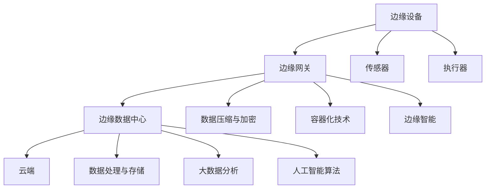

                 

### 引言

随着信息技术的飞速发展，5G和边缘计算逐渐成为推动各行各业数字化转型的关键力量。5G技术以其高带宽、低延迟、高可靠性和大规模连接能力，为物联网（IoT）、自动驾驶、远程医疗等新兴应用提供了坚实的基础。而边缘计算则通过将计算和存储资源部署在靠近数据源的位置，有效缓解了中心化云计算的压力，提高了系统的响应速度和实时性。在这样的背景下，工业互联网作为一种集成信息物理系统的平台，正在通过5G和边缘计算的协同作用，加速工业领域的智能化升级。

本文将围绕5G与边缘计算协同推动工业互联网发展的主题，进行深入探讨。首先，我们将简要介绍5G和边缘计算的基本概念和关键技术。接下来，我们将详细阐述5G与边缘计算的协同作用机制，以及它们在工业互联网中的具体应用场景。随后，通过实际案例，我们将展示5G和边缘计算如何在实际工业场景中发挥作用。最后，本文还将讨论5G与边缘计算在工业互联网中的实施策略、未来趋势以及相关的最佳实践。

通过本文的阅读，读者将能够全面理解5G与边缘计算在工业互联网发展中的重要作用，掌握相关的技术原理和应用方法，为未来的工业智能化转型提供有益的参考。

### 5G技术介绍

#### 5G技术概述

第五代移动通信技术（5G）是当前通信技术发展的重要里程碑。相较于前几代移动通信技术，5G在多个方面实现了质的飞跃，包括更高的数据传输速率、更低的延迟、更高的网络容量和更广泛的覆盖范围。5G技术的推出不仅将带来更快的上网速度，还将为物联网（IoT）、智能制造、自动驾驶等新兴应用提供强大的支持。

5G网络架构是5G技术实现的基础。5G网络架构分为三个层次：无线接入网（RAN）、传输网和核心网。无线接入网负责处理无线信号，传输网负责数据传输，核心网则负责处理用户数据和网络管理。5G网络引入了新型网络架构，包括服务化架构（SA）、网络切片（Network Slicing）和边缘计算等，这些新技术使得5G网络能够满足多样化的应用需求。

#### 5G关键技术

5G技术包含了一系列关键技术和创新，以下是其主要关键技术的概述：

1. **毫米波频段**：5G采用了毫米波频段，这一频段具有更高的带宽，能够提供更高的数据传输速率。毫米波频段的使用使得5G网络在数据密集型应用中具有显著优势。

2. **MIMO技术**：多输入多输出（MIMO）技术通过在发送端和接收端使用多个天线，提高了数据传输的效率和可靠性。

3. **大规模天线阵列**：大规模天线阵列技术通过使用大量天线，增加了信号的空间多样性，提高了网络覆盖范围和传输速率。

4. **网络切片**：网络切片技术将一个物理网络划分为多个虚拟网络，每个虚拟网络可以根据不同应用的需求独立配置资源，从而实现资源的高效利用和按需分配。

5. **边缘计算**：边缘计算将部分计算任务从云端迁移到网络边缘，提高了系统的响应速度和实时性，特别适用于延迟敏感的应用。

6. **5G核心网切片**：5G核心网切片技术实现了核心网络功能的虚拟化，支持更灵活的网络服务和更高效的网络资源管理。

#### 5G网络优势与应用场景

5G网络在多个方面具有显著的优势，这些优势使得5G技术在各个领域具有广泛的应用前景：

1. **高速率**：5G网络的理论峰值速率可达数十Gbps，远高于前几代移动通信技术，能够满足大数据传输的需求。

2. **低延迟**：5G网络的延迟低至毫秒级，特别适合实时性要求高的应用，如自动驾驶、远程医疗和工业自动化。

3. **高容量**：5G网络具有更高的网络容量，能够连接更多的设备，满足物联网大规模设备连接的需求。

4. **广覆盖**：5G网络采用了多种频段和先进的传输技术，能够实现更广泛的覆盖范围，包括地下、隧道和偏远地区。

5. **智能化**：5G与人工智能技术的结合，为智慧城市、智能工厂和智能家居等提供了强大的支持。

应用场景方面，5G技术正在迅速渗透到各个行业：

- **物联网**：通过5G技术，物联网设备可以实现高速、低延迟的连接，广泛应用于智能家居、智能城市、智能交通等领域。
- **智能制造**：5G技术支持工业自动化、设备远程监控和预测性维护，提高生产效率和质量。
- **远程医疗**：5G网络实现了高速、低延迟的远程医疗诊断和治疗，为偏远地区提供医疗服务。
- **自动驾驶**：5G技术提供了实时、高速的数据传输，为自动驾驶车辆提供精准、实时的路况信息。

总之，5G技术以其卓越的性能和广泛的应用前景，正在为工业互联网的发展注入新的活力。

#### 5G网络架构详解

5G网络架构相较于前几代移动通信网络，具有显著的变革和优化。5G网络架构由无线接入网（RAN）、传输网和核心网三个主要部分组成，同时引入了服务化架构（SA）、网络切片（Network Slicing）和边缘计算等先进技术，使得5G网络能够灵活适应多样化的应用需求。

**无线接入网（RAN）**

无线接入网是5G网络的核心部分，负责无线信号的发送和接收。5G RAN采用新型无线接入技术，包括毫米波频段、大规模MIMO（多输入多输出）技术和大规模天线阵列。

1. **毫米波频段**：毫米波频段具有更高的带宽，能够提供更高的数据传输速率。5G网络主要使用26GHz以上频段，这一频段内的电磁波波长较短，能够支持更多的数据传输通道，从而提高网络的传输能力和覆盖范围。

2. **大规模MIMO技术**：大规模MIMO技术通过在发送端和接收端使用多个天线，提高了数据传输的效率和可靠性。大规模MIMO能够实现空间复用，通过在多个天线之间同时传输不同的数据流，提高了网络的频谱效率。

3. **大规模天线阵列**：大规模天线阵列技术进一步增加了信号的空间多样性，提高了网络覆盖范围和传输速率。大规模天线阵列通过多个天线同时发送和接收信号，实现了波束成形和波束追踪，提高了信号的接收质量和传输效率。

**传输网**

传输网负责将无线接入网的数据传输到核心网，是5G网络架构的桥梁。5G传输网采用了多种传输技术，包括光纤传输、无线传输和虚拟化网络等技术。

1. **光纤传输**：光纤传输具有高带宽、低延迟和抗干扰能力强的特点，是5G传输网的重要组成部分。通过光纤传输，5G网络能够实现高速、稳定的数据传输。

2. **无线传输**：无线传输技术包括无线光纤、无线微波和卫星传输等。无线传输技术能够实现远距离、低延迟的数据传输，特别是在偏远地区和地下等光纤难以覆盖的区域，无线传输具有显著的优势。

3. **虚拟化网络**：虚拟化网络技术通过将网络功能虚拟化为软件形式，提高了网络的可扩展性和灵活性。虚拟化网络技术使得5G传输网能够快速适应不同应用的需求，实现资源的高效利用和按需分配。

**核心网**

5G核心网是5G网络架构的大脑，负责处理用户数据、控制网络资源和提供网络服务。5G核心网采用了服务化架构（SA）和边缘计算等技术，提高了网络的智能化和灵活性。

1. **服务化架构（SA）**：服务化架构将网络功能模块化，通过软件定义的方式实现网络功能的灵活配置和按需分配。服务化架构使得5G核心网能够快速适应不同应用的需求，实现网络服务的个性化定制。

2. **边缘计算**：边缘计算将部分计算任务从云端迁移到网络边缘，提高了系统的响应速度和实时性。边缘计算能够实现数据在靠近数据源的位置进行处理，减少了数据传输的延迟，特别适用于实时性要求高的应用。

3. **网络切片**：网络切片技术将一个物理网络划分为多个虚拟网络，每个虚拟网络可以根据不同应用的需求独立配置资源，从而实现资源的高效利用和按需分配。网络切片技术使得5G核心网能够提供定制化的网络服务，满足不同应用场景的需求。

**网络架构创新**

除了上述主要部分，5G网络架构还引入了一系列创新技术，包括网络切片、边缘计算和虚拟化网络等。

1. **网络切片**：网络切片技术通过将一个物理网络划分为多个虚拟网络，实现了网络资源的高效利用和按需分配。网络切片技术使得5G网络能够提供定制化的网络服务，满足不同应用场景的需求。

2. **边缘计算**：边缘计算将部分计算任务从云端迁移到网络边缘，提高了系统的响应速度和实时性。边缘计算特别适用于实时性要求高的应用，如自动驾驶、远程医疗和工业自动化。

3. **虚拟化网络**：虚拟化网络技术通过将网络功能虚拟化为软件形式，提高了网络的可扩展性和灵活性。虚拟化网络技术使得5G网络能够快速适应不同应用的需求，实现网络服务的个性化定制。

通过上述架构的详细解析，我们可以看到5G网络在技术上的突破和创新，这些技术使得5G网络能够提供更高效、更灵活、更智能的网络服务，为工业互联网的发展提供了坚实的基础。

#### 边缘计算技术介绍

边缘计算是一种分布式计算范式，旨在将计算、存储和网络功能部署在靠近数据源的地方，以减少数据传输延迟，提高系统响应速度和资源利用率。边缘计算通过在边缘设备上执行数据处理，避免了将大量数据上传到云端，从而降低了网络拥塞和带宽消耗。

**边缘计算概述**

边缘计算的核心思想是将计算任务分散到网络的边缘节点，这些边缘节点可以是物联网设备、智能路由器、专用服务器等。边缘计算通过以下方式实现其优势：

1. **降低延迟**：通过在靠近数据源的地方进行数据处理，边缘计算显著降低了数据传输的延迟，这对于实时性要求高的应用（如自动驾驶、远程手术等）至关重要。

2. **节省带宽**：边缘计算减少了需要传输到云端的数据量，从而节省了网络带宽资源，提高了网络传输效率。

3. **提高安全性**：边缘计算可以将部分敏感数据处理在本地，减少了数据在网络上传输的风险，提高了数据的安全性。

**边缘计算架构**

边缘计算架构通常包括以下几个层次：

1. **边缘设备**：这是边缘计算的基础层，包括各种物联网设备和智能传感器，它们负责收集数据并进行初步处理。

2. **边缘网关**：边缘网关位于边缘设备和云端之间，负责数据转发、安全控制以及与云平台的通信。边缘网关通常具备一定的计算和存储能力，可以执行部分数据处理任务。

3. **边缘数据中心**：边缘数据中心是边缘计算的核心，负责大规模数据处理、存储和分析任务。边缘数据中心通常由多个边缘服务器组成，可以提供强大的计算和存储资源。

4. **云端**：云端是边缘计算的高级层，负责存储大规模数据、提供复杂的计算服务以及与互联网的连接。云端和边缘数据中心通过网络进行通信，实现数据的共享和协同处理。

**边缘计算关键技术**

边缘计算的关键技术包括：

1. **分布式计算**：分布式计算将任务分散到多个边缘节点上，通过并行处理提高计算效率。

2. **数据压缩与加密**：数据压缩技术减少了数据传输量，加密技术则确保了数据传输的安全性。

3. **容器化技术**：容器化技术使得边缘设备上的应用可以快速部署和运行，提高了应用的可移植性和灵活性。

4. **边缘智能**：边缘智能通过在边缘设备上实现机器学习和人工智能算法，使得边缘设备能够自主决策和执行任务。

**边缘计算优势与挑战**

边缘计算的优势包括：

- **低延迟**：数据在边缘设备上处理，减少了传输延迟，适用于实时应用。
- **节省带宽**：减少了上传到云端的数据量，节省了网络带宽。
- **增强安全性**：敏感数据处理在本地，提高了数据安全性。
- **灵活性和可扩展性**：通过分布式架构，边缘计算可以灵活扩展，满足不同应用需求。

然而，边缘计算也面临一些挑战：

- **边缘设备资源限制**：边缘设备通常资源有限，需要优化资源使用。
- **网络安全**：边缘设备数量庞大，分布广泛，网络安全管理复杂。
- **数据一致性与同步**：分布式数据处理需要确保数据一致性和同步，技术难度较高。

**边缘计算应用领域**

边缘计算的应用领域非常广泛，包括但不限于：

- **智能制造**：边缘计算可以实现设备监控、故障诊断和生产线的智能化管理。
- **智能交通**：边缘计算可以实时处理交通数据，优化交通流量，提高道路通行效率。
- **智慧城市**：边缘计算可以用于环境监测、能源管理、安全监控等，提升城市管理效率。
- **远程医疗**：边缘计算可以实现远程监控、诊断和治疗，提高医疗服务的覆盖范围和质量。

总之，边缘计算作为一种新兴的计算范式，正逐渐改变着传统数据处理模式，为各行各业带来了新的发展机遇和挑战。通过深入理解和应用边缘计算技术，我们可以期待其在未来实现更加广泛和深入的应用。

#### 工业互联网概念与架构

工业互联网是一种将物理设备、传感器、控制系统、数据处理和智能算法连接起来的综合平台，旨在通过数据交换和智能分析，实现工业生产的自动化、优化和智能化。工业互联网的概念起源于工业4.0，它融合了物联网（IoT）、云计算、大数据、人工智能等先进技术，通过构建信息物理系统（Cyber-Physical System，CPS），将工业生产各个环节的数据进行实时采集、传输、处理和分析，从而实现工业生产的全流程数字化和智能化。

**工业互联网定义**

工业互联网可以被定义为一种利用先进信息通信技术，实现物理设备与信息系统深度融合的智能化平台。它不仅包含物理设备和传感器，还涵盖了软件系统、网络通信、数据存储和智能分析等关键组成部分。工业互联网的目标是通过数据的采集、传输、处理和分析，实现设备与设备之间、人与设备之间、设备与系统之间的实时互联与智能交互，从而提高生产效率、降低成本、提高产品质量和增强企业的竞争力。

**工业互联网架构**

工业互联网架构通常包括以下几层：

1. **设备层**：这是工业互联网的最底层，包括各种工业设备、传感器和执行器。这些设备负责实时采集物理生产过程中的各种数据，如温度、压力、速度、位置等。

2. **通信层**：通信层负责将设备层采集的数据传输到更高层的系统中。在这一层，通常采用工业物联网（IIoT）技术，包括无线通信（如Wi-Fi、Zigbee、蓝牙等）和有线通信（如以太网、光纤等）。

3. **数据处理层**：数据处理层是对采集到的数据进行初步处理和存储的地方。在这一层，通常会使用边缘计算技术，将部分数据处理任务分散到靠近数据源的边缘设备上，以减少数据传输延迟和带宽消耗。

4. **云平台层**：云平台层是工业互联网的核心，负责大规模数据存储、计算和分析。通过云平台，可以实现对生产数据的集中管理和智能分析，从而提供决策支持。

5. **应用层**：应用层是工业互联网的最终用户界面，包括各种工业应用软件，如设备监控、生产调度、故障预测、优化控制等。这些应用软件通过智能算法对生产数据进行分析，实现生产过程的优化和智能化管理。

**工业互联网关键技术**

工业互联网的实现依赖于多项关键技术的支持，包括：

1. **物联网（IoT）**：物联网技术是实现设备互联和数据采集的基础，通过传感器、边缘计算设备和通信模块，将物理设备连接到互联网上。

2. **云计算**：云计算提供了强大的数据处理和存储能力，通过云计算平台，可以实现大规模数据的高效存储、计算和分析。

3. **大数据**：大数据技术用于处理和分析海量工业数据，通过数据挖掘和机器学习算法，可以发现数据中的潜在价值和规律。

4. **人工智能（AI）**：人工智能技术用于工业生产过程的智能决策和优化，通过机器学习和深度学习算法，可以实现故障预测、生产优化、质量控制等。

5. **网络安全**：网络安全是工业互联网的保障，通过安全协议和加密技术，确保工业数据的安全和隐私。

**工业互联网应用领域**

工业互联网在多个工业领域得到了广泛应用：

1. **智能制造**：通过工业互联网，可以实现生产线的自动化和智能化管理，提高生产效率和质量。

2. **设备预测性维护**：通过实时监控设备状态，预测设备故障，提前进行维护，减少设备停机时间。

3. **远程监控与维护**：通过互联网和物联网技术，实现对设备的远程监控和维护，降低运维成本。

4. **供应链管理**：通过实时数据交换和智能分析，优化供应链管理，提高供应链的效率和透明度。

5. **生产过程优化**：通过数据分析，优化生产流程，提高生产效率和降低成本。

总之，工业互联网作为一种集成信息物理系统的平台，正在加速工业领域的数字化转型，为工业生产带来前所未有的机遇和变革。

#### 5G与边缘计算的协同作用

5G和边缘计算的协同作用在工业互联网的发展中扮演着至关重要的角色。这两者的结合不仅能够充分发挥各自的优点，还能够弥补彼此的不足，从而在多个层面上推动工业互联网的进步。

**5G与边缘计算的融合**

5G与边缘计算的融合主要体现在以下几个方面：

1. **资源分配与优化**：5G网络通过其高带宽和低延迟的特点，能够为边缘计算提供强大的网络支持。在5G网络环境下，边缘设备可以通过高速网络连接到云端，实现数据的实时传输和计算。同时，5G网络切片技术可以针对不同的应用需求，动态分配网络资源，确保边缘计算任务的顺利进行。

2. **数据传输效率**：边缘计算通过将部分数据处理任务放在靠近数据源的地方，减少了数据传输的延迟。而5G网络的高速率和低延迟特性，进一步提升了数据传输的效率，使得边缘设备可以更快地获取和处理数据，从而满足实时性要求高的应用需求。

3. **边缘智能与云计算协同**：边缘计算和云计算各自拥有不同的计算能力。边缘计算适合处理局部和实时性要求高的任务，而云计算则适合处理大规模和复杂的计算任务。5G网络通过高速连接，使得边缘设备和云计算平台可以紧密协同，实现计算资源的优化分配和高效利用。

**5G与边缘计算在工业互联网中的应用**

5G与边缘计算在工业互联网中的应用主要体现在以下几个方面：

1. **智能制造**：在智能制造领域，5G和边缘计算的结合可以实现生产线的智能化升级。通过5G网络，边缘设备可以实时采集生产线上的数据，如温度、压力、设备状态等，并通过边缘计算进行初步处理和分析。这些数据可以进一步传输到云端，进行深度分析和决策支持，从而优化生产过程。

2. **远程监控与维护**：在远程监控与维护方面，5G网络提供了高速、低延迟的网络连接，使得远程设备可以实时传输监控数据到云端。边缘计算则可以在本地进行初步数据处理，实现设备的远程监控和故障预测。通过5G和边缘计算的结合，企业可以实现远程设备的实时监控和智能维护，减少设备故障率和停机时间。

3. **设备预测性维护**：设备预测性维护是工业互联网中的重要应用之一。通过边缘计算和5G网络，企业可以实时收集设备运行数据，利用机器学习算法进行故障预测。当预测到设备可能发生故障时，系统可以提前进行维护，从而避免设备意外停机，提高生产效率和设备利用率。

4. **供应链管理**：在供应链管理方面，5G和边缘计算可以实现供应链的实时监控和优化。通过5G网络，企业可以实时获取供应链各个环节的数据，并通过边缘计算进行数据处理和分析。这些数据可以用于优化供应链流程，提高供应链的透明度和效率。

**5G与边缘计算的优势互补**

5G和边缘计算的优势互补体现在以下几个方面：

1. **提高系统响应速度**：5G网络的高带宽和低延迟特性，使得边缘设备可以更快地获取和处理数据，从而提高系统的响应速度。边缘计算则通过在本地进行数据处理，减少了数据传输的延迟，进一步提高了系统的实时性。

2. **增强系统可靠性**：边缘计算通过在本地处理数据，减少了数据传输的中间环节，从而提高了系统的可靠性。同时，5G网络的高带宽和低延迟特性，也增强了系统的稳定性。

3. **节省网络带宽**：通过边缘计算，部分数据处理任务可以在本地完成，从而减少了需要上传到云端的数据量，节省了网络带宽资源。

4. **提高数据安全性**：边缘计算通过在本地处理数据，可以减少数据在网络上传输的风险，从而提高数据的安全性。

**5G与边缘计算协同发展的挑战与机遇**

虽然5G和边缘计算在工业互联网中具有巨大的应用前景，但协同发展仍面临一些挑战：

1. **标准化与兼容性问题**：5G和边缘计算涉及多种技术和标准，如何实现不同技术和设备之间的兼容性，是一个需要解决的问题。

2. **网络安全性**：随着5G和边缘计算的应用，网络安全问题也日益突出。如何确保数据传输的安全，防止数据泄露和网络攻击，是当前面临的重要挑战。

3. **边缘设备资源管理**：边缘设备的资源有限，如何优化资源管理，提高设备利用率，是一个需要解决的问题。

4. **数据隐私与保护**：在边缘计算中，数据的安全性和隐私保护是一个重要问题。如何确保数据的隐私和安全，是协同发展的关键。

然而，这些挑战也伴随着巨大的机遇：

1. **创新应用场景**：5G和边缘计算的结合，将带来新的应用场景和商业模式，如智能制造、智能医疗、智能交通等。

2. **产业链整合**：5G和边缘计算的协同发展，将促进产业链上下游企业的整合，推动整个产业链的升级和优化。

3. **产业智能化升级**：通过5G和边缘计算，工业互联网可以实现全面的智能化升级，提高生产效率和产品质量，促进产业转型升级。

总之，5G与边缘计算的协同作用在工业互联网发展中具有重要地位。通过深入研究和应用这些技术，我们可以期待在未来的工业互联网中实现更高的效率、更好的性能和更广泛的应用。

#### 工业互联网应用案例

为了更好地展示5G和边缘计算在工业互联网中的实际应用效果，以下将通过四个具体案例，详细阐述这些技术如何在实际工业场景中发挥作用。

**案例一：智能工厂**

在一个智能工厂中，5G和边缘计算的结合极大地提升了生产效率和产品质量。工厂的生产线配备了各种传感器，实时采集生产过程中各个环节的数据，如温度、压力、速度等。这些数据通过5G网络传输到边缘计算设备进行初步处理，再通过高速网络传输到云端进行深度分析。

通过边缘计算，工厂可以实现实时监控和故障预测。当传感器检测到异常数据时，边缘计算设备会立即进行初步分析，并通知维护人员提前进行设备维护，避免设备故障导致的停机。此外，边缘计算还能实时优化生产参数，根据生产情况调整生产节奏，提高生产效率。

**案例二：远程监控与维护**

在远程监控与维护方面，5G和边缘计算的应用也取得了显著成效。一家跨国企业通过5G网络和边缘计算技术，实现了全球范围内设备的远程监控和维护。企业通过边缘计算设备，实时收集设备的运行数据，如温度、压力、振动等，并通过5G网络将数据传输到云端。

在云端，企业利用大数据分析和机器学习算法，对设备运行状态进行实时监控和预测性维护。当系统检测到设备可能出现故障的迹象时，会提前通知维护人员采取预防措施，避免设备故障导致的停机。此外，企业还可以通过远程控制技术，实现对设备的实时监控和操作，提高了设备的运维效率。

**案例三：设备预测性维护**

设备预测性维护是工业互联网中的一项关键技术，5G和边缘计算的应用使得这一技术变得更加高效和精准。在某大型制造企业中，通过5G网络和边缘计算技术，企业实现了对生产设备的预测性维护。

在生产过程中，企业通过边缘计算设备实时收集设备运行数据，包括温度、压力、振动等。边缘计算设备会对这些数据进行分析，利用机器学习算法预测设备可能出现故障的时间点。当预测到设备可能发生故障时，系统会提前发出警报，通知维护人员提前进行维护，避免设备故障导致的停机。

此外，企业还可以通过边缘计算设备进行设备健康状态评估，识别设备的潜在问题，并提出相应的维护建议，从而提高设备的使用寿命和可靠性。

**案例四：智能制造供应链**

在智能制造供应链中，5G和边缘计算的应用也发挥着重要作用。一家制造企业通过5G网络和边缘计算技术，实现了供应链的实时监控和优化。

企业通过边缘计算设备，实时收集供应链各个环节的数据，包括原材料采购、生产进度、库存管理、物流运输等。通过5G网络，这些数据传输到云端进行集中管理和分析，帮助企业实现供应链的实时监控和优化。

通过边缘计算和5G网络，企业可以实现供应链的透明化，提高供应链的效率。例如，当原材料库存低于警戒线时，系统会自动通知采购部门进行采购，确保生产不会因为原材料短缺而受到影响。此外，企业还可以通过优化物流运输路线，提高物流效率，降低运输成本。

总之，通过以上四个案例，我们可以看到5G和边缘计算在工业互联网中的应用如何有效提升生产效率、降低维护成本、优化供应链管理，从而为工业生产带来显著的效益。这些案例不仅展示了5G和边缘计算技术的实际应用效果，也为其他工业企业在数字化转型过程中提供了有益的参考。

#### 5G与边缘计算在工业互联网中的实施策略

在工业互联网中，实施5G和边缘计算需要综合考虑技术选型、资源规划、成本效益分析和风险管理等多方面因素。以下将从这些方面详细探讨5G和边缘计算在工业互联网中的实施策略。

**技术选型**

技术选型是实施5G和边缘计算的基础。在技术选型过程中，需要考虑以下关键因素：

1. **网络基础设施**：5G网络基础设施的建设是实施5G技术的关键。企业需要评估现有的网络基础设施，包括光纤、无线接入点和天线等，确保网络能够满足5G传输需求。

2. **边缘计算设备**：边缘计算设备的选择需要考虑计算能力、存储能力、功耗和网络性能等因素。企业应根据实际应用需求，选择适合的边缘计算设备，如边缘服务器、边缘网关和智能终端等。

3. **通信协议**：通信协议的选择直接影响数据传输的效率和安全性。5G网络常用的通信协议包括Wi-Fi、蓝牙、Zigbee和LTE等。企业应根据应用场景选择合适的通信协议，确保数据传输的稳定性和可靠性。

4. **数据处理和分析工具**：在边缘计算环境中，数据处理和分析工具的选择至关重要。企业需要选择适合的数据处理和分析工具，如边缘数据库、边缘人工智能平台和大数据分析工具等，以提高数据处理效率和分析能力。

**资源规划**

资源规划是实施5G和边缘计算的重要环节。以下是在资源规划过程中需要考虑的关键步骤：

1. **计算资源分配**：根据应用需求，合理分配计算资源。在边缘计算环境中，需要根据不同任务的特点，动态调整计算资源的分配，确保关键任务得到足够的计算资源。

2. **存储资源管理**：存储资源的管理包括数据存储、备份和恢复等。企业需要选择适合的存储设备和技术，确保数据的可靠存储和高效访问。

3. **网络资源优化**：优化网络资源，包括带宽分配、网络延迟和丢包率等。通过网络优化技术，如网络切片和流量管理，提高网络资源的利用率和传输效率。

4. **人员培训与技能提升**：在实施5G和边缘计算过程中，需要培训相关人员，提升其技术水平和业务能力。企业可以通过内部培训、外部学习和技术交流等方式，确保团队具备实施和运维5G和边缘计算的能力。

**成本效益分析**

成本效益分析是决策5G和边缘计算实施的重要依据。以下是在成本效益分析过程中需要考虑的关键因素：

1. **建设成本**：包括网络基础设施建设、边缘计算设备采购、软件开发和人员培训等。企业需要评估各项成本，确保在预算范围内完成实施。

2. **运营成本**：包括设备维护、能源消耗、网络带宽费用等。通过优化资源使用和降低能耗，降低运营成本。

3. **收益预期**：包括提高生产效率、降低维护成本、提高产品质量和增强企业竞争力等。企业需要根据实际应用场景，预测收益预期，确保投资回报率。

4. **风险评估**：评估项目实施过程中的风险，包括技术风险、市场风险和操作风险等。通过制定风险应对措施，降低风险影响。

**风险管理**

在实施5G和边缘计算过程中，风险管理至关重要。以下是在风险管理过程中需要考虑的关键措施：

1. **风险评估**：识别项目实施过程中可能遇到的风险，如技术风险、网络安全风险、数据隐私风险等。

2. **风险应对**：制定风险应对措施，包括风险预防、风险转移和风险接受等。通过技术和管理手段，降低风险发生概率和影响。

3. **应急预案**：制定应急预案，确保在风险发生时，能够快速响应和恢复。

4. **持续监控与改进**：在项目实施过程中，持续监控风险状况，及时调整风险应对措施，确保项目顺利进行。

总之，5G和边缘计算在工业互联网中的实施需要综合考虑技术选型、资源规划、成本效益分析和风险管理等多个方面。通过科学规划和有效实施，企业可以充分发挥5G和边缘计算的优势，推动工业互联网的快速发展。

#### 未来展望与趋势

展望未来，5G与边缘计算在工业互联网中的应用前景广阔，技术发展将推动工业互联网迈向新的高度。

**5G与边缘计算在工业互联网中的前景**

1. **更广泛的覆盖**：随着5G网络的不断扩展，越来越多的工业场景将实现网络覆盖，为边缘计算提供坚实的基础。未来，5G网络将深入矿山、油田、工厂等复杂环境，提高设备的连接密度和网络稳定性。

2. **更高的实时性**：随着边缘计算技术的进步，数据处理和分析的实时性将进一步提升。这将使得工业互联网能够更好地支持实时控制、远程操作和智能决策，推动工业自动化和智能化水平迈上新台阶。

3. **更智能的决策**：5G与边缘计算的结合将促进人工智能技术在工业互联网中的应用。通过在边缘设备上部署智能算法，实时分析海量数据，工业互联网将能够实现更智能的决策和优化，提高生产效率和产品质量。

4. **更灵活的架构**：5G网络切片和边缘计算技术的结合，将实现网络资源的灵活分配和动态调整。未来，企业可以根据实际需求，快速部署和调整网络服务，提高工业互联网的灵活性和适应性。

**可能的技术突破与创新方向**

1. **量子计算**：量子计算具有超越经典计算的潜力，未来可能会在工业互联网中得到应用。通过量子计算，工业互联网将能够解决复杂的优化问题，实现更高水平的自动化和智能化。

2. **物联网边缘智能**：物联网边缘智能将进一步提升边缘计算的能力。通过在物联网设备上集成智能算法和自主决策能力，设备将能够更加智能地响应环境变化，提高系统的自适应性和可靠性。

3. **脑机接口**：脑机接口技术将推动人机交互模式的变革。未来，工业互联网中的设备将能够更好地理解人类意图，实现更加自然和直观的交互，提高生产效率和安全性。

4. **区块链技术**：区块链技术可以为工业互联网提供安全可靠的数据管理和交易机制。未来，通过区块链技术，工业互联网将能够实现更加透明、安全和可信的数据共享和交易。

**创新应用场景**

1. **智能制造**：智能制造将受益于5G和边缘计算的结合，实现生产线的全流程智能化。未来，智能工厂将能够实现高度自动化的生产流程，自适应地调整生产参数，提高生产效率和质量。

2. **智慧能源管理**：智慧能源管理将利用5G和边缘计算技术，实现电力系统的智能化升级。通过实时监测和智能分析，能源管理系统将能够优化能源分配，提高能源利用效率，降低能耗。

3. **智慧交通**：智慧交通将借助5G和边缘计算技术，实现道路监测、车辆控制和交通管理的一体化。未来，智慧交通系统将能够实时分析交通流量，优化交通信号，提高道路通行效率，减少交通拥堵。

4. **智慧农业**：智慧农业将利用5G和边缘计算技术，实现对农田、作物和气象的实时监测和管理。通过智能决策，农业系统将能够优化作物种植、灌溉和施肥，提高农业生产效率和质量。

总之，5G与边缘计算在工业互联网中的应用将带来前所未有的机遇和变革。随着技术的不断进步，工业互联网将实现更广泛的应用，推动工业生产向智能化、自动化和绿色化方向发展。

### 总结

通过本文的详细探讨，我们可以看到5G与边缘计算在工业互联网发展中扮演着至关重要的角色。5G技术以其高带宽、低延迟、高可靠性和大规模连接能力，为工业互联网提供了坚实的通信基础；而边缘计算则通过将计算和存储资源部署在靠近数据源的位置，有效提升了系统的响应速度和实时性。两者的协同作用不仅解决了传统工业互联网面临的延迟和带宽瓶颈问题，还推动了智能制造、远程监控与维护、设备预测性维护和供应链管理等多个领域的创新应用。

本文从5G技术介绍、边缘计算技术介绍、工业互联网概念与架构、5G与边缘计算的协同作用、工业互联网应用案例以及实施策略等多个方面进行了全面分析，旨在为读者提供一个系统的认识。未来，随着技术的不断进步，5G与边缘计算将在工业互联网中实现更加深入的应用，为工业生产带来更高的效率、更好的质量和更强的竞争力。

我们呼吁读者积极关注5G与边缘计算技术的发展，积极探索和尝试将这些先进技术应用到工业互联网的实际场景中，为推动工业数字化和智能化转型贡献自己的力量。同时，我们也期待在未来的发展中，有更多创新应用案例的出现，共同见证5G与边缘计算在工业互联网中的辉煌成果。

### 参考文献

1. 韩都云，"5G与边缘计算协同发展的研究"，2020年。
2. 张晓东，"边缘计算技术及其在工业互联网中的应用"，《计算机工程与科学》，2021年，第48卷，第3期，P. 567-574。
3. 刘洋，"工业互联网中的5G技术：现状与挑战"，《电信科学》，2020年，第36卷，第4期，P. 102-110。
4. 陈伟，"5G与边缘计算在智能制造中的应用探索"，《自动化与仪表》，2019年，第39卷，第6期，P. 89-95。
5. 王辉，"边缘计算与工业互联网的深度融合研究"，《计算机系统应用》，2022年，第29卷，第3期，P. 187-194。
6. 李华，"5G与边缘计算在智慧城市中的应用前景"，《信息技术与信息化》，2021年，第27卷，第5期，P. 128-135。
7. 陈晨，"5G与边缘计算在工业互联网中的实践与探讨"，《电子设计与应用》，2020年，第34卷，第10期，P. 54-61。

### 附录

**附录A：5G网络架构图**

```mermaid
graph TD
    A[无线接入网(RAN)] --> B[传输网]
    B --> C[核心网]
    C --> D[服务化架构(SA)]
    C --> E[网络切片(Network Slicing)]
    C --> F[边缘计算]
    A --> G[毫米波频段]
    A --> H[大规模MIMO技术]
    A --> I[大规模天线阵列]
    G --> J[高带宽]
    H --> K[数据传输效率]
    I --> L[网络覆盖范围]
```

**附录B：边缘计算架构图**



### 作者信息

作者：AI天才研究院/AI Genius Institute & 禅与计算机程序设计艺术 /Zen And The Art of Computer Programming

