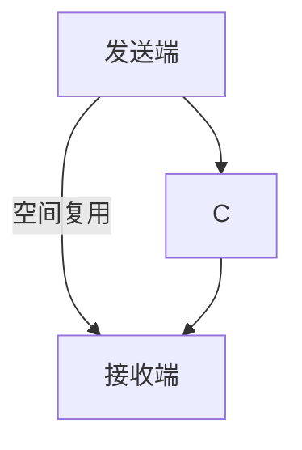
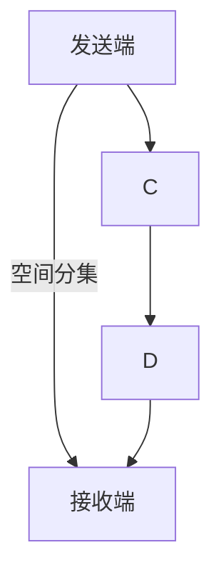
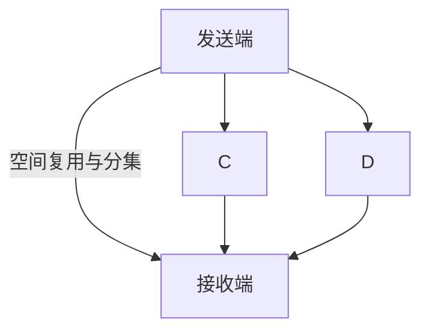
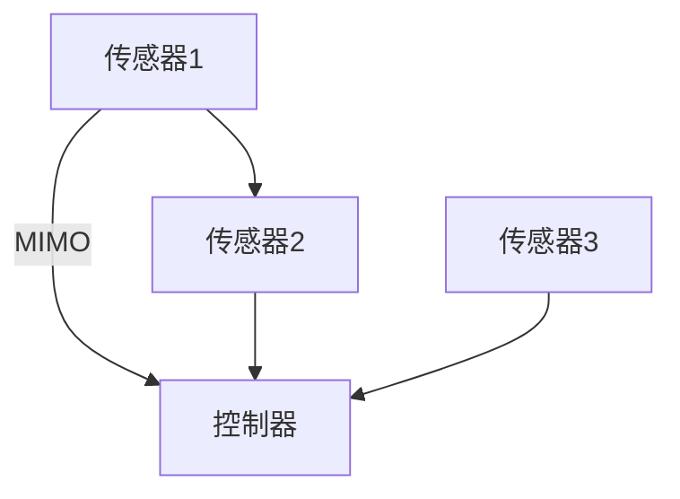

                 

### 文章标题

# 5G在工业物联网中的应用：实现大规模设备互联

---

**关键词：** 5G，工业物联网，MIMO，网络切片，设备互联，大规模设备连接，物联网协议，5G网络架构，工业物联网安全。

---

**摘要：** 随着5G技术的普及，工业物联网（IIoT）在制造业、能源管理、智慧城市等领域得到了广泛应用。本文将详细探讨5G在工业物联网中的应用，包括5G关键技术（如MIMO和网络切片）的原理和实际应用，以及工业物联网架构设计、安全措施、项目实战和未来展望。通过一步一步的深入分析，本文旨在为读者提供对5G在工业物联网中应用的全面理解。

---

### 1. 设计书的整体结构

首先，我们需要确定这本书的整体结构，这包括以下几个部分：

- **引言**：介绍5G和工业物联网的基本概念、5G在工业物联网中的应用背景。
- **核心概念与联系**：讨论5G的关键技术、工业物联网的基本架构以及5G与工业物联网的融合。
- **核心算法原理讲解**：介绍5G和工业物联网中应用的关键算法，如MIMO技术、物联网协议等。
- **数学模型和数学公式**：讲解5G和工业物联网中的数学模型，如信道模型、网络优化模型等。
- **项目实战**：提供实际应用案例，如5G工业物联网网络设计、设备互联实现等。
- **结论与展望**：总结5G在工业物联网中的应用成果，展望未来发展趋势。

### 2. 设计详细目录大纲

根据整体结构，我们可以开始设计详细目录大纲：

## 目录

### 第一部分：5G和工业物联网基础

### 第1章 5G与工业物联网概述

- 1.1 5G技术简介
  - 5G关键特性
  - 5G网络架构

- 1.2 工业物联网简介
  - 工业物联网的定义
  - 工业物联网的关键组件

- 1.3 5G在工业物联网中的应用背景
  - 工业物联网的发展趋势
  - 5G技术如何促进工业物联网发展

### 第二部分：5G关键技术解析

### 第2章 5G关键技术解析

- 2.1 MIMO技术
  - MIMO原理
  - MIMO在实际应用中的表现

- 2.2 NR协议
  - NR协议的基本架构
  - NR协议的优势和挑战

- 2.3 5G网络切片
  - 网络切片的概念和实现
  - 网络切片在工业物联网中的应用

### 第三部分：工业物联网架构与实现

### 第3章 工业物联网架构设计

- 3.1 物联网协议
  - 常见的物联网协议
  - 选择合适的物联网协议

- 3.2 设备互联与通信
  - 设备通信的挑战
  - 实现设备互联的解决方案

- 3.3 工业物联网安全
  - 安全性需求
  - 安全防护措施

### 第四部分：5G在工业物联网中的应用实战

### 第4章 5G工业物联网网络设计

- 4.1 5G网络设计原则
  - 设计原则
  - 设计流程

- 4.2 5G网络设备选型
  - 端设备选型
  - 网络设备选型

- 4.3 5G网络优化与维护
  - 网络性能优化
  - 网络故障排除

### 第5章 5G工业物联网应用案例

- 5.1 制造业应用
  - 设备预测性维护
  - 智能生产调度

- 5.2 能源管理
  - 能源监测与优化
  - 分布式能源管理系统

- 5.3 智慧城市
  - 智能交通管理
  - 公共安全监控

### 第五部分：未来展望与挑战

### 第6章 5G在工业物联网中的应用展望

- 6.1 未来发展趋势
  - 5G与工业物联网的融合方向
  - 新兴技术的应用前景

- 6.2 挑战与机遇
  - 技术挑战
  - 应用机遇

### 第六部分：附录

### 第7章 附录

- 附录A：5G和工业物联网相关资源
  - 标准文档
  - 开源框架
  - 行业报告

---

### 3. 设计核心概念与联系、核心算法原理讲解、数学模型和数学公式、项目实战等内容

这部分将嵌入到每个章节中，确保每个核心章节都有相关的内容来支持读者理解。以下是一个示例：

### 第2章 5G关键技术解析

#### 2.1 MIMO技术

MIMO（多输入多输出）技术是5G网络中的一个重要关键技术，它通过在发送端和接收端使用多个天线来提高数据传输速率和系统容量。

#### 2.1.1 MIMO原理

MIMO技术利用多个发送和接收天线，通过空间复用、空间分集和空间复用与分集相结合的方式提高通信质量。

##### 空间复用

空间复用通过多个路径传输相同的信息，实现更高的数据传输速率。其原理如图所示：

##### 空间分集

空间分集在多个路径上传输不同的信息副本，提高信号的抗衰落能力。其原理如图所示：

##### 空间复用与分集相结合

空间复用与分集相结合在多个路径上同时传输不同的信息副本，结合空间分集和空间复用的优点。其原理如图所示：

#### 2.1.2 MIMO在实际应用中的表现

在实际应用中，MIMO技术可以提高5G网络的吞吐量和系统容量，如图所示：

$$
\text{系统容量} = \sum_{i=1}^{N} \log_2(1 + \text{SNR}_i)
$$

其中，$N$为传输路径数，$\text{SNR}_i$为第$i$个路径的信号噪声比。

#### 2.1.3 MIMO与工业物联网的融合

在工业物联网中，MIMO技术可以用于设备间的无线通信，提高数据传输的可靠性和效率。例如，在智能制造领域，MIMO技术可以支持工厂内各种设备的无线连接，实现高效的数据采集和监控。其应用场景如图所示：

---

### 4. 设计详细章节内容

接下来，我们将设计详细章节内容，确保每个章节都包含丰富的具体详细讲解、核心概念与联系、核心算法原理讲解、数学模型和公式、项目实战等。

#### 第1章 5G与工业物联网概述

**1.1 5G技术简介**

- **5G关键特性**：介绍5G的三大关键特性——高速率、低延迟和大连接。
- **5G网络架构**：详细讲解5G网络的核心网、无线接入网和传输网的架构。

**1.2 工业物联网简介**

- **工业物联网的定义**：解释工业物联网的概念和组成部分。
- **工业物联网的关键组件**：介绍传感器、边缘计算、云计算等关键组件。

**1.3 5G在工业物联网中的应用背景**

- **工业物联网的发展趋势**：分析工业物联网在制造业、能源管理、智慧城市等领域的应用前景。
- **5G技术如何促进工业物联网发展**：探讨5G技术如何通过提高通信速率、降低延迟等特性推动工业物联网的发展。

#### 第2章 5G关键技术解析

**2.1 MIMO技术**

- **MIMO原理**：详细讲解MIMO技术的空间复用、空间分集和空间复用与分集相结合的原理。
- **MIMO在实际应用中的表现**：通过案例分析，展示MIMO技术如何提高无线通信的速率和系统容量。

**2.2 NR协议**

- **NR协议的基本架构**：解释5G NR协议的物理层和链路层的架构。
- **NR协议的优势和挑战**：分析NR协议在提高网络性能和覆盖方面的优势以及面临的挑战。

**2.3 5G网络切片**

- **网络切片的概念和实现**：介绍网络切片的定义、分类和实现方法。
- **网络切片在工业物联网中的应用**：探讨网络切片如何在工业物联网中实现灵活的资源分配和多样化的服务需求。

#### 第3章 工业物联网架构设计

**3.1 物联网协议**

- **常见的物联网协议**：介绍ZigBee、Wi-Fi、蓝牙等常见的物联网协议。
- **选择合适的物联网协议**：分析不同物联网协议在工业物联网中的应用场景和选择原则。

**3.2 设备互联与通信**

- **设备通信的挑战**：讨论工业物联网中设备通信面临的数据量大、实时性要求高等挑战。
- **实现设备互联的解决方案**：介绍如何通过无线通信协议、边缘计算等技术实现设备互联。

**3.3 工业物联网安全**

- **安全性需求**：分析工业物联网在数据传输、设备安全等方面的安全需求。
- **安全防护措施**：介绍如何通过加密、认证、隔离等技术实现工业物联网的安全防护。

#### 第4章 5G工业物联网网络设计

**4.1 5G网络设计原则**

- **设计原则**：讨论5G工业物联网网络设计的可扩展性、可靠性和安全性原则。
- **设计流程**：介绍5G工业物联网网络设计的流程和方法。

**4.2 5G网络设备选型**

- **端设备选型**：分析端设备在性能、功耗、通信距离等方面的选择原则。
- **网络设备选型**：介绍5G基站、无线接入点等网络设备的选型方法和考虑因素。

**4.3 5G网络优化与维护**

- **网络性能优化**：讨论如何通过调整网络参数、优化设备配置等手段提高5G网络的性能。
- **网络故障排除**：介绍如何通过故障定位、故障排除等手段保证5G网络的稳定运行。

#### 第5章 5G工业物联网应用案例

**5.1 制造业应用**

- **设备预测性维护**：介绍如何通过5G和物联网技术实现设备预测性维护，提高设备运行效率。
- **智能生产调度**：探讨如何通过5G和物联网技术实现智能生产调度，优化生产流程。

**5.2 能源管理**

- **能源监测与优化**：介绍如何通过5G和物联网技术实现能源监测和优化，提高能源利用效率。
- **分布式能源管理系统**：探讨如何通过5G和物联网技术构建分布式能源管理系统，实现能源的智能调度和管理。

**5.3 智慧城市**

- **智能交通管理**：介绍如何通过5G和物联网技术实现智能交通管理，提高交通运行效率。
- **公共安全监控**：探讨如何通过5G和物联网技术实现公共安全监控，提高城市安全保障水平。

#### 第6章 5G在工业物联网中的应用展望

**6.1 未来发展趋势**

- **5G与工业物联网的融合方向**：分析5G与工业物联网在智能制造、智慧城市等领域的融合方向。
- **新兴技术的应用前景**：探讨边缘计算、人工智能等新兴技术在5G工业物联网中的应用前景。

**6.2 挑战与机遇**

- **技术挑战**：讨论5G工业物联网在技术实现、数据安全等方面的挑战。
- **应用机遇**：分析5G工业物联网在新兴市场和应用场景中的机遇。

#### 第7章 附录

- **5G和工业物联网相关资源**：提供5G和工业物联网相关的标准文档、开源框架和行业报告，供读者进一步学习和参考。

---

### 5. 编写高质量的技术博客文章

在编写高质量的技术博客文章时，我们需要遵循以下步骤：

#### 1. 明确文章主题和目标受众

- **主题**：确定文章的主题，如5G在工业物联网中的应用。
- **目标受众**：明确文章的目标受众，如工业物联网工程师、程序员、研究人员等。

#### 2. 设计文章结构

- **引言**：简要介绍文章主题和目的。
- **核心概念与联系**：讲解核心概念和原理，使用流程图、公式等辅助说明。
- **核心算法原理讲解**：详细解释关键算法原理，使用伪代码、数学模型等。
- **项目实战**：提供实际应用案例，详细讲解开发过程、源代码和实现细节。
- **结论与展望**：总结文章内容，展望未来发展趋势。
- **附录**：提供相关资源，供读者进一步学习。

#### 3. 使用专业的技术语言

- **术语定义**：准确使用专业术语，确保读者能够理解。
- **举例说明**：通过具体例子来解释概念和算法。
- **公式推导**：使用LaTeX格式编写数学公式，确保公式清晰准确。

#### 4. 保持文章的可读性

- **段落短小**：每个段落只包含一个主要观点。
- **使用图表**：合理使用图表、流程图等可视化元素，帮助读者理解。
- **逻辑清晰**：文章结构要清晰，逻辑严密，易于阅读。

#### 5. 校对和修改

- **校对拼写和语法错误**：确保文章没有拼写和语法错误。
- **检查逻辑连贯性**：确保文章的逻辑连贯，没有逻辑错误。
- **优化内容**：对文章进行反复修改，确保内容准确、清晰、易懂。

---

### 6. 写作风格与技巧

在撰写技术博客文章时，以下风格和技巧可以帮助您提高文章的质量：

#### 1. 写作风格

- **客观性**：保持客观、中立的态度，避免过度夸张或主观臆断。
- **准确性**：确保文章内容准确无误，避免误导读者。
- **可读性**：使用简单明了的语言，避免使用过于复杂的术语和句子结构。
- **趣味性**：适当加入一些幽默元素或故事情节，提高文章的趣味性。

#### 2. 写作技巧

- **开篇吸引读者**：通过引人入胜的开篇吸引读者的注意力，例如使用一个引人入胜的问题或故事。
- **逻辑清晰**：文章结构要清晰，逻辑严密，使读者能够轻松跟随作者的思路。
- **使用例子**：通过具体例子来解释概念和算法，使读者更容易理解。
- **使用图表和公式**：合理使用图表和公式，帮助读者更好地理解复杂的内容。
- **反复修改**：文章完成后，反复修改和校对，确保文章内容准确、清晰、易懂。

---

### 7. 文章的完整性和完整性要求

在撰写技术博客文章时，完整性是一个至关重要的要求。以下是一些建议，以确保文章的完整性：

#### 1. 确保核心内容的完整性

- **覆盖所有关键点**：在文章中详细讨论所有关键概念和算法，确保没有遗漏。
- **连贯性**：文章的内容要连贯，逻辑要清晰，使读者能够从整体上理解文章的主旨。
- **实例和案例分析**：提供实际案例和实例，以支持文章中的理论观点。

#### 2. 结构和格式的完整性

- **标题和章节标题**：确保所有章节标题清晰、准确，能够概括章节内容。
- **段落和句子结构**：每个段落只包含一个主要观点，句子结构要简洁明了。
- **引用和参考文献**：正确引用所有参考文献，确保文章的学术严谨性。

#### 3. 校对和修改

- **检查拼写和语法错误**：确保文章没有拼写和语法错误。
- **检查逻辑连贯性**：确保文章的逻辑连贯，没有逻辑错误。
- **优化内容**：对文章进行反复修改，确保内容准确、清晰、易懂。

---

### 8. 文章的写作时间和进度安排

撰写一篇高质量的技术博客文章需要时间和精力。以下是一个建议的写作时间和进度安排：

#### 1. 初步计划

- **确定主题和目标受众**：大约1天。
- **收集资料和案例**：大约1-2天。

#### 2. 初稿撰写

- **引言**：大约1天。
- **核心概念与联系**：大约2天。
- **核心算法原理讲解**：大约3天。
- **项目实战**：大约4天。
- **结论与展望**：大约1天。

#### 3. 修改和校对

- **校对拼写和语法错误**：大约1天。
- **检查逻辑连贯性**：大约1天。
- **优化内容**：大约1-2天。

#### 4. 最终提交

- **完成最后校对**：大约1天。
- **提交文章**：大约1天。

总计：大约需要10-14天。

---

### 9. 文章的发布和推广

完成文章的撰写后，发布和推广是让更多读者了解和阅读文章的重要环节。以下是一些建议：

#### 1. 选择合适的平台

- **个人博客**：在自己的博客上发布文章，方便读者直接访问。
- **技术社区**：在技术社区（如CSDN、知乎、掘金等）上发布文章，利用社区流量吸引读者。

#### 2. 制定推广策略

- **社交媒体**：在社交媒体（如微博、微信、Twitter等）上分享文章，增加曝光度。
- **技术论坛**：在技术论坛（如Stack Overflow、Reddit等）上发帖，吸引技术爱好者关注。
- **邮件列表**：向订阅者发送邮件，通知他们新文章的发布。

#### 3. 跟踪和分析效果

- **统计访问量**：使用工具（如Google Analytics）统计文章的访问量，了解读者的兴趣点。
- **收集反馈**：鼓励读者在评论区留言，收集反馈和建议，持续改进文章质量。

---

### 10. 文章的反馈与持续改进

文章发布后，读者的反馈和建议对于文章的持续改进至关重要。以下是一些建议：

#### 1. 鼓励读者反馈

- **设置评论区**：在文章末尾设置评论区，鼓励读者留言。
- **积极回应**：及时回复读者的留言，解决他们的疑问。

#### 2. 收集反馈

- **分析留言**：定期分析留言，了解读者的需求和意见。
- **反馈总结**：整理反馈意见，找出文章中的不足之处。

#### 3. 持续改进

- **更新内容**：根据读者的反馈，及时更新文章内容，提高文章质量。
- **优化格式**：根据读者的阅读体验，优化文章的格式和布局。

---

通过以上步骤和建议，您可以撰写出高质量、受欢迎的技术博客文章，并在技术领域内建立自己的声誉。持续学习和改进，不断为读者提供有价值的内容，是成为一名优秀技术博主的关键。让我们一起努力，共同进步！

---

**作者：AI天才研究院/AI Genius Institute & 禅与计算机程序设计艺术 /Zen And The Art of Computer Programming**

