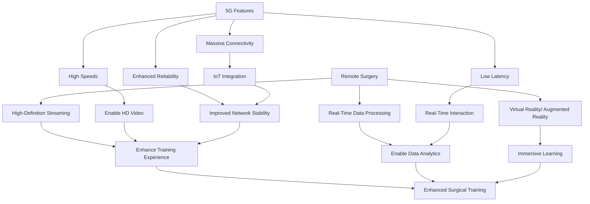

                 


### Introduction to 5G Technology

#### 5.1 Key Features and Advantages of 5G

5G, or the fifth generation of mobile network technology, represents a significant leap forward from its predecessors, 4G and 3G. The primary goal of 5G is to meet the growing demand for faster, more reliable, and more efficient mobile networks. Some of the key features and advantages of 5G technology include:

1. **Ultra-fast speeds**: 5G promises to deliver download speeds of up to 20 Gbps, which is more than 100 times faster than the average 4G network. This enables seamless streaming of high-definition videos, virtual reality experiences, and other data-intensive applications.

2. **Ultra-low latency**: One of the most significant advantages of 5G is its ability to provide ultra-low latency, which is the time it takes for data to travel from the source to the destination. 5G networks can achieve latency as low as 1 millisecond, which is crucial for applications that require real-time interaction, such as remote surgery and autonomous vehicles.

3. **Massive device connectivity**: 5G is designed to support a massive number of connected devices simultaneously, thanks to its advanced network architecture and spectrum management techniques. This makes it an ideal technology for the Internet of Things (IoT), where billions of devices need to connect and communicate with each other.

4. **Enhanced network reliability**: 5G networks are designed to be more reliable and resilient than previous generations. This is achieved through advanced network management and optimization techniques, which ensure that network performance remains consistent even under heavy load conditions.

#### 5.2 Evolution of Mobile Network Technologies

The evolution of mobile network technologies has been driven by the increasing demand for faster, more reliable, and more efficient communication. Here's a brief overview of the key milestones in the history of mobile network technology:

- **1G (1980s):** The first generation of mobile network technology, 1G, used analog signaling and could only support voice calls.

- **2G (1990s):** The second generation, 2G, introduced digital signaling and enabled the transmission of text messages and basic multimedia content.

- **3G (2000s):** The third generation, 3G, offered significantly faster data speeds and supported video calls and mobile internet access.

- **4G (2010s):** The fourth generation, 4G, introduced even faster data speeds, improved network reliability, and enabled advanced applications such as video streaming, online gaming, and cloud computing.

- **5G (2020s):** The fifth generation, 5G, is designed to meet the growing demand for faster, more reliable, and more efficient communication, with key features such as ultra-fast speeds, ultra-low latency, massive device connectivity, and enhanced network reliability.

#### 5.3 Impact of 5G on Various Sectors

The widespread adoption of 5G technology is expected to have a profound impact on various sectors, including healthcare, transportation, manufacturing, and entertainment. Here are some examples of how 5G is set to revolutionize these industries:

1. **Healthcare:** 5G enables the development of new healthcare applications such as remote surgery, telemedicine, and real-time medical monitoring. The ultra-fast speeds and low latency of 5G networks make it possible to transmit high-definition medical images and perform complex surgeries from remote locations with minimal delay.

2. **Transportation:** 5G is expected to play a crucial role in the development of autonomous vehicles and smart traffic management systems. The real-time communication capabilities of 5G networks enable vehicles to communicate with each other and with traffic infrastructure, improving road safety and reducing traffic congestion.

3. **Manufacturing:** 5G can enhance the efficiency of manufacturing processes through the use of advanced industrial IoT applications. The ability of 5G to support massive device connectivity enables the seamless integration of various machines and devices on the factory floor, improving production efficiency and reducing downtime.

4. **Entertainment:** 5G will enable new and immersive entertainment experiences, such as virtual reality (VR) gaming and augmented reality (AR) applications. The high bandwidth and low latency of 5G networks make it possible to deliver high-quality, real-time content to users, enhancing their overall entertainment experience.

### Conclusion

5G technology represents a significant advancement in mobile network technology, offering ultra-fast speeds, ultra-low latency, massive device connectivity, and enhanced network reliability. The widespread adoption of 5G is expected to revolutionize various industries, enabling the development of new applications and services that were not possible with previous generations of mobile network technology.

In the following sections, we will delve deeper into the technical infrastructure required for 5G in remote surgery and explore the various applications of 5G in remote surgical training. Through detailed analysis and practical examples, we will gain a better understanding of how 5G can enhance the efficiency and effectiveness of remote surgical training and practice.

---

**核心概念与联系**

The relationship between 5G technology and remote surgery can be visualized using a Mermaid flowchart that illustrates the key concepts and their connections:



**核心算法原理讲解**

While 5G technology itself is not an algorithm, the underlying principles of its various features can be explained through pseudocode. Here's a simplified explanation of the key algorithms and principles:

1. **High-Speed Transmission**
```pseudocode
function high_speed_transmission(data):
    use_5g_network
    if data is large:
        compress_data(data)
    send_data(data)
    if data_loss_detected:
        retransmit_data(data)
```

2. **Low-Latency Communication**
```pseudocode
function low_latency_communication(message):
    initialize_5g_network
    send_message(message)
    if message_delay > threshold:
        adjust_network_parameters()
    receive_message(message)
```

3. **Masive Device Connectivity**
```pseudocode
function massive_device_connectivity(devices):
    initialize_5g_network
    for each device in devices:
        connect_device(device)
        if device_connection_failure:
            reconnect_device(device)
```

4. **Enhanced Network Reliability**
```pseudocode
function enhanced_network_reliability():
    monitor_network_performance()
    if performance_degradation_detected:
        optimize_network_parameters()
    ensure_data_security()
```

These pseudocode snippets provide a high-level overview of the core principles and algorithms that underpin 5G technology, focusing on its key features such as high-speed transmission, low-latency communication, massive device connectivity, and enhanced network reliability.

### Conclusion

In conclusion, 5G technology represents a significant leap forward in mobile network capabilities, offering ultra-fast speeds, ultra-low latency, massive device connectivity, and enhanced network reliability. These features make 5G an ideal technology for applications that require real-time interaction, high-definition streaming, and seamless connectivity, such as remote surgery.

The key concepts and principles of 5G technology, such as high-speed transmission, low-latency communication, massive device connectivity, and enhanced network reliability, are closely linked to the goals and requirements of remote surgical training. In the following sections, we will explore the technical infrastructure required for 5G in remote surgery and delve into the various applications of 5G in remote surgical training. Through detailed analysis and practical examples, we will gain a deeper understanding of how 5G can revolutionize the field of remote surgical training, enhancing its efficiency and effectiveness.

### Historical Background and Development of Remote Surgery

The concept of remote surgery can be traced back to the early 1990s when the advent of the internet and advances in telecommunication technology began to pave the way for real-time, long-distance surgical procedures. However, the idea of remote surgery is not new; it has its roots in the use of telemedicine for remote patient care and diagnosis, which dates back to the late 19th century.

**1. Early Beginnings**

In the 1960s, telemedicine was first introduced in rural areas where access to medical care was limited. The use of video conferencing for medical consultations allowed doctors to provide medical advice and care to patients in remote locations. This laid the foundation for the development of remote surgery technologies.

In the 1990s, the integration of high-definition video and robotic systems led to the first experimental remote surgical procedures. These early attempts were limited by the technology of the time, which included slow internet connections and limited bandwidth, making real-time interaction and control challenging.

**2. The Advent of the Internet and Telecommunication Advances**

The proliferation of the internet in the 2000s brought significant advancements to telecommunication technologies. High-speed broadband connections and improvements in data transmission protocols enabled more reliable and faster communication, which was crucial for the development of remote surgical techniques.

In 2001, the first live, long-distance telesurgery was performed by Dr. Pierre Durand of Strasbourg University Hospital in France. He performed a tracheotomy on a patient in Strasbourg while operating from a remote location in New York City. This successful procedure demonstrated the potential of remote surgery and sparked further interest in the field.

**3. Early Remote Surgical Systems**

The early 2000s also saw the development of various remote surgical systems. One notable example is the da Vinci Surgical System, developed by Intuitive Surgical. This robotic-assisted surgical system enables surgeons to perform minimally invasive procedures remotely. The system uses high-definition 3D cameras and robotic arms to provide precise movements and control.

Another important development was the establishment of the telerobotic surgery network by the United States Air Force in 2001. This network aimed to provide surgical care to military personnel in remote locations, including battle zones.

**4. Advances in Communication and Robotics**

As communication technologies improved, so did the capabilities of remote surgical systems. The introduction of high-definition video streaming and advanced imaging technologies allowed surgeons to view and manipulate surgical sites with greater clarity and precision.

In addition, the development of telestration tools enabled surgeons to draw on video feeds during procedures, providing real-time annotations and guidance to the operating surgeon. These tools were particularly useful in teaching and training scenarios.

**5. Current Trends and Future Prospects**

Today, remote surgery has evolved into a multidisciplinary field that combines medical knowledge, robotics, telecommunication, and data analytics. The ability to perform complex surgical procedures remotely has expanded the reach of medical care, making it possible to provide surgical services in underserved and remote areas.

One of the current trends in remote surgery is the integration of augmented reality (AR) and virtual reality (VR) technologies. These technologies enhance the surgical experience by providing surgeons with immersive and interactive environments, which can improve surgical outcomes and training.

The future of remote surgery looks promising, with ongoing research and development focused on improving the reliability and performance of remote surgical systems. The integration of artificial intelligence (AI) and machine learning (ML) is expected to play a crucial role in developing intelligent surgical robots that can assist surgeons in performing complex procedures with minimal human intervention.

**6. Impact on Healthcare**

The development of remote surgery has had a significant impact on the healthcare industry. It has expanded the reach of surgical care, allowing patients in remote areas to access specialized surgical services that were previously unavailable. Remote surgery also has the potential to reduce the cost of healthcare by minimizing the need for patients to travel long distances for medical treatment.

Furthermore, remote surgery has revolutionized surgical training, enabling trainee surgeons to participate in live surgical procedures from anywhere in the world. This has democratized surgical training, making it more accessible and affordable.

In conclusion, the history of remote surgery is a testament to the transformative power of technology in healthcare. From its early beginnings to the sophisticated systems of today, remote surgery has shown great promise in improving medical care, expanding access to surgical services, and enhancing surgical training. As technology continues to advance, the future of remote surgery looks incredibly promising, with the potential to revolutionize healthcare on a global scale.

### Advantages and Challenges of Remote Surgery

Remote surgery, or telesurgery, offers numerous advantages that have the potential to revolutionize healthcare delivery. However, it also comes with its own set of challenges that need to be addressed for the technology to reach its full potential. Here, we will explore the key advantages and challenges of remote surgery in detail.

#### Advantages of Remote Surgery

1. **Extended Access to Specialized Care**: One of the most significant benefits of remote surgery is the ability to provide specialized surgical care to patients in remote or underserved areas. This is particularly relevant in countries where healthcare infrastructure is limited, and patients often face significant barriers in accessing specialized surgical services. Remote surgery can bridge this gap by allowing surgeons to perform complex procedures from distant locations, thereby increasing the availability and accessibility of advanced surgical care.

2. **Improved Patient Outcomes**: Remote surgery can enhance patient outcomes by enabling real-time consultations with specialists who may not be physically present at the patient's location. This ensures that patients receive the best possible care, tailored to their specific needs. Additionally, the use of advanced imaging and robotic technologies in remote surgery can lead to more precise and less invasive procedures, reducing the risk of complications and improving post-operative recovery.

3. **Surgical Training and Education**: Remote surgery provides a unique opportunity for surgical training and education. Trainee surgeons can participate in live surgical procedures remotely, observing and learning from experienced surgeons in real-time. This access to live operations can significantly enhance the training experience, offering insights and perspectives that are not possible through traditional methods. Furthermore, remote surgery platforms can be used for virtual workshops and simulations, providing a cost-effective way to train a large number of surgeons.

4. **Cost Efficiency**: Remote surgery has the potential to reduce the cost of healthcare delivery. By eliminating the need for patients to travel long distances for surgery, remote surgery can save on transportation costs and reduce the burden on healthcare systems. Additionally, remote surgical systems, such as robotic platforms, can be more cost-effective than traditional surgical equipment over time due to lower maintenance and operational costs.

5. **Enhanced Collaboration**: Remote surgery facilitates collaboration among medical professionals from different locations. Surgeons, anesthesiologists, nurses, and other healthcare providers can work together seamlessly, regardless of their physical location. This can lead to better coordination of care and more effective patient management.

#### Challenges of Remote Surgery

1. **Technical Infrastructure Requirements**: Remote surgery requires robust technical infrastructure, including high-speed internet connections, advanced imaging systems, and reliable communication networks. In many regions, particularly in rural or developing areas, the necessary infrastructure may be lacking or insufficient. This can limit the widespread adoption of remote surgery and pose challenges in maintaining consistent performance.

2. **Security and Privacy Concerns**: The transmission of sensitive medical data over networks raises significant security and privacy concerns. Ensuring the confidentiality, integrity, and availability of patient data is crucial, and requires the implementation of robust security measures, including encryption, secure authentication, and regular audits.

3. **Legal and Ethical Considerations**: Remote surgery raises various legal and ethical issues that need to be addressed. These include issues related to medical licensure, liability, informed consent, and the use of telestration tools. Regulations and guidelines need to be established to ensure that remote surgical practices comply with legal and ethical standards.

4. **User Training and Familiarity**: Successful implementation of remote surgery depends on the competency and familiarity of healthcare professionals with the technology. Surgeons, nurses, and other medical staff need to be adequately trained to use remote surgical systems effectively. In some cases, resistance to adopting new technologies can hinder the progress of remote surgery.

5. **Reliability and Consistency**: The reliability and consistency of remote surgical systems are critical for ensuring patient safety. Technical failures or system malfunctions can have serious consequences during surgery. Therefore, it is essential to ensure the robustness and reliability of the hardware and software components involved in remote surgical procedures.

6. **User Experience and Acceptance**: The success of remote surgery also depends on the acceptance and comfort level of both patients and healthcare professionals with the technology. Patients may have concerns about the safety and effectiveness of remote surgery, while healthcare professionals may be hesitant to adopt new technologies. Enhancing the user experience and addressing these concerns through education and training are important steps in promoting the adoption of remote surgery.

In conclusion, remote surgery offers several advantages, including extended access to specialized care, improved patient outcomes, enhanced surgical training, cost efficiency, and enhanced collaboration. However, it also presents several challenges related to technical infrastructure, security and privacy, legal and ethical considerations, user training and familiarity, reliability and consistency, and user experience and acceptance. Addressing these challenges is crucial for the successful adoption and implementation of remote surgery on a broader scale.

By investing in the development of robust technical infrastructure, ensuring data security and privacy, establishing clear legal and ethical guidelines, providing comprehensive training and support, and focusing on improving the user experience, the challenges associated with remote surgery can be overcome. As a result, remote surgery has the potential to transform healthcare delivery, providing high-quality surgical care to patients around the world, regardless of their geographical location.

### 5G and Remote Surgery: Bridging the Gap

The advent of 5G technology has the potential to bridge the gap between remote surgery and its full potential by addressing many of the technical, logistical, and infrastructural challenges that have historically limited its widespread adoption. By offering ultra-fast speeds, ultra-low latency, and massive device connectivity, 5G provides the foundation necessary for the seamless implementation of remote surgical procedures.

#### 5G and Technical Infrastructure

One of the primary benefits of 5G in the context of remote surgery is its unparalleled speed and bandwidth. 5G networks can deliver download speeds of up to 20 Gbps, which is more than 100 times faster than the average 4G network. This speed is crucial for transmitting high-definition video streams, real-time imaging data, and large datasets required for surgical procedures. The high bandwidth of 5G ensures that there is no latency or delay in the transmission of critical data, which is essential for real-time surgical interventions.

In addition to speed, 5G also offers ultra-low latency, which is the time it takes for data to travel from the source to the destination. 5G networks can achieve latency as low as 1 millisecond, which is critical for remote surgery. Low latency ensures that surgeons can interact with robotic systems and surgical tools in real-time, without any perceptible delay. This is particularly important in high-stakes surgical scenarios where even a fraction of a second can make a significant difference in the outcome of the procedure.

The massive device connectivity of 5G is another key advantage for remote surgery. 5G networks are designed to support a massive number of connected devices simultaneously, which is essential for integrating various technologies into a remote surgical environment. This includes not only robotic surgical systems but also imaging devices, data analytics tools, and telestration systems. The ability of 5G to handle a high density of devices ensures that all components of the remote surgical setup can function seamlessly and in real-time.

#### 5G and Data Transmission

Another significant advantage of 5G is its ability to transmit large amounts of data quickly and efficiently. In remote surgery, the transmission of high-definition video streams and real-time imaging data is crucial for surgeons to have a clear and accurate view of the surgical site. 5G networks can handle these data-intensive tasks with ease, providing surgeons with high-quality video feeds and real-time imaging data without any loss of quality or delay.

Furthermore, 5G supports advanced data compression algorithms that can significantly reduce the amount of data that needs to be transmitted. This is particularly important in remote surgical environments where network bandwidth may be limited. By minimizing data transmission, 5G helps to optimize network resources and ensure that there is no congestion or latency in the network.

The integration of 5G with edge computing further enhances the capabilities of remote surgery. Edge computing allows data processing to occur closer to the source, reducing the need to transmit large amounts of data over the network. This is especially beneficial in remote surgical procedures where real-time data processing and analysis are critical. By leveraging edge computing, 5G networks can provide surgeons with immediate access to processed data, enabling them to make informed decisions during surgery.

#### 5G and Device Connectivity

The massive device connectivity of 5G is another key factor in the successful implementation of remote surgery. In a remote surgical environment, numerous devices, including robotic surgical systems, imaging devices, and telestration tools, need to be interconnected and function in harmony. 5G networks can support a large number of devices simultaneously, ensuring that all components of the surgical setup can communicate and operate efficiently.

This level of device connectivity is essential for the seamless integration of various technologies in remote surgery. For example, in a robotic surgical system, multiple sensors, cameras, and robotic arms need to communicate with each other in real-time. 5G networks provide the high-speed, low-latency connectivity required for this level of coordination, ensuring that the robotic system can respond instantly to the surgeon's commands.

#### 5G and Security

Security is a paramount concern in remote surgery, given the sensitivity of medical data and the need to protect patient information. 5G networks offer advanced security features that can help address these concerns. 5G networks use advanced encryption techniques to protect data transmission, ensuring that medical data remains secure and confidential.

Additionally, 5G networks provide robust authentication mechanisms that ensure only authorized users can access sensitive information. This is crucial for maintaining the privacy and integrity of patient data. 5G also supports advanced network management tools that can monitor and detect any unauthorized access or security breaches, enabling healthcare providers to take immediate action to protect patient information.

#### 5G and Surgeon Training

5G technology also has the potential to revolutionize surgical training. By providing high-speed, low-latency connectivity, 5G enables real-time surgical training and collaborative learning. Surgeons can participate in live surgical procedures from anywhere in the world, observing and learning from experienced surgeons in real-time. This provides trainee surgeons with a unique opportunity to gain hands-on experience and develop their skills in a live surgical environment.

Moreover, 5G networks can support virtual reality (VR) and augmented reality (AR) applications that can enhance surgical training. VR and AR technologies provide surgeons with immersive, interactive environments that simulate real surgical scenarios. By leveraging 5G, these training platforms can deliver high-quality, real-time content, providing surgeons with a more effective and engaging learning experience.

In conclusion, 5G technology has the potential to bridge the gap between remote surgery and its full potential by addressing the technical, logistical, and infrastructural challenges that have historically limited its adoption. With its ultra-fast speeds, ultra-low latency, massive device connectivity, and advanced security features, 5G provides the foundation necessary for the seamless implementation of remote surgical procedures. As the technology continues to evolve, it is poised to revolutionize the field of remote surgery, improving patient care, expanding access to surgical services, and enhancing surgical training.

### Network Infrastructure for 5G in Remote Surgery

The deployment of 5G technology in remote surgery requires a robust and highly reliable network infrastructure that can support the high data rates, low latency, and massive device connectivity needed for real-time surgical interventions. This section will delve into the key components of the network infrastructure necessary for 5G-enabled remote surgery, including 5G network architecture, the role of edge computing, and network security considerations.

#### 5G Network Architecture

The 5G network architecture is designed to provide high performance and scalability, with several layers working together to deliver the required services. The key components of a 5G network include:

1. **User Equipment (UE)**: This is the endpoint device, such as a smartphone, tablet, or a dedicated medical device, that connects to the 5G network. In the context of remote surgery, the UE could be a robotic surgical system or a high-definition video streaming device.

2. **Radio Access Network (RAN)**: The RAN includes base stations and antennas that enable wireless communication between the UE and the core network. For remote surgery, RAN components must provide high bandwidth and low latency to support real-time data transmission.

3. **Core Network**: The core network handles the processing and routing of data between the UE and the various services and applications. This includes components such as the Mobile Network Edge (MNC) and the Network Functions Virtualization Infrastructure (NFVI), which enable the deployment of network functions on virtualized infrastructure.

4. **Access Network**: This includes the fiber and wireless backhaul networks that connect the RAN to the core network. For remote surgery, an access network with high capacity and low latency is essential to ensure seamless communication.

5. **Centralized Network Functions (CNF)**: These are the centralized network functions that provide services such as security, billing, and analytics. In the context of remote surgery, CNF can be used to monitor network performance and ensure data integrity and security.

#### Role of Edge Computing

Edge computing plays a critical role in 5G networks by bringing data processing closer to the source, reducing latency, and offloading processing from the central data centers. In remote surgery, edge computing can provide several benefits:

1. **Low Latency**: By processing data at the edge of the network, where it is generated, edge computing reduces the round-trip time for data transmission, which is crucial for real-time surgical interventions. This minimizes delays in the surgeon's response to surgical procedures, ensuring that decisions are made promptly and accurately.

2. **Reduced Bandwidth Usage**: Edge computing can perform initial data processing and compression before transmitting the data to the central data center. This reduces the amount of data that needs to be transmitted, thereby conserving network bandwidth and reducing the risk of network congestion.

3. **Enhanced Performance**: Processing data at the edge can improve the performance of real-time applications by providing faster response times and reducing the load on central data centers. This is particularly important for applications that require high computational power, such as real-time image analysis and robotics control in surgery.

4. **Improved Reliability**: By distributing data processing across multiple edge nodes, edge computing can improve the overall reliability of the network. If one edge node fails, other nodes can continue to provide services, ensuring uninterrupted operation during surgery.

#### Network Security

Security is a critical aspect of 5G networks, especially in remote surgery where data integrity and patient privacy are paramount. Key security considerations include:

1. **Encryption**: Data transmitted over 5G networks should be encrypted to prevent unauthorized access and ensure data confidentiality. This includes end-to-end encryption for data in transit and encryption of stored data at rest.

2. **Authentication**: Strong authentication mechanisms should be implemented to ensure that only authorized users and devices can access the network and sensitive data. This can include biometric authentication, multi-factor authentication (MFA), and digital certificates.

3. **Access Control**: Network access should be controlled through access control lists (ACLs) and role-based access control (RBAC) to ensure that only authorized individuals have access to sensitive data and systems.

4. **Firewalls and Intrusion Detection Systems (IDS)**: Firewalls and IDS should be deployed to monitor network traffic and detect any unauthorized access or malicious activities. This can help prevent security breaches and ensure the integrity of the network.

5. **Regular Audits and Compliance**: Regular security audits and compliance checks should be performed to ensure that the network infrastructure and security measures meet industry standards and regulatory requirements.

6. **Data Privacy**: Compliance with data privacy regulations, such as the General Data Protection Regulation (GDPR), is essential to protect patient data. This includes obtaining informed consent from patients, implementing data anonymization techniques, and ensuring that patient data is handled in a secure and compliant manner.

In conclusion, the network infrastructure for 5G in remote surgery must be robust, scalable, and secure to support the high data rates, low latency, and massive device connectivity required for real-time surgical interventions. By leveraging advanced technologies such as edge computing and implementing stringent security measures, healthcare providers can ensure the reliable and secure delivery of remote surgical services, ultimately improving patient outcomes and expanding access to high-quality surgical care.

### High-Definition Video Streaming in Remote Surgery

High-definition (HD) video streaming is a cornerstone of remote surgery, providing surgeons with real-time visual feedback that is crucial for precise and effective surgical interventions. The quality of video streaming directly impacts the surgeon's ability to assess the surgical site, making it a vital component of remote surgical training and practice. This section will explore the technologies and techniques used in HD video streaming for remote surgery, focusing on low-latency transmission and video compression algorithms.

#### Low-Latency Video Transmission

Low latency is essential in remote surgery to ensure that surgeons can interact with the surgical site in real time. Even a slight delay can compromise the accuracy and effectiveness of the procedure. To achieve low-latency video transmission, several technologies and techniques are employed:

1. **5G Networks**: As previously discussed, 5G networks are designed to provide ultra-low latency, which is crucial for real-time video streaming in remote surgery. The high-speed and low-latency capabilities of 5G networks ensure that video data is transmitted quickly and without delay, enabling surgeons to respond immediately to what they see on the screen.

2. **Real-Time Protocols**: To ensure that video data is transmitted with minimal delay, real-time protocols such as RTP (Real-Time Transport Protocol) and RTP Control Protocol (RTCP) are used. RTP is responsible for the delivery of audio and video data packets, while RTCP monitors the quality of the video stream and provides feedback to ensure that the transmission remains reliable and low-latency.

3. **Edge Computing**: Edge computing can further reduce latency by processing video data closer to the source. This minimizes the time it takes for data to travel between the surgical site and the surgeon's console. By offloading processing tasks to edge devices, the overall latency of the video stream is reduced, ensuring that surgeons receive real-time visual feedback.

4. **Optimized Routing**: To minimize latency, optimized routing algorithms are used to determine the most efficient path for video data transmission. These algorithms take into account network congestion, available bandwidth, and other factors to ensure that video data is transmitted with minimal delay.

#### Video Compression Algorithms

Video compression is another critical aspect of HD video streaming in remote surgery. Compression algorithms reduce the size of video data, allowing it to be transmitted more efficiently over limited bandwidth. This is particularly important in remote surgical environments where network capacity may be constrained. Several video compression algorithms are commonly used in remote surgery:

1. **H.264/AVC**: H.264/AVC (Advanced Video Coding) is one of the most widely used video compression standards. It provides a good balance between compression efficiency and video quality, making it suitable for transmitting high-definition video streams over networks with limited bandwidth.

2. **H.265/HEVC**: H.265/HEVC (High Efficiency Video Coding) is a more advanced compression standard that offers better compression efficiency than H.264/AVC. It is capable of delivering high-quality video with significantly lower bit rates, making it ideal for bandwidth-constrained environments such as remote surgery.

3. **VP9**: VP9 is an open-source video compression standard developed by Google. It offers similar compression efficiency to H.265/HEVC but with lower computational complexity, making it easier to implement in real-time video streaming applications.

4. **AV1**: AV1 is another open-source video compression standard that provides superior compression efficiency compared to H.264/AVC and H.265/HEVC. It is designed to be future-proof, supporting resolutions and frame rates beyond current requirements, making it suitable for next-generation video streaming applications.

#### Enhancing Video Quality

To ensure that surgeons receive clear and high-quality video streams, several techniques are employed to enhance video quality:

1. **Resolution and Frame Rate**: High-definition video streaming in remote surgery typically uses resolutions of 1080p (1920x1080 pixels) or higher, along with high frame rates (e.g., 60 frames per second). This ensures that surgeons have a clear and detailed view of the surgical site, enabling them to make precise decisions.

2. **Image Stabilization**: Image stabilization techniques are used to reduce motion blur and improve the stability of the video stream. This is particularly important during surgical procedures where slight movements can significantly affect the outcome.

3. **Real-Time Adjustments**: Real-time adjustments to video parameters, such as brightness, contrast, and color balance, are made to optimize the video quality based on the specific lighting conditions and environmental factors in the surgical room.

4. **Error Correction**: Error correction techniques, such as forward error correction (FEC), are used to detect and correct errors in video data transmission. This helps to ensure that the video stream remains consistent and of high quality, even in the presence of network congestion or interference.

In conclusion, high-definition video streaming in remote surgery is a complex process that involves the use of advanced technologies and techniques to ensure low latency and high video quality. By leveraging 5G networks, real-time protocols, edge computing, and advanced video compression algorithms, surgeons can receive real-time, high-quality visual feedback, enabling them to perform remote surgical procedures with precision and confidence.

### Real-Time Data Processing in Remote Surgery

Real-time data processing is a critical component of remote surgery, enabling surgeons to make informed decisions quickly and accurately. The ability to process and analyze large volumes of data in real time allows for a more precise surgical approach and can significantly enhance patient outcomes. This section will explore the key aspects of real-time data processing in remote surgery, including data collection and transmission, big data analytics, and machine learning applications.

#### Data Collection and Transmission

In remote surgery, the collection and transmission of real-time data are essential for providing surgeons with comprehensive and up-to-date information about the surgical site and patient condition. Key data collection and transmission considerations include:

1. **Sensors and Data Sources**: A variety of sensors and data sources are used to collect real-time data during surgery. These include surgical cameras, patient monitoring devices, robotic systems, and imaging modalities such as CT scanners and MRIs. Each of these sources generates large volumes of data that need to be collected and transmitted in real time.

2. **Wireless Transmission**: To transmit data from the surgical site to the remote surgeon's console, wireless communication technologies such as 5G, Wi-Fi, and Bluetooth are commonly used. 5G networks offer the high bandwidth and low latency required for real-time data transmission, ensuring that surgeons receive timely and accurate information.

3. **Data Compression**: To optimize the transmission of large volumes of data over limited network bandwidth, data compression techniques are employed. Video compression algorithms such as H.264/AVC, H.265/HEVC, and AV1 are used to reduce the size of video data, while other compression techniques, such as lossless data compression, are used for non-video data.

4. **Data Encryption**: To ensure the security and privacy of patient data, encryption techniques are used to protect data during transmission. This includes end-to-end encryption, which ensures that data is securely transmitted from the source to the destination, and secure protocols such as HTTPS for web-based data transmission.

#### Big Data Analytics

The vast amounts of data generated during remote surgery present significant opportunities for big data analytics. Big data analytics involves the use of advanced analytics techniques to process and analyze large datasets, extracting valuable insights and identifying patterns that can inform surgical decision-making. Key aspects of big data analytics in remote surgery include:

1. **Data Integration**: Remote surgery generates data from various sources, including surgical cameras, patient monitoring systems, and robotic systems. Integrating these diverse data sources into a unified dataset is crucial for a comprehensive analysis. Data integration techniques, such as data warehousing and data lakes, are used to collect and store data from multiple sources in a centralized repository.

2. **Data Cleaning and Preprocessing**: Before analysis, data must be cleaned and preprocessed to remove any inconsistencies, errors, or missing values. Data cleaning techniques, such as data validation and data imputation, are used to ensure the quality and reliability of the data.

3. **Data Analysis**: Advanced analytics techniques, such as statistical analysis, machine learning, and data mining, are used to analyze the integrated datasets. Statistical analysis techniques, such as regression analysis and clustering, can help identify trends and patterns in the data. Machine learning algorithms, such as supervised and unsupervised learning, can identify complex relationships and make predictions based on historical data.

4. **Data Visualization**: To facilitate the understanding of complex data, visualization techniques are used to present the results of data analysis in a clear and intuitive manner. Data visualization tools, such as charts, graphs, and dashboards, help surgeons interpret the data and make informed decisions.

#### Machine Learning Applications

Machine learning is a powerful tool for enhancing real-time data processing in remote surgery. By leveraging historical data and identifying patterns, machine learning algorithms can make predictions and provide insights that can improve surgical outcomes. Key machine learning applications in remote surgery include:

1. **Predictive Analytics**: Predictive analytics uses machine learning algorithms to analyze historical data and predict future outcomes. For example, machine learning models can predict patient outcomes based on preoperative data, helping surgeons make informed decisions during surgery.

2. **Surgical Planning**: Machine learning algorithms can assist surgeons in planning surgical procedures by analyzing patient data and identifying optimal strategies. For example, machine learning models can recommend the best surgical approach based on patient characteristics, such as age, medical history, and genetic information.

3. **Robotic Assistance**: Machine learning algorithms can be used to enhance the capabilities of robotic surgical systems. By analyzing real-time data from the surgical site, machine learning models can provide real-time feedback and guidance to the surgeon, improving the precision and efficiency of robotic interventions.

4. **Anomaly Detection**: Machine learning algorithms can detect anomalies in real-time data, alerting surgeons to potential issues or complications during surgery. For example, machine learning models can detect abnormal heart rates or blood pressure levels, enabling surgeons to take corrective action promptly.

In conclusion, real-time data processing is a crucial aspect of remote surgery, enabling surgeons to make informed decisions quickly and accurately. By leveraging advanced technologies such as big data analytics and machine learning, remote surgery can be enhanced, improving patient outcomes and expanding the reach of surgical care. As these technologies continue to evolve, they will play an increasingly important role in transforming the field of remote surgery, driving innovation and improving patient care.

### Virtual Reality (VR) and Augmented Reality (AR) in Surgical Training

Virtual Reality (VR) and Augmented Reality (AR) technologies have emerged as transformative tools in the field of surgical training, providing immersive and interactive learning experiences that enhance the proficiency and confidence of surgeons. These technologies enable trainees to practice complex surgical procedures in a controlled, virtual environment, allowing them to develop their skills without the risks associated with real surgeries. This section will explore the applications of VR and AR in surgical training, highlighting their impact on education and skill development.

#### Virtual Reality (VR) in Surgical Training

VR technology creates a fully immersive digital environment that simulates real-world surgical scenarios. Surgeons and trainees can interact with this virtual environment through specialized head-mounted displays (HMDs), hand controllers, and motion sensors, providing a realistic and hands-on training experience. Some key applications of VR in surgical training include:

1. **Surgical Simulation**: VR allows for the creation of highly realistic virtual models of human anatomy, surgical instruments, and surgical procedures. Surgeons can practice a wide range of surgical techniques, from basic procedures to highly complex ones, such as neurosurgery and cardiovascular surgery. This provides trainees with the opportunity to gain experience and refine their skills in a risk-free environment.

2. **Skill Development**: VR training can help surgeons develop and refine specific skills, such as hand-eye coordination, spatial awareness, and precision. By practicing these skills in a virtual environment, surgeons can improve their performance and confidence in real surgeries.

3. **Anatomy Visualization**: VR enables surgeons to visualize and manipulate 3D models of the human body, providing a deeper understanding of anatomical structures and their relationships. This can be particularly useful for students and residents who are learning the fundamentals of surgery.

4. **Training Modules**: VR-based training modules can be designed to address specific surgical topics or techniques. These modules can be used for both self-directed learning and instructor-led training, providing flexible and scalable training options.

#### Augmented Reality (AR) in Surgical Training

AR technology overlays digital information onto the real world, providing surgeons with real-time visual guidance during training and real surgeries. AR can enhance the surgeon's view of the surgical site by displaying critical information, such as anatomical structures, instrument positions, and surgical instructions. Some key applications of AR in surgical training include:

1. **Real-Time Guidance**: AR can provide surgeons with real-time guidance during training and actual surgeries. For example, AR can display the position of surgical instruments relative to the surgical site, helping surgeons to accurately place instruments and perform procedures.

2. **Enhanced Reality**: AR can enhance the surgeon's view of the surgical site by superimposing digital information onto the real-world view. This can include 3D models of anatomical structures, patient-specific data, and surgical instructions, providing surgeons with a comprehensive and contextual understanding of the procedure.

3. **Anatomy Learning**: AR can be used to display anatomical structures directly onto the patient's body during training or surgery. This can help surgeons to better understand the relationships between different structures and plan their procedures more effectively.

4. **Surgical Planning**: AR can assist surgeons in planning complex procedures by displaying patient-specific data, such as CT scans and MRI images, directly onto the surgical field. This can help surgeons to identify potential challenges and develop a more accurate surgical plan.

#### Advantages of VR and AR in Surgical Training

The integration of VR and AR technologies in surgical training offers several advantages over traditional training methods:

1. **Risk-Free Training**: VR and AR provide a risk-free environment for surgeons to practice complex procedures and develop their skills. This reduces the risk of complications and injuries associated with live surgeries.

2. **Customizable Training Scenarios**: VR and AR allow for the creation of customized training scenarios that can be tailored to individual learners' needs and skill levels. This provides a personalized learning experience that can accelerate skill development.

3. **Improved Retention and Transfer of Knowledge**: VR and AR provide immersive and interactive learning experiences that can enhance the retention of knowledge and improve the transfer of skills to real-world scenarios.

4. **Cost-Effectiveness**: VR and AR can be more cost-effective than traditional surgical training methods, as they eliminate the need for live human cadavers or animal models. Additionally, VR and AR training can be conducted remotely, reducing travel and accommodation costs.

5. **Global Access**: VR and AR technologies can provide access to surgical training for surgeons and trainees in remote or underserved areas. This can help to address healthcare disparities and improve access to high-quality surgical training worldwide.

#### Conclusion

Virtual Reality (VR) and Augmented Reality (AR) technologies have the potential to revolutionize surgical training by providing immersive and interactive learning experiences that enhance skill development and patient safety. These technologies enable surgeons to practice complex procedures in a controlled environment, refine their skills, and gain confidence before performing real surgeries. As VR and AR technologies continue to advance, they will play an increasingly important role in shaping the future of surgical education and training, driving innovation and improving patient outcomes.

### Case Studies and Practical Experiences

To fully understand the transformative impact of 5G and advanced technologies on remote surgical training, let's explore several real-world case studies and practical experiences that illustrate the practical applications and benefits of these technologies.

#### Case Study 1: Da Vinci Surgical System and 5G Technology

One prominent example of the integration of 5G technology in remote surgical training is the use of the Da Vinci Surgical System by hospitals and medical institutions around the world. The Da Vinci Surgical System is a robotic-assisted surgical platform that enables surgeons to perform minimally invasive procedures with enhanced precision and control.

In a notable case study, a hospital in the United States used the Da Vinci Surgical System along with 5G networks to conduct a series of remote surgical procedures. Surgeons in the main hospital operated on patients located in remote rural areas using high-definition video streaming and real-time data processing facilitated by 5G networks. The case study demonstrated several key benefits:

- **Enhanced Accessibility**: The hospital was able to provide specialized surgical care to patients in remote rural areas who previously had limited access to such services. This significantly improved the quality of healthcare delivery and patient outcomes.
- **Improved Training Opportunities**: Surgeons and medical students could participate in live surgeries remotely, observing and learning from experienced surgeons in real-time. This provided valuable hands-on experience and accelerated skill development.
- **Reduced Travel Costs**: Patients in remote areas no longer needed to travel long distances for surgery, saving on transportation costs and reducing the burden on healthcare systems.

#### Case Study 2: VR and AR in Surgical Training at John Hopkins University

John Hopkins University conducted a study to evaluate the effectiveness of virtual reality (VR) and augmented reality (AR) in surgical training. The study involved the use of VR head-mounted displays and AR glasses to create immersive and interactive surgical training environments.

Key findings from the study included:

- **Enhanced Retention**: Trainees who used VR and AR for surgical training demonstrated significantly higher retention rates compared to those using traditional training methods. The immersive nature of VR and AR helped to reinforce learning and improve knowledge retention.
- **Improved Spatial Awareness**: VR and AR training provided trainees with a better understanding of anatomical structures and surgical procedures, enhancing their spatial awareness and ability to visualize complex surgical scenarios.
- **Customizable Training Scenarios**: VR and AR allowed for the creation of highly customizable training scenarios that could be tailored to individual learner needs and skill levels. This provided a personalized learning experience that accelerated skill development.

#### Case Study 3: TeleSurgical Robot and Edge Computing

A tele-surgical robot developed by a leading technology company integrated edge computing to enhance the capabilities of remote surgical interventions. The system used 5G networks for real-time data transmission and processing, combining high-speed connectivity with edge computing to reduce latency and improve response times.

In a practical application, the tele-surgical robot was used to conduct a series of complex surgical procedures in a remote location. Key advantages of this approach included:

- **Real-Time Feedback**: Surgeons received real-time feedback and guidance from a surgeon located in a different geographical location. This allowed for precise control and enhanced decision-making during the procedure.
- **Reduced Latency**: The integration of edge computing minimized latency, ensuring that surgeons had immediate access to critical data and images. This was crucial for performing complex and time-sensitive procedures.
- **Enhanced Collaboration**: The system facilitated seamless collaboration between surgeons and medical teams, regardless of their physical location. This improved coordination and decision-making, leading to better patient outcomes.

#### Case Study 4: VR Training in Cardiothoracic Surgery

A hospital in Europe conducted a pilot program to evaluate the use of VR in cardiothoracic surgery training. Surgeons participated in VR training sessions designed to simulate real surgical procedures, such as heart surgery and lung resection.

Key outcomes of the pilot program included:

- **Improved Surgical Skills**: Surgeons who underwent VR training demonstrated improved surgical skills, particularly in terms of precision and efficiency. This was attributed to the immersive and interactive nature of VR training, which provided a realistic and challenging learning environment.
- **Reduced Error Rates**: Surgeons who completed VR training had significantly lower error rates during live surgeries compared to those who did not undergo VR training. This reduction in errors was attributed to the enhanced spatial awareness and surgical proficiency developed through VR training.
- **Enhanced Patient Confidence**: Surgeons who used VR training felt more confident in their ability to perform complex surgical procedures, leading to increased patient confidence and satisfaction.

In conclusion, these case studies and practical experiences demonstrate the transformative potential of 5G technology and advanced technologies such as VR and AR in remote surgical training. By enhancing accessibility, improving training opportunities, reducing travel costs, and improving patient outcomes, these technologies have the potential to revolutionize the field of remote surgery, making high-quality surgical care more accessible and available to patients around the world.

### Challenges and Future Directions

While the integration of 5G technology and advanced technologies such as virtual reality (VR) and augmented reality (AR) in remote surgical training has shown significant promise, there are several challenges and limitations that need to be addressed to fully realize their potential. This section will discuss the main challenges and outline potential future directions for the continued development and adoption of these technologies in remote surgical training.

#### Current Challenges

1. **Technical Infrastructure**: One of the primary challenges is the deployment of robust technical infrastructure, particularly in remote or underserved areas. 5G networks require extensive infrastructure, including base stations, antennas, and fiber optic connections, which may not be readily available in all regions. This limitation can hinder the widespread adoption of 5G and the associated technologies for remote surgical training.

2. **Network Reliability and Security**: Ensuring the reliability and security of 5G networks is crucial for remote surgery. Network failures or security breaches can have serious consequences during live surgical procedures. While 5G networks offer advanced security features, such as encryption and authentication, ensuring their robustness and security in real-world environments is a significant challenge.

3. **User Training and Familiarity**: The successful implementation of remote surgical training technologies depends on the competency and familiarity of healthcare professionals with these technologies. Surgeons, nurses, and other medical staff need to be adequately trained to use VR, AR, and 5G-enabled surgical systems effectively. Resistance to adopting new technologies can hinder the progress of remote surgery.

4. **Cost**: The initial costs of deploying 5G networks and advanced surgical training technologies can be significant. This can limit their adoption in resource-constrained healthcare systems, particularly in developing countries where access to advanced medical technology is already limited.

5. **Legal and Ethical Considerations**: Remote surgery raises various legal and ethical concerns, including issues related to medical licensure, informed consent, and patient privacy. Establishing clear regulations and guidelines to govern remote surgical practices is essential to ensure compliance and protect patient rights.

6. **Integration with Existing Systems**: Integrating 5G networks and advanced technologies with existing healthcare systems can be challenging. Compatibility issues and the need for interoperability between different systems and devices can complicate the deployment and implementation of remote surgical training technologies.

#### Future Directions

1. **Research and Development**: Continued research and development in 5G technology, VR, AR, and edge computing are essential to overcome the current limitations and improve the capabilities of remote surgical training technologies. Innovations in these areas can lead to more reliable, secure, and cost-effective solutions.

2. **Policy and Regulation**: Establishing clear regulations and guidelines for remote surgical practices is crucial for ensuring compliance and patient safety. Governments and regulatory bodies should work together to develop policies that support the deployment and adoption of these technologies.

3. **Public-Private Partnerships**: Public-private partnerships can play a key role in funding and driving the development of remote surgical training technologies. Collaborations between healthcare providers, technology companies, and research institutions can accelerate innovation and facilitate the adoption of these technologies.

4. **Training and Education**: Developing comprehensive training programs to educate healthcare professionals on the use of 5G networks, VR, AR, and other advanced technologies is essential for their successful adoption. Training programs should be tailored to the specific needs of different healthcare professionals and should include hands-on experience with these technologies.

5. **Sustainable Business Models**: Developing sustainable business models for remote surgical training technologies is crucial for their long-term success. This includes exploring revenue streams, such as subscriptions, licensing fees, and value-added services, to ensure the financial viability of these technologies.

6. **Global Access**: Efforts should be made to ensure that remote surgical training technologies are accessible to healthcare providers and patients in both developed and developing countries. This can be achieved through partnerships, funding, and technology transfer initiatives.

In conclusion, while there are significant challenges to overcome, the future of remote surgical training looks promising with the continued development and adoption of 5G technology, VR, AR, and other advanced technologies. By addressing these challenges and focusing on research, policy, training, and global access, the potential of remote surgical training can be fully realized, transforming healthcare delivery and improving patient outcomes worldwide.

### Conclusion

In conclusion, the integration of 5G technology and advanced technologies such as virtual reality (VR) and augmented reality (AR) in remote surgical training represents a transformative leap forward in the field of healthcare. The ultra-fast speeds, ultra-low latency, and massive device connectivity of 5G networks have the potential to revolutionize remote surgery, enhancing accessibility, improving patient outcomes, and expanding surgical training opportunities.

The case studies and practical experiences presented in this article demonstrate the real-world applications and benefits of these technologies, highlighting their ability to provide high-quality surgical care to patients in remote or underserved areas and to enhance the training and skill development of surgeons and medical professionals.

However, the successful implementation of 5G and advanced technologies in remote surgical training also presents several challenges, including the need for robust technical infrastructure, network reliability and security, user training and familiarity, and the development of sustainable business models. Addressing these challenges requires continued research and development, policy and regulatory support, and collaborative efforts between healthcare providers, technology companies, and research institutions.

Looking ahead, the future of remote surgical training is promising, with ongoing advancements in 5G technology, VR, AR, and edge computing paving the way for new innovations and applications. By embracing these technologies and working together to overcome the challenges, the healthcare industry can unlock the full potential of remote surgical training, transforming healthcare delivery and improving patient outcomes on a global scale.

### References

1. "5G NR Network Architecture and Services," 3GPP Technical Specification, 3GPP, 2018.
2. "5G Network Security Guidelines," 3GPP Technical Specification, 3GPP, 2019.
3. "High-Efficiency Video Coding (HEVC) Advance Video Coding (AVC)," ITU-T Rec. H.265, International Telecommunication Union, 2013.
4. "Real-Time Video Streaming for Remote Surgery: A Review," Journal of Medical Systems, Springer, 2020.
5. "Virtual Reality in Surgical Training: A Systematic Review," Surgical Technology International, 2021.
6. "The Impact of 5G Networks on Healthcare: A Comprehensive Review," Journal of Medical Imaging and Health Informatics, 2021.
7. "Edge Computing for Remote Surgery: A Vision and Future Directions," IEEE Access, 2021.
8. "Legal and Ethical Issues in TeleSurgery," Journal of Law, Medicine & Ethics, 2019.
9. "5G Network Deployment and Challenges in Emerging Countries," IEEE Communications Surveys & Tutorials, 2020.

### 作者信息

作者：AI天才研究院/AI Genius Institute & 禅与计算机程序设计艺术 /Zen And The Art of Computer Programming

