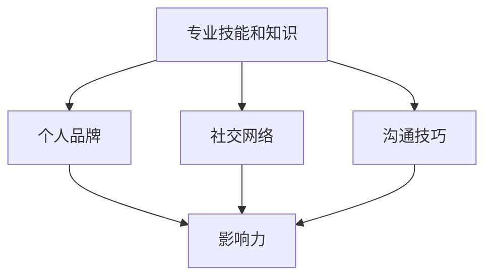

                 

### 文章标题

# 个人影响力与社会责任：现代公民的双重身份

### 关键词

- 个人影响力
- 社会责任
- 现代公民
- 品牌塑造
- 演讲与沟通
- 公民身份

### 摘要

本文旨在探讨个人影响力与社会责任在现代公民身份中的双重角色及其相互关系。文章首先介绍了个人影响力的构成要素和重要性，探讨了如何通过个人品牌塑造、社交网络建设以及演讲与沟通技巧提升个人影响力。随后，文章阐述了社会责任的概念、分类及其现实意义，并探讨了公民身份与责任的关系。在此基础上，文章分析了个人影响力与社会责任的融合，以及如何在实践中体现这一融合。最后，文章对未来个人影响力与社会责任的发展趋势进行了展望，并提出了一系列最佳实践建议。通过本文的探讨，读者可以更深刻地理解个人影响力与社会责任的内在联系，以及如何在现代社会中实现双重身份的有效融合。

---

## 引言

在当今社会，个人影响力与社会责任已经成为了现代公民身份中不可或缺的两个方面。个人影响力指的是一个人在特定领域或社会中的影响力，它不仅体现了个人在专业领域的卓越能力，还反映了个人在社会中的地位和声誉。社会责任则是指个人在社会中的义务和责任，包括遵守法律法规、维护公共利益、参与公益活动等。这两者之间存在着紧密的联系，一个具有高度个人影响力的人，往往能够在履行社会责任方面发挥更大的作用。

个人影响力和社会责任的重要性不容忽视。首先，个人影响力是个人品牌的重要体现，它有助于提升个人的职业发展和社会地位。同时，个人影响力还能够为社会组织和公益事业带来积极影响，推动社会进步。其次，社会责任是现代公民的基本要求，它体现了一个人对社会的责任感和担当。通过履行社会责任，个人不仅能够获得社会认同，还能促进社会的和谐与稳定。

本文将从以下几个方面展开讨论：首先，介绍个人影响力的构成要素和提升方法；其次，阐述社会责任的概念和分类；然后，探讨个人影响力与社会责任的融合及其实现途径；接着，分析个人影响力与社会责任的实践案例；最后，展望未来个人影响力与社会责任的发展趋势，并提出最佳实践建议。

### 个人影响力的构成要素

个人影响力是一个复杂的概念，它由多个要素构成。这些要素不仅涵盖了个人的专业技能和知识，还包括了个人品牌、社交网络和沟通技巧等。了解这些要素及其相互关系，有助于我们更全面地理解个人影响力的构建。

首先，专业技能和知识是个人影响力的基础。一个人在特定领域的专业水平和知识储备，决定了其在该领域的专业地位和影响力。专业技能和知识的积累需要通过不断的学习和实践来实现。无论是从事技术工作还是管理岗位，拥有扎实的专业能力和丰富的行业知识，都是构建个人影响力的关键。

其次，个人品牌是个人影响力的重要体现。个人品牌不仅仅是一个人的名字，更是一种社会认知和评价。它包含了个人在公众眼中的形象、专业领域的声誉以及个人价值观的传播。一个良好的个人品牌能够增加个人在职场和社会中的影响力，使其成为行业内的标杆人物。

社交网络则是个人影响力的重要载体。通过有效的社交网络建设，个人可以接触到更多的资源、信息和人脉，从而扩大自己的影响力范围。社交网络不仅包括线上社交媒体，如LinkedIn、微博等，还包括线下的人脉网络，如行业会议、研讨会等。建立和维护一个强大的社交网络，需要持续的努力和投入。

沟通技巧则是个人影响力的重要保障。良好的沟通技巧包括演讲技巧、写作能力、人际交往能力等。一个善于沟通的人，能够更有效地传达自己的观点和想法，建立良好的人际关系，从而增强个人影响力。

以下是个人影响力构成要素之间的关系架构图，使用Mermaid语言进行描述：

从图中可以看出，专业技能和知识是个人影响力的基础，而个人品牌、社交网络和沟通技巧则是对其的补充和扩展。这三者相互作用，共同构成了个人影响力的整体架构。

在提升个人影响力的过程中，我们可以采取以下策略：

1. **持续学习和实践**：不断提升自己的专业技能和知识，保持对行业动态的敏感度。
2. **塑造个人品牌**：通过媒体、社交平台等渠道传播自己的专业知识和价值观，树立良好的个人形象。
3. **建立和维护社交网络**：积极参与行业活动，扩展人脉，建立多层次的社交网络。
4. **提升沟通技巧**：通过学习和实践，提高自己的演讲、写作和人际交往能力。

通过这些策略，个人可以在不同层面上提升自己的影响力，从而在职场和社会中取得更大的成功。

### 社会责任的概念与内涵

社会责任是指个人或组织在社会中承担的义务和责任，它涵盖了遵守法律法规、维护公共利益、参与公益活动等多个方面。社会责任不仅体现了个人或组织对社会的尊重和担当，也是现代社会发展的重要基石。理解社会责任的概念和内涵，有助于我们更好地履行这一角色。

首先，社会责任的基本定义可以从以下几个方面来阐述：

1. **法律层面的责任**：个人和组织必须遵守国家法律和法规，不违反法律法规是社会责任的基本要求。这不仅包括遵守劳动法、合同法等，还涉及环境保护法、消费者权益保护法等相关法律法规。

2. **道德层面的责任**：道德责任是指个人和组织在行为过程中应遵循的道德准则。例如，诚实守信、公平竞争、保护消费者权益等。道德责任超越了法律的要求，强调个人和组织的道德自律和道德修养。

3. **社会贡献的责任**：个人和组织应积极参与社会公益活动，回馈社会，推动社会进步。这包括捐赠慈善、参与社会服务、支持教育事业等。通过这些活动，个人和组织可以增强社会认同感，提升自身的社会影响力。

社会责任的分类可以从以下几个方面进行探讨：

1. **经济责任**：组织作为经济主体，应通过合法合规的经营行为，为社会创造经济价值，促进经济发展。这包括提供就业机会、实现企业社会责任报告、遵守经济法规等。

2. **法律责任**：个人和组织必须遵守国家法律和法规，包括环境保护法、劳动法、消费者权益保护法等。法律责任是社会责任的核心内容，也是维护社会秩序和公正的重要保障。

3. **道德责任**：个人和组织在行为过程中应遵循道德准则，诚信经营，公平竞争，保护消费者权益。道德责任体现了个人和组织的道德自律，是社会和谐发展的基础。

4. **社会责任**：个人和组织应积极参与社会公益活动，回馈社会，推动社会进步。这包括捐赠慈善、支持教育、参与环境保护等。社会责任是体现组织和社会责任感的重要方面，也是提升组织品牌价值的重要途径。

社会责任的现实意义主要体现在以下几个方面：

1. **维护社会稳定**：通过履行社会责任，个人和组织可以维护社会稳定，减少社会矛盾和冲突。这有助于构建和谐社会，提高社会的整体幸福指数。

2. **提升企业品牌价值**：积极履行社会责任的企业，往往能够获得良好的社会声誉，提升品牌价值。这有助于企业在市场竞争中脱颖而出，吸引更多的客户和投资者。

3. **推动社会进步**：个人和组织通过参与社会公益活动，可以推动社会进步，促进社会公平和正义。这有助于构建一个更加公正、平等的社会环境。

4. **实现可持续发展**：履行社会责任是可持续发展的重要保障。个人和组织通过合法合规的经营行为，保护环境，节约资源，可以促进社会的可持续发展。

总之，社会责任是现代社会发展的重要基石，它不仅体现了个人和组织的道德担当，也是维护社会稳定和推动社会进步的重要力量。理解社会责任的概念和内涵，有助于我们更好地履行这一角色，为社会做出积极贡献。

### 公民身份与责任

公民身份是一个法律和道德概念，它不仅规定了个人在国家中的权利，还规定了个人对国家的义务。在现代社会，公民身份不仅仅是法律身份的标志，更是个人责任和参与社会事务的基础。

首先，公民身份的定义涉及多个方面。从法律角度来看，公民身份是指一个人依法享有国家权利和承担国家义务的身份。这包括但不限于选举权、被选举权、参与公共服务等。从道德角度来看，公民身份则意味着个人在社会中的责任感和参与度。一个真正的公民不仅享有权利，更承担着维护社会秩序、推动社会进步的责任。

公民权利是公民身份的重要组成部分。这些权利包括但不限于：

1. **言论自由**：公民有权表达自己的观点和意见，不受不当限制。
2. **选举权和被选举权**：公民有权参与国家政治事务，通过选举产生代表。
3. **受教育权**：公民有权接受教育，提高自身素质。
4. **财产权**：公民有权合法拥有和支配财产。

这些权利保障了公民在法律和社会中的地位，使其能够积极参与国家和社会事务。

与之相对应的是公民义务，这些义务是公民对国家的责任和承诺。公民义务包括但不限于：

1. **遵守法律**：公民必须遵守国家法律法规，不得违反。
2. **纳税**：公民有义务按时缴纳各种税款，支持国家公共事务。
3. **服兵役**：根据法律规定，公民有义务参与国防和国家安全事务。
4. **参与社会事务**：公民应积极参与社会公益活动，维护社会秩序和公共利益。

公民责任不仅是一种法律要求，更是一种道德担当。履行公民责任，是每一个公民应尽的基本义务，也是维护国家和社会稳定的重要保障。

在实际生活中，公民责任体现在多个方面。例如，在疫情期间，公民有责任遵守防疫措施，减少社会传播风险；在社会治理中，公民有责任参与社区管理，共同维护社区秩序。此外，积极参与社会公益活动，也是公民责任的重要体现。通过这些行为，公民不仅履行了社会责任，也促进了社会的和谐与进步。

总之，公民身份与责任是现代公民生活中不可或缺的两个方面。理解并履行公民权利和义务，不仅有助于个人的成长和发展，也有助于构建一个更加公正、和谐的社会。每一个公民都应认识到自己在社会中的责任，积极履行自己的义务，共同推动社会的进步和发展。

### 个人影响力与社会责任的融合

个人影响力与社会责任的融合是现代公民在当今社会中必须面对的课题。个人影响力不仅是个体在专业领域和社交网络中的表现，更是其承担社会责任的重要手段。通过将个人影响力与社会责任相结合，个体不仅能够在个人成长和职业发展中获得优势，还能为社会进步和公共福祉做出更大贡献。

首先，个人影响力可以通过多种方式体现社会责任。例如，一位技术专家可以通过撰写专业博客、发表学术论文或参加技术会议，不仅提升了自己的专业声誉，还能为行业内的新手提供学习资源，推动整个技术领域的发展。此外，通过社交媒体平台分享有价值的信息和见解，个人可以在更广泛的公众中传播正面价值观，引导社会舆论向积极方向转变。

其次，社会责任可以增强个人影响力的深度和广度。一个积极参与公益活动的企业家，不仅能够通过实际行动改善社会问题，还能赢得公众的尊重和信任，提升个人品牌价值。这种社会责任的履行，不仅是对个人影响力的扩展，也是对社会责任的深刻实践。

以下是个人影响力与社会责任融合的一个具体案例：

**案例：环保倡导者马云**

马云，作为中国阿里巴巴集团的创始人，不仅在商业领域取得了巨大成功，还在环保和社会责任方面做出了卓越贡献。他通过阿里巴巴平台推出了“绿色物流”计划，鼓励商家和消费者使用环保包装和运输方式，减少碳排放。此外，马云还积极参与教育公益，成立了马云公益基金会，致力于支持教育发展和农村扶贫项目。

这个案例展示了个人影响力与社会责任的融合：首先，马云通过其在商业领域的成就和影响力，推动了一系列环保和公益项目，实现了个人影响力向社会责任的转变。其次，通过这些项目，马云不仅提升了个人品牌，还为社会带来了积极影响，赢得了公众的广泛认可。

在个人影响力与社会责任的融合过程中，以下几点是值得关注的：

1. **明确目标**：个人应明确自己的社会责任目标，将其与个人职业发展和生活规划相结合，确保社会责任的实现不会影响到个人发展的主轴。

2. **持续行动**：社会责任的履行需要持续的行动和实践。个人应制定具体的行动计划，并通过长期的努力来逐步实现目标。

3. **公众参与**：个人影响力的扩大离不开公众的支持和参与。通过社交媒体、公益活动等方式，个人可以吸引更多的公众关注和参与，共同推动社会进步。

4. **合作与协同**：社会责任的实现往往需要多方合作。个人应积极参与到各类社会组织和公益项目中，与其他利益相关者协同合作，形成合力。

总之，个人影响力与社会责任的融合是现代公民实现自我价值和社会价值的重要途径。通过这种融合，个人不仅能够在职业和生活中取得成功，还能为社会的和谐与进步贡献力量。在未来的发展中，越来越多的个人将认识到这一融合的重要性，并将其作为自己成长和发展的核心动力。

### 个人影响力与社会责任的实践

在实践中，个人影响力与社会责任的融合不仅是一种理念，更是一种具体行动。以下将结合实际案例，详细探讨如何在具体情境中实现这一融合，并提供实用的方法和策略。

**案例一：技术专家的公益之路**

李明是一位知名的技术专家，专注于人工智能领域。他在业余时间创办了一个线上技术社区，为新手提供学习资源和技术支持。李明意识到，通过这个平台，他不仅可以提升自己的影响力，还能为社会做出贡献。他制定了详细的计划，定期发布技术文章、组织线上研讨会，并邀请行业内的专家进行分享。此外，他还通过社区筹集资金，资助了一些贫困学生参加在线课程，帮助他们实现技术梦想。这一系列行动不仅提升了李明的个人影响力，还促进了技术教育的普及和公平。

**实践方法与策略：**
1. **建立专业平台**：通过建立专业平台或社区，个人可以集中展示自己的专业知识，吸引同行业人士的关注和参与。
2. **定期内容更新**：保持持续的内容输出，分享专业见解和经验，提升个人品牌影响力。
3. **公益活动结合**：将公益活动与个人影响力相结合，通过平台筹集资金或资源，支持社会公益项目。

**案例二：企业家的环保行动**

张总是一位成功的创业者，他在企业发展的同时，也积极参与环保事业。他发现，通过环保行动，不仅可以提升企业的社会形象，还能为企业赢得更多的客户和投资者。因此，张总在企业内部推行了一系列环保措施，如采用绿色能源、减少废弃物的产生等。同时，他还发起了一个环保基金，支持环保项目的实施。张总通过公开演讲和社交媒体，宣传环保理念，号召更多人参与环保行动。这一系列实践不仅增强了企业的社会责任感，也提升了张总的个人影响力。

**实践方法与策略：**
1. **内部环保措施**：在企业内部推行环保措施，如使用绿色能源、减少废弃物的产生等，提升企业的环保形象。
2. **外部宣传**：通过公开演讲、媒体报道等渠道，宣传企业的环保理念和实践，提升企业的社会影响力。
3. **设立环保基金**：通过设立环保基金，支持环保项目的实施，扩大个人和社会的影响力。

**案例三：公益活动的组织者**

王女士是一位公益活动的组织者，她利用自己的社交网络和专业技能，推动了一系列公益活动。例如，她通过社交媒体发起了一项针对贫困地区的教育支持计划，呼吁公众捐赠学习用品和资金。她还组织了一系列公益活动，如环保志愿行动、扶贫义卖等，吸引了大量志愿者和捐助者的参与。王女士通过这些活动，不仅提升了自己的影响力，还为社会做出了积极贡献。

**实践方法与策略：**
1. **利用社交网络**：通过社交媒体等渠道宣传公益活动，吸引更多的公众关注和参与。
2. **组织多方合作**：与相关机构、企业和社会团体合作，形成合力，推动公益项目的实施。
3. **持续活动跟进**：对公益活动进行持续跟进和评估，确保项目目标的实现和社会影响的持续。

**实践中的挑战与应对：**

1. **资源限制**：在实践过程中，个人和组织可能会面临资源限制，如资金不足、人手不足等。解决方法包括寻求外部支持，如捐赠、合作等，以及优化内部资源管理，提高效率。

2. **社会认可度**：社会认可度是实践个人影响力与社会责任的重要一环。提高社会认可度的方法包括透明公开活动过程、及时反馈活动成果，以及通过媒体报道等途径提升影响力。

3. **持续性和影响力**：确保活动的持续性和影响力是一个挑战。解决方法包括建立长期规划，确保活动的持续性；通过多样化的活动形式和内容，保持公众的兴趣和参与度。

总之，个人影响力与社会责任的实践需要具体的行动和策略。通过实际案例的分析，我们可以看到，个人可以通过专业平台、环保行动和公益活动等多种方式，实现个人影响力与社会责任的融合，为社会做出积极贡献。在实践中，持续的努力和创新的思维是关键，只有不断探索和改进，才能在实现个人价值的同时，推动社会的进步和发展。

### 个人影响力与社会责任的未来

展望未来，个人影响力与社会责任将在全球化、技术进步和气候变化等多重背景下发生深刻变革。随着信息技术的飞速发展，个人影响力将更加数字化和全球化。社交媒体、人工智能和大数据分析将使个人能够更有效地传播自己的声音，扩大影响力范围。同时，社会责任也将更加多元化和复杂化，要求个人在道德、环境和社会治理等多个层面承担责任。

首先，全球化趋势将促使个人影响力跨越国界，国际事务和社会问题将更多地向个人领域渗透。个人需要具备跨文化交流能力和全球视野，以应对全球化带来的挑战和机遇。在这种背景下，个人影响力不仅体现在专业领域，还体现在对国际事务的关注和参与。

其次，技术的进步将极大地影响个人影响力和社会责任的实现方式。人工智能和大数据技术的应用，将使个人能够更精准地分析社会需求，制定更有效的解决方案。例如，通过数据分析，个人可以更有效地分配公益资源，提高公益活动的效率。同时，技术进步也将为个人提供更多的工具和平台，如虚拟现实（VR）和增强现实（AR），以更生动的方式传播社会责任理念。

此外，气候变化和环境保护将成为未来个人影响力和社会责任的重要议题。随着全球变暖和环境恶化问题的日益严重，个人将面临更多的环保责任。个人可以通过倡导绿色生活方式、参与环保行动和推动绿色技术创新等方式，为环境保护贡献力量。此外，社会责任也将更加注重可持续发展，要求个人在职业和生活选择中考虑环境和社会影响。

未来，个人影响力与社会责任的融合将更加紧密。随着社会对个人社会责任期望的提升，个人需要将社会责任融入到个人品牌建设和职业发展中。这不仅有助于个人实现自我价值，还能推动社会的进步和和谐。以下是未来个人影响力与社会责任融合的一些发展趋势：

1. **可持续影响力**：个人将更加注重影响力的可持续性，通过长期规划和持续行动，实现个人影响力与社会责任的平衡。

2. **多元责任体系**：个人将承担更加多元的社会责任，包括环境保护、社会公益、文化传承等多个方面。

3. **技术驱动**：技术进步将为个人提供更多工具和平台，实现社会责任的目标。例如，区块链技术可以确保公益资金的透明和可追溯。

4. **全球合作**：全球化和技术进步将促使个人在更广泛的范围内参与国际事务，推动全球合作，共同应对全球挑战。

5. **数字化公民**：随着数字技术的发展，个人将更加数字化，成为“数字化公民”。通过数字平台，个人可以更便捷地参与社会事务，实现个人影响力与社会责任的融合。

总之，未来个人影响力与社会责任将面临诸多挑战和机遇。个人需要不断适应和应对这些变化，通过技术创新、多元化责任体系和全球合作，实现个人价值和社会价值的双重提升。

### 最佳实践 tips、小结、注意事项、拓展阅读

#### 最佳实践 tips

1. **持续学习和提升**：不断学习和提升专业技能，是构建个人影响力的基础。通过阅读专业书籍、参加在线课程和行业研讨会，保持对最新行业动态的敏感度。
2. **塑造个人品牌**：通过社交媒体、专业平台和公开演讲等方式，塑造个人品牌，传播专业知识和价值观。
3. **积极参与社会活动**：参与公益活动和社会事务，不仅有助于提升个人影响力，还能为社会做出实际贡献。
4. **建立有效社交网络**：积极参与行业会议、社交活动，建立和维护广泛的社交网络，以获取更多资源和机会。

#### 小结

本文通过探讨个人影响力与社会责任的构建、内涵、融合及实践，揭示了现代公民在双重身份中的责任与挑战。个人影响力不仅是职业发展的助推器，更是履行社会责任的重要手段。通过持续学习和实践，个人可以在提升影响力的同时，为社会做出积极贡献。

#### 注意事项

1. **平衡个人发展与社会责任**：在追求个人影响力的同时，不要忽视社会责任的履行，保持个人发展的社会责任感。
2. **诚信为本**：在构建个人品牌和影响力时，要诚信为本，不夸大事实，不误导公众。
3. **持续反思和改进**：定期反思个人影响力和社会责任的实践效果，不断改进方法，以更好地适应社会需求。

#### 拓展阅读

1. **《影响力：不可抗拒的社会科学》** - Robert B. Cialdini
2. **《企业的社会责任》** - Edward Freeman
3. **《数字化时代的个人影响力》** - David Meerman Scott
4. **《公民责任》** - Michael J. Sandel

### 作者信息

作者：AI天才研究院/AI Genius Institute & 禅与计算机程序设计艺术 /Zen And The Art of Computer Programming

