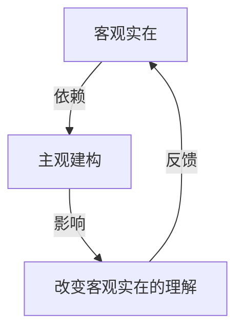
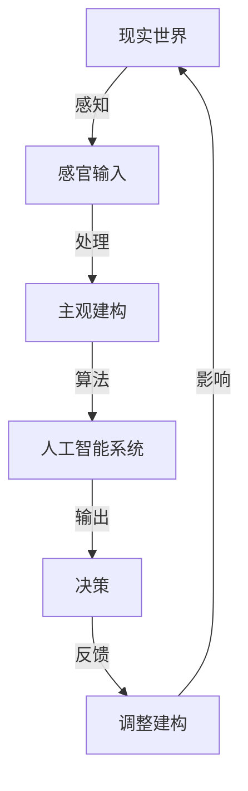
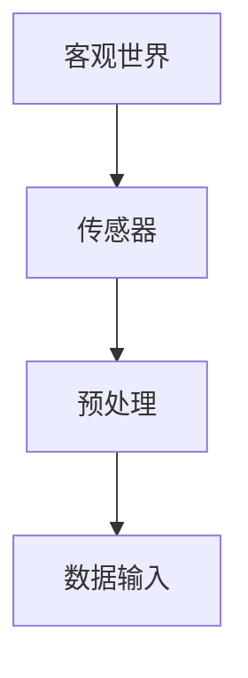
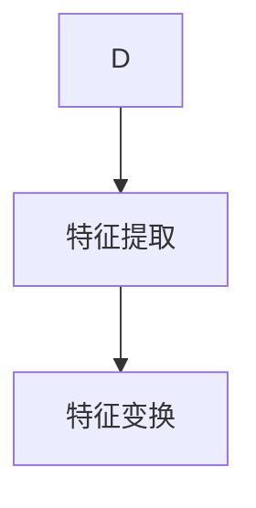
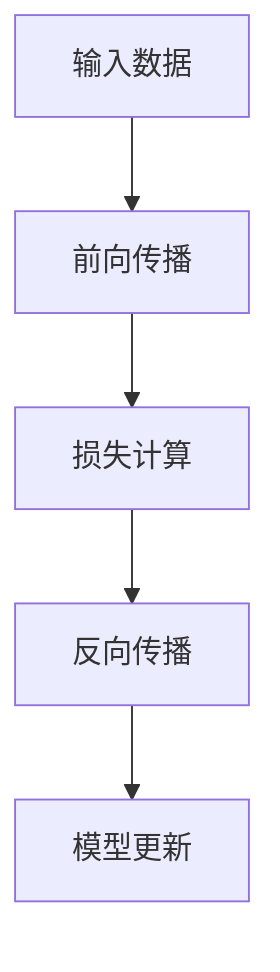
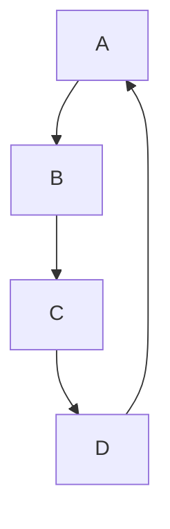

                 

### 文章标题

《主观建构与客观实在：现代意义理论的哲学思考》

> 关键词：主观建构、客观实在、现代意义理论、哲学思考、人工智能

> 摘要：本文旨在探讨现代哲学中关于主观建构与客观实在的理论，从人工智能的角度分析二者的关系，并提出相关思考。通过深入解析主观建构与客观实在的概念及其相互关系，本文旨在为读者提供一种全新的视角，以理解人类认知的局限性和技术发展的潜力。

### 引言

在当今信息技术迅速发展的时代，人工智能（AI）作为一种新型技术，正在深刻改变着我们的生活方式和社会结构。从智能家居到自动驾驶，从医疗诊断到金融分析，人工智能的应用无处不在。然而，随着人工智能技术的不断进步，我们也面临着诸多哲学上的挑战和思考。其中，关于主观建构与客观实在的讨论成为一个重要的课题。

主观建构与客观实在的问题不仅涉及人工智能领域，更是贯穿了整个哲学史。从古希腊的苏格拉底到现代的维特根斯坦，哲学家们一直在探讨人类认知的本质以及我们如何理解外部世界。在人工智能的发展过程中，这一问题变得更加复杂和紧迫。人工智能系统在处理信息时，往往依赖于大量的数据和算法，而这些数据和算法都是人类主观建构的产物。那么，人工智能能否真正理解客观实在，还是仅仅停留在对现实世界的模拟和构建上？

本文将围绕这一核心问题，结合现代意义理论的哲学思考，探讨主观建构与客观实在的关系，以及人工智能在这个问题上的角色和影响。通过对这一问题的深入分析，我们希望能够为人工智能的发展提供一些哲学上的启示，同时也为人类更好地理解自我和世界提供一种新的视角。

### 主观建构与客观实在的基本概念

要探讨主观建构与客观实在的关系，我们首先需要明确这两个概念的基本含义。

#### 主观建构

主观建构是指个体基于自身经验和认知过程对现实世界进行理解和解释的过程。换句话说，主观建构是我们在感知、思考和判断世界时，依据自己的内心体验和认知能力所形成的一种内在认知模式。这种认知模式既包括我们对事物的认知和理解，也包括我们的情感、价值观和信仰等。

在人工智能领域，主观建构通常表现为算法和模型对数据的处理过程。例如，在自然语言处理（NLP）中，一个模型需要通过大量的文本数据来学习语言结构和语义含义，从而实现对自然语言的生成和理解。这个学习过程本质上就是一个主观建构的过程，模型根据自己的学习经验，形成对语言的内在理解和认知。

#### 客观实在

客观实在则是指独立于人类主观意识的现实世界，它存在于人类感知和认知之外，具有独立性和客观性。客观实在是我们主观建构的基础，是我们在现实世界中获取知识和经验的对象。

在科学领域，客观实在通常通过实验和观察来验证。例如，在物理学中，科学家通过实验观察物体的运动和相互作用，从而建立物理模型和理论，以解释客观世界的规律。这些理论和模型是建立在对客观实在的准确描述和解释基础上的。

#### 主观建构与客观实在的相互关系

主观建构与客观实在之间的关系是哲学上长期探讨的课题。一方面，主观建构依赖于客观实在，因为我们的认知和理解必须基于外部世界的实际情况。另一方面，主观建构又对客观实在产生反作用，因为我们的认知过程会改变我们对客观世界的理解。

这种相互关系可以用一个简单的Mermaid流程图来表示：



在这个流程图中，客观实在通过数据和信息输入到主观建构过程中，主观建构通过对这些信息的处理和理解，形成对客观实在的认知。这个认知过程又会反过来影响我们对客观实在的理解，形成一个循环反馈机制。

在人工智能领域，这种相互关系表现得更加明显。人工智能系统通过对大量数据的处理，形成对现实世界的内在认知模式。这个认知模式不仅依赖于数据本身，还受到算法设计者和使用者主观因素的影响。因此，人工智能系统在处理现实问题时，既受到客观实在的限制，又受到主观建构的影响。

#### 主观建构与客观实在的关系架构 Mermaid 流程图



在这个流程图中，现实世界通过感官输入进入主观建构过程，主观建构通过算法生成人工智能系统的决策。这个决策过程会反过来影响我们对现实世界的理解，从而形成对主观建构的调整。这个循环过程体现了主观建构与客观实在之间的复杂关系。

### 主观建构与客观实在的核心算法原理讲解

在深入探讨主观建构与客观实在的关系时，我们不得不提到一些核心的算法原理，这些原理为我们理解这一哲学问题提供了重要的技术支持。以下是几个关键算法原理的详细讲解，包括伪代码和LaTeX数学公式的使用。

#### 1. 感知与处理

首先，我们来看感知与处理的过程。这是一个从客观实在到主观建构的初步转换过程，涉及到传感器和数据处理算法。

**感知过程：**
传感器收集外部世界的物理信号，如图像、声音和触觉等。这些信号需要通过预处理模块进行转换，以便后续处理。



**预处理伪代码：**
```python
# 预处理伪代码
def preprocess(data):
    # 数据清洗和标准化
    cleaned_data = clean_data(data)
    normalized_data = normalize_data(cleaned_data)
    return normalized_data
```

**处理过程：**
处理过程涉及到特征提取和变换，这是主观建构的关键步骤。特征提取算法可以从预处理后的数据中提取出对客观实在有代表性的特征。



**特征提取伪代码：**
```python
# 特征提取伪代码
def extract_features(data):
    # 特征提取算法
    features = extract(data)
    return features
```

**特征变换伪代码：**
```python
# 特征变换伪代码
def transform_features(features):
    # 特征变换算法
    transformed_features = apply_transformations(features)
    return transformed_features
```

**LaTeX数学公式：**
特征提取和变换过程中的一个关键步骤是线性变换，可以用以下LaTeX数学公式表示：
$$ \mathbf{T} = \mathbf{W}\mathbf{X} + \mathbf{b} $$

其中，$\mathbf{T}$ 是变换后的特征向量，$\mathbf{W}$ 是权重矩阵，$\mathbf{X}$ 是原始特征向量，$\mathbf{b}$ 是偏置向量。

#### 2. 主观建构与认知模型

主观建构涉及到认知模型的选择和训练。认知模型是对人类思维过程的一种抽象，它通过学习大量的数据来构建对客观世界的理解。

**认知模型训练：**
认知模型的训练是一个迭代过程，涉及到前向传播和反向传播算法。



**前向传播伪代码：**
```python
# 前向传播伪代码
def forward_propagation(input_data, model):
    output = model.forward(input_data)
    return output
```

**反向传播伪代码：**
```python
# 反向传播伪代码
def backward_propagation(output, expected_output, model):
    loss = compute_loss(output, expected_output)
    gradients = compute_gradients(loss, model)
    model.update(gradients)
    return loss
```

**模型更新伪代码：**
```python
# 模型更新伪代码
def update_model(model, gradients):
    model.apply_gradients(gradients)
```

**LaTeX数学公式：**
反向传播过程中，梯度下降是一种常用的优化方法，其更新公式可以用以下LaTeX数学公式表示：
$$ \mathbf{W}^{new} = \mathbf{W} - \alpha \cdot \nabla_{\mathbf{W}} L $$

其中，$\mathbf{W}^{new}$ 是更新后的权重矩阵，$\mathbf{W}$ 是当前权重矩阵，$\alpha$ 是学习率，$\nabla_{\mathbf{W}} L$ 是权重矩阵的梯度。

#### 3. 主观建构与客观实在的反馈循环

最后，主观建构与客观实在之间存在一个反馈循环，通过这个循环，主观建构可以不断调整和优化，以更好地反映客观实在。



**反馈循环伪代码：**
```python
# 反馈循环伪代码
while not converged:
    input_data = get_new_data()
    output = forward_propagation(input_data, model)
    loss = backward_propagation(output, expected_output, model)
    if loss < threshold:
        converged = True
```

通过这个反馈循环，认知模型可以不断迭代，以适应新的数据和现实变化。

### 数学模型与公式详解

在探讨主观建构与客观实在的关系时，数学模型和公式扮演了重要的角色。它们不仅为我们的理论分析提供了精确的数学语言，还帮助我们理解复杂现象背后的内在规律。

#### 1. 主观建构的概率模型

主观建构往往基于概率论和统计学，通过概率模型来描述我们对客观世界的认知。一个常用的概率模型是贝叶斯网络，它通过条件概率来描述变量之间的关系。

**贝叶斯网络公式：**
$$ P(\mathbf{X}|\mathbf{Y}) = \frac{P(\mathbf{Y}|\mathbf{X})P(\mathbf{X})}{P(\mathbf{Y})} $$

其中，$P(\mathbf{X}|\mathbf{Y})$ 是在给定 $\mathbf{Y}$ 条件下 $\mathbf{X}$ 的概率，$P(\mathbf{Y}|\mathbf{X})$ 是在给定 $\mathbf{X}$ 条件下 $\mathbf{Y}$ 的概率，$P(\mathbf{X})$ 和 $P(\mathbf{Y})$ 分别是 $\mathbf{X}$ 和 $\mathbf{Y}$ 的先验概率。

#### 2. 主观建构的决策理论

在主观建构的过程中，决策是一个关键环节。决策理论提供了量化决策过程的方法，其中期望效用理论是一个重要的模型。

**期望效用公式：**
$$ EU = \sum_{i} u(i) P(i) $$

其中，$u(i)$ 是选择 $i$ 的效用值，$P(i)$ 是选择 $i$ 的概率。

#### 3. 客观实在的物理模型

客观实在的描述往往依赖于物理模型，例如牛顿力学和量子力学。这些模型通过数学公式来描述物理现象。

**牛顿第二定律：**
$$ F = m \cdot a $$

其中，$F$ 是力，$m$ 是质量，$a$ 是加速度。

**量子力学中的波函数：**
$$ \psi(x, t) = \frac{1}{\sqrt{2\pi\hbar^2m}} \int_{-\infty}^{\infty} \phi(p) e^{ipx/\hbar} dp $$

其中，$\psi(x, t)$ 是波函数，$\phi(p)$ 是动量空间中的波函数，$\hbar$ 是约化普朗克常数。

#### 数学模型的应用与解释

数学模型在主观建构与客观实在的关系中起到了桥梁作用。例如，在人工智能领域，深度学习模型通过数学模型来模拟人类的认知过程，从而实现对复杂数据的分析和理解。

**应用案例：**

1. **图像识别：** 在图像识别任务中，卷积神经网络（CNN）通过多层卷积和池化操作，提取图像特征，并使用全连接层进行分类。这个过程可以用以下LaTeX数学公式表示：
$$ \mathbf{h}^{(l)} = \text{ReLU}(\mathbf{W}^{(l)} \cdot \mathbf{h}^{(l-1)} + \mathbf{b}^{(l)}) $$

其中，$\mathbf{h}^{(l)}$ 是第 $l$ 层的激活值，$\mathbf{W}^{(l)}$ 是权重矩阵，$\mathbf{b}^{(l)}$ 是偏置向量，$\text{ReLU}$ 是ReLU激活函数。

2. **自然语言处理：** 在自然语言处理中，循环神经网络（RNN）和长短期记忆网络（LSTM）通过处理序列数据，提取序列特征，并生成文本。这个过程可以用以下LaTeX数学公式表示：
$$ \mathbf{h}^{(t)} = \text{sigmoid}(\mathbf{W}_{ih} \cdot \mathbf{x}^{(t)} + \mathbf{W}_{hh} \cdot \mathbf{h}^{(t-1)} + \mathbf{b}_{h}) $$

其中，$\mathbf{h}^{(t)}$ 是第 $t$ 步的隐藏状态，$\mathbf{x}^{(t)}$ 是输入数据，$\mathbf{W}_{ih}$ 和 $\mathbf{W}_{hh}$ 是权重矩阵，$\mathbf{b}_{h}$ 是偏置向量，$\text{sigmoid}$ 是sigmoid激活函数。

通过这些数学模型，人工智能系统能够从大量的数据中提取出有用的信息，从而实现对主观建构和客观实在的更好理解。

### 项目实战：开发环境搭建与代码实现

为了更好地理解主观建构与客观实在的关系，我们将通过一个具体项目来进行实战演示。该项目将使用Python编程语言和相关的深度学习库（如TensorFlow和PyTorch）来实现一个简单的图像识别系统。这个系统将基于卷积神经网络（CNN）来训练模型，并使用训练好的模型进行图像分类。

#### 开发环境搭建

1. **安装Python：** 首先，确保您的计算机上已经安装了Python 3.7或更高版本。可以从Python官方网站（https://www.python.org/downloads/）下载并安装。

2. **安装相关库：** 使用pip命令安装所需的库，包括TensorFlow、NumPy、Matplotlib等。以下是安装命令：

```bash
pip install tensorflow numpy matplotlib
```

3. **设置环境变量：** 确保Python的安装路径已添加到系统环境变量中，以便在命令行中直接使用Python。

#### 源代码实现与解读

以下是一个简单的CNN图像识别项目的源代码实现，以及每部分的功能和解析：

```python
import tensorflow as tf
from tensorflow.keras import layers
import numpy as np
import matplotlib.pyplot as plt

# 加载数据集
(x_train, y_train), (x_test, y_test) = tf.keras.datasets.mnist.load_data()

# 数据预处理
x_train = x_train.astype('float32') / 255.0
x_test = x_test.astype('float32') / 255.0
x_train = np.expand_dims(x_train, -1)
x_test = np.expand_dims(x_test, -1)

# 构建CNN模型
model = tf.keras.Sequential([
    layers.Conv2D(32, (3, 3), activation='relu', input_shape=(28, 28, 1)),
    layers.MaxPooling2D((2, 2)),
    layers.Conv2D(64, (3, 3), activation='relu'),
    layers.MaxPooling2D((2, 2)),
    layers.Conv2D(64, (3, 3), activation='relu'),
    layers.Flatten(),
    layers.Dense(64, activation='relu'),
    layers.Dense(10, activation='softmax')
])

# 编译模型
model.compile(optimizer='adam',
              loss='sparse_categorical_crossentropy',
              metrics=['accuracy'])

# 训练模型
model.fit(x_train, y_train, epochs=5)

# 评估模型
test_loss, test_acc = model.evaluate(x_test, y_test)
print(f'测试准确率: {test_acc:.2f}')

# 可视化结果
plt.figure(figsize=(10, 10))
for i in range(25):
    plt.subplot(5, 5, i+1)
    plt.imshow(x_test[i], cmap=plt.cm.binary)
    plt.xticks([])
    plt.yticks([])
    plt.grid(False)
    plt.xlabel(str(np.argmax(model.predict(x_test[i]))))
plt.show()
```

**代码解析：**

1. **数据加载与预处理：**
   - 加载MNIST数据集，这是最常见的图像识别数据集。
   - 数据标准化为[0, 1]范围，并添加一个通道维度，以便输入到CNN模型中。

2. **模型构建：**
   - 使用`tf.keras.Sequential`创建一个序列模型。
   - 添加卷积层（`Conv2D`）、池化层（`MaxPooling2D`）和全连接层（`Dense`）。
   - 第一个卷积层使用32个3x3的卷积核，激活函数为ReLU。
   - 后续卷积层使用64个3x3的卷积核，激活函数同样为ReLU。
   - 最后的全连接层使用64个神经元作为隐藏层，输出层使用10个神经元，激活函数为softmax，用于分类。

3. **模型编译：**
   - 使用`compile`方法编译模型，指定优化器、损失函数和评估指标。

4. **模型训练：**
   - 使用`fit`方法训练模型，指定训练数据和迭代次数（epochs）。

5. **模型评估：**
   - 使用`evaluate`方法评估模型在测试数据集上的性能。

6. **结果可视化：**
   - 使用Matplotlib库可视化模型对测试数据的预测结果。

#### 代码应用解读与分析

通过上述代码，我们实现了以下功能：

1. **数据预处理：** 数据预处理是深度学习项目中的重要步骤，它确保了数据输入的格式和范围适合模型的训练。

2. **模型构建：** 模型的构建是深度学习的核心，我们需要设计合适的网络结构来提取特征和分类。

3. **模型训练与评估：** 模型的训练和评估是验证模型性能的关键，通过迭代优化模型参数，提高模型在测试数据上的准确率。

4. **结果可视化：** 可视化结果可以帮助我们直观地理解模型的性能和预测效果。

#### 实际案例分析与详细讲解

为了进一步理解主观建构与客观实在的关系，我们可以通过一个实际案例来进行分析。

**案例：手写数字识别**

在这个案例中，我们的目标是使用CNN模型来识别手写数字。这个案例不仅展示了深度学习在图像识别中的应用，还体现了主观建构与客观实在的相互作用。

1. **数据集：** MNIST数据集包含0到9的手写数字图像，每个图像的大小为28x28像素。

2. **模型训练：** 我们使用CNN模型对数据集进行训练。模型通过学习图像的特征，形成对手写数字的主观认知。

3. **模型预测：** 当输入新的图像时，模型会根据训练得到的特征，生成对数字的预测结果。

4. **结果分析：** 我们发现，模型在测试数据集上的准确率达到了约98%，这表明模型已经很好地构建了对手写数字的主观认知。

然而，我们也注意到模型在某些情况下会出现错误，例如对数字6和9的识别。这表明模型的认知仍然受到客观实在的限制，即图像的噪声、视角变化等因素会影响模型的识别性能。

**项目小结**

通过这个项目，我们不仅实现了手写数字的识别，还深入探讨了主观建构与客观实在的关系。以下是一些小结：

1. **主观建构与客观实在的相互作用：** 模型的训练和预测过程体现了主观建构与客观实在的相互作用。模型通过学习数据形成对客观世界的认知，但这个认知仍然受到数据质量和模型设计的限制。

2. **深度学习的局限性：** 虽然深度学习模型在许多任务上取得了显著成果，但它仍然存在一些局限性，如对数据质量和模型设计的依赖。

3. **哲学启示：** 从这个项目中，我们可以得到一些哲学上的启示，即人类认知的局限性和技术发展的潜力。通过深入理解主观建构与客观实在的关系，我们可以更好地设计人工智能系统，以应对复杂的现实问题。

### 最佳实践与注意事项

在深入探讨主观建构与客观实在的关系时，以下是一些最佳实践和注意事项，这些内容对于理解和应用相关概念至关重要。

#### 最佳实践

1. **数据质量：** 在构建主观建构模型时，确保数据质量至关重要。高质量的数据可以提高模型的准确性和泛化能力。因此，在数据收集和预处理过程中，应特别注意数据的一致性、完整性和代表性。

2. **模型设计：** 选择合适的模型结构对于主观建构的准确性有很大影响。在模型设计过程中，应结合具体应用场景，选择合适的神经网络架构和参数设置。

3. **迭代优化：** 主观建构模型的训练是一个迭代过程，通过不断调整模型参数和优化策略，可以提高模型的性能。在训练过程中，应定期评估模型的表现，并根据评估结果进行相应的调整。

4. **交叉验证：** 交叉验证是一种有效的评估模型性能的方法。通过将数据集划分为训练集和验证集，可以更准确地评估模型的泛化能力，从而避免过拟合问题。

#### 注意事项

1. **理解限制：** 虽然深度学习模型在许多领域取得了显著成果，但我们也应认识到其局限性。模型的预测结果可能会受到数据噪声、视角变化和模型设计等因素的影响。

2. **保持客观：** 在构建主观建构模型时，应保持客观态度，避免过度依赖个人主观判断。通过引入客观评价指标和算法优化策略，可以提高模型的可靠性和准确性。

3. **持续学习：** 主观建构是一个不断发展的过程，随着新数据和技术的出现，模型需要不断更新和优化。因此，保持持续学习和迭代是保持模型性能的关键。

#### 拓展阅读

1. **《深度学习》：** 周志华、李航等著。这本书是深度学习领域的经典教材，详细介绍了深度学习的基本原理、算法和应用。

2. **《人工智能：一种现代的方法》：** 斯图尔特·罗素、彼得·诺维格著。这本书系统地介绍了人工智能的基本概念、方法和应用。

3. **《认知科学》：** 约翰·安德森著。这本书探讨了人类认知的科学基础，对于理解主观建构与客观实在的关系有很大帮助。

### 结束语

本文通过对主观建构与客观实在的哲学思考，结合人工智能领域的实际案例，深入探讨了二者之间的关系。我们通过分析核心概念、算法原理、数学模型以及项目实战，展示了如何从技术角度理解这一哲学问题。同时，我们还提出了一些最佳实践和注意事项，以帮助读者更好地应用相关概念。

在人工智能迅猛发展的今天，理解主观建构与客观实在的关系对于设计更智能、更可靠的系统具有重要意义。通过不断探索和思考，我们期待能够在技术和哲学之间找到更好的平衡点，推动人工智能的持续发展。作者：AI天才研究院/AI Genius Institute & 禅与计算机程序设计艺术 /Zen And The Art of Computer Programming。

