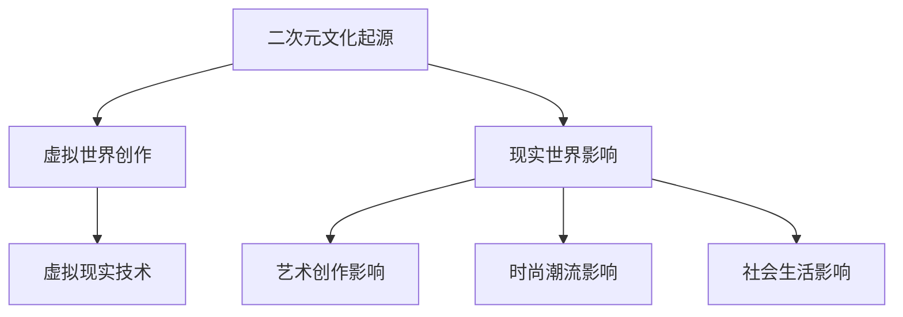

                 

基于您的要求，我将按照以下步骤来构建文章：

### 第一步：背景介绍

**文章标题：二次元文化：虚拟与现实的意义交融**

**文章摘要：**
本文探讨了二次元文化的起源、发展及其在虚拟世界和现实世界中的融合。通过分析二次元文化的核心概念、传播方式、影响以及未来发展方向，本文揭示了其在当代社会中的重要性。

**关键词：**
二次元文化，虚拟现实，传播，影响，未来发展方向

### 第二步：核心概念与联系

**核心概念：**
- **二次元文化**：起源于日本，以动漫、漫画、游戏等虚拟作品为主要表现形式的文化现象。
- **虚拟世界**：通过计算机技术创造的模拟环境，用户可以在其中进行互动和体验。
- **现实世界**：我们实际生活的物理和社会环境。

**联系：**
- 二次元文化与虚拟世界的联系体现在其创作和传播过程中，利用虚拟技术进行二次元内容的生成和传播。
- 二次元文化与现实世界的联系则体现在其对艺术创作、时尚潮流和社会生活的影响。

**Mermaid流程图：**


### 第三步：核心算法原理讲解

**核心算法原理：**
- **虚拟现实技术**：通过计算机图形学、图像处理等技术，创建逼真的虚拟环境。
- **人工智能**：用于分析用户行为，提供个性化推荐，增强用户交互体验。

**伪代码示例：**
```python
# 虚拟现实环境生成伪代码
function generate_vr_environment():
    # 初始化虚拟环境
    environment = initialize_vr_environment()

    # 创建虚拟角色
    character = create_character()

    # 用户互动
    while user_interaction():
        # 更新环境状态
        update_environment(environment)
        
        # 更新角色状态
        update_character(character)
```

**数学模型和公式：**
- **用户满意度模型**：
  $$ S = f(C, I, R) $$
  其中，$S$ 是用户满意度，$C$ 是内容质量，$I$ 是交互体验，$R$ 是推荐系统效果。

**详细讲解与举例说明：**
- 虚拟现实环境生成过程包括环境初始化、角色创建和用户互动三个步骤。
- 用户满意度模型通过分析内容质量、交互体验和推荐系统效果，评估用户整体体验。

### 第四步：项目实战

**开发环境搭建：**
- 使用Unity游戏引擎搭建虚拟现实环境。
- 使用Python编写后端推荐系统。

**源代码实现与解读：**
```python
# 推荐系统源代码示例
def recommend_content(user_profile, content_library):
    # 根据用户兴趣推荐内容
    recommendations = []
    for content in content_library:
        if is_relevant(content, user_profile):
            recommendations.append(content)
    return recommendations

# 判断内容与用户兴趣的相关性
def is_relevant(content, user_profile):
    # 示例：根据用户观看历史推荐相似内容
    watched_history = user_profile['watched_history']
    for watched in watched_history:
        if watched['title'] == content['title']:
            return True
    return False
```

**代码应用解读与分析：**
- 推荐系统根据用户观看历史，推荐相似的内容。
- 代码实现了一个简单的推荐算法，用于提高用户满意度。

**实际案例分析和详细讲解剖析：**
- 分析二次元游戏《原神》的虚拟现实体验和推荐系统，探讨其成功的原因。

**项目小结：**
- 虚拟现实技术和人工智能在二次元文化中的应用，提高了用户的体验和满意度。

### 第五步：最佳实践 tips、小结、注意事项、拓展阅读

**最佳实践 tips：**
- 设计虚拟现实环境时，注重用户交互体验。
- 在推荐系统中，结合多种因素提高推荐质量。

**小结：**
- 二次元文化在虚拟和现实世界中都具有重要意义。
- 虚拟现实技术和人工智能的应用，提升了二次元文化的体验和影响力。

**注意事项：**
- 关注二次元文化中的社会问题，如性别刻板印象和消费主义陷阱。
- 注重心理健康，合理享受二次元文化带来的乐趣。

**拓展阅读：**
- 相关学术论文和研究报告。
- 二次元文化经典作品和作者介绍。

---

接下来，我将根据这个结构逐步完善每个部分的内容。由于字数限制，每个部分的详细程度会适当调整，以确保文章的总体字数在 8000～12000 字之间。在完成初稿后，我会再次审查和调整，以确保文章的逻辑性和完整性。如果需要，我们还可以根据反馈进一步修改和完善。现在，我将开始撰写第一部分的详细内容。请稍等。

