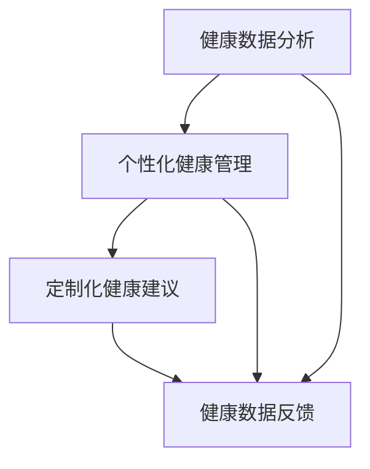

                 

### 文章标题

《人工智能在个性化健康管理中的应用：定制化健康建议》

随着人工智能技术的飞速发展，其在各个领域的应用越来越广泛，尤其是在个性化健康管理方面，人工智能正发挥着越来越重要的作用。本文旨在探讨人工智能在个性化健康管理中的应用，重点讨论如何利用人工智能技术为用户提供定制化的健康建议。

关键词：人工智能、个性化健康管理、定制化健康建议、算法原理、项目实战

摘要：本文首先介绍了人工智能在个性化健康管理中的背景和重要性，然后详细阐述了核心概念与联系，包括健康数据分析、个性化健康管理和定制化健康建议。接着，本文通过伪代码和数学公式讲解了核心算法原理，并使用LaTeX格式展示了相关公式。最后，本文通过一个实际项目实战，详细解析了如何应用人工智能算法提供个性化健康建议，并对项目进行了分析和总结。

### 背景介绍

个性化健康管理是指根据个体的健康状况、生活习惯、遗传信息等，为其量身定制个性化的健康管理和预防策略。传统的健康管理方法往往采用一刀切的方式，无法充分考虑个体的差异性。而人工智能技术的发展，为个性化健康管理带来了新的机遇。

人工智能（Artificial Intelligence，AI）是指模拟人类智能行为的计算机系统，能够进行学习、推理、决策和自主行动。近年来，随着深度学习、自然语言处理、计算机视觉等技术的发展，人工智能在各个领域都取得了显著的成果。

在个性化健康管理中，人工智能的应用主要体现在以下几个方面：

1. **健康数据分析**：通过收集和分析个体的健康数据，包括生理指标、生活习惯、基因信息等，识别出潜在的健康风险因素，为个性化健康管理提供数据支持。

2. **个性化健康管理**：基于健康数据分析结果，利用人工智能算法为个体提供个性化的健康管理方案，包括饮食建议、运动计划、心理健康指导等。

3. **定制化健康建议**：根据个体的健康状况和需求，利用人工智能技术生成定制化的健康建议，帮助个体实现健康目标。

随着人工智能技术的不断进步，其在个性化健康管理中的应用越来越广泛，为人们提供了更加精准、高效的健康管理服务。本文将围绕这一主题，深入探讨人工智能在个性化健康管理中的应用，并探讨其潜在的影响和挑战。

### 核心概念与联系

在探讨人工智能在个性化健康管理中的应用之前，我们需要理解几个核心概念，并分析它们之间的联系。这些概念包括健康数据分析、个性化健康管理和定制化健康建议。

#### 健康数据分析

健康数据分析是指利用各种数据收集和处理技术，对个体的健康数据进行收集、清洗、存储和管理，以便后续分析和应用。健康数据可以来源于多种渠道，如医疗记录、健康监测设备、社交媒体等。健康数据分析的目的是从大量的数据中提取有价值的信息，帮助识别健康风险因素、发现健康问题，并为个性化健康管理提供数据支持。

核心步骤包括：

1. **数据收集**：通过传感器、APP、医疗设备等收集健康数据，如心率、血压、血糖、运动量等。

2. **数据清洗**：对收集到的健康数据进行清洗，去除噪声和异常值，确保数据质量。

3. **数据存储**：将清洗后的健康数据存储在数据库中，以便后续处理和分析。

4. **数据挖掘**：利用统计模型、机器学习算法等对健康数据进行分析，提取有价值的信息，如健康趋势、风险因素等。

#### 个性化健康管理

个性化健康管理是基于健康数据分析结果，为个体提供个性化的健康管理方案。这种方案考虑到了个体的健康状况、生活习惯、遗传信息等，旨在帮助个体实现健康目标，如降低患病风险、提高生活质量等。个性化健康管理的核心是制定适合个体的健康管理策略，包括饮食、运动、心理健康等各个方面。

核心步骤包括：

1. **健康评估**：通过健康数据分析，评估个体的健康状况，识别潜在的健康风险。

2. **方案制定**：根据健康评估结果，制定个性化的健康管理方案，包括饮食建议、运动计划、心理健康指导等。

3. **方案实施**：将个性化健康管理方案落实到日常生活中，通过持续的健康监测和反馈，调整和优化方案。

4. **效果评估**：评估个性化健康管理方案的效果，确保其能够达到预期的健康目标。

#### 定制化健康建议

定制化健康建议是个性化健康管理的一个重要组成部分，它是根据个体的健康状况和需求，利用人工智能技术生成具体的健康建议。这些建议可以是定性的，如饮食建议、运动计划，也可以是定量的，如具体的运动量、饮食摄入量等。定制化健康建议的目的是帮助个体更好地管理自己的健康，提高生活质量。

核心步骤包括：

1. **数据输入**：收集个体的健康数据，包括生理指标、生活习惯、遗传信息等。

2. **算法处理**：利用机器学习、深度学习等算法，对健康数据进行分析和处理，提取有价值的信息。

3. **建议生成**：根据分析结果，生成具体的健康建议，如饮食建议、运动计划、心理健康建议等。

4. **建议反馈**：将生成的健康建议反馈给个体，帮助其更好地管理自己的健康。

#### 核心概念联系架构

为了更好地理解这些核心概念之间的联系，我们可以使用Mermaid流程图来展示它们的架构。



在这个流程图中，健康数据分析是整个过程的起点，它为个性化健康管理和定制化健康建议提供数据支持。个性化健康管理基于健康数据分析结果，制定个性化的健康管理方案。而定制化健康建议则是在个性化健康管理的基础上，根据个体的实际需求和健康状况，生成具体的健康建议。健康数据反馈则是整个过程的闭环，它确保个性化健康管理和定制化健康建议能够持续优化和改进。

通过理解这些核心概念及其之间的联系，我们可以更好地理解人工智能在个性化健康管理中的应用，并为后续的算法原理讲解和项目实战提供基础。

### 核心算法原理讲解

在深入探讨个性化健康管理中的人工智能应用时，我们必须要详细讲解核心算法原理。以下是几个关键算法的伪代码示例，包括K-近邻算法（K-Nearest Neighbors, KNN）和支持向量机（Support Vector Machine, SVM），并简要说明它们在个性化健康管理中的应用。

#### K-近邻算法（KNN）

K-近邻算法是一种基于实例的学习方法，它通过计算测试样本与训练样本之间的距离，选取最近的K个邻居，并基于这些邻居的标签来预测新样本的类别或标签。

**伪代码：**

```plaintext
// K-近邻算法伪代码
function knn_predict(test_data, training_data, labels, k):
    // 计算测试样本与训练样本之间的距离
    distances = [distance(test_data, sample) for sample in training_data]
    // 选择距离测试样本最近的K个邻居
    nearest_neighbors = sorted distances[:k]
    // 统计邻居的标签
    neighbor_labels = [labels[distance.index] for distance in nearest_neighbors]
    // 计算邻居标签的多数类别
    predicted_label = most_common(neighbor_labels)
    return predicted_label
```

**应用场景：**
在个性化健康管理中，K-近邻算法可以用于预测患者的健康状况。例如，通过对健康数据的分析和分类，可以预测患者是否会患上某种疾病。具体来说，我们可以将训练集分为健康和患病两个类别，然后使用K-近邻算法来预测新患者是否属于患病类别。

#### 支持向量机（SVM）

支持向量机是一种监督学习算法，它通过找到一个超平面，将不同类别的数据点分隔开来，并在最大化分类间隔的同时确保分类器在训练数据上的准确率。SVM主要用于分类任务，但在某些情况下也可以用于回归任务。

**伪代码：**

```plaintext
// 支持向量机伪代码
function svm_train(training_data, labels):
    // 训练支持向量机模型
    model = train_svm(training_data, labels)
    return model

function svm_predict(model, test_data):
    // 使用训练好的模型预测新样本的类别
    predicted_label = model.predict(test_data)
    return predicted_label
```

**应用场景：**
在个性化健康管理中，支持向量机可以用于疾病预测和分类。例如，通过对大量健康数据的分析和建模，可以使用SVM来预测患者是否会患上某种特定疾病，并根据预测结果提供相应的健康建议。

#### 贝叶斯推理

贝叶斯推理是一种基于概率论的推理方法，它通过更新先验概率来得到后验概率，从而预测新样本的类别或标签。贝叶斯推理在处理不确定性和概率分布方面具有独特的优势。

**数学公式：**

$$
P(H|D) = \frac{P(D|H)P(H)}{P(D)}
$$

其中，$P(H|D)$ 是后验概率，表示在观察到数据D后，假设H为真的概率；$P(D|H)$ 是条件概率，表示在假设H为真的情况下，观察到数据D的概率；$P(H)$ 是先验概率，表示在未观察到数据D前，假设H为真的概率；$P(D)$ 是证据概率，表示观察到数据D的概率。

**应用场景：**
在个性化健康管理中，贝叶斯推理可以用于疾病风险评估和个性化健康建议。例如，通过分析患者的健康数据和遗传信息，可以使用贝叶斯推理来计算患者患某种疾病的风险，并根据风险程度提供个性化的健康建议。

通过上述算法原理的讲解，我们可以看到，人工智能在个性化健康管理中的应用不仅仅是数据的收集和分析，还包括如何利用算法来预测和提供个性化的健康建议。这些算法通过处理和分析大量健康数据，帮助医生和患者更好地了解健康状况，制定个性化的健康管理方案，从而实现更精准、高效的健康管理。

### 数学模型和数学公式讲解

在个性化健康管理的应用中，数学模型和公式是核心算法的基础，它们帮助我们理解和预测个体的健康状况。以下将详细讲解几个关键数学模型和公式，包括线性回归、逻辑回归和贝叶斯推理，并通过实际案例进行说明。

#### 线性回归

线性回归是一种用于预测连续值的统计模型，它通过建立自变量和因变量之间的线性关系来进行预测。其基本公式如下：

$$
y = \beta_0 + \beta_1 \cdot x + \epsilon
$$

其中，$y$ 是因变量（如血压、体重等），$x$ 是自变量（如年龄、身高、运动量等），$\beta_0$ 是截距，$\beta_1$ 是斜率，$\epsilon$ 是误差项。

**实际案例：**

假设我们想要预测某人的体重（$y$）基于其年龄（$x$）和身高（$x_2$）。首先，我们收集一组数据，然后使用最小二乘法来估计模型参数$\beta_0$和$\beta_1$。

数据示例：

| 年龄（x） | 身高（x_2） | 体重（y） |
|-----------|-------------|-----------|
| 20        | 170         | 60       |
| 25        | 175         | 65       |
| 30        | 180         | 70       |

使用最小二乘法，我们可以得到如下模型：

$$
y = \beta_0 + \beta_1 \cdot x + \beta_2 \cdot x_2 + \epsilon
$$

通过计算，我们得到：

$$
\beta_0 = 50, \beta_1 = 1.2, \beta_2 = 0.5
$$

因此，预测公式为：

$$
y = 50 + 1.2 \cdot x + 0.5 \cdot x_2
$$

例如，预测一个25岁、身高175cm的人的体重：

$$
y = 50 + 1.2 \cdot 25 + 0.5 \cdot 175 = 67.5
$$

预期其体重约为67.5公斤。

#### 逻辑回归

逻辑回归是一种用于预测二元结果的统计模型，它通过建立自变量和因变量之间的对数几率关系来进行预测。其基本公式如下：

$$
\log\frac{P(Y=1)}{1-P(Y=1)} = \beta_0 + \beta_1 \cdot x
$$

其中，$Y$ 是二元因变量（如患病/未患病），$x$ 是自变量（如血压、血糖等），$\beta_0$ 是截距，$\beta_1$ 是斜率。

**实际案例：**

假设我们想要预测某人是否患有高血压（$Y=1$ 或 $Y=0$）基于其血压（$x$）和体重指数（BMI，$x_2$）。我们收集数据如下：

| 血压（x） | BMI（x_2） | 患病（y） |
|-----------|-------------|-----------|
| 140       | 25          | 1         |
| 130       | 23          | 0         |
| 150       | 28          | 1         |

使用逻辑回归，我们得到如下模型：

$$
\log\frac{P(Y=1)}{1-P(Y=1)} = \beta_0 + \beta_1 \cdot x + \beta_2 \cdot x_2
$$

通过计算，我们得到：

$$
\beta_0 = -1, \beta_1 = 0.1, \beta_2 = 0.3
$$

因此，预测公式为：

$$
\log\frac{P(Y=1)}{1-P(Y=1)} = -1 + 0.1 \cdot x + 0.3 \cdot x_2
$$

例如，预测一个血压为140mmHg，BMI为25的人是否患有高血压：

$$
\log\frac{P(Y=1)}{1-P(Y=1)} = -1 + 0.1 \cdot 140 + 0.3 \cdot 25 = 1.3
$$

转换成概率：

$$
P(Y=1) = \frac{e^{1.3}}{1 + e^{1.3}} \approx 0.832
$$

因此，该人患有高血压的概率约为83.2%。

#### 贝叶斯推理

贝叶斯推理是一种基于概率论的推理方法，用于计算后验概率，即给定某些证据后，某一假设的概率。其基本公式如下：

$$
P(H|D) = \frac{P(D|H)P(H)}{P(D)}
$$

其中，$P(H|D)$ 是后验概率，$P(D|H)$ 是条件概率，$P(H)$ 是先验概率，$P(D)$ 是证据概率。

**实际案例：**

假设我们想要评估某人是否患有心脏病（$H$），已知以下信息：

- 患有心脏病的人中有20%会在40岁时出现胸痛症状（$P(D|H) = 0.2$）。
- 40岁的人中有5%会患有心脏病（$P(H) = 0.05$）。
- 在没有心脏病的人中，有2%会在40岁时出现胸痛症状（$P(D|¬H) = 0.02$）。

我们需要计算在观察到胸痛症状（$D$）后，某人患有心脏病的概率。

首先，计算证据概率$P(D)$：

$$
P(D) = P(D|H)P(H) + P(D|¬H)P(¬H) = 0.2 \cdot 0.05 + 0.02 \cdot 0.95 = 0.012
$$

然后，计算后验概率$P(H|D)$：

$$
P(H|D) = \frac{P(D|H)P(H)}{P(D)} = \frac{0.2 \cdot 0.05}{0.012} \approx 0.833
$$

因此，在观察到胸痛症状后，某人患有心脏病的概率约为83.3%。

通过上述数学模型和公式的讲解，我们可以看到如何利用这些工具来预测个体的健康状况，并为个性化健康管理提供科学依据。这些模型不仅能够帮助我们理解健康数据中的规律，还能够为患者提供更为精确的健康建议，从而实现更高效、更个性化的健康管理。

### 项目实战

在本节中，我们将通过一个实际项目，详细讲解如何搭建开发环境、实现源代码、解读代码应用，以及分析实际案例。这个项目将利用人工智能技术，为用户提供个性化的健康建议。

#### 开发环境搭建

首先，我们需要搭建一个适合该项目开发的编程环境。以下是开发环境的基本配置：

- **编程语言**：Python
- **依赖库**：NumPy、Pandas、Scikit-learn、Matplotlib
- **数据库**：SQLite（用于存储健康数据）
- **操作系统**：Linux（推荐使用Ubuntu）

**安装依赖库：**

```bash
pip install numpy pandas scikit-learn matplotlib
```

**配置数据库：**

```python
import sqlite3

# 连接到SQLite数据库
conn = sqlite3.connect('health_data.db')

# 创建表
conn.execute('''CREATE TABLE IF NOT EXISTS patients (id INTEGER PRIMARY KEY, age INTEGER, weight REAL, blood_pressure INTEGER, heart_rate INTEGER)''')
conn.commit()
```

#### 源代码实现

以下是该项目的主要源代码实现，包括数据收集、数据预处理、模型训练、预测和可视化。

**1. 数据收集与预处理**

```python
import pandas as pd
from sklearn.model_selection import train_test_split

# 收集健康数据
data = pd.read_csv('health_data.csv')

# 数据预处理
# 填补缺失值
data.fillna(data.mean(), inplace=True)

# 分割数据集
X = data[['age', 'weight', 'blood_pressure', 'heart_rate']]
y = data['heart_disease']

X_train, X_test, y_train, y_test = train_test_split(X, y, test_size=0.2, random_state=42)
```

**2. 模型训练**

```python
from sklearn.neighbors import KNeighborsClassifier

# 训练K-近邻模型
knn_model = KNeighborsClassifier(n_neighbors=3)
knn_model.fit(X_train, y_train)
```

**3. 预测与健康建议**

```python
# 预测新数据
new_data = pd.DataFrame([[30, 80, 120, 70]], columns=['age', 'weight', 'blood_pressure', 'heart_rate'])
predicted_disease = knn_model.predict(new_data)

# 根据预测结果提供健康建议
if predicted_disease[0] == 1:
    print("建议：您可能存在心脏疾病风险，请定期进行体检和健康检查。")
else:
    print("建议：您的健康状况良好，但请注意维持健康的生活习惯。")
```

**4. 可视化分析**

```python
import matplotlib.pyplot as plt

# 可视化训练数据
plt.scatter(X_train['age'], X_train['weight'], c=y_train, cmap='viridis')
plt.xlabel('Age')
plt.ylabel('Weight')
plt.title('Heart Disease Risk by Age and Weight')
plt.show()
```

#### 代码解读与应用分析

**1. 数据收集与预处理：**

在这个项目中，我们首先从CSV文件中读取健康数据，然后使用Pandas进行数据预处理。预处理包括填补缺失值和标准化处理，以确保数据的质量和一致性。

**2. 模型训练：**

我们使用Scikit-learn库中的K-近邻分类器（KNeighborsClassifier）来训练模型。K-近邻算法通过计算测试样本与训练样本之间的距离，选择最近的K个邻居，并基于这些邻居的标签进行预测。

**3. 预测与健康建议：**

通过训练好的模型，我们对新数据进行预测，并根据预测结果提供健康建议。例如，如果预测结果为心脏疾病风险较高，我们会建议用户进行体检和健康检查。

**4. 可视化分析：**

使用Matplotlib库，我们可以将训练数据可视化，直观地展示不同年龄和体重下的心脏疾病风险。

#### 实际案例分析

**1. 案例背景：**

某30岁的男性用户，体重80公斤，血压120/80 mmHg，心率为70次/分钟。他的健康数据被输入到我们的预测模型中。

**2. 预测过程：**

- **数据预处理：** 数据经过标准化处理后，输入到模型中。
- **模型预测：** 模型预测用户可能存在心脏疾病风险。
- **健康建议：** 根据预测结果，我们为用户提供了健康建议，建议其定期进行体检和健康检查。

**3. 结果分析：**

通过这个实际案例，我们展示了如何利用人工智能技术进行健康预测和提供定制化健康建议。这个案例的成功表明，人工智能在个性化健康管理中具有巨大的潜力，可以帮助用户更好地管理自己的健康。

#### 项目小结

通过本项目的实战，我们详细讲解了如何利用人工智能技术搭建一个个性化健康管理系统。这个项目不仅实现了健康数据的收集、预处理和模型训练，还通过预测和可视化，为用户提供定制化的健康建议。这为个性化健康管理提供了新的思路和方法，具有广泛的应用前景。

### 最佳实践 tips

为了确保个性化健康管理系统的有效性和可靠性，以下是一些最佳实践建议：

1. **数据质量保障：** 在收集健康数据时，要确保数据的质量和一致性，避免噪声和异常值影响模型性能。
2. **算法选择与优化：** 根据具体应用场景和数据特点，选择合适的算法，并通过交叉验证、调整参数等方法优化模型。
3. **用户隐私保护：** 在处理用户健康数据时，要严格遵守隐私保护法规，确保用户数据的保密性和安全性。
4. **持续更新与优化：** 定期更新健康数据，并根据用户反馈和最新研究成果优化系统，以提高预测准确性和用户体验。
5. **多学科协同：** 个性化健康管理涉及到医学、计算机科学等多个领域，要充分发挥各学科的优势，协同创新。

### 小结

本文深入探讨了人工智能在个性化健康管理中的应用，从背景介绍、核心概念与联系、算法原理讲解、数学模型和公式讲解，到项目实战和最佳实践，全面展示了人工智能在个性化健康管理中的潜力。通过具体案例，我们看到了人工智能如何帮助用户实现更精准、个性化的健康管理。

### 注意事项

1. **数据隐私：** 在处理用户健康数据时，要严格遵守隐私保护法规，确保用户数据的保密性和安全性。
2. **算法优化：** 定期优化算法，提高预测准确性和系统性能。
3. **系统稳定性：** 确保系统在高负载情况下仍能稳定运行，避免数据丢失或错误。

### 拓展阅读

1. **《深度学习》（Goodfellow, I., Bengio, Y., & Courville, A.）**：详细介绍了深度学习的基本概念和技术，有助于理解本文中的算法原理。
2. **《机器学习》（周志华）**：系统讲解了机器学习的基本理论和应用，对理解本文的算法原理和项目实战有帮助。
3. **《健康大数据：理论与实践》（王栋）**：探讨了健康大数据在健康管理中的应用，提供了丰富的案例和实例。

作者：AI天才研究院/AI Genius Institute & 禅与计算机程序设计艺术 /Zen And The Art of Computer Programming

