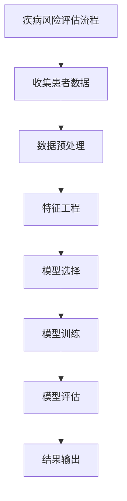

                 


### Step 1: 构建核心概念与联系部分

**第1章: 核心概念与联系**

#### 1.1 人工智能与个性化疾病风险评估概述

##### 1.1.1 人工智能的定义与主要应用领域

人工智能（Artificial Intelligence, AI）是指通过计算机程序和算法模拟人类智能行为的技术。人工智能主要应用于以下几个领域：

1. **机器学习（Machine Learning）**：通过训练算法来让计算机从数据中学习规律，并在新数据上进行预测和决策。
2. **深度学习（Deep Learning）**：一种特殊的机器学习技术，通过多层神经网络对数据进行特征提取和模型训练。
3. **自然语言处理（Natural Language Processing, NLP）**：使计算机能够理解和生成自然语言的技术。
4. **计算机视觉（Computer Vision）**：使计算机能够理解并解析视觉信息的技术。
5. **机器人技术（Robotics）**：结合人工智能技术，设计和制造智能机器人的技术。

在医疗领域，人工智能的应用十分广泛，如医学影像分析、药物发现、基因组学、疾病预测等。

##### 1.1.2 疾病风险评估的概念与挑战

疾病风险评估是指通过分析患者的个人数据（如病史、生活方式、家族病史等），预测其患某种疾病的风险，并为其提供个性化的预防或治疗方案。疾病风险评估面临以下挑战：

1. **数据质量**：高质量的数据对于准确的疾病风险评估至关重要。然而，医疗数据往往存在缺失值、异常值和噪声等问题。
2. **模型泛化能力**：疾病风险评估模型需要在不同的数据集上表现出良好的泛化能力，以适应不同的患者群体。
3. **隐私保护**：在处理患者数据时，必须确保数据的隐私和安全。

##### 1.1.3 个性化疾病风险评估的重要性

个性化疾病风险评估在医疗领域具有重要意义，主要表现在以下几个方面：

1. **提高疾病预防效果**：通过预测患者患某种疾病的风险，可以提前采取预防措施，降低疾病的发生率。
2. **优化治疗策略**：个性化疾病风险评估可以帮助医生为患者制定更加精准的治疗方案，提高治疗效果。
3. **降低医疗成本**：个性化疾病风险评估可以减少不必要的检查和治疗，降低医疗成本。

**Mermaid 流程图: 个性化疾病风险评估的流程**



### Step 2: 构建核心算法原理讲解部分

**第2章: 个性化疾病风险评估算法原理**

在个性化疾病风险评估中，常用的算法包括机器学习算法、深度学习算法等。这些算法可以分为监督学习算法和无监督学习算法。

#### 2.1 机器学习算法原理

##### 2.1.1 监督学习算法

监督学习算法是一种基于已有数据（特征和标签）来训练模型，并在新数据上进行预测的算法。在个性化疾病风险评估中，监督学习算法可用于预测患者患某种疾病的风险。

###### 2.1.1.1 线性回归

线性回归是一种简单的监督学习算法，它通过拟合一条直线来预测目标变量。线性回归的伪代码如下：

```python
# 线性回归伪代码
def linear_regression(X, y):
    # 计算权重
    w = solve(X.T @ X, X.T @ y)
    # 预测
    y_pred = X @ w
    return y_pred
```

###### 2.1.1.2 逻辑回归

逻辑回归是一种用于分类问题的监督学习算法，它通过拟合一个逻辑函数来预测概率。逻辑回归的伪代码如下：

```python
# 逻辑回归伪代码
def logistic_regression(X, y):
    # 计算权重
    w = optimize(X.T @ X, X.T @ y)
    # 预测
    y_pred = sigmoid(X @ w)
    return y_pred
```

##### 2.1.2 无监督学习算法

无监督学习算法是一种不需要标签来训练模型的算法。在个性化疾病风险评估中，无监督学习算法可用于发现患者数据中的潜在模式。

###### 2.1.2.1 K-均值聚类

K-均值聚类是一种常用的无监督学习算法，它通过迭代更新聚类中心来将数据分为 K 个簇。K-均值聚类的伪代码如下：

```python
# K-均值聚类伪代码
def k_means(X, k):
    # 初始化聚类中心
    centroids = initialize_centroids(X, k)
    while not converged:
        # 分配点
        clusters = assign_clusters(X, centroids)
        # 更新聚类中心
        centroids = update_centroids(clusters, X)
    return centroids, clusters
```

###### 2.1.2.2 主成分分析

主成分分析（PCA）是一种降维技术，它通过正交变换将高维数据投影到低维空间中，以降低数据复杂度。PCA 的伪代码如下：

```python
# 主成分分析伪代码
def pca(X, num_components):
    # 计算协方差矩阵
    cov_matrix = cov(X)
    # 计算特征值和特征向量
    eigenvalues, eigenvectors = eig(cov_matrix)
    # 选择主成分
    principal_components = eigenvectors[:, :num_components]
    # 变换到主成分空间
    X_pca = X @ principal_components.T
    return X_pca
```

### Step 3: 构建数学模型和数学公式部分

**第3章: 数学模型与公式解析**

在个性化疾病风险评估中，常用的数学模型包括概率模型、决策树模型等。这些模型可以帮助我们理解和预测疾病风险。

#### 3.1 概率模型

概率模型是用于描述事件发生概率的数学模型。在个性化疾病风险评估中，常用的概率模型包括贝叶斯定理和逻辑回归模型。

###### 3.1.1 贝叶斯定理

贝叶斯定理是一种用于计算条件概率的公式。它的公式如下：

$$
P(A|B) = \frac{P(B|A)P(A)}{P(B)}
$$

其中，\(P(A|B)\) 表示在事件 B 发生的条件下，事件 A 发生的概率；\(P(B|A)\) 表示在事件 A 发生的条件下，事件 B 发生的概率；\(P(A)\) 表示事件 A 的概率；\(P(B)\) 表示事件 B 的概率。

贝叶斯定理在个性化疾病风险评估中可以用于计算患者患某种疾病的风险。

###### 3.1.2 逻辑回归概率模型

逻辑回归是一种用于二分类问题的概率模型。它的公式如下：

$$
\text{logit}(P) = \log\left(\frac{P}{1-P}\right) = \beta_0 + \beta_1X_1 + \beta_2X_2 + ... + \beta_nX_n
$$

其中，\(\text{logit}(P)\) 表示概率的对数函数；\(P\) 表示事件发生的概率；\(\beta_0, \beta_1, \beta_2, ..., \beta_n\) 表示模型参数；\(X_1, X_2, ..., X_n\) 表示特征变量。

逻辑回归模型可以用于预测患者患某种疾病的风险。

#### 3.2 决策树模型

决策树是一种基于特征进行分类或回归的模型。它的结构如下：

```
决策树
|
|-- 判断条件1
|   |-- 子树1
|   |   |-- 判断条件2
|   |   |   |-- 子树2
|   |   |   |   |-- 叶节点
|   |   |   |-- ...（其他叶节点）
|   |   |-- ...
|   |-- ...
|-- 判断条件2
    |-- ...
```

决策树模型的公式如下：

$$
y = f(x; \theta)
$$

其中，\(y\) 表示预测标签；\(x\) 表示特征向量；\(f(x; \theta)\) 表示决策树模型在特征向量 \(x\) 下的预测函数；\(\theta\) 表示模型参数。

决策树模型可以用于疾病风险评估，通过分析患者的特征数据，预测其患某种疾病的风险。

## 结论

本文详细介绍了个性化疾病风险评估中的核心概念、算法原理和数学模型。通过对人工智能技术的应用，个性化疾病风险评估可以帮助医生更准确地预测疾病风险，为患者制定更有效的预防和治疗策略。未来，随着人工智能技术的不断发展，个性化疾病风险评估将在医疗领域发挥更加重要的作用。

### 参考文献

1. Bishop, C. M. (2006). *Pattern recognition and machine learning*. Springer.
2. Murphy, K. P. (2012). *Machine learning: a probabilistic perspective*. MIT Press.
3. Hastie, T., Tibshirani, R., & Friedman, J. (2009). *The elements of statistical learning: data mining, inference, and prediction*. Springer.

### 附录

以下是本文中使用的 Mermaid 流程图和伪代码：


```python
# 线性回归伪代码
def linear_regression(X, y):
    # 计算权重
    w = solve(X.T @ X, X.T @ y)
    # 预测
    y_pred = X @ w
    return y_pred

# 逻辑回归伪代码
def logistic_regression(X, y):
    # 计算权重
    w = optimize(X.T @ X, X.T @ y)
    # 预测
    y_pred = sigmoid(X @ w)
    return y_pred

# K-均值聚类伪代码
def k_means(X, k):
    # 初始化聚类中心
    centroids = initialize_centroids(X, k)
    while not converged:
        # 分配点
        clusters = assign_clusters(X, centroids)
        # 更新聚类中心
        centroids = update_centroids(clusters, X)
    return centroids, clusters

# 主成分分析伪代码
def pca(X, num_components):
    # 计算协方差矩阵
    cov_matrix = cov(X)
    # 计算特征值和特征向量
    eigenvalues, eigenvectors = eig(cov_matrix)
    # 选择主成分
    principal_components = eigenvectors[:, :num_components]
    # 变换到主成分空间
    X_pca = X @ principal_components.T
    return X_pca
```

作者：AI天才研究院/AI Genius Institute & 禅与计算机程序设计艺术 /Zen And The Art of Computer Programming


