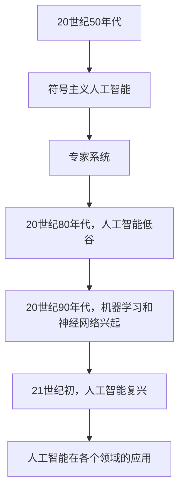
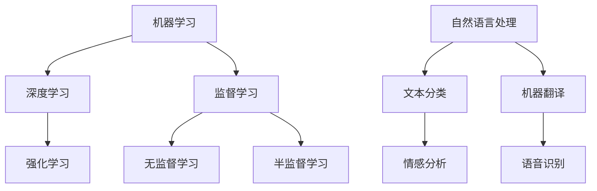
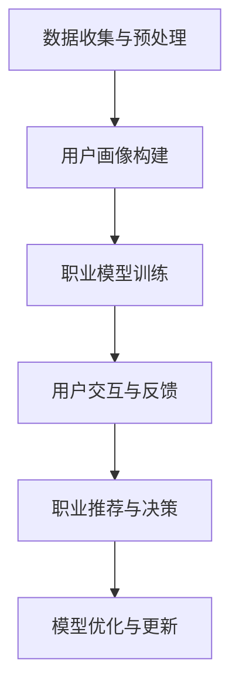
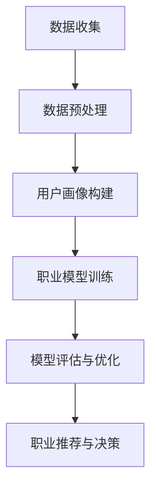

                 

### 人工智能在个性化职业规划中的应用

#### 关键词
- 人工智能
- 职业规划
- 数据分析
- 机器学习
- 自然语言处理
- 个性化推荐

#### 摘要
本文探讨了人工智能技术在个性化职业规划中的应用。通过对数据分析、机器学习和自然语言处理等核心技术的详细介绍，文章展示了如何利用这些技术为个人提供精准的职业规划建议。同时，通过实际案例分析，阐述了人工智能在职业规划领域的潜力与挑战。

---

#### 引言

在现代社会，职业规划变得愈发重要。随着技术的迅猛发展，人工智能（AI）在各个领域展现出了巨大的潜力，特别是在个性化职业规划方面。通过利用大数据和先进的算法，人工智能能够帮助个人更准确地了解自己的职业兴趣、技能和发展方向，从而实现更有效的职业规划。

本文将分以下几个部分进行阐述：

1. **人工智能与职业规划**：介绍人工智能的基本概念和其在职业规划中的应用背景。
2. **数据分析在职业规划中的应用**：讨论如何利用数据分析技术收集和处理职业规划所需的数据。
3. **机器学习在职业规划中的应用**：介绍机器学习算法如何用于个性化职业规划的预测和决策。
4. **自然语言处理在职业规划中的应用**：探讨自然语言处理技术如何帮助分析职业描述和职业需求。
5. **人工智能辅助个性化职业规划**：展示人工智能如何实现个性化职业规划的辅助功能。
6. **未来展望与挑战**：分析人工智能在职业规划领域的未来趋势和面临的挑战。

通过上述内容，我们旨在帮助读者理解人工智能在个性化职业规划中的重要作用，并探讨其潜在的深远影响。

---

### 第一部分: 人工智能与职业规划

#### 第1章: 人工智能简介

##### 1.1 人工智能的发展历史

人工智能（AI）的发展历程可以追溯到20世纪50年代，当时科学家们首次提出了智能机器的概念。以下是一个简单的AI发展历程的Mermaid流程图：



- **符号主义人工智能**：这一阶段的AI以逻辑推理和知识表示为核心，试图通过编程的方式实现人类的思维过程。
- **专家系统**：专家系统是符号主义人工智能的一种具体实现，它模拟人类专家的决策过程，用于解决特定的领域问题。
- **20世纪80年代，人工智能低谷**：由于符号主义人工智能的局限性，加上计算资源和算法的不足，人工智能研究进入了一个低潮期。
- **20世纪90年代，机器学习和神经网络兴起**：随着机器学习和神经网络的兴起，人工智能迎来了新的发展机遇，尤其是在图像识别、语音识别等领域取得了显著进展。
- **21世纪初，人工智能复兴**：得益于大数据、云计算和深度学习等技术的进步，人工智能再次迎来了快速发展，应用领域不断扩大。

##### 1.2 人工智能的核心技术

人工智能的核心技术包括机器学习、深度学习和自然语言处理等。以下是对这些核心技术的基本概念和相互关系的Mermaid流程图：



- **机器学习**：机器学习是一种让计算机从数据中学习规律和模式的方法，可以分为监督学习、无监督学习和半监督学习。
  - **监督学习**：通过已标记的数据进行训练，用于预测和分类。
  - **无监督学习**：没有标记的数据进行训练，用于发现数据中的结构和模式。
  - **半监督学习**：使用少量标记数据和大量未标记数据训练模型。

- **深度学习**：深度学习是一种特殊的机器学习方法，它通过多层神经网络进行数据建模，能够自动提取复杂的数据特征。

- **强化学习**：强化学习是一种通过与环境互动来学习最优策略的机器学习方法，通常用于游戏、机器人控制等领域。

- **自然语言处理**：自然语言处理是一种让计算机理解和生成自然语言的技术，包括文本分类、情感分析、机器翻译和语音识别等。

##### 1.3 人工智能在职业规划中的应用背景

人工智能在职业规划中的应用背景主要源于以下几个方面：

1. **大数据的普及**：随着互联网和社交媒体的快速发展，人们产生和消费的数据量呈指数级增长。这些数据中包含了许多有关职业规划的信息，如求职者简历、招聘信息、行业动态等。
2. **机器学习算法的进步**：现代机器学习算法，尤其是深度学习算法，能够处理大量复杂数据，并从中提取有价值的信息。
3. **个性化需求的增长**：在职业规划方面，每个人有不同的兴趣、能力和职业目标，需要个性化的建议和指导。
4. **经济和职业发展的不确定性**：全球经济的不确定性和快速变化要求个人具备更高的适应能力和灵活性，以应对未来的职业挑战。

综上所述，人工智能为职业规划提供了新的工具和方法，能够帮助个人更准确地了解自己的职业兴趣和潜力，并制定出更加有效的职业规划。

---

#### 第2章: 个性化职业规划概述

##### 2.1 个性化职业规划的概念

个性化职业规划是指根据个人的兴趣、能力、价值观和发展目标，为其量身定制职业路径和发展策略的过程。与传统的职业规划不同，个性化职业规划强调个体的独特性，旨在帮助个人在职业道路上实现自我价值的最大化。

以下是个性化职业规划的基本要素：

1. **兴趣**：了解个人的兴趣爱好，找到与其相匹配的职业方向。
2. **能力**：评估个人的技能和知识水平，确定其在职场上的竞争力。
3. **价值观**：分析个人的价值观和人生目标，选择与其相符合的职业领域。
4. **发展目标**：设定短期和长期职业目标，为职业发展提供方向。

个性化职业规划的流程通常包括以下几个步骤：

1. **自我评估**：通过问卷调查、心理测试等方法，了解个人的兴趣、能力和价值观。
2. **市场分析**：研究当前就业市场的需求和趋势，了解不同职业的发展前景。
3. **目标设定**：根据自我评估和市场分析的结果，设定符合个人发展目标的职业规划。
4. **实施计划**：制定具体的行动计划，包括提升技能、积累经验、寻找职业机会等。

##### 2.2 个性化职业规划的重要性

个性化职业规划的重要性体现在以下几个方面：

1. **提高职业满意度**：通过个性化规划，个人能够找到与自己兴趣和能力相匹配的职业，从而提高工作满意度。
2. **促进职业发展**：个性化职业规划有助于个人明确职业目标，制定实现目标的策略，从而促进职业发展。
3. **增强职业竞争力**：个性化职业规划能够帮助个人根据市场需求提升自身技能，增强在职场上的竞争力。
4. **适应职业变化**：个性化职业规划能够帮助个人在职业生涯中不断适应变化，应对职业发展的不确定性。

##### 2.3 个性化职业规划的方法

个性化职业规划的方法多种多样，以下是一些常见的方法：

1. **职业咨询**：通过职业咨询师的帮助，了解自己的兴趣、能力和价值观，制定个性化的职业规划。
2. **职业测评**：利用专业的职业测评工具，如MBTI、霍兰德职业兴趣测评等，进行自我评估。
3. **网络资源**：利用在线职业规划平台和资源，如职业规划网站、社交媒体等，获取职业信息和建议。
4. **实习和兼职**：通过实习和兼职经历，了解不同职业的实际情况，为职业选择提供参考。
5. **终身学习**：通过持续学习，提升自己的技能和知识，为职业发展做好准备。

总之，个性化职业规划是一个持续的过程，需要个人根据自身情况和外部环境的变化不断调整和优化。通过科学的方法和合理的策略，个人可以更好地实现自己的职业目标。

---

### 第二部分: 人工智能在职业规划中的应用

#### 第3章: 数据分析在职业规划中的应用

##### 3.1 数据收集与处理

数据分析是职业规划中至关重要的一环，而数据收集与处理是数据分析的基础。以下是一个简单的数据分析流程：

1. **数据收集**：从各种渠道收集与职业规划相关的数据，如招聘网站、社交媒体、企业数据库等。这些数据可以是结构化的（如表格数据）或非结构化的（如文本、图像等）。

2. **数据清洗**：清洗数据是确保数据质量和准确性的关键步骤。主要包括以下内容：
   - **去除重复数据**：删除重复记录，避免重复计算和分析。
   - **处理缺失值**：填补缺失数据或删除含有缺失数据的记录。
   - **异常值检测**：检测并处理数据中的异常值，如错误输入或异常行为。

3. **数据转换**：将数据转换为适合分析的格式，如将文本数据转换为数值形式，或将不同单位的数据统一转换为相同单位。

4. **数据存储**：将处理后的数据存储在数据库或数据仓库中，以便后续分析和查询。

以下是一个数据清洗的伪代码示例：

```python
# 假设我们有一个招聘数据集
def clean_data(re招聘_data):
    # 去除重复数据
    unique_data = remove_duplicates(招聘数据)
    
    # 处理缺失值
    complete_data = handle_missing_values(unique_data)
    
    # 异常值检测
    valid_data = detect_and_handle_outliers(complete_data)
    
    return valid_data
```

##### 3.2 数据分析算法

数据分析算法是职业规划的核心工具，以下是一些常见的数据分析算法：

1. **描述性统计分析**：通过计算均值、中位数、标准差等指标，了解数据的分布和特性。

2. **回归分析**：通过建立回归模型，分析变量之间的关系。例如，分析工资水平与工作经验、学历等因素的关系。

3. **聚类分析**：将数据分为不同的类别，用于发现数据中的潜在结构。例如，将求职者分为技术型人才和创意型人才。

4. **分类分析**：将数据分为不同的类别，用于预测和决策。例如，根据求职者的简历内容，预测其适合的职业类型。

以下是一个回归分析的伪代码示例：

```python
# 假设我们有一个回归模型
def regression_analysis(dependent_variable, independent_variables):
    # 训练回归模型
    model = train_regression_model(dependent_variable, independent_variables)
    
    # 预测结果
    predictions = predict(model, new_independent_variables)
    
    return predictions
```

##### 3.3 数据分析在职业规划中的实际应用案例

数据分析在职业规划中的应用案例丰富多样，以下是一个具体的应用案例：

**案例：利用数据分析预测薪酬水平**

假设我们有一个包含求职者信息（如工作经验、学历、所在城市等）和薪酬水平的数据库。我们可以利用数据分析技术，建立模型预测新求职者的薪酬水平。

1. **数据收集与处理**：收集求职者的基本信息和薪酬数据，对数据集进行清洗和处理，确保数据的质量和一致性。

2. **模型建立**：利用回归分析技术，建立薪酬预测模型。选取工作经验、学历、所在城市等变量作为自变量，薪酬水平作为因变量。

3. **模型训练与验证**：使用部分数据集训练模型，利用交叉验证等方法验证模型的准确性。

4. **模型应用**：对新求职者的信息进行输入，利用模型预测其薪酬水平，为招聘决策提供参考。

通过上述案例分析，我们可以看到，数据分析在职业规划中发挥着重要作用，能够帮助企业和求职者做出更科学、更合理的决策。

---

#### 第4章: 机器学习在职业规划中的应用

##### 4.1 机器学习的基本概念

机器学习（Machine Learning，ML）是人工智能（AI）的一个重要分支，它使计算机系统能够从数据中学习并做出预测或决策，而无需显式编程。机器学习的基本概念包括以下几个关键点：

1. **数据集**：数据集是机器学习的输入，它可以是结构化的（如表格数据），也可以是非结构化的（如文本、图像、音频等）。

2. **特征**：特征是从数据集中提取的有意义的变量，用于描述数据的某些属性。例如，在求职者数据集中，年龄、学历、工作经验等都可以是特征。

3. **模型**：模型是机器学习算法对数据的抽象表示，用于学习数据中的规律和模式。常见的模型包括线性回归、决策树、支持向量机、神经网络等。

4. **训练**：训练是机器学习模型学习数据的过程。通过训练，模型可以从数据中提取特征，并建立输入和输出之间的映射关系。

5. **验证与测试**：验证与测试是评估模型性能的重要步骤。通过验证集和测试集，可以评估模型的泛化能力，即模型在新数据上的表现。

6. **超参数**：超参数是模型在训练过程中需要调整的参数，如学习率、正则化参数等。这些参数通常需要通过交叉验证等方法进行调优。

##### 4.2 常见的机器学习算法

机器学习算法种类繁多，下面介绍几种常见的算法：

1. **线性回归**：线性回归是一种用于预测数值型输出的算法，它通过建立线性模型，预测输入和输出之间的线性关系。线性回归的数学公式为：

   $$
   y = \beta_0 + \beta_1x_1 + \beta_2x_2 + \ldots + \beta_nx_n
   $$

   其中，$y$ 是输出变量，$x_1, x_2, \ldots, x_n$ 是输入变量，$\beta_0, \beta_1, \beta_2, \ldots, \beta_n$ 是模型参数。

2. **决策树**：决策树是一种树形结构，它通过一系列的判断节点和叶子节点来对数据进行分类或回归。决策树的关键点包括：

   - **判断节点**：根据特征值进行判断。
   - **叶子节点**：表示最终分类或回归结果。
   - **剪枝**：为了防止过拟合，可以对决策树进行剪枝。

3. **支持向量机（SVM）**：支持向量机是一种分类算法，它通过找到一个最佳的超平面，将不同类别的数据点分开。SVM的关键点包括：

   - **超平面**：一个能够将数据点分开的超平面。
   - **支持向量**：位于超平面边缘的数据点，对模型的分割有重要影响。
   - **核函数**：用于将低维数据映射到高维空间，以便找到更好的分割超平面。

4. **神经网络**：神经网络是一种模拟人脑结构和功能的计算模型，它通过多层神经元进行数据传递和计算。神经网络的关键点包括：

   - **神经元**：模拟生物神经元的基本单元。
   - **层**：神经网络包括输入层、隐藏层和输出层。
   - **激活函数**：用于引入非线性特性，如ReLU、Sigmoid、Tanh等。

##### 4.3 机器学习在职业规划中的应用

机器学习在职业规划中的应用非常广泛，以下是一些具体的应用场景：

1. **职业匹配**：利用机器学习算法，根据求职者的兴趣、技能和经历，为其推荐合适的职位。例如，可以使用协同过滤算法，基于求职者的行为和偏好，推荐相似的工作机会。

2. **薪酬预测**：通过分析历史数据，使用回归分析或神经网络等机器学习算法，预测求职者的薪酬水平。这有助于企业在招聘过程中制定合理的薪酬策略。

3. **职业发展路径**：利用机器学习算法，分析职业发展的趋势和规律，为求职者提供职业发展建议。例如，可以根据求职者的技能和职业目标，推荐适合其发展的路径。

4. **人才筛选**：利用机器学习算法，自动筛选合适的候选人。例如，可以使用文本分类算法，对求职者的简历进行分类，筛选出符合职位要求的候选人。

通过上述应用案例，我们可以看到，机器学习为职业规划提供了强大的工具和方法，能够帮助求职者和企业实现更高效、更科学的决策。

---

#### 第5章: 自然语言处理在职业规划中的应用

##### 5.1 自然语言处理的基本概念

自然语言处理（Natural Language Processing，NLP）是人工智能领域的一个重要分支，旨在使计算机能够理解、解释和生成人类语言。NLP的基本概念包括以下几个方面：

1. **文本预处理**：文本预处理是NLP的重要步骤，它包括分词、词性标注、去除停用词等操作。分词是将文本分割成单词或短语的步骤，词性标注是标记每个单词的词性（如名词、动词等），去除停用词是移除常用的无意义词汇。

2. **语言模型**：语言模型是用来预测下一个单词或短语的模型，它基于大量文本数据，学习语言的概率分布。常见的语言模型有n-gram模型和神经网络语言模型。

3. **词嵌入**：词嵌入是将单词映射到高维向量空间的方法，它能够捕捉单词之间的语义关系。词嵌入技术如Word2Vec和GloVe被广泛应用于NLP任务。

4. **语义分析**：语义分析是NLP的核心任务之一，它包括语义角色标注、情感分析、问答系统等。语义分析旨在理解文本中的深层语义信息。

5. **机器翻译**：机器翻译是将一种语言文本自动翻译成另一种语言的技术。它包括规则翻译和统计翻译两种方法，近年来，基于神经网络的翻译模型（如Seq2Seq模型）取得了显著进展。

6. **语音识别**：语音识别是将语音信号转换为文本的技术。它涉及信号处理、声学模型和语言模型等多个领域。

##### 5.2 常见自然语言处理技术

NLP技术在职业规划中有广泛应用，以下介绍几种常见的NLP技术：

1. **情感分析**：情感分析是判断文本情感极性（如正面、负面）的技术。它可以用于分析求职者简历中的情感倾向，帮助企业了解求职者的态度和动机。

2. **文本分类**：文本分类是将文本划分为预定义的类别（如职位描述、公司评论等）的技术。例如，可以使用文本分类技术将求职者的简历归类到不同的职位类型。

3. **命名实体识别**：命名实体识别是识别文本中的特定实体（如人名、地名、组织名等）的技术。在职业规划中，它可以用于提取求职者简历中的关键信息，如学历、工作经历等。

4. **关键词提取**：关键词提取是从文本中提取最相关的词语的技术。它可以用于分析求职者的技能和经验，为企业提供招聘决策的依据。

5. **问答系统**：问答系统是回答用户问题的技术。在职业规划中，可以使用问答系统为求职者提供职业建议和指导。

##### 5.3 自然语言处理在职业规划中的应用

自然语言处理在职业规划中的应用体现在多个方面：

1. **简历分析**：利用自然语言处理技术，自动分析求职者的简历，提取关键信息和技能，为企业提供招聘决策支持。

2. **职位匹配**：通过分析职位描述和求职者简历，利用文本分类和相似度计算技术，为求职者推荐最合适的职位。

3. **招聘广告生成**：利用自然语言生成技术，自动生成职位招聘广告，提高招聘效率和吸引力。

4. **职业咨询**：利用问答系统，为求职者提供职业规划咨询，如推荐职业路径、评估求职者的潜力等。

5. **情感分析**：通过分析求职者的简历和面试表现，了解求职者的情感状态，为企业提供招聘决策参考。

通过上述应用案例，我们可以看到，自然语言处理技术为职业规划提供了强大的工具，能够帮助企业更有效地招聘和管理人才，同时帮助求职者找到更合适的职业机会。

---

### 第三部分: 人工智能辅助个性化职业规划

#### 第6章: 人工智能辅助职业规划的实现

##### 6.1 人工智能辅助职业规划的框架

人工智能辅助职业规划的实现需要综合运用多种技术和算法。以下是一个基本的人工智能辅助职业规划框架：

1. **数据收集与预处理**：从多个来源（如招聘网站、社交媒体、个人简历等）收集职业相关的数据，并进行数据清洗、转换和预处理。

2. **用户画像构建**：利用自然语言处理和数据分析技术，构建用户的兴趣、技能、价值观等特征画像。

3. **职业模型训练**：使用机器学习和深度学习算法，对职业数据进行分析和建模，建立职业推荐模型。

4. **用户交互与反馈**：通过与用户的交互，获取用户的需求和反馈，不断优化和调整职业推荐模型。

5. **职业推荐与决策**：根据用户画像和职业模型，为用户推荐合适的职业机会和发展路径。

以下是该框架的Mermaid流程图：



##### 6.2 人工智能辅助职业规划的技术路线

人工智能辅助职业规划的技术路线主要包括以下步骤：

1. **数据收集**：通过爬虫技术、API接口、用户输入等多种方式收集职业数据。

2. **数据预处理**：进行数据清洗、去重、缺失值处理和特征提取。

3. **用户画像构建**：利用自然语言处理技术，分析用户的简历、社交媒体等信息，构建用户的兴趣、技能、价值观等特征画像。

4. **职业模型训练**：使用机器学习算法，如决策树、随机森林、神经网络等，对职业数据进行分析和建模，建立职业推荐模型。

5. **模型评估与优化**：通过交叉验证、A/B测试等方法评估模型性能，并根据用户反馈不断优化和调整模型。

以下是该技术路线的Mermaid流程图：



##### 6.3 人工智能辅助职业规划的实际操作

以下是一个简化的人工智能辅助职业规划的实际操作步骤：

1. **数据收集**：从招聘网站、社交媒体和个人简历等渠道收集职业数据。

2. **数据预处理**：对收集到的数据进行清洗、去重和处理缺失值。

3. **特征提取**：利用自然语言处理技术，提取用户的兴趣、技能和价值观等特征。

4. **模型训练**：使用机器学习算法，如随机森林，对职业数据进行分析和建模。

5. **模型评估**：通过交叉验证方法，评估模型的性能和预测准确性。

6. **职业推荐**：根据用户画像和职业模型，为用户推荐合适的职业机会。

以下是该实际操作的伪代码：

```python
# 数据收集
data = collect_data()

# 数据预处理
cleaned_data = preprocess_data(data)

# 特征提取
user_profile = extract_features(cleaned_data)

# 模型训练
model = train_model(cleaned_data, user_profile)

# 模型评估
evaluate_model(model)

# 职业推荐
recommendations = recommend_jobs(model, user_profile)
```

通过上述实际操作，我们可以看到，人工智能辅助职业规划需要结合数据收集、预处理、特征提取和机器学习等步骤，为用户提供精准的职业规划建议。

---

#### 第7章: 人工智能辅助个性化职业规划案例分析

##### 7.1 案例分析一：基于数据分析的职业规划

**背景**：
李明是一位有5年软件开发经验的工程师，最近他在考虑职业发展的下一步。他希望通过数据分析找到最适合自己的职业发展方向。

**步骤**：

1. **数据收集**：李明首先从招聘网站、社交媒体和个人简历中收集了大量的职业数据，包括不同城市、行业和职位的薪资水平、工作内容和晋升机会。

2. **数据预处理**：对收集到的数据进行了清洗、去重和处理缺失值，确保数据的质量。

3. **特征提取**：利用自然语言处理技术，对李明的简历和项目经验进行了分析，提取了他的技能、经验和兴趣爱好等特征。

4. **数据分析**：使用数据分析工具（如Python的Pandas库），对数据进行统计分析，找出李明目前最感兴趣的技能领域和薪资水平。

5. **职业推荐**：根据数据分析结果，为李明推荐了一些符合他兴趣和技能的职业方向，如全栈开发、人工智能工程师等。

**结果**：通过数据分析，李明发现他对全栈开发有浓厚的兴趣，并且该领域的职业机会和薪资水平都相对较高。他决定专注于全栈开发，并开始学习相关技术。

##### 7.2 案例分析二：基于机器学习的职业规划

**背景**：
张丽是一位金融分析师，她在考虑转换职业，希望找到与金融相关但更具技术性的职业方向。

**步骤**：

1. **数据收集**：张丽从招聘网站、社交媒体和个人简历中收集了金融相关的职业数据，包括职位描述、技能要求和工作内容。

2. **数据预处理**：对收集到的数据进行清洗、去重和处理缺失值，确保数据的质量。

3. **特征提取**：利用自然语言处理技术，对张丽的简历和项目经验进行了分析，提取了她的技能、经验和兴趣爱好等特征。

4. **模型训练**：使用机器学习算法（如决策树），对职业数据进行分析和建模，建立职业推荐模型。

5. **模型评估**：通过交叉验证方法，评估模型的性能和预测准确性。

6. **职业推荐**：根据模型预测，为张丽推荐了一些与金融相关但更具技术性的职业方向，如量化分析师、金融数据科学家等。

**结果**：通过机器学习模型的分析，张丽发现量化分析师是一个非常适合她的职业方向。她决定参加相关培训，准备进入这个领域。

##### 7.3 案例分析三：基于自然语言处理的职业规划

**背景**：
王强是一位市场营销专业的毕业生，他在找工作时遇到了困惑，不知道自己适合哪些类型的职业。

**步骤**：

1. **数据收集**：王强从招聘网站、社交媒体和个人简历中收集了大量的市场营销相关的职业数据，包括职位描述、技能要求和行业趋势。

2. **数据预处理**：对收集到的数据进行清洗、去重和处理缺失值，确保数据的质量。

3. **情感分析**：利用自然语言处理技术，对职位描述进行分析，提取出每个职位的情感倾向和关键信息。

4. **关键词提取**：使用关键词提取技术，从职位描述中提取出与市场营销相关的关键词。

5. **职业推荐**：根据关键词和情感分析结果，为王强推荐了一些适合他的市场营销职业方向，如品牌经理、市场推广专员等。

**结果**：通过自然语言处理技术，王强发现品牌经理是一个非常适合他的职业方向。他决定申请这个职位，并成功获得了工作机会。

通过以上案例分析，我们可以看到，人工智能技术在职业规划中具有很大的潜力。它不仅可以帮助求职者更准确地了解自己的兴趣和优势，还能为企业提供更科学的招聘决策支持。

---

### 第四部分: 未来展望与挑战

#### 第8章: 人工智能在职业规划中的未来趋势

##### 8.1 人工智能在职业规划中的发展趋势

人工智能在职业规划中的应用正在迅速发展，其趋势主要体现在以下几个方面：

1. **个性化推荐系统的优化**：随着机器学习算法和自然语言处理技术的进步，个性化推荐系统将更加精准地匹配求职者的兴趣和技能与职业机会。

2. **职业预测与分析的深化**：人工智能将能够更深入地分析职业数据，预测职业发展的趋势和市场需求，为求职者提供前瞻性的职业规划建议。

3. **职业模拟与虚拟体验**：通过虚拟现实（VR）和增强现实（AR）技术，人工智能可以为求职者提供职业模拟和虚拟体验，帮助他们更好地了解不同职业的实际工作环境。

4. **跨学科融合**：人工智能将与其他领域（如心理学、教育学等）结合，提供更加全面和科学的职业规划服务。

5. **数据隐私与伦理**：随着人工智能在职业规划中的应用，数据隐私和伦理问题将成为重要议题，如何确保用户数据的隐私和安全，以及如何处理歧视和偏见问题，是未来发展的关键挑战。

##### 8.2 人工智能在职业规划中的应用前景

人工智能在职业规划中的应用前景广阔，其潜在的影响包括：

1. **提高招聘效率**：通过自动化简历筛选和职位匹配，企业可以更快地找到合适的人才，提高招聘效率。

2. **个性化职业指导**：人工智能可以为求职者提供个性化的职业规划建议，帮助他们找到最适合自己的职业道路。

3. **职业发展的持续支持**：人工智能可以通过持续分析职业数据，为求职者提供职业发展的实时反馈和指导，帮助他们不断提升自身能力。

4. **教育和培训的创新**：人工智能可以与在线教育平台结合，提供个性化的学习路径和实时反馈，提高教育培训的效果。

##### 8.3 人工智能在职业规划中的挑战与对策

尽管人工智能在职业规划中具有巨大潜力，但其应用也面临一系列挑战：

1. **数据质量和隐私**：数据质量和隐私问题是人工智能在职业规划中应用的主要挑战。解决方案包括提高数据质量、采用加密技术和制定严格的隐私政策。

2. **算法偏见和歧视**：人工智能算法可能受到训练数据的影响，导致偏见和歧视。对策包括增加多样性数据集、定期审查和优化算法。

3. **技术门槛和普及度**：人工智能技术的复杂性和高昂的成本可能导致其在职业规划中的应用受限。对策包括降低技术门槛、提供培训和支持。

4. **职业伦理和责任**：随着人工智能在职业规划中的应用，如何确保其伦理和责任问题也需要引起关注。对策包括制定相关法律法规、提高公众意识。

总之，人工智能在职业规划中的应用具有巨大的潜力和挑战。通过不断优化技术和加强监管，人工智能有望为职业规划带来更高效、更科学的解决方案。

---

### 结论

本文详细探讨了人工智能在个性化职业规划中的应用。首先，我们介绍了人工智能的发展历史和核心技术，包括机器学习、自然语言处理等。接着，我们分析了数据分析在职业规划中的关键作用，以及如何利用机器学习和自然语言处理技术进行个性化职业规划。通过实际案例，我们展示了人工智能辅助职业规划的具体实现过程和效果。

展望未来，人工智能在职业规划中的应用前景广阔。然而，我们也面临数据隐私、算法偏见和技术普及等挑战。为了充分发挥人工智能的潜力，我们需要在技术创新、法规制定和伦理教育等方面共同努力。

**总结**：人工智能为个性化职业规划带来了革命性的变革，它不仅提升了职业规划的精度和效率，还为求职者和企业提供了强大的工具。随着技术的不断进步，我们有理由相信，人工智能将在未来职业规划中发挥更加重要的作用。

**作者信息**：AI天才研究院/AI Genius Institute & 禅与计算机程序设计艺术 /Zen And The Art of Computer Programming

---

### 附录

#### 伪代码

```python
# 机器学习算法示例
def machine_learning_algorithm(data, labels):
    # 数据预处理
    preprocess_data(data)

    # 训练模型
    model = train_model(preprocess_data(data), labels)

    # 预测
    predictions = predict(model, new_data)

    return predictions

# 数据清洗示例
def clean_data(re招聘数据):
    # 去除重复数据
    unique_data = remove_duplicates(招聘数据)
    
    # 处理缺失值
    complete_data = handle_missing_values(unique_data)
    
    # 异常值检测
    valid_data = detect_and_handle_outliers(complete_data)
    
    return valid_data
```

#### 数学模型

$$
\text{职业规划模型} = f(\text{个人能力}, \text{职业环境}, \text{职业目标})
$$

#### Mermaid 流程图


---

### 拓展阅读

1. **《机器学习实战》**：由Peter Harrington所著，详细介绍了机器学习的基础知识及应用案例。
2. **《深度学习》**：由Ian Goodfellow、Yoshua Bengio和Aaron Courville合著，深度讲解了深度学习的基础理论和技术。
3. **《自然语言处理综论》**：由Daniel Jurafsky和James H. Martin所著，全面介绍了自然语言处理的基本概念和算法。
4. **《人工智能简史》**：由Stephen Hawking和Linda Clinton合著，回顾了人工智能的发展历程。

通过阅读这些书籍，读者可以更深入地了解人工智能在职业规划中的应用和相关技术。希望这些资源能为您的学习和研究提供帮助。

