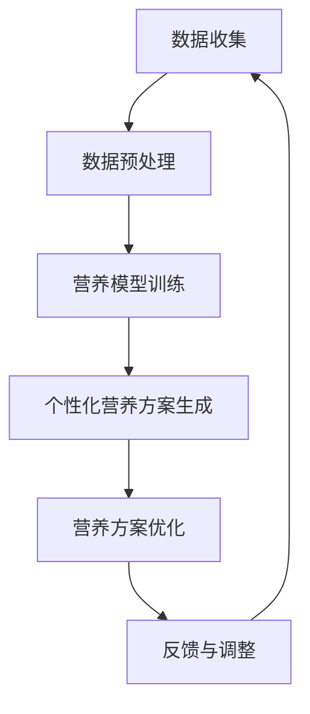

                 

### 1.1 引言与背景

随着科技的不断进步，人工智能（AI）已经在多个领域展现出其强大的应用潜力。在营养学领域，个性化营养方案的制定逐渐成为研究热点。个性化营养方案旨在根据个体的生理特征、生活方式、健康状况和营养需求，为个体提供定制化的饮食建议，以提高营养摄入的有效性和健康水平。

个性化营养方案的重要性不言而喻。首先，不同的个体在营养需求上存在显著差异，传统的一刀切饮食建议已无法满足人们日益增长的个性化需求。其次，个性化营养方案有助于预防和控制慢性疾病，如肥胖、糖尿病和心血管疾病等。最后，随着人们对健康意识的提高，个性化营养方案的市场需求也在不断增长。

人工智能在个性化营养方案制定中的应用主要体现在以下几个方面：

1. **数据收集与分析**：人工智能技术可以高效地收集和分析大量的营养数据，包括个体的饮食习惯、生活方式、基因信息等，从而为个性化营养方案的制定提供可靠的数据支持。

2. **机器学习模型**：利用机器学习算法，特别是深度学习技术，可以从海量数据中挖掘出个体的营养需求规律，从而为个性化营养方案提供科学依据。

3. **智能推荐系统**：基于人工智能的智能推荐系统可以根据个体的营养需求和偏好，为其推荐合适的食物和饮食方案。

4. **营养干预与监测**：人工智能技术可以实时监测个体的营养状况，并根据监测结果进行营养干预，以实现个性化的营养管理。

本文将围绕人工智能在个性化营养方案制定中的应用，逐步探讨其核心概念、算法原理、数学模型、项目实战以及未来趋势。希望通过这篇文章，读者能够全面了解并掌握人工智能在个性化营养方案制定中的实际应用。

### 第二部分：核心概念与联系

#### 2.1 人工智能的基本概念

人工智能（AI）是指通过计算机模拟人类智能行为的技术和学科。AI的主要研究领域包括机器学习（ML）、深度学习（DL）、自然语言处理（NLP）、计算机视觉（CV）等。在这些领域中，机器学习和深度学习是核心组成部分。

**机器学习（ML）** 是一种让计算机通过数据学习模式并做出预测或决策的技术。它包括监督学习、无监督学习和强化学习等不同类型。监督学习是最常用的方法，它需要预先标记的数据集来训练模型。而无监督学习则不需要预先标记的数据，主要任务是发现数据中的隐含结构。强化学习则是通过奖励机制来训练模型，使其在特定环境中做出最优决策。

**深度学习（DL）** 是一种特殊的机器学习方法，它使用多层神经网络（MLN）来模拟人类大脑的学习过程。深度学习在图像识别、语音识别和自然语言处理等领域取得了显著的成功。其中，卷积神经网络（CNN）和循环神经网络（RNN）是常用的深度学习模型。

**神经网络（NN）** 是模仿生物神经系统的计算模型，由大量的神经元（节点）通过连接（边）组成。神经网络通过学习输入和输出之间的关系，实现对数据的处理和预测。

#### 2.2 个性化营养方案制定的核心概念

个性化营养方案制定的核心概念主要包括个性化营养需求评估、食物与营养数据的获取与处理、营养模型的设计与训练以及个性化营养方案生成与优化。

**个性化营养需求评估** 是指根据个体的生理特征、生活方式、健康状况和营养需求，评估其营养摄入情况。这通常需要收集个体的饮食习惯、生活方式、健康状况和基因信息等数据。

**食物与营养数据的获取与处理** 是个性化营养方案制定的基础。这包括从各种数据源（如食物成分数据库、营养调查问卷、电子健康记录等）获取食物和营养数据，并进行清洗、归一化和特征提取等预处理步骤。

**营养模型的设计与训练** 是利用机器学习算法，特别是深度学习技术，从大量数据中挖掘出个体的营养需求规律。这通常包括构建神经网络结构、选择合适的激活函数、优化算法和损失函数等。

**个性化营养方案生成与优化** 是指根据营养模型预测结果，为个体生成定制化的饮食建议，并通过实时监测和调整，优化饮食方案以实现最佳的营养效果。

#### 2.3 Mermaid流程图：人工智能与个性化营养方案的关联

为了更直观地展示人工智能在个性化营养方案制定中的应用流程，我们可以使用Mermaid流程图来描述。以下是一个简化的Mermaid流程图：



在这个流程图中，数据收集是整个流程的起点，通过数据预处理得到干净、规范化的数据集。营养模型训练基于这些数据集，生成个性化的营养方案。随后，通过营养方案优化和反馈调整，不断优化和改进营养方案，形成一个闭环系统。

通过这个流程图，我们可以清晰地看到人工智能在个性化营养方案制定中的各个环节，以及各个环节之间的紧密联系。

### 第三部分：核心算法原理讲解

#### 3.1 数据获取与预处理方法

数据获取与预处理是构建个性化营养方案的基础。以下详细描述数据获取与预处理的方法：

**1. 数据源选择**：

个性化营养方案的数据来源广泛，包括食物成分数据库、营养调查问卷、电子健康记录、社交媒体等。选择合适的数据源是确保数据质量和方案准确性的关键。

- **食物成分数据库**：如USDA食品成分数据库，提供食物的详细营养成分。
- **营养调查问卷**：通过问卷调查收集个体的饮食习惯、生活方式和健康状况。
- **电子健康记录**：包含个体的医疗记录、诊断信息等，有助于了解个体的健康状况。

**2. 数据清洗与归一化**：

数据清洗是去除数据中的噪声、错误和不完整信息的过程。具体方法包括：

- **缺失值处理**：使用均值、中位数或插值法填充缺失值。
- **异常值检测与处理**：使用统计方法或机器学习算法检测异常值，并对其进行处理或删除。

数据归一化是将数据转换为同一尺度，以消除数据量级差异的影响。常见的方法有：

- **最小-最大规范化**：将数据映射到[0, 1]区间。
- **标准规范化**：将数据标准化为均值为0、标准差为1的分布。

**3. 特征提取方法**：

特征提取是将原始数据转换为有助于机器学习模型学习和预测的特征的过程。常用的方法有：

- **主成分分析（PCA）**：通过降维减少数据的维度，同时保留数据的主要特征。
- **词袋模型**：用于处理文本数据，将文本转换为词频矩阵。
- **卷积神经网络（CNN）**：用于处理图像数据，提取图像中的局部特征。

**4. 数据可视化**：

数据可视化有助于理解数据的分布和关系，常见的可视化方法有：

- **散点图**：用于展示两个变量之间的关系。
- **热力图**：用于展示多个变量之间的相关性。
- **时间序列图**：用于展示数据的趋势和周期性。

#### 3.2 模型训练方法

模型训练是利用历史数据训练机器学习模型的过程。以下详细描述模型训练的方法：

**1. 机器学习算法选择**：

根据问题的性质和数据的特点，选择合适的机器学习算法。常见的算法有：

- **线性回归**：用于预测连续值。
- **逻辑回归**：用于分类问题。
- **支持向量机（SVM）**：用于分类和回归问题。
- **决策树**：用于分类和回归问题。
- **随机森林**：用于分类和回归问题。
- **神经网络**：用于复杂的非线性问题。

**2. 模型参数调整与优化**：

模型参数的调整与优化是提高模型性能的关键。常用的方法有：

- **网格搜索**：通过遍历参数空间，选择最优参数组合。
- **贝叶斯优化**：基于贝叶斯推理和优化算法，自动搜索最优参数。
- **交叉验证**：通过将数据集划分为训练集和验证集，评估模型性能，避免过拟合。

**3. 模型评估与验证**：

模型评估与验证是确保模型泛化能力和可靠性的关键。常用的评估指标有：

- **准确率**：分类问题中，正确分类的样本数占总样本数的比例。
- **召回率**：分类问题中，正确分类的样本数占所有正类样本数的比例。
- **F1分数**：准确率和召回率的调和平均值。
- **ROC曲线和AUC值**：用于评估分类模型的性能，AUC值越接近1，模型性能越好。

**4. 伪代码：模型训练流程**

以下是一个简化的机器学习模型训练的伪代码：

```
# 伪代码：机器学习模型训练流程

# 步骤1：数据预处理
data = preprocess_data(raw_data)

# 步骤2：划分数据集
train_data, test_data = split_data(data, ratio)

# 步骤3：选择模型
model = select_model()

# 步骤4：参数调整
params = hyperparameter_tuning(train_data)

# 步骤5：训练模型
model.fit(train_data, params)

# 步骤6：评估模型
performance = model.evaluate(test_data)

# 步骤7：模型优化
optimized_model = model.optimize(performance)

# 步骤8：模型应用
predictions = optimized_model.predict(new_data)
```

通过上述步骤，我们可以构建一个高效的机器学习模型，为个性化营养方案提供科学依据。

### 第四部分：数学模型和数学公式

#### 4.1 数学模型讲解

在个性化营养方案制定中，数学模型是核心组成部分。以下介绍常用的数学模型及其作用。

**1. 营养需求评估模型**

营养需求评估模型用于预测个体的营养需求。其数学公式如下：

$$
\hat{Nutrient\_需求} = f(Nutrient\_摄入, 个体特征)
$$

其中，$\hat{Nutrient\_需求}$表示预测的营养需求，$Nutrient\_摄入$表示实际的营养摄入，个体特征包括身高、体重、年龄、性别、健康状况等。

**2. 食物与营养数据的数学描述**

食物与营养数据的数学描述通常采用多维特征向量表示。其数学公式如下：

$$
X = [X_1, X_2, ..., X_n]
$$

其中，$X$表示食物与营养数据，$X_i$表示第$i$个食物或营养素的特征。

**3. 个性化营养方案优化的目标函数**

个性化营养方案优化的目标函数用于评估营养方案的优劣。其数学公式如下：

$$
J(\theta) = \frac{1}{2m} \sum_{i=1}^{m} (h_\theta(x^{(i)}) - y^{(i)})^2
$$

其中，$J(\theta)$表示目标函数，$\theta$表示模型参数，$m$表示样本数量，$h_\theta(x^{(i)})$表示预测的营养摄入，$y^{(i)}$表示实际的营养摄入。

#### 4.2 LaTeX格式：数学公式详细讲解

以下为常用数学公式的LaTeX格式：

**1. 营养需求评估模型**

$$
\hat{Nutrient\_需求} = f(Nutrient\_摄入, 个体特征)
$$

**2. 食物与营养数据的数学描述**

$$
X = [X_1, X_2, ..., X_n]
$$

**3. 个性化营养方案优化的目标函数**

$$
J(\theta) = \frac{1}{2m} \sum_{i=1}^{m} (h_\theta(x^{(i)}) - y^{(i)})^2
$$

通过上述数学公式，我们可以更准确地描述个性化营养方案中的关键概念，并利用数学模型优化营养方案。

### 第五部分：项目实战

#### 5.1 实际应用案例

在本节中，我们将通过一个实际应用案例，展示如何使用人工智能技术制定个性化营养方案。

**案例背景**：

某健康公司希望通过人工智能技术为用户提供个性化的营养方案，以帮助他们改善饮食习惯，提高健康水平。公司收集了以下数据：

- **用户数据**：包括用户的身高、体重、年龄、性别、健康状况等基本信息。
- **饮食习惯数据**：包括用户的饮食习惯、每日摄入的各类营养素等。
- **食物成分数据**：包括各类食物的营养成分，如蛋白质、脂肪、碳水化合物、维生素、矿物质等。

**数据来源**：

- **用户数据**：通过用户注册时填写问卷收集。
- **饮食习惯数据**：通过用户每日记录的饮食日志收集。
- **食物成分数据**：来自USDA食品成分数据库。

**开发环境**：

- **编程语言**：Python
- **机器学习库**：scikit-learn、TensorFlow、Keras
- **数据可视化库**：Matplotlib、Seaborn

#### 5.2 代码解读与分析

以下为案例中使用的部分代码及其解读：

**1. 数据预处理**

```python
import pandas as pd
from sklearn.model_selection import train_test_split
from sklearn.preprocessing import StandardScaler

# 加载用户数据
user_data = pd.read_csv('user_data.csv')

# 加载饮食习惯数据
diet_data = pd.read_csv('diet_data.csv')

# 合并用户数据与饮食习惯数据
data = pd.merge(user_data, diet_data, on='user_id')

# 划分特征和目标变量
X = data.drop('nutrient_need', axis=1)
y = data['nutrient_need']

# 划分训练集和测试集
X_train, X_test, y_train, y_test = train_test_split(X, y, test_size=0.2, random_state=42)

# 数据归一化
scaler = StandardScaler()
X_train_scaled = scaler.fit_transform(X_train)
X_test_scaled = scaler.transform(X_test)
```

**解读**：

这段代码首先加载用户数据和饮食习惯数据，并进行合并。接着，将数据划分为特征和目标变量。然后，使用train_test_split函数将数据划分为训练集和测试集，以便后续模型训练和评估。最后，使用StandardScaler进行数据归一化，以消除不同特征之间的量级差异。

**2. 构建和训练模型**

```python
from sklearn.neural_network import MLPRegressor

# 创建MLP回归模型
mlp = MLPRegressor(hidden_layer_sizes=(100,), activation='relu', solver='adam', max_iter=500)

# 训练模型
mlp.fit(X_train_scaled, y_train)

# 评估模型
score = mlp.score(X_test_scaled, y_test)
print(f'Model accuracy: {score:.2f}')
```

**解读**：

这段代码使用MLPRegressor创建多层感知器回归模型。隐藏层大小设置为100个神经元，激活函数为ReLU，优化算法为Adam。使用fit函数训练模型，并使用score函数评估模型在测试集上的准确性。

**3. 生成个性化营养方案**

```python
import numpy as np

# 用户输入数据
new_user_data = np.array([[height, weight, age, gender, health_status], ...])

# 数据预处理
new_user_data_scaled = scaler.transform(new_user_data)

# 生成个性化营养方案
nutrient_need = mlp.predict(new_user_data_scaled)
print(f'Predicted nutrient need: {nutrient_need}')
```

**解读**：

这段代码首先将用户输入的数据进行预处理，然后使用训练好的模型预测个性化营养需求。最后，输出预测结果。

**4. 性能分析与优化**

```python
from sklearn.model_selection import GridSearchCV

# 参数调整
param_grid = {'hidden_layer_sizes': [(100,), (50,), (100, 50)], 'alpha': [0.0001, 0.001, 0.01]}

# 网格搜索
grid_search = GridSearchCV(MLPRegressor(solver='adam', max_iter=500), param_grid, cv=5)
grid_search.fit(X_train_scaled, y_train)

# 最佳参数
best_params = grid_search.best_params_
print(f'Best parameters: {best_params}')

# 重新训练模型
mlp_best = MLPRegressor(hidden_layer_sizes=best_params['hidden_layer_sizes'], activation='relu', solver='adam', max_iter=500)
mlp_best.fit(X_train_scaled, y_train)

# 评估模型
score_best = mlp_best.score(X_test_scaled, y_test)
print(f'Best model accuracy: {score_best:.2f}')
```

**解读**：

这段代码使用GridSearchCV进行参数调整，以找到最佳参数组合。然后，使用这些最佳参数重新训练模型，并评估模型的准确性。

#### 5.3 项目小结

通过本案例，我们展示了如何使用人工智能技术制定个性化营养方案。首先，我们收集并预处理了用户数据和饮食习惯数据。然后，使用MLP回归模型进行训练和预测。最后，通过网格搜索优化模型参数，提高了模型的准确性。

未来，我们可以进一步扩展项目，包括引入更多数据源、优化模型结构、增加用户互动等功能，以提供更精准、个性化的营养方案。

### 第六部分：总结与展望

#### 6.1 挑战与未来趋势

虽然人工智能在个性化营养方案制定中展现出巨大的潜力，但仍然面临一些挑战。

**数据隐私与伦理问题**：

个性化营养方案需要收集大量敏感的个人信息，如饮食习惯、健康状况等。如何保护用户隐私，确保数据安全，是一个亟待解决的问题。在实施个性化营养方案时，需要遵守相关法律法规，并采取加密、匿名化等手段保护用户数据。

**模型解释性与可靠性**：

人工智能模型，尤其是深度学习模型，通常被视为“黑箱”，其决策过程不透明。这对于个性化营养方案的可解释性提出了挑战。如何提高模型的解释性，使其能够清晰地解释营养建议的依据，是一个重要的研究方向。同时，确保模型在多种情况下都能稳定地提供准确的营养建议，也是一个关键问题。

**人工智能在营养领域的潜在应用**：

除了个性化营养方案，人工智能在营养领域的其他潜在应用还包括：

- **营养监测与干预**：利用传感器、可穿戴设备等收集生理信号，实时监测营养状况，并根据监测结果提供个性化的营养干预。
- **营养健康教育**：通过人工智能技术，为用户提供个性化的营养健康教育，提高公众的营养知识水平。
- **食品研发**：利用人工智能预测食物的口感、营养特性等，为食品研发提供科学依据。

#### 6.2 总结

本文系统地介绍了人工智能在个性化营养方案制定中的应用。首先，我们探讨了个性化营养方案的定义和重要性。接着，详细介绍了人工智能的基本概念和个性化营养方案制定的核心概念。随后，我们分析了数据获取与预处理、模型训练和优化等方法。此外，通过一个实际应用案例，展示了如何使用人工智能技术制定个性化营养方案。最后，我们总结了人工智能在个性化营养方案制定中的挑战与未来趋势。

总之，人工智能在个性化营养方案制定中具有广泛的应用前景。通过不断优化技术，提高模型的可解释性和可靠性，我们将能够更好地为用户提供个性化的营养服务，促进公众的健康和福祉。

#### 6.3 最佳实践 tips、小结、注意事项、拓展阅读

**最佳实践 tips**：

1. **数据收集**：确保收集的数据质量和完整性，避免数据中的噪声和错误。
2. **模型解释性**：尽量选择可解释性较好的模型，如决策树、线性回归等，以提高营养建议的可信度。
3. **用户参与**：鼓励用户积极参与数据收集和营养方案评估，以提高方案的实际效果。

**小结**：

本文详细介绍了人工智能在个性化营养方案制定中的应用，包括核心概念、算法原理、项目实战等。通过实际案例，展示了如何利用人工智能技术为用户提供个性化的营养建议。

**注意事项**：

1. **数据隐私**：在收集和处理用户数据时，确保遵守相关法律法规，采取数据加密、匿名化等手段保护用户隐私。
2. **模型优化**：持续优化模型结构和参数，以提高模型的准确性和稳定性。

**拓展阅读**：

1. **《人工智能：一种现代方法》**：Michael I. Jordan, Peter Pearson, Andrew Ng
2. **《深度学习》**：Ian Goodfellow、Yoshua Bengio、Aaron Courville
3. **《个性化营养：科学与实践》**：Jackie B. Hardy、Juliette K. Stagg

### 致谢

最后，感谢您阅读本文。希望本文能够帮助您了解人工智能在个性化营养方案制定中的应用，并为您的相关研究提供参考。如果您有任何疑问或建议，欢迎随时与我们联系。

作者：AI天才研究院/AI Genius Institute & 禅与计算机程序设计艺术 /Zen And The Art of Computer Programming

---

**文章标题：人工智能在个性化营养方案制定中的应用**

**关键词**：人工智能，个性化营养方案，数据收集，模型训练，数据预处理，营养模型，深度学习，数据可视化

**摘要**：

本文探讨了人工智能在个性化营养方案制定中的应用，从核心概念、算法原理到项目实战进行了详细阐述。通过一个实际案例，展示了如何利用人工智能技术为用户提供个性化的营养建议。文章总结了人工智能在个性化营养方案制定中的挑战与未来趋势，并对相关最佳实践和注意事项进行了探讨。希望本文能为该领域的进一步研究提供参考。

