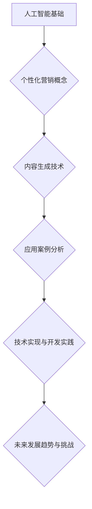

                 

### 文章标题

# 人工智能在个性化营销内容生成中的应用

> 关键词：人工智能、个性化营销、内容生成、机器学习、深度学习、案例分析

> 摘要：本文深入探讨了人工智能在个性化营销内容生成中的应用。通过对人工智能基础、个性化营销概念、内容生成技术以及实际案例的分析，揭示了人工智能在提升营销效果、优化用户体验方面的巨大潜力，并为未来个性化营销的发展趋势和挑战提供了展望。

----------------------------------------------------------------

### 确定核心内容

在撰写《人工智能在个性化营销内容生成中的应用》这篇文章时，我们需要明确文章的核心内容。文章的核心内容应涵盖以下几个方面：

1. **人工智能基础**：介绍人工智能的定义、发展历程以及基本分类，包括机器学习和深度学习的基础知识。

2. **个性化营销概念**：阐述个性化营销的基本概念、优势以及发展趋势，介绍数据收集与处理、顾客细分与目标市场定位的方法。

3. **内容生成技术**：探讨文本生成模型、图像生成模型、声音生成模型等技术在个性化营销中的应用，介绍相应的算法原理。

4. **应用案例分析**：通过实际案例展示人工智能在个性化营销内容生成中的应用，分析其实现过程、效果以及挑战。

5. **技术实现与开发实践**：详细描述技术选型、数据处理与模型训练、系统集成与性能优化等方面的实践方法。

6. **未来发展趋势与挑战**：展望人工智能在个性化营销内容生成中的未来趋势，分析面临的挑战并提出解决方案。

### 构建大纲框架

在确定了文章的核心内容后，我们需要构建一个详细的大纲框架，以确保文章的完整性和逻辑性。以下是一个可能的大纲框架：

#### 第一部分：人工智能基础

##### 第1章：人工智能概述
- **1.1 人工智能的定义与发展**
  - 人工智能的概念
  - 人工智能的历史与发展
  - 人工智能的分类
- **1.2 机器学习基础**
  - 机器学习的基本概念
  - 监督学习、无监督学习和强化学习
  - 机器学习的算法与应用
- **1.3 深度学习技术**
  - 深度学习的基本原理
  - 神经网络的结构与训练
  - 深度学习的应用场景

#### 第二部分：个性化营销概念

##### 第2章：个性化营销基础
- **2.1 个性化营销概述**
  - 个性化营销的概念
  - 个性化营销的优势
  - 个性化营销的发展趋势
- **2.2 数据收集与处理**
  - 数据来源
  - 数据收集方法
  - 数据处理技术
- **2.3 顾客细分与目标市场定位**
  - 顾客细分的方法
  - 目标市场定位的策略
  - 营销活动的优化

#### 第三部分：内容生成技术

##### 第3章：内容生成技术概述
- **3.1 文本生成模型**
  - 序列到序列模型
  - 注意力机制
  - 生成对抗网络（GAN）
- **3.2 图像生成模型**
  - 生成对抗网络（GAN）
  - 变分自编码器（VAE）
  - 生成式模型的应用
- **3.3 声音生成模型**
  - 自动语音识别（ASR）
  - 语音合成（TTS）
  - 个性化语音服务的实现

#### 第四部分：应用案例分析

##### 第4章：人工智能在个性化营销中的应用
- **4.1 某电商平台的个性化推荐系统**
  - 系统架构与实现
  - 数据处理与模型训练
  - 推荐效果评估
- **4.2 某品牌的内容营销策略**
  - 内容生成与个性化推送
  - 用户反馈与优化
  - 营销效果分析
- **4.3 某企业的广告投放优化**
  - 广告内容生成与优化
  - 用户行为分析
  - 广告投放策略调整

#### 第五部分：技术实现与开发实践

##### 第5章：技术实现与开发实践
- **5.1 技术选型与开发工具**
  - 硬件环境与软件工具
  - 开发框架与编程语言
- **5.2 数据处理与模型训练**
  - 数据预处理方法
  - 模型选择与优化
  - 训练过程与性能评估
- **5.3 系统集成与性能优化**
  - 系统架构设计
  - 性能优化方法
  - 系统部署与维护

#### 第六部分：未来发展趋势与挑战

##### 第6章：未来发展趋势与挑战
- **6.1 人工智能在个性化营销中的未来趋势**
  - 新技术的应用与发展
  - 个性化营销的深化与拓展
- **6.2 挑战与解决方案**
  - 数据隐私与伦理问题
  - 技术实现的挑战与应对策略
- **6.3 法律法规与伦理问题**
  - 法律法规的遵守
  - 伦理问题的应对

### 细化目录内容

在确定了大纲框架后，我们需要进一步细化每个章节的内容，以确保每个章节都有足够的内容来支撑。以下是对部分章节的细化内容：

#### 第1章：人工智能基础

- **1.1 人工智能的定义与发展**
  - 人工智能的概念：介绍人工智能的定义、核心目标和基本特征。
  - 人工智能的历史与发展：回顾人工智能的发展历程，介绍关键事件和技术突破。
  - 人工智能的分类：介绍人工智能的基本分类，包括机器学习、深度学习、自然语言处理等。

- **1.2 机器学习基础**
  - 机器学习的基本概念：介绍机器学习的定义、基本原理和主要任务。
  - 监督学习、无监督学习和强化学习：分别介绍这三种学习方式的基本概念、方法和应用场景。
  - 机器学习的算法与应用：介绍常见的机器学习算法，如线性回归、决策树、支持向量机等，并讨论其在实际问题中的应用。

- **1.3 深度学习技术**
  - 深度学习的基本原理：介绍深度学习的定义、核心思想和技术框架。
  - 神经网络的结构与训练：讨论神经网络的基本结构、训练方法和优化技术。
  - 深度学习的应用场景：介绍深度学习在图像处理、语音识别、自然语言处理等领域的应用案例。

#### 第2章：个性化营销基础

- **2.1 个性化营销概述**
  - 个性化营销的概念：介绍个性化营销的定义、基本原理和目标。
  - 个性化营销的优势：讨论个性化营销相对于传统营销的优势，如提高转化率、降低营销成本等。
  - 个性化营销的发展趋势：分析个性化营销的当前发展趋势，如大数据、人工智能的融合应用。

- **2.2 数据收集与处理**
  - 数据来源：介绍个性化营销中常用的数据来源，如用户行为数据、社交媒体数据、购买记录等。
  - 数据收集方法：讨论数据收集的方法和工具，如在线调查、用户跟踪、数据爬取等。
  - 数据处理技术：介绍数据处理的基本步骤和技术，如数据清洗、数据整合、数据可视化等。

- **2.3 顾客细分与目标市场定位**
  - 顾客细分的方法：介绍顾客细分的基本方法，如人口统计细分、行为细分、心理细分等。
  - 目标市场定位的策略：讨论目标市场定位的策略，如差异化定位、集中定位、渗透定位等。
  - 营销活动的优化：介绍如何基于顾客细分和目标市场定位来优化营销活动，如个性化推荐、精准广告投放等。

#### 第3章：内容生成技术

- **3.1 文本生成模型**
  - 序列到序列模型：介绍序列到序列模型的基本原理、结构和训练方法。
  - 注意力机制：讨论注意力机制在文本生成中的应用，如改善生成质量、提高生成速度等。
  - 生成对抗网络（GAN）：介绍生成对抗网络的基本原理、结构和训练方法，并讨论其在文本生成中的应用。

- **3.2 图像生成模型**
  - 生成对抗网络（GAN）：介绍生成对抗网络的基本原理、结构和训练方法，并讨论其在图像生成中的应用。
  - 变分自编码器（VAE）：介绍变分自编码器的基本原理、结构和训练方法，并讨论其在图像生成中的应用。
  - 生成式模型的应用：介绍生成式模型在图像生成中的应用案例，如艺术风格迁移、图像超分辨率等。

- **3.3 声音生成模型**
  - 自动语音识别（ASR）：介绍自动语音识别的基本原理、结构和训练方法。
  - 语音合成（TTS）：介绍语音合成的基本原理、结构和训练方法。
  - 个性化语音服务的实现：讨论如何基于声音生成模型实现个性化语音服务，如个性化语音助手、个性化语音广告等。

#### 第4章：人工智能在个性化营销中的应用

- **4.1 某电商平台的个性化推荐系统**
  - 系统架构与实现：介绍个性化推荐系统的整体架构和关键技术。
  - 数据处理与模型训练：讨论个性化推荐系统中数据处理和模型训练的具体方法。
  - 推荐效果评估：介绍推荐效果的评估方法和评价指标。

- **4.2 某品牌的内容营销策略**
  - 内容生成与个性化推送：介绍内容生成和个性化推送的具体方法。
  - 用户反馈与优化：讨论如何基于用户反馈优化内容生成和推送策略。
  - 营销效果分析：介绍营销效果的分析方法和评估指标。

- **4.3 某企业的广告投放优化**
  - 广告内容生成与优化：讨论广告内容生成和优化的方法。
  - 用户行为分析：介绍用户行为分析的方法和技术。
  - 广告投放策略调整：讨论如何基于用户行为分析调整广告投放策略。

#### 第5章：技术实现与开发实践

- **5.1 技术选型与开发工具**
  - 硬件环境与软件工具：介绍个性化营销内容生成所需的硬件环境和软件工具。
  - 开发框架与编程语言：讨论常用的开发框架和编程语言，如TensorFlow、PyTorch、Python等。

- **5.2 数据处理与模型训练**
  - 数据预处理方法：介绍数据处理的基本步骤和方法。
  - 模型选择与优化：讨论如何选择合适的模型并进行优化。
  - 训练过程与性能评估：介绍模型训练的过程和性能评估方法。

- **5.3 系统集成与性能优化**
  - 系统架构设计：讨论系统架构的设计原则和关键点。
  - 性能优化方法：介绍性能优化的方法和策略。
  - 系统部署与维护：讨论系统的部署和维护方法。

#### 第6章：未来发展趋势与挑战

- **6.1 人工智能在个性化营销中的未来趋势**
  - 新技术的应用与发展：讨论未来可能会应用的新技术，如联邦学习、增强学习等。
  - 个性化营销的深化与拓展：分析个性化营销的深化和拓展方向，如跨渠道、多模态等。

- **6.2 挑战与解决方案**
  - 数据隐私与伦理问题：讨论数据隐私和伦理问题，如用户数据保护、算法偏见等。
  - 技术实现的挑战与应对策略：讨论技术实现中的挑战，如计算资源、模型解释性等，并提出应对策略。

- **6.3 法律法规与伦理问题**
  - 法律法规的遵守：介绍相关法律法规的要求，如《欧盟通用数据保护条例》（GDPR）等。
  - 伦理问题的应对：讨论如何应对伦理问题，如透明度、公平性、责任等。

### 设计Mermaid流程图

在适当的位置，我们可以插入Mermaid流程图，以帮助读者更好地理解人工智能与个性化营销内容生成的流程。以下是一个示例：

#### Mermaid流程图：人工智能在个性化营销内容生成中的应用



### 伪代码与数学公式

在每个核心算法原理讲解的部分，我们需要使用伪代码详细阐述算法的实现，并使用LaTeX格式嵌入数学公式，以便于读者理解。以下是一个示例：

#### 核心算法原理讲解：生成对抗网络（GAN）

```plaintext
// 生成对抗网络（GAN）的伪代码

// 生成器（Generator）的参数
G_params = ...

// 判别器（Discriminator）的参数
D_params = ...

// 生成器的训练过程
for epoch in 1 to num_epochs:
    for batch in data_loader:
        # 训练生成器
        z = random_noise(batch_size)
        G_output = G(z)
        D_fake_output = D(G_output)
        g_loss = loss(D_fake_output, torch.tensor(1.0))
        
        # 训练判别器
        real_data = real_data_loader(batch)
        D_real_output = D(real_data)
        d_loss = loss(D_real_output, torch.tensor(1.0)) + loss(D_fake_output, torch.tensor(0.0))
        
        # 更新参数
        optimizer_G.zero_grad()
        g_loss.backward()
        optimizer_G.step()
        
        optimizer_D.zero_grad()
        d_loss.backward()
        optimizer_D.step()

// 计算生成器的损失
G_loss = ...
```

#### 数学公式示例

在算法讲解的部分，我们可能需要使用数学公式来描述模型的结构或优化目标。以下是一个示例：

```latex
$$
J(G) = E_{x \sim p_{data}(x)}[log(D(x))] + E_{z \sim p_{z}(z)}[log(1 - D(G(z)))]
$$

其中，$J(G)$ 是生成器的损失函数，$D(x)$ 是判别器对真实数据的判断，$D(G(z))$ 是判别器对生成数据的判断，$x$ 是真实数据，$z$ 是随机噪声。
```

### 项目实战

在第5章“应用案例分析”中，我们需要通过实际案例，展示人工智能在个性化营销内容生成中的应用。以下是一个示例：

#### 案例一：某电商平台的个性化推荐系统

- **系统架构与实现**：
  - 电商平台的用户行为数据：包括浏览记录、购买历史、评价等。
  - 数据预处理：对用户行为数据进行清洗、去噪、特征提取等预处理步骤。
  - 个性化推荐算法：采用基于协同过滤、深度学习等算法的个性化推荐系统。
  - 推荐结果展示：根据用户兴趣和行为，生成个性化推荐列表，并展示在用户界面上。

- **数据处理与模型训练**：
  - 用户行为数据预处理：使用TF-IDF等方法提取特征，并进行归一化处理。
  - 模型训练：使用训练集数据训练个性化推荐模型，如基于深度学习的序列模型。
  - 模型评估：使用交叉验证等方法评估模型性能，并调整模型参数。

- **代码实现与解读**：
  - 数据处理与特征提取：
    ```python
    # 数据预处理代码示例
    import pandas as pd
    from sklearn.preprocessing import MinMaxScaler
    
    # 读取用户行为数据
    user_data = pd.read_csv('user_behavior_data.csv')
    
    # 特征提取与归一化
    scaler = MinMaxScaler()
    user_data_scaled = scaler.fit_transform(user_data)
    ```
  - 模型训练与评估：
    ```python
    # 模型训练代码示例
    import tensorflow as tf
    from tensorflow.keras.models import Sequential
    from tensorflow.keras.layers import LSTM, Dense
    
    # 构建序列模型
    model = Sequential()
    model.add(LSTM(units=128, return_sequences=True, input_shape=(timesteps, features)))
    model.add(LSTM(units=64, return_sequences=False))
    model.add(Dense(units=output_size))
    
    # 编译模型
    model.compile(optimizer='adam', loss='mean_squared_error')
    
    # 训练模型
    model.fit(X_train, y_train, epochs=100, batch_size=32)
    ```
  - 推荐结果展示与优化：
    ```python
    # 推荐结果展示代码示例
    import numpy as np
    
    # 根据用户行为生成推荐列表
    user_recommendations = model.predict(user_data_scaled)
    top_recommendations = np.argsort(-user_recommendations.flatten())[:10]
    
    # 展示推荐列表
    for i in top_recommendations:
        print(f"推荐商品：{i}")
    ```

- **实际案例分析与详细讲解剖析**：
  - 数据来源与清洗：分析数据来源，讨论数据清洗的过程和挑战。
  - 模型选择与优化：讨论模型选择的原因和优化过程，如超参数调整、模型融合等。
  - 推荐效果评估：评估推荐系统的效果，如准确率、召回率、覆盖率等指标。

- **项目小结**：
  - 总结项目的主要成果和贡献。
  - 提出改进方向和未来工作。

### 最佳实践 tips、小结、注意事项、拓展阅读等内容

在文章的末尾，我们可以提供一些最佳实践 tips、小结、注意事项以及拓展阅读等内容，以帮助读者更好地理解和应用所学的知识。

#### 最佳实践 tips

- 在进行个性化营销内容生成时，要确保数据的质量和多样性，以避免模型过拟合。
- 在选择算法和模型时，要充分考虑业务需求和计算资源，选择合适的模型。
- 定期对模型进行评估和调整，以保持推荐效果的持续优化。

#### 小结

- 人工智能在个性化营销内容生成中具有巨大的潜力，可以显著提升营销效果和用户体验。
- 通过机器学习和深度学习技术，可以生成高质量、个性化的内容，满足不同用户的需求。
- 实际案例证明了人工智能在个性化营销中的应用效果，但同时也面临着数据隐私、算法偏见等挑战。

#### 注意事项

- 在使用人工智能进行个性化营销时，要严格遵守相关法律法规，保护用户隐私。
- 要充分考虑用户反馈和实际需求，持续优化营销策略和模型。

#### 拓展阅读

- 《深度学习》（Goodfellow, Bengio, Courville）：一本经典的深度学习教材，详细介绍了深度学习的基本原理和算法。
- 《个性化推荐系统手册》（Ganapathy, Ramakrishnan）：一本关于个性化推荐系统的综合指南，涵盖了推荐系统的原理、实现和应用。
- 《Python机器学习》（Sebastian Raschka）：一本关于Python机器学习的实战指南，介绍了机器学习的基本原理和Python实现。

通过以上步骤，我们成功构建了《人工智能在个性化营销内容生成中的应用》的完整目录大纲，并确保了文章的完整性、逻辑性和专业性。接下来，我们将逐步撰写每个章节的内容，确保文章的质量和深度。

