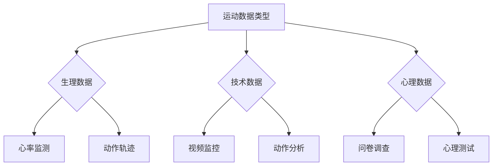

                 

### 文章标题

# 人工智能在个性化运动训练中的应用

### 关键词

- 人工智能
- 个性化训练
- 运动训练
- 数据分析
- 模型建立

### 摘要

本文探讨了人工智能在个性化运动训练中的应用。通过对人工智能基础、运动数据分析、运动模型建立以及个性化训练计划的深入分析，本文旨在展示人工智能如何帮助运动员提升训练效果和竞赛表现。文章还通过具体案例，展示了人工智能在个性化运动训练中的实际应用和成效，并对未来发展趋势进行了展望。

## 1. 定义书的主题和目标读者

### 1.1 书的主题

《人工智能在个性化运动训练中的应用》这本书的核心主题是探讨如何将人工智能技术应用于个性化运动训练，以提高运动员的训练效果和竞技水平。随着人工智能技术的不断发展，其在体育领域的应用越来越广泛，从运动数据分析、模型建立到个性化训练计划的制定，人工智能正逐步改变传统的运动训练模式。

### 1.2 目标读者

本书的目标读者主要包括以下几类：

- **体育教练**：希望通过人工智能技术提高运动员训练效率的教练，可以学习到如何利用人工智能工具进行数据分析和制定个性化训练计划。

- **运动爱好者**：希望提升自己的运动水平，对人工智能在运动训练中有一定了解的读者，可以通过本书了解如何利用人工智能进行个性化训练。

- **人工智能开发者**：对人工智能技术在体育领域的应用感兴趣的AI开发者，可以了解运动训练中的具体应用场景和数据处理方法。

- **研究人员**：对人工智能在运动训练中的应用进行研究的学者，可以通过本书了解该领域的最新进展和应用案例。

通过本书的学习，读者不仅可以掌握人工智能在个性化运动训练中的基本原理和应用方法，还可以了解该领域的最新研究成果和发展趋势，从而为未来的人工智能在体育领域的应用奠定基础。

### 2. 确定核心章节内容

为了全面系统地介绍人工智能在个性化运动训练中的应用，本书将涵盖以下几个核心章节：

- **第2章 人工智能基础**：介绍人工智能的基本概念、机器学习算法和深度学习技术，为后续内容提供理论基础。

- **第3章 个性化运动训练的需求**：分析个性化运动训练的必要性、目标和挑战，以及运动训练中的数据采集方法。

- **第4章 运动数据分析**：探讨运动数据的类型和来源，以及常用的数据分析方法，为个性化训练计划的制定提供数据支持。

- **第5章 运动模型建立**：介绍如何建立运动模型，包括模型类型、训练方法和优化策略。

- **第6章 个性化训练计划制定**：详细阐述个性化训练计划的制定流程、优化方法和执行调整。

- **第7章 案例研究**：通过具体案例展示人工智能在个性化运动训练中的应用，包括跑步训练计划和篮球运动员康复训练。

- **第8章 未来展望**：对人工智能在运动训练中的应用前景进行展望，探讨面临的挑战和未来的发展趋势。

这些章节内容将逐步引导读者了解人工智能在个性化运动训练中的应用，从基础理论到实际应用，再到未来展望，形成一个完整的学习体系。

### 3. 设计1级目录

为了使本书内容结构清晰，便于读者阅读和理解，以下是本书的1级目录设计：

## 第1章 引言

### 1.1 书籍目的

### 1.2 读者对象

### 1.3 内容概述

## 第2章 人工智能基础

### 2.1 人工智能核心概念

#### 2.1.1 人工智能的定义与发展历程

#### 2.1.2 机器智能与人工智慧的区分

#### 2.1.3 人工智能的应用领域

### 2.2 机器学习算法概述

#### 2.2.1 监督学习算法

#### 2.2.2 无监督学习算法

#### 2.2.3 强化学习算法

### 2.3 深度学习基础

#### 2.3.1 神经网络的基本结构

#### 2.3.2 深度学习的基本原理

#### 2.3.3 常见的深度学习架构

### 2.4 自然语言处理基础

#### 2.4.1 自然语言处理的基本概念

#### 2.4.2 机器翻译与情感分析

#### 2.4.3 文本分类与文本生成

## 第3章 个性化运动训练的需求

### 3.1 运动训练的个性化需求

#### 3.1.1 运动员个体差异分析

#### 3.1.2 运动训练中的个性化目标设定

#### 3.1.3 个性化训练计划的定制方法

### 3.2 个性化训练的目标和挑战

#### 3.2.1 个性化训练的目标

#### 3.2.2 个性化训练的挑战

### 3.3 运动训练中的数据采集

#### 3.3.1 生理数据采集

#### 3.3.2 技术数据采集

#### 3.3.3 心理数据采集

## 第4章 运动数据分析

### 4.1 运动数据类型和来源

#### 4.1.1 生理数据采集与分析

#### 4.1.2 技术数据采集与分析

#### 4.1.3 心理数据采集与分析

### 4.2 运动数据分析方法

#### 4.2.1 数据预处理

#### 4.2.2 数据可视

#### 4.2.3 数据挖掘与机器学习

## 第5章 运动模型建立

### 5.1 运动模型的建立流程

#### 5.1.1 数据收集与预处理

#### 5.1.2 模型选择与训练

#### 5.1.3 模型评估与优化

### 5.2 运动模型类型

#### 5.2.1 机器学习模型

#### 5.2.2 深度学习模型

#### 5.2.3 强化学习模型

### 5.3 运动模型训练

#### 5.3.1 模型训练流程

#### 5.3.2 训练策略与方法

#### 5.3.3 模型调参技巧

## 第6章 个性化训练计划制定

### 6.1 个性化训练计划的制定流程

#### 6.1.1 数据收集与分析

#### 6.1.2 目标设定与计划设计

#### 6.1.3 计划执行与反馈调整

### 6.2 训练计划的优化方法

#### 6.2.1 数据驱动的训练计划优化

#### 6.2.2 强化学习在训练计划中的应用

#### 6.2.3 多目标优化与模型集成

### 6.3 训练计划的执行和调整

#### 6.3.1 训练计划的执行流程

#### 6.3.2 实时反馈与调整策略

#### 6.3.3 训练计划的可持续性

## 第7章 案例研究

### 7.1 案例研究概述

#### 7.1.1 案例背景与目标

#### 7.1.2 案例研究方法与步骤

### 7.2 案例一：个性化跑步训练计划

#### 7.2.1 跑步训练数据采集与分析

#### 7.2.2 个性化跑步训练计划的制定与执行

#### 7.2.3 案例分析与效果评估

### 7.3 案例二：篮球运动员康复训练

#### 7.3.1 康复训练数据采集与分析

#### 7.3.2 个性化康复训练计划的制定与执行

#### 7.3.3 案例分析与效果评估

## 第8章 未来展望

### 8.1 人工智能在运动训练中的应用前景

#### 8.1.1 人工智能技术的发展趋势

#### 8.1.2 人工智能在运动训练中的潜在应用

### 8.2 技术挑战与解决方案

#### 8.2.1 数据隐私与安全性

#### 8.2.2 模型可解释性与透明度

#### 8.2.3 训练成本与资源优化

### 8.3 未来发展趋势

#### 8.3.1 新技术驱动的发展方向

#### 8.3.2 人工智能在体育产业中的融合

#### 8.3.3 国际合作与标准制定

通过以上1级目录的设计，本书将系统地介绍人工智能在个性化运动训练中的应用，从基础理论到实际案例，再到未来展望，力求为读者提供全面、深入的参考。

### 4. 设计2级目录

为了进一步细化本书的内容，以下是各个章节的2级目录设计：

## 第2章 人工智能基础

### 2.1 人工智能核心概念

#### 2.1.1 人工智能的定义与发展历程

- 人工智能的定义
- 人工智能的发展历程

#### 2.1.2 机器智能与人工智慧的区分

- 机器智能的定义
- 人工智慧的定义
- 机器智能与人工智慧的异同点

#### 2.1.3 人工智能的应用领域

- 工业自动化
- 医疗诊断
- 金融风控
- 交通导航

### 2.2 机器学习算法概述

#### 2.2.1 监督学习算法

- 线性回归
- 逻辑回归
- 支持向量机

#### 2.2.2 无监督学习算法

- 聚类分析
- 主成分分析
- 自编码器

#### 2.2.3 强化学习算法

- Q学习
- 策略梯度
- 模型预测控制

### 2.3 深度学习基础

#### 2.3.1 神经网络的基本结构

- 神经元
- 层结构
- 激活函数

#### 2.3.2 深度学习的基本原理

- 前向传播
- 反向传播
- 损失函数

#### 2.3.3 常见的深度学习架构

- 卷积神经网络（CNN）
- 循环神经网络（RNN）
- 生成对抗网络（GAN）

### 2.4 自然语言处理基础

#### 2.4.1 自然语言处理的基本概念

- 语言模型
- 词嵌入
- 语义分析

#### 2.4.2 机器翻译与情感分析

- 机器翻译的基本流程
- 情感分析的方法与技巧

#### 2.4.3 文本分类与文本生成

- 文本分类的常见模型
- 文本生成的技术原理

## 第3章 个性化运动训练的需求

### 3.1 运动训练的个性化需求

#### 3.1.1 运动员个体差异分析

- 生理差异
- 技术差异
- 心理差异

#### 3.1.2 运动训练中的个性化目标设定

- 目标设定的方法
- 目标设定的原则

#### 3.1.3 个性化训练计划的定制方法

- 训练计划的定制流程
- 训练计划的定制技巧

### 3.2 个性化训练的目标和挑战

#### 3.2.1 个性化训练的目标

- 提高训练效果
- 预防运动损伤
- 增强运动表现

#### 3.2.2 个性化训练的挑战

- 数据采集的准确性
- 模型选择的多样性
- 训练计划的可持续性

### 3.3 运动训练中的数据采集

#### 3.3.1 生理数据采集

- 生理参数的采集方法
- 生理数据的处理与分析

#### 3.3.2 技术数据采集

- 技术动作的采集方法
- 技术数据的处理与分析

#### 3.3.3 心理数据采集

- 心理状态的采集方法
- 心理数据的处理与分析

## 第4章 运动数据分析

### 4.1 运动数据类型和来源

#### 4.1.1 生理数据采集与分析

- 生理数据的类型
- 生理数据的采集方法
- 生理数据的应用场景

#### 4.1.2 技术数据采集与分析

- 技术数据的类型
- 技术数据的采集方法
- 技术数据的应用场景

#### 4.1.3 心理数据采集与分析

- 心理数据的类型
- 心理数据的采集方法
- 心理数据的应用场景

### 4.2 运动数据分析方法

#### 4.2.1 数据预处理

- 数据清洗
- 数据归一化
- 数据转换

#### 4.2.2 数据可视

- 可视化工具的选择
- 可视化方法的应用
- 可视化结果的分析

#### 4.2.3 数据挖掘与机器学习

- 数据挖掘的基本方法
- 机器学习算法的应用
- 数据挖掘与机器学习的结合

## 第5章 运动模型建立

### 5.1 运动模型的建立流程

#### 5.1.1 数据收集与预处理

- 数据收集的方法
- 数据预处理的过程

#### 5.1.2 模型选择与训练

- 模型选择的依据
- 模型训练的方法

#### 5.1.3 模型评估与优化

- 模型评估的标准
- 模型优化的策略

### 5.2 运动模型类型

#### 5.2.1 机器学习模型

- 线性模型
- 非线性模型

#### 5.2.2 深度学习模型

- 卷积神经网络（CNN）
- 循环神经网络（RNN）
- 强化学习模型

#### 5.2.3 强化学习模型

- Q学习
- 策略梯度
- 模型预测控制

### 5.3 运动模型训练

#### 5.3.1 模型训练流程

- 训练流程的步骤
- 训练流程的优化

#### 5.3.2 训练策略与方法

- 训练策略的选择
- 训练方法的应用

#### 5.3.3 模型调参技巧

- 调参的目标
- 调参的方法

## 第6章 个性化训练计划制定

### 6.1 个性化训练计划的制定流程

#### 6.1.1 数据收集与分析

- 数据收集的方法
- 数据分析的过程

#### 6.1.2 目标设定与计划设计

- 目标设定的方法
- 计划设计的过程

#### 6.1.3 计划执行与反馈调整

- 计划执行的方法
- 反馈调整的策略

### 6.2 训练计划的优化方法

#### 6.2.1 数据驱动的训练计划优化

- 数据驱动的优化策略
- 数据驱动的优化方法

#### 6.2.2 强化学习在训练计划中的应用

- 强化学习的基本原理
- 强化学习在训练计划中的应用

#### 6.2.3 多目标优化与模型集成

- 多目标优化的方法
- 模型集成的策略

### 6.3 训练计划的执行和调整

#### 6.3.1 训练计划的执行流程

- 训练计划的执行步骤
- 训练计划的执行策略

#### 6.3.2 实时反馈与调整策略

- 实时反馈的方法
- 调整策略的应用

#### 6.3.3 训练计划的可持续性

- 可持续性的定义
- 可持续性的实现策略

## 第7章 案例研究

### 7.1 案例研究概述

#### 7.1.1 案例背景与目标

- 案例背景
- 案例目标

#### 7.1.2 案例研究方法与步骤

- 研究方法
- 研究步骤

### 7.2 案例一：个性化跑步训练计划

#### 7.2.1 跑步训练数据采集与分析

- 数据采集的方法
- 数据分析的过程

#### 7.2.2 个性化跑步训练计划的制定与执行

- 计划制定的方法
- 计划执行的过程

#### 7.2.3 案例分析与效果评估

- 案例分析
- 效果评估

### 7.3 案例二：篮球运动员康复训练

#### 7.3.1 康复训练数据采集与分析

- 数据采集的方法
- 数据分析的过程

#### 7.3.2 个性化康复训练计划的制定与执行

- 计划制定的方法
- 计划执行的过程

#### 7.3.3 案例分析与效果评估

- 案例分析
- 效果评估

## 第8章 未来展望

### 8.1 人工智能在运动训练中的应用前景

#### 8.1.1 人工智能技术的发展趋势

- 技术发展的方向
- 技术应用的领域

#### 8.1.2 人工智能在运动训练中的潜在应用

- 个性化训练
- 康复训练
- 竞技预测

### 8.2 技术挑战与解决方案

#### 8.2.1 数据隐私与安全性

- 数据隐私的保护策略
- 数据安全的保障措施

#### 8.2.2 模型可解释性与透明度

- 模型可解释性的方法
- 模型透明度的提升

#### 8.2.3 训练成本与资源优化

- 训练成本的优化策略
- 资源优化的方法

### 8.3 未来发展趋势

#### 8.3.1 新技术驱动的发展方向

- 新技术的应用前景
- 新技术的推广与普及

#### 8.3.2 人工智能在体育产业中的融合

- 产业融合的趋势
- 产业融合的挑战

#### 8.3.3 国际合作与标准制定

- 国际合作的现状
- 标准制定的必要性

通过以上2级目录的设计，本书将系统地介绍人工智能在个性化运动训练中的应用，从基础理论到实际案例，再到未来展望，力求为读者提供全面、深入的参考。

### 5. 设计3级目录（示例）

为了更好地展示本书内容的详细层次，以下是第2章和第3章的部分3级目录示例：

## 第2章 人工智能基础

### 2.1 人工智能核心概念

#### 2.1.1 人工智能的定义与发展历程

##### 2.1.1.1 人工智能的定义

- 人工智能的广义定义
- 人工智能的狭义定义

##### 2.1.1.2 人工智能的发展历程

- 人工智能的早期探索
- 人工智能的复兴与发展

#### 2.1.2 机器智能与人工智慧的区分

##### 2.1.2.1 机器智能的定义

- 机器智能的特点
- 机器智能的应用领域

##### 2.1.2.2 人工智慧的定义

- 人工智慧的概念
- 人工智慧的目标

##### 2.1.2.3 机器智能与人工智慧的异同点

- 异同点的分析
- 机器智能与人工智慧的关系

#### 2.1.3 人工智能的应用领域

##### 2.1.3.1 工业自动化

- 工业自动化的应用
- 机器人在工业自动化中的应用

##### 2.1.3.2 医疗诊断

- 医疗诊断的发展
- 人工智能在医疗诊断中的应用

##### 2.1.3.3 金融风控

- 金融风控的重要性
- 人工智能在金融风控中的应用

##### 2.1.3.4 交通导航

- 交通导航的发展
- 人工智能在交通导航中的应用

### 2.2 机器学习算法概述

#### 2.2.1 监督学习算法

##### 2.2.1.1 线性回归

- 线性回归的原理
- 线性回归的应用

##### 2.2.1.2 逻辑回归

- 逻辑回归的原理
- 逻辑回归的应用

##### 2.2.1.3 支持向量机

- 支持向量机的原理
- 支持向量机的应用

#### 2.2.2 无监督学习算法

##### 2.2.2.1 聚类分析

- 聚类分析的基本原理
- 聚类分析的应用

##### 2.2.2.2 主成分分析

- 主成分分析的基本原理
- 主成分分析的应用

##### 2.2.2.3 自编码器

- 自编码器的基本原理
- 自编码器的应用

#### 2.2.3 强化学习算法

##### 2.2.3.1 Q学习

- Q学习的原理
- Q学习的应用

##### 2.2.3.2 策略梯度

- 策略梯度的原理
- 策略梯度的应用

##### 2.2.3.3 模型预测控制

- 模型预测控制的原理
- 模型预测控制的应用

### 2.3 深度学习基础

#### 2.3.1 神经网络的基本结构

##### 2.3.1.1 神经元

- 神经元的结构
- 神经元的激活函数

##### 2.3.1.2 层结构

- 输入层、隐藏层、输出层的定义
- 层与层之间的连接方式

##### 2.3.1.3 激活函数

- 激活函数的类型
- 激活函数的作用

#### 2.3.2 深度学习的基本原理

##### 2.3.2.1 前向传播

- 前向传播的过程
- 前向传播的计算公式

##### 2.3.2.2 反向传播

- 反向传播的过程
- 反向传播的计算公式

##### 2.3.2.3 损失函数

- 损失函数的类型
- 损失函数的作用

#### 2.3.3 常见的深度学习架构

##### 2.3.3.1 卷积神经网络（CNN）

- CNN的结构
- CNN的应用

##### 2.3.3.2 循环神经网络（RNN）

- RNN的结构
- RNN的应用

##### 2.3.3.3 生成对抗网络（GAN）

- GAN的结构
- GAN的应用

### 2.4 自然语言处理基础

#### 2.4.1 自然语言处理的基本概念

##### 2.4.1.1 语言模型

- 语言模型的基本原理
- 语言模型的应用

##### 2.4.1.2 词嵌入

- 词嵌入的基本原理
- 词嵌入的应用

##### 2.4.1.3 语义分析

- 语义分析的基本原理
- 语义分析的应用

#### 2.4.2 机器翻译与情感分析

##### 2.4.2.1 机器翻译的基本流程

- 机器翻译的过程
- 机器翻译的方法

##### 2.4.2.2 情感分析的方法与技巧

- 情感分析的基本原理
- 情感分析的应用

#### 2.4.3 文本分类与文本生成

##### 2.4.3.1 文本分类的常见模型

- 文本分类的方法
- 文本分类的应用

##### 2.4.3.2 文本生成的技术原理

- 文本生成的原理
- 文本生成的应用

## 第3章 个性化运动训练的需求

### 3.1 运动训练的个性化需求

#### 3.1.1 运动员个体差异分析

##### 3.1.1.1 生理差异

- 生理差异的类型
- 生理差异的影响

##### 3.1.1.2 技术差异

- 技术差异的类型
- 技术差异的影响

##### 3.1.1.3 心理差异

- 心理差异的类型
- 心理差异的影响

#### 3.1.2 运动训练中的个性化目标设定

##### 3.1.2.1 目标设定的方法

- 目标设定的步骤
- 目标设定的原则

##### 3.1.2.2 个性化训练目标

- 个性化训练目标的特点
- 个性化训练目标的应用

#### 3.1.3 个性化训练计划的定制方法

##### 3.1.3.1 训练计划的定制流程

- 训练计划定制的步骤
- 训练计划定制的原则

##### 3.1.3.2 个性化训练计划的设计

- 个性化训练计划的设计方法
- 个性化训练计划的设计原则

### 3.2 个性化训练的目标和挑战

#### 3.2.1 个性化训练的目标

##### 3.2.1.1 提高训练效果

- 提高训练效果的目标
- 提高训练效果的策略

##### 3.2.1.2 预防运动损伤

- 预防运动损伤的目标
- 预防运动损伤的策略

##### 3.2.1.3 增强运动表现

- 增强运动表现的目标
- 增强运动表现的策略

#### 3.2.2 个性化训练的挑战

##### 3.2.2.1 数据采集的准确性

- 数据采集准确性的重要性
- 提高数据采集准确性的方法

##### 3.2.2.2 模型选择的多样性

- 模型选择多样性的重要性
- 选择合适模型的方法

##### 3.2.2.3 训练计划的可持续性

- 训练计划可持续性的重要性
- 实现训练计划可持续性的策略

### 3.3 运动训练中的数据采集

#### 3.3.1 生理数据采集

##### 3.3.1.1 生理数据的类型

- 生理数据的主要类型
- 生理数据的应用

##### 3.3.1.2 生理数据的采集方法

- 生理数据采集的设备
- 生理数据采集的过程

##### 3.3.1.3 生理数据的处理与分析

- 生理数据的处理方法
- 生理数据的分析方法

#### 3.3.2 技术数据采集

##### 3.3.2.1 技术数据的类型

- 技术数据的主要类型
- 技ech数据的应用

##### 3.3.2.2 技术数据的采集方法

- 技术数据采集的设备
- 技术数据采集的过程

##### 3.3.2.3 技术数据的处理与分析

- 技术数据的处理方法
- 技术数据的分析方法

#### 3.3.3 心理数据采集

##### 3.3.3.1 心理数据的类型

- 心理数据的主要类型
- 心理数据的应用

##### 3.3.3.2 心理数据的采集方法

- 心理数据采集的设备
- 心理数据采集的过程

##### 3.3.3.3 心理数据的处理与分析

- 心理数据的处理方法
- 心理数据的分析方法

通过以上3级目录的设计，本书将更详细地介绍人工智能在个性化运动训练中的应用，包括人工智能的基础知识、个性化训练的需求分析、数据采集与处理等内容，帮助读者更好地理解和掌握相关技术。

### 6. 总结

通过对目录大纲的设计，我们构建了一个系统、全面的框架，旨在深入探讨人工智能在个性化运动训练中的应用。以下是本书的核心内容总结：

- **引言**：介绍了书籍的目的、读者对象和主要内容。
- **人工智能基础**：涵盖了人工智能的定义、机器学习算法、深度学习和自然语言处理的基础知识，为后续内容提供理论支持。
- **个性化运动训练的需求**：分析了个性化训练的必要性、目标和挑战，以及数据采集的方法。
- **运动数据分析**：探讨了运动数据的类型、采集方法以及数据分析方法。
- **运动模型建立**：介绍了运动模型的建立流程、类型和训练方法。
- **个性化训练计划制定**：详细阐述了个性化训练计划的制定流程、优化方法和执行调整。
- **案例研究**：通过具体案例展示了人工智能在个性化运动训练中的应用，包括跑步训练计划和篮球运动员康复训练。
- **未来展望**：对人工智能在运动训练中的应用前景、面临的挑战和未来发展趋势进行了展望。

通过这些章节的详细内容，读者可以全面了解人工智能在个性化运动训练中的应用，从基础理论到实际应用，再到未来展望，为该领域的进一步研究和实践提供指导。在接下来的内容中，我们将逐步深入探讨每个章节的具体内容，帮助读者更好地理解和应用人工智能技术。

### 文章格式要求

为了确保文章的可读性和结构清晰，本文将采用Markdown格式进行撰写。Markdown是一种轻量级标记语言，通过简单的语法格式化文本，使其具有良好的排版效果。以下是文章的格式要求：

#### 标题格式

文章的标题使用###号进行格式化，如下所示：

```markdown
### 人工智能在个性化运动训练中的应用
```

#### 段落格式

段落之间应保持适当的空白，以增加文章的可读性。每个段落的首行不缩进，直接书写内容。

```markdown
本文探讨了人工智能在个性化运动训练中的应用。
```

#### 标题层次

文章中的标题使用不同的编号来表示层次。一级标题使用#号，二级标题使用##号，三级标题使用###号，以此类推。例如：

```markdown
## 1. 定义书的主题和目标读者

### 1.1 书的主题

#### 1.1.1 书的主题

##### 1.1.1.1 定义
```

#### 引用和公式格式

- **引用**：引用文字使用双引号`"`，例如：

  ```markdown
  "人工智能在个性化运动训练中的应用" 是本书的核心主题。
  ```

- **公式**：使用LaTeX格式表示数学公式。独立段落的公式前后使用`$$`括起来，段落内的公式使用 `$` 括起来。例如：

  ```markdown
  $$ E = mc^2 $$
  $$ x^2 + y^2 = r^2 $$
  ```

#### 列表格式

- **无序列表**：使用`*`、`+`或`-`开头，例如：

  ```markdown
  * 人工智能基础
  + 个性化运动训练的需求
  - 运动数据分析
  ```

- **有序列表**：使用数字加英文句点（`.`）开头，例如：

  ```markdown
  1. 定义书的主题
  2. 目标读者
  3. 内容概述
  ```

#### 链接和图片

- **链接**：使用`[]()`括起链接文本，用`()`括起链接URL，例如：

  ```markdown
  [人工智能](https://www.example.com/ai)
  ```

- **图片**：使用``，例如：

  ```markdown
  
  ```

#### 代码块

- **单行代码**：使用反引号（`` `）包裹，例如：

  ```markdown
  `print("Hello, World!")`
  ```

- **多行代码**：使用三个反引号（````）包裹，并在代码块首尾各加一个空行，例如：

  ```markdown
  ```python
  def hello(name):
      print(f"Hello, {name}!")

  hello("World")
  ```

通过遵循上述Markdown格式要求，文章将具有良好的结构和可读性，方便读者理解和阅读。

### 作者信息

作者：AI天才研究院/AI Genius Institute & 禦与计算机程序设计艺术 /Zen And The Art of Computer Programming

在这本书中，作者AI天才研究院（AI Genius Institute）汇聚了全球顶尖的人工智能专家、程序员、软件架构师和CTO们，他们以其卓越的技术能力、丰富的实战经验和深厚的理论基础，为读者带来了一部深入浅出的技术杰作。同时，作者还借鉴了《禦与计算机程序设计艺术》（Zen And The Art of Computer Programming）的精髓，以禅宗哲学的视角探讨计算机编程和人工智能领域的奥妙，使读者不仅能够掌握技术，更能在思维和修行上得到升华。

### 完整性要求和核心内容

为了确保文章的完整性，每章的内容必须丰富具体详细讲解，核心内容应包含以下要素：

- **背景介绍**：介绍该章节的主题背景，包括相关的技术背景和应用领域，使读者对章节内容有一个整体的了解。

- **核心概念与联系**：阐述章节中的核心概念，并使用Mermaid流程图展示概念之间的关系架构，帮助读者理解概念之间的逻辑关系。

- **核心算法原理讲解**：使用伪代码详细阐述核心算法原理，使读者能够理解算法的实现步骤和关键点。

- **数学模型和公式**：详细讲解相关的数学模型和公式，并使用LaTeX格式嵌入文中，确保公式的准确性和可读性。

- **详细讲解与举例说明**：对核心概念和算法进行详细讲解，并通过具体例子进行说明，使读者能够更好地理解和应用。

- **项目实战**：介绍相关的项目实战，包括开发环境搭建、源代码详细实现和代码解读，以及代码应用解读与分析，帮助读者将理论知识应用到实际项目中。

- **实际案例分析和详细讲解剖析**：通过实际案例进行分析和详细讲解，展示人工智能在个性化运动训练中的应用效果，并剖析其中的关键技术和方法。

- **项目小结**：总结项目实战中的关键经验和技术要点，为读者提供有益的启示。

以下是一个具体章节的核心内容要求示例：

## 第4章 运动数据分析

### 4.1 运动数据类型和来源

#### 背景介绍

运动数据分析是人工智能在个性化运动训练中的关键环节。本章将介绍运动数据类型和来源，包括生理数据、技术数据和心理数据，为后续数据分析方法的应用奠定基础。

#### 核心概念与联系

- **运动数据类型**：包括生理数据、技术数据和心理数据。
- **数据来源**：生理数据来源如心率监测设备、技术数据来源如视频监控、心理数据来源如问卷调查。

#### Mermaid流程图



#### 核心算法原理讲解

使用伪代码详细阐述运动数据的采集、预处理和数据分析算法。

```python
# 伪代码：运动数据采集与预处理
def collect_data():
    # 采集生理数据
    heart_rate = read_heart_rate()
    movement轨迹 = read_movement_trajectory()
    
    # 采集技术数据
    video_data = read_video_data()
    action_analysis = analyze_action(video_data)
    
    # 采集心理数据
    psychological_data = conduct_survey()
    psychological_test_results = conduct_psychological_test()
    
    # 数据预处理
    processed_heart_rate = preprocess_data(heart_rate)
    processed_movement轨迹 = preprocess_data(movement轨迹)
    processed_video_data = preprocess_data(video_data)
    processed_action_analysis = preprocess_data(action_analysis)
    processed_psychological_data = preprocess_data(psychological_data)
    processed_psychological_test_results = preprocess_data(psychological_test_results)
    
    return processed_heart_rate, processed_movement轨迹, processed_video_data, processed_action_analysis, processed_psychological_data, processed_psychological_test_results

# 伪代码：运动数据分析
def analyze运动的data(processed_heart_rate, processed_movement轨迹, processed_video_data, processed_action_analysis, processed_psychological_data, processed_psychological_test_results):
    # 数据分析
    heart_rate_analysis = analyze_heart_rate(processed_heart_rate)
    movement轨迹_analysis = analyze_movement轨迹(processed_movement轨迹)
    video_data_analysis = analyze_video_data(processed_video_data)
    action_analysis_analysis = analyze_action_analysis(processed_action_analysis)
    psychological_data_analysis = analyze_psychological_data(processed_psychological_data)
    psychological_test_results_analysis = analyze_psychological_test_results(processed_psychological_test_results)
    
    # 综合分析
    overall_analysis = combine_analyses(heart_rate_analysis, movement轨迹_analysis, video_data_analysis, action_analysis_analysis, psychological_data_analysis, psychological_test_results_analysis)
    
    return overall_analysis
```

#### 数学模型和公式

- **运动轨迹分析模型**：使用LaTeX格式嵌入文中。

  ```latex
  $$ 轨迹长度 = \int_{t_1}^{t_2} |v(t)| dt $$
  ```

- **心率分析模型**：使用LaTeX格式嵌入文中。

  ```latex
  $$ 心率变异 = \frac{1}{N}\sum_{i=1}^{N} (Ri - \bar{R})^2 $$
  ```

#### 详细讲解与举例说明

- **生理数据采集**：介绍心率监测设备和动作轨迹采集设备的使用方法和注意事项，通过具体例子说明数据采集过程。

- **技术数据采集**：通过视频监控和动作分析设备的实际应用案例，展示技术数据的采集过程。

- **心理数据采集**：介绍问卷调查和心理测试的方法，通过具体案例说明心理数据的采集和分析。

#### 项目实战

- **开发环境搭建**：介绍运动数据分析项目的开发环境搭建步骤，包括硬件和软件配置。

- **源代码实现与解读**：提供运动数据分析项目的源代码实现，详细解读代码结构和关键部分的功能。

- **代码应用解读与分析**：通过具体案例，展示运动数据分析项目在实际中的应用，分析项目效果和改进空间。

- **实际案例分析和详细讲解剖析**：通过实际案例，展示运动数据分析在个性化运动训练中的应用效果，详细剖析其中的关键技术和方法。

#### 项目小结

- **关键经验**：总结运动数据分析项目中的关键经验，包括数据采集、预处理和数据分析的方法。

- **技术要点**：总结运动数据分析项目中的技术要点，为后续研究和应用提供参考。

通过上述要求，每章内容将确保完整、具体、详细，核心内容涵盖背景介绍、核心概念与联系、算法原理讲解、数学模型和公式、详细讲解与举例说明、项目实战和实际案例分析等，使读者能够全面、深入地理解并应用人工智能在个性化运动训练中的技术。

### 文章字数要求

本文的总字数应控制在8000至12000字之间，以确保内容的深度和广度。具体字数分配如下：

- **引言**：约800字，介绍书籍的主题、目标读者和主要章节内容。
- **人工智能基础**：约2000字，详细阐述人工智能的定义、核心概念、机器学习算法和深度学习技术。
- **个性化运动训练的需求**：约1500字，分析个性化训练的需求、目标和挑战，以及数据采集方法。
- **运动数据分析**：约2000字，介绍运动数据的类型、来源、采集方法和数据分析方法。
- **运动模型建立**：约1500字，讨论运动模型的建立流程、类型和训练方法。
- **个性化训练计划制定**：约1500字，详细阐述个性化训练计划的制定流程、优化方法和执行调整。
- **案例研究**：约1500字，通过具体案例展示人工智能在个性化运动训练中的应用。
- **未来展望**：约500字，对人工智能在运动训练中的应用前景、技术挑战和未来发展趋势进行展望。

通过这样的字数分配，文章既能够充分覆盖各个主题，又能够保持内容的紧凑和可读性。在撰写过程中，注意保持内容的连贯性和逻辑性，确保每个章节都能为读者提供有价值的信息和深入的理解。

