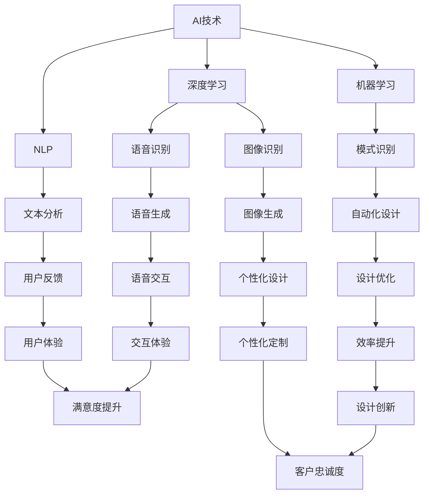
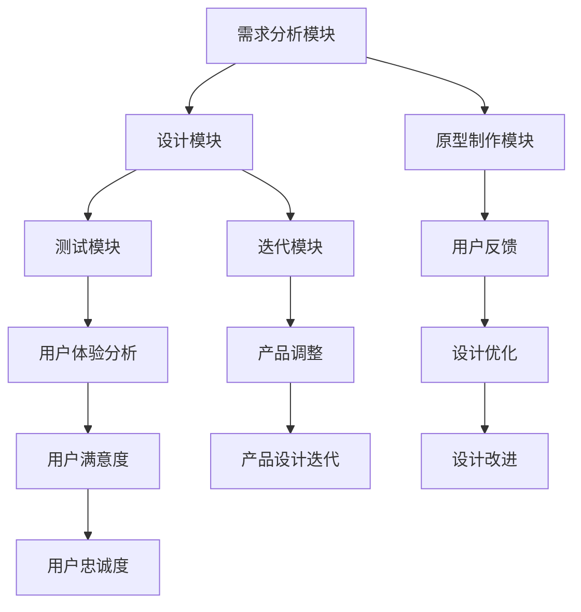
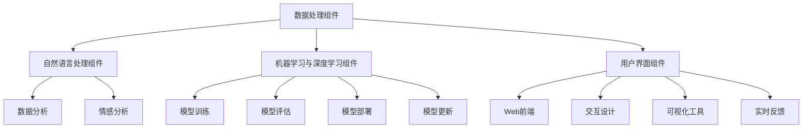

                 


### 1.1 核心概念和原理

在探讨人工智能（AI）在创意设计中的应用之前，我们首先需要了解几个核心概念，包括AI的基础概念、创意设计的定义，以及它们之间的相互作用关系。

#### 1.1.1 人工智能基础概念

人工智能，是指通过计算机程序实现智能行为的技术。它涵盖了从机器学习（Machine Learning，ML）、深度学习（Deep Learning，DL）到自然语言处理（Natural Language Processing，NLP）等多个领域。以下是这些关键概念的定义和简要说明：

- **机器学习（ML）**：机器学习是AI的一个分支，涉及计算机系统从数据中学习，识别模式和做出预测的能力。常用的ML算法包括决策树（Decision Trees）、支持向量机（Support Vector Machines，SVM）和随机森林（Random Forests）等。
  
- **深度学习（DL）**：深度学习是机器学习的一个子领域，它使用多层神经网络（Neural Networks）来模拟人类大脑的决策过程。深度学习在图像识别、语音识别和自然语言处理等方面表现出色。

- **自然语言处理（NLP）**：自然语言处理是AI的一个分支，致力于使计算机能够理解、生成和响应人类语言。NLP在聊天机器人、机器翻译和文本分析等领域有广泛应用。

#### 1.1.2 创意设计的定义

创意设计，通常指的是通过创新思维和美学原则，创造出新颖且具有吸引力的产品、服务和体验的过程。它涵盖了多个领域，如工业设计、平面设计、时尚设计和建筑设计等。以下是创意设计的一些核心要素：

- **创新思维**：创新思维是创意设计的关键，它包括发现新解决方案、提出新颖概念和进行头脑风暴等。

- **美学原则**：美学原则是创意设计的理论基础，涉及到色彩、形状、比例、平衡和对比等方面。

#### 1.1.3 人工智能与创意设计的相互作用

人工智能与创意设计的结合，可以带来以下几个方面的影响：

- **自动化设计流程**：AI可以自动化许多设计任务，如生成颜色方案、布局和3D模型等，提高设计效率。

- **个性化设计**：AI可以通过学习用户偏好和反馈，为用户提供高度个性化的设计方案。

- **优化设计过程**：AI可以分析大量数据，为设计者提供洞察和建议，从而优化设计过程。

为了更好地理解这些概念之间的联系，我们可以使用Mermaid流程图来展示人工智能在创意设计中的应用架构：



该流程图展示了人工智能技术如何应用于创意设计的各个环节，从而提高设计效率、优化用户体验和推动设计创新。

### 1.2 AI在创意设计中的具体应用

在了解了AI的基础概念和创意设计的定义后，接下来我们将深入探讨AI在创意设计中的具体应用。AI技术不仅能够自动化设计流程，还能够为设计者提供创新的解决方案和个性化服务。以下是AI在创意设计中的几种具体应用场景：

#### 1.2.1 设计灵感生成

设计灵感是创意设计的起点，然而获取灵感的过程往往耗时且具有不确定性。AI可以通过大数据分析和机器学习算法，从海量设计作品中提取有用的灵感。例如，设计者可以使用AI工具来分析当前流行的设计趋势，或者基于用户反馈生成新的设计概念。以下是一个使用机器学习算法生成设计灵感的伪代码示例：

```python
# 输入：设计数据集D，用户偏好P
# 输出：设计灵感I

def generate_design_inspiration(D, P):
    # 1. 数据预处理：对设计数据集D进行清洗和归一化处理
    cleaned_D = preprocess_data(D)

    # 2. 训练模型：使用机器学习算法训练模型，以识别设计趋势
    model = train_model(cleaned_D)

    # 3. 预测：根据用户偏好P，预测可能的设计灵感
    I = model.predict(P)

    return I
```

#### 1.2.2 自动化设计任务

自动化设计任务是AI在创意设计中的另一个重要应用。通过使用AI工具，设计者可以自动化许多重复性和耗时的设计任务，例如生成颜色方案、布局和3D模型等。以下是一个使用深度学习模型自动化颜色方案生成的伪代码示例：

```python
# 输入：设计数据集D，设计风格S
# 输出：颜色方案C

def generate_color_scheme(D, S):
    # 1. 数据预处理：对设计数据集D进行清洗和归一化处理
    cleaned_D = preprocess_data(D)

    # 2. 训练模型：使用深度学习算法训练模型，以生成符合设计风格的颜色方案
    model = train_model(cleaned_D, S)

    # 3. 预测：生成符合设计风格的颜色方案
    C = model.predict(S)

    return C
```

#### 1.2.3 个性化设计服务

个性化设计服务是AI在创意设计中的又一重要应用。AI可以通过学习用户的行为数据和偏好，为用户提供高度个性化的设计方案。例如，在线购物平台可以使用AI算法来推荐符合用户偏好的设计产品，或者为用户提供定制化的设计服务。以下是一个使用机器学习算法为用户提供个性化设计服务的伪代码示例：

```python
# 输入：用户行为数据B，用户偏好P
# 输出：个性化设计方案D

def personalized_design_service(B, P):
    # 1. 数据预处理：对用户行为数据B进行清洗和归一化处理
    cleaned_B = preprocess_data(B)

    # 2. 训练模型：使用机器学习算法训练模型，以识别用户偏好
    model = train_model(cleaned_B)

    # 3. 预测：根据用户偏好P，预测可能的设计方案
    D = model.predict(P)

    return D
```

#### 1.2.4 优化设计过程

AI还可以通过分析大量数据，为设计者提供有价值的洞察和建议，从而优化设计过程。例如，设计者可以使用AI工具来分析用户反馈，识别设计中的不足，并提出改进建议。以下是一个使用数据分析优化设计过程的伪代码示例：

```python
# 输入：用户反馈数据R
# 输出：优化建议O

def optimize_design_process(R):
    # 1. 数据预处理：对用户反馈数据R进行清洗和归一化处理
    cleaned_R = preprocess_data(R)

    # 2. 数据分析：分析用户反馈，识别设计中的不足
    insights = analyze_data(cleaned_R)

    # 3. 提出优化建议
    O = propose_optimizations(insights)

    return O
```

### 1.3 结论

通过上述分析，我们可以看到AI在创意设计中的应用具有巨大的潜力。从设计灵感生成、自动化设计任务，到个性化设计服务和优化设计过程，AI技术正在逐步改变创意设计的模式。然而，这些应用也面临着挑战，如数据隐私、伦理问题和技术实现等。在接下来的章节中，我们将继续探讨AI在创意设计中的应用场景、技术实现和案例研究，以深入了解这一领域的发展趋势和未来前景。在下一节中，我们将详细介绍AI辅助产品创新平台的概念和特点。

### 1.4 AI辅助产品创新平台的概念和特点

AI辅助产品创新平台是一个集成多种人工智能技术，旨在提高产品创新效率和质量的综合系统。这种平台不仅为设计师提供了强大的工具，还为企业提供了优化产品开发流程的方法。以下是AI辅助产品创新平台的核心概念和特点：

#### 1.4.1 核心概念

AI辅助产品创新平台的核心概念是将人工智能技术融入产品开发的各个阶段，从需求分析、设计、原型制作到测试和迭代。这种平台通常包括以下几个模块：

- **需求分析模块**：利用自然语言处理和机器学习技术，分析用户需求和市场趋势，生成产品需求文档。

- **设计模块**：提供自动化设计工具，如生成设计原型、颜色方案和布局，帮助设计师快速实现创意。

- **原型制作模块**：使用AI技术生成高保真原型，缩短产品从概念到实际产品的时间。

- **测试模块**：通过模拟用户行为和反馈，评估产品的用户体验，提供改进建议。

- **迭代模块**：根据测试结果，自动调整产品设计和功能，实现快速迭代。

#### 1.4.2 特点

1. **高效性**：AI辅助产品创新平台通过自动化和智能化的工具，显著提高了设计效率和产品质量。设计师可以快速生成多个设计方案，并快速迭代，缩短产品开发周期。

2. **灵活性**：平台提供多种AI工具，设计师可以根据实际需求选择合适的工具，实现定制化的产品创新流程。

3. **协作性**：平台支持团队协作，设计者可以实时共享设计资源和反馈，提高团队工作效率。

4. **数据驱动**：平台通过分析大量数据，提供有价值的洞察和建议，帮助设计师做出更明智的决策。

5. **用户体验**：平台注重用户体验，通过智能化的设计工具和交互界面，提高用户满意度和忠诚度。

为了更好地理解AI辅助产品创新平台的架构，我们可以使用Mermaid流程图展示其技术框架：



该流程图展示了AI辅助产品创新平台的主要模块和它们之间的相互作用关系。从需求分析到产品迭代，每个模块都通过AI技术提供智能化支持，从而实现高效、灵活、协作和用户驱动的产品创新。

### 1.5 AI辅助产品创新平台的技术框架

在了解了AI辅助产品创新平台的核心概念和特点之后，我们需要深入探讨其背后的技术框架。AI辅助产品创新平台的技术框架通常包括多个关键组件，这些组件共同协作，提供从需求分析到产品迭代的全面支持。以下是这些组件及其作用：

#### 1.5.1 数据处理组件

数据处理组件是AI辅助产品创新平台的基础。它负责收集、清洗、存储和分析与产品开发相关的各种数据，包括用户需求、市场趋势、设计文档和用户反馈等。以下是数据处理组件的关键技术：

- **数据收集**：使用API接口、Web爬虫和传感器等手段，收集与产品开发相关的数据。

- **数据清洗**：通过数据去重、填补缺失值和异常值处理等技术，保证数据质量。

- **数据存储**：使用分布式数据库和数据仓库技术，存储大规模数据集。

- **数据分析**：使用机器学习算法，对大量数据进行分析和挖掘，提取有价值的信息。

#### 1.5.2 自然语言处理（NLP）组件

自然语言处理组件负责处理与文本相关的数据，如用户需求、产品描述和用户反馈等。以下是NLP组件的关键技术：

- **文本预处理**：包括分词、词性标注和词向量转换等，将文本转换为计算机可处理的格式。

- **情感分析**：通过分析用户反馈和评价，识别用户的情感倾向和满意度。

- **主题建模**：使用算法，如LDA（Latent Dirichlet Allocation），提取文本中的主题和关键词。

- **实体识别**：识别文本中的关键实体，如人名、地点和组织等。

#### 1.5.3 机器学习与深度学习组件

机器学习和深度学习组件是AI辅助产品创新平台的核心，它们负责实现自动化设计任务和优化设计过程。以下是这些组件的关键技术：

- **模型训练**：使用训练数据集，训练机器学习模型，如SVM、决策树和神经网络等。

- **模型评估**：通过交叉验证和性能指标（如准确率、召回率和F1分数）评估模型性能。

- **模型部署**：将训练好的模型部署到生产环境中，提供实时设计服务和优化建议。

- **模型更新**：根据新的数据集和用户反馈，定期更新模型，提高其准确性和适应性。

#### 1.5.4 用户界面组件

用户界面组件是设计师与AI辅助产品创新平台交互的接口。它需要提供直观、易用的界面，以支持设计师进行设计操作和获取AI服务。以下是用户界面组件的关键技术：

- **Web前端**：使用HTML、CSS和JavaScript等Web技术，构建用户友好的界面。

- **交互设计**：通过按钮、菜单和表单等交互元素，提供便捷的设计操作。

- **可视化工具**：使用图表、地图和可视化库（如D3.js和ECharts），展示数据分析结果和设计原型。

- **实时反馈**：通过Web sockets和消息队列等技术，实现用户与平台的实时交互。

为了更好地理解AI辅助产品创新平台的技术框架，我们可以使用Mermaid流程图展示其组件之间的相互作用关系：



该流程图展示了AI辅助产品创新平台的主要组件及其相互关系。数据处理组件负责数据收集和清洗，自然语言处理组件负责文本分析和主题建模，机器学习与深度学习组件负责模型训练和部署，用户界面组件负责提供直观、易用的交互界面。这些组件共同协作，为设计师提供全面的AI辅助产品创新服务。

### 1.6 AI在创意设计中的应用场景

AI技术在创意设计中的应用场景丰富多样，涵盖了工业设计、平面设计、建筑设计、时尚设计等多个领域。以下是AI在不同创意设计领域中的应用场景：

#### 1.6.1 工业设计

工业设计涉及产品的形状、功能和使用体验。AI在工业设计中的应用主要体现在以下几个方面：

- **设计灵感生成**：AI可以通过大数据分析和机器学习算法，从海量设计作品中提取灵感，帮助设计师快速生成新的设计概念。

  ```python
  # 伪代码：生成设计灵感
  inspiration = AI_inspiration_generator(design_dataset, user_preferences)
  ```

- **自动化设计任务**：AI可以自动化许多重复性和耗时的设计任务，如生成外观模型、布局和3D模型等。

  ```python
  # 伪代码：生成3D模型
  model = AI_3D_model_generator(shape_parameters, material_properties)
  ```

- **优化设计过程**：AI可以通过分析用户反馈和测试数据，优化产品设计，提高用户体验。

  ```python
  # 伪代码：优化产品设计
  optimized_design = AI_design_optimizer(user_feedback, test_data)
  ```

#### 1.6.2 平面设计

平面设计包括海报、名片、宣传册和网页设计等。AI在平面设计中的应用主要体现在以下几个方面：

- **颜色搭配建议**：AI可以通过学习大量的颜色搭配案例，为设计师提供个性化的颜色建议。

  ```python
  # 伪代码：生成颜色搭配
  color_scheme = AI_color_scheme_generator(color_preferences)
  ```

- **自动排版**：AI可以自动化文本排版，根据文本内容和版面大小，自动调整文本布局。

  ```python
  # 伪代码：自动排版
  layout = AI_text_layout_generator(text_content, page_size)
  ```

- **创意生成**：AI可以通过生成对抗网络（GAN）等技术，生成新颖的设计作品，激发设计师的创意。

  ```python
  # 伪代码：生成创意设计
  creative_design = AI_creative_generator(reference_designs)
  ```

#### 1.6.3 建筑设计

建筑设计涉及建筑的规划、设计和施工。AI在建筑设计中的应用主要体现在以下几个方面：

- **建筑风格识别**：AI可以通过深度学习算法，自动识别建筑的风格和特点，为设计师提供参考。

  ```python
  # 伪代码：识别建筑风格
  architectural_style = AI_style_recognizer(building_images)
  ```

- **结构优化**：AI可以通过模拟计算和优化算法，优化建筑的结构设计，提高建筑的安全性和稳定性。

  ```python
  # 伪代码：优化建筑结构
  optimized_structure = AI_structure_optimizer(structure_data)
  ```

- **模拟与仿真**：AI可以模拟建筑在不同环境条件下的表现，如光照、通风和噪音等，帮助设计师优化建筑的设计。

  ```python
  # 伪代码：建筑模拟
  simulation_results = AI_building_simulation(environment_conditions)
  ```

#### 1.6.4 时尚设计

时尚设计涉及服装、配饰和鞋类的设计。AI在时尚设计中的应用主要体现在以下几个方面：

- **时尚趋势预测**：AI可以通过分析市场数据、社交媒体和时尚杂志等，预测未来的时尚趋势。

  ```python
  # 伪代码：预测时尚趋势
  fashion_trends = AI_trend_predictor(fashion_data, social_media_data)
  ```

- **个性化设计**：AI可以通过学习用户的行为数据和偏好，为用户提供个性化的设计建议。

  ```python
  # 伪代码：个性化设计
  personalized_design = AI_person

### 1.7 未来发展趋势与挑战

AI在创意设计中的应用前景广阔，但同时也面临着一系列挑战。以下是AI在创意设计领域未来发展的主要趋势和面临的挑战：

#### 1.7.1 发展趋势

1. **技术融合**：AI技术与其他前沿技术（如大数据、物联网和增强现实等）的融合，将推动创意设计向更加智能化和个性化的方向发展。

2. **行业普及**：随着AI技术的成熟和成本的降低，越来越多的企业和设计师将采用AI辅助工具，提高设计效率和质量。

3. **用户体验**：AI将更加注重用户体验，通过个性化推荐、智能交互和实时反馈等手段，提高用户满意度和忠诚度。

4. **数据驱动**：AI将更加依赖大数据分析和机器学习技术，通过分析海量用户数据，为设计师提供更精准的设计建议。

#### 1.7.2 挑战

1. **数据隐私**：AI在创意设计中的应用涉及到大量用户数据的收集和分析，如何保护用户隐私成为一大挑战。

2. **伦理问题**：AI生成的设计作品可能会出现抄袭、侵权等问题，如何确保设计的原创性和合法性需要引起关注。

3. **技术实现**：AI技术在不同设计领域的实现程度不同，如何将AI技术与具体的设计需求相结合，实现高效、可靠的设计工具是关键。

4. **人才短缺**：AI技术在创意设计中的应用需要既懂设计又懂技术的复合型人才，当前的人才储备可能无法满足需求。

### 1.8 结论

AI在创意设计中的应用为设计师提供了强大的工具和资源，提高了设计效率、个性化和创新性。然而，要充分发挥AI的潜力，需要克服一系列技术、伦理和隐私等方面的挑战。未来，随着AI技术的不断进步，创意设计领域将迎来更加智能化、个性化的发展趋势，为设计师和用户带来更多创新和便利。

### 1.9 拓展阅读

- **《人工智能设计应用手册》**：由人工智能设计专家编写的详细指南，涵盖了AI在工业设计、平面设计和时尚设计等领域的应用。

- **《创意设计的AI革命》**：探讨AI如何改变创意设计的模式，提高设计效率和质量，以及设计师如何适应这一变革。

- **《人工智能与设计心理学》**：研究AI如何通过用户行为分析和自然语言处理，提高设计的用户满意度和体验。

### 1.10 注意事项

- **数据安全**：在应用AI技术时，务必重视数据安全，采取严格的隐私保护措施。

- **伦理考量**：在设计过程中，遵循伦理规范，确保设计的原创性和合法性。

- **技术匹配**：根据实际需求选择合适的AI工具和技术，避免盲目跟风。

### 作者信息

- **作者：AI天才研究院/AI Genius Institute & 禅与计算机程序设计艺术 /Zen And The Art of Computer Programming**

