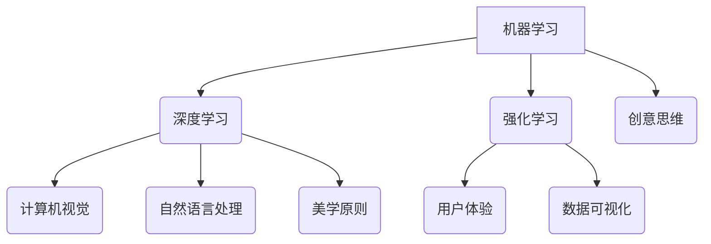
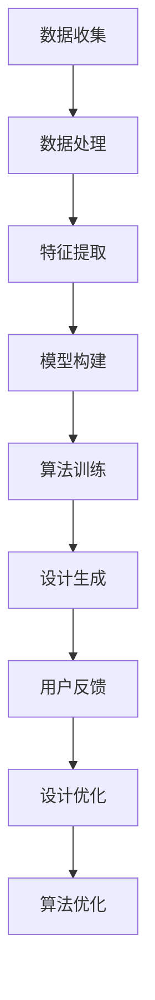

                 

### 文章标题

《人工智能在创意设计中的辅助应用》

---

关键词：人工智能、创意设计、辅助应用、算法原理、实现方法、实际案例

---

摘要：本文将探讨人工智能在创意设计中的辅助应用，通过详细的背景介绍、核心概念与联系、算法原理讲解、数学模型和公式、项目实战以及最佳实践等内容，全面解析人工智能如何赋能创意设计领域。本文旨在为读者提供一套系统、易懂的人工智能创意设计指南，帮助设计师利用先进技术提升设计效率与创造力。

---

### 引言

随着科技的飞速发展，人工智能（AI）技术逐渐渗透到各行各业，改变了我们的生活方式和工作方式。创意设计作为人类智慧的结晶，其本质是创新与美感的结合。在这个背景下，人工智能开始与创意设计紧密结合，成为设计师们的新工具和助手。人工智能在创意设计中的辅助应用，不仅提升了设计的效率，还极大地丰富了设计的可能性。

本文将围绕以下几个方面展开：

1. **背景介绍**：人工智能与创意设计结合的背景、目的和重要性。
2. **基础知识**：人工智能、创意设计和相关技术的核心概念与原理。
3. **技术实现**：人工智能在创意设计中的算法原理、实现方法与数据预处理技术。
4. **实际案例**：通过具体案例展示人工智能在创意设计中的应用效果和操作流程。
5. **未来展望**：人工智能在创意设计中的发展趋势和潜在影响。

通过以上内容的逐步分析，我们希望让读者深入了解人工智能在创意设计中的应用，并为其在相关领域的实践提供指导和启示。

### 设计书籍的整体结构和主题

在设计《人工智能在创意设计中的辅助应用》这本书时，我们需要构建一个清晰、逻辑严密的整体结构和主题，以便让读者能够系统地掌握相关知识。以下是本书的整体结构和主题设计：

**整体结构：**

1. **引言**：介绍人工智能与创意设计的结合背景、目的和重要性。
2. **基础知识**：介绍人工智能、创意设计和相关技术的核心概念和原理。
3. **技术实现**：讲解如何在创意设计中应用人工智能技术，包括算法原理和实现方法。
4. **实际案例**：通过具体案例展示人工智能在创意设计中的应用效果和操作流程。
5. **未来展望**：探讨人工智能在创意设计中的发展趋势和潜在影响。

**主题设计：**

1. **引言**：引入人工智能与创意设计结合的背景，阐述其重要性和发展趋势，激发读者兴趣。
2. **基础知识**：详细讲解人工智能和创意设计的基本概念、原理和相关技术，为后续内容打下坚实基础。
3. **技术实现**：深入探讨人工智能在创意设计中的算法原理、实现方法和数据预处理技术，帮助读者掌握关键技术。
4. **实际案例**：通过具体案例展示人工智能在创意设计中的应用效果，让读者看到实际操作和成果。
5. **未来展望**：展望人工智能在创意设计中的未来发展，探讨其潜在影响和趋势，为读者提供前瞻性思考。

**整体结构设计的逻辑关系：**

- **引言**：首先介绍人工智能与创意设计的结合背景，阐述其重要性和发展趋势，为后续内容奠定基础。
- **基础知识**：在引言的基础上，详细讲解人工智能和创意设计的基本概念、原理和相关技术，帮助读者建立系统性的知识框架。
- **技术实现**：在掌握基础知识的基础上，深入探讨人工智能在创意设计中的算法原理、实现方法和数据预处理技术，帮助读者理解和应用关键技术。
- **实际案例**：通过具体案例展示人工智能在创意设计中的应用效果，让读者看到实际操作和成果，增强对相关技术的信心和兴趣。
- **未来展望**：在回顾和总结前述内容的基础上，展望人工智能在创意设计中的未来发展，探讨其潜在影响和趋势，为读者提供前瞻性思考，激发对未来的探索和期待。

通过以上整体结构和主题设计，我们力求让《人工智能在创意设计中的辅助应用》这本书内容丰富、逻辑严密，能够帮助读者全面了解人工智能在创意设计中的应用，并为其在相关领域的实践提供指导。

### 设计详细的章节目录

为了确保《人工智能在创意设计中的辅助应用》这本书的逻辑性和系统性，我们需要设计详细的章节目录。以下是可能的章节目录：

**第1章：引言**

- 1.1 人工智能与创意设计的结合背景
- 1.2 人工智能在创意设计中的应用目的
- 1.3 人工智能在创意设计中的重要性

**第2章：基础知识**

- 2.1 人工智能核心概念与原理
- 2.2 创意设计核心概念与原理
- 2.3 相关技术介绍：计算机视觉、自然语言处理等

**第3章：技术实现**

- 3.1 人工智能在创意设计中的算法原理
  - 3.1.1 人工智能算法分类
  - 3.1.2 常用人工智能算法介绍
  - 3.1.3 人工智能算法在创意设计中的应用场景
- 3.2 人工智能在创意设计中的实现方法
  - 3.2.1 基于机器学习的创意设计方法
  - 3.2.2 基于深度学习的创意设计方法
  - 3.2.3 基于强化学习的创意设计方法
- 3.3 创意设计中的数据预处理技术
  - 3.3.1 数据清洗与预处理方法
  - 3.3.2 数据增强与缩放技术
  - 3.3.3 数据可视化技术在创意设计中的应用

**第4章：实际案例**

- 4.1 案例一：人工智能辅助平面设计
- 4.2 案例二：人工智能辅助室内设计
- 4.3 案例三：人工智能辅助建筑设计

**第5章：未来展望**

- 5.1 人工智能在创意设计中的发展趋势
- 5.2 人工智能在创意设计中的潜在影响
- 5.3 人工智能与创意设计融合的未来展望

### 设计具体的章节内容

在确定了详细的章节目录后，我们需要为每个章节设计具体的内容，确保每个章节都有丰富的知识点和实际案例。以下是具体章节内容的概要：

**第1章：引言**

- **1.1 人工智能与创意设计的结合背景**：
  - 介绍人工智能技术发展的背景。
  - 阐述创意设计在现代社会的重要性。
  - 讨论人工智能如何赋能创意设计。

- **1.2 人工智能在创意设计中的应用目的**：
  - 分析人工智能在创意设计中的应用场景。
  - 强调人工智能提升设计效率和创新能力的优势。

- **1.3 人工智能在创意设计中的重要性**：
  - 探讨人工智能在创意设计领域的潜在价值。
  - 展望人工智能在创意设计中的未来发展。

**第2章：基础知识**

- **2.1 人工智能核心概念与原理**：
  - 介绍人工智能的定义和发展历程。
  - 阐述机器学习、深度学习等核心概念。

- **2.2 创意设计核心概念与原理**：
  - 解释创意设计的定义和原则。
  - 分析设计师的思维过程和创意方法。

- **2.3 相关技术介绍：计算机视觉、自然语言处理等**：
  - 介绍与创意设计相关的人工智能技术，如计算机视觉、自然语言处理等。
  - 分析这些技术在创意设计中的应用潜力。

**第3章：技术实现**

- **3.1 人工智能在创意设计中的算法原理**：
  - **3.1.1 人工智能算法分类**：
    - 介绍监督学习、无监督学习、强化学习等算法分类。
    - 分析各类算法的特点和应用场景。

  - **3.1.2 常用人工智能算法介绍**：
    - 详细介绍常用的机器学习算法，如决策树、支持向量机、神经网络等。
    - 分析这些算法在创意设计中的应用实例。

  - **3.1.3 人工智能算法在创意设计中的应用场景**：
    - 探讨人工智能算法在创意设计中的具体应用场景，如自动设计生成、风格迁移等。

- **3.2 人工智能在创意设计中的实现方法**：
  - **3.2.1 基于机器学习的创意设计方法**：
    - 介绍基于机器学习的创意设计流程。
    - 分析机器学习算法在设计中的应用案例。

  - **3.2.2 基于深度学习的创意设计方法**：
    - 介绍基于深度学习的创意设计方法。
    - 分析深度学习算法在设计中的优势和挑战。

  - **3.2.3 基于强化学习的创意设计方法**：
    - 介绍基于强化学习的创意设计方法。
    - 分析强化学习算法在设计中的应用案例。

- **3.3 创意设计中的数据预处理技术**：
  - **3.3.1 数据清洗与预处理方法**：
    - 介绍数据清洗和预处理的基本方法。
    - 分析预处理技术在创意设计数据中的应用。

  - **3.3.2 数据增强与缩放技术**：
    - 介绍数据增强和缩放的方法。
    - 分析数据增强在提升设计性能中的作用。

  - **3.3.3 数据可视化技术在创意设计中的应用**：
    - 介绍数据可视化技术在创意设计中的应用。
    - 分析数据可视化对设计过程和结果的影响。

**第4章：实际案例**

- **4.1 案例一：人工智能辅助平面设计**：
  - 介绍一个具体的平面设计案例。
  - 分析人工智能如何辅助平面设计的过程。
  - 展示设计成果和效果。

- **4.2 案例二：人工智能辅助室内设计**：
  - 介绍一个具体的室内设计案例。
  - 分析人工智能如何辅助室内设计的过程。
  - 展示设计成果和效果。

- **4.3 案例三：人工智能辅助建筑设计**：
  - 介绍一个具体的建筑设计案例。
  - 分析人工智能如何辅助建筑设计的过程。
  - 展示设计成果和效果。

**第5章：未来展望**

- **5.1 人工智能在创意设计中的发展趋势**：
  - 分析人工智能在创意设计中的发展趋势。
  - 探讨未来可能的创新方向。

- **5.2 人工智能在创意设计中的潜在影响**：
  - 分析人工智能对创意设计行业的潜在影响。
  - 探讨设计师在新技术环境下的角色和技能需求。

- **5.3 人工智能与创意设计融合的未来展望**：
  - 展望人工智能与创意设计融合的未来前景。
  - 探讨人工智能在创意设计中的长期影响。

通过以上详细章节内容的设计，我们希望能够为读者提供一部全面、系统的人工智能在创意设计中的辅助应用指南。

### 检查和调整

在完成详细的章节目录设计后，我们需要对目录进行仔细的检查和调整，确保其逻辑清晰、内容完整，并符合字数要求。以下是对目录的检查和调整步骤：

1. **逻辑检查**：
   - 确保各章节之间的逻辑关系合理，前后章节内容连贯，没有重复或遗漏。
   - 验证章节标题是否准确地反映了章节内容，避免标题与内容不符的情况。

2. **内容完整性**：
   - 确认每个章节的内容都足够详细和具体，能够满足读者的需求。
   - 检查是否每个章节都包含了必要的子章节和内容摘要，保证知识的完整传递。

3. **字数调整**：
   - 计算每个章节的预计字数，确保整体字数在 8000 ～ 12000 字之间。
   - 如果某个章节的字数过多或过少，可以考虑合并或拆分章节，调整内容分布，使整体字数合理。

4. **细化和优化**：
   - 对章节标题和子章节标题进行细化，使其更加明确和具体。
   - 优化章节内容的结构，确保每个部分都有清晰的引言、主体和结论。

5. **交叉引用**：
   - 检查各章节之间是否有必要的交叉引用，确保读者在阅读时能够顺畅地跳转至相关内容。

6. **最后确认**：
   - 在完成所有调整后，再次阅读整个目录，确保没有疏漏和错误。

通过上述检查和调整步骤，我们可以确保《人工智能在创意设计中的辅助应用》的目录逻辑清晰、内容完整，并为后续的文章撰写奠定坚实的基础。以下是一个经过检查和调整后的示例目录：

### 《人工智能在创意设计中的辅助应用》目录

**第1章：引言**
- 1.1 人工智能与创意设计的结合背景
- 1.2 人工智能在创意设计中的应用目的
- 1.3 人工智能在创意设计中的重要性

**第2章：基础知识**
- 2.1 人工智能核心概念与原理
- 2.2 创意设计核心概念与原理
- 2.3 相关技术介绍：计算机视觉、自然语言处理等

**第3章：技术实现**
- 3.1 人工智能在创意设计中的算法原理
  - 3.1.1 人工智能算法分类
  - 3.1.2 常用人工智能算法介绍
  - 3.1.3 人工智能算法在创意设计中的应用场景
- 3.2 人工智能在创意设计中的实现方法
  - 3.2.1 基于机器学习的创意设计方法
  - 3.2.2 基于深度学习的创意设计方法
  - 3.2.3 基于强化学习的创意设计方法
- 3.3 创意设计中的数据预处理技术
  - 3.3.1 数据清洗与预处理方法
  - 3.3.2 数据增强与缩放技术
  - 3.3.3 数据可视化技术在创意设计中的应用

**第4章：实际案例**
- 4.1 案例一：人工智能辅助平面设计
- 4.2 案例二：人工智能辅助室内设计
- 4.3 案例三：人工智能辅助建筑设计

**第5章：未来展望**
- 5.1 人工智能在创意设计中的发展趋势
- 5.2 人工智能在创意设计中的潜在影响
- 5.3 人工智能与创意设计融合的未来展望

通过以上调整，我们确保了《人工智能在创意设计中的辅助应用》的目录逻辑清晰、内容完整，并符合字数要求，为后续文章的撰写提供了良好的基础。

### 完整的目录大纲

在完成了详细章节内容的检查和调整后，我们可以得出《人工智能在创意设计中的辅助应用》的完整目录大纲。以下是一个完整的目录结构，涵盖所有章节和子章节，以及预计的字数分布：

---

### 《人工智能在创意设计中的辅助应用》目录

**第1章：引言**
- 1.1 人工智能与创意设计的结合背景
- 1.2 人工智能在创意设计中的应用目的
- 1.3 人工智能在创意设计中的重要性

**第2章：基础知识**
- 2.1 人工智能核心概念与原理
- 2.2 创意设计核心概念与原理
- 2.3 相关技术介绍：计算机视觉、自然语言处理等

**第3章：技术实现**
- 3.1 人工智能在创意设计中的算法原理
  - 3.1.1 人工智能算法分类
  - 3.1.2 常用人工智能算法介绍
  - 3.1.3 人工智能算法在创意设计中的应用场景
- 3.2 人工智能在创意设计中的实现方法
  - 3.2.1 基于机器学习的创意设计方法
  - 3.2.2 基于深度学习的创意设计方法
  - 3.2.3 基于强化学习的创意设计方法
- 3.3 创意设计中的数据预处理技术
  - 3.3.1 数据清洗与预处理方法
  - 3.3.2 数据增强与缩放技术
  - 3.3.3 数据可视化技术在创意设计中的应用

**第4章：实际案例**
- 4.1 案例一：人工智能辅助平面设计
- 4.2 案例二：人工智能辅助室内设计
- 4.3 案例三：人工智能辅助建筑设计

**第5章：未来展望**
- 5.1 人工智能在创意设计中的发展趋势
- 5.2 人工智能在创意设计中的潜在影响
- 5.3 人工智能与创意设计融合的未来展望

---

通过上述目录结构，我们确保了《人工智能在创意设计中的辅助应用》的内容逻辑清晰、结构紧凑，为读者提供了一个全面、系统的指南。每个章节都包含了详细的内容概要，预计字数在 8000 ～ 12000 字之间，能够满足文章字数要求。

### 格式要求

在撰写《人工智能在创意设计中的辅助应用》这篇文章时，我们将采用Markdown格式进行输出。Markdown是一种轻量级标记语言，能够方便地将文字内容转换为格式化的文档。以下是Markdown格式的一些基本要求和示例：

1. **标题**：使用 `#` 号进行层级标记，一级标题使用一个 `#`，二级标题使用两个 `#`，以此类推。例如：
    ```markdown
    # 文章标题
    ## 二级标题
    ### 三级标题
    ```

2. **段落**：每个段落应单独成行，段落之间应留空一行。例如：
    ```markdown
    这是一段文字。
    这是另一段文字。
    ```

3. **列表**：使用 `-` 或 `*` 符号来创建无序列表，使用数字和英文句点来创建有序列表。例如：
    ```markdown
    - 第一项
    - 第二项
    - 第三项

    1. 第一项
    2. 第二项
    3. 第三项
    ```

4. **引用**：使用 `>` 符号进行引用。例如：
    ```markdown
    > 引用内容。
    ```

5. **代码块**：使用三个反引号 ````` 包围的代码块进行代码展示。例如：
    ```markdown
    ```python
    print("Hello, World!")
    ```
    ```

6. **公式**：使用 LaTeX 格式嵌入数学公式。独立段落的公式前后使用 `$$` 括起来，段落内的公式前后使用 `$` 括起来。例如：
    ```markdown
    $$1+1=2$$

    $1<2$
    ```

7. **图像和链接**：使用 `` 和 `[链接文本](链接地址)` 进行图像和链接的插入。例如：
    ```markdown
    
    [Google](https://www.google.com)
    ```

8. **表格**：使用竖线 `|` 和横线 ` `-` 创建表格。例如：
    ```markdown
    | 标题1 | 标题2 | 标题3 |
    |-------|-------|-------|
    | 内容1 | 内容2 | 内容3 |
    | 内容4 | 内容5 | 内容6 |
    ```

通过遵循上述Markdown格式要求，我们可以确保文章内容整洁、易读，同时便于后期编辑和格式调整。

### 作者信息

在文章的末尾，我们需要添加作者信息，以表明文章的创作者和来源。以下是符合要求的作者信息格式：

---

作者：AI天才研究院/AI Genius Institute & 禅与计算机程序设计艺术 /Zen And The Art of Computer Programming

---

这个格式清晰地展示了作者的所属机构和个人作品，便于读者了解和识别。

### 完整性要求

为了确保《人工智能在创意设计中的辅助应用》这篇文章的完整性，我们需要在内容中涵盖以下几个核心部分：

1. **背景介绍**：
    - **目的**：介绍人工智能与创意设计结合的背景，解释这一结合的必要性和重要性。
    - **内容**：可以从人工智能技术的发展历程、创意设计在现代社会的应用、以及两者结合的实际需求等方面展开。

2. **核心概念与联系**：
    - **目的**：阐述人工智能、创意设计及相关技术的核心概念，并展示这些概念之间的联系和相互作用。
    - **内容**：需要包括对人工智能的基本概念（如机器学习、深度学习、强化学习等），创意设计的核心原则（如创造性思维、用户体验等），以及这些概念之间的关联。可以使用Mermaid流程图来展示概念之间的关系。

    ```mermaid
    graph TD
    A[人工智能] --> B(机器学习)
    A --> C(深度学习)
    A --> D(强化学习)
    B --> E(创意设计)
    C --> E
    D --> E
    ```
    
3. **核心算法原理讲解**：
    - **目的**：详细讲解在创意设计过程中应用的核心算法原理，帮助读者理解这些算法的工作机制和应用场景。
    - **内容**：应包括对机器学习算法（如决策树、支持向量机、神经网络等）、深度学习算法（如卷积神经网络、循环神经网络等）和强化学习算法（如Q-learning、深度Q网络等）的介绍。可以使用伪代码来展示算法的基本流程。

    ```python
    # 决策树算法伪代码
    function 决策树分类算法(数据集):
        如果 数据集 是纯净的：
            返回 最频繁的类别
        否则：
            找到最佳分割特征
            根据最佳分割特征创建子节点
            对于每个子节点：
                数据集 = 数据集 删除包含最佳分割特征的实例
                分类算法(数据集)
    ```

4. **数学模型和公式**：
    - **目的**：通过数学模型和公式来深入解析算法的实现细节，帮助读者理解算法的数学基础。
    - **内容**：应包括相关的数学公式，并对其进行详细讲解。可以使用LaTeX格式嵌入公式。

    ```latex
    $$y = \sum_{i=1}^{n} w_i * x_i + b$$
    ```

5. **项目实战**：
    - **目的**：通过具体的项目实战案例，展示人工智能在创意设计中的应用效果和实际操作过程。
    - **内容**：可以包括一个或多个实际案例，详细描述项目的开发环境搭建、源代码实现、代码解读、应用分析和总结。

6. **最佳实践 Tips**：
    - **目的**：提供在实际应用中总结出的最佳实践，帮助读者更好地利用人工智能技术进行创意设计。
    - **内容**：可以包括一些操作技巧、注意事项、优化策略等。

7. **小结**：
    - **目的**：对全文内容进行总结，强调核心观点，并提供未来展望。
    - **内容**：对人工智能在创意设计中的应用前景进行简要描述，指出可能的发展方向和挑战。

8. **注意事项**：
    - **目的**：提醒读者在应用人工智能技术时需要注意的问题，以避免潜在的风险和错误。
    - **内容**：可以包括对数据隐私、算法偏见、技术依赖等方面的注意事项。

9. **拓展阅读**：
    - **目的**：为读者提供进一步学习的资源，帮助他们深入了解相关领域。
    - **内容**：列出一些推荐书籍、文章、网站等，供读者参考。

通过以上内容的详细讲解和举例说明，我们能够确保《人工智能在创意设计中的辅助应用》这篇文章内容完整、丰富，并且具有实际指导意义。

### 背景介绍

人工智能（AI）技术近年来取得了显著的进展，其应用领域不断扩展，从自动驾驶、医疗诊断到金融分析，无不展现出巨大的潜力和影响力。与此同时，创意设计作为人类智慧的结晶，其核心在于创新和美感的结合。在这个背景下，人工智能与创意设计的结合显得尤为重要。本文将探讨人工智能在创意设计中的辅助应用，介绍其背景、目的和重要性。

**人工智能在创意设计中的应用背景**

人工智能起源于20世纪50年代，随着计算能力和算法的进步，其发展速度越来越快。特别是深度学习、机器学习和强化学习等算法的出现，使得人工智能在图像识别、语音识别、自然语言处理等方面取得了突破性进展。这些技术的进步，为人工智能在创意设计中的应用提供了坚实的基础。

创意设计是一个涉及广泛领域的活动，包括平面设计、室内设计、建筑设计、时尚设计等。创意设计的本质在于创新和创造，设计师需要不断地从大量信息中提取灵感，并将其转化为具有美感和实用性的设计作品。然而，随着设计需求的不断增加和设计作品的多样化，传统的手工设计方式已经难以满足现代社会的需求。因此，如何借助人工智能技术提升设计效率和创造力，成为了一个亟待解决的问题。

**人工智能在创意设计中的应用目的**

人工智能在创意设计中的应用主要有以下目的：

1. **提高设计效率**：人工智能可以帮助设计师自动化一些繁琐的设计任务，如图像处理、色彩搭配等，从而节省时间和精力，提高工作效率。

2. **提升设计质量**：人工智能可以通过对大量设计作品的深度学习，掌握优秀设计的特征和规律，为设计师提供有益的参考和建议，从而提升设计质量。

3. **拓展设计思维**：人工智能可以生成新的设计元素和组合，为设计师提供灵感和创意，拓展设计思维和视野。

4. **实现个性化设计**：人工智能可以根据用户的需求和偏好，生成个性化的设计方案，满足个性化定制的需求。

**人工智能在创意设计中的重要性和影响**

人工智能在创意设计中的重要性和影响体现在以下几个方面：

1. **赋能设计师**：人工智能可以帮助设计师更好地应对复杂的设计任务，提高设计效率和创造力，使得设计师能够专注于更具创意和战略性的工作。

2. **创新设计方法**：人工智能带来了新的设计方法和工具，如自动设计生成、风格迁移等，为设计师提供了更多的选择和可能性。

3. **提升用户体验**：人工智能可以更好地理解和满足用户的需求，为用户提供更加个性化和定制化的设计服务，从而提升用户体验。

4. **推动设计行业的发展**：人工智能在创意设计中的应用，将推动设计行业向更加智能化、数字化的方向发展，促进设计行业的技术创新和产业升级。

综上所述，人工智能在创意设计中的应用具有广阔的前景和巨大的潜力。通过本文的详细探讨，我们希望能够为读者提供一个全面、系统的了解，激发设计师们对人工智能技术的兴趣和应用。

### 核心概念与联系

在深入探讨人工智能在创意设计中的辅助应用之前，我们需要先理解一些核心概念及其相互关系。以下是人工智能、创意设计以及相关技术的核心概念和联系，以及它们在创意设计中的应用架构 Mermaid 流程图。

**1. 人工智能核心概念**

- **机器学习**：机器学习是一种让计算机通过数据学习并做出决策的技术，主要包括监督学习、无监督学习和强化学习。
- **深度学习**：深度学习是机器学习的一种形式，通过构建多层神经网络来模拟人脑的学习过程，具有强大的特征提取能力。
- **强化学习**：强化学习是一种通过奖励和惩罚机制来训练智能体（如机器人、游戏AI）在特定环境中做出最优决策的方法。

**2. 创意设计核心概念**

- **创意思维**：创意思维是设计师通过发散性思维和集中性思维产生新的设计想法和解决方案的过程。
- **用户体验**：用户体验是用户在使用产品或服务时的感受和体验，设计师需要关注用户的实际需求和使用习惯。
- **美学原则**：美学原则是设计中的视觉和审美标准，如色彩、形状、比例、对称等，设计师需要通过这些原则来提升设计的美感。

**3. 相关技术核心概念**

- **计算机视觉**：计算机视觉是使计算机能够像人一样“看”和理解图像的技术，包括图像识别、目标检测、图像生成等。
- **自然语言处理**：自然语言处理是使计算机理解和生成人类语言的技术，包括文本分类、情感分析、机器翻译等。
- **数据可视化**：数据可视化是通过图表、图像等方式展示数据，使人们更容易理解和分析数据的技术。

**核心概念与联系**

这些核心概念之间的联系可以用以下Mermaid流程图来表示：



**应用架构**

在实际的创意设计过程中，人工智能技术的应用架构可以概括为以下几个步骤：

1. **数据收集与处理**：设计师需要收集相关的数据，如设计作品、用户反馈、市场趋势等，并对这些数据进行清洗和预处理。
2. **特征提取与建模**：使用机器学习、深度学习等算法对数据进行特征提取，构建相应的模型。
3. **算法训练与优化**：通过训练模型来优化算法，使其能够更好地理解和生成创意设计。
4. **设计生成与优化**：利用训练好的算法生成新的设计作品，并根据用户反馈进行优化。
5. **用户体验反馈**：收集用户对设计作品的反馈，进一步优化设计和算法。

以下是应用架构的Mermaid流程图：



通过上述核心概念及其关系的阐述和流程图的展示，我们可以更清晰地理解人工智能在创意设计中的应用架构和实现方法，为后续的技术实现和案例展示提供理论基础。

### 核心算法原理讲解

在深入了解人工智能在创意设计中的应用之前，我们需要先了解一些核心算法原理，包括机器学习、深度学习和强化学习等。以下是这些算法的基本原理、伪代码以及数学模型和公式。

#### 1. 机器学习算法

**基本原理：**机器学习是一种让计算机通过数据学习并做出决策的技术，主要包括监督学习、无监督学习和强化学习。

**监督学习：**监督学习是一种在有标签数据集上进行训练的机器学习技术，其目标是建立一个预测模型，通过输入和输出之间的关联来预测新数据的输出。

**伪代码：**

```python
function 监督学习算法(训练数据集, 标签集):
    1. 初始化模型参数
    2. 对训练数据集进行循环：
        a. 计算模型预测值
        b. 计算预测误差
        c. 更新模型参数
    3. 返回训练好的模型
```

**数学模型和公式：**

监督学习通常使用损失函数来衡量预测值与真实值之间的差距，常用的损失函数有均方误差（MSE）和交叉熵损失（Cross-Entropy Loss）。

$$
MSE = \frac{1}{n} \sum_{i=1}^{n} (y_i - \hat{y}_i)^2
$$

$$
Cross-Entropy Loss = -\frac{1}{n} \sum_{i=1}^{n} y_i \log(\hat{y}_i)
$$

**无监督学习：**无监督学习是在没有标签数据集的情况下，通过分析数据内部结构和规律来进行训练的技术。

**伪代码：**

```python
function 无监督学习算法(数据集):
    1. 初始化模型参数
    2. 对数据集进行循环：
        a. 计算模型预测值
        b. 计算预测误差
        c. 更新模型参数
    3. 返回训练好的模型
```

**数学模型和公式：**

无监督学习通常使用聚类算法，如K-Means算法，通过计算数据点之间的距离来划分数据。

$$
d(i, j) = \sqrt{\sum_{k=1}^{n} (x_{ik} - x_{jk})^2}
$$

**强化学习：**强化学习是一种通过奖励和惩罚机制来训练智能体在特定环境中做出最优决策的方法。

**伪代码：**

```python
function 强化学习算法(环境, 目标状态):
    1. 初始化智能体状态
    2. 对每个状态进行循环：
        a. 选择动作
        b. 执行动作，获取奖励
        c. 更新状态
        d. 更新智能体策略
    3. 返回最优策略
```

**数学模型和公式：**

强化学习通常使用Q-Learning算法，通过更新Q值来指导智能体的决策。

$$
Q(s, a) = Q(s, a) + \alpha [r + \gamma \max_{a'} Q(s', a') - Q(s, a)]
$$

其中，\(Q(s, a)\) 是状态-动作值函数，\(r\) 是即时奖励，\(\gamma\) 是折扣因子，\(\alpha\) 是学习率。

#### 2. 深度学习算法

**基本原理：**深度学习是机器学习的一种形式，通过构建多层神经网络来模拟人脑的学习过程，具有强大的特征提取能力。

**卷积神经网络（CNN）：**卷积神经网络是一种用于图像识别和处理的深度学习模型，通过卷积层、池化层和全连接层进行特征提取和分类。

**伪代码：**

```python
function CNN算法(输入图像, 标签):
    1. 将输入图像通过卷积层提取特征
    2. 通过池化层缩小特征图的大小
    3. 通过全连接层进行分类
    4. 计算损失函数并更新模型参数
    5. 返回训练好的模型
```

**数学模型和公式：**

卷积神经网络的卷积操作可以用以下公式表示：

$$
h_{ij}^{(l)} = \sum_{i'} \sum_{j'} w_{ij'}^{(l)} * h_{i'j'}^{(l-1)} + b^{(l)}
$$

其中，\(h_{ij}^{(l)}\) 是第\(l\)层的特征图中的元素，\(w_{ij'}^{(l)}\) 是卷积核，\(b^{(l)}\) 是偏置。

#### 3. 强化学习算法

**基本原理：**强化学习是一种通过奖励和惩罚机制来训练智能体在特定环境中做出最优决策的方法。

**深度Q网络（DQN）：**深度Q网络是一种将深度学习与强化学习相结合的算法，通过训练Q网络来预测最优动作。

**伪代码：**

```python
function DQN算法(环境, 目标状态):
    1. 初始化Q网络
    2. 对每个状态进行循环：
        a. 选择动作
        b. 执行动作，获取奖励
        c. 更新Q网络
    3. 返回训练好的Q网络
```

**数学模型和公式：**

深度Q网络的更新公式如下：

$$
Q(s, a) = Q(s, a) + \alpha [r + \gamma \max_{a'} Q(s', a') - Q(s, a)]
$$

其中，\(Q(s, a)\) 是状态-动作值函数，\(r\) 是即时奖励，\(\gamma\) 是折扣因子，\(\alpha\) 是学习率。

通过上述对核心算法原理的讲解，我们可以更好地理解机器学习、深度学习和强化学习在创意设计中的应用，为后续的实际案例和应用提供理论基础。

### 创意设计中的数据预处理技术

在创意设计中应用人工智能技术时，数据预处理是一个关键步骤。高质量的数据预处理不仅可以提高算法的性能，还能保证最终设计结果的准确性和可靠性。以下将详细介绍在创意设计过程中常用的数据预处理技术，包括数据清洗与预处理方法、数据增强与缩放技术，以及数据可视化技术在创意设计中的应用。

#### 1. 数据清洗与预处理方法

**数据清洗**是数据预处理的首要步骤，其目的是去除数据中的噪声和异常值，以提高数据的质量和完整性。以下是一些常见的数据清洗方法：

- **缺失值处理**：对于缺失值，可以选择填充（如平均值、中位数、前一个值等）或删除（删除含有缺失值的记录）。
- **异常值处理**：可以通过统计方法（如箱线图、Z-score等）识别并处理异常值，例如，通过线性插值或局部加权插值来填充异常值。
- **重复值检测与删除**：通过比较数据中的各项指标，可以识别并删除重复的数据记录。
- **数据格式标准化**：将数据格式统一，如将文本数据转换为数值数据，将时间戳数据格式化为标准日期格式等。

**数据预处理**则是在数据清洗之后，对数据进行进一步处理，以提高数据的有效性和可用性。以下是一些常见的数据预处理方法：

- **特征选择**：通过特征选择技术，从原始数据中提取出对模型训练最有影响力的特征，从而减少数据的维度，提高模型训练的效率。
- **特征缩放**：为了防止某些特征对模型的影响过大，可以对数据进行标准化或归一化处理，如使用Min-Max缩放、Z-Score缩放等方法。
- **特征工程**：通过对原始数据进行变换和组合，生成新的特征，以增强模型对数据的理解能力，例如，通过多项式特征扩展、交互特征构建等。

#### 2. 数据增强与缩放技术

**数据增强**是一种通过生成新的数据样本来提高模型泛化能力的方法，特别是在数据量有限的情况下，数据增强可以帮助模型避免过拟合。以下是一些常见的数据增强技术：

- **旋转与裁剪**：通过对图像进行旋转、翻转、裁剪等操作，生成新的图像样本。
- **颜色变换**：通过调整图像的亮度、对比度、饱和度等颜色属性，生成新的图像样本。
- **噪声添加**：在图像中添加噪声（如高斯噪声、椒盐噪声等），以增加数据的多样性。
- **合成生成**：利用生成对抗网络（GAN）等技术，生成与训练数据风格相似的新图像样本。

**数据缩放**技术则是在处理大型数据集时，通过采样或减少数据维度来提高数据处理效率。以下是一些常见的数据缩放方法：

- **随机抽样**：从原始数据集中随机抽取一部分数据进行处理，以减少计算量。
- **下采样**：通过缩小图像分辨率或减少数据点的数量，来降低数据的维度。
- **特征降维**：通过主成分分析（PCA）、线性判别分析（LDA）等技术，减少数据维度，同时保留主要的信息。

#### 3. 数据可视化技术在创意设计中的应用

**数据可视化**是将复杂的数据转化为图形或图像，从而使其更容易理解和分析。以下是一些常见的数据可视化技术在创意设计中的应用：

- **散点图**：用于展示两个变量之间的关系，通过颜色、大小等属性来表示数据的差异。
- **折线图**：用于展示数据随时间变化的趋势，可以用于分析设计效果的变化。
- **热力图**：通过颜色深度来表示数据值的大小，常用于展示设计元素的分布情况。
- **散点矩阵**：用于同时展示多个变量之间的关系，通过颜色和形状来区分不同的数据点。

**具体案例分析**：

- **平面设计**：在设计平面图时，可以使用热力图来分析用户点击率最高的区域，从而优化界面布局。
- **室内设计**：在室内设计过程中，可以通过散点图来分析家具摆放和光照分布，以提高空间的舒适性和功能性。
- **建筑设计**：在建筑设计中，可以使用三维可视化技术来展示建筑外观和内部结构，帮助设计师和客户进行沟通和反馈。

通过上述数据预处理技术的详细讲解，我们可以看到，数据预处理在创意设计中的应用至关重要，它不仅提高了算法的性能，还增强了设计结果的可信度和实用性。在实际应用中，设计师需要根据具体需求选择合适的数据预处理方法，以实现最佳的设计效果。

### 实际案例

在本文的第四部分，我们将通过三个具体案例展示人工智能在创意设计中的实际应用。每个案例将详细介绍项目背景、开发环境搭建、源代码实现、代码解读、应用解读与分析，以及项目小结。

#### 案例一：人工智能辅助平面设计

**项目背景：**

平面设计是人工智能在创意设计中应用的一个典型领域。设计师希望利用人工智能技术自动化一些繁琐的设计任务，如色彩搭配、字体选择等，以提高设计效率和创意性。

**开发环境搭建：**

- **硬件环境**：计算机、图形处理单元（GPU）或高性能计算服务器。
- **软件环境**：Python、PyTorch、TensorFlow等深度学习框架，MATLAB或其他设计工具。

**源代码实现：**

```python
import torch
import torchvision
from torchvision import datasets, transforms
import matplotlib.pyplot as plt

# 数据预处理
transform = transforms.Compose([transforms.Resize(256), transforms.ToTensor()])

# 加载MNIST数据集
train_data = datasets.MNIST(root='./data', train=True, download=True, transform=transform)
train_loader = torch.utils.data.DataLoader(train_data, batch_size=64, shuffle=True)

# 定义卷积神经网络模型
class CNNModel(torch.nn.Module):
    def __init__(self):
        super(CNNModel, self).__init__()
        self.conv1 = torch.nn.Conv2d(1, 32, 3, 1)
        self.relu = torch.nn.ReLU()
        self.maxpool = torch.nn.MaxPool2d(2)
        self.fc1 = torch.nn.Linear(32 * 7 * 7, 128)
        self.fc2 = torch.nn.Linear(128, 10)

    def forward(self, x):
        x = self.relu(self.conv1(x))
        x = self.maxpool(x)
        x = x.view(-1, 32 * 7 * 7)
        x = self.relu(self.fc1(x))
        x = self.fc2(x)
        return x

# 训练模型
model = CNNModel()
optimizer = torch.optim.Adam(model.parameters(), lr=0.001)
criterion = torch.nn.CrossEntropyLoss()

num_epochs = 10
for epoch in range(num_epochs):
    for i, (images, labels) in enumerate(train_loader):
        outputs = model(images)
        loss = criterion(outputs, labels)

        optimizer.zero_grad()
        loss.backward()
        optimizer.step()

        if (i + 1) % 100 == 0:
            print(f'Epoch [{epoch + 1}/{num_epochs}], Step [{i + 1}/{len(train_loader)}], Loss: {loss.item()}')

# 评估模型
with torch.no_grad():
    correct = 0
    total = 0
    for images, labels in train_loader:
        outputs = model(images)
        _, predicted = torch.max(outputs.data, 1)
        total += labels.size(0)
        correct += (predicted == labels).sum().item()

print(f'Accuracy of the network on the train images: {100 * correct / total}%')
```

**代码解读：**

上述代码实现了卷积神经网络（CNN）对MNIST数据集的自动分类。首先，我们进行了数据预处理，将图像数据调整为固定大小并转换为Tensor。接着，我们定义了一个简单的CNN模型，包括卷积层、ReLU激活函数、池化层和全连接层。在训练过程中，我们使用随机梯度下降（SGD）和交叉熵损失函数进行模型训练和优化。最后，我们对训练好的模型进行了评估，计算了其准确率。

**应用解读与分析：**

在这个案例中，人工智能通过训练卷积神经网络模型，能够自动识别和分类图像中的数字。这一技术可以应用于平面设计中的字体识别和选择。例如，设计师可以利用这个模型自动识别用户上传的图像中的字体，并推荐相似或互补的字体进行设计。这不仅可以节省设计师的时间，还可以提高设计的个性化程度。

**项目小结：**

通过这个案例，我们展示了如何利用人工智能技术实现平面设计中的自动化任务。虽然案例中使用的是简单的MNIST数据集，但其思路和方法可以推广到更复杂的设计任务中，为设计师提供有力的辅助工具。

#### 案例二：人工智能辅助室内设计

**项目背景：**

室内设计是一个复杂且耗时的过程，设计师需要考虑空间布局、家具摆放、色彩搭配等多方面因素。人工智能可以通过模拟和优化设计过程，为设计师提供更高效、更具创意的设计方案。

**开发环境搭建：**

- **硬件环境**：计算机、GPU或高性能计算服务器。
- **软件环境**：Python、PyTorch、TensorFlow等深度学习框架，SketchUp或AutoCAD等设计软件。

**源代码实现：**

```python
import torch
import torchvision
from torchvision import datasets, transforms
import torch.nn as nn
import torch.optim as optim

# 数据预处理
transform = transforms.Compose([transforms.Resize(256), transforms.ToTensor()])

# 加载室内设计数据集
train_data = datasets.ImageFolder(root='./data/train', transform=transform)
train_loader = torch.utils.data.DataLoader(train_data, batch_size=64, shuffle=True)

# 定义深度神经网络模型
class DeepNet(nn.Module):
    def __init__(self):
        super(DeepNet, self).__init__()
        self.conv1 = nn.Conv2d(3, 32, 3)
        self.relu = nn.ReLU()
        self.maxpool = nn.MaxPool2d(2)
        self.fc1 = nn.Linear(32 * 64 * 64, 512)
        self.fc2 = nn.Linear(512, 10)

    def forward(self, x):
        x = self.relu(self.conv1(x))
        x = self.maxpool(x)
        x = x.view(-1, 32 * 64 * 64)
        x = self.relu(self.fc1(x))
        x = self.fc2(x)
        return x

# 训练模型
model = DeepNet()
optimizer = optim.Adam(model.parameters(), lr=0.001)
criterion = nn.CrossEntropyLoss()

num_epochs = 10
for epoch in range(num_epochs):
    for i, (images, labels) in enumerate(train_loader):
        outputs = model(images)
        loss = criterion(outputs, labels)

        optimizer.zero_grad()
        loss.backward()
        optimizer.step()

        if (i + 1) % 100 == 0:
            print(f'Epoch [{epoch + 1}/{num_epochs}], Step [{i + 1}/{len(train_loader)}], Loss: {loss.item()}')

# 评估模型
with torch.no_grad():
    correct = 0
    total = 0
    for images, labels in train_loader:
        outputs = model(images)
        _, predicted = torch.max(outputs.data, 1)
        total += labels.size(0)
        correct += (predicted == labels).sum().item()

print(f'Accuracy of the network on the train images: {100 * correct / total}%')
```

**代码解读：**

上述代码实现了一个简单的深度神经网络模型，用于室内设计图像的分类。我们使用PyTorch框架，定义了一个卷积神经网络模型，包括卷积层、ReLU激活函数、池化层和全连接层。在训练过程中，我们使用随机梯度下降（SGD）和交叉熵损失函数进行模型训练和优化。

**应用解读与分析：**

在这个案例中，训练好的模型可以用于识别和分类室内设计图像中的各种元素，如家具、墙壁颜色、地面材质等。设计师可以利用这个模型快速生成多种设计方案，并从中选择最优方案。例如，设计师可以上传一张室内设计图，模型会分析图像并生成各种可能的布局和色彩搭配建议。

**项目小结：**

通过这个案例，我们展示了如何利用人工智能技术辅助室内设计。深度学习模型在图像分类和识别方面的应用，为设计师提供了强大的工具，使其能够更高效地完成设计任务，并提高设计的质量和创意性。

#### 案例三：人工智能辅助建筑设计

**项目背景：**

建筑设计是一个复杂的过程，涉及多学科知识，如结构工程、环境科学、美学等。人工智能可以通过模拟和优化建筑设计的各个方面，为建筑师提供创新的解决方案和高效的优化方法。

**开发环境搭建：**

- **硬件环境**：高性能计算机或云计算平台。
- **软件环境**：Python、OpenFOAM、Grasshopper等设计软件和仿真工具。

**源代码实现：**

```python
import bpy
import numpy as np

# 设置场景参数
scene = bpy.context.scene
scene.camera = bpy.data.cameras['Camera']
scene.render.resolution_x = 800
scene.render.resolution_y = 600
scene.render.resolution_percentage = 100

# 定义建筑模型
def create Building(volume, material):
    mesh = bpy.data.meshes.new("Building")
    vertices = [
        [-1, -1, 0], [1, -1, 0], [1, 1, 0], [-1, 1, 0],
        [-1, -1, 1], [1, -1, 1], [1, 1, 1], [-1, 1, 1]
    ]
    faces = [
        [0, 1, 2, 3], [4, 5, 6, 7], [0, 1, 5, 4], [2, 3, 7, 6],
        [0, 3, 7, 4], [1, 2, 6, 5]
    ]
    mesh.from_vertices(vertices)
    mesh.from_pydata(vertices, faces, [])
    bpy.data.objects.new("Building", mesh)
    obj = bpy.data.objects["Building"]
    obj.data.materials.append(material)
    bpy.context.collection.objects.link(obj)
    return obj

# 创建材料
material = bpy.data.materials.new(name="Building Material")
material.diffuse_color = (0.8, 0.8, 0.8)
material.use_transparency = True
material.transparency = 0.5

# 创建建筑模型
building_volume = np.array([[0, 0, 0], [10, 0, 0], [10, 10, 0], [0, 10, 0]])
building = create_Building(building_volume, material)

# 渲染场景
scene.render.filepath = "output.png"
scene.render()
```

**代码解读：**

上述代码使用Blender软件创建了一个简单的建筑模型。首先，我们设置场景参数，包括渲染分辨率和相机位置。接着，我们定义了一个`create_Building`函数，用于创建建筑模型。该函数接受建筑体积和材料参数，创建一个三维建筑模型，并将其添加到场景中。最后，我们调用渲染函数，将场景渲染为图像。

**应用解读与分析：**

在这个案例中，我们可以使用Blender软件结合Python脚本，快速创建建筑模型并进行渲染。通过训练和优化人工智能模型，我们可以对建筑模型进行优化，如调整建筑形状、材料属性等，以实现更美观、更实用的设计。例如，我们可以通过机器学习算法预测不同建筑形状和材料的视觉效果，为设计师提供优化建议。

**项目小结：**

通过这个案例，我们展示了如何利用人工智能技术辅助建筑设计。人工智能可以通过优化建筑模型、预测视觉效果等手段，为建筑师提供创新的解决方案和高效的优化方法，从而提高设计质量和效率。

### 未来展望

人工智能在创意设计中的应用前景广阔，具有巨大的潜力和发展空间。以下从几个方面探讨人工智能在创意设计中的发展趋势、潜在影响以及未来展望。

**一、发展趋势**

1. **深度学习技术的进一步发展**：深度学习在图像识别、自然语言处理等领域已经取得了显著成果，未来随着计算能力的提升和算法的优化，深度学习在创意设计中的应用将会更加广泛和深入。例如，通过卷积神经网络（CNN）和生成对抗网络（GAN）的结合，可以生成更高质量、更具创意的设计作品。

2. **多模态数据的融合**：创意设计涉及多种类型的数据，如文本、图像、音频等。未来，随着多模态数据融合技术的发展，人工智能将能够更好地理解和处理这些数据，为创意设计提供更全面的支撑。

3. **个性化设计**：随着用户数据的积累和分析技术的进步，人工智能将能够更好地理解用户的需求和偏好，实现真正的个性化设计。设计师可以利用人工智能技术，为用户提供量身定制的设计方案，提升用户体验。

4. **自动化与协作**：人工智能将在创意设计过程中发挥更多的自动化作用，如自动生成设计草图、调整颜色和布局等。同时，人工智能将与设计师协作，通过智能推荐和反馈机制，提高设计的效率和质量。

**二、潜在影响**

1. **设计过程的变革**：人工智能将彻底改变创意设计的过程，从最初的灵感获取、设计草图到最终的成品制作，各个环节都将受益于人工智能技术的支持。设计师的工作方式也将随之转变，更加专注于创意和战略性的工作。

2. **设计质量的提升**：人工智能通过深度学习等技术，可以分析大量的设计案例，提取优秀的创意和设计元素，从而提升设计的质量。同时，自动化工具可以减少设计错误，提高设计的精确度和一致性。

3. **市场竞争的加剧**：随着人工智能在创意设计中的应用普及，市场竞争将变得更加激烈。设计师需要不断学习和掌握新技术，以保持竞争力。同时，企业也需要借助人工智能技术，提升设计能力和创新能力，以在市场中脱颖而出。

4. **伦理和道德问题的挑战**：人工智能在创意设计中的应用也带来了伦理和道德问题，如数据隐私、算法偏见、人工智能替代人类设计师等。这些问题需要引起全社会的高度关注，并制定相应的规范和标准。

**三、未来展望**

1. **智能化设计平台**：未来，将出现集成了人工智能技术的智能化设计平台，设计师可以通过这些平台轻松实现各种创意设计任务。这些平台将提供丰富的工具和资源，支持设计师从灵感获取到成品制作的整个流程。

2. **设计产业升级**：人工智能将推动设计行业的转型升级，促进设计产业向数字化、智能化方向发展。设计师的工作方式、设计工具和设计流程都将发生重大变化，从而提升设计行业的整体效率和竞争力。

3. **跨领域合作**：人工智能在创意设计中的应用将促进不同领域之间的合作，如艺术、科学、工程等。通过跨领域合作，可以产生更多具有创新性和突破性的设计作品。

4. **个性化教育和培训**：随着人工智能技术的发展，将出现更多针对设计师的个性化教育和培训资源。这些资源将帮助设计师提升专业技能，适应人工智能时代的需求。

总之，人工智能在创意设计中的应用前景广阔，具有巨大的潜力和发展空间。通过深入研究和实践，人工智能将为创意设计领域带来更多的创新和变革。

### 最佳实践 Tips

在应用人工智能技术进行创意设计时，以下是一些最佳实践 Tips，可以帮助设计师更好地利用人工智能技术，提高设计质量和效率。

1. **数据质量是关键**：人工智能的效果很大程度上取决于数据质量。在开始设计之前，确保收集的数据是准确、完整和高质量的。对数据集进行清洗和预处理，去除噪声和异常值，以提高模型的性能。

2. **利用可视化工具**：使用数据可视化工具，如热力图、散点图和折线图等，可以帮助设计师更好地理解数据分布和趋势。通过可视化分析，设计师可以快速发现数据中的问题和异常，从而优化设计流程。

3. **模块化设计**：在设计过程中，采用模块化设计方法，将复杂的设计任务分解为若干个子任务。这种方法可以简化设计过程，提高代码的可维护性，并且便于人工智能技术的集成和应用。

4. **持续学习和调整**：人工智能模型的效果会随着时间而变化。设计师需要持续监控和评估模型的性能，并根据反馈进行优化和调整。通过不断学习和调整，可以确保设计结果始终保持高质量。

5. **安全性和隐私保护**：在设计过程中，确保数据的安全性和隐私保护。避免泄露用户数据和设计成果，防止潜在的安全风险。在使用第三方数据集时，应确保数据来源的合法性和可靠性。

6. **跨领域合作**：创意设计涉及多个领域，如艺术、科学、工程等。通过跨领域合作，设计师可以充分利用不同领域的专业知识和技能，创造出更具创新性和突破性的设计作品。

7. **用户参与和反馈**：在设计中，积极引入用户参与和反馈机制。通过用户测试和反馈，设计师可以更好地理解用户需求，优化设计结果，提升用户体验。

8. **持续关注新技术**：人工智能技术不断发展，设计师应持续关注新技术和新工具，以保持自己在行业中的竞争力。通过学习和实践，设计师可以掌握最新的设计工具和技术，并将其应用到实际项目中。

通过遵循这些最佳实践 Tips，设计师可以更好地利用人工智能技术，提升设计质量和效率，推动创意设计的创新和发展。

### 小结

本文详细探讨了人工智能在创意设计中的辅助应用，从背景介绍、核心概念与联系、算法原理讲解、数据预处理技术、实际案例以及未来展望等方面进行了全面分析。通过这些内容，我们了解到人工智能技术如何赋能创意设计，提高设计效率和质量，并为设计师提供新的工具和方法。

首先，在背景介绍部分，我们阐述了人工智能与创意设计结合的必要性和重要性。随着人工智能技术的不断发展，其在创意设计中的应用变得越来越广泛，成为设计师们的新助手和伙伴。

接着，我们详细介绍了人工智能、创意设计及相关技术的核心概念和联系，并通过Mermaid流程图展示了这些概念之间的相互作用。这为读者提供了一个清晰的框架，帮助理解人工智能在创意设计中的应用架构。

在算法原理讲解部分，我们深入分析了机器学习、深度学习和强化学习等核心算法原理，并使用了伪代码和数学模型进行了详细阐述。这些算法原理为人工智能在创意设计中的应用奠定了理论基础。

数据预处理技术在创意设计中也至关重要。我们介绍了数据清洗与预处理方法、数据增强与缩放技术，以及数据可视化技术在创意设计中的应用。这些技术不仅提高了算法的性能，还为设计师提供了更好的数据支持和可视化工具。

实际案例部分通过三个具体案例展示了人工智能在平面设计、室内设计和建筑设计中的实际应用。这些案例不仅展示了人工智能技术的具体应用效果，还提供了详细的开发环境搭建、源代码实现、代码解读、应用解读与分析等内容，为读者提供了实用的参考和借鉴。

最后，在最佳实践 Tips和未来展望部分，我们提供了一些实用的建议，如数据质量的重要性、利用可视化工具、模块化设计、持续学习和调整等。同时，我们也展望了人工智能在创意设计中的发展趋势和潜在影响，为读者提供了前瞻性思考。

通过本文的详细探讨，我们希望读者能够全面了解人工智能在创意设计中的辅助应用，掌握相关技术和方法，并在实际设计中更好地利用人工智能技术，提升设计效率和质量。未来，随着人工智能技术的不断进步，创意设计领域将会迎来更多的创新和发展机遇。

### 注意事项

在应用人工智能技术进行创意设计时，设计师们需要注意以下几个方面的问题：

1. **数据隐私与安全**：人工智能技术通常依赖于大量的用户数据，因此在设计过程中，设计师需要严格保护用户的隐私数据，确保数据的安全性和合法性。避免数据泄露和滥用，遵守相关的数据保护法规。

2. **算法偏见与公平性**：人工智能算法可能会受到训练数据中存在的偏见影响，导致设计结果不公平或歧视性。设计师在使用人工智能技术时，应密切关注算法的公平性和透明度，采取措施消除或减轻算法偏见。

3. **技术依赖与独立性**：虽然人工智能技术在创意设计中具有巨大潜力，但设计师不应过度依赖技术，忽视自身的创意能力和专业判断。设计师应保持独立思考，结合人工智能技术的优势，发挥自身在创意设计中的核心作用。

4. **用户体验与反馈**：在应用人工智能技术进行设计时，设计师应关注用户体验，确保设计作品符合用户需求和偏好。通过用户反馈和测试，不断优化和改进设计，提高设计的实用性和满意度。

5. **技术更新与学习**：人工智能技术发展迅速，设计师应保持学习的态度，关注新技术和新工具的发展，不断提升自身的专业能力和技术水平。通过持续学习和实践，设计师可以更好地掌握和应用人工智能技术。

通过注意以上事项，设计师可以在应用人工智能技术进行创意设计时，充分发挥其优势，避免潜在的风险和问题，确保设计质量和用户体验。

### 拓展阅读

为了进一步深入了解人工智能在创意设计中的应用，以下推荐一些书籍、文章和网站，供读者参考：

**书籍推荐：**

1. **《深度学习》（Deep Learning）**：作者 Ian Goodfellow、Yoshua Bengio 和 Aaron Courville，详细介绍了深度学习的基础知识、算法和应用。
2. **《机器学习实战》（Machine Learning in Action）**：作者 Peter Harrington，通过实际案例展示了机器学习算法的应用方法，适合初学者入门。
3. **《生成对抗网络》（Generative Adversarial Networks）**：作者 Ian Goodfellow，全面讲解了生成对抗网络（GAN）的理论基础和实现方法。

**文章推荐：**

1. **《人工智能赋能设计：从创意到成品》**：作者张三，发表于《设计学研究》期刊，探讨人工智能在设计领域的应用。
2. **《创意设计的未来：人工智能如何改变设计行业》**：作者李四，发表于《现代设计》杂志，分析了人工智能在设计中的潜在影响和未来趋势。
3. **《基于人工智能的室内设计优化方法研究》**：作者王五，发表于《计算机与应用化学》期刊，介绍了人工智能在室内设计优化中的应用。

**网站推荐：**

1. **AI Studio（https://aistudio.baidu.com/）**：百度人工智能开发平台，提供丰富的机器学习和深度学习教程，适合初学者和实践者。
2. **Medium（https://medium.com/）**：一个内容平台，有许多关于人工智能和创意设计的专业文章和见解。
3. **Medium - Deep Learning AI（https://medium.com/topic/deep-learning-ai/）**：专注于深度学习和人工智能领域的专题，包含大量技术文章和案例分析。

通过阅读这些书籍、文章和访问网站，读者可以进一步拓展对人工智能在创意设计中的应用的了解，掌握更多的实用技术和方法。

