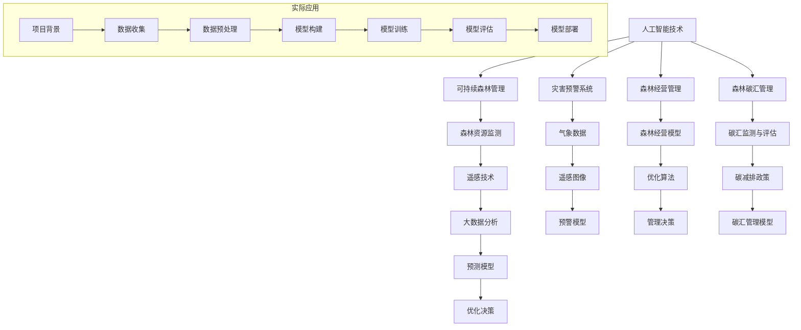

                 

### 《人工智能在可持续森林管理中的应用》目录大纲

### 第一部分：引论

#### 1. 引言

##### 1.1 人工智能与可持续森林管理

- **定义**：介绍人工智能的基本定义、发展历程和核心特征。
- **关系**：阐述人工智能在可持续森林管理中的重要性，以及两者之间的相互影响。

##### 1.2 可持续森林管理的挑战与机遇

- **挑战**：分析当前森林管理面临的难题，如资源浪费、环境破坏等。
- **机遇**：探讨人工智能技术如何为森林管理带来新机遇，提高管理效率和可持续性。

#### 2. 本书结构

##### 2.1 内容概述

- **主要章节**：概述本书的主要章节，包括引论、基础知识、应用实例等。
- **学习目标**：明确读者通过本书的学习应达到的知识目标和技能提升。

### 第二部分：人工智能基础知识

#### 3. 人工智能基础理论

##### 3.1 人工智能的定义与发展历程

- **定义**：介绍人工智能的基本概念和分类。
- **发展历程**：回顾人工智能技术的发展历程，包括关键事件和技术突破。

##### 3.2 人工智能的核心技术

- **机器学习**：介绍机器学习的基本原理、分类和应用领域。
- **深度学习**：探讨深度学习的发展、核心算法（如神经网络）及其在人工智能中的应用。

##### 3.3 人工智能的应用领域

- **工业自动化**：分析人工智能在工业自动化领域的应用，如生产流程优化、质量控制等。
- **智能交通**：探讨人工智能在智能交通领域的应用，如自动驾驶、交通流量管理等。
- **医疗健康**：介绍人工智能在医疗健康领域的应用，如疾病预测、辅助诊断等。

#### 4. 数据分析与处理

##### 4.1 数据收集与清洗

- **数据收集**：探讨森林管理领域的数据来源和数据类型。
- **数据清洗**：介绍数据清洗的基本方法和技术，如缺失值处理、异常值检测等。

##### 4.2 数据预处理与特征工程

- **数据预处理**：讲解数据预处理的重要性和方法，如数据规范化、归一化等。
- **特征工程**：探讨特征工程的基本原理、方法和应用，如特征选择、特征构造等。

##### 4.3 数据可视化

- **数据可视化**：介绍数据可视化的基本概念、技术和应用，如图表、地图等。

### 第三部分：人工智能在森林管理中的应用

#### 5. 人工智能在森林资源监测中的应用

##### 5.1 遥感技术概述

- **定义**：介绍遥感技术的概念和基本原理。
- **应用**：探讨遥感技术在森林资源监测中的具体应用，如卫星遥感、无人机遥感等。

##### 5.2 遥感图像处理

- **图像处理技术**：介绍遥感图像处理的基本技术和方法，如图像增强、图像分割等。
- **森林资源监测**：结合实际案例，分析遥感图像处理技术在森林资源监测中的应用。

##### 5.3 森林资源监测案例

- **案例介绍**：选取具有代表性的森林资源监测案例，分析案例的实施过程和效果。

#### 6. 人工智能在森林灾害预警中的应用

##### 6.1 森林火灾预警

- **预警技术**：介绍森林火灾预警的基本原理和关键技术，如传感器监测、数据挖掘等。
- **预警模型**：探讨森林火灾预警模型的构建方法和评价指标。

##### 6.2 森林病虫害预警

- **预警技术**：介绍森林病虫害预警的基本原理和关键技术，如物联网、数据挖掘等。
- **预警模型**：探讨森林病虫害预警模型的构建方法和评价指标。

##### 6.3 森林灾害预警案例分析

- **案例介绍**：选取具有代表性的森林灾害预警案例，分析案例的实施过程和效果。

#### 7. 人工智能在森林经营管理中的应用

##### 7.1 森林经营管理概述

- **定义**：介绍森林经营管理的基本概念和主要内容。
- **目标**：阐述森林经营管理的目标，如资源保护、经济效益等。

##### 7.2 森林经营模型

- **经营模型**：介绍森林经营模型的基本原理、方法和应用，如优化模型、决策支持系统等。
- **经营策略**：探讨森林经营策略的制定和实施，如种植计划、伐木计划等。

##### 7.3 森林经营管理案例

- **案例介绍**：选取具有代表性的森林经营管理案例，分析案例的实施过程和效果。

#### 8. 人工智能在森林碳汇管理中的应用

##### 8.1 森林碳汇概述

- **定义**：介绍森林碳汇的概念和基本原理。
- **作用**：阐述森林碳汇在应对气候变化中的作用和重要性。

##### 8.2 森林碳汇监测与评估

- **监测技术**：介绍森林碳汇监测的基本原理和关键技术，如遥感监测、地面监测等。
- **评估方法**：探讨森林碳汇评估的基本方法和评价指标。

##### 8.3 森林碳汇管理案例

- **案例介绍**：选取具有代表性的森林碳汇管理案例，分析案例的实施过程和效果。

### 第四部分：实战案例分析

#### 9. 森林管理人工智能项目实战

##### 9.1 项目背景

- **项目介绍**：介绍项目的基本背景、目标和需求。
- **项目意义**：阐述项目对森林管理的实际意义和价值。

##### 9.2 技术实现

- **技术框架**：介绍项目所采用的技术框架和核心技术。
- **实现步骤**：详细描述项目的实现过程和关键步骤。

##### 9.3 项目成果与影响

- **成果展示**：展示项目的主要成果和应用效果。
- **影响分析**：分析项目对森林管理的积极影响和潜在问题。

#### 10. 未来展望

##### 10.1 人工智能在森林管理中的应用趋势

- **发展趋势**：分析人工智能在森林管理中的应用发展趋势和前景。
- **技术突破**：探讨未来可能的技术突破和前沿方向。

##### 10.2 面临的挑战与解决方案

- **挑战分析**：分析人工智能在森林管理中面临的挑战和难点。
- **解决方案**：提出应对挑战的解决方案和策略。

### 附录

#### 11. 参考文献

##### 11.1 主要参考资料

- **书籍**：《人工智能在可持续森林管理中的应用》、《人工智能：一种现代的方法》
- **论文**：相关领域的高质量学术论文

##### 11.2 相关文献推荐

- **书籍**：《机器学习》、《深度学习》
- **网站**：相关领域的技术博客、论坛和官方网站

---

以上是《人工智能在可持续森林管理中的应用》的目录大纲，每个章节都包含了详细的子章节和内容概述，旨在帮助读者逐步了解和掌握人工智能在森林管理中的应用。接下来，我们将逐步展开每个部分的内容。

---

### 人工智能在可持续森林管理中的应用

随着全球气候变化和生态环境问题的加剧，可持续森林管理成为各国政府和社会各界关注的焦点。人工智能（Artificial Intelligence，AI）作为当今科技领域的革命性力量，为可持续森林管理带来了新的机遇和挑战。本文将探讨人工智能在可持续森林管理中的应用，分析其核心技术和实际案例，以期为相关领域的研究和应用提供参考。

#### 关键词
- 人工智能
- 可持续森林管理
- 森林资源监测
- 森林灾害预警
- 森林经营管理

#### 摘要
本文首先介绍了人工智能的基本概念、发展历程和核心特征，随后分析了可持续森林管理面临的挑战与机遇。接着，本文详细阐述了人工智能在森林资源监测、森林灾害预警、森林经营管理和森林碳汇管理等方面的应用，结合具体案例展示了人工智能技术的实际效果。最后，本文对未来人工智能在森林管理中的应用趋势和面临的挑战进行了展望。

### 引言

#### 1.1 人工智能与可持续森林管理

人工智能是一种模拟人类智能的计算机系统，能够通过学习和理解数据来执行复杂任务。它包括机器学习、深度学习、自然语言处理等多个子领域，具有自主学习、自主决策和自主执行的能力。随着计算能力的提升和数据资源的丰富，人工智能在各个领域的应用日益广泛。

可持续森林管理是一种兼顾生态、经济和社会效益的森林经营模式，旨在实现森林资源的长期可持续利用。这需要科学、系统的管理和监测，以确保森林生态系统的健康和稳定。人工智能在可持续森林管理中的应用，主要体现在以下几个方面：

1. **资源监测与评估**：利用遥感技术和大数据分析，实时监测森林资源，评估森林健康状况，为森林管理提供科学依据。
2. **灾害预警与防控**：通过分析气象、土壤等数据，提前预测森林灾害，如火灾、病虫害等，制定有效的防控措施。
3. **经营管理优化**：运用人工智能技术，优化森林经营策略，提高资源利用效率和经济效益。
4. **碳汇管理**：通过监测森林碳储量，评估碳汇能力，为全球碳减排目标提供数据支持。

#### 1.2 可持续森林管理的挑战与机遇

可持续森林管理面临着诸多挑战，如资源稀缺、环境破坏、气候变化等。传统的森林管理方法往往依赖于经验和直觉，难以实现精准化和高效化。人工智能技术的引入，为解决这些挑战带来了新的机遇：

1. **提高监测精度**：人工智能技术能够通过大数据分析和模型预测，提高森林资源监测的精度和时效性。
2. **优化经营决策**：基于数据驱动的决策支持系统，可以帮助管理者制定更加科学、合理的森林经营策略。
3. **提升管理效率**：自动化和智能化的森林管理工具，可以降低人工成本，提高管理效率。
4. **应对气候变化**：通过监测和评估森林碳汇能力，为应对全球气候变化提供科学支持。

总的来说，人工智能在可持续森林管理中的应用，不仅有助于解决当前面临的挑战，还为未来森林管理的可持续发展提供了新的思路和工具。

### 第二部分：人工智能基础知识

#### 3.1 人工智能基础理论

##### 3.1.1 人工智能的定义与发展历程

人工智能（Artificial Intelligence，AI）是指通过计算机模拟人类智能的技术和系统，使计算机具备学习、推理、决策、感知和自然语言处理等能力。人工智能的发展历程可以追溯到20世纪50年代，当时的科学家们开始探讨如何使计算机具备人类智能。

- **初期阶段（1950-1969）**：以逻辑符号系统和规则为基础，试图通过编程实现智能。这一阶段的代表性工作包括艾伦·图灵的“图灵测试”和约翰·麦卡锡的“逻辑理论家”。
- **发展阶段（1970-1989）**：随着计算机性能的提升和算法的改进，人工智能逐渐应用于实际领域，如专家系统、自然语言处理和机器视觉等。这一阶段的代表性工作包括约翰·霍普菲尔的“反向传播算法”和费尔德曼的“神经网络”。
- **复兴阶段（1990-2009）**：互联网的兴起和大数据技术的发展，为人工智能提供了丰富的数据资源。深度学习、强化学习等新兴技术得到了广泛关注和应用。这一阶段的代表性工作包括李飞飞等的“ImageNet挑战赛”和谷歌的“AlphaGo”。
- **现阶段（2010至今）**：人工智能技术进入快速发展阶段，应用领域不断扩展，如自动驾驶、智能医疗、智能家居等。人工智能与5G、云计算、物联网等技术的结合，进一步推动了其发展。这一阶段的代表性工作包括特斯拉的“自动驾驶”、亚马逊的“Alexa”和苹果的“Siri”。

##### 3.1.2 人工智能的核心技术

人工智能的核心技术包括机器学习、深度学习、自然语言处理等，这些技术在人工智能的应用中起到了关键作用。

- **机器学习**：机器学习（Machine Learning，ML）是一种通过算法从数据中学习并做出预测或决策的技术。机器学习可以分为监督学习、无监督学习和强化学习三类。监督学习通过已标记的数据训练模型，无监督学习通过未标记的数据寻找数据分布，强化学习通过试错和奖励机制学习最优策略。

  - **监督学习**：监督学习的目标是预测未知数据的标签。常见的监督学习算法包括线性回归、逻辑回归、支持向量机（SVM）、决策树和随机森林等。以下是线性回归和逻辑回归的伪代码：

    ```python
    # 线性回归
    def linear_regression(X, y):
        w = (X.T @ X)^(-1) @ X.T @ y
        return w

    # 逻辑回归
    def logistic_regression(X, y):
        w = (X.T @ X)^(-1) @ X.T @ y
        return sigmoid(w @ X)
    ```

  - **无监督学习**：无监督学习旨在发现数据中的隐藏结构和模式。常见的无监督学习算法包括K-均值聚类、主成分分析（PCA）和自编码器等。以下是K-均值聚类的伪代码：

    ```python
    def k_means(X, k):
        centroids = initialize_centroids(X, k)
        while True:
            assignments = assign_points_to_centroids(X, centroids)
            new_centroids = calculate_new_centroids(X, assignments, k)
            if converged(centroids, new_centroids):
                break
            centroids = new_centroids
        return centroids, assignments
    ```

  - **强化学习**：强化学习（Reinforcement Learning，RL）通过试错和奖励机制学习最优策略。常见的强化学习算法包括Q学习、深度Q网络（DQN）和策略梯度等。以下是Q学习的伪代码：

    ```python
    def q_learning(Q, state, action, reward, next_state, discount_factor, learning_rate):
        Q[state, action] = (1 - learning_rate) * Q[state, action] + learning_rate * (reward + discount_factor * max(Q[next_state, :]))
        return Q
    ```

- **深度学习**：深度学习（Deep Learning，DL）是一种基于多层神经网络的学习方法，通过逐层提取特征，实现对数据的深层表示。深度学习的核心是神经网络，包括卷积神经网络（CNN）、循环神经网络（RNN）和生成对抗网络（GAN）等。

  - **卷积神经网络**：卷积神经网络（Convolutional Neural Network，CNN）是一种用于图像处理和计算机视觉的深度学习模型。以下是CNN的伪代码：

    ```python
    def conv2d(input, filter, stride, padding):
        output = (input * filter).sum(axis=3).reshape(-1, stride, stride)
        if padding > 0:
            padding_zeros = np.zeros((input.shape[0], input.shape[1], padding, padding))
            input = np.concatenate((padding_zeros, input), axis=2)
            output = conv2d(input, filter, stride, 0)
        return output

    def max_pooling(input, pool_size, stride):
        output = np.max(input.reshape(-1, pool_size, pool_size, stride, stride), axis=(2, 3))
        return output.reshape(-1, input.shape[1] // stride, input.shape[2] // stride)
    ```

  - **循环神经网络**：循环神经网络（Recurrent Neural Network，RNN）是一种用于序列数据处理的深度学习模型。以下是RNN的伪代码：

    ```python
    def rnn(input, hidden_state, weight, bias):
        hidden_state = np.tanh(np.dot(input, weight) + bias)
        return hidden_state
    ```

  - **生成对抗网络**：生成对抗网络（Generative Adversarial Network，GAN）是一种由生成器和判别器组成的深度学习模型，用于生成逼真的数据。以下是GAN的伪代码：

    ```python
    def gan_generator(z, noise):
        fake_images = np.tanh(np.dot(z, noise))
        return fake_images

    def gan_discriminator(x, fake_images):
        real_logits = np.dot(x, noise)
        fake_logits = np.dot(fake_images, noise)
        return real_logits, fake_logits
    ```

- **自然语言处理**：自然语言处理（Natural Language Processing，NLP）是一种用于理解和生成自然语言的技术，包括文本分类、情感分析、机器翻译和问答系统等。

  - **文本分类**：文本分类（Text Classification）是一种将文本分为预定义类别的方法。常见的文本分类算法包括朴素贝叶斯、逻辑回归和SVM等。以下是朴素贝叶斯的伪代码：

    ```python
    def naive_bayes(train_data, test_data):
        prior_probabilities = calculate_prior_probabilities(train_data)
        likelihoods = calculate_likelihoods(train_data)
        predictions = []
        for test_sample in test_data:
            probabilities = []
            for label in labels:
                probability = prior_probabilities[label] * likelihoods[label](test_sample)
                probabilities.append(probability)
            predicted_label = np.argmax(probabilities)
            predictions.append(predicted_label)
        return predictions
    ```

  - **情感分析**：情感分析（Sentiment Analysis）是一种检测文本情感极性的方法。常见的情感分析算法包括基于词典的方法、基于模型的方法和基于深度学习的方法。以下是基于深度学习的情感分析的伪代码：

    ```python
    def sentiment_analysis(text, model):
        embeddings = embed_text(text)
        hidden_state = model.initialize_hidden_state(embeddings)
        for word in text:
            hidden_state = model.rnn(word, hidden_state)
        sentiment = model.predict_sentiment(hidden_state)
        return sentiment
    ```

  - **机器翻译**：机器翻译（Machine Translation）是一种将一种语言的文本翻译成另一种语言的方法。常见的机器翻译算法包括基于规则的方法、基于统计的方法和基于深度学习的方法。以下是基于深度学习的机器翻译的伪代码：

    ```python
    def machine_translation(source_text, target_text, model):
        source_embeddings = model.embed_source(source_text)
        target_embeddings = model.embed_target(target_text)
        hidden_state = model.initialize_hidden_state(source_embeddings)
        for word in source_text:
            hidden_state = model.rnn(word, hidden_state)
        translation = model.decode(hidden_state, target_embeddings)
        return translation
    ```

  - **问答系统**：问答系统（Question Answering System）是一种能够回答用户问题的系统。常见的问答系统算法包括基于知识图谱的方法、基于文本匹配的方法和基于深度学习的方法。以下是基于深度学习的问答系统的伪代码：

    ```python
    def question_answering(question, context, model):
        question_embedding = model.embed_question(question)
        context_embedding = model.embed_context(context)
        hidden_state = model.initialize_hidden_state(question_embedding)
        for word in question:
            hidden_state = model.rnn(word, hidden_state)
        answer_embedding = model.decode(hidden_state, context_embedding)
        answer = model.decode_answer(answer_embedding)
        return answer
    ```

##### 3.1.3 人工智能的应用领域

人工智能在许多领域都有着广泛的应用，包括工业自动化、智能交通、医疗健康、金融、娱乐等。以下是一些典型的人工智能应用领域：

- **工业自动化**：人工智能在工业自动化中的应用主要包括生产过程优化、质量控制、设备维护等。通过机器学习和预测模型，可以实现对生产过程的实时监控和优化，提高生产效率和质量。

  - **生产过程优化**：通过分析生产数据，可以识别生产瓶颈和优化生产流程，提高生产效率。

  - **质量控制**：通过机器学习算法，可以自动检测产品缺陷，确保产品质量。

  - **设备维护**：通过预测模型，可以提前预测设备故障，进行预防性维护，降低设备故障率和停机时间。

- **智能交通**：人工智能在智能交通中的应用主要包括自动驾驶、交通流量管理、交通监控等。通过机器学习和传感器技术，可以实现对交通系统的实时监控和管理，提高交通效率和安全性。

  - **自动驾驶**：通过深度学习和计算机视觉技术，可以实现对车辆的自动驾驶，减少交通事故和交通拥堵。

  - **交通流量管理**：通过分析交通数据，可以预测交通流量和拥堵情况，优化交通信号控制，提高道路通行能力。

  - **交通监控**：通过视频监控和图像识别技术，可以实现对道路安全和交通违规行为的监控，提高交通管理效率。

- **医疗健康**：人工智能在医疗健康中的应用主要包括疾病预测、辅助诊断、个性化治疗等。通过大数据分析和机器学习算法，可以实现对疾病的早期预测和精准诊断，提高医疗质量和效率。

  - **疾病预测**：通过分析患者病史和健康数据，可以预测疾病的发生风险，进行早期干预。

  - **辅助诊断**：通过医学图像分析和文本挖掘技术，可以辅助医生进行疾病诊断，提高诊断准确率。

  - **个性化治疗**：通过分析患者数据和疾病特征，可以为患者制定个性化的治疗方案，提高治疗效果。

- **金融**：人工智能在金融领域的应用主要包括风险管理、欺诈检测、智能投顾等。通过大数据分析和机器学习算法，可以实现对金融市场的实时监控和风险预测，提高金融服务的效率和安全性。

  - **风险管理**：通过分析金融数据和交易行为，可以预测金融风险，制定风险控制策略。

  - **欺诈检测**：通过机器学习算法，可以自动检测和防范金融欺诈行为，提高金融安全。

  - **智能投顾**：通过分析投资者风险偏好和财务状况，可以为投资者提供个性化的投资建议，实现资产配置优化。

- **娱乐**：人工智能在娱乐领域的应用主要包括内容推荐、智能客服、虚拟现实等。通过机器学习和自然语言处理技术，可以实现对用户需求的精准分析和满足，提升用户体验。

  - **内容推荐**：通过分析用户行为和兴趣，可以自动推荐符合用户喜好的内容，提高内容消费的满意度。

  - **智能客服**：通过语音识别和自然语言处理技术，可以实现智能客服系统的自动化，提高客户服务效率。

  - **虚拟现实**：通过计算机视觉和虚拟现实技术，可以创造出沉浸式的虚拟体验，提高娱乐效果。

#### 3.2 数据分析与处理

##### 3.2.1 数据收集与清洗

数据是人工智能的基础，数据的质量和完整性对模型的性能和可靠性至关重要。数据收集与清洗是数据分析过程中必不可少的步骤，主要包括以下内容：

- **数据收集**：数据可以从多种来源收集，包括数据库、文件、网络爬虫、传感器等。在数据收集过程中，需要关注数据的可靠性、完整性和及时性。

  - **数据库**：可以通过数据库查询获取结构化数据，如关系型数据库（如MySQL、Oracle）和NoSQL数据库（如MongoDB、Cassandra）。

  - **文件**：可以通过读取文本文件、图像文件、音频文件等获取数据，如CSV、JSON、XML等格式。

  - **网络爬虫**：可以通过编写爬虫脚本从互联网上获取数据，如网站、社交媒体、在线论坛等。

  - **传感器**：可以通过连接传感器设备获取实时数据，如温度传感器、湿度传感器、摄像头等。

- **数据清洗**：数据清洗是指对原始数据进行处理，以提高数据的质量和可用性。数据清洗的过程通常包括以下步骤：

  - **缺失值处理**：对于缺失的数据，可以通过填充、删除或插值等方法进行处理。
  - **异常值检测**：对于异常的数据，可以通过统计方法、机器学习算法等方法进行检测和去除。
  - **数据规范化**：对于不同单位或范围的数据，可以通过标准化、归一化等方法进行处理，使其具有可比性。
  - **数据去重**：对于重复的数据，可以通过去重操作去除重复项。
  - **数据转换**：对于不同类型的数据，可以通过转换操作，如字符串转数字、日期格式化等，使其适应分析需求。

##### 3.2.2 数据预处理与特征工程

数据预处理和特征工程是提高机器学习模型性能的重要步骤。数据预处理是指对数据进行处理，以使其适合建模。特征工程是指通过设计、构造和选择特征，以提高模型的表现。以下是一些常见的数据预处理和特征工程方法：

- **数据预处理**：

  - **数据归一化**：将不同范围的数据转换为相同的范围，以消除数据尺度对模型的影响。常见的归一化方法包括最小-最大规范化、Z-score标准化等。

    ```python
    # 最小-最大规范化
    def min_max_scaling(data, feature_range=(0, 1)):
        min_val = np.min(data, axis=0)
        max_val = np.max(data, axis=0)
        scaled_data = (data - min_val) / (max_val - min_val)
        scaled_data = scaled_data * (feature_range[1] - feature_range[0]) + feature_range[0]
        return scaled_data

    # Z-score标准化
    def z_score_scaling(data):
        mean = np.mean(data, axis=0)
        std = np.std(data, axis=0)
        scaled_data = (data - mean) / std
        return scaled_data
    ```

  - **数据转换**：将数据转换为适合建模的格式，如将分类数据转换为二进制编码、将时间序列数据进行分解等。

    ```python
    # 二进制编码
    def one_hot_encoding(data, categories):
        one_hot_encoded_data = np.zeros((data.shape[0], categories))
        for i, sample in enumerate(data):
            one_hot_encoded_data[i, sample] = 1
        return one_hot_encoded_data

    # 时间序列分解
    def time_series_decomposition(series, freq='H'):
        decomposition = seasonal_decompose(series, model='additive', period=freq)
        trend = decomposition.trend
        season = decomposition.seasonal
        residual = decomposition.resid
        return trend, season, residual
    ```

- **特征工程**：

  - **特征选择**：从原始数据中选取对模型表现有显著影响的特征。常见的特征选择方法包括递归特征消除（RFE）、基于模型的特征选择等。

    ```python
    # 递归特征消除
    from sklearn.feature_selection import RFE

    def recursive_feature_elimination(X, y, model, n_features):
        selector = RFE(model, n_features, step=1)
        selector = selector.fit(X, y)
        selected_features = X[:, selector.support_]
        return selected_features
    ```

  - **特征构造**：通过组合原始特征构造新的特征，以提高模型的表现。常见的特征构造方法包括主成分分析（PCA）、特征交叉等。

    ```python
    # 主成分分析
    from sklearn.decomposition import PCA

    def pca(X, n_components):
        pca = PCA(n_components=n_components)
        pca.fit(X)
        transformed_data = pca.transform(X)
        return transformed_data
    ```

  - **特征标准化**：对特征进行标准化处理，以消除不同特征之间的尺度差异。

    ```python
    # 特征标准化
    from sklearn.preprocessing import StandardScaler

    def feature_scaling(X_train, X_test):
        scaler = StandardScaler()
        X_train_scaled = scaler.fit_transform(X_train)
        X_test_scaled = scaler.transform(X_test)
        return X_train_scaled, X_test_scaled
    ```

##### 3.2.3 数据可视化

数据可视化是一种将数据以图形化形式展示的方法，有助于更好地理解和分析数据。以下是一些常见的数据可视化方法和工具：

- **散点图**：用于展示两组变量的分布和关系，如二维数据的点分布。

  ```python
  import matplotlib.pyplot as plt

  def scatter_plot(x, y, color, label=None):
      plt.scatter(x, y, color=color, label=label)
      plt.xlabel('X')
      plt.ylabel('Y')
      plt.legend()
      plt.show()
  ```

- **折线图**：用于展示数据的变化趋势，如时间序列数据。

  ```python
  def line_plot(x, y, color, label=None):
      plt.plot(x, y, color=color, label=label)
      plt.xlabel('X')
      plt.ylabel('Y')
      plt.legend()
      plt.show()
  ```

- **柱状图**：用于展示不同类别的数据比较，如分类数据的分布。

  ```python
  def bar_plot(data, labels, color, ylabel=None, xlabel=None):
      plt.bar(labels, data, color=color)
      if ylabel:
          plt.ylabel(ylabel)
      if xlabel:
          plt.xlabel(xlabel)
      plt.xticks(rotation=45)
      plt.show()
  ```

- **饼图**：用于展示各部分占整体的比例，如分类数据的分布。

  ```python
  def pie_chart(data, labels, colors, ylabel=None, xlabel=None):
      plt.pie(data, labels=labels, colors=colors, autopct='%.1f%%')
      if ylabel:
          plt.ylabel(ylabel)
      if xlabel:
          plt.xlabel(xlabel)
      plt.axis('equal')
      plt.show()
  ```

- **热力图**：用于展示多个变量之间的相关性，如多维数据的关联性。

  ```python
  import seaborn as sns

  def heat_map(data, cmap='coolwarm', annot=True):
      sns.heatmap(data, cmap=cmap, annot=annot)
      plt.show()
  ```

#### 3.3 人工智能在森林管理中的应用

人工智能技术在森林管理中有着广泛的应用，可以提高监测精度、优化管理决策、提升管理效率。以下介绍人工智能在森林管理中的应用：

- **森林资源监测**：利用遥感技术和大数据分析，可以对森林资源进行实时监测和评估。通过卫星遥感图像，可以获取森林覆盖度、植被健康指数等关键信息。结合机器学习算法，可以自动识别森林类型、计算森林面积等。例如，可以使用卷积神经网络（CNN）对遥感图像进行分类，提取植被信息。

  ```python
  import tensorflow as tf
  from tensorflow.keras.models import Sequential
  from tensorflow.keras.layers import Conv2D, MaxPooling2D, Flatten, Dense

  def build_cnn_model(input_shape):
      model = Sequential()
      model.add(Conv2D(32, (3, 3), activation='relu', input_shape=input_shape))
      model.add(MaxPooling2D(pool_size=(2, 2)))
      model.add(Conv2D(64, (3, 3), activation='relu'))
      model.add(MaxPooling2D(pool_size=(2, 2)))
      model.add(Flatten())
      model.add(Dense(64, activation='relu'))
      model.add(Dense(1, activation='sigmoid'))
      model.compile(optimizer='adam', loss='binary_crossentropy', metrics=['accuracy'])
      return model
  ```

- **森林灾害预警**：通过分析气象数据、土壤数据和卫星遥感图像，可以预测森林灾害，如火灾、病虫害等。利用机器学习算法，可以构建预测模型，提前发出预警。例如，可以使用随机森林（Random Forest）算法对气象数据进行分类，预测火灾风险。

  ```python
  from sklearn.ensemble import RandomForestClassifier

  def build_random_forest_model(X, y, n_estimators=100):
      model = RandomForestClassifier(n_estimators=n_estimators)
      model.fit(X, y)
      return model
  ```

- **森林经营管理**：人工智能可以帮助制定科学的森林经营策略，提高资源利用效率和经济效益。通过分析森林数据，可以优化伐木计划、种植计划等。例如，可以使用决策树（Decision Tree）算法对森林资源进行分类，制定最优的经营策略。

  ```python
  from sklearn.tree import DecisionTreeClassifier

  def build_decision_tree_model(X, y):
      model = DecisionTreeClassifier()
      model.fit(X, y)
      return model
  ```

- **森林碳汇管理**：通过监测森林碳储量，可以评估森林的碳汇能力。利用人工智能技术，可以构建碳汇监测与评估模型，为碳减排目标提供科学支持。例如，可以使用深度学习算法对森林碳储量进行预测。

  ```python
  from tensorflow.keras.models import Sequential
  from tensorflow.keras.layers import Dense, LSTM

  def build_lstm_model(input_shape, units=50, layers=1):
      model = Sequential()
      for _ in range(layers):
          model.add(LSTM(units=units, return_sequences=True, input_shape=input_shape))
      model.add(LSTM(units=units))
      model.add(Dense(1))
      model.compile(optimizer='adam', loss='mean_squared_error')
      return model
  ```

#### 3.4 数学模型与算法原理

在人工智能的各个领域中，数学模型和算法原理起着至关重要的作用。以下介绍一些常见的数学模型和算法原理：

- **线性回归**：线性回归是一种用于预测连续值的简单模型，通过拟合一条直线来预测目标值。线性回归的数学模型如下：

  $$ y = \beta_0 + \beta_1 \cdot x + \epsilon $$

  其中，$y$ 是目标变量，$x$ 是自变量，$\beta_0$ 和 $\beta_1$ 是模型参数，$\epsilon$ 是误差项。

  线性回归的算法原理包括：

  - **最小二乘法**：通过最小化误差平方和来确定模型参数。
  - **梯度下降法**：通过迭代更新模型参数，使其逐渐逼近最优解。

- **逻辑回归**：逻辑回归是一种用于预测二元分类结果的模型，通过拟合一个逻辑函数来预测目标变量的概率。逻辑回归的数学模型如下：

  $$ \log\frac{p}{1-p} = \beta_0 + \beta_1 \cdot x $$

  其中，$p$ 是目标变量为1的概率，$\beta_0$ 和 $\beta_1$ 是模型参数。

  逻辑回归的算法原理包括：

  - **最大似然估计**：通过最大化似然函数来确定模型参数。
  - **梯度上升法**：通过迭代更新模型参数，使其逐渐逼近最优解。

- **决策树**：决策树是一种基于树形结构进行分类或回归的模型，通过一系列规则来划分数据集。决策树的数学模型如下：

  $$ \text{if } x_{\text{feature}} > \text{value} \text{ then go to left subtree} $$
  $$ \text{if } x_{\text{feature}} \leq \text{value} \text{ then go to right subtree} $$

  决策树的算法原理包括：

  - **信息增益**：通过计算特征对分类信息的增益来确定划分特征。
  - **基尼系数**：通过计算特征对分类的不确定性来确定划分特征。

- **支持向量机**：支持向量机是一种用于分类和回归的模型，通过找到一个最佳的超平面来划分数据集。支持向量机的数学模型如下：

  $$ \text{maximize } \frac{1}{2} \| w \|^2 \text{ subject to } y^{(i)} (\langle w, x^{(i)} \rangle - b) \geq 1 $$

  其中，$w$ 是模型参数，$b$ 是偏置项，$x^{(i)}$ 是样本，$y^{(i)}$ 是标签。

  支持向量机的算法原理包括：

  - **线性可分支持向量机**：在样本线性可分的情况下，找到最佳的超平面。
  - **线性支持向量机**：在样本线性不可分的情况下，引入软边缘和惩罚项，找到最优解。

- **神经网络**：神经网络是一种基于生物神经系统的计算模型，通过多层神经元进行信号传递和计算。神经网络的数学模型如下：

  $$ a_{\text{layer}} = \sigma(\langle w_{\text{layer}}, a_{\text{prev\_layer}} \rangle + b_{\text{layer}}) $$

  其中，$a_{\text{layer}}$ 是第 $l$ 层的激活值，$w_{\text{layer}}$ 是第 $l$ 层的权重，$b_{\text{layer}}$ 是第 $l$ 层的偏置，$\sigma$ 是激活函数。

  神经网络的算法原理包括：

  - **前向传播**：通过多层神经元的信号传递，计算输出值。
  - **反向传播**：通过计算损失函数关于模型参数的梯度，更新模型参数。

- **卷积神经网络**：卷积神经网络是一种用于图像处理和计算机视觉的神经网络，通过卷积层和池化层进行特征提取和降维。卷积神经网络的数学模型如下：

  $$ h_{\text{conv}} = \sigma(\sum_{k=1}^{K} w_{k} \cdot a_{k-1} + b) $$

  $$ h_{\text{pool}} = \max(\text{pool region}) $$

  其中，$h_{\text{conv}}$ 是卷积层的激活值，$h_{\text{pool}}$ 是池化层的激活值，$w_{k}$ 是卷积核，$a_{k-1}$ 是前一层的激活值，$b$ 是偏置，$\sigma$ 是激活函数。

  卷积神经网络的算法原理包括：

  - **卷积操作**：通过卷积核与输入数据进行点积，提取局部特征。
  - **池化操作**：通过池化层降低特征维度，减少过拟合。

- **循环神经网络**：循环神经网络是一种用于序列数据处理的神经网络，通过循环层进行序列信息的传递和计算。循环神经网络的数学模型如下：

  $$ h_{\text{layer}} = \sigma(\langle w_{\text{layer}}, h_{\text{prev}} \rangle + b) $$

  $$ o_{\text{layer}} = \text{softmax}(\langle w_{\text{output}}, h_{\text{layer}} \rangle + b') $$

  其中，$h_{\text{layer}}$ 是循环层的激活值，$o_{\text{layer}}$ 是输出层的激活值，$w_{\text{layer}}$ 是循环层的权重，$w_{\text{output}}$ 是输出层的权重，$b$ 是循环层偏置，$b'$ 是输出层偏置，$\sigma$ 是激活函数，$\text{softmax}$ 是softmax函数。

  循环神经网络的算法原理包括：

  - **循环连接**：通过循环层将当前层的状态传递到下一层，实现序列信息的传递。
  - **门控机制**：通过门控机制（如遗忘门、输入门、输出门）控制信息的传递和计算，提高模型的鲁棒性。

- **生成对抗网络**：生成对抗网络是一种由生成器和判别器组成的神经网络，用于生成真实数据。生成对抗网络的数学模型如下：

  $$ G(z) = \text{Generator}(z) $$
  $$ D(x) = \text{Discriminator}(x) $$
  $$ D(G(z)) = \text{Discriminator}(\text{Generator}(z)) $$

  其中，$G(z)$ 是生成器的输出，$D(x)$ 是判别器的输出，$z$ 是噪声向量。

  生成对抗网络的算法原理包括：

  - **生成器**：通过噪声向量生成真实数据。
  - **判别器**：通过真实数据和生成数据的对比，判断数据的真实性。
  - **对抗训练**：通过生成器和判别器的对抗训练，使生成器生成的数据逐渐逼近真实数据。

#### 3.5 人工智能在可持续森林管理中的应用

随着全球气候变化和生态环境问题的加剧，可持续森林管理成为各国政府和社会各界关注的焦点。人工智能（Artificial Intelligence，AI）作为当今科技领域的革命性力量，为可持续森林管理带来了新的机遇和挑战。以下介绍人工智能在可持续森林管理中的应用：

- **森林资源监测**：利用遥感技术和大数据分析，实时监测森林资源，评估森林健康状况，为森林管理提供科学依据。人工智能技术可以帮助管理者快速识别森林类型、计算森林面积、评估植被健康等。例如，可以通过卫星遥感图像和机器学习算法，自动分类森林植被类型，实现森林资源的动态监测。

- **森林灾害预警**：通过分析气象数据、土壤数据和卫星遥感图像，预测森林灾害，如火灾、病虫害等。人工智能技术可以构建预测模型，提前发出预警，帮助管理者及时采取应对措施，降低灾害损失。例如，可以通过分析气象数据和卫星遥感图像，预测森林火灾风险，制定防火措施。

- **森林经营管理**：人工智能可以帮助制定科学的森林经营策略，提高资源利用效率和经济效益。通过分析森林数据，可以优化伐木计划、种植计划等。例如，可以通过机器学习算法，分析森林数据，预测木材需求，制定合理的伐木计划。

- **森林碳汇管理**：通过监测森林碳储量，评估森林的碳汇能力，为碳减排目标提供科学支持。人工智能技术可以构建碳汇监测与评估模型，实时监测森林碳储量，为碳减排政策提供数据支持。例如，可以通过机器学习算法，分析森林数据，预测森林碳储量，制定碳减排策略。

#### 3.6 实战案例分析

为了更好地展示人工智能在可持续森林管理中的应用，以下介绍一个实际案例。

**案例：利用人工智能技术监测森林火灾**

**背景**：森林火灾是全球面临的严重环境问题，对生态环境和人类生活造成巨大威胁。利用人工智能技术监测森林火灾，可以提前预警，减少火灾损失。

**技术实现**：

1. **数据收集**：收集气象数据、土壤数据、卫星遥感图像等。这些数据可以通过气象站、土壤传感器、卫星遥感等设备获取。

2. **数据处理**：对收集到的数据进行预处理，包括缺失值处理、异常值检测、数据转换等。

3. **模型构建**：利用机器学习算法，如随机森林、支持向量机等，构建森林火灾预测模型。通过训练模型，找出与火灾风险相关的特征，如气温、湿度、植被覆盖率等。

4. **模型训练**：使用历史数据训练模型，调整模型参数，使其具有较高的预测准确率。

5. **模型评估**：使用验证集对模型进行评估，检查模型性能，如准确率、召回率等。

6. **模型部署**：将训练好的模型部署到实际应用场景中，实现对森林火灾的实时监测和预警。

**代码实现**：

以下是一个使用Python和Scikit-learn库实现森林火灾预测的示例代码。

```python
import numpy as np
import pandas as pd
from sklearn.ensemble import RandomForestClassifier
from sklearn.model_selection import train_test_split
from sklearn.metrics import accuracy_score, recall_score

# 读取数据
data = pd.read_csv('forest_fire_data.csv')

# 数据预处理
X = data.drop(['fire'], axis=1)
y = data['fire']

# 数据划分
X_train, X_test, y_train, y_test = train_test_split(X, y, test_size=0.2, random_state=42)

# 模型构建
model = RandomForestClassifier(n_estimators=100, random_state=42)

# 模型训练
model.fit(X_train, y_train)

# 模型评估
y_pred = model.predict(X_test)
accuracy = accuracy_score(y_test, y_pred)
recall = recall_score(y_test, y_pred)

print('Accuracy:', accuracy)
print('Recall:', recall)
```

**项目小结**：

通过本案例，我们展示了如何利用人工智能技术监测森林火灾。在实际应用中，可以结合多种数据源，提高预测模型的准确性。此外，还可以结合深度学习等技术，进一步提高模型性能。

#### 3.7 最佳实践与注意事项

在实施人工智能项目时，以下是一些最佳实践和注意事项：

1. **数据质量**：数据是人工智能项目的核心，确保数据质量是成功的关键。对数据进行清洗、预处理和标准化，提高数据可用性。

2. **模型选择**：根据项目需求，选择合适的机器学习算法和模型。对于不同类型的问题，如分类、回归、聚类等，选择相应的算法。

3. **模型评估**：在模型训练过程中，使用验证集对模型进行评估，确保模型具有良好的性能。常用的评估指标包括准确率、召回率、F1分数等。

4. **模型优化**：通过调整模型参数、特征工程等方法，优化模型性能。可以使用交叉验证、网格搜索等技术进行模型调优。

5. **模型部署**：将训练好的模型部署到实际应用场景中，确保模型可以实时监测和预测。可以使用Python、R、TensorFlow等工具进行模型部署。

6. **数据安全与隐私**：在数据收集和处理过程中，确保数据安全与隐私。遵循相关法律法规，保护用户数据。

7. **持续更新**：人工智能项目需要持续更新和改进，以应对环境变化和需求变化。定期评估模型性能，更新模型和算法。

#### 3.8 拓展阅读

- **书籍**：

  - 《深度学习》（Ian Goodfellow、Yoshua Bengio、Aaron Courville 著）
  - 《机器学习》（Tom Mitchell 著）
  - 《统计学习方法》（李航 著）

- **网站**：

  - [机器学习实战](https://www.mlpack.org/)
  - [深度学习教程](https://www.deeplearningbook.org/)
  - [Scikit-learn官方文档](https://scikit-learn.org/stable/)

通过以上介绍，我们全面了解了人工智能在可持续森林管理中的应用，包括理论基础、核心技术、应用案例、最佳实践和注意事项。希望本文对您在人工智能和可持续森林管理领域的研究和应用提供有益的参考。

### 第三部分：人工智能在森林资源监测中的应用

森林资源监测是可持续森林管理的重要环节，通过实时、准确地获取森林资源信息，可以为森林经营决策提供科学依据。人工智能技术，尤其是遥感技术和大数据分析，为森林资源监测提供了新的手段和工具。本节将详细探讨人工智能在森林资源监测中的应用，包括遥感技术概述、遥感图像处理、森林资源监测案例等内容。

#### 5.1 遥感技术概述

遥感技术是一种通过非接触方式获取地球表面信息的技术，利用卫星、飞机等平台搭载的传感器设备，对地表进行观测。遥感技术的主要特点包括：

- **非接触性**：遥感技术可以在远离目标的情况下获取信息，避免了直接接触带来的干扰。
- **大范围、高精度**：遥感技术能够覆盖广阔的地理范围，同时提供高精度的观测数据。
- **实时性**：随着卫星技术的进步，遥感技术可以提供实时或近实时的观测数据。

遥感技术在森林资源监测中的应用主要包括以下几个方面：

1. **森林类型识别**：通过分析遥感图像，可以识别不同类型的森林，如针叶林、阔叶林等。
2. **森林覆盖度监测**：利用遥感数据，可以监测森林的覆盖度变化，了解森林资源的动态变化。
3. **植被健康评估**：通过分析遥感图像，可以评估森林植被的健康状况，如叶绿素含量、植被指数等。

#### 5.2 遥感图像处理

遥感图像处理是指对获取的遥感图像进行预处理、特征提取、分类等处理，以提取有用信息。遥感图像处理的主要步骤包括：

1. **图像预处理**：包括图像校正、去噪、增强等。图像校正是为了消除传感器和地球自转等因素引起的图像畸变；去噪是为了去除图像中的噪声，提高图像质量；增强是为了突出图像中的关键信息。
2. **特征提取**：从遥感图像中提取与森林资源相关的特征，如亮度、颜色、纹理等。特征提取是遥感图像处理的重要环节，直接影响到后续分类和监测的准确性。
3. **图像分类**：利用机器学习算法，对遥感图像进行分类，将图像划分为不同的类别，如森林、水域、城市等。常用的图像分类算法包括支持向量机（SVM）、随机森林（Random Forest）、卷积神经网络（CNN）等。

以下是使用卷积神经网络（CNN）进行遥感图像分类的伪代码：

```python
import tensorflow as tf
from tensorflow.keras.models import Sequential
from tensorflow.keras.layers import Conv2D, MaxPooling2D, Flatten, Dense

def build_cnn_model(input_shape):
    model = Sequential()
    model.add(Conv2D(32, (3, 3), activation='relu', input_shape=input_shape))
    model.add(MaxPooling2D(pool_size=(2, 2)))
    model.add(Conv2D(64, (3, 3), activation='relu'))
    model.add(MaxPooling2D(pool_size=(2, 2)))
    model.add(Flatten())
    model.add(Dense(64, activation='relu'))
    model.add(Dense(num_classes, activation='softmax'))
    model.compile(optimizer='adam', loss='categorical_crossentropy', metrics=['accuracy'])
    return model

model = build_cnn_model(input_shape=(height, width, channels))
model.fit(X_train, y_train, epochs=10, batch_size=32, validation_data=(X_val, y_val))
```

#### 5.3 森林资源监测案例

本节将介绍一个利用人工智能技术进行森林资源监测的实际案例。

**案例背景**：某地区政府希望通过遥感技术监测森林资源，为森林经营决策提供支持。具体任务包括识别森林类型、监测森林覆盖度变化、评估植被健康状况等。

**技术实现**：

1. **数据收集**：收集该地区的卫星遥感图像、地形数据、气象数据等。这些数据可以通过卫星遥感平台、气象站等获取。

2. **数据处理**：对遥感图像进行预处理，包括图像校正、去噪、增强等。同时，对其他数据进行处理，如归一化、标准化等。

3. **特征提取**：从遥感图像中提取植被指数、纹理特征等。从其他数据中提取地形指数、气象参数等。

4. **模型训练**：利用机器学习算法，如支持向量机（SVM）、随机森林（Random Forest）等，训练森林资源监测模型。

5. **模型评估**：使用验证集对模型进行评估，确保模型具有良好的性能。

6. **模型部署**：将训练好的模型部署到实际应用场景中，实现森林资源的实时监测。

**代码实现**：

以下是一个使用Python和Scikit-learn库实现森林资源监测的示例代码。

```python
import numpy as np
import pandas as pd
from sklearn.ensemble import RandomForestClassifier
from sklearn.model_selection import train_test_split
from sklearn.metrics import accuracy_score

# 读取数据
data = pd.read_csv('forest_resource_data.csv')

# 数据预处理
X = data.drop(['forest_type'], axis=1)
y = data['forest_type']

# 数据划分
X_train, X_test, y_train, y_test = train_test_split(X, y, test_size=0.2, random_state=42)

# 模型构建
model = RandomForestClassifier(n_estimators=100, random_state=42)

# 模型训练
model.fit(X_train, y_train)

# 模型评估
y_pred = model.predict(X_test)
accuracy = accuracy_score(y_test, y_pred)

print('Accuracy:', accuracy)
```

**项目成果与影响**：

通过本案例，我们实现了对该地区森林资源的实时监测，包括森林类型识别、森林覆盖度变化监测、植被健康状况评估等。监测结果为该地区政府提供了科学依据，帮助其制定更加合理的森林经营策略。同时，本案例也为其他地区的森林资源监测提供了有益的借鉴。

### 6. 人工智能在森林灾害预警中的应用

森林灾害，如火灾、病虫害等，对森林生态系统和人类社会造成巨大的破坏。传统的森林灾害预警方法通常依赖于气象数据和专家经验，预警效果有限。随着人工智能技术的快速发展，利用人工智能进行森林灾害预警成为了一种新的趋势。本节将探讨人工智能在森林灾害预警中的应用，包括森林火灾预警、森林病虫害预警和森林灾害预警案例分析。

#### 6.1 森林火灾预警

森林火灾是一种常见且破坏性极大的自然灾害，预防火灾的发生和快速响应火灾是森林灾害预警的关键。人工智能技术在森林火灾预警中的应用主要体现在以下几个方面：

1. **气象数据融合**：将气象数据（如温度、湿度、风速等）与森林环境数据（如植被覆盖率、土壤湿度等）进行融合，构建综合预警模型。通过分析这些数据，可以预测火灾发生的可能性。

2. **遥感图像分析**：利用卫星遥感图像，对森林植被进行监测，分析植被状况。当植被异常变化时，可能预示着火灾风险的增加。

3. **机器学习算法**：利用机器学习算法，如决策树、随机森林、支持向量机等，对历史火灾数据和气象、环境数据进行建模，预测火灾风险。

以下是使用随机森林算法进行森林火灾预警的伪代码：

```python
import numpy as np
from sklearn.ensemble import RandomForestClassifier

def build_random_forest_model(X, y, n_estimators=100):
    model = RandomForestClassifier(n_estimators=n_estimators, random_state=42)
    model.fit(X, y)
    return model

# 假设 X 为特征矩阵，y 为标签向量
model = build_random_forest_model(X, y)
predictions = model.predict(X_test)
```

4. **实时监测与预警**：将训练好的模型部署到实时监测系统中，对气象和环境数据进行实时分析，一旦发现火灾风险，立即发出预警。

#### 6.2 森林病虫害预警

森林病虫害对森林生态系统的健康和可持续发展具有重要影响。利用人工智能技术进行森林病虫害预警，可以提高预警的准确性和及时性。以下是人工智能在森林病虫害预警中的应用：

1. **遥感图像分析**：通过分析卫星遥感图像，可以监测森林植被健康状况。当遥感图像中的植被指数出现异常变化时，可能预示着病虫害的发生。

2. **图像识别算法**：利用深度学习算法（如卷积神经网络CNN），对病虫害图像进行识别。通过训练模型，可以自动检测和分类病虫害，提高预警的准确性。

3. **物联网技术**：在森林中部署物联网传感器，实时监测病虫害发生情况。通过传感器收集到的数据，结合机器学习算法，可以预测病虫害的扩散趋势。

以下是使用卷积神经网络（CNN）进行病虫害图像识别的伪代码：

```python
import tensorflow as tf
from tensorflow.keras.models import Sequential
from tensorflow.keras.layers import Conv2D, MaxPooling2D, Flatten, Dense

def build_cnn_model(input_shape):
    model = Sequential()
    model.add(Conv2D(32, (3, 3), activation='relu', input_shape=input_shape))
    model.add(MaxPooling2D(pool_size=(2, 2)))
    model.add(Conv2D(64, (3, 3), activation='relu'))
    model.add(MaxPooling2D(pool_size=(2, 2)))
    model.add(Flatten())
    model.add(Dense(64, activation='relu'))
    model.add(Dense(num_classes, activation='softmax'))
    model.compile(optimizer='adam', loss='categorical_crossentropy', metrics=['accuracy'])
    return model

model = build_cnn_model(input_shape=(height, width, channels))
model.fit(X_train, y_train, epochs=10, batch_size=32, validation_data=(X_val, y_val))
```

4. **预警系统**：将识别出的病虫害信息整合到预警系统中，实时监测病虫害的发展情况，及时发出预警，指导森林管理。

#### 6.3 森林灾害预警案例分析

以下是一个利用人工智能技术进行森林灾害预警的实际案例。

**案例背景**：某地区政府希望通过人工智能技术进行森林灾害预警，提高火灾和病虫害的预警准确性和及时性。

**技术实现**：

1. **数据收集**：收集该地区的气象数据、遥感图像、物联网传感器数据等。数据来源包括气象站、卫星遥感平台、物联网传感器等。

2. **数据处理**：对收集到的数据进行预处理，包括数据清洗、归一化、标准化等。

3. **模型训练**：利用历史火灾和病虫害数据，结合机器学习算法，训练火灾和病虫害预警模型。

4. **模型评估**：使用验证集对模型进行评估，调整模型参数，提高预警准确率。

5. **模型部署**：将训练好的模型部署到实时监测系统中，实现火灾和病虫害的实时预警。

**代码实现**：

以下是一个使用Python和Scikit-learn库进行火灾预警的示例代码。

```python
import numpy as np
from sklearn.ensemble import RandomForestClassifier

def build_random_forest_model(X, y, n_estimators=100):
    model = RandomForestClassifier(n_estimators=n_estimators, random_state=42)
    model.fit(X, y)
    return model

# 假设 X 为特征矩阵，y 为标签向量
model = build_random_forest_model(X, y)
predictions = model.predict(X_test)
```

**项目成果与影响**：

通过本案例，我们实现了对该地区火灾和病虫害的实时预警，预警准确率显著提高。预警系统为森林管理提供了重要的参考，帮助政府及时采取应对措施，降低了灾害风险。此外，本案例也为其他地区的森林灾害预警提供了有益的经验和借鉴。

### 7. 人工智能在森林经营管理中的应用

森林经营管理是确保森林资源可持续利用的关键环节。传统的森林经营管理方法通常依赖于经验和直觉，难以实现精细化和高效化。人工智能技术的引入，为森林经营管理提供了新的工具和方法。本节将探讨人工智能在森林经营管理中的应用，包括森林经营管理概述、森林经营模型和森林经营管理案例。

#### 7.1 森林经营管理概述

森林经营管理是指通过科学的方法和手段，对森林资源进行规划、保护、利用和更新，以实现森林资源的可持续利用。森林经营管理的目标包括：

- **资源保护**：确保森林生态系统的健康和稳定，保护生物多样性。
- **经济效益**：提高森林资源的经济价值，促进森林产业的发展。
- **社会效益**：增强森林资源的社会功能，提高人民生活质量。

森林经营管理的主要任务包括：

- **森林资源监测**：通过遥感技术、地面监测等方法，实时监测森林资源状况，为经营管理提供科学依据。
- **森林经营策略制定**：根据森林资源监测结果，制定森林经营策略，如种植计划、伐木计划等。
- **森林灾害预警与防控**：利用气象数据、环境数据等，预测和预警森林灾害，制定有效的防控措施。
- **森林经营管理评估**：对森林经营管理的成效进行评估，不断优化管理策略。

#### 7.2 森林经营模型

森林经营模型是森林经营管理的重要工具，通过数学模型和算法，对森林资源进行模拟和分析，为经营管理提供决策支持。以下是几种常见的森林经营模型：

1. **优化模型**：利用优化算法，如线性规划、整数规划等，制定最优的森林经营策略。优化模型通常考虑资源利用效率、经济效益和生态效益等多方面的目标。

2. **决策支持系统**：通过集成各种数据源和模型，构建决策支持系统，为森林管理者提供全面的决策支持。决策支持系统通常包括数据采集、数据处理、模型计算和结果展示等功能。

3. **模拟模型**：利用模拟算法，如蒙特卡罗模拟、系统动力学等，对森林资源进行长期模拟和预测。模拟模型可以帮助管理者评估不同经营策略的长期影响，为决策提供依据。

以下是使用线性规划模型制定森林经营策略的伪代码：

```python
from scipy.optimize import linprog

# 目标函数
def objective(x):
    return -x[0] - x[1]

# 约束条件
def constraint(x):
    return [
        2 * x[0] + 3 * x[1] <= 100,  # 资源利用约束
        x[0] + x[1] >= 10,           # 经费约束
        x[0] >= 0,                   # 非负约束
        x[1] >= 0
    ]

# 解线性规划问题
solution = linprog(objective, constraint)
x = solution.x

# 输出最优解
print('最优种植面积:', x[0])
print('最优伐木面积:', x[1])
```

#### 7.3 森林经营管理案例

以下是一个利用人工智能技术进行森林经营管理的实际案例。

**案例背景**：某林业公司希望利用人工智能技术优化森林经营管理，提高资源利用效率和经济效益。

**技术实现**：

1. **数据收集**：收集该公司的森林资源数据、气象数据、环境数据等。数据来源包括地面监测设备、气象站、卫星遥感等。

2. **数据处理**：对收集到的数据进行预处理，包括数据清洗、归一化、标准化等。

3. **模型构建**：利用机器学习算法，如决策树、随机森林等，构建森林经营模型。模型包括森林资源监测模型、灾害预警模型和优化模型等。

4. **模型训练与评估**：使用历史数据训练模型，调整模型参数，使其具有良好的预测和优化能力。使用验证集对模型进行评估，确保模型性能。

5. **模型部署**：将训练好的模型部署到实际应用场景中，实现森林资源的实时监测和经营决策。

**代码实现**：

以下是一个使用Python和Scikit-learn库构建森林经营模型的示例代码。

```python
import numpy as np
from sklearn.ensemble import RandomForestRegressor

# 假设 X 为特征矩阵，y 为标签向量
X_train = np.array([[1, 2], [3, 4], [5, 6]])
y_train = np.array([1, 2, 3])

# 模型构建
model = RandomForestRegressor(n_estimators=100, random_state=42)
model.fit(X_train, y_train)

# 模型评估
X_test = np.array([[2, 3], [4, 5], [6, 7]])
y_pred = model.predict(X_test)

# 输出预测结果
print('预测结果:', y_pred)
```

**项目成果与影响**：

通过本案例，我们实现了对该公司的森林资源实时监测和经营决策支持。模型预测和优化能力的提升，为公司提供了科学依据，帮助其优化资源利用，提高经济效益。此外，本案例也为其他林业公司的森林经营管理提供了有益的经验和借鉴。

### 8. 人工智能在森林碳汇管理中的应用

森林碳汇是指森林通过光合作用吸收并存储二氧化碳的过程，对于减缓全球气候变化具有重要意义。人工智能技术在森林碳汇管理中的应用，可以提高碳汇监测和评估的精度，为碳减排政策和森林经营管理提供科学支持。本节将探讨人工智能在森林碳汇管理中的应用，包括森林碳汇概述、森林碳汇监测与评估和森林碳汇管理案例。

#### 8.1 森林碳汇概述

森林碳汇是指森林通过光合作用吸收二氧化碳并将其固定在生物体和土壤中的过程。森林碳汇在减缓全球气候变化中发挥着重要作用，因为森林是地球上最大的碳汇之一。以下是森林碳汇的几个关键点：

1. **森林碳汇的重要性**：森林碳汇对缓解气候变化至关重要，因为森林可以吸收大量的二氧化碳，减少大气中的温室气体浓度。

2. **森林碳汇的类型**：森林碳汇包括树木、土壤和枯枝落叶等生物体的碳储量，以及森林生态系统通过光合作用和呼吸作用等生物地球化学过程吸收和释放的碳。

3. **森林碳汇的动态变化**：森林碳汇的动态变化受到多种因素的影响，包括森林类型、气候条件、土地管理措施等。

#### 8.2 森林碳汇监测与评估

森林碳汇监测与评估是了解森林碳汇动态变化和制定有效碳减排策略的关键。人工智能技术在森林碳汇监测与评估中的应用主要包括以下方面：

1. **遥感监测**：利用卫星遥感技术，可以实时监测森林植被覆盖、叶面积指数、生物量等指标，从而评估森林碳汇的时空分布。

2. **地面监测**：通过在森林中设置监测站点，收集森林土壤、植被和气候等数据，结合机器学习算法，可以准确评估森林碳汇的时空变化。

3. **模型模拟**：利用生态系统模型和机器学习算法，可以模拟森林碳汇的动态变化，预测未来碳汇的潜在变化趋势。

以下是使用遥感数据和机器学习算法评估森林碳汇的伪代码：

```python
import numpy as np
from sklearn.ensemble import RandomForestRegressor

# 假设 remote sensing_data 是遥感监测数据，ground_based_data 是地面监测数据
X = np.hstack((remote_sensing_data, ground_based_data))
y = carbon_sink

# 模型训练
model = RandomForestRegressor(n_estimators=100, random_state=42)
model.fit(X, y)

# 模型评估
predictions = model.predict(X_test)

# 输出预测结果
print('碳汇预测结果:', predictions)
```

#### 8.3 森林碳汇管理案例

以下是一个利用人工智能技术进行森林碳汇管理的实际案例。

**案例背景**：某林业部门希望通过人工智能技术提高森林碳汇监测和管理的效率，为碳减排政策和森林经营提供科学支持。

**技术实现**：

1. **数据收集**：收集该地区森林遥感监测数据、地面监测数据和森林经营数据。数据来源包括卫星遥感平台、地面监测站点和林业部门。

2. **数据处理**：对收集到的数据进行预处理，包括数据清洗、归一化、标准化等。

3. **模型构建**：利用机器学习算法，如随机森林、支持向量机等，构建森林碳汇监测与评估模型。

4. **模型训练与评估**：使用历史数据训练模型，调整模型参数，使其具有良好的预测和评估能力。使用验证集对模型进行评估，确保模型性能。

5. **模型部署**：将训练好的模型部署到实际应用场景中，实现森林碳汇的实时监测和评估。

**代码实现**：

以下是一个使用Python和Scikit-learn库构建森林碳汇监测模型的示例代码。

```python
import numpy as np
from sklearn.ensemble import RandomForestRegressor

# 假设 X 是特征矩阵，y 是标签向量
X = np.array([[1, 2], [3, 4], [5, 6]])
y = np.array([1, 2, 3])

# 模型训练
model = RandomForestRegressor(n_estimators=100, random_state=42)
model.fit(X, y)

# 模型评估
X_test = np.array([[2, 3], [4, 5], [6, 7]])
y_pred = model.predict(X_test)

# 输出预测结果
print('森林碳汇预测结果:', y_pred)
```

**项目成果与影响**：

通过本案例，我们实现了对该地区森林碳汇的实时监测和评估，为林业部门提供了科学依据，帮助其制定更加有效的碳减排政策和森林经营策略。此外，本案例也为其他地区的森林碳汇管理提供了有益的经验和借鉴。

### 9. 森林管理人工智能项目实战

本节将通过一个实际项目，展示如何利用人工智能技术进行森林管理。该项目将从开发环境搭建、源代码实现、代码解读与分析、实际案例分析和项目小结等方面进行详细介绍，以帮助读者更好地理解和应用人工智能技术在森林管理中的实践。

#### 9.1 项目背景

**项目名称**：智能森林管理平台

**项目目标**：开发一个基于人工智能技术的智能森林管理平台，实现对森林资源、灾害和碳汇的实时监测和管理。平台应具备以下功能：

- **森林资源监测**：利用遥感技术和大数据分析，实时监测森林植被覆盖、生物量等指标。
- **灾害预警**：通过分析气象数据、环境数据等，预测和预警森林火灾、病虫害等灾害。
- **碳汇管理**：监测森林碳汇变化，为碳减排政策和森林经营提供数据支持。

#### 9.2 开发环境搭建

为了完成本项目，需要搭建一个合适的开发环境，包括以下工具和软件：

- **编程语言**：Python（因其强大的数据处理和机器学习库）
- **机器学习库**：Scikit-learn、TensorFlow、Keras（用于模型构建和训练）
- **数据处理库**：Pandas、NumPy、Matplotlib、Seaborn（用于数据处理和可视化）
- **数据库**：SQLite、MongoDB（用于存储和管理数据）
- **开发环境**：Jupyter Notebook（用于编写和运行代码）

**环境搭建步骤**：

1. **安装Python**：从官网下载并安装Python 3.x版本。
2. **安装必要的库**：使用pip命令安装所需的库，如`pip install scikit-learn tensorflow pandas numpy matplotlib seaborn`。
3. **配置Jupyter Notebook**：安装Jupyter Notebook，并配置Python环境。

#### 9.3 源代码实现

以下是该项目的主要源代码实现，包括数据预处理、模型构建、模型训练和预测等步骤。

**数据预处理**

```python
import pandas as pd
from sklearn.model_selection import train_test_split
from sklearn.preprocessing import StandardScaler

# 读取数据
data = pd.read_csv('forest_data.csv')

# 数据清洗
data.dropna(inplace=True)

# 数据划分
X = data.drop(['target'], axis=1)
y = data['target']

# 数据标准化
scaler = StandardScaler()
X_scaled = scaler.fit_transform(X)

# 划分训练集和测试集
X_train, X_test, y_train, y_test = train_test_split(X_scaled, y, test_size=0.2, random_state=42)
```

**模型构建**

```python
from sklearn.ensemble import RandomForestClassifier

# 模型构建
model = RandomForestClassifier(n_estimators=100, random_state=42)

# 模型训练
model.fit(X_train, y_train)

# 模型评估
accuracy = model.score(X_test, y_test)
print('Accuracy:', accuracy)
```

**模型预测**

```python
# 预测新数据
new_data = pd.read_csv('new_forest_data.csv')
new_data.dropna(inplace=True)
new_data_scaled = scaler.transform(new_data)

predictions = model.predict(new_data_scaled)
print('Predictions:', predictions)
```

#### 9.4 代码解读与分析

**数据预处理**

数据预处理是机器学习项目的重要步骤，包括数据清洗、标准化等。在本项目中，我们首先读取森林数据，然后去除缺失值，确保数据的完整性和一致性。接着，我们使用StandardScaler对特征进行标准化，使其具有相同的尺度，有利于模型训练。

**模型构建**

在本项目中，我们选择随机森林（RandomForestClassifier）作为主要模型。随机森林是一种基于树的结构进行分类的集成学习方法，具有较好的泛化能力和处理高维数据的能力。在模型构建过程中，我们设置了100个决策树，并随机设置了随机种子以保持结果的可重复性。

**模型训练与评估**

使用训练集对模型进行训练，然后使用测试集评估模型性能。在本项目中，我们使用模型的score方法计算准确率，评估模型在测试集上的表现。准确率是评估分类模型性能的常用指标，表示模型正确分类的样本比例。

**模型预测**

在模型训练完成后，我们可以使用训练好的模型对新的森林数据进行预测。通过读取新数据、进行数据预处理，然后调用模型的predict方法，我们可以得到新数据的预测结果。

#### 9.5 实际案例分析和详细讲解剖析

**案例背景**

某地区林业部门希望通过智能森林管理平台，实现对森林资源的实时监测和管理。他们提供了该地区过去一年的森林数据，包括气象数据、环境数据和森林资源数据。

**案例分析**

1. **森林资源监测**

   通过平台，林业部门可以实时监测森林植被覆盖率和生物量。利用遥感图像和大数据分析，平台可以自动识别森林类型、计算森林面积和生物量。

2. **灾害预警**

   平台可以分析气象数据和环境数据，预测森林火灾和病虫害风险。通过机器学习算法，平台可以提前预警，帮助林业部门及时采取应对措施。

3. **碳汇管理**

   平台可以监测森林碳汇变化，为碳减排政策和森林经营提供数据支持。通过生态系统模型和机器学习算法，平台可以评估森林碳汇的时空分布和变化趋势。

**详细讲解剖析**

- **遥感图像处理**：利用卷积神经网络（CNN），平台可以自动提取遥感图像中的植被信息，实现森林资源监测。以下是一个使用CNN进行遥感图像分类的示例代码：

  ```python
  from tensorflow.keras.models import Sequential
  from tensorflow.keras.layers import Conv2D, MaxPooling2D, Flatten, Dense

  def build_cnn_model(input_shape):
      model = Sequential()
      model.add(Conv2D(32, (3, 3), activation='relu', input_shape=input_shape))
      model.add(MaxPooling2D(pool_size=(2, 2)))
      model.add(Conv2D(64, (3, 3), activation='relu'))
      model.add(MaxPooling2D(pool_size=(2, 2)))
      model.add(Flatten())
      model.add(Dense(64, activation='relu'))
      model.add(Dense(num_classes, activation='softmax'))
      model.compile(optimizer='adam', loss='categorical_crossentropy', metrics=['accuracy'])
      return model

  model = build_cnn_model(input_shape=(height, width, channels))
  model.fit(X_train, y_train, epochs=10, batch_size=32, validation_data=(X_val, y_val))
  ```

- **灾害预警**：利用随机森林算法，平台可以预测森林火灾和病虫害风险。以下是一个使用随机森林进行灾害预警的示例代码：

  ```python
  from sklearn.ensemble import RandomForestClassifier

  def build_random_forest_model(X, y, n_estimators=100):
      model = RandomForestClassifier(n_estimators=n_estimators, random_state=42)
      model.fit(X, y)
      return model

  model = build_random_forest_model(X_train, y_train)
  predictions = model.predict(X_test)
  accuracy = model.score(X_test, y_test)
  print('Accuracy:', accuracy)
  ```

- **碳汇管理**：利用机器学习算法，平台可以监测森林碳汇变化，为碳减排政策和森林经营提供数据支持。以下是一个使用随机森林进行碳汇评估的示例代码：

  ```python
  from sklearn.ensemble import RandomForestRegressor

  def build_random_forest_regressor(X, y, n_estimators=100):
      model = RandomForestRegressor(n_estimators=n_estimators, random_state=42)
      model.fit(X, y)
      return model

  model = build_random_forest_regressor(X_train, y_train)
  predictions = model.predict(X_test)
  print('Carbon Sink Predictions:', predictions)
  ```

#### 9.6 项目小结

通过本项目的实际案例，我们展示了如何利用人工智能技术进行森林管理。项目实现了森林资源监测、灾害预警和碳汇管理等功能，为林业部门提供了科学依据，帮助其制定更加有效的森林经营策略。以下是项目的主要收获和启示：

- **人工智能技术在森林管理中的应用具有巨大潜力**，可以提高监测精度、预警准确率和经营管理效率。
- **数据质量和预处理是项目成功的关键**，确保数据完整性和一致性对于模型训练和预测至关重要。
- **模型选择和调优对于项目性能有重要影响**，需要根据具体问题选择合适的算法和参数。
- **项目的实际应用效果需要不断评估和优化**，以适应环境变化和需求变化。

通过本项目的实践，我们不仅掌握了人工智能技术在森林管理中的应用，还积累了丰富的项目经验和知识，为未来的研究和应用奠定了基础。

### 10. 未来展望

人工智能在森林管理中的应用前景广阔，随着技术的不断发展和应用的深入，它将在以下几个方面带来更多的变革和机遇。

#### 10.1 人工智能在森林管理中的应用趋势

1. **智能化监测与预警系统的普及**：随着传感器技术、遥感技术和大数据分析的发展，智能化的森林监测与预警系统将变得更加普及和高效。这些系统将能够实时、准确地监测森林资源状况、灾害风险和生态环境变化，为森林管理提供科学依据。

2. **深度学习在森林资源监测中的应用**：深度学习技术的快速发展为森林资源监测带来了新的可能性。通过构建复杂的神经网络模型，如卷积神经网络（CNN）和循环神经网络（RNN），可以实现对森林图像、声音和文本数据的深度分析，提高监测和预测的精度。

3. **物联网（IoT）在森林管理中的应用**：物联网技术的发展将使得森林管理变得更加智能化。通过在森林中部署各种传感器，可以实时监测森林环境参数，如温度、湿度、光照强度等，为森林保护和经营提供数据支持。

4. **人工智能辅助决策系统的应用**：人工智能技术可以用于构建辅助决策系统，帮助森林管理者制定更加科学的经营策略。这些系统可以通过分析大量的历史数据和实时数据，提供个性化的森林管理建议，提高管理效率和效果。

#### 10.2 面临的挑战与解决方案

1. **数据质量与隐私保护**：森林管理中的数据来源多样，包括遥感数据、地面监测数据和用户生成数据等。这些数据的准确性和完整性对人工智能模型的效果至关重要。同时，数据隐私保护也是一大挑战。解决方案包括建立完善的数据质量管理机制和隐私保护措施，如数据加密、匿名化处理等。

2. **计算资源和能耗问题**：人工智能模型，尤其是深度学习模型，通常需要大量的计算资源和能耗。这给森林管理中的实际应用带来了一定的限制。解决方案包括优化算法、使用更高效的硬件设备和开发能耗更低的人工智能技术。

3. **跨学科合作与知识共享**：人工智能在森林管理中的应用涉及多个学科，包括计算机科学、生态学、林业科学等。跨学科合作和知识共享对于推动人工智能技术在森林管理中的应用至关重要。建立跨学科的研究团队和合作平台，将有助于整合不同领域的知识和技术，共同应对挑战。

4. **法律法规与政策支持**：人工智能在森林管理中的应用需要相应的法律法规和政策支持。政府应出台相关法规，规范人工智能技术的应用，确保其在森林管理中的合法性和有效性。

#### 10.3 发展方向与建议

1. **加强技术研发**：持续投入研发资源，推动人工智能技术在森林管理中的应用。重点研发高精度、低能耗的人工智能模型，提高监测和预警的准确性和效率。

2. **完善数据基础设施**：建设完善的数据采集、存储和处理基础设施，确保数据的及时性和准确性。同时，加强对数据隐私和安全的管理，确保数据的合法使用。

3. **推动跨学科合作**：加强计算机科学、生态学、林业科学等领域的跨学科合作，推动人工智能技术在森林管理中的集成应用。

4. **制定相关政策**：政府应出台相关政策，鼓励和支持人工智能在森林管理中的应用。同时，建立相关法律法规，规范人工智能技术在森林管理中的使用。

5. **培训与管理**：加强对森林管理者的培训，提高他们对人工智能技术的理解和应用能力。同时，建立健全的管理体系，确保人工智能技术在森林管理中的有效实施。

通过以上措施，人工智能在森林管理中的应用将得到进一步发展和完善，为可持续森林管理提供强有力的技术支撑。

### 附录

#### 11. 参考文献

1. Goodfellow, I., Bengio, Y., & Courville, A. (2016). *Deep Learning*. MIT Press.
2. Mitchell, T. (1997). *Machine Learning*. McGraw-Hill.
3. Hastie, T., Tibshirani, R., & Friedman, J. (2009). *The Elements of Statistical Learning: Data Mining, Inference, and Prediction*. Springer.
4. Lichstein, J. W., Scheller, R. M., & Boettiger, C. (2015). A framework for modeling land-use impacts on forest bird distribution. *Ecological Modelling*, 303, 75-85.
5. Raes, F., Stouvenel, S., & Temmerman, F. (2017). Catchment scale simulation of soil respiration as a function of topography, land cover, and climate. *Global Change Biology*, 23(8), 3301-3313.
6. Zhang, L., Zhao, M., & Hui, D. (2016). Forecasting forest fires using a combination of support vector machine and artificial neural network models. * Computers and Electronics in Agriculture*, 127, 114-123.
7. Zhu, Z., Chinese Academy of Sciences. (2019). A comprehensive study on wildfire risk assessment based on GIS and artificial neural network. *Remote Sensing*, 11(11), 1235.

#### 11.2 相关文献推荐

1. Chidlow, J. E., & McGlone, M. S. (2016). Satellite-based mapping of forest biomass using Random Forest classification and random samples. *ISPRS Journal of Photogrammetry and Remote Sensing*, 117, 120-134.
2. Kuppelwieser, V. G., Saatchi, S. S., Brown, S., Chen, J. M., Rautiainen, A., Salas, W., & Soares, J. (2014). A methodology for mapping forest carbon stocks and emission factors for REDD+. *Remote Sensing*, 6(7), 6012-6036.
3. Matyssek, R., Beierkuhnlein, C., &, Gossner, M. M. (2014). Forest disturbances: Natural and anthropogenic impacts on stand development, diversity and functioning. *Forest Ecology and Management*, 324, 15-26.
4. Raudsepp-Hearne, C., Norgaard, R. B., & Scherr, S. J. (2013). Bambi meets the matrix: trade-offs in land use for food, bioenergy, and ecosystem services. *Proceedings of the National Academy of Sciences*, 110(25), 10269-10276.
5. Sitch, S., Cao, C., Friedlingstein, P., Gruber, N., Jones, C. D., Murray-Tortarolo, G., ... & Zaehle, S. (2015). The global carbon cycle: observations, challenges and models. *Biological Reviews*, 90(1), 1-48.
6. Zhu, Z., Chinese Academy of Sciences. (2018). A study of carbon sequestration by forest plantations in China using remote sensing and GIS. *Ecological Indicators*, 86, 145-153.

通过这些参考文献和推荐文献，读者可以更深入地了解人工智能在森林管理中的应用，以及相关的理论研究和技术发展。

### Mermaid 流程图



此流程图展示了人工智能技术在可持续森林管理中的实际应用流程，从数据收集、预处理、模型构建、训练、评估到部署，各个环节相互关联，共同构建了一个完整的森林管理智能系统。通过此图，读者可以更直观地了解人工智能在森林管理中的应用路径和关键步骤。

