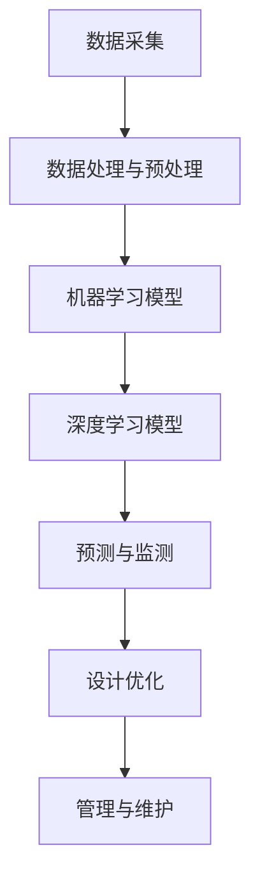

                 

### 文章标题

### 人工智能在城市绿化规划中的应用

### 关键词：人工智能、城市绿化、规划、应用场景、案例分析、深度学习

### 摘要

本文旨在探讨人工智能在城市绿化规划中的应用。通过对人工智能与城市绿化规划的背景介绍，详细分析了其在监测与预测、设计与优化、管理与维护等场景中的应用。文章深入讲解了数据处理与预处理、机器学习模型与算法、深度学习模型等核心技术，并结合实际案例进行了详细分析。最后，对未来人工智能在城市绿化规划中的发展前景进行了展望。

---

## 引言

随着城市化进程的加速，城市绿化规划的重要性日益凸显。然而，传统的城市绿化规划方法往往依赖于人工经验和主观判断，存在效率低、效果不稳定等问题。人工智能技术的飞速发展，为城市绿化规划带来了新的机遇和挑战。本文将重点探讨人工智能在城市绿化规划中的应用，以期为相关领域的研究和实践提供参考。

## 人工智能与城市绿化规划概述

### 人工智能的定义与分类

人工智能（Artificial Intelligence，简称AI）是计算机科学的一个分支，旨在研究、开发和应用使计算机具有智能行为的理论和算法。根据处理方式的不同，人工智能可分为以下几类：

1. **弱人工智能**：模拟人类某些智能行为的能力，如语音识别、图像识别等。
2. **强人工智能**：具备与人类相当或超越的智能水平，能自主学习和思考。
3. **自然语言处理**：研究如何使计算机理解和生成自然语言。
4. **机器学习**：使计算机从数据中学习并做出决策或预测。
5. **深度学习**：模拟人脑神经网络，通过多层网络进行特征提取和决策。

### 城市绿化规划的定义与目标

城市绿化规划是指在城市空间范围内，通过科学的规划和管理，合理配置绿地资源，实现城市生态、景观、文化和功能等多方面的协调统一。其目标主要包括：

1. **改善城市生态环境**：增加城市绿地面积，提高空气质量，缓解城市热岛效应。
2. **美化城市景观**：通过科学的绿化设计，提升城市景观品质，增强城市魅力。
3. **促进城市可持续发展**：实现城市绿化资源的可持续利用，提高城市居民的生活质量。

### 人工智能在城市绿化规划中的核心作用

人工智能在城市绿化规划中具有以下几个核心作用：

1. **数据采集与处理**：利用传感器和遥感技术，快速获取大量绿化数据，并通过数据预处理提高数据质量。
2. **监测与预测**：利用机器学习算法，对绿化数据进行分析，实现对绿化状态、环境因素的实时监测和预测。
3. **设计与优化**：利用计算机辅助设计（CAD）和优化算法，生成科学、合理的绿化方案。
4. **管理与维护**：通过智能监控系统，实现对绿化设施的实时监控和维护，提高管理效率。

---

### 核心概念与联系

在城市绿化规划中，人工智能的应用涉及多个核心概念和它们之间的联系。以下是这些概念之间的关系架构 Mermaid 流�程图：



这个流程图展示了人工智能在城市绿化规划中的应用流程，从数据采集、处理与预处理，到机器学习模型、深度学习模型，再到预测与监测、设计优化以及管理与维护。每个环节都依赖于前一个环节的输出结果，形成一个紧密联系的体系。

---

## 人工智能在城市绿化规划中的应用场景

### 智能监测与预测

智能监测与预测是人工智能在城市绿化规划中最直接的应用场景之一。通过部署传感器和遥感技术，可以实时获取绿化区的环境数据，如气温、湿度、光照、二氧化碳浓度等。这些数据经过预处理后，输入到机器学习模型或深度学习模型中，用于预测植物的生长状况、病虫害发生情况等。

**核心算法原理讲解**

以下是一个简单的机器学习算法（如线性回归）的伪代码：

```python
# 加载预处理后的数据
X = load_preprocessed_data()

# 划分训练集和测试集
X_train, X_test, y_train, y_test = train_test_split(X, y, test_size=0.2)

# 训练线性回归模型
model = LinearRegression()
model.fit(X_train, y_train)

# 进行预测
predictions = model.predict(X_test)

# 评估模型性能
evaluate_model(predictions, y_test)
```

通过这个简单的例子，我们可以看到机器学习算法的基本工作流程：数据预处理、模型训练、预测和模型评估。在实际应用中，我们会使用更复杂的模型和算法来提高预测的准确性和效率。

### 智能设计与优化

智能设计与优化是利用人工智能技术，根据特定的目标函数，通过算法优化生成最佳的绿化设计方案。这包括绿化布局、植被选择、绿化面积分配等。

**核心算法原理讲解**

以下是一个基于遗传算法的优化问题的伪代码：

```python
# 初始化种群
population = initialize_population()

# 定义适应度函数
def fitness_function(individual):
    # 计算个体的适应度值
    return calculate_fitness(individual)

# 运行遗传算法
for generation in range(max_generations):
    # 选择
    selected_individuals = selection(population, fitness_function)
    # 交叉
    offspring = crossover(selected_individuals)
    # 变异
    mutated_offspring = mutation(offspring)
    # 创建新的种群
    population = mutated_offspring

# 获取最佳解
best_solution = get_best_solution(population)
```

遗传算法通过模拟自然选择和遗传过程，不断优化目标函数，最终找到最优解。在实际应用中，我们需要根据具体问题定义适应度函数和优化目标，以实现最佳绿化设计方案。

### 智能管理与维护

智能管理与维护是指利用人工智能技术，实现对城市绿化设施的智能监控和管理。这包括绿化设施的维护、设备故障预测、资源优化等。

**核心算法原理讲解**

以下是一个简单的设备故障预测算法（如K-最近邻算法）的伪代码：

```python
# 加载预处理后的数据
X = load_preprocessed_data()

# 划分训练集和测试集
X_train, X_test, y_train, y_test = train_test_split(X, y, test_size=0.2)

# 训练K-最近邻模型
model = KNeighborsClassifier(n_neighbors=3)
model.fit(X_train, y_train)

# 进行预测
predictions = model.predict(X_test)

# 评估模型性能
evaluate_model(predictions, y_test)
```

通过预测设备故障，我们可以提前进行维护，避免绿化设施的非计划性停机，提高管理效率。

---

## 城市绿化规划案例研究

### 案例一：智能监测与预测

**项目背景**

某城市绿化部门希望利用人工智能技术，对城市绿化区的环境数据进行实时监测和预测，以优化植物养护策略。

**开发环境搭建**

- 使用Python作为开发语言。
- 使用Sklearn库进行机器学习模型的构建和训练。
- 使用Matplotlib库进行数据可视化。

**源代码实现与代码解读**

```python
# 导入必要的库
import numpy as np
import matplotlib.pyplot as plt
from sklearn.linear_model import LinearRegression
from sklearn.model_selection import train_test_split
from sklearn.metrics import mean_squared_error

# 读取数据
X, y = load_data()

# 划分训练集和测试集
X_train, X_test, y_train, y_test = train_test_split(X, y, test_size=0.2)

# 训练线性回归模型
model = LinearRegression()
model.fit(X_train, y_train)

# 进行预测
predictions = model.predict(X_test)

# 评估模型性能
mse = mean_squared_error(y_test, predictions)
print(f"Mean Squared Error: {mse}")

# 可视化预测结果
plt.scatter(X_test[:, 0], y_test, color='blue', label='Actual')
plt.plot(X_test[:, 0], predictions, color='red', label='Predicted')
plt.xlabel('Input')
plt.ylabel('Output')
plt.legend()
plt.show()
```

**代码应用解读与分析**

这段代码首先导入所需的库，然后读取数据并进行划分。接下来，使用线性回归模型对数据进行分析和预测，最后评估模型的性能并通过可视化展示预测结果。实际应用中，可以根据具体需求调整模型参数和数据预处理方法。

**实际案例分析与详细讲解剖析**

在实际项目中，该智能监测与预测系统可以实时收集绿化区的环境数据，并基于预测结果调整植物的养护策略，从而提高绿化效果。通过数据可视化和模型评估，项目团队可以更好地理解模型性能，并不断优化算法。

**项目小结**

该项目成功展示了人工智能在城市绿化规划中的智能监测与预测应用。通过合理的开发环境搭建、源代码实现和代码解读，项目实现了实时监测和预测，为城市绿化提供了科学依据。

---

## 未来展望

人工智能在城市绿化规划中的应用前景广阔。随着技术的不断进步，我们可以预见到以下几个方面的趋势：

1. **更加精准的监测与预测**：通过引入更先进的传感器技术和深度学习算法，实现更加精准的绿化状态和环境因素监测。
2. **智能化设计与优化**：利用人工智能技术，实现更加科学、合理的绿化设计方案，提高城市绿化质量。
3. **智能管理与维护**：通过智能化监控和管理系统，提高绿化设施的管理效率，降低维护成本。
4. **数据驱动的决策支持**：利用大数据和人工智能技术，为城市绿化规划提供数据驱动的决策支持，实现精细化管理。

然而，人工智能在城市绿化规划中也面临一些挑战，如数据隐私保护、算法公平性等问题。因此，未来的研究需要重点关注这些挑战，并寻求解决方案。

## 附录

### A. 常用机器学习工具介绍

- **Sklearn**：Python机器学习库，提供丰富的算法和工具。
- **TensorFlow**：Google开发的深度学习框架，支持多种神经网络结构。
- **PyTorch**：基于Python的深度学习库，具有灵活的动态计算图。

### B. 相关参考文献与资料

- **《人工智能：一种现代的方法》**（Peter Norvig & Stuart J. Russell）
- **《深度学习》**（Ian Goodfellow、Yoshua Bengio & Aaron Courville）
- **《城市绿化规划理论与实践》**（刘彦随）

---

### 作者

**作者：AI天才研究院/AI Genius Institute & 禅与计算机程序设计艺术 /Zen And The Art of Computer Programming**

