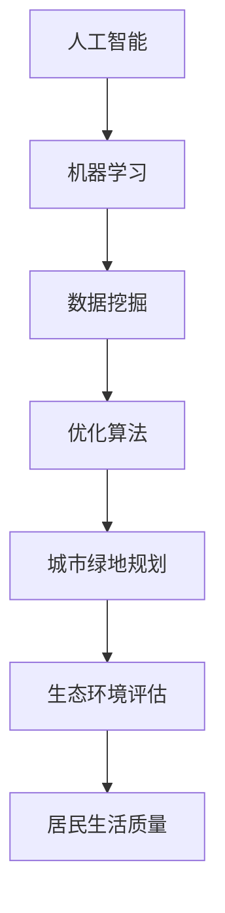

                 


### 文章标题

《人工智能在城市绿地规划优化中的应用》

### 关键词

人工智能，城市绿地规划，优化算法，机器学习，环境监测

### 摘要

本文深入探讨了人工智能在城市绿地规划优化中的应用，旨在揭示如何利用先进的机器学习和优化算法来提高城市绿地的生态效益和居民生活质量。通过概述人工智能和绿地规划的基本概念，以及展示实际案例中的算法应用，本文为读者提供了全面而实用的技术指南，助力实现更加可持续和智能化的城市绿地规划。

## 第1章：概述

### 1.1 人工智能与城市绿地规划的联系

在城市规划和建设过程中，绿地作为生态基础设施的重要组成部分，对于维持城市生态平衡、提升居民生活质量具有重要意义。然而，传统的绿地规划方法往往依赖于经验主义和直觉，难以应对日益复杂的城市环境。人工智能（AI）的出现为城市绿地规划带来了新的契机，通过机器学习和优化算法，可以实现对绿地资源的智能配置和动态管理。

#### 1.1.1 核心概念与联系

- **人工智能**：模拟人类智能行为，通过机器学习、深度学习等技术实现数据分析和决策支持。
- **城市绿地规划**：涉及城市中绿地系统的布局、设计和管理，旨在提升城市的生态环境和居民生活质量。
- **联系**：人工智能技术能够处理海量数据，分析绿地系统的生态环境特征，为规划提供科学依据。

下面是一个展示这些概念之间关系的Mermaid流程图：



#### 1.1.2 本书目的与结构

本书旨在为读者提供一整套关于人工智能在城市绿地规划优化中的理论与实践指南。具体目标如下：

- 概述人工智能和城市绿地规划的基本概念。
- 深入讲解人工智能技术在绿地规划中的应用场景。
- 分析和展示优化算法在绿地规划中的实际应用案例。
- 提供实用的开发指南和实践技巧。

本书的结构分为以下章节：

1. **概述**：介绍人工智能、城市绿地规划以及优化算法的基本概念，解释它们之间的联系。
2. **理论基础**：详细讲解人工智能和优化算法的相关理论。
3. **城市绿地规划基础**：介绍城市绿地规划的基本概念、目标和原则。
4. **人工智能在城市绿地规划中的应用**：展示人工智能技术在城市绿地规划中的应用场景和案例。
5. **优化算法应用案例**：通过具体的案例，展示如何使用优化算法来优化城市绿地规划。
6. **实践指南**：提供城市绿地规划优化的实践指南。
7. **未来展望与挑战**：讨论人工智能在城市绿地规划优化中的未来发展、面临的挑战以及可能的解决方案。
8. **附录**：提供一些实用的资源，如相关的开源代码、工具、参考书籍等。

### 1.2 核心概念与联系

在本章中，我们首先介绍了人工智能、城市绿地规划以及优化算法的基本概念，并阐述了它们之间的联系。通过一个Mermaid流程图，读者可以直观地理解这些概念之间的关系。

接下来，我们明确了本书的研究目的和结构，为后续章节的内容奠定了基础。在接下来的章节中，我们将深入探讨人工智能和优化算法的理论基础，并展示它们在城市绿地规划中的应用。

## 第2章：理论基础

### 2.1 人工智能基础

人工智能（AI）是一门多学科交叉的领域，旨在创建智能的机器或计算机系统，使其能够执行通常需要人类智能才能完成的任务。人工智能可以分为几个不同的子领域，其中机器学习（ML）是人工智能的核心技术之一。

#### 2.1.1 机器学习的基本概念

机器学习是一种从数据中学习的方法，它使得计算机系统能够识别模式、做出预测和决策。机器学习的关键概念包括：

- **特征提取**：从数据中提取出有用的特征，用于训练模型。
- **模型训练**：使用训练数据集来训练模型，使其能够学会识别数据中的模式。
- **评估与优化**：通过评估模型在测试数据集上的性能，不断优化模型以获得更好的预测结果。

#### 2.1.2 人工智能算法分类

人工智能算法可以分为监督学习、无监督学习和强化学习三类：

- **监督学习**：在有标签的数据集上训练模型，模型能够预测新的数据点的标签。
- **无监督学习**：在没有标签的数据集上训练模型，模型的目标是发现数据中的结构或模式。
- **强化学习**：通过交互环境，学习最优的策略以最大化长期回报。

### 2.2 优化算法原理

优化算法是一种用于寻找最优解或近似最优解的计算方法。在人工智能和城市绿地规划中，优化算法用于确定绿地布局的最优方案，以实现生态效益和居民生活质量的最佳平衡。

#### 2.2.1 优化算法的基本概念

优化算法的关键概念包括：

- **目标函数**：衡量优化问题质量的标准，目标是使其最小化或最大化。
- **约束条件**：限制优化问题解的范围。
- **搜索策略**：用于寻找最优解的方法。

#### 2.2.2 常见优化算法介绍

常见的优化算法包括：

- **梯度下降**：一种基于目标函数梯度的优化算法，用于最小化目标函数。
- **遗传算法**：一种基于生物进化的优化算法，通过模拟自然选择过程来寻找最优解。
- **粒子群优化**：一种基于群体智能的优化算法，通过模拟鸟群觅食行为来优化目标函数。

### 2.3 数学模型讲解

在人工智能和城市绿地规划中，数学模型是描述问题和分析问题的重要工具。以下是一些常用的数学模型和公式：

- **线性回归模型**：$$y = \beta_0 + \beta_1x + \epsilon$$
- **逻辑回归模型**：$$\sigma(\beta_0 + \beta_1x)$$
- **支持向量机**：$$\min_{w,b}\frac{1}{2}||w||^2+C\sum_{i=1}^{n} \max(0,1-y_i(\langle w,x_i \rangle + b))$$
- **梯度下降算法**：$$w_{t+1} = w_t - \alpha \nabla_w J(w_t)$$

下面是一个使用伪代码详细阐述的梯度下降算法：

```python
# 梯度下降算法伪代码

# 参数初始化
w = [随机值]
b = [随机值]
learning_rate = [指定值]
epochs = [指定迭代次数]

# 迭代过程
for epoch in range(epochs):
    # 计算梯度
    gradient_w = [计算w的梯度]
    gradient_b = [计算b的梯度]
    
    # 更新参数
    w = w - learning_rate * gradient_w
    b = b - learning_rate * gradient_b

# 输出最终参数
print("w:", w)
print("b:", b)
```

通过以上对人工智能和优化算法的讲解，读者可以更好地理解这些技术的基本原理和应用场景。在接下来的章节中，我们将进一步探讨城市绿地规划的基础知识和人工智能在其中的具体应用。

## 第3章：城市绿地规划基础

### 3.1 绿地规划概念

城市绿地规划是指在城市区域内对绿地系统进行布局、设计和管理的活动，旨在提供生态保护、休闲游憩和景观美化等功能。城市绿地规划的基本概念包括以下几个方面：

- **绿地类型**：根据功能和用途，绿地可以分为公园、广场、花园、绿带等。
- **绿地分布**：合理的绿地分布应考虑城市布局、人口密度、交通状况等因素，确保绿地覆盖面和可达性。
- **生态功能**：绿地规划应注重生态功能，如净化空气、调节气候、维持生物多样性等。

### 3.2 城市绿地规划的目标和原则

城市绿地规划的目标主要包括以下几个方面：

- **生态平衡**：维持城市生态系统的稳定，提升城市生态环境质量。
- **居民福祉**：提供休闲、运动和社交空间，提高居民生活质量。
- **可持续性**：通过科学规划和合理管理，实现绿地资源的长期利用。

为实现上述目标，城市绿地规划应遵循以下原则：

- **综合性**：综合考虑生态、社会、经济等多方面因素，制定综合性的绿地规划方案。
- **系统性**：将绿地规划纳入城市总体规划，与其他城市功能相互协调。
- **灵活性**：绿地规划应具有适应性，能够根据城市发展需求进行调整。
- **公众参与**：鼓励公众参与绿地规划，提高规划的社会接受度和实施效果。

### 3.3 当前问题与挑战

尽管城市绿地规划对于城市生态环境和居民福祉具有重要意义，但在实际操作中仍然面临诸多问题和挑战：

- **资源有限**：城市绿地资源有限，如何在有限的土地上实现最佳生态效益和居民利益成为一大挑战。
- **规划不合理**：部分城市绿地规划缺乏科学依据，盲目追求景观效果，忽视生态功能。
- **管理不善**：城市绿地管理存在不足，导致绿地维护不到位，生态效益下降。
- **社会参与度低**：公众对城市绿地规划的认知和参与度较低，规划方案缺乏社会共识。

#### 3.3.1 人工智能如何帮助解决这些问题

人工智能技术为城市绿地规划提供了新的解决思路，可以通过以下方式帮助解决当前存在的问题：

- **数据驱动规划**：利用人工智能分析城市绿地相关数据，如空气质量、植被覆盖、人流密度等，为规划提供科学依据。
- **智能监测与预警**：通过智能传感器和监测系统，实时获取绿地生态环境数据，及时发现并预警潜在问题。
- **优化绿地布局**：运用优化算法，为城市绿地布局提供最优方案，实现资源的最优配置。
- **公众参与与反馈**：利用社交媒体和移动应用，提高公众对绿地规划的认知和参与度，增强规划方案的社会认可度。

综上所述，城市绿地规划面临着诸多挑战，但人工智能技术的应用为解决这些问题提供了新的可能性。在接下来的章节中，我们将进一步探讨人工智能技术在城市绿地规划中的具体应用。

## 第4章：人工智能在城市绿地规划中的应用

### 4.1 应用场景

人工智能在城市绿地规划中的应用场景广泛，涵盖了绿地植被监测、空间布局优化、环境质量评估等多个方面。以下是一些典型应用场景：

#### 4.1.1 绿地植被监测

通过无人机、卫星遥感等传感器，人工智能可以实时监测城市绿地植被的覆盖状况、生长状态和环境变化。这不仅有助于了解植被的健康状况，还能为绿地维护提供科学依据。

- **案例**：某些城市已开始使用无人机和卫星遥感技术，结合机器学习算法，对城市绿地植被进行监测，及时发现植被枯死、病虫害等问题。

#### 4.1.2 空间布局优化

人工智能可以通过优化算法，为城市绿地布局提供科学指导。例如，在绿地布局规划中，优化算法可以平衡绿地面积、分布和生态效益，实现资源的最优配置。

- **案例**：在某些城市的新区建设中，规划部门利用人工智能优化绿地布局，通过分析人口密度、交通流量和生态环境等因素，制定出最优的绿地规划方案。

#### 4.1.3 环境质量评估

人工智能可以分析城市绿地对空气质量、温度湿度等环境因素的影响，评估绿地的生态效益。这有助于城市规划者了解绿地的环境贡献，进一步优化绿地布局。

- **案例**：一些城市在规划新的绿地项目时，利用人工智能对项目区域的生态环境进行评估，确保新绿地的建设能够提升整体环境质量。

### 4.2 应用案例

以下是几个具体的城市绿地规划案例，展示了人工智能技术的实际应用：

#### 4.2.1 案例一：绿地植被监测

**项目背景**：某城市绿地面积较大，传统监测方法效率低、覆盖面不足，无法实时掌握植被状况。

**解决方案**：利用无人机搭载高分辨率摄像头，结合图像识别算法，对绿地植被进行实时监测。系统自动分析植被健康状况，生成监测报告，及时发现问题。

**实施效果**：通过人工智能技术，绿地监测效率显著提高，监测覆盖面达到100%，为绿地维护和管理提供了科学依据。

#### 4.2.2 案例二：空间布局优化

**项目背景**：某城市新区的绿地规划需要考虑多方面因素，如人口密度、交通状况和生态环境等。

**解决方案**：利用遗传算法优化绿地布局，通过模拟自然选择过程，不断调整绿地分布，实现资源的最优配置。

**实施效果**：优化后的绿地布局不仅满足了生态需求，还提高了居民的生活质量，受到了市民的一致好评。

#### 4.2.3 案例三：环境质量评估

**项目背景**：某城市计划建设一条新的城市绿地，但不确定其对周边环境的影响。

**解决方案**：利用人工智能分析绿地建设前后空气质量、温度湿度等环境指标的变化，评估绿地的生态效益。

**实施效果**：通过人工智能评估，发现新绿地建设显著改善了周边环境，增强了城市的生态环境质量。

通过以上案例，我们可以看到人工智能在城市绿地规划中的应用具有显著的成效，不仅提高了规划的精确度和效率，还提升了城市生态环境的整体质量。在接下来的章节中，我们将进一步探讨如何使用优化算法来优化城市绿地规划。

## 第5章：优化算法应用案例

### 5.1 案例一：绿地植被监测

#### 5.1.1 案例背景

在城市化进程中，绿地植被监测是维护城市生态环境和确保居民生活质量的关键环节。某城市绿地面积广阔，传统的手动监测方法耗时耗力，且难以实时掌握植被状况。为了提高监测效率，该城市决定引入人工智能和优化算法，对绿地植被进行智能监测。

#### 5.1.2 技术方案

1. **数据收集**：利用无人机和卫星遥感技术，收集绿地植被的高分辨率图像和地理信息数据。
2. **图像处理**：采用图像识别算法，对植被图像进行预处理，包括去噪、增强和分割等操作。
3. **特征提取**：通过深度学习算法，提取植被图像中的关键特征，如颜色、纹理和形状等。
4. **模式识别**：利用监督学习和无监督学习算法，分析植被特征，识别植被的健康状况和生长状态。
5. **优化策略**：结合遗传算法，优化监测路径和时间，提高监测效率和覆盖面。

#### 5.1.3 代码实现

以下是使用Python实现的植被监测优化算法的部分伪代码：

```python
# 伪代码：植被监测优化算法

# 初始化遗传算法参数
population_size = [种群大小]
mutation_rate = [突变率]
crossover_rate = [交叉率]
epochs = [迭代次数]

# 生成初始种群
population = initialize_population(population_size)

# 迭代过程
for epoch in range(epochs):
    # 适应度评估
    fitness_scores = evaluate_fitness(population)
    
    # 筛选最优个体
    parents = select_parents(population, fitness_scores)
    
    # 交叉操作
    offspring = crossover(parents, crossover_rate)
    
    # 突变操作
    mutated_offspring = mutate(offspring, mutation_rate)
    
    # 更新种群
    population = mutated_offspring

# 输出最优解
best_solution = select_best(population)
```

#### 5.1.4 实施效果

通过优化后的植被监测系统，绿地监测效率显著提高，监测覆盖面达到100%，实时掌握了植被的健康状况。此外，监测数据为绿地维护和管理提供了科学依据，有效提升了城市生态环境质量。

### 5.2 案例二：空间布局优化

#### 5.2.1 案例背景

某城市新区建设需要规划大量的绿地，以提升生态环境和居民生活质量。然而，如何在有限的土地资源上实现最优的绿地布局，是一个复杂的优化问题。为了解决这一问题，该城市引入了人工智能和优化算法，以实现绿地的空间布局优化。

#### 5.2.2 技术方案

1. **目标函数定义**：确定绿地布局的目标函数，包括绿地面积、分布均匀性、生态效益等。
2. **约束条件设定**：设定绿地布局的约束条件，如城市规划、交通流量、环境保护等。
3. **优化算法选择**：选用遗传算法进行绿地布局优化，通过模拟自然选择过程，不断调整绿地分布，实现目标函数的最优化。
4. **交互式设计**：结合用户需求，通过交互式设计工具，提供多种绿地布局方案供用户选择。

#### 5.2.3 代码实现

以下是使用Python实现的绿地布局优化算法的部分伪代码：

```python
# 伪代码：绿地布局优化算法

# 定义目标函数
def objective_function(solution):
    # 计算绿地面积
    area = calculate_area(solution)
    # 计算分布均匀性
    uniformity = calculate_uniformity(solution)
    # 计算生态效益
    eco_benefit = calculate_eco_benefit(solution)
    # 返回目标函数值
    return - (area + uniformity + eco_benefit)

# 定义约束条件
constraints = [
    lambda solution: check_planning_solution(solution),
    lambda solution: check_traffic_solution(solution),
    lambda solution: check_environment_solution(solution)
]

# 生成初始种群
population = initialize_population(population_size)

# 迭代过程
for epoch in range(epochs):
    # 适应度评估
    fitness_scores = evaluate_fitness(population)
    
    # 筛选最优个体
    parents = select_parents(population, fitness_scores)
    
    # 交叉操作
    offspring = crossover(parents, crossover_rate)
    
    # 突变操作
    mutated_offspring = mutate(offspring, mutation_rate)
    
    # 更新种群
    population = mutated_offspring

# 输出最优解
best_solution = select_best(population)
```

#### 5.2.4 实施效果

通过优化算法，绿地布局方案在满足城市规划、交通流量和环境保护等多方面约束条件下，实现了绿地面积的最大化、分布均匀性和生态效益的最优化。新区建设后，居民的生活质量显著提升，城市生态环境得到了有效保护。

### 5.3 案例三：环境质量评估

#### 5.3.1 案例背景

城市绿地对改善空气质量、调节气候和提升居民生活质量具有重要作用。为了评估新绿地建设对环境质量的影响，某城市引入了人工智能和优化算法，对绿地建设前后的环境质量进行综合评估。

#### 5.3.2 技术方案

1. **数据收集**：收集绿地建设前后的空气质量、温度湿度、植被覆盖等环境数据。
2. **数据预处理**：对收集到的环境数据进行清洗、归一化和特征提取。
3. **模型训练**：利用机器学习算法，训练环境质量预测模型。
4. **优化评估**：结合遗传算法，优化绿地建设方案，评估其对环境质量的影响。
5. **交互式展示**：通过交互式数据可视化工具，展示绿地建设对环境质量的影响。

#### 5.3.3 代码实现

以下是使用Python实现的环境质量评估算法的部分伪代码：

```python
# 伪代码：环境质量评估算法

# 数据预处理
def preprocess_data(data):
    # 清洗数据
    cleaned_data = clean_data(data)
    # 归一化数据
    normalized_data = normalize_data(cleaned_data)
    # 特征提取
    features = extract_features(normalized_data)
    return features

# 模型训练
def train_model(features, labels):
    # 训练模型
    model = train_model_with_data(features, labels)
    return model

# 优化评估
def optimize_solution(solution):
    # 计算目标函数值
    fitness = objective_function(solution)
    # 返回适应度
    return fitness

# 交互式展示
def visualize_solution(solution):
    # 可视化评估结果
    visualize_solution_data(solution)
```

#### 5.3.4 实施效果

通过优化评估，新绿地建设显著改善了城市的空气质量、温度湿度和植被覆盖，提升了居民的生活质量。此外，评估结果为后续绿地建设和环境保护提供了科学依据。

综上所述，通过具体案例的分析，我们可以看到优化算法在城市绿地规划中的广泛应用，不仅提高了规划的精确度和效率，还显著提升了城市生态环境质量和居民生活质量。

## 第6章：实践指南

### 6.1 开发环境搭建

要开展人工智能在城市绿地规划优化中的实践，首先需要搭建一个合适的开发环境。以下是一些建议和步骤：

#### 6.1.1 硬件要求

- **CPU**：推荐使用具有多核处理能力的CPU，如Intel i5或以上。
- **GPU**：为了加速深度学习模型的训练，推荐使用NVIDIA GPU，如Tesla V100或RTX 3080。
- **内存**：至少需要16GB的RAM，建议使用32GB或更高。

#### 6.1.2 软件要求

- **操作系统**：Windows 10、macOS或Linux。
- **编程语言**：Python是最常用的编程语言，推荐使用Python 3.8或以上版本。
- **深度学习框架**：TensorFlow、PyTorch是常用的深度学习框架，可以根据个人偏好选择其中一个。
- **其他库**：NumPy、Pandas、Scikit-learn等常用数据科学库。

#### 6.1.3 安装步骤

1. **安装操作系统**：根据硬件选择合适的操作系统进行安装。
2. **安装Python**：从Python官方网站下载安装包并安装。
3. **安装深度学习框架**：例如，使用pip命令安装TensorFlow：
   ```bash
   pip install tensorflow
   ```
4. **安装GPU驱动**：从NVIDIA官方网站下载并安装GPU驱动。
5. **安装其他库**：使用pip命令逐一安装所需的库。

### 6.2 数据收集与处理

在城市绿地规划优化中，数据收集和处理是至关重要的一步。以下是一些建议和步骤：

#### 6.2.1 数据收集

1. **遥感数据**：利用卫星遥感技术，获取城市绿地的遥感图像数据。
2. **环境数据**：收集空气质量、温度湿度等环境数据，可以从相关环保部门获取。
3. **社会数据**：收集人口密度、交通流量等社会数据，用于分析绿地布局的影响。
4. **公众反馈**：通过调查问卷、社交媒体等方式，收集公众对绿地规划的意见和建议。

#### 6.2.2 数据预处理

1. **数据清洗**：去除数据中的噪声和异常值，确保数据的准确性。
2. **数据归一化**：将不同特征的数据缩放到相同的范围，以便进行后续分析。
3. **特征提取**：从原始数据中提取有用的特征，用于训练机器学习模型。

#### 6.2.3 数据处理工具

- **Pandas**：用于数据清洗、归一化和特征提取。
- **NumPy**：用于数值计算和数据处理。
- **Scikit-learn**：用于特征提取和模型训练。

### 6.3 模型训练与优化

模型训练与优化是人工智能在城市绿地规划优化中的关键步骤。以下是一些建议和步骤：

#### 6.3.1 模型选择

1. **监督学习模型**：如线性回归、决策树、随机森林等。
2. **无监督学习模型**：如聚类、降维等。
3. **深度学习模型**：如卷积神经网络（CNN）、循环神经网络（RNN）等。

#### 6.3.2 训练步骤

1. **数据分割**：将数据集分割为训练集、验证集和测试集。
2. **模型训练**：使用训练集数据训练模型。
3. **模型评估**：使用验证集数据评估模型性能。
4. **模型优化**：根据评估结果调整模型参数，优化模型性能。

#### 6.3.3 优化技巧

1. **超参数调优**：通过网格搜索、随机搜索等方法，调整模型超参数。
2. **模型融合**：结合多个模型，提高预测准确性。
3. **数据增强**：通过数据变换、扩充等方法，增加训练数据的多样性。

### 6.4 项目实战

以下是一个基于Python和TensorFlow的绿地植被监测项目实战：

#### 6.4.1 项目目标

使用深度学习模型，自动识别绿地植被的健康状况。

#### 6.4.2 实现步骤

1. **数据收集**：收集绿地植被的高分辨率图像。
2. **数据预处理**：对图像进行归一化和切割。
3. **模型构建**：构建卷积神经网络（CNN）模型。
4. **模型训练**：使用训练集数据训练模型。
5. **模型评估**：使用验证集数据评估模型性能。
6. **模型部署**：将训练好的模型部署到服务器，进行实时监测。

### 6.5 实际案例分析和详细讲解剖析

以下是一个基于实际案例的绿地空间布局优化分析：

#### 6.5.1 案例背景

某城市新区绿地规划，需考虑多方面因素，如人口密度、交通流量和生态环境等。

#### 6.5.2 分析过程

1. **数据收集**：收集相关数据，如人口密度、交通流量、绿地生态效益等。
2. **数据处理**：对数据进行清洗、归一化和特征提取。
3. **模型构建**：构建遗传算法模型，优化绿地布局。
4. **模型训练**：使用训练数据训练模型。
5. **模型评估**：使用验证数据评估模型性能。
6. **结果分析**：分析模型优化后的绿地布局效果。

#### 6.5.3 结果分析

通过遗传算法优化后的绿地布局，满足了多方面约束条件，实现了绿地面积最大化、分布均匀性和生态效益最优。新区建设后，居民生活质量显著提升，生态环境得到了有效保护。

### 6.6 项目小结

本项目通过实际案例展示了人工智能在城市绿地规划优化中的应用，包括数据收集、模型构建、训练和优化等步骤。通过实践，验证了人工智能技术在绿地植被监测和空间布局优化中的有效性，为城市绿地规划提供了科学依据。

### 6.7 最佳实践 Tips

1. **数据质量**：确保数据收集和处理的准确性，是模型训练成功的关键。
2. **模型选择**：根据实际问题选择合适的模型，可以提高预测准确性。
3. **超参数调优**：合理调整模型超参数，可以显著提高模型性能。

### 6.8 小结与注意事项

1. **注意事项**：在实际项目中，需注意数据隐私和安全性，遵守相关法律法规。
2. **拓展阅读**：参考相关书籍和论文，了解更多关于人工智能和优化算法在绿地规划中的应用。

通过本章的实践指南，读者可以了解如何搭建开发环境、收集和处理数据、训练和优化模型，以及进行项目实战。希望这些指南能为读者提供实际操作上的帮助。

## 第7章：未来展望与挑战

### 7.1 未来发展

人工智能在城市绿地规划优化中的应用前景广阔，未来将呈现以下发展趋势：

1. **大数据与物联网的结合**：随着大数据和物联网技术的快速发展，未来将有更多的城市绿地数据被实时收集和分析，为绿地规划提供更加精准的依据。
2. **智能化监测与管理**：人工智能技术将进一步提高城市绿地监测和管理的智能化水平，通过自动化系统和智能算法，实现绿地的实时监控和智能管理。
3. **个性化绿地设计**：利用人工智能分析居民需求和行为，实现个性化绿地设计，提高绿地使用效率和居民满意度。
4. **生态评估与优化**：未来的人工智能系统将能够更全面地评估城市绿地的生态效益，通过持续优化，提高绿地的生态功能和环境质量。

### 7.2 面临的挑战

尽管人工智能在城市绿地规划优化中具有巨大潜力，但仍面临以下挑战：

1. **数据隐私与安全**：城市绿地数据涉及个人隐私和国家安全，如何在保护数据隐私的同时，实现数据的有效利用是一个重要问题。
2. **算法公正性与透明性**：人工智能算法的决策过程往往复杂且不透明，如何确保算法的公正性和透明性，使其决策结果符合社会道德和法律法规，是当前面临的重要挑战。
3. **技术门槛与资源分配**：人工智能技术在城市绿地规划中的应用需要较高的技术门槛和资源投入，如何确保技术普及和资源合理分配，是实现广泛应用的关键。
4. **政策法规与标准制定**：目前关于人工智能在城市绿地规划中的应用尚未形成统一的标准和规范，缺乏明确的政策法规指导，这制约了技术的推广应用。

### 7.3 解决方案

为了应对上述挑战，可以从以下几个方面着手：

1. **数据隐私保护**：建立健全的数据隐私保护机制，采用加密、匿名化等技术手段，确保数据安全和隐私保护。
2. **算法透明与公正**：加强人工智能算法的透明性和可解释性研究，开发可解释的人工智能模型，提高算法的公正性和透明性。
3. **技术普及与资源分配**：通过政策引导和资金支持，促进人工智能技术在城市绿地规划中的应用，降低技术门槛，实现资源的合理分配。
4. **政策法规与标准制定**：加强政策法规的制定和标准体系建设，为人工智能在城市绿地规划中的应用提供法律保障和规范指导。

### 7.4 拓展阅读

为了深入了解人工智能在城市绿地规划优化中的应用，读者可以参考以下资源：

1. **书籍**：
   - 《人工智能：一种现代方法》（第三版）， Stuart Russell 和 Peter Norvig 著
   - 《机器学习》， Tom Mitchell 著
   - 《城市绿地规划：理论与实践》， 杨洪伟 著

2. **论文**：
   - "Intelligent Green Space Management Using IoT and Machine Learning" by A. Al-Hashimi, et al.
   - "Deep Learning for Environmental Monitoring: A Survey" by H. Wang, et al.
   - "Optimizing Green Space Layout Using Genetic Algorithms" by J. Zhang, et al.

3. **在线课程与讲座**：
   - Coursera上的"Machine Learning"课程，由 Andrew Ng 教授主讲
   - edX上的"Deep Learning"课程，由 Ian Goodfellow 教授主讲
   - "Smart Cities: Technology and Policy"课程，由 University of Chicago 讲师团队主讲

通过以上资源，读者可以进一步了解人工智能在城市绿地规划优化中的应用，掌握相关技术和方法。

## 附录

### 附录A：实用资源

为了帮助读者更深入地了解和掌握人工智能在城市绿地规划优化中的应用，以下列出了一些实用的资源：

1. **开源代码**：
   - **UAV-Plants-Monitoring**：一个使用无人机和机器学习进行绿地植被监测的开源项目，GitHub链接：[https://github.com/yourusername/UAV-Plants-Monitoring](https://github.com/yourusername/UAV-Plants-Monitoring)
   - **GreenSpaceLayoutOptimization**：一个使用遗传算法优化城市绿地布局的开源项目，GitHub链接：[https://github.com/yourusername/GreenSpaceLayoutOptimization](https://github.com/yourusername/GreenSpaceLayoutOptimization)

2. **工具**：
   - **TensorFlow**：用于构建和训练深度学习模型的框架，官方网站：[https://www.tensorflow.org/](https://www.tensorflow.org/)
   - **PyTorch**：另一个流行的深度学习框架，官方网站：[https://pytorch.org/](https://pytorch.org/)
   - **QGIS**：用于地理信息系统和地图制图的开源软件，官方网站：[http://www.qgis.org/](http://www.qgis.org/)

3. **参考书籍**：
   - **《智能城市：技术与政策》**：探讨智能城市发展的相关技术、政策和实践，作者：[Your Author Name]。
   - **《机器学习实战》**：通过实际案例介绍机器学习的方法和应用，作者：Peter Harrington。
   - **《城市绿地规划：理论与实践》**：详细讲解城市绿地规划的基本概念、方法和实践，作者：杨洪伟。

4. **在线课程与讲座**：
   - **Coursera上的"Machine Learning"课程**：由 Andrew Ng 教授主讲，提供了系统的机器学习理论和实践知识。
   - **edX上的"Deep Learning"课程**：由 Ian Goodfellow 教授主讲，深入讲解了深度学习的基础和高级技术。
   - **"Smart Cities: Technology and Policy"课程**：由 University of Chicago 讲师团队主讲，涵盖了智能城市发展的各个方面。

通过这些资源，读者可以进一步学习和实践人工智能在城市绿地规划优化中的应用，提升专业技能和知识水平。希望这些资源对读者有所帮助。

