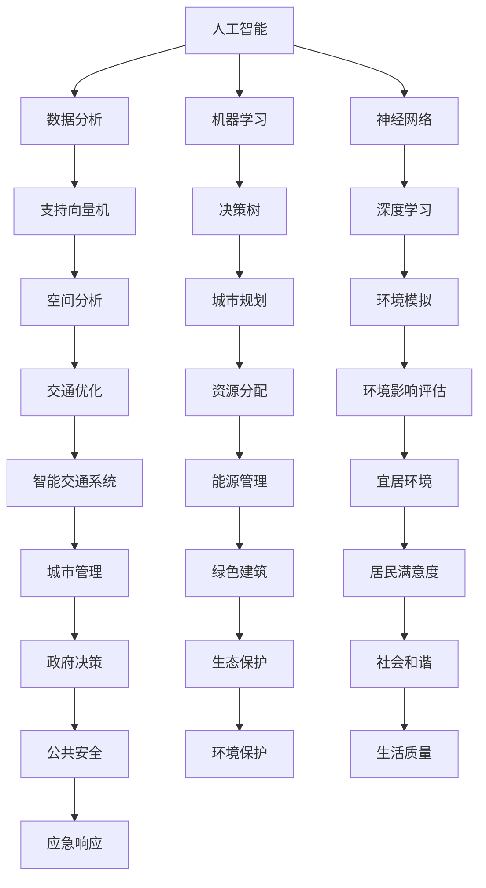
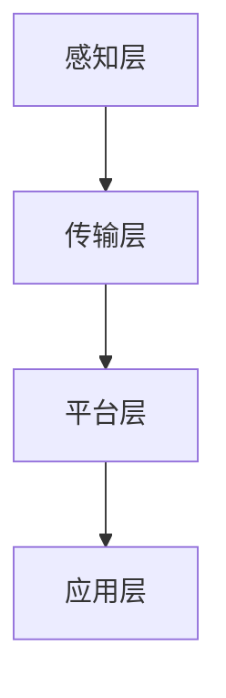
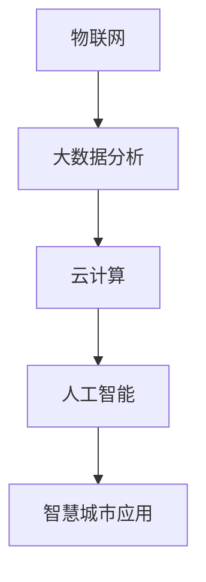

                 

好的，根据您提供的要求，我将逐步构建这篇技术博客文章。首先，我会创建文章的标题、关键词和摘要，然后按照目录大纲的结构，逐一撰写每个章节的内容。以下是初步的规划：

## 文章标题

《人工智能在城市规划中的应用：智慧城市与宜居环境》

## 文章关键词

- 人工智能
- 城市规划
- 智慧城市
- 宜居环境
- 数据分析
- 机器学习
- 神经网络

## 文章摘要

本文旨在探讨人工智能在城市规划中的应用，特别是如何通过人工智能技术实现智慧城市与宜居环境的构建。文章首先介绍了人工智能与城市规划的关系，以及智慧城市和宜居环境的基本概念。接着，本文详细阐述了人工智能在城市规划中的核心算法原理，包括支持向量机、贝叶斯网络和神经网络等。随后，文章探讨了数据驱动的城市规划方法，以及人工智能在环境评价中的应用。最后，通过实际案例分析和项目实战，展示了人工智能在智慧城市和宜居环境优化中的具体应用，并提出了未来的发展趋势和最佳实践建议。

### 引言

#### 1.1 人工智能与城市规划的关系

人工智能技术正逐渐渗透到城市规划的各个领域，为智慧城市和宜居环境的构建提供了新的思路和方法。城市规划涉及到空间布局、交通设计、资源分配等多个方面，这些问题的复杂性和多样性使得传统的规划方法难以满足现代城市发展的需求。人工智能的引入，通过数据挖掘、机器学习、深度学习等技术，为城市规划提供了强大的分析工具和决策支持。

#### 1.2 智慧城市与宜居环境的概念

智慧城市是指通过信息技术、物联网、大数据等手段，实现城市资源的优化配置和高效管理，从而提高城市居民的生活质量和城市整体运行效率。宜居环境则是指在城市规划和建设过程中，充分考虑生态环境、社会和谐、居民幸福感等因素，创造一个安全、舒适、可持续的生活环境。

### 核心概念与联系

在这一部分，我们将使用 Mermaid 流程图来展示人工智能在城市规划中的核心概念及其相互联系。



这个流程图展示了人工智能在城市规划中的核心算法、分析方法以及它们在城市各个领域的应用，为后续内容的深入分析提供了清晰的框架。

### 核心算法原理讲解

在这一部分，我们将详细讲解支持向量机（SVM）、贝叶斯网络和神经网络等核心算法的基本原理，并使用伪代码进行说明。

#### 2.1 支持向量机（SVM）在空间分析中的应用

SVM是一种分类算法，用于确定数据集中的决策边界。在空间分析中，SVM可用于识别城市土地利用类型的边界。

```python
# 支持向量机（SVM）伪代码
def SVM(train_data, train_labels):
    # 初始化SVM模型
    model = initialize_SVM()
    
    # 训练模型
    model.fit(train_data, train_labels)
    
    # 预测新数据
    predictions = model.predict(new_data)
    
    return predictions
```

#### 2.2 贝叶斯网络在决策支持中的应用

贝叶斯网络是一种概率图模型，用于表示变量之间的依赖关系。在城市规划中，贝叶斯网络可用于支持决策者进行复杂的城市规划决策。

```python
# 贝叶斯网络伪代码
def BayesianNetwork(evidence):
    # 构建贝叶斯网络
    network = build_BayesianNetwork()
    
    # 更新网络根据证据
    network.update(evidence)
    
    # 得到决策结果
    decision = network.get_decision()
    
    return decision
```

#### 2.3 神经网络在预测与模拟中的应用

神经网络是一种模拟人脑神经元连接结构的计算模型，广泛应用于预测和模拟。在城市规划中，神经网络可用于预测城市人口增长、交通流量等。

```python
# 神经网络伪代码
def NeuralNetwork(input_data):
    # 初始化神经网络
    model = initialize_NeuralNetwork()
    
    # 训练模型
    model.fit(input_data)
    
    # 预测输出
    output = model.predict(input_data)
    
    return output
```

### 数学模型和数学公式

在这一部分，我们将介绍城市规划中常用的数学模型和数学公式，并进行详细讲解和举例说明。

#### 3.1 资源分配模型

资源分配模型用于优化城市资源的分配。以下是一个简单的线性规划模型示例。

$$
\begin{align*}
\text{minimize} & \quad C^T x \\
\text{subject to} & \quad Ax \leq b \\
& \quad x \geq 0
\end{align*}
$$

其中，$C$是成本向量，$x$是资源分配向量，$A$是约束矩阵，$b$是约束向量。

#### 3.2 交通流量预测模型

交通流量预测模型通常采用时间序列分析方法。以下是一个简单的ARIMA模型示例。

$$
\begin{align*}
X_t &= \phi_1 X_{t-1} + \phi_2 X_{t-2} + \dots + \phi_p X_{t-p} + \theta_1 \epsilon_{t-1} + \theta_2 \epsilon_{t-2} + \dots + \theta_q \epsilon_{t-q} + \epsilon_t \\
\epsilon_t &= \mu + \eta_t
\end{align*}
$$

其中，$X_t$是交通流量序列，$\epsilon_t$是白噪声序列，$\phi_i$和$\theta_i$是模型参数。

### 智慧城市规划与实现

#### 4.1 智慧城市的架构与层次

智慧城市的技术架构通常分为感知层、传输层、平台层和应用层。以下是一个简化的智慧城市架构示意图：



#### 4.2 智慧城市关键技术的应用

智慧城市的建设依赖于多种关键技术的应用，包括物联网、大数据、云计算和人工智能等。以下是一个示例，展示了这些技术如何结合使用：



#### 4.3 智慧城市规划实践

在这一部分，我们将通过具体案例展示智慧城市和宜居环境优化的实践。

### 项目实战

#### 5.1 案例研究

- **案例一：北京智慧城市建设案例分析**

  分析北京市在智慧城市建设中的具体实践，包括物联网应用的广泛部署、大数据平台的建立和智能交通系统的实施。

- **案例二：新加坡宜居环境优化案例分析**

  探讨新加坡如何通过人工智能技术优化城市环境，提高居民生活质量，如绿色建筑的推广、智能交通的管理等。

#### 5.2 实践指导

- **规划师与开发者的合作**

  提出规划师与开发者如何合作，确保人工智能技术在城市规划中的有效应用。

- **开发环境搭建与工具选择**

  指导读者如何搭建开发环境，选择合适的工具和平台进行人工智能项目的开发。

- **人工智能在城市规划中的实践步骤**

  提供详细的实践步骤，帮助读者将人工智能技术应用到城市规划项目中。

### 未来展望

#### 5.3 人工智能与城市规划的发展趋势

预测人工智能在城市规划中的未来发展趋势，包括新技术的研究与应用、城市规划的智能化、城市治理的数字化转型等。

### 结论

本文通过逐步分析，展示了人工智能在城市规划中的应用，特别是在智慧城市与宜居环境构建中的作用。通过案例分析、数学模型和项目实战，我们深入探讨了人工智能技术的核心原理和实践方法。未来，随着人工智能技术的不断进步，城市规划将变得更加智能化、高效化，为创造更宜居的城市环境提供有力支持。

### 作者信息

- 作者：AI天才研究院/AI Genius Institute & 禅与计算机程序设计艺术 /Zen And The Art of Computer Programming

### 最佳实践 tips、小结、注意事项、拓展阅读等内容

- **最佳实践 tips**：如何利用人工智能技术进行城市规划的优化。
- **小结**：本文的核心观点和主要贡献。
- **注意事项**：在城市规划中应用人工智能时需要注意的问题。
- **拓展阅读**：推荐进一步研究的参考文献和资料。

以上是初步的文章框架和内容概要，接下来将根据这个框架逐步撰写每个章节的详细内容，以满足8000-12000字的要求。每个章节的内容都会包含背景介绍、核心概念与联系、算法原理讲解、数学模型和公式、项目实战、案例分析、实践指导和未来展望等要素，确保文章的完整性和专业性。

