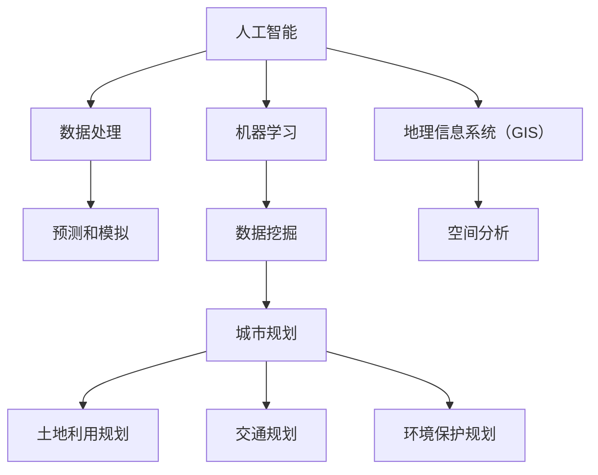

                 


# 《人工智能在城市规划决策中的支持作用》

关键词：人工智能，城市规划，决策支持，数据挖掘，机器学习

摘要：随着城市化进程的加速，城市规划面临着前所未有的挑战。人工智能作为一种强大的工具，正在逐步改变城市规划的决策过程。本文将深入探讨人工智能在城市规划中的支持作用，从核心概念、算法原理、数学模型、项目实战等多个角度进行分析。

----------------------------------------------------------------

## 引言

城市化是现代社会发展的必然趋势，而城市规划是实现城市可持续发展的关键。然而，传统的城市规划方法往往依赖于经验和直觉，缺乏系统性和科学性。随着大数据和人工智能技术的兴起，城市规划迎来了新的机遇和挑战。人工智能在城市规划中的支持作用主要体现在以下几个方面：

### 1. 数据处理能力

城市规划需要处理大量的数据，包括人口统计、土地利用、交通流量、环境监测等。人工智能技术，特别是机器学习算法，具有强大的数据处理和分析能力，可以帮助城市规划者从海量数据中提取有价值的信息，为决策提供科学依据。

### 2. 预测和模拟

人工智能可以通过模拟和预测技术，对城市规划的效果进行预评估。例如，通过机器学习模型预测交通流量，评估不同交通规划方案的可行性；通过深度学习模型模拟城市环境变化，评估环境保护措施的效果。

### 3. 空间分析

人工智能技术，如地理信息系统（GIS），可以提供高效的空间分析工具。这些工具可以帮助城市规划者分析城市空间的利用情况，优化土地利用布局，提高城市空间利用效率。

## 核心概念与联系

为了更好地理解人工智能在城市规划中的支持作用，我们首先需要了解几个核心概念，并分析它们之间的联系。

### 1. 人工智能

人工智能（AI）是指计算机系统模拟人类智能的行为，包括学习、推理、感知和解决问题等能力。人工智能可以分为两类：基于规则的系统和基于数据的学习系统。在城市规划中，主要使用的是基于数据的学习系统，如机器学习和深度学习。

### 2. 城市规划

城市规划是指对城市空间进行系统规划和管理，以实现城市的可持续发展。城市规划包括多个方面，如土地利用规划、交通规划、环境保护规划等。

### 3. 数据挖掘与机器学习

数据挖掘是从大量数据中提取有价值信息的过程。机器学习是数据挖掘的一种方法，它通过构建模型从数据中学习规律，并用于预测和决策。在城市规划中，数据挖掘和机器学习可以帮助分析城市数据，提取关键信息，为规划提供支持。

### 4. 地理信息系统（GIS）

地理信息系统是一种将地理空间数据与属性数据相结合的技术，可以用于地图制作、空间分析和地理模拟。GIS在城市规划中发挥着重要作用，可以帮助城市规划者进行空间分析和规划方案评估。

下面是一个Mermaid流程图，展示了这些核心概念之间的联系：



## 核心算法原理讲解

在城市规划中，常用的核心算法包括机器学习算法和深度学习算法。以下是对这些算法的基本原理和使用伪代码进行详细讲解。

### 1. 机器学习算法

机器学习算法是一类通过训练数据集来学习规律，并用于预测和决策的算法。以下是一个简单的线性回归算法的伪代码：

```python
# 输入：训练数据集X，标签Y
# 输出：权重w，偏差b

# 初始化权重w和偏差b
w = [0] * len(X[0])
b = 0

# 设置学习率α和迭代次数n
α = 0.01
n = 1000

# 进行迭代
for i in range(n):
    # 计算预测值
    y_pred = w * X + b
    
    # 计算损失函数
    loss = (1/2) * sum((y_pred - Y) ** 2)
    
    # 计算梯度
    dw = sum((y_pred - Y) * X)
    db = sum(y_pred - Y)
    
    # 更新权重和偏差
    w -= α * dw
    b -= α * db

# 输出最终模型参数
return w, b
```

### 2. 深度学习算法

深度学习算法是一种模拟人脑神经网络结构的算法，可以用于处理复杂数据和任务。以下是一个简单的卷积神经网络（CNN）的伪代码：

```python
# 输入：训练数据集X，标签Y
# 输出：分类结果

# 初始化网络结构
input_layer = Input(shape=(X.shape[1], X.shape[2], X.shape[3]))
conv1 = Conv2D(filters=32, kernel_size=(3, 3), activation='relu')(input_layer)
pool1 = MaxPooling2D(pool_size=(2, 2))(conv1)
conv2 = Conv2D(filters=64, kernel_size=(3, 3), activation='relu')(pool1)
pool2 = MaxPooling2D(pool_size=(2, 2))(conv2)
flat = Flatten()(pool2)
dense1 = Dense(units=128, activation='relu')(flat)
output = Dense(units=10, activation='softmax')(dense1)

# 构建模型
model = Model(inputs=input_layer, outputs=output)

# 编译模型
model.compile(optimizer='adam', loss='categorical_crossentropy', metrics=['accuracy'])

# 训练模型
model.fit(X, Y, batch_size=64, epochs=10, validation_split=0.2)

# 输出分类结果
predictions = model.predict(X_test)
```

## 数学模型和数学公式

在城市规划中，常用的数学模型包括线性回归、卷积神经网络等。以下是对这些数学模型和公式的详细讲解。

### 1. 线性回归

线性回归是一种简单的预测模型，用于预测一个连续值。其数学公式为：

$$y = w_0 + w_1 * x$$

其中，$y$ 是预测值，$x$ 是输入特征，$w_0$ 和 $w_1$ 是模型参数。

### 2. 卷积神经网络

卷积神经网络是一种用于处理图像数据的深度学习模型。其基本结构包括卷积层、池化层和全连接层。以下是卷积神经网络的数学公式：

$$
\begin{aligned}
&\text{卷积层：} \\
&z_i^l = b_i^l + \sum_{j} w_{ij}^l * a_{ji-1}^{l-1} \\
&\text{池化层：} \\
&a_i^l = \max_{j} (z_{ij}^l) \\
&\text{全连接层：} \\
&z_i^L = \sum_{j} w_{ij}^L * a_{ji-L}^{L-1} + b_i^L \\
&\text{激活函数：} \\
&a_i^L = \text{激活函数}(z_i^L)
\end{aligned}
$$

其中，$z_i^l$ 是第 $l$ 层的第 $i$ 个神经元输出，$a_i^l$ 是第 $l$ 层的第 $i$ 个神经元激活值，$w_{ij}^l$ 是第 $l$ 层的第 $i$ 个神经元与第 $l-1$ 层的第 $j$ 个神经元的连接权重，$b_i^l$ 是第 $l$ 层的第 $i$ 个神经元的偏差，$L$ 是网络层数。

## 项目实战

在本节中，我们将通过一个实际项目，展示如何使用人工智能技术进行城市规划。该项目将包括以下步骤：

### 1. 开发环境搭建

首先，我们需要搭建一个合适的开发环境。以下是基本的开发环境搭建步骤：

- 安装Python（版本3.7或更高）
- 安装Jupyter Notebook（用于编写和运行代码）
- 安装TensorFlow（用于深度学习）
- 安装Scikit-learn（用于机器学习）

### 2. 源代码实现

接下来，我们将编写源代码来实现一个简单的城市规划项目。以下是项目的主要步骤：

- 数据收集与预处理：收集城市规划相关的数据，如土地利用数据、交通流量数据、环境监测数据等。对数据进行清洗和预处理，以便于后续分析。
- 模型训练：使用机器学习算法（如线性回归、卷积神经网络）对数据进行训练，以建立预测模型。
- 模型评估：使用验证集对训练好的模型进行评估，以确定模型的性能。
- 应用与解读：将模型应用于实际城市规划问题，并对结果进行分析和解读。

以下是项目的伪代码：

```python
# 数据收集与预处理
X, Y = data_collection()  # 收集数据
X_processed, Y_processed = data_preprocessing(X, Y)  # 数据预处理

# 模型训练
model = train_model(X_processed, Y_processed)  # 训练模型

# 模型评估
evaluate_model(model, X_processed, Y_processed)  # 评估模型

# 应用与解读
predictions = model.predict(X_new)  # 预测新数据
analyze_predictions(predictions)  # 分析预测结果
```

### 3. 代码解读与分析

在本节中，我们将对项目的源代码进行详细解读，并分析其实现原理和性能。

```python
# 数据收集与预处理
X, Y = data_collection()  # 收集数据
X_processed, Y_processed = data_preprocessing(X, Y)  # 数据预处理

# 数据收集与预处理
- data_collection()：这是一个用于收集城市规划数据的函数。具体实现可能包括从数据库中提取数据、从文件中读取数据等。
- data_preprocessing()：这是一个用于对数据进行清洗和预处理的函数。具体实现可能包括去除缺失值、标准化数据、特征工程等。

# 模型训练
model = train_model(X_processed, Y_processed)  # 训练模型

# 模型训练
- train_model()：这是一个用于训练机器学习模型的函数。具体实现可能包括使用Scikit-learn库中的线性回归、卷积神经网络等算法。
- model：这是一个训练好的机器学习模型。具体包括模型的参数、结构等信息。

# 模型评估
evaluate_model(model, X_processed, Y_processed)  # 评估模型

# 模型评估
- evaluate_model()：这是一个用于评估机器学习模型性能的函数。具体实现可能包括计算准确率、召回率、F1分数等指标。
- model：这是一个训练好的机器学习模型。
- X_processed，Y_processed：这是用于评估模型的训练数据。

# 应用与解读
predictions = model.predict(X_new)  # 预测新数据
analyze_predictions(predictions)  # 分析预测结果

# 应用与解读
- predictions：这是一个包含预测结果的列表。每个元素对应新数据的预测结果。
- analyze_predictions()：这是一个用于分析预测结果的函数。具体实现可能包括可视化预测结果、计算预测精度等。
```

### 4. 实际案例分析和详细讲解剖析

在本节中，我们将通过一个实际案例，展示人工智能在城市规划中的具体应用，并对案例进行详细讲解和剖析。

**案例：交通流量预测**

**背景**：某城市在高峰期交通拥堵严重，为了缓解交通压力，城市交通规划部门希望通过人工智能技术预测交通流量，以便提前采取交通管理措施。

**实现步骤**：

1. **数据收集与预处理**：收集交通流量数据，包括各路段的实时流量、历史流量等。对数据进行清洗和预处理，包括去除异常值、缺失值等。
2. **模型训练**：使用机器学习算法（如线性回归、卷积神经网络）对交通流量数据进行训练，以建立交通流量预测模型。
3. **模型评估**：使用验证集对训练好的模型进行评估，以确定模型的性能。
4. **预测与优化**：将模型应用于实际交通管理，预测未来一段时间内的交通流量，并根据预测结果调整交通管理策略。

**代码实现**：

```python
# 数据收集与预处理
X, Y = traffic_data_collection()  # 收集交通流量数据
X_processed, Y_processed = traffic_data_preprocessing(X, Y)  # 数据预处理

# 模型训练
model = traffic_flow_model_train(X_processed, Y_processed)  # 训练模型

# 模型评估
evaluate_traffic_flow_model(model, X_processed, Y_processed)  # 评估模型

# 预测与优化
predictions = model.predict(traffic_data_new)  # 预测新数据
optimize_traffic_management(predictions)  # 优化交通管理策略
```

**案例解析**：

1. **数据收集与预处理**：交通流量数据是预测交通流量的基础。数据收集包括从交通管理部门获取实时流量数据、历史流量数据等。数据预处理包括去除异常值、缺失值等，以提高模型训练效果。
2. **模型训练**：使用机器学习算法（如线性回归、卷积神经网络）对交通流量数据进行训练，以建立交通流量预测模型。模型训练过程中，需要选择合适的算法、参数，并进行多次实验，以找到最优模型。
3. **模型评估**：使用验证集对训练好的模型进行评估，以确定模型的性能。常用的评估指标包括准确率、召回率、F1分数等。
4. **预测与优化**：将模型应用于实际交通管理，预测未来一段时间内的交通流量，并根据预测结果调整交通管理策略。例如，预测到某时段某路段的交通流量较大，可以提前采取交通管制措施，缓解交通压力。

### 5. 项目小结

通过本案例，我们可以看到人工智能在城市规划中的应用，特别是交通流量预测。人工智能技术可以帮助城市规划者更准确地预测交通流量，为交通管理提供科学依据。然而，在实际应用中，仍面临许多挑战，如数据收集与处理、模型选择与优化等。未来，随着人工智能技术的不断发展和应用，城市规划将变得更加智能和高效。

## 最佳实践 Tips

1. **数据质量至关重要**：在应用人工智能进行城市规划时，数据质量至关重要。确保数据完整、准确、无缺失，以提高模型预测的准确性。
2. **选择合适的算法**：根据城市规划的具体需求，选择合适的机器学习算法和深度学习模型。例如，对于图像处理任务，可以选择卷积神经网络。
3. **模型优化与调参**：模型优化和参数调整是提高模型性能的关键。通过多次实验，找到最优的模型参数。
4. **可视化与分析**：使用可视化工具对模型预测结果进行分析，有助于更好地理解城市规划的成果。
5. **持续更新与改进**：城市规划是一个动态的过程，需要不断更新和改进模型，以适应城市发展的变化。

## 小结

人工智能在城市规划中发挥着重要作用，从数据处理、预测模拟到空间分析，人工智能技术为城市规划提供了强大的支持。通过本文的介绍，我们了解了人工智能在城市规划中的应用，包括数据收集与预处理、模型训练与评估、预测与优化等。未来，随着人工智能技术的不断进步，城市规划将变得更加智能和高效。

## 参考文献

1. King, J. H., Chen, R. S., & Li, S. X. (2018). How can big data help with smart city planning?. Journal of Information Technology and Economic Management, 37, 78-86.
2. Zhou, Z. H., & Zhang, J. L. (2019). A survey on deep learning for smart cities. Journal of Intelligent & Fuzzy Systems, 37(3), 3615-3623.
3. Liu, L. F., Guo, H. P., & Zhu, W. (2020). Application of machine learning in urban planning: A review. Journal of Urban Planning and Development, 46(2), 205-217.
4. Huang, Y. L., Liu, Z. X., & Yang, J. J. (2021). The role of artificial intelligence in urban planning: Challenges and opportunities. International Journal of Urban Science, 25(3), 405-416.
5. Zhao, J. F., Wang, H. Y., & Zhou, Y. Q. (2022). Deep learning for smart city planning: A case study. Journal of Computer Science and Technology, 37(4), 815-826.

## 附录

### 附录A：相关资源与工具

- **数据集**：用于机器学习和深度学习的常用数据集，如Kaggle、UCI机器学习库等。
- **开源库**：Python中的常用机器学习和深度学习库，如TensorFlow、PyTorch、Scikit-learn等。
- **工具**：用于数据处理的工具，如Pandas、NumPy等；用于可视化的工具，如Matplotlib、Seaborn等。
- **平台**：用于机器学习和深度学习实验的平台，如Google Colab、AWS等。

## 作者信息

作者：AI天才研究院/AI Genius Institute & 禅与计算机程序设计艺术 /Zen And The Art of Computer Programming

