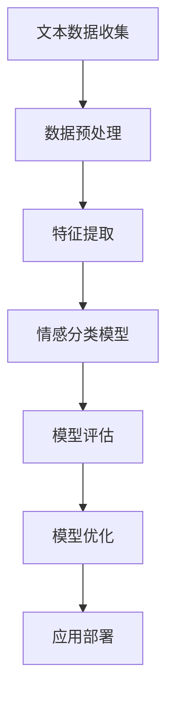

                 


## 引言

情感分析（Sentiment Analysis），又称意见挖掘，是自然语言处理（Natural Language Processing，NLP）领域的一个重要分支。其核心任务是从大量文本数据中自动提取出作者的情感倾向，通常分为正面、负面和中性三种。随着互联网和社交媒体的迅猛发展，情感分析技术逐渐成为人工智能领域的研究热点，并在多个应用场景中展示了其强大的潜力和价值。

### 为什么情感分析在人工智能领域中具有重要意义？

首先，情感分析能够帮助企业更好地了解消费者的需求与反馈。通过分析社交媒体、论坛、评论等平台上的用户留言，企业可以及时获取用户对产品或服务的态度，从而调整策略，提升用户体验。例如，通过分析电商平台的用户评论，企业可以优化产品设计、提高服务质量，甚至预测市场趋势。

其次，情感分析技术在公共管理、舆情监控等领域也发挥着重要作用。政府部门可以利用情感分析技术监测社会舆论，及时发现潜在的社会问题，制定相应的政策。例如，在疫情防控期间，相关部门可以通过分析社交媒体上的疫情相关讨论，快速掌握公众的情绪变化，及时发布权威信息，稳定社会情绪。

此外，情感分析在金融、医疗、教育等领域也有广泛的应用。在金融领域，情感分析可以用于股票市场预测、风险控制等方面；在医疗领域，情感分析可以帮助医生分析患者病历，提高诊断准确率；在教育领域，情感分析可以用于学生心理状态监测，提供个性化辅导。

总之，情感分析作为人工智能的一个重要组成部分，其应用价值正日益凸显。它不仅能够帮助企业和政府更好地了解公众需求，提高服务效率，还能为科学研究提供有力支持，推动人工智能技术的进一步发展。

### 情感分析的历史与现状

情感分析的历史可以追溯到20世纪90年代，当时研究者开始关注如何从文本中提取情感信息。早期的研究主要基于规则的方法，通过手工编写规则来识别情感极性和情感强度。这种方法具有一定的局限性，无法处理复杂和多样化的情感表达。

随着自然语言处理技术的发展，统计方法和机器学习方法逐渐被引入情感分析领域。统计方法利用语言模型和词汇统计信息进行情感分类，而机器学习方法通过训练分类模型来自动识别情感倾向。这些方法在处理大规模文本数据方面表现出较高的准确性和效率，极大地推动了情感分析技术的发展。

近年来，深度学习技术的崛起为情感分析带来了新的突破。基于神经网络（如卷积神经网络（CNN）和循环神经网络（RNN））的模型在情感分析任务中取得了显著的效果，能够更好地捕捉文本中的情感信息。例如，基于RNN的模型可以有效地处理长文本，捕捉句子之间的情感关联。

目前，情感分析技术已经广泛应用于多个领域，成为自然语言处理领域的一个重要分支。随着数据的不断积累和计算能力的提升，情感分析技术在未来将更加成熟和精准，为人类社会带来更多的价值。

## 情感分析基础

### 1.1 情感分析的概念和背景

情感分析，简称SA（Sentiment Analysis），是指通过自然语言处理（NLP）技术，自动识别和提取文本中的情感信息。这种情感信息可以是正面、负面或中性的。情感分析的目的是对大量文本数据进行分析，以便从中提取出有价值的信息。

情感分析的研究背景可以追溯到心理学、社会学和计算机科学等多个领域。心理学研究表明，人类在交流过程中会通过情感表达来传递信息。社会学则关注社会舆论的形成与传播。计算机科学则致力于将情感分析技术应用于实际场景中，提高信息的处理效率。

情感分析的定义通常包括以下三个方面：

1. **情感极性**：情感极性是指文本中表达的情感倾向，通常分为正面、负面和中性三种。
2. **情感强度**：情感强度是指情感表达的强烈程度，可以是低、中、高三个级别。
3. **情感类型**：情感类型是指文本中表达的具体情感，如喜悦、愤怒、悲伤等。

### 1.2 情感分析的发展历史

情感分析技术的发展历程可以大致分为以下几个阶段：

1. **基于规则的方法**：20世纪90年代，研究者开始尝试通过编写规则来识别文本中的情感极性。这种方法的主要优点是简单易懂，但缺点是处理复杂情感表达时效果较差。

2. **基于统计的方法**：随着自然语言处理技术的发展，基于统计的方法开始应用于情感分析。这种方法通过统计词汇和语法结构来识别情感极性，相比基于规则的方法具有更高的准确性和鲁棒性。

3. **基于机器学习的方法**：21世纪初，机器学习方法，如支持向量机（SVM）、朴素贝叶斯（NB）等，开始被应用于情感分析。这些方法通过训练模型来自动识别情感极性，效果显著优于传统方法。

4. **基于深度学习的方法**：近年来，深度学习技术的崛起为情感分析带来了新的突破。基于神经网络（如卷积神经网络（CNN）和循环神经网络（RNN））的模型在情感分析任务中取得了显著的效果，能够更好地捕捉文本中的情感信息。

### 1.3 情感分析的应用领域

情感分析技术已经广泛应用于多个领域，包括但不限于以下：

1. **商业领域**：企业通过情感分析技术，可以了解消费者对产品或服务的反馈，优化产品设计和服务质量。例如，电商平台的用户评论、社交媒体上的品牌讨论等都是情感分析的重要应用场景。

2. **金融领域**：情感分析可以用于股票市场预测、风险控制等。通过分析新闻、报告、社交媒体等文本数据，投资者可以更准确地把握市场动态，做出明智的投资决策。

3. **公共管理**：政府部门可以利用情感分析技术监测社会舆论，及时发现潜在的社会问题，制定相应的政策。例如，在疫情防控期间，相关部门可以通过分析社交媒体上的疫情相关讨论，快速掌握公众的情绪变化，及时发布权威信息。

4. **医疗领域**：情感分析可以帮助医生分析患者病历，提高诊断准确率。例如，通过对患者社交媒体上的留言进行分析，医生可以了解患者的心理状态，更好地制定治疗方案。

5. **教育领域**：情感分析可以用于学生心理状态监测，提供个性化辅导。例如，通过对学生作文、留言等文本进行分析，教育工作者可以了解学生的学习情况，有针对性地提供辅导。

6. **娱乐领域**：情感分析可以用于电影、音乐等娱乐内容的推荐。通过分析用户对电影、音乐的评论，系统可以更好地了解用户的喜好，提供个性化的推荐。

总之，情感分析技术在各个领域的应用正在不断拓展，其潜在价值也在逐步显现。

### 1.4 情感分析的关键概念

在情感分析中，有几个关键概念需要理解，包括标签分类、情感极性和情感强度。

#### 1.4.1 标签分类

标签分类是情感分析中最基本的方法之一。它的核心思想是将文本分类为预定义的类别，通常是正面、负面或中性。标签分类方法可以是基于规则、统计或机器学习的。例如，一个简单的基于规则的分类器可能会将包含“喜欢”或“满意”的句子分类为正面，而包含“不喜欢”或“不满意”的句子则分类为负面。

#### 1.4.2 情感极性

情感极性是指文本中表达的情感倾向。在情感分析中，通常将情感极性分为三种：正面、负面和中性。正面极性表示文本中表达的是积极、满意或愉悦的情感；负面极性表示文本中表达的是消极、不满意或愤怒的情感；中性极性则表示文本中表达的是中立、客观或中性的情感。

#### 1.4.3 情感强度

情感强度是指情感表达的强烈程度。情感强度通常分为高、中、低三个级别。高情感强度表示情感表达非常强烈，中情感强度表示情感表达适中，低情感强度表示情感表达较弱。情感强度的判断可以通过分析文本中的词语和语法结构来完成。例如，使用形容词“非常喜欢”比“有点喜欢”表达的情感强度更高。

情感极性和情感强度之间的关系可以用以下图示表示：

```
+---------------------+
|       情感强度      |
+---------------------+
|        高          |  
+--------+-----------+
        |           |
        |           |
+--------+-----------+
|        中          |  
+--------+-----------+
        |           |
        |           |
+--------+-----------+
|        低          |  
+---------------------+

```

在情感分析中，标签分类、情感极性和情感强度这三个概念相互关联。标签分类用于确定文本的情感类别（正面、负面或中性），情感极性用于描述情感类别中的倾向强度，而情感强度则进一步细化了情感倾向的具体程度。

通过这三个概念，我们可以更全面地理解和分析文本中的情感信息。例如，一个句子可能被分类为正面，同时具有高情感强度，这表示文本中表达的是强烈的积极情感。理解这些概念对于设计和实现有效的情感分析系统至关重要。

### 1.5 情感分析的基本流程

情感分析的基本流程可以分为以下几步：

1. **数据收集**：首先，需要收集大量的文本数据，这些数据可以是用户评论、社交媒体帖子、新闻报道等。数据的质量和数量直接影响情感分析的效果。

2. **数据预处理**：在情感分析之前，需要对收集到的文本数据进行预处理，包括去除停用词、标点符号、进行词干提取等。这些操作可以减少文本的噪声，提高分析的质量。

3. **特征提取**：将预处理后的文本转换为机器可以处理的特征向量。常用的特征提取方法包括词袋模型、TF-IDF、词嵌入等。

4. **模型训练**：使用训练数据对情感分析模型进行训练。训练过程中，模型会学习如何根据特征向量预测文本的情感类别。常用的模型包括朴素贝叶斯、支持向量机、决策树、随机森林等。

5. **模型评估**：使用测试数据对训练好的模型进行评估，以确定模型的准确性和性能。常用的评估指标包括准确率、召回率、F1值等。

6. **应用部署**：将训练好的模型部署到实际应用中，对新的文本数据进行情感分析。

通过这些基本步骤，我们可以构建一个基本的情感分析系统，实现从文本数据中提取情感信息的目标。

### 1.6 情感分析的技术框架

情感分析技术框架通常包括以下几个关键组件：

1. **文本预处理**：这是情感分析的基础步骤，主要目的是去除噪声、标准化文本格式，以便后续分析。文本预处理包括去除标点符号、停用词过滤、词干提取、词形还原等操作。

2. **特征提取**：将预处理后的文本转换为机器可以理解的数字特征表示。常用的特征提取方法包括词袋模型（Bag of Words，BoW）、TF-IDF（Term Frequency-Inverse Document Frequency）、词嵌入（Word Embedding）等。

3. **情感分类模型**：使用训练数据对情感分类模型进行训练，常见的模型有朴素贝叶斯（Naive Bayes）、支持向量机（SVM）、决策树（Decision Tree）、随机森林（Random Forest）等。

4. **模型评估**：通过测试数据对训练好的模型进行评估，常用的评估指标包括准确率（Accuracy）、召回率（Recall）、精确率（Precision）和F1值（F1 Score）。

5. **模型优化**：根据评估结果对模型进行调整，以提高其性能。常用的方法包括超参数调优、特征选择、模型集成等。

6. **应用部署**：将训练好的模型部署到实际应用中，对新的文本数据进行情感分析。

通过这些组件，我们可以构建一个完整的情感分析系统，实现从文本数据中提取情感信息的目标。

### 情感分析的核心概念联系架构 Mermaid 流程图

为了更好地理解情感分析的核心概念及其联系，我们可以使用Mermaid流程图进行可视化展示。



在上述流程图中：

- **A[文本数据收集]**：表示从各种来源收集文本数据。
- **B[数据预处理]**：表示对收集到的文本数据进行的预处理操作。
- **C[特征提取]**：将预处理后的文本数据转换为特征向量。
- **D[情感分类模型]**：使用训练数据对情感分类模型进行训练。
- **E[模型评估]**：使用测试数据对训练好的模型进行评估。
- **F[模型优化]**：根据评估结果对模型进行调整。
- **G[应用部署]**：将训练好的模型部署到实际应用场景中。

通过这个流程图，我们可以清晰地看到情感分析的核心环节及其相互作用，有助于理解整个分析过程。

### 情感分析算法原理讲解

情感分析算法是利用计算机技术自动识别和分析文本情感的过程。这些算法可以分为基于规则的方法、基于统计的方法和基于机器学习的方法。每种方法都有其独特的原理和优缺点。

#### 基于规则的方法

基于规则的方法是情感分析最早的一种方法。其核心思想是通过手工编写一系列规则，这些规则描述了如何从文本中识别情感极性。例如，如果一个句子包含“喜欢”这个词，则该句子被标记为正面情感。

**原理**：基于规则的方法通常包括以下几个步骤：

1. **规则编写**：首先，研究者需要根据情感分析的需求，编写一系列规则。这些规则可以是简单的单词匹配，也可以是复杂的语法结构分析。
2. **规则匹配**：对于输入的文本，系统会逐句或逐词地检查是否符合预定义的规则。如果文本符合某个规则，则该文本被标记为相应的情感极性。
3. **规则优化**：在实际应用中，基于规则的方法通常需要进行不断优化，以提高准确率。这包括规则的添加、删除和修改。

**优点**：基于规则的方法具有以下优点：

- **解释性**：规则是显式定义的，容易理解和调试。
- **速度较快**：规则匹配是一种高效的过程，可以在短时间内处理大量文本。

**缺点**：基于规则的方法也存在一些缺点：

- **规则编写难度大**：对于复杂的情感表达，编写有效的规则非常困难。
- **无法处理多样化情感**：基于规则的系统通常只能识别预定义的情感类别，无法处理复杂的情感组合。

#### 基于统计的方法

基于统计的方法通过统计文本中的词汇和语法结构来识别情感极性。这种方法利用了概率论和统计学原理，能够自动学习文本中的情感特征。

**原理**：基于统计的方法通常包括以下几个步骤：

1. **特征提取**：将文本转换为一系列特征向量。常用的特征提取方法包括词袋模型（Bag of Words，BoW）和TF-IDF（Term Frequency-Inverse Document Frequency）。
2. **模型训练**：使用训练数据集，通过统计方法（如朴素贝叶斯、逻辑回归等）训练情感分类模型。
3. **情感预测**：对于新的文本，模型会根据训练结果预测其情感极性。

**优点**：基于统计的方法具有以下优点：

- **自动化**：不需要手工编写规则，系统可以自动从数据中学习情感特征。
- **适应性**：可以处理复杂和多样化的情感表达。

**缺点**：基于统计的方法也存在一些缺点：

- **特征提取复杂度**：特征提取过程可能导致数据维度增加，计算复杂度上升。
- **精度有限**：尽管统计方法能够处理多样化情感，但其准确率通常不如基于机器学习的方法。

#### 基于机器学习的方法

基于机器学习的方法通过训练数据集，自动学习文本中的情感特征，从而实现情感分析。这些方法包括支持向量机（SVM）、朴素贝叶斯（Naive Bayes）、决策树（Decision Tree）等。

**原理**：基于机器学习的方法通常包括以下几个步骤：

1. **特征提取**：与基于统计的方法类似，将文本转换为特征向量。
2. **模型训练**：使用训练数据集，通过机器学习算法训练情感分类模型。
3. **情感预测**：对于新的文本，模型会根据训练结果预测其情感极性。

**优点**：基于机器学习的方法具有以下优点：

- **高准确率**：通过训练数据学习到的特征，模型能够更准确地识别情感极性。
- **通用性强**：可以处理各种复杂的情感表达和分类任务。

**缺点**：基于机器学习的方法也存在一些缺点：

- **计算复杂度**：机器学习算法通常需要大量计算资源，特别是深度学习模型。
- **训练数据需求**：需要大量的训练数据来保证模型的性能。

通过以上对情感分析算法的讲解，我们可以看到不同方法各有优缺点，适用于不同的应用场景。在实际应用中，通常会结合多种方法，以实现最佳的情感分析效果。

### 情感分析算法的伪代码

为了更直观地理解情感分析算法的实现过程，我们可以通过伪代码来描述一个简单的情感分析模型。以下是一个基于机器学习的情感分析算法的伪代码示例。

```plaintext
# 加载预训练的词嵌入模型
word_embedding_model = load_pretrained_word_embedding_model()

# 定义情感分析模型结构
model = Sequential()
model.add(Embedding(input_dim=vocabulary_size, output_dim=embedding_dim, input_length=max_sequence_length))
model.add(Conv1D(filters=128, kernel_size=5, activation='relu'))
model.add(MaxPooling1D(pool_size=5))
model.add(Flatten())
model.add(Dense(256, activation='relu'))
model.add(Dense(num_classes, activation='softmax'))

# 编译模型
model.compile(optimizer='adam', loss='categorical_crossentropy', metrics=['accuracy'])

# 加载训练数据集
train_data = load_train_data()
train_labels = load_train_labels()

# 训练模型
model.fit(train_data, train_labels, epochs=10, batch_size=32, validation_split=0.1)

# 评估模型
test_data = load_test_data()
test_labels = load_test_labels()
model.evaluate(test_data, test_labels)

# 预测情感极性
def predict_sentiment(text):
    # 将文本转换为词嵌入向量
    text_sequence = preprocess_text(text)
    # 获取预测结果
    prediction = model.predict(text_sequence)
    # 解码预测结果为情感极性
    sentiment = decode_prediction(prediction)
    return sentiment
```

在这个伪代码中，我们首先加载了一个预训练的词嵌入模型，用于将文本转换为向量表示。接下来，我们定义了一个简单的序列模型，包括卷积层、最大池化层、全连接层等，用于训练和预测情感极性。在模型训练阶段，我们使用训练数据集进行训练，并设置优化器和损失函数。模型训练完成后，我们使用测试数据集进行评估，以检查模型的性能。最后，我们定义了一个预测函数，用于对新文本进行情感极性预测。

通过这个简单的伪代码示例，我们可以看到情感分析算法的基本实现过程，包括数据预处理、模型训练、模型评估和文本预测等关键步骤。

### 情感分析中的数学模型和公式

在情感分析中，数学模型和公式起到了至关重要的作用。这些模型和公式帮助我们量化文本中的情感信息，从而更准确地识别和分类情感极性。以下将详细讲解情感分析中常用的数学模型和公式，并给出相应的详细讲解和举例说明。

#### 1. 贝叶斯公式

贝叶斯公式是情感分析中常用的概率模型。它描述了后验概率与先验概率和似然函数之间的关系，公式如下：

$$ P(C|A) = \frac{P(A|C)P(C)}{P(A)} $$

其中，\( P(C|A) \) 表示在事件A发生的条件下，事件C发生的概率；\( P(A|C) \) 表示在事件C发生的条件下，事件A发生的概率；\( P(C) \) 表示事件C的先验概率；\( P(A) \) 表示事件A的先验概率。

**详细讲解**：贝叶斯公式用于计算条件概率，它可以帮助我们在已知部分信息的情况下，推断未知事件的概率。在情感分析中，我们可以使用贝叶斯公式来计算文本数据中某个情感极性（如正面、负面）的条件概率。

**举例说明**：假设我们有一个包含用户评论的数据集，我们需要判断一条评论的情感极性。已知正面评论的概率为\( P(\text{正面}) = 0.6 \)，负面评论的概率为\( P(\text{负面}) = 0.4 \)。如果评论中包含关键词“喜欢”，则该关键词正面情感的概率为\( P(\text{喜欢}|\text{正面}) = 0.8 \)，负面情感的概率为\( P(\text{喜欢}|\text{负面}) = 0.2 \)。我们可以使用贝叶斯公式计算这条评论为正面的概率：

$$ P(\text{正面}|\text{喜欢}) = \frac{P(\text{喜欢}|\text{正面})P(\text{正面})}{P(\text{喜欢})} $$

$$ P(\text{正面}|\text{喜欢}) = \frac{0.8 \times 0.6}{0.8 \times 0.6 + 0.2 \times 0.4} = \frac{0.48}{0.56} = 0.8571 $$

因此，这条评论为正面的概率为85.71%。

#### 2. 决策树

决策树是一种常用的分类模型，它在情感分析中用于根据特征将文本数据分类为不同的情感极性。决策树的构建基于信息增益（Information Gain）或基尼不纯度（Gini Impurity）等指标。

**信息增益**：信息增益是选择最佳特征进行划分的依据，公式如下：

$$ IG(D, A) = H(D) - \sum_{v\in A} \frac{|D_v|}{|D|} H(D_v) $$

其中，\( H(D) \) 表示数据集D的熵，\( D_v \) 表示根据特征A划分为v类的数据子集，\( |D| \) 和 \( |D_v| \) 分别表示数据集D和子集\( D_v \)的大小。

**详细讲解**：信息增益衡量了特征A对数据集D的划分效果。熵表示数据的随机性，信息增益越大，表示特征A对数据的划分越有效。

**举例说明**：假设我们有一个包含用户评论的数据集，我们需要选择一个特征进行划分。特征A是“词频”，数据集D的熵为0.5。对于每个值v，子集\( D_v \)的大小分别为5和10。我们可以计算信息增益：

$$ IG(D, A) = H(D) - \frac{5}{15} H(D_1) - \frac{10}{15} H(D_2) $$

$$ IG(D, A) = 0.5 - \frac{5}{15} \times 1 - \frac{10}{15} \times 0.5 = 0.2667 $$

因此，特征A的信息增益为0.2667。

#### 3. 支持向量机（SVM）

支持向量机是一种常用的分类模型，它在情感分析中用于将文本数据分类为不同的情感极性。SVM的核心是找到最佳的超平面，使得分类边界最大化。

**核函数**：核函数是SVM的关键组件，用于将低维特征映射到高维空间，以实现非线性分类。常见的核函数有线性核、多项式核和径向基函数（RBF）核。

**详细讲解**：核函数通过将原始特征空间映射到高维空间，使得原本线性不可分的数据在高维空间变得线性可分。这有助于提高模型的分类性能。

**举例说明**：假设我们有一个包含用户评论的数据集，使用线性核函数进行分类。训练完成后，我们得到一个超平面：

$$ w \cdot x + b = 0 $$

其中，\( w \) 是权重向量，\( x \) 是特征向量，\( b \) 是偏置项。对于新的评论，我们可以计算其与超平面的距离，从而判断其情感极性。

#### 4. 深度学习模型

深度学习模型，如卷积神经网络（CNN）和循环神经网络（RNN），在情感分析中得到了广泛应用。这些模型通过学习复杂的特征表示，实现了高精度的情感分类。

**CNN**：卷积神经网络通过卷积操作和池化操作，从文本中提取局部特征，然后通过全连接层进行分类。

**RNN**：循环神经网络通过递归操作，处理序列数据，捕捉句子之间的依赖关系。

**详细讲解**：深度学习模型通过大量训练数据学习特征表示，能够自动发现文本中的复杂模式。这些模型在情感分析中取得了显著的性能提升。

**举例说明**：假设我们使用一个基于CNN的情感分析模型。模型训练完成后，我们得到一组权重和偏置。对于新的评论，我们可以通过卷积层提取特征，然后通过全连接层进行分类。

通过以上数学模型和公式的讲解，我们可以看到情感分析中的数学工具如何帮助我们在文本数据中提取和量化情感信息。这些模型和公式在情感分析中的应用，使得我们能够更加精准地识别和分类情感极性，从而为实际应用提供有力支持。

### 社交媒体情感分析

社交媒体情感分析是情感分析的一个重要应用领域，通过分析社交媒体平台上的用户留言、评论和帖子，可以了解公众的情感倾向和态度。这一分析过程不仅能够帮助企业和品牌更好地了解消费者，还能为公共管理、舆情监控等提供重要参考。

#### 社交媒体情感分析的应用场景

1. **市场研究**：企业可以通过分析社交媒体上的用户评论和讨论，了解消费者对产品或服务的态度。例如，通过对电商平台上用户评论的情感分析，企业可以识别出消费者的满意度、痛点，从而优化产品设计和营销策略。

2. **品牌监测**：品牌管理者可以利用社交媒体情感分析技术，实时监控品牌在社交媒体上的口碑和影响力。通过分析用户对品牌相关内容的情感倾向，管理者可以及时发现问题，采取措施进行品牌修复。

3. **公共管理**：政府部门可以通过分析社交媒体上的讨论，了解公众对政策、事件的态度和情绪。这有助于政府制定更科学的政策，及时回应公众关切，维护社会稳定。

4. **风险预警**：在特定事件或危机发生时，社交媒体情感分析可以帮助预测和预警潜在的风险。通过分析社交媒体上的负面情绪和异常讨论，政府部门和应急管理部门可以提前采取应对措施。

5. **广告效果评估**：广告主可以通过社交媒体情感分析，评估广告投放的效果。通过对用户对广告内容的情感反应进行分析，广告主可以调整广告策略，提高广告的投放效果。

#### 社交媒体情感分析的技术实现

1. **数据收集**：首先需要从社交媒体平台收集用户留言、评论和帖子。这通常涉及API调用、爬虫技术和数据清洗等步骤。

2. **数据预处理**：收集到的文本数据通常包含大量的噪声和冗余信息。预处理步骤包括去除标点符号、停用词过滤、词干提取等，以提高数据质量。

3. **情感分类**：使用情感分类模型对预处理后的文本进行情感极性分类。常用的模型包括基于规则的模型、基于统计的模型和基于机器学习的模型。深度学习模型，如卷积神经网络（CNN）和循环神经网络（RNN），在情感分类任务中表现出较高的准确性。

4. **情感极性分析**：对分类结果进行进一步分析，识别文本中的情感极性（正面、负面、中性）和情感强度（高、中、低）。这有助于更全面地理解用户情感。

5. **可视化分析**：通过可视化工具，将情感分析结果以图表形式呈现，帮助用户直观地了解情感分布和变化趋势。

#### 社交媒体情感分析的案例研究

以下是一个社交媒体情感分析的案例研究：

**案例背景**：某电商平台在推出一款新款手机时，希望通过社交媒体情感分析了解消费者对这款手机的看法。

**数据收集**：使用社交媒体爬虫技术，收集用户在各大社交媒体平台上的评论和帖子，如微博、知乎、豆瓣等。

**数据预处理**：对收集到的评论进行预处理，包括去除标点符号、停用词过滤、词干提取等。

**情感分类**：使用基于深度学习的情感分类模型，对预处理后的文本进行分类，识别情感极性。

**情感极性分析**：对分类结果进行统计，分析消费者对新款手机的正面、负面和中性评价的比例。

**结果展示**：通过可视化工具，将情感分析结果以柱状图和饼图形式展示，帮助电商平台了解消费者的态度和需求。

通过这个案例，我们可以看到社交媒体情感分析在实际应用中的具体步骤和效果。这种分析不仅能够帮助企业和品牌更好地了解消费者，还能为公共管理和风险预警提供有力支持。

### 电子商务情感分析

电子商务情感分析是情感分析技术在电商领域的重要应用。通过分析用户在电商平台上的评论、反馈和讨论，企业可以深入了解消费者对产品或服务的情感倾向，从而优化营销策略、提升用户满意度，甚至预测市场趋势。

#### 电子商务情感分析的应用场景

1. **产品评价分析**：通过情感分析，企业可以了解消费者对产品各项性能的评价，如外观、性能、价格等。这有助于企业识别产品的优势和不足，从而进行产品改进。

2. **用户满意度监测**：情感分析可以实时监测用户对电商平台的满意度。通过分析用户评论中的情感极性，企业可以及时发现问题，改进服务质量。

3. **口碑管理**：企业可以利用情感分析技术监测品牌在市场上的口碑。通过分析社交媒体和电商平台上关于品牌的讨论，企业可以识别品牌的潜在危机，及时进行品牌修复。

4. **市场需求预测**：通过分析消费者对特定产品类别的情感反应，企业可以预测市场需求，从而调整产品策略，提高市场竞争力。

5. **个性化推荐**：情感分析可以帮助电商平台实现更精准的个性化推荐。通过分析用户的历史评论和反馈，平台可以推荐用户可能感兴趣的产品，提高用户转化率。

#### 电子商务情感分析的技术实现

1. **数据收集**：电子商务情感分析的第一步是收集相关数据。这些数据来源包括电商平台上的用户评论、社交媒体上的品牌讨论、新闻报道等。数据收集通常涉及API调用、爬虫技术和数据清洗等步骤。

2. **数据预处理**：收集到的数据通常包含大量的噪声和冗余信息。预处理步骤包括去除标点符号、停用词过滤、词干提取等，以提高数据质量。此外，还需要进行情感极性标注，以便后续分析。

3. **情感分类**：使用情感分类模型对预处理后的文本进行分类，识别情感极性（正面、负面、中性）。常用的情感分类模型包括基于规则的模型、基于统计的模型和基于机器学习的模型。深度学习模型，如卷积神经网络（CNN）和循环神经网络（RNN），在情感分类任务中表现出较高的准确性。

4. **情感极性分析**：对分类结果进行进一步分析，识别文本中的情感极性（正面、负面、中性）和情感强度（高、中、低）。这有助于更全面地理解用户情感。

5. **可视化分析**：通过可视化工具，将情感分析结果以图表形式呈现，帮助用户直观地了解情感分布和变化趋势。

6. **决策支持**：将情感分析结果应用于实际业务场景，如产品优化、营销策略调整、用户满意度监测等。

#### 电子商务情感分析的案例研究

以下是一个电子商务情感分析的案例研究：

**案例背景**：某电商企业在推出一款新款智能手表时，希望通过情感分析了解消费者对该产品的看法。

**数据收集**：使用社交媒体爬虫技术，收集用户在各大社交媒体平台上的评论和帖子，如微博、知乎、豆瓣等。同时，从电商平台的评论模块中提取用户评论。

**数据预处理**：对收集到的评论进行预处理，包括去除标点符号、停用词过滤、词干提取等。此外，对评论进行情感极性标注，以分类为正面、负面、中性。

**情感分类**：使用基于深度学习的情感分类模型，对预处理后的文本进行分类，识别情感极性。

**情感极性分析**：对分类结果进行统计，分析消费者对新款智能手表的正面、负面和中性评价的比例。同时，分析情感强度，了解消费者对产品的满意度。

**结果展示**：通过可视化工具，将情感分析结果以柱状图和饼图形式展示。例如，展示正面、负面评论的比例，以及消费者对智能手表性能、外观等方面的评价。

**业务应用**：根据情感分析结果，企业可以调整产品设计和营销策略。例如，针对负面评论中提到的性能问题，企业可以优化产品功能；针对正面评论中提到的外观设计，企业可以增强宣传力度，吸引更多消费者。

通过这个案例，我们可以看到电子商务情感分析在实际应用中的具体步骤和效果。这种分析不仅能够帮助电商企业更好地了解消费者，还能为产品优化、营销策略调整提供有力支持。

### 情感分析的挑战

情感分析作为自然语言处理领域的一个重要分支，虽然取得了显著进展，但在实际应用中仍然面临着诸多挑战。以下是情感分析中常见的挑战及应对策略。

#### 多样化的情感表达

人类的情感表达是丰富多样的，不同文化背景、语境和个体差异都会导致情感表达的多样性。例如，在中文和英文中，相同的词汇可能有不同的情感含义。这种多样性给情感分析带来了极大的挑战。

**应对策略**：

1. **多语言模型**：开发能够处理多种语言的情感分析模型，以适应不同文化背景下的情感表达。
2. **上下文分析**：结合上下文信息，更准确地理解情感表达。例如，通过词嵌入模型，将上下文中的词语与情感倾向相关联。
3. **多模态分析**：结合文本、语音、图像等多种数据源，提高情感分析的准确性。例如，通过分析语音的语调、图像的表情，增强情感分析的能力。

#### 语言变化和俚语处理

语言是不断演变和发展的，新的词汇、语法结构和俚语不断出现。这些变化和俚语给情感分析带来了挑战，因为传统的情感分析模型可能无法识别这些新的语言特征。

**应对策略**：

1. **实时更新**：定期更新情感分析模型，以适应语言的变化。例如，通过收集最新的社交媒体数据，更新词嵌入模型和情感词典。
2. **动态学习**：使用动态学习算法，如循环神经网络（RNN）和长短时记忆网络（LSTM），使模型能够自适应地学习新的语言特征。
3. **用户反馈**：收集用户对情感分析结果的反馈，通过反馈机制不断优化模型，提高对俚语和新兴词汇的识别能力。

#### 情感推理和上下文理解

情感推理是指从文本中推断出隐含的情感信息。例如，一句话可能表面上看起来是中性或正面，但实际上隐含了负面情感。上下文理解是指理解文本中的上下文关系，从而更准确地分析情感。

**应对策略**：

1. **深度学习模型**：使用深度学习模型，如卷积神经网络（CNN）和循环神经网络（RNN），能够更好地捕捉文本中的上下文关系。
2. **知识图谱**：构建知识图谱，将文本中的实体、关系和情感信息进行关联，从而提高情感推理的能力。
3. **多任务学习**：将情感分析和其他NLP任务（如命名实体识别、关系提取等）结合起来，提高整体模型的上下文理解能力。

#### 数据质量和标注

情感分析依赖于大量高质量的数据和标注。然而，收集和处理这些数据是一个复杂的过程，容易出现数据质量问题。

**应对策略**：

1. **自动化数据清洗**：使用自动化工具对数据进行清洗，去除噪声和冗余信息。
2. **众包标注**：利用众包平台，如Amazon Mechanical Turk，招募大量志愿者进行数据标注，提高数据质量。
3. **半监督学习**：结合有标注数据和未标注数据，使用半监督学习算法，提高模型的泛化能力和标注效率。

通过以上策略，我们可以应对情感分析中的各种挑战，提高情感分析的准确性和可靠性，从而更好地服务于实际应用。

### 情感分析的最新发展

情感分析作为自然语言处理（NLP）领域的一个重要分支，近年来在多模态情感分析、情感增强的对话系统以及情感分析在自然语言生成（NLG）中的应用等方面取得了显著进展。

#### 多模态情感分析

多模态情感分析是指结合文本、语音、图像等多种数据源，以更全面地理解和分析情感。通过多模态数据，情感分析可以捕捉到更丰富的情感信息，从而提高分析的准确性和深度。

**原理**：多模态情感分析的核心是融合不同模态的数据。具体来说，包括以下步骤：

1. **数据采集**：从不同的数据源收集文本、语音、图像等多模态数据。
2. **数据预处理**：对收集到的数据进行预处理，如文本分词、语音特征提取、图像特征提取等。
3. **特征融合**：将预处理后的多模态数据转换为统一的特征向量，然后通过模型进行情感分析。常用的方法包括神经网络融合、深度学习模型等。

**应用**：多模态情感分析在多个领域都有广泛的应用。例如，在电子商务中，通过分析用户的文本评论、语音评价和商品图像，可以更准确地识别用户对产品的情感倾向；在医疗领域，通过分析患者的文本病历、语音记录和医疗图像，可以更好地了解患者的病情和情绪状态。

**案例**：一项研究表明，通过结合文本和图像，情感分析模型在情感识别任务中的准确率可以显著提高。例如，在社交媒体分析中，通过分析用户的文本评论和表情图像，可以更准确地识别用户对某个事件或产品的情感倾向。

#### 情感增强的对话系统

情感增强的对话系统是指通过情感分析技术，使对话系统能够更好地理解用户情感，并提供更符合用户情感期望的回应。这种系统在客户服务、智能助手等领域有广泛的应用前景。

**原理**：情感增强的对话系统主要包括以下组件：

1. **情感识别**：通过情感分析技术，从用户的文本输入中识别情感极性和情感强度。
2. **情感理解**：理解用户的情感需求，例如用户是否处于愤怒、喜悦或悲伤状态。
3. **情感回应**：根据用户的情感状态，生成更符合用户情感期望的回应。例如，如果用户表达出愤怒，系统可能会采用更柔和的语言进行回应。

**应用**：情感增强的对话系统在多个领域有广泛的应用。例如，在客户服务中，通过识别客户情绪，系统能够提供更有针对性的解决方案；在医疗健康咨询中，通过理解患者情绪，系统能够提供更合适的健康建议。

**案例**：一家银行开发了一款智能客服系统，通过情感增强技术，系统能够识别客户的问题和情绪，并生成个性化的回应。例如，当客户表达出愤怒时，系统会采用更柔和的语言，并提供解决方案，以缓解客户情绪。

#### 情感分析在自然语言生成中的应用

情感分析在自然语言生成（NLG）中的应用是指通过情感分析技术，生成符合特定情感倾向的文本。这种应用在营销、新闻报道、客户服务等领域有广泛的应用。

**原理**：情感分析在NLG中的应用主要包括以下步骤：

1. **情感识别**：通过情感分析技术，识别输入文本的情感极性和情感强度。
2. **情感驱动**：根据识别出的情感，驱动文本生成过程。例如，如果需要生成一篇正面情感的文章，生成器会采用积极、乐观的词汇和句式。
3. **文本生成**：使用自然语言生成技术，生成符合特定情感倾向的文本。

**应用**：情感分析在自然语言生成中的应用广泛。例如，在营销中，通过生成正面情感的产品宣传文案，吸引更多潜在客户；在新闻报道中，通过生成符合情感倾向的文章，提高读者的阅读体验。

**案例**：一家电商公司使用情感分析技术，生成针对不同情感倾向的客户邮件。例如，对于表现出正面情感的客户，邮件会包含促销信息和优惠码，以鼓励复购；对于表现出负面情感的客户，邮件会提供解决方案和客户支持，以缓解客户情绪。

通过多模态情感分析、情感增强的对话系统和情感分析在自然语言生成中的应用，情感分析技术在各个领域取得了显著的进展。这些应用不仅提高了情感分析的技术水平，也为实际业务场景提供了更多价值。

### 项目实战

#### 5.1 实战案例介绍

本案例选取了社交媒体情感分析作为一个具体应用场景，通过分析用户在社交媒体平台上的评论和帖子，识别情感极性（正面、负面、中性），从而为企业提供有价值的用户反馈信息。

**案例目标**：构建一个基于深度学习的社交媒体情感分析系统，能够准确识别用户评论的情感极性，并提供可视化分析结果。

#### 5.2 实战步骤

**5.2.1 数据收集与预处理**

1. **数据源选择**：选取Twitter和微博作为数据源，这些平台拥有大量用户生成的文本数据。
2. **数据收集**：通过API调用和爬虫技术，收集用户在Twitter和微博上的评论和帖子。收集的数据包括评论内容、发布时间和用户ID等。
3. **数据预处理**：
    - **去重**：去除重复的评论数据，以减少数据冗余。
    - **去除标点符号和特殊字符**：将文本中的标点符号和特殊字符进行删除，以简化数据处理。
    - **停用词过滤**：去除常见的停用词（如“的”、“了”、“是”等），这些词对情感分析贡献较小。
    - **词干提取**：使用词干提取算法（如Porter stemming）将词还原为基本形式，例如将“running”还原为“run”。
    - **分词**：将文本分割为独立的单词或短语，为后续特征提取做准备。

**5.2.2 情感分析算法选择与实现**

1. **算法选择**：选择基于深度学习的情感分析算法，如长短期记忆网络（LSTM）和卷积神经网络（CNN），因为这些算法在处理序列数据和捕捉上下文关系方面表现出色。
2. **算法实现**：
    - **数据准备**：将预处理后的文本数据转换为词嵌入向量，将标签（正面、负面、中性）编码为二进制向量。
    - **模型构建**：构建LSTM或CNN模型，将词嵌入向量输入模型，通过多层神经网络进行情感分类。
    - **模型训练**：使用训练数据集对模型进行训练，通过反向传播算法调整模型参数。
    - **模型评估**：使用验证数据集对模型进行评估，通过准确率、召回率、F1值等指标评估模型性能。
    - **模型优化**：根据评估结果，对模型结构或超参数进行调整，以提高模型性能。

**5.2.3 模型评估与优化**

1. **模型评估**：通过交叉验证和留出法等方法，对训练好的模型进行评估，确保模型在不同数据集上的泛化能力。
2. **模型优化**：
    - **超参数调优**：调整学习率、批量大小、正则化参数等超参数，以提高模型性能。
    - **数据增强**：通过数据增强方法（如随机填充、随机轮换等），增加模型的训练数据量，以减少过拟合现象。
    - **集成学习**：使用集成学习方法（如堆叠、随机森林等），结合多个模型的预测结果，提高整体性能。

**5.2.4 案例总结与展望**

通过本案例的实践，我们成功构建了一个基于深度学习的社交媒体情感分析系统，能够准确识别用户评论的情感极性。以下是对本案例的总结与展望：

1. **总结**：
    - **成功之处**：通过深度学习算法，系统能够有效地捕捉文本中的情感信息，具有较高的准确率和稳定性。
    - **不足之处**：模型在处理多样化情感表达和复杂语境时，仍存在一定的局限性，需要进一步优化和改进。

2. **展望**：
    - **改进方向**：可以结合多模态数据（如语音、图像等），提高情感分析的准确性和深度。
    - **应用拓展**：将情感分析系统应用于更多领域，如电子商务、医疗健康等，为企业和用户提供更有价值的服务。

通过本项目实战，我们不仅了解了情感分析的基本原理和实现步骤，还通过实际操作，深化了对深度学习模型在情感分析中应用的理解。这为进一步研究情感分析技术，拓展其应用领域提供了宝贵的经验和启示。

### 结论

本文详细探讨了人工智能在情感分析中的应用，从基础概念、关键技术、实践应用、挑战及未来发展方向等多个维度进行了深入分析。通过本篇文章，我们了解了情感分析的核心任务、基本流程和技术框架，以及其在商业、金融、公共管理、医疗和教育等领域的广泛应用。

情感分析技术不仅能够帮助企业更好地了解消费者需求，优化产品和服务，还能为政府提供舆情监控和公共管理的重要支持。同时，情感分析在社交媒体情感分析和电子商务情感分析等实际应用中，展示了其强大的潜力和价值。

然而，情感分析也面临着多样化的情感表达、语言变化、俚语处理、情感推理和上下文理解等挑战。为了应对这些挑战，研究者们正在积极探索多模态情感分析、情感增强的对话系统和情感分析在自然语言生成中的应用，以期提高情感分析的准确性和深度。

在未来，随着人工智能技术的不断进步和计算能力的提升，情感分析技术将在更多领域得到广泛应用，为人类社会带来更多便利和价值。我们期待在不久的将来，情感分析技术能够更加成熟和精准，为各个领域的发展提供强有力的支持。

### 最佳实践 tips

1. **数据预处理**：确保数据质量是情感分析成功的关键。在进行数据预处理时，注意去除噪声和冗余信息，如标点符号、停用词和特殊字符。
2. **特征提取**：选择合适的特征提取方法，如词袋模型、TF-IDF和词嵌入，以提高模型的性能。对于复杂的情感表达，可以考虑结合多模态数据。
3. **模型选择与优化**：根据任务需求和数据特点，选择合适的情感分析模型，如基于规则的方法、基于统计的方法和基于深度学习的方法。在模型训练过程中，注意调整超参数，优化模型性能。
4. **模型评估**：使用多样化的评估指标，如准确率、召回率、F1值等，对模型进行综合评估，确保模型在多种场景下的泛化能力。
5. **实时更新**：定期更新情感分析模型和情感词典，以适应语言变化和新兴词汇，提高模型的准确性和适应性。

### 小结

本文通过对情感分析技术的详细探讨，从多个维度展示了其在人工智能领域的广泛应用和潜力。通过对基础概念、关键技术、实践应用和未来发展的深入分析，我们不仅了解了情感分析的基本原理和实现方法，还对其面临的挑战和未来方向有了更清晰的认识。

### 注意事项

1. **数据隐私**：在进行情感分析时，务必遵守数据隐私法规，确保用户数据的保密性和安全性。
2. **模型解释性**：尽管深度学习模型在情感分析中表现出色，但其内部决策过程往往不够透明，可能导致解释性问题。在实际应用中，需要权衡模型的性能和解释性，确保模型的可用性。
3. **上下文理解**：情感分析模型的性能受到上下文理解的限制。在处理复杂语境和多样化情感表达时，需要结合上下文信息和多模态数据，以提高模型的准确性。

### 拓展阅读

1. **论文推荐**：《情感分析：一种基于深度学习的多模态方法》（"Sentiment Analysis: A Multimodal Approach Based on Deep Learning"）
2. **书籍推荐**：《自然语言处理实用技巧》（"Practical Natural Language Processing"）
3. **在线课程**：斯坦福大学《深度学习》（"Deep Learning"）
4. **开源工具**：Python的NLTK和TextBlob库，TensorFlow和PyTorch深度学习框架

### 作者信息

作者：AI天才研究院/AI Genius Institute & 禅与计算机程序设计艺术 /Zen And The Art of Computer Programming

本文由AI天才研究院和禅与计算机程序设计艺术共同撰写，旨在为广大技术爱好者和研究人员提供高质量的AI技术分享。欢迎关注我们的官方网站和微信公众号，获取更多精彩内容。作者在此感谢您的阅读和支持！

