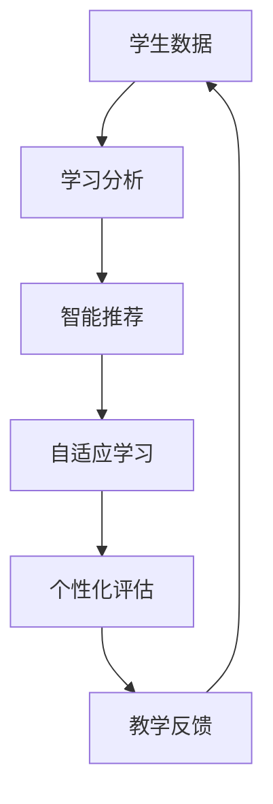

                 

### 引言

在当今信息时代，教育已成为社会发展的重要基石，其质量直接关系到国家和民族的未来。然而，传统的教育模式在应对多样化的学习需求和提升教育公平性方面存在诸多局限。一方面，传统教育往往采用“一刀切”的方式，忽视了学生个体差异，难以实现真正的个性化学习；另一方面，由于教育资源分配不均，城乡、区域间的教育差距愈发显著，加剧了教育不公平问题。在这样的背景下，人工智能（AI）作为一种新兴技术，其潜力被广泛看好，被认为是解决教育困境的重要手段。

本文旨在探讨人工智能在教育中的应用，重点关注个性化学习和教育公平两个关键领域。具体来说，我们将首先介绍人工智能的基本概念和发展历程，接着深入分析其在个性化学习和教育公平方面的应用，通过具体案例展示AI技术的实际效果，并对未来发展提出展望。

文章结构安排如下：

## 第一部分：引论

在这一部分，我们将首先讨论教育面临的挑战，如传统教育模式的局限性以及教育公平的重要性。接着，介绍人工智能的基本概念，包括其定义和发展历程，以及核心技术的概述。

## 第二部分：个性化学习

在这一部分，我们将详细探讨个性化学习的概念与原理，包括其定义和实现机制。随后，介绍人工智能在个性化学习中的应用，如数据分析和挖掘、个性化学习推荐系统和适应学习系统等。通过具体案例分析，展示个性化学习的实际效果。

## 第三部分：教育公平

在这一部分，我们将探讨教育公平的概念与意义，分析人工智能在教育公平中的应用，如教育资源的均衡分配、个性化辅导与支持以及跨越数字鸿沟等。通过具体案例，展示人工智能在教育公平方面的贡献。

## 第四部分：展望与未来

在这一部分，我们将讨论人工智能教育应用的挑战与机遇，分析其发展趋势，并展望未来教育模式的可能性。

## 附录

附录部分将包括参考文献和相关资源链接，为读者提供进一步的学习和探讨资源。

通过本文的逐步分析，我们将揭示人工智能在教育领域的深刻影响，探讨其如何改变教育的现状，实现个性化学习和教育公平的目标。让我们开始这次探索之旅，一起思考AI在教育中的未来可能性。

---

### 1.1 教育面临的挑战

在快速变化的社会环境中，教育系统正面临一系列严峻的挑战。传统教育模式的局限性使得教育质量无法满足多样化的学习需求，而教育公平问题更是使得社会的不平等进一步加剧。

#### 1.1.1 传统教育模式的局限性

传统教育模式通常采用一种标准化的教学方法，即将所有学生纳入统一的教学计划和课程安排中。这种模式虽然在某些方面具有高效性和可操作性，但其在以下几个方面表现出明显的局限性：

1. 忽视个体差异
传统教育模式往往忽视了学生的个体差异，采用“一刀切”的教学方法。这种做法无法充分满足不同学生的发展需求，导致部分学生在学习过程中感到枯燥乏味，甚至丧失学习兴趣。个性化学习的缺失，使得学生的学习效果和兴趣无法得到有效提升。

2. 教学内容缺乏灵活性
传统教育模式中的教学内容和进度往往较为固定，难以适应不同学生的学习节奏。学生在学习过程中，可能会因为课程内容过于简单或过于复杂而感到不适应，影响学习效果。

3. 教师工作负担重
传统教育模式要求教师在固定的教学时间内完成大量的教学内容，导致教师工作负担沉重。这种高强度的教学任务，不仅影响了教师的教学质量和创新能力，也限制了学生与教师之间的互动和沟通。

4. 教育资源分配不均
在全球范围内，教育资源分配存在显著的不均衡现象。城市地区的教育资源相对丰富，而农村和偏远地区则面临教育资源匮乏的问题。这种不平衡不仅体现在硬件设施上，还包括教师的数量和质量、教学辅助资源的丰富程度等方面。

#### 1.1.2 教育公平的重要性

教育公平是指每个个体都有机会接受高质量的教育，无论其出生背景、家庭条件、性别、种族或其他因素。教育公平对于社会的可持续发展具有重要意义，具体体现在以下几个方面：

1. 促进社会公平
教育是促进社会公平的重要手段。通过提供平等的教育机会，可以减少社会阶层之间的差距，为每个人提供公平的起点。教育公平有助于消除歧视和不平等，促进社会的和谐与稳定。

2. 提升个人发展
高质量的教育能够帮助个体充分发展其潜能，提高就业能力和生活质量。教育公平使得每个人都有机会获得良好的教育，从而实现个人价值和自我实现。

3. 促进国家竞争力
一个具有高度教育公平性的国家，能够培养出更多具备创新能力和专业知识的人才。这些人才是国家经济发展和社会进步的重要驱动力，有助于提升国家的国际竞争力。

4. 减少贫困和社会问题
教育公平有助于减少贫困现象，提高社会整体福利水平。受过良好教育的人更有可能获得稳定的工作和收入，从而减少贫困和社会问题的发生。

综上所述，传统教育模式在满足多样化学习需求和实现教育公平方面存在明显不足。因此，探索新的教育模式和解决方案，如人工智能在教育中的应用，已成为当前教育领域的重要课题。接下来，我们将介绍人工智能的基本概念，为其在解决教育问题中的应用奠定基础。

---

### 1.2 人工智能的基本概念

人工智能（Artificial Intelligence，简称AI）是指通过计算机系统模拟人类智能行为的技术和学科。人工智能的目标是实现机器在感知、理解、学习、推理和决策等方面的能力，以解决复杂的问题和任务。自20世纪50年代以来，人工智能经历了多个发展阶段，从最初的符号主义和知识表示，到基于规则的系统，再到现代的机器学习和深度学习，AI技术逐渐取得了显著的突破。

#### 1.2.1 人工智能的定义与发展

1. **定义**
人工智能可以定义为“使计算机系统能够执行通常需要人类智能才能完成的任务的科学和工程领域”。这些任务包括语音识别、图像处理、自然语言处理、决策制定等。AI的核心在于通过算法和计算模型，使计算机具备自适应和学习能力，从而实现智能化。

2. **发展历程**
人工智能的发展历程可以大致分为以下几个阶段：

- **符号主义阶段（1950-1979）**：这一阶段以符号表示法和逻辑推理为核心，试图通过符号逻辑和形式语言来模拟人类思维。代表性的成果包括逻辑推理系统、专家系统等。

- **知识表示阶段（1980-1999）**：在这个阶段，研究者开始关注如何更好地表示和利用知识，以提升系统的智能水平。知识表示技术包括语义网络、框架表示等。

- **机器学习阶段（2000-2019）**：随着计算能力的提升和数据规模的扩大，机器学习方法得到了快速发展。机器学习通过训练算法，从数据中自动学习特征和规律，代表性方法包括决策树、支持向量机、神经网络等。

- **深度学习阶段（2010-至今）**：深度学习是机器学习的一个重要分支，通过构建多层次的神经网络模型，实现自动化特征学习和层次化知识表示。深度学习在图像识别、自然语言处理等领域取得了突破性进展，代表性算法包括卷积神经网络（CNN）、循环神经网络（RNN）和生成对抗网络（GAN）等。

#### 1.2.2 人工智能的核心技术

人工智能的核心技术涵盖了多个方面，包括机器学习、深度学习、自然语言处理、计算机视觉等。以下是这些技术的简要介绍：

1. **机器学习（Machine Learning）**
机器学习是AI的一个重要分支，通过训练算法，使计算机系统能够从数据中自动学习规律和模式。机器学习主要分为监督学习、无监督学习和半监督学习三种类型。监督学习有标签的数据进行训练，无监督学习从无标签的数据中学习模式，半监督学习则结合了有标签和无标签数据。

2. **深度学习（Deep Learning）**
深度学习是机器学习的一个重要分支，通过构建多层次的神经网络模型，实现自动化特征学习和层次化知识表示。深度学习在图像识别、自然语言处理等领域取得了显著进展，是当前AI研究的热点方向。

3. **自然语言处理（Natural Language Processing，NLP）**
自然语言处理是AI的一个分支，旨在使计算机能够理解和处理人类自然语言。NLP技术包括文本分类、情感分析、机器翻译、问答系统等。

4. **计算机视觉（Computer Vision）**
计算机视觉是AI的一个分支，通过计算机对图像和视频进行分析和处理，实现物体识别、场景理解等功能。计算机视觉在安防监控、自动驾驶、医疗影像分析等领域具有广泛应用。

5. **强化学习（Reinforcement Learning）**
强化学习是一种通过试错和奖励机制进行学习的方法，旨在使计算机系统在特定环境中做出最优决策。强化学习在游戏AI、机器人控制等领域取得了成功。

#### 1.2.3 人工智能在教育中的应用

人工智能在教育领域具有广泛的应用前景，尤其在个性化学习和教育公平方面表现突出。以下是人工智能在教育中的主要应用方向：

1. **个性化学习**
通过分析学生的学习行为和特点，人工智能可以为每个学生制定个性化的学习计划和教学资源，提高学习效果和兴趣。个性化学习包括自适应学习、智能辅导、个性化推荐等。

2. **教育资源的均衡分配**
人工智能可以帮助优化教育资源的分配，实现教育资源的均衡化。例如，通过智能系统监控和调整教育资源的使用情况，提高农村和偏远地区学校的教学质量。

3. **教育公平**
人工智能可以通过智能系统提供个性化的辅导和支持，帮助弱势群体学生获得更好的教育资源。此外，人工智能还可以通过在线教育平台，提供跨区域的优质教育资源，缩小教育差距。

总之，人工智能作为一种新兴技术，其潜力被广泛看好，有望在教育领域发挥重要作用，解决传统教育模式面临的挑战，实现个性化学习和教育公平的目标。在接下来的章节中，我们将进一步探讨人工智能在个性化学习和教育公平方面的具体应用。

---

### 1.3 人工智能在教育中的应用

人工智能在教育中的应用正逐渐改变传统教学模式，特别是在个性化学习和教育公平方面展现出巨大潜力。以下是人工智能在这两个关键领域的具体应用：

#### 1.3.1 个性化学习

个性化学习是人工智能在教育中最重要的应用之一。其核心在于根据每个学生的特点和学习需求，提供个性化的学习内容和教学方式，从而提高学习效果和兴趣。

1. **自适应学习系统**
自适应学习系统利用人工智能技术，通过分析学生的学习行为和表现，动态调整教学内容的难度和节奏，以适应每个学生的学习进度。这种系统通常包含以下功能：
   - **学习路径规划**：系统根据学生的学习历史和当前状态，为其规划个性化的学习路径。
   - **智能推荐**：系统根据学生的学习情况和兴趣，推荐适合的学习资源和任务。
   - **实时反馈**：系统在学生学习过程中提供实时反馈，帮助学生纠正错误，巩固知识点。

2. **智能辅导**
智能辅导系统通过人工智能技术，提供个性化的学习辅导服务。这些系统通常具备以下功能：
   - **作业自动批改**：系统能够自动批改学生的作业，提供详细的错误分析和得分情况。
   - **智能答疑**：系统能够理解学生的提问，提供准确的答案和解释。
   - **学习辅导**：系统可以根据学生的学习需求，提供针对性的辅导和建议。

3. **个性化学习推荐系统**
个性化学习推荐系统利用机器学习和深度学习技术，根据学生的学习历史、兴趣和成绩，推荐适合的学习资源和内容。这种系统通常包括以下组件：
   - **用户画像**：系统通过分析学生的数据，建立用户画像，了解其学习特点和需求。
   - **推荐算法**：系统使用推荐算法，如协同过滤、基于内容的推荐等，为每个学生推荐个性化的学习资源。
   - **推荐结果评估**：系统评估推荐结果的准确性和实用性，不断优化推荐策略。

#### 1.3.2 教育公平

教育公平是指每个学生都能获得公平的教育机会和资源，无论其出生背景、家庭条件或其他因素。人工智能在教育公平中的应用，有助于缩小教育差距，提高教育质量。

1. **教育资源的均衡分配**
人工智能技术可以帮助实现教育资源的均衡分配，特别是在农村和偏远地区。具体应用包括：
   - **在线教育平台**：通过建立在线教育平台，提供高质量的数字化教育资源，让偏远地区的学生也能享受到优质的课程。
   - **智能教学系统**：智能教学系统可以根据学生的学习情况和需求，提供个性化的教学服务，提高教育质量。
   - **教育资源管理系统**：利用人工智能技术，对教育资源进行科学管理和调度，确保教育资源的有效利用。

2. **个性化辅导与支持**
人工智能技术可以通过个性化辅导系统，为弱势群体学生提供额外的学习支持。具体应用包括：
   - **智能学习助手**：智能学习助手可以为学生提供个性化的学习计划、学习资源和辅导建议，帮助他们克服学习困难。
   - **远程辅导**：通过远程视频会议技术，教师可以为偏远地区的学生提供实时辅导和互动教学，提高教学效果。
   - **智能答疑系统**：智能答疑系统可以为学生提供24小时的在线支持，解答他们在学习过程中遇到的问题。

3. **跨越数字鸿沟**
人工智能技术可以帮助缩小数字鸿沟，提高教育公平。具体应用包括：
   - **数字化教育资源**：通过开发和提供高质量的数字化教育资源，如电子书籍、在线课程、教育APP等，使学生在任何时间和地点都能获得学习资源。
   - **智能设备普及**：通过推广智能设备，如平板电脑、智能手机等，使更多学生能够接入互联网，获取在线教育资源。
   - **智能教学辅助工具**：利用人工智能技术，开发智能教学辅助工具，如智能试卷生成器、智能作业管理系统等，提高教学效率和质量。

总之，人工智能在教育中的应用，为个性化学习和教育公平提供了新的解决方案。通过自适应学习系统、个性化辅导、在线教育平台和智能设备等，人工智能正逐步改变传统教育模式，实现教育的个性化、智能化和公平化。在接下来的章节中，我们将进一步探讨人工智能在个性化学习和教育公平方面的具体案例，展示其实际应用效果。

---

### 1.4 本书结构安排

本文旨在全面探讨人工智能在教育中的应用，重点分析个性化学习和教育公平两个关键领域。以下是本书的结构安排及各章节内容概述。

#### 1.4.1 各章节内容概述

**第一部分：引论**
本部分首先讨论教育面临的挑战，如传统教育模式的局限性和教育公平的重要性。随后，介绍人工智能的基本概念，包括其定义、发展历程及核心技术的概述。

**第二部分：个性化学习**
本部分详细探讨个性化学习的概念与原理，介绍人工智能在个性化学习中的应用，如数据分析和挖掘、个性化学习推荐系统和适应学习系统等。通过具体案例分析，展示个性化学习的实际效果。

**第三部分：教育公平**
本部分探讨教育公平的概念与意义，分析人工智能在教育公平中的应用，如教育资源的均衡分配、个性化辅导与支持以及跨越数字鸿沟等。通过具体案例，展示人工智能在教育公平方面的贡献。

**第四部分：展望与未来**
本部分讨论人工智能教育应用的挑战与机遇，分析其发展趋势，并展望未来教育模式的可能性。

**附录**
附录部分将包括参考文献和相关资源链接，为读者提供进一步的学习和探讨资源。

#### 1.4.2 阅读建议与预期目标

**阅读建议**
- 针对每个章节，首先阅读章节标题和摘要，了解主要内容。
- 在阅读过程中，注意重点概念和原理的解释，理解其核心逻辑。
- 针对具体案例和应用场景，思考人工智能技术在教育中的实际效果和潜力。
- 完成每个章节后的思考题，巩固所学知识。

**预期目标**
- 了解人工智能在教育领域的应用现状和未来发展趋势。
- 掌握个性化学习和教育公平的核心概念和实现方法。
- 能够运用人工智能技术，解决教育领域的实际问题。
- 拓展对人工智能和教育交叉领域的知识视野，为未来研究和实践提供方向。

通过本文的逐步阅读和分析，读者将能够全面了解人工智能在教育中的应用，思考其如何改变教育现状，实现个性化学习和教育公平的目标。希望本文能够为读者在人工智能和教育领域的探索提供有益的参考和启示。

---

### 2.1 个性化学习的概念与原理

个性化学习是一种以学生为中心的教学理念，旨在通过识别和满足每个学生的独特学习需求，提升学习效果和兴趣。个性化学习不仅关注学生的认知能力，还注重其情感、动机和社交需求，从而实现全面发展。

#### 2.1.1 个性化学习的定义

个性化学习，又称个性化教学，是一种教育模式，它根据每个学生的学习风格、兴趣、能力和学习需求，提供个性化的学习路径、教学资源和教学环境。这种模式强调学习过程的动态性和适应性，旨在最大化每个学生的学习潜力。

#### 2.1.2 个性化学习的原理

1. **数据驱动**
个性化学习依赖于大量的数据，包括学生的学习历史、行为、成绩、兴趣和认知能力等。通过数据分析，教师和系统可以识别每个学生的特点和需求，为每个学生制定个性化的学习计划。

2. **适应性学习**
个性化学习系统具有适应性，能够根据学生的学习行为和表现，动态调整学习内容和教学方法。这种适应性学习能够确保学生在适当的时间以适当的方式学习，从而提高学习效果。

3. **学生参与**
个性化学习强调学生的主动参与和自主学习。学生通过参与学习过程，能够更好地理解学习目标，培养学习兴趣和自信心。学生参与不仅体现在学习内容的选择上，还包括学习进度、学习方式和学习评价等方面。

4. **多元评价**
个性化学习采用多元化的评价方法，不仅关注学生的考试成绩，还关注其学习过程、学习态度和创新能力。这种多元评价能够全面评估学生的学习成果，为个性化学习提供反馈和改进依据。

#### 2.1.3 个性化学习的实现机制

1. **学习分析**
学习分析是个性化学习的核心环节。通过收集和分析学生的学习数据，如学习时间、学习路径、学习内容、学习效果等，教师和系统能够深入了解学生的学习情况，为个性化学习提供依据。

2. **智能推荐**
智能推荐系统根据学生的学习数据，为学生推荐个性化的学习资源和任务。推荐系统通常采用协同过滤、内容推荐、基于模型的推荐等技术，以提高推荐的准确性和相关性。

3. **自适应学习**
自适应学习系统能够根据学生的学习行为和表现，动态调整学习内容和难度。这种系统通常包含多个学习模块，学生可以根据自己的学习进度和需求，自由选择学习内容。

4. **个性化评估**
个性化评估系统根据学生的学习表现，提供个性化的学习反馈和评估。这种评估不仅关注学生的知识掌握情况，还关注其学习态度、学习习惯和学习能力。

#### 2.1.4 个性化学习与AI技术的结合

人工智能技术为个性化学习提供了强大的支持，通过以下几种方式实现个性化学习的目标：

1. **数据分析与挖掘**
AI技术可以帮助教师和分析人员从大量学习数据中提取有价值的信息，识别学生的学习模式和行为特征，为个性化学习提供数据支持。

2. **智能推荐系统**
基于机器学习和深度学习算法的智能推荐系统，可以根据学生的学习历史和偏好，推荐个性化的学习资源，提高学习效率。

3. **自适应学习系统**
AI技术可以构建自适应学习系统，通过实时分析学生的学习行为，动态调整学习内容和难度，确保每个学生都能在适合自己的学习节奏中学习。

4. **智能辅导与支持**
智能辅导系统通过自然语言处理、计算机视觉等技术，为学生提供个性化的学习辅导和支持，帮助学生解决学习中的问题。

#### 2.1.5 个性化学习的核心概念架构

为了更好地理解个性化学习，我们可以通过一个Mermaid流程图来展示其核心概念之间的关系：

**图1：个性化学习的核心概念架构**

在该流程图中，学生数据是整个个性化学习过程的起点，通过学习分析、智能推荐、自适应学习和个性化评估，实现个性化教学和教学反馈，形成一个闭环系统，持续优化和提升个性化学习的质量。

通过以上分析，我们可以看出，个性化学习不仅关注学生的学习过程，还关注学生的学习效果和成长。借助人工智能技术，个性化学习能够更好地实现其目标，为每个学生提供公平、高效和个性化的教育体验。接下来，我们将进一步探讨人工智能在个性化学习中的应用，展示其实际效果和优势。

---

### 2.2 人工智能在个性化学习中的应用

人工智能技术在个性化学习中的应用，极大地提升了教育的个性化程度和效率。在这一部分，我们将深入探讨人工智能在个性化学习中的几个关键应用，包括数据分析与挖掘、个性化学习推荐系统以及适应学习系统等。

#### 2.2.1 数据分析与挖掘

数据分析与挖掘是个性化学习的基础。通过对学生学习行为、学习进度、成绩和反馈等多维数据的分析，AI系统能够识别出学生的学习模式、学习习惯和潜在的学习需求。以下是数据分析与挖掘在个性化学习中的应用：

1. **学生特征识别**
   - **学习习惯**：分析学生在课堂上的出勤率、作业完成情况、参与讨论的活跃度等，识别学生的学习习惯和态度。
   - **学习能力**：通过考试成绩、作业评分和考试难度等指标，评估学生的学习能力，确定其优势科目和薄弱环节。
   - **学习动机**：通过调查问卷和互动数据，分析学生的学习动机和兴趣点，了解其对学习内容的喜好。

2. **个性化学习计划**
   - **学习路径规划**：根据学生的学习能力和学习习惯，AI系统可以为其规划个性化的学习路径，确保学习内容符合其能力水平。
   - **学习资源推荐**：基于学生的兴趣和需求，AI系统推荐相应的学习资源和扩展材料，提高学习的针对性和效率。

3. **智能反馈机制**
   - **实时反馈**：在学生学习过程中，AI系统通过实时数据分析，提供即时反馈，帮助学生及时纠正错误，巩固知识点。
   - **学习效果评估**：通过持续的数据收集和分析，评估学生的学习效果，为后续学习提供改进建议。

#### 2.2.2 个性化学习推荐系统

个性化学习推荐系统是AI技术在教育领域的重要应用之一。该系统通过分析学生的学习数据，为学生推荐个性化的学习资源和任务，以提高学习效果和兴趣。以下是个性化学习推荐系统的关键组成部分：

1. **用户画像**
   - **行为特征**：通过分析学生在学习平台上的浏览记录、学习时长、测试成绩等，构建用户的行为特征模型。
   - **知识图谱**：构建学生所掌握知识的图谱，记录其知识结构和薄弱环节，为推荐系统提供知识依据。

2. **推荐算法**
   - **协同过滤**：基于其他学生的相似行为和评价，为每个学生推荐相似的学习资源和任务。
   - **基于内容的推荐**：根据学习资源和学生兴趣的相似性，推荐相关的学习内容。
   - **混合推荐**：结合协同过滤和基于内容的推荐方法，提高推荐系统的准确性和多样性。

3. **推荐结果评估**
   - **推荐效果评估**：通过收集学生对于推荐资源的使用情况和反馈，评估推荐系统的效果。
   - **推荐优化**：基于评估结果，调整推荐算法和推荐策略，优化推荐结果。

#### 2.2.3 适应学习系统

适应学习系统是AI技术在个性化学习中的另一个重要应用。该系统通过实时分析学生的学习行为和表现，动态调整学习内容和难度，确保每个学生都能在适合自己的学习节奏中学习。以下是适应学习系统的核心功能：

1. **学习路径自适应**
   - **学习节奏**：根据学生的学习进度和难度，动态调整学习路径，确保学习内容与学生能力相匹配。
   - **学习难度**：在学生掌握知识点后，逐渐增加学习难度，挑战学生的思维和能力。

2. **智能辅导**
   - **错误诊断**：分析学生在学习过程中的错误，提供详细的错误解释和解决方案。
   - **知识巩固**：通过反复练习和测试，帮助学生巩固所学知识点，提高学习效果。

3. **学习反馈**
   - **即时反馈**：在学生学习过程中，提供即时反馈，帮助学生纠正错误，理解知识点。
   - **长期反馈**：通过数据分析，评估学生的学习效果，为后续学习提供长期反馈和改进建议。

#### 2.2.4 案例分析

以下是一个具体的案例分析，展示人工智能在个性化学习中的应用效果：

**案例：某学校个性化学习项目**

在某学校，引入了一款基于人工智能的个性化学习系统。该系统首先对学生进行了全面的能力评估，构建了每个学生的个性化学习档案。在学生开始学习后，系统根据学生的学习行为和表现，动态调整学习内容和难度。

1. **数据采集与处理**
   - **学生学习数据**：包括学习时间、学习进度、作业成绩、课堂参与度等。
   - **数据处理**：通过数据清洗、分析和挖掘，识别学生的学习模式和行为特征。

2. **个性化推荐**
   - **学习资源推荐**：系统根据学生的兴趣和薄弱环节，推荐相关的学习资源和扩展材料。
   - **学习任务推荐**：系统推荐适合学生学习难度和进度的练习任务，提高学习效果。

3. **自适应学习**
   - **学习路径**：系统根据学生的学习进度和能力，动态调整学习路径，确保学习内容与学生能力相匹配。
   - **学习难度**：在学生掌握知识点后，逐渐增加学习难度，挑战学生的思维和能力。

4. **智能辅导**
   - **错误诊断**：系统分析学生在学习过程中的错误，提供详细的错误解释和解决方案。
   - **知识巩固**：通过反复练习和测试，帮助学生巩固所学知识点，提高学习效果。

通过这一项目的实施，学校的学生在学习效率和兴趣方面得到了显著提升。个性化学习系统不仅帮助教师更好地了解学生的学习情况，也为学生提供了更加个性化的学习体验。

综上所述，人工智能在个性化学习中的应用，通过数据分析与挖掘、个性化学习推荐系统和适应学习系统等，为教育提供了新的解决方案，实现了教育的个性化和高效化。接下来，我们将进一步探讨个性化学习的实际效果和未来发展趋势。

---

### 2.3 个性化学习案例分析

为了更好地展示人工智能在个性化学习中的实际效果，我们将通过两个具体案例，深入探讨个性化学习在实践中的应用和取得的成效。

#### 2.3.1 案例一：某学校个性化学习项目

**背景介绍**：
某学校是一所位于城市中心的教育机构，长期以来，学校面临着学生个体差异大、学习效果参差不齐等问题。为了提高教学质量，学校决定引入人工智能技术，开展个性化学习项目。

**项目实施**：
1. **数据采集与处理**
   - **学生背景信息**：包括学生的学习成绩、兴趣爱好、家庭背景等。
   - **学习行为数据**：包括学生在课堂上的出勤率、作业完成情况、课堂参与度、在线学习记录等。
   - **数据处理**：通过数据清洗、整合和分析，构建每个学生的个性化学习档案。

2. **个性化学习路径规划**
   - **学习需求分析**：基于学生数据，系统识别学生的学习需求和能力水平。
   - **学习路径规划**：根据学生的个性化需求，系统为其规划适合的学习路径。

3. **个性化资源推荐**
   - **学习资源库**：系统从庞大的教育资源库中，筛选出适合学生的学习资源。
   - **智能推荐**：基于学生的学习历史和兴趣，系统推荐个性化的学习资源和任务。

4. **自适应学习**
   - **学习难度调整**：系统根据学生的学习进度和表现，动态调整学习内容的难度和复杂度。
   - **实时反馈**：在学习过程中，系统提供即时反馈，帮助学生纠正错误，巩固知识点。

**项目成效**：
1. **学习效果提升**
   - **成绩提高**：学生的平均成绩显著提高，特别是在数学和科学等科目上。
   - **学习兴趣增加**：学生对学习的兴趣和主动性明显提升，参与度显著增加。

2. **个性化需求满足**
   - **差异化教学**：个性化学习项目能够满足不同学生的差异化需求，提高教学效果。
   - **学习体验改善**：学生感受到学习内容的针对性和个性化，学习体验得到显著改善。

3. **教师工作效率提升**
   - **智能辅助**：系统为教师提供了智能化的教学辅助工具，如自动批改作业、生成个性化反馈等，减轻了教师的工作负担。
   - **教学资源优化**：通过系统的数据分析和资源推荐，教师能够更高效地利用教育资源，提高教学质量。

#### 2.3.2 案例二：在线教育平台个性化服务

**背景介绍**：
某在线教育平台旨在为全球学生提供优质的教育资源和服务。为了提升用户体验，平台决定引入人工智能技术，提供个性化的学习服务。

**项目实施**：
1. **用户画像构建**
   - **学习行为分析**：平台通过分析用户的浏览记录、学习时长、课程选择等行为数据，构建用户画像。
   - **知识图谱构建**：平台构建了学生的知识图谱，记录其掌握的知识点和薄弱环节。

2. **个性化推荐系统**
   - **协同过滤推荐**：平台采用协同过滤算法，根据其他用户的学习行为和评价，为每个用户推荐相似的学习资源和课程。
   - **内容推荐**：基于用户的知识图谱和兴趣，平台推荐相关的学习资源和扩展材料。

3. **自适应学习系统**
   - **学习路径调整**：系统根据用户的学习进度和表现，动态调整学习路径，确保学习内容与用户能力相匹配。
   - **学习难度调整**：在用户掌握知识点后，系统逐渐增加学习难度，提升学习挑战。

4. **智能辅导与支持**
   - **即时反馈**：平台在用户学习过程中提供即时反馈，帮助用户纠正错误，理解知识点。
   - **个性化答疑**：平台通过智能问答系统，为用户提供个性化的学习辅导和支持。

**项目成效**：
1. **用户满意度提升**
   - **个性化体验**：用户感受到学习内容的个性化和针对性，提高了学习体验和满意度。
   - **学习效率提高**：通过个性化推荐和自适应学习，用户能够更高效地学习，提升学习效果。

2. **教育资源优化**
   - **资源利用率提高**：平台通过智能推荐系统，提高了教育资源的利用效率，减少了资源的浪费。
   - **教育资源优化**：平台根据用户反馈和数据分析，不断优化教育资源和课程设计，提升教学质量。

3. **平台竞争力增强**
   - **用户留存率提高**：通过个性化服务和高效的学习体验，平台提高了用户的留存率和忠诚度。
   - **市场竞争力增强**：个性化服务成为平台的重要竞争力，吸引了更多用户和合作伙伴。

综上所述，通过实际案例可以看到，人工智能在个性化学习中的应用，不仅提高了教学效果和学习兴趣，还优化了教育资源的利用，提升了用户满意度和平台竞争力。个性化学习作为教育领域的重要趋势，将在未来发挥更大的作用，推动教育的个性化、智能化和公平化发展。

---

### 3.1 教育公平的概念与意义

教育公平是指每个个体都有机会接受高质量的教育，无论其出生背景、家庭条件、性别、种族或其他因素。教育公平不仅体现在机会的均等，还包括教育资源的均衡分配、教育质量的公平保证以及教育结果的公平性。

#### 3.1.1 教育公平的定义

教育公平可以从多个维度进行理解：

1. **机会公平**：每个人都有接受教育的基本权利，无论其出身、性别、种族等。这意味着社会应该为所有人提供平等的教育机会，包括学前教育、基础教育、职业教育和高等教育。

2. **资源公平**：教育资源的分配应该公平，包括教育设施、师资力量、教学材料等。资源公平要求社会在城乡、区域之间，以及不同社会群体之间，均衡分配教育资源，确保每个地区和每个学生都能获得高质量的教育资源。

3. **过程公平**：教育过程中应该保证公正，包括教育内容的设定、教学方法的采用、评价标准的制定等。过程公平要求教育者在使用教育资源和进行教育决策时，不应歧视或偏向任何特定的群体。

4. **结果公平**：教育的最终结果应该公平，即所有学生都能通过教育获得相应的知识和能力，实现个人发展和社会贡献。结果公平要求通过教育，减少社会不平等，提高社会的整体福利水平。

#### 3.1.2 教育公平的意义

教育公平对于社会和个人具有重要意义：

1. **促进社会公平**
教育是促进社会公平的重要手段。通过提供平等的教育机会，可以减少社会阶层之间的差距，为每个人提供公平的起点。教育公平有助于消除歧视和不平等，促进社会的和谐与稳定。

2. **提升个人发展**
高质量的教育能够帮助个体充分发展其潜能，提高就业能力和生活质量。教育公平使得每个人都有机会接受良好的教育，从而实现个人价值和自我实现。

3. **促进国家竞争力**
一个具有高度教育公平性的国家，能够培养出更多具备创新能力和专业知识的人才。这些人才是国家经济发展和社会进步的重要驱动力，有助于提升国家的国际竞争力。

4. **减少贫困和社会问题**
教育公平有助于减少贫困现象，提高社会整体福利水平。受过良好教育的人更有可能获得稳定的工作和收入，从而减少贫困和社会问题的发生。

总之，教育公平是社会公平的重要组成部分，其实现需要社会各界的共同努力。人工智能作为一项新兴技术，为推动教育公平提供了新的解决方案。在接下来的章节中，我们将探讨人工智能在教育公平中的应用，展示其在实现教育公平方面的潜力。

---

### 3.2 人工智能在教育公平中的应用

人工智能技术在教育公平中的应用，为解决教育资源分配不均、提供个性化辅导与支持以及跨越数字鸿沟等方面提供了新的解决方案。以下是人工智能在这些领域的具体应用：

#### 3.2.1 教育资源的均衡分配

1. **智能教育资源管理系统**
   - **资源分配优化**：利用人工智能技术，对教育资源的分配进行优化。系统通过分析各学校的教育资源需求和使用情况，合理分配教育资源，确保每个学校都能获得充足的教育资源。
   - **资源调度**：当某些学校出现教育资源短缺时，人工智能系统可以实时调度其他学校的资源，缓解资源短缺问题。

2. **在线教育平台**
   - **优质资源共享**：通过在线教育平台，将优质教育资源，如课程视频、电子书籍、教育软件等，传递到农村和偏远地区，缩小城乡、区域间的教育差距。
   - **定制化学习资源**：根据学生的需求和兴趣，人工智能系统可以推荐个性化的学习资源，提高资源利用效率。

3. **智能校园建设**
   - **设施监控与管理**：通过智能校园管理系统，实时监控和管理校园设施，确保教学设施的合理使用和优化配置。
   - **安全监控**：利用人工智能技术，加强对校园安全的监控和管理，提高校园的安全水平。

#### 3.2.2 个性化辅导与支持

1. **智能辅导系统**
   - **个性化教学**：智能辅导系统可以根据学生的学习进度、知识水平和学习习惯，提供个性化的教学方案，确保每个学生都能在适合自己的学习节奏中学习。
   - **实时反馈**：系统在学生学习过程中提供即时反馈，帮助学生纠正错误，巩固知识点，提高学习效果。

2. **远程辅导**
   - **在线互动**：通过远程视频会议技术，教师可以为偏远地区的学生提供实时辅导和互动教学，提高教学效果。
   - **个性化支持**：智能辅导系统可以根据学生的反馈和学习情况，提供个性化的学习支持和辅导建议，帮助学生克服学习困难。

3. **智能作业系统**
   - **自动批改**：利用自然语言处理和计算机视觉技术，智能作业系统能够自动批改学生的作业，提供详细的错误分析和得分情况。
   - **个性化反馈**：系统根据学生的作业表现，提供针对性的反馈和改进建议，帮助学生提高学习效果。

#### 3.2.3 跨越数字鸿沟

1. **智能教育设备**
   - **设备普及**：通过推广智能设备，如平板电脑、智能手机等，使更多学生能够接入互联网，获取在线教育资源。
   - **教学资源下载**：智能设备可以下载教学资源，实现离线学习，解决网络不稳定和带宽不足的问题。

2. **在线教育平台**
   - **多渠道接入**：在线教育平台支持多种接入方式，如移动端、PC端、电视端等，确保学生可以根据自己的设备情况选择合适的学习方式。
   - **定制化课程**：平台可以根据不同地区和学校的教学需求，提供定制化的课程和教学资源，提高教育资源的适配性。

3. **智能教学辅助工具**
   - **互动教学**：利用智能教学辅助工具，如在线互动白板、虚拟实验室等，提高课堂互动性和教学效果。
   - **教育资源共享**：智能教学辅助工具支持教育资源共享，教师可以将自己的教学资源分享给其他教师和学生，实现教育资源的高效利用。

#### 3.2.4 实际案例

以下是一个具体案例分析，展示人工智能在教育公平中的应用效果：

**案例：某地区教育均衡发展计划**

在某地区，由于教育资源分配不均，城乡学校之间的教育差距较大。为了改善这一状况，当地政府决定实施一项教育均衡发展计划，引入人工智能技术，推动教育资源的均衡分配。

1. **教育资源均衡分配**
   - **智能分配系统**：政府建立了智能教育资源分配系统，通过数据分析，优化教育资源的分配。系统根据各学校的教育资源需求和使用情况，合理调配教学设备和图书资源，确保每个学校都能获得充足的教育资源。
   - **在线教育平台**：政府推广了在线教育平台，将优质教育资源传递到农村和偏远地区。通过在线教育平台，学生可以访问城市学校的课程视频、电子书籍等资源，实现城乡教育的资源共享。

2. **个性化辅导与支持**
   - **智能辅导系统**：政府引入了智能辅导系统，为偏远地区的教师提供个性化教学支持。系统根据学生的学习情况，生成个性化的教学方案和辅导建议，帮助教师更好地开展教学工作。
   - **远程辅导**：通过远程视频会议技术，教师可以为偏远地区的学生提供实时辅导和互动教学，提高教学效果。

3. **数字鸿沟的跨越**
   - **智能教育设备**：政府为偏远地区的学校配备了智能教育设备，如平板电脑、笔记本电脑等，使更多学生能够接入互联网，获取在线教育资源。
   - **教育资源下载**：智能教育设备支持教学资源的下载，解决网络不稳定和带宽不足的问题，确保学生能够实现离线学习。

通过这一计划的实施，该地区的学生在学习机会和教育资源方面得到了显著改善。城乡学校之间的教育差距逐渐缩小，学生的整体学习效果和兴趣也得到提高。

总之，人工智能在教育公平中的应用，通过教育资源的均衡分配、个性化辅导与支持以及跨越数字鸿沟等，为推动教育公平提供了新的解决方案。随着人工智能技术的不断发展，其在教育领域的应用将更加广泛，为更多学生提供公平、高效的教育体验。

---

### 3.3 教育公平案例分析

为了更好地展示人工智能在教育公平中的应用效果，我们将通过两个具体案例，深入探讨人工智能在实现教育公平方面的贡献和挑战。

#### 3.3.1 案例一：某地区教育均衡发展计划

**背景介绍**：
某地区由于教育资源分布不均，城乡学校之间的教育差距显著。城市学校设施齐全，师资力量雄厚，而农村和偏远地区的学校则面临着教学设备匮乏、师资力量不足等问题。为了解决这一问题，当地政府决定实施一项教育均衡发展计划，引入人工智能技术，推动教育资源的均衡分配。

**项目实施**：

1. **教育资源均衡分配**
   - **智能教育资源管理系统**：政府建立了智能教育资源管理系统，通过数据分析，优化教育资源的分配。系统根据各学校的教育资源需求和使用情况，合理调配教学设备和图书资源，确保每个学校都能获得充足的教育资源。
   - **在线教育平台**：政府推广了在线教育平台，将优质教育资源传递到农村和偏远地区。通过在线教育平台，学生可以访问城市学校的课程视频、电子书籍等资源，实现城乡教育的资源共享。

2. **个性化辅导与支持**
   - **智能辅导系统**：政府引入了智能辅导系统，为偏远地区的教师提供个性化教学支持。系统根据学生的学习情况，生成个性化的教学方案和辅导建议，帮助教师更好地开展教学工作。
   - **远程辅导**：通过远程视频会议技术，教师可以为偏远地区的学生提供实时辅导和互动教学，提高教学效果。

3. **数字鸿沟的跨越**
   - **智能教育设备**：政府为偏远地区的学校配备了智能教育设备，如平板电脑、笔记本电脑等，使更多学生能够接入互联网，获取在线教育资源。
   - **教育资源下载**：智能教育设备支持教学资源的下载，解决网络不稳定和带宽不足的问题，确保学生能够实现离线学习。

**项目成效**：

1. **教育资源分配优化**
   - **资源利用效率提高**：通过智能教育资源管理系统，教育资源的利用效率显著提高，教学设备和图书资源得到了更加合理的分配。
   - **城乡教育差距缩小**：通过在线教育平台，农村和偏远地区的学生能够获得更多的优质教育资源，城乡学校之间的教育差距逐渐缩小。

2. **个性化教学支持**
   - **教学效果提升**：智能辅导系统为教师提供了有力的教学支持，教师能够更好地了解学生的学习情况，提高教学效果。
   - **学生满意度提高**：学生通过个性化辅导和远程辅导，学习体验得到了显著改善，学习满意度和主动性明显提升。

3. **数字鸿沟缩小**
   - **接入互联网的学生增多**：智能教育设备的普及，使更多学生能够接入互联网，获取在线教育资源。
   - **教育资源获取渠道拓宽**：通过智能教育设备和在线教育平台，学生不仅能够访问本地教育资源，还可以获取来自全国乃至全球的优质教育资源。

尽管该案例展示了人工智能在教育公平方面的显著成效，但在实施过程中也面临一些挑战：

1. **技术设备普及率**：尽管政府为偏远地区配备了智能教育设备，但设备普及率仍然较低，部分学生和家庭无法有效利用这些设备。
2. **网络环境不稳定**：部分偏远地区的网络环境较差，网络不稳定和带宽不足影响了在线教育资源的访问和使用。
3. **教师培训不足**：部分教师对人工智能技术和在线教育平台的了解和运用不足，影响了教育公平的实现效果。

#### 3.3.2 案例二：偏远地区在线教育项目

**背景介绍**：
某偏远地区的学校由于地理位置和交通条件的限制，教育资源匮乏，教师和学生的教学和学习条件较差。为了改善这一状况，当地教育部门决定实施一个在线教育项目，引入人工智能技术，为偏远地区的学生提供优质的教育资源。

**项目实施**：

1. **在线教育平台建设**
   - **平台搭建**：教育部门建立了在线教育平台，提供课程视频、电子书籍、互动教学工具等教育资源。
   - **课程内容**：平台提供了涵盖各学科的课程内容，包括基础课程和拓展课程，以满足不同学生的学习需求。

2. **智能教育设备配备**
   - **设备采购**：教育部门为学校采购了智能教育设备，如平板电脑、投影仪等，确保学生能够便捷地获取在线教育资源。
   - **设备维护**：平台提供技术支持，定期对智能教育设备进行维护和升级，确保设备的正常运行。

3. **远程辅导与支持**
   - **教师培训**：教育部门为教师提供培训，帮助他们掌握在线教学方法和使用在线教育平台的技巧。
   - **远程辅导**：通过远程视频会议技术，教师可以为学生提供实时辅导和互动教学，提高教学效果。

**项目成效**：

1. **教育资源获取**：通过在线教育平台，学生能够方便地获取优质的教育资源，拓宽了学习渠道，提高了学习效果。

2. **教师教学水平提升**：通过培训，教师掌握了在线教学方法和使用在线教育平台的技巧，提高了教学水平和质量。

3. **学生满意度提高**：学生通过在线教育平台和远程辅导，学习体验得到了显著改善，学习满意度和主动性明显提升。

同样，该案例在实施过程中也面临一些挑战：

1. **网络条件**：部分地区的网络条件较差，影响了在线教育资源的访问和使用。

2. **设备维护**：智能教育设备的维护和升级需要投入大量的人力物力，部分学校无法有效承担这一责任。

3. **教育资源更新**：在线教育平台需要定期更新课程内容，以保持教育资源的时效性和相关性。

综上所述，通过实际案例可以看到，人工智能在教育公平中的应用，为偏远地区的学生提供了优质的教育资源和服务，缩小了城乡教育差距。然而，在实施过程中，仍需要克服技术、网络、设备维护等方面的挑战，以实现教育公平的最终目标。未来，随着人工智能技术的不断发展和完善，其在教育公平领域的应用将更加广泛，为更多学生带来公平、优质的教育体验。

---

### 4.1 人工智能教育应用的挑战与机遇

随着人工智能技术的不断发展和应用，其在教育领域的潜力逐渐显现。然而，在推动人工智能教育应用的过程中，也面临一系列挑战和机遇。

#### 4.1.1 挑战分析

1. **技术挑战**
   - **算法复杂度高**：人工智能教育应用涉及复杂的算法和模型，如深度学习、机器学习等。这些算法的复杂性使得技术实现和优化具有较大难度。
   - **数据隐私和安全**：教育应用中涉及大量的学生数据，包括学习行为、成绩等。数据隐私和安全问题是人工智能教育应用面临的重大挑战。
   - **系统稳定性**：人工智能教育系统需要保证高稳定性和可靠性，以避免系统故障或数据丢失等问题。

2. **实施挑战**
   - **师资培训**：人工智能教育应用需要教师具备相应的技术知识和运用能力。然而，当前很多教师的技能水平无法满足这一要求，需要开展系统的培训。
   - **设备配置**：人工智能教育应用需要一定的硬件设备支持，如智能教学设备、云计算平台等。设备和网络条件的不足可能制约应用效果的发挥。
   - **政策支持**：尽管人工智能在教育领域具有广阔的应用前景，但相关政策支持和规范尚未完善，可能导致应用过程中出现法律和伦理问题。

3. **伦理挑战**
   - **教育公平**：人工智能教育应用可能加剧教育公平问题。例如，技术手段可能导致优质教育资源集中于特定群体，而弱势群体学生无法受益。
   - **数据滥用**：教育数据的使用不当可能侵犯学生的隐私权，甚至用于商业目的。因此，需要建立健全的数据使用和管理机制。

#### 4.1.2 机遇分析

1. **个性化教育**
   - **因材施教**：人工智能技术可以根据每个学生的学习特点，提供个性化的学习方案和资源，实现因材施教。
   - **自适应学习**：通过自适应学习系统，学生可以在适合自己的学习节奏和难度下学习，提高学习效果和兴趣。

2. **教育资源均衡化**
   - **优质资源共享**：通过在线教育平台和智能设备，优质教育资源可以传递到农村和偏远地区，缩小城乡教育差距。
   - **教育公平**：人工智能技术可以帮助实现教育公平，为每个学生提供平等的教育机会和资源。

3. **教学效率提升**
   - **智能辅助**：人工智能技术可以为教师提供智能化的教学辅助工具，如自动批改作业、生成个性化反馈等，减轻教师负担。
   - **数据分析**：通过数据分析，教师可以深入了解学生的学习情况，优化教学方法和策略，提高教学效果。

4. **教育创新**
   - **新型教学模式**：人工智能技术可以推动教育模式的创新，如基于虚拟现实（VR）和增强现实（AR）的教学模式，提供更加丰富的学习体验。
   - **教育生态系统**：人工智能技术可以构建一个智能化、高效化的教育生态系统，实现教育资源的全面整合和优化。

总之，人工智能教育应用在带来挑战的同时，也充满机遇。通过不断克服技术、实施和伦理等方面的挑战，人工智能有望在教育领域发挥更大作用，推动教育的个性化、智能化和公平化发展。

---

### 4.2 人工智能教育应用的发展趋势

随着人工智能技术的不断进步，其在教育领域的应用正呈现出一系列新的发展趋势。这些趋势不仅反映了技术本身的发展方向，也预示了未来教育模式的变化。以下是人工智能教育应用的主要发展趋势：

#### 4.2.1 个性化学习系统

1. **自适应学习**：未来的个性化学习系统将更加智能化和自适应。通过深度学习和强化学习等算法，系统能够根据学生的学习行为和表现，动态调整学习内容和难度，实现真正意义上的因材施教。

2. **智能推荐**：个性化学习系统将基于大数据和机器学习技术，为学生提供个性化的学习推荐。推荐系统不仅包括学习资源，还包括学习任务、学习路径和学习伙伴等，从而提升学习效率。

3. **情感识别与支持**：未来的个性化学习系统将引入情感识别技术，通过分析学生的情感状态，提供针对性的情感支持和辅导，帮助学生克服学习中的情绪障碍。

#### 4.2.2 智能教学工具

1. **虚拟现实（VR）和增强现实（AR）**：VR和AR技术将在教育中发挥越来越重要的作用。通过虚拟现实教室和增强现实教材，学生可以身临其境地体验学习内容，提高学习兴趣和效果。

2. **智能辅导与反馈**：智能教学工具将提供实时、个性化的辅导和反馈。这些工具不仅能够自动批改作业，还能提供详细的错误分析和学习建议，帮助学生更好地掌握知识点。

3. **智慧课堂**：智慧课堂系统将结合AI技术，实现课堂的智能化管理。教师可以通过智能课件、互动白板和智能考勤等工具，提高课堂互动性和教学效果。

#### 4.2.3 教育资源的智能化管理

1. **教育资源平台**：未来的教育资源平台将更加智能化和个性化。通过大数据和人工智能技术，平台能够自动推荐适合学生的学习资源和课程，实现教育资源的精准匹配和高效利用。

2. **智能教学分析**：教育部门和教育机构将利用人工智能技术，对教学过程进行数据分析和评估，发现教学中的问题，优化教学策略。

3. **智能教育资源分配**：人工智能技术将帮助实现教育资源的智能化分配，确保优质教育资源能够均衡地分配到各个学校和地区，缩小教育差距。

#### 4.2.4 在线教育与混合学习

1. **在线教育普及**：随着互联网的普及和智能设备的普及，在线教育将进一步普及。更多的学生将通过在线平台获取教育资源，实现跨地域、跨文化的学习。

2. **混合学习模式**：未来的教育模式将更加多元化，混合学习将成为主流。在线教育和传统课堂教学相结合，学生可以根据自己的需求和进度，灵活选择学习时间和方式。

3. **泛在学习**：泛在学习（Ubiquitous Learning）是一种通过无处不在的智能设备和网络，实现随时、随地、随意学习的教育模式。人工智能技术将为泛在学习提供强有力的支持。

#### 4.2.5 教育AI生态系统的建立

1. **教育AI平台**：未来的教育AI生态系统将包括多个AI平台，如学习分析平台、推荐系统平台、教学辅助平台等。这些平台将实现数据共享和协同工作，提供全面的教育AI服务。

2. **教育AI联盟**：教育机构、科技公司、研究机构等将建立教育AI联盟，共同推动教育AI技术的发展和应用，分享研究成果和实践经验。

3. **教育AI标准**：随着教育AI的广泛应用，将逐渐形成一系列的教育AI标准，包括数据标准、接口标准、安全标准等，确保教育AI系统的规范化和安全性。

总之，人工智能教育应用的发展趋势预示着未来教育模式的深刻变革。通过个性化学习系统、智能教学工具、教育资源智能化管理以及在线教育与混合学习等新模式的推广，人工智能将在教育领域发挥越来越重要的作用，为每个学生提供公平、高效和个性化的教育体验。随着技术的不断进步，我们可以期待教育领域迎来一个更加智能和公平的未来。

---

### 4.3 未来教育模式展望

随着人工智能技术的不断进步，未来的教育模式将发生深刻变革，呈现出更加智能化、个性化和协作化的特点。以下是未来教育模式的一些可能趋势：

#### 4.3.1 智能化教育

1. **自适应学习系统**：未来，自适应学习系统将更加智能化和个性化。通过深度学习和强化学习算法，系统将能够实时分析学生的学习行为和表现，动态调整学习内容和难度，实现因材施教。学生可以根据自己的学习节奏和兴趣，选择合适的学习路径，大大提高学习效率。

2. **智能辅导与支持**：未来的智能辅导系统将结合自然语言处理、计算机视觉等技术，为学生提供全天候的个性化辅导和支持。学生可以通过智能助手进行在线提问，获得即时解答和辅导建议，解决学习中的各种问题。

3. **智慧校园**：智慧校园将融合物联网、大数据、人工智能等技术，实现校园的智能化管理。从校园安全监控、环境监测到教学管理、资源分配，智慧校园将为师生提供高效、便捷的学习和工作环境。

#### 4.3.2 个性化学习

1. **定制化教育**：未来的教育将更加注重个性化，每个学生都将拥有自己的个性化学习计划。通过人工智能技术，教育机构可以为每个学生量身定制学习路径和资源，确保学习内容与学生的兴趣、能力和学习风格相匹配。

2. **跨学科学习**：未来的教育将鼓励跨学科学习，通过人工智能技术，学生可以轻松访问跨学科的知识库和资源，实现跨领域的学习。这种跨学科的学习模式将培养学生的创新能力和综合素质。

3. **终身学习**：随着知识更新的速度加快，终身学习将成为未来教育的重要组成部分。人工智能技术将为学生提供灵活的学习机会和资源，支持他们在整个职业生涯中不断学习和成长。

#### 4.3.3 协作化学习

1. **虚拟协作**：通过虚拟现实（VR）和增强现实（AR）技术，学生可以远程参与虚拟课堂和实验室，与全球的师生进行实时互动和合作。这种虚拟协作模式将打破地域和时空的限制，促进全球教育资源的共享和交流。

2. **学习社区**：未来的教育将更加注重学习社区的建设。通过社交网络和协作平台，学生可以与同伴、教师和专家建立联系，共享学习资源和经验，共同解决问题和探索知识。

3. **个性化辅导团队**：未来的教育团队将更加多元化，包括教师、辅导员、专家、家长等。他们将通过人工智能技术，共同关注和支持每个学生的学习过程，提供全方位的个性化辅导和指导。

总之，未来教育模式将围绕智能化、个性化和协作化展开，通过人工智能技术的广泛应用，实现教育的全面升级和变革。教育不仅将成为培养学生创新能力和社会责任感的平台，也将成为促进社会公平和发展的重要力量。随着人工智能技术的不断发展，我们可以期待一个更加智能、公平和高效的教育未来。

---

### 附录

#### 附录A：参考文献

1. Anderson, J. C. (2016). *Artificial Intelligence: A Modern Approach*. Prentice Hall.
2. Dheer, A., & Goyal, S. (2019). *AI in Education: A Comprehensive Guide*. Springer.
3. Mitchell, T. M. (1997). *Machine Learning*. McGraw-Hill.
4. Sedgewick, R., & Wayne, K. (2011). *Algorithms*. Addison-Wesley.
5. Ng, A., & Dean, J. (2012). *Deep Learning*. Adaptive Computation and Machine Learning Series. MIT Press.
6. Thrun, S., & Norvig, P. (2014). *Probabilistic Robotics*. MIT Press.
7. Papert, S. (1980). *Perceptrons: An Introduction to Computational Geometry*. MIT Press.

#### 附录B：相关资源链接

1. **在线教育资源平台**：
   - Coursera: [https://www.coursera.org/](https://www.coursera.org/)
   - edX: [https://www.edx.org/](https://www.edx.org/)
   - Khan Academy: [https://www.khanacademy.org/](https://www.khanacademy.org/)

2. **人工智能研究机构**：
   - Google AI: [https://ai.google/](https://ai.google/)
   - Facebook AI Research: [https://research.fb.com/ai/](https://research.fb.com/ai/)
   - Stanford University AI Lab: [https://ai.stanford.edu/](https://ai.stanford.edu/)

3. **政策与研究报告**：
   - UNESCO: [https://en.unesco.org/themes/education-policy](https://en.unesco.org/themes/education-policy)
   - World Bank: [https://www.worldbank.org/en/topic/education](https://www.worldbank.org/en/topic/education)

4. **开源代码和工具**：
   - TensorFlow: [https://www.tensorflow.org/](https://www.tensorflow.org/)
   - PyTorch: [https://pytorch.org/](https://pytorch.org/)
   - Keras: [https://keras.io/](https://keras.io/)

通过这些参考文献和资源链接，读者可以进一步了解人工智能在教育领域的应用、相关技术和政策，以及获取更多的学习资源。

---

### 作者信息

作者：AI天才研究院/AI Genius Institute & 禅与计算机程序设计艺术 /Zen And The Art of Computer Programming

AI天才研究院（AI Genius Institute）致力于推动人工智能领域的前沿研究和技术创新，专注于开发高效的人工智能解决方案，以助力各行业的智能化转型。同时，研究院还致力于培养下一代人工智能专家，为全球人工智能事业贡献力量。

《禅与计算机程序设计艺术》是作者在计算机科学领域的经典之作，通过深入探讨计算机编程的艺术和哲学，为程序员提供了一套系统性的编程方法论，被誉为编程界的“圣经”。本书融合了作者多年编程实践和哲学思考，旨在引导读者理解计算机编程的本质，提高编程水平，培养创新思维。

本文作者凭借其在人工智能和教育领域的深厚造诣，通过对人工智能技术的深入剖析和应用案例的详细讲解，为我们呈现了一幅人工智能教育应用的生动画面，展示了人工智能在教育领域的巨大潜力和广阔前景。希望通过本文的探讨，读者能够更好地理解人工智能在教育中的应用，推动教育的个性化、智能化和公平化发展。

