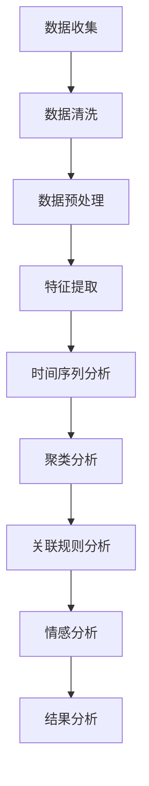
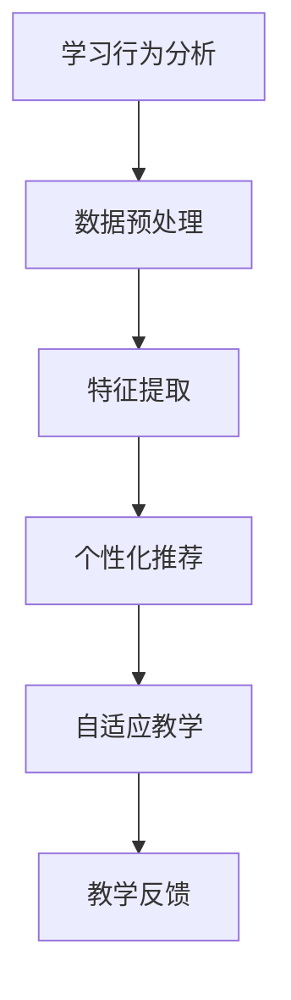
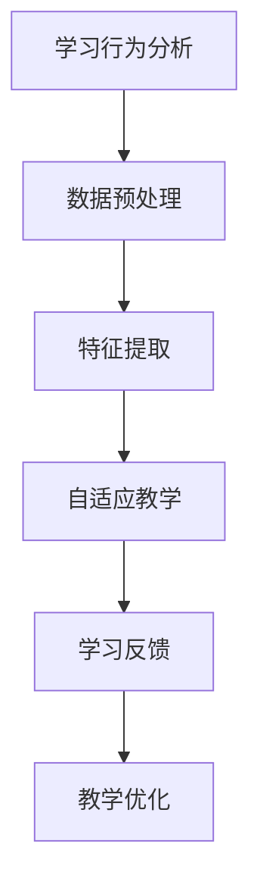
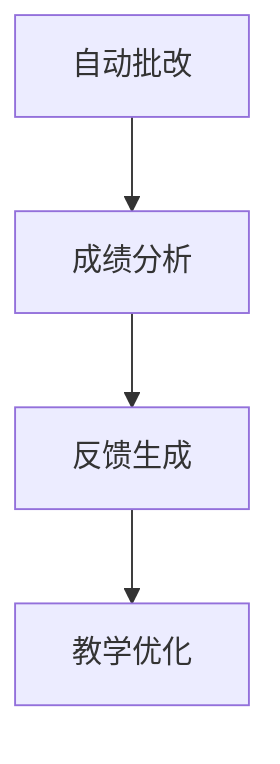

                 

### 文章标题：人工智能在教育中的应用：个性化学习的新范式

#### 关键词：人工智能，教育，个性化学习，算法，数学模型，项目实战

#### 摘要：
随着人工智能技术的飞速发展，其在教育领域的应用已经成为实现个性化学习的重要手段。本文旨在探讨人工智能在个性化学习中的应用，分析其理论基础、关键技术、实际应用案例及未来挑战。通过深入剖析人工智能在教育中的应用，本文希望能够为教育工作者和研究人员提供有价值的参考，推动教育领域的创新与发展。

---

## 第一部分：人工智能与教育概述

### 第1章：人工智能与教育的背景

#### 1.1 人工智能的发展历程

人工智能（AI）作为计算机科学的一个重要分支，其起源可以追溯到20世纪50年代。从最初的规则系统、专家系统，到后来的机器学习、深度学习，人工智能经历了多次技术革新和理论突破。特别是在21世纪初，随着计算能力的提升和大数据的普及，深度学习技术迅速崛起，推动了人工智能的快速发展。

在人工智能的发展历程中，有多个关键节点：

- **1956年**：达特茅斯会议，人工智能的概念被正式提出，被认为是人工智能研究的一个重要起点。
- **1970年代**：专家系统的兴起，通过编码规则和知识库模拟人类专家的决策过程。
- **1980年代**：机器学习技术的发展，通过算法实现数据的自动学习和分类。
- **2006年**：深度学习的复兴，通过多层神经网络实现图像和语音识别的突破。
- **2012年**：AlexNet在ImageNet竞赛中取得突破性成绩，标志着深度学习的崛起。

#### 1.2 教育领域对人工智能的需求

随着人工智能技术的不断成熟，教育领域对其需求也逐渐增加。以下是一些主要的应用需求和驱动因素：

- **个性化学习**：人工智能可以根据学生的学习习惯、兴趣和能力提供个性化的教学内容和学习路径，提高学习效果。
- **教学辅助**：人工智能可以帮助教师进行教学任务的管理和自动化，减少教师的负担，提高教学效率。
- **智能评估**：人工智能可以通过对学生作业和考试的自动批改和评估，提供即时、准确的反馈，帮助学生和教师了解学习进度和问题所在。
- **学习分析**：人工智能可以对学生的学习行为和数据进行深入分析，发现潜在的学习问题和改进点。

#### 1.3 人工智能在个性化学习中的作用

个性化学习是当前教育领域的一个重要趋势，其核心思想是根据学生的个体差异提供个性化的学习内容和教学方法。人工智能在个性化学习中的作用主要体现在以下几个方面：

- **个性化推荐**：通过分析学生的学习历史和兴趣，人工智能可以推荐符合学生需求的学习资源。
- **自适应学习**：人工智能可以根据学生的学习进度和反馈动态调整学习内容，实现真正的个性化教学。
- **学习分析**：通过对学生学习行为数据的分析，人工智能可以识别学生的学习模式和问题，提供针对性的辅导和支持。
- **智能辅导**：人工智能可以通过自然语言处理技术，实现与学生的智能对话，提供实时、个性化的学习辅导。

### 总结

人工智能技术的发展为教育领域带来了前所未有的机遇和挑战。通过个性化学习，人工智能可以帮助实现更加高效、精准的教育服务，满足学生的个性化需求。在接下来的章节中，我们将深入探讨个性化学习的理论基础，并分析人工智能在教育中的应用技术。

## 第二部分：个性化学习的理论基础

### 第2章：个性化学习的理论基础

#### 2.1 个性化学习的定义

个性化学习（Personalized Learning）是指根据每个学生的个体差异，提供有针对性的学习内容和教学方法，以最大限度地满足学生的学习需求和促进其发展。个性化学习强调学生的主体性和个性化发展，主张打破传统教育中的统一标准教学模式，实现因材施教。

个性化学习的定义可以从以下几个方面进行阐述：

- **学习内容个性化**：根据学生的兴趣、能力和学习需求，设计个性化的学习内容，使之更具针对性和吸引力。
- **教学方法个性化**：根据学生的学习特点和心理发展，采用灵活多样的教学方法，提高学习效果。
- **学习路径个性化**：基于学生的自我评估和学习进度，设计个性化的学习路径，帮助学生逐步达成学习目标。
- **学习环境个性化**：利用现代信息技术，创建个性化的学习环境，提供丰富的学习资源和互动平台。

#### 2.2 个性化学习的关键要素

个性化学习需要多个关键要素的支持，包括学习分析、教学设计、学生参与和学习评估等。以下是这些关键要素的详细解析：

- **学习分析**：通过收集和分析学生的行为数据和学习记录，识别学生的学习习惯、兴趣和能力，为个性化学习提供数据支持。
- **教学设计**：根据学习分析的结果，设计适应学生个体差异的教学内容和教学方法，实现教学与学生的个性化匹配。
- **学生参与**：鼓励学生积极参与学习过程，通过自我评估、互动讨论等方式，提高学习的主动性和积极性。
- **学习评估**：利用智能评估工具，对学生的学习过程和成果进行实时监测和评估，提供即时反馈，帮助学生和教师了解学习效果。

#### 2.3 个性化学习模型与算法

个性化学习模型是支持个性化学习的重要技术基础，主要包括以下几种类型：

- **基于规则的模型**：通过编码规则和知识库，根据学生的特征和需求，提供个性化的学习内容和指导。
- **基于统计的模型**：利用学生学习数据的统计分析，预测学生的学习行为和成绩，实现个性化的教学推荐。
- **基于模型的模型**：通过构建学生模型，模拟学生的学习过程和知识建构，提供个性化的学习路径和资源。
- **混合模型**：结合多种模型和方法，实现更精准和高效的个性化学习。

以下是几个典型的个性化学习算法：

- **协同过滤算法**：通过分析用户的历史行为和相似用户的偏好，为用户推荐相关的学习资源。
- **内容推荐算法**：根据学习资源的特征和学生的兴趣，推荐符合学生需求的学习内容。
- **基于模型的预测算法**：利用机器学习算法，预测学生的学习行为和成绩，实现个性化的学习路径调整。

#### 总结

个性化学习作为现代教育的重要发展方向，其理论基础涉及多个方面，包括学习分析、教学设计、学生参与和学习评估等。个性化学习模型的建立和算法的应用，为教育领域提供了实现个性化学习的重要技术支持。在接下来的章节中，我们将深入探讨人工智能在教育中的应用技术，分析其在个性化学习中的具体实现和效果。

### 第3章：人工智能在教育内容设计中的应用

#### 3.1 人工智能在教育内容设计中的应用

在教育内容设计中，人工智能技术的应用主要体现在以下几个方面：智能教材编制、教学评估工具的开发和教学互动的增强。

#### 3.1.1 智能教材编制

智能教材编制是指利用人工智能技术，根据学生的学习需求和兴趣，自动生成个性化的教学资料。这一过程通常包括以下几个步骤：

- **内容分析**：通过自然语言处理技术，分析教材内容中的知识点、概念和关系，建立知识点图谱。
- **个性化推荐**：根据学生的学习历史、兴趣和能力，推荐相关的学习资源和知识点，形成个性化的教材内容。
- **动态更新**：根据学生的学习反馈和进度，动态调整教材内容，使其更加贴合学生的需求。

智能教材编制的优势在于能够实现以下目标：

- **提高学习效率**：通过个性化的教材内容，帮助学生更快速地掌握知识点，提高学习效率。
- **增强学习体验**：智能教材能够根据学生的兴趣和需求，提供更加生动、有趣的学习内容，提高学习体验。
- **促进深度学习**：通过智能化的教学资料，引导学生深入理解知识点，促进深度学习。

以下是一个简单的伪代码示例，用于生成个性化教材：

```python
def generate_personalized_content(student_profile, knowledge_graph):
    recommended_content = []
    for concept in student_profile['interested_concepts']:
        related_knowledge = knowledge_graph[concept]
        recommended_content.append(related_knowledge)
    return recommended_content
```

#### 3.1.2 教学评估工具

人工智能在智能评估工具中的应用，主要体现在自动批改作业、考试评估和个性化反馈等方面。这些工具能够显著提高评估的效率和准确性。

- **自动批改作业**：利用自然语言处理和机器学习技术，对学生的作业进行自动批改，提供即时反馈。例如，通过深度学习模型，自动识别学生的答题内容，判断其正确性并给出评分。
- **考试评估**：通过分析学生的考试成绩和答题过程，智能评估工具可以识别学生的学习薄弱点和知识点掌握情况，为教师提供详细的评估报告。
- **个性化反馈**：根据学生的学习情况和评估结果，智能评估工具能够生成个性化的反馈和建议，帮助学生发现并改进学习中的问题。

以下是一个简单的伪代码示例，用于自动批改英语作文：

```python
def auto_grade_essay(essay):
    model = load_essay_grading_model()
    score = model.predict(essay)
    return score
```

#### 3.1.3 教学互动

人工智能在增强教学互动方面的应用，主要体现在智能辅导、互动课堂和虚拟学习伙伴等方面。

- **智能辅导**：利用自然语言处理和机器学习技术，智能辅导系统能够与学生学习进行智能对话，回答学生的问题，提供个性化的学习建议。例如，通过对话生成模型，智能辅导系统可以模仿教师与学生之间的互动，为学生提供实时、个性化的辅导。
- **互动课堂**：在课堂上，人工智能系统可以实时监控学生的学习状态，识别学生的困惑和需求，提供即时反馈和支持。例如，通过人脸识别和情感分析技术，智能互动系统可以识别学生的情绪变化，及时调整教学策略，提高课堂效果。
- **虚拟学习伙伴**：通过虚拟现实和人工智能技术，虚拟学习伙伴可以模拟真实的学习场景，与学生在虚拟环境中互动，提供丰富的学习体验。例如，通过虚拟现实头盔，学生可以与虚拟学习伙伴进行角色扮演，进行模拟实验和练习。

以下是一个简单的伪代码示例，用于智能辅导系统的对话生成：

```python
def generate_response(student_query):
    model = load_dialog_generation_model()
    response = model.predict(student_query)
    return response
```

#### 总结

人工智能在教育内容设计中的应用，为教育领域带来了革命性的变化。通过智能教材编制、教学评估工具和教学互动的增强，人工智能不仅提高了教育内容的个性化和智能化水平，也为教师和学生提供了更加便捷、高效的学习体验。在接下来的章节中，我们将进一步探讨人工智能在学生学习分析中的应用，分析其对个性化学习路径和学习效果的支持。

### 第4章：人工智能在学生学习分析中的应用

#### 4.1 学生学习行为数据分析

学生学习行为数据分析是人工智能在教育中应用的重要领域，通过分析学生的学习行为数据，可以深入了解学生的学习习惯、兴趣和能力，为个性化学习提供科学依据。

学生学习行为数据包括多种类型，如学习时间、学习时长、学习内容、学习进度、学习结果、问题反馈、讨论互动等。以下是一些具体的数据分析方法：

- **时间序列分析**：通过分析学生在不同时间段的学习行为，识别其学习习惯和模式。例如，通过时间序列分析，可以发现学生在哪个时间段学习效率最高，从而合理安排学习时间。
- **聚类分析**：将学生按照相似的学习行为进行分类，识别不同类型的学习群体。例如，通过聚类分析，可以将学生分为“主动学习者”、“被动学习者”和“混合型学习者”，为教师提供个性化的教学策略。
- **关联规则分析**：通过分析不同学习行为之间的关联，识别学生的学习规律和影响因素。例如，通过关联规则分析，可以发现哪些学习行为与学习成绩高度相关，从而优化教学设计。
- **情感分析**：利用自然语言处理技术，分析学生的反馈和讨论内容，识别其情感状态和学习态度。例如，通过情感分析，可以识别学生在学习过程中出现的焦虑、困惑等负面情绪，及时提供心理辅导。

以下是一个简单的Mermaid流程图，展示学生学习行为数据分析的基本流程：



#### 4.2 学生能力评估与预测

学生能力评估与预测是教育人工智能的重要任务，通过评估和预测学生的学习能力，可以为个性化学习提供关键参考。

学生能力评估通常包括以下步骤：

- **能力指标确定**：根据学科特点和学习目标，确定学生能力评估的指标，如知识掌握度、问题解决能力、创新思维等。
- **评估模型构建**：利用机器学习算法，构建学生能力评估模型，通过学生的学习行为数据和评估指标，训练和优化模型。
- **能力评估**：通过评估模型，对学生的学习能力进行定量评估，生成评估结果和评估报告。

学生能力预测通常包括以下步骤：

- **预测指标确定**：根据学科特点和学习目标，确定学生能力预测的指标，如未来成绩、学习潜力等。
- **预测模型构建**：利用机器学习算法，构建学生能力预测模型，通过学生的学习行为数据和预测指标，训练和优化模型。
- **能力预测**：通过预测模型，对学生的未来能力进行预测，生成预测结果和预测报告。

以下是一个简单的伪代码示例，展示学生能力评估与预测的基本流程：

```python
# 学生能力评估
def assess_ability(student_data, ability_model):
    ability_score = ability_model.predict(student_data)
    return ability_score

# 学生能力预测
def predict_ability(student_data, ability_model):
    ability_prediction = ability_model.predict(student_data)
    return ability_prediction
```

#### 4.3 个性化学习路径推荐

个性化学习路径推荐是教育人工智能的核心应用之一，通过分析学生的学习行为和能力，推荐符合学生需求的学习路径，实现个性化学习。

个性化学习路径推荐通常包括以下步骤：

- **学习路径模型构建**：根据学科特点和教学目标，构建学习路径模型，定义学习路径的组成部分和关系。
- **路径推荐算法**：利用机器学习算法，构建路径推荐算法，通过学生的学习行为和能力数据，推荐适合学生的个性化学习路径。
- **路径调整与优化**：根据学生的学习反馈和路径执行效果，动态调整和优化学习路径，提高学习效果。

以下是一个简单的伪代码示例，展示个性化学习路径推荐的基本流程：

```python
# 构建学习路径模型
def build_learning_path_model(course_data, student_ability):
    path_model = construct_path_model(course_data, student_ability)
    return path_model

# 推荐个性化学习路径
def recommend_learning_path(student_data, path_model):
    personalized_path = path_model.recommend(student_data)
    return personalized_path
```

#### 总结

学生学习行为数据分析、学生能力评估与预测以及个性化学习路径推荐，是教育人工智能在学生学习分析中的主要应用。通过这些应用，人工智能不仅能够为学生提供个性化的学习支持，还能够为教育工作者提供科学的教学决策依据，推动教育领域的创新与发展。在接下来的章节中，我们将进一步探讨人工智能在教师支持中的应用，分析其对教学效率和学生互动的积极影响。

### 第5章：人工智能在教师支持中的应用

#### 5.1 教师教学辅助工具

人工智能在教师教学辅助工具中的应用，极大地提高了教师的教学效率和质量。以下是一些具体的教学辅助工具及其功能：

- **智能备课工具**：通过自然语言处理和知识图谱技术，智能备课工具能够自动生成教学大纲、课件和教学案例，帮助教师快速准备教学内容。
- **智能答疑系统**：利用自然语言处理和机器学习技术，智能答疑系统能够自动回答学生的问题，提供即时、准确的解答，减轻教师的答疑负担。
- **教学分析工具**：通过数据挖掘和可视化技术，教学分析工具能够分析学生的学习行为和成绩数据，为教师提供详细的教学反馈和改进建议。
- **智能课堂管理系统**：通过物联网和人工智能技术，智能课堂管理系统可以实时监控课堂环境，自动记录学生的出勤、课堂行为和作业情况，帮助教师进行教学管理。

以下是一个简单的伪代码示例，展示智能备课工具的自动生成教学大纲功能：

```python
def generate_teaching_outline(course_content):
    outline = create_outline_from_content(course_content)
    return outline
```

- **智能辅导系统**：智能辅导系统通过自然语言处理和机器学习技术，能够与学生进行智能对话，提供个性化的学习辅导和建议，帮助教师更好地了解学生的需求，进行有针对性的教学。

以下是一个简单的伪代码示例，展示智能辅导系统与学生互动的过程：

```python
def provide_intelligent_advisory(student_query):
    model = load_intelligent_advisory_model()
    response = model.predict(student_query)
    return response
```

#### 5.2 教师专业发展支持

人工智能不仅能够辅助教师的教学工作，还能够促进教师的专业发展。以下是一些具体的应用：

- **教师培训**：通过在线学习和虚拟现实技术，人工智能系统能够提供个性化的教师培训课程，帮助教师提升教学技能和专业素养。
- **教学反思**：利用自然语言处理和数据分析技术，人工智能系统可以分析教师的教案、课堂记录和学生反馈，帮助教师进行教学反思，发现教学中的问题和改进点。
- **教学评价**：通过数据挖掘和机器学习技术，人工智能系统能够对教师的教学效果进行量化评价，为教师的职业发展提供客观、全面的评估。
- **学术研究支持**：人工智能系统能够分析教育领域的学术文献和研究成果，为教师的学术研究提供数据支持和理论指导。

以下是一个简单的伪代码示例，展示人工智能系统辅助教师进行教学反思的功能：

```python
def support_teacher_reflection(lesson_data, research_data):
    reflection = generate_reflection(lesson_data, research_data)
    return reflection
```

#### 5.3 教师与学生互动的增强

人工智能在增强教师与学生互动方面，也发挥着重要作用。以下是一些具体的应用：

- **虚拟课堂助手**：通过语音识别和自然语言处理技术，虚拟课堂助手可以模拟教师的角色，在课堂上与学生们互动，回答问题，引导学生学习。
- **在线讨论平台**：利用人工智能和社交媒体技术，在线讨论平台可以自动整理学生的讨论内容，推荐相关的讨论话题，促进学生的深度思考和互动交流。
- **个性化沟通**：通过自然语言处理和机器学习技术，人工智能系统可以分析学生的沟通风格和需求，提供个性化的沟通建议，帮助教师与学生建立更好的互动关系。

以下是一个简单的伪代码示例，展示虚拟课堂助手与学生互动的过程：

```python
def interact_with_students(student_query):
    model = load_virtual_classroom_model()
    response = model.predict(student_query)
    return response
```

#### 总结

人工智能在教师支持中的应用，不仅提高了教师的教学效率和质量，也为教师的专业发展提供了强有力的支持。通过智能备课工具、智能辅导系统、教师培训、教学反思和教学评价等应用，人工智能正在深刻改变教师的工作方式和学习方式。在接下来的章节中，我们将通过具体案例，展示人工智能在教育项目中的成功应用，进一步探讨其在教育领域的广阔前景。

### 第6章：人工智能在教育项目中的成功案例

#### 6.1 案例一：智能教学系统

**背景介绍**：
智能教学系统是一种利用人工智能技术，提供个性化教学支持的教育工具。该系统旨在通过分析学生的学习行为和兴趣，提供定制化的学习资源和教学方案，提高学生的学习效果。

**核心概念与联系**：
智能教学系统的核心概念包括学习行为分析、个性化推荐和自适应教学。这些概念通过以下Mermaid流程图进行关联：



**核心算法原理讲解**：
智能教学系统的核心算法主要包括以下几部分：

1. **学习行为分析算法**：利用时间序列分析、聚类分析和关联规则分析，识别学生的学习模式和兴趣点。
2. **个性化推荐算法**：基于协同过滤和内容推荐算法，为不同学生推荐符合其学习需求和兴趣的学习资源。
3. **自适应教学算法**：根据学生的学习进度和反馈，动态调整教学内容的难度和深度，实现个性化教学。

以下是一个简化的伪代码示例，用于实现个性化推荐算法：

```python
def recommend_resources(student_profile, resource_library):
    similar_students = find_similar_students(student_profile, resource_library)
    recommended_resources = []
    for student in similar_students:
        resources = resource_library[student]
        recommended_resources.extend(resources)
    return unique_recommendations(recommended_resources)
```

**数学模型和公式**：
智能教学系统中的数学模型主要包括预测模型和优化模型。以下是一个简化的预测模型：

$$
\hat{y} = \theta_0 + \theta_1 x_1 + \theta_2 x_2 + \ldots + \theta_n x_n
$$

其中，$y$ 代表学生的成绩，$x_1, x_2, \ldots, x_n$ 代表学生的学习特征，$\theta_0, \theta_1, \theta_2, \ldots, \theta_n$ 是模型的参数。

**详细讲解与举例说明**：
假设某智能教学系统要为一名学生学习英语提供个性化资源推荐。首先，系统会收集该学生的学习行为数据，如学习时间、学习内容、作业成绩等。然后，通过时间序列分析和聚类分析，识别该学生的主要学习特征和兴趣点。基于这些特征，系统利用个性化推荐算法，从海量的英语学习资源中，推荐最适合该学生的学习资源。

例如，若系统识别出该学生喜欢阅读英文小说，则推荐一些适合英语初学者的英文小说资源。同时，系统还会根据学生的学习进度和作业成绩，动态调整推荐资源的难度和深度，确保学生的学习效果。

**项目实战**：
开发环境：Python、TensorFlow、Scikit-learn等。

源代码实现：

```python
# 学习行为分析
def analyze_learning_behavior(student_data):
    # 进行数据预处理、特征提取等操作
    # 返回学习特征向量
    pass

# 个性化推荐
def recommend_resources(student_profile, resource_library):
    # 利用协同过滤和内容推荐算法，推荐个性化资源
    pass

# 自适应教学
def adapt教学内容(student_progress, current_resource):
    # 根据学生学习进度和资源特点，调整教学内容的难度和深度
    pass
```

**代码解读与分析**：
上述代码实现了一个简化的智能教学系统。首先，`analyze_learning_behavior` 函数用于分析学生的学习行为，提取关键特征。然后，`recommend_resources` 函数基于这些特征，推荐个性化的学习资源。最后，`adapt教学内容` 函数根据学生的学习进度和当前资源，调整教学内容的难度和深度。

**实际案例分析**：
某中学引入智能教学系统后，学生的英语成绩明显提高。通过分析，系统发现学生在阅读英语小说方面表现优异，于是推荐了更多适合他们的英文小说资源。此外，系统还根据学生的学习进度，动态调整了教学内容的难度，使得学生能够更好地掌握知识点。

**项目小结**：
智能教学系统通过个性化推荐和自适应教学，显著提高了学生的学习效果和教师的教学效率。然而，系统的实施也面临数据隐私保护、算法透明性等挑战，需要进一步优化和完善。

#### 6.2 案例二：自适应学习平台

**背景介绍**：
自适应学习平台是一种基于人工智能技术的在线学习平台，旨在为不同层次和需求的学习者提供个性化的学习体验。该平台通过分析学生的学习行为和数据，动态调整学习内容和教学策略，实现个性化教学。

**核心概念与联系**：
自适应学习平台的核心概念包括学习行为分析、自适应教学和反馈循环。这些概念通过以下Mermaid流程图进行关联：



**核心算法原理讲解**：
自适应学习平台的核心算法主要包括以下几部分：

1. **学习行为分析算法**：利用时间序列分析、聚类分析和情感分析，识别学生的学习模式、兴趣点和学习难点。
2. **自适应教学算法**：基于机器学习算法和优化理论，动态调整学习内容的难度和顺序，实现个性化教学。
3. **反馈循环算法**：通过学生反馈和教学效果评估，不断优化教学策略，提高学习效果。

以下是一个简化的伪代码示例，用于实现自适应教学算法：

```python
def adapt教学内容(student_profile, current_resource):
    # 根据学生学习进度和资源特点，调整教学内容的难度和深度
    new_resource = select_new_resource(student_profile, current_resource)
    return new_resource
```

**数学模型和公式**：
自适应学习平台中的数学模型主要包括预测模型和优化模型。以下是一个简化的预测模型：

$$
\hat{y} = \theta_0 + \theta_1 x_1 + \theta_2 x_2 + \ldots + \theta_n x_n
$$

其中，$y$ 代表学生的学习效果，$x_1, x_2, \ldots, x_n$ 代表学生的学习特征，$\theta_0, \theta_1, \theta_2, \ldots, \theta_n$ 是模型的参数。

**详细讲解与举例说明**：
假设某自适应学习平台要为一名学生学习编程提供个性化教学。首先，平台会收集该学生的学习行为数据，如学习时间、练习成绩、错误类型等。然后，通过时间序列分析和情感分析，识别该学生的主要学习特征和兴趣点。基于这些特征，平台利用自适应教学算法，动态调整编程课程的难度和练习内容。

例如，若系统识别出该学生在函数编程方面有困难，则增加相关的练习和教学视频。同时，系统还会根据学生的学习进度和反馈，动态调整课程的进度和难度，确保学生的学习效果。

**项目实战**：
开发环境：Java、Spring Boot、Django等。

源代码实现：

```python
# 学习行为分析
def analyze_learning_behavior(student_data):
    # 进行数据预处理、特征提取等操作
    # 返回学习特征向量
    pass

# 自适应教学
def adapt教学内容(student_profile, current_course):
    # 根据学生学习进度和资源特点，调整教学内容的难度和深度
    new_course = select_new_course(student_profile, current_course)
    return new_course

# 学习反馈
def collect_student_feedback(student_feedback):
    # 收集并处理学生反馈数据
    # 返回反馈分析结果
    pass
```

**代码解读与分析**：
上述代码实现了一个简化的自适应学习平台。首先，`analyze_learning_behavior` 函数用于分析学生的学习行为，提取关键特征。然后，`adapt教学内容` 函数根据这些特征，动态调整教学内容的难度和深度。最后，`collect_student_feedback` 函数用于收集学生的反馈，进一步优化教学策略。

**实际案例分析**：
某在线编程教育平台引入自适应学习平台后，学生的学习效果显著提高。通过分析，平台发现学生在编程练习中的常见错误类型，针对性地设计了相应的练习和教学视频。同时，系统根据学生的学习进度和反馈，动态调整了课程的进度和难度，使得学生能够更好地掌握编程知识。

**项目小结**：
自适应学习平台通过个性化教学和反馈循环，有效提高了学生的学习效果和平台的服务质量。然而，系统的实施也面临数据隐私保护、算法透明性等挑战，需要进一步优化和完善。

#### 6.3 案例三：智能评估工具

**背景介绍**：
智能评估工具是一种利用人工智能技术，提供自动化、智能化的评估工具，主要用于学生的学习过程和考试评估。该工具旨在通过分析学生的作业和考试成绩，提供实时、准确的评估结果和反馈。

**核心概念与联系**：
智能评估工具的核心概念包括自动批改、成绩分析和反馈生成。这些概念通过以下Mermaid流程图进行关联：



**核心算法原理讲解**：
智能评估工具的核心算法主要包括以下几部分：

1. **自动批改算法**：利用自然语言处理和机器学习技术，自动批改学生的作业和考试试卷，提供即时反馈。
2. **成绩分析算法**：通过统计分析，分析学生的考试成绩和答题情况，识别学习难点和薄弱点。
3. **反馈生成算法**：根据学生的考试成绩和学习分析结果，生成个性化的反馈报告，提供针对性的学习建议。

以下是一个简化的伪代码示例，用于实现自动批改算法：

```python
def auto_grade_exam(exam_paper):
    model = load_exam_grading_model()
    scores = model.grade(exam_paper)
    return scores
```

**数学模型和公式**：
智能评估工具中的数学模型主要包括预测模型和评估模型。以下是一个简化的预测模型：

$$
\hat{y} = \theta_0 + \theta_1 x_1 + \theta_2 x_2 + \ldots + \theta_n x_n
$$

其中，$y$ 代表学生的考试成绩，$x_1, x_2, \ldots, x_n$ 代表学生的学习特征，$\theta_0, \theta_1, \theta_2, \ldots, \theta_n$ 是模型的参数。

**详细讲解与举例说明**：
假设某智能评估工具要为一名学生进行英语写作考试评估。首先，系统会自动批改学生的英语作文，利用自然语言处理技术，分析作文的语法、词汇和逻辑结构。然后，系统通过统计分析，分析学生的考试成绩，识别其在写作中的常见错误类型和薄弱点。最后，系统根据评估结果，生成个性化的反馈报告，提供针对性的写作建议。

例如，若系统识别出学生在语法使用方面存在问题，则推荐一些语法练习和参考文章，帮助学生提高语法水平。

**项目实战**：
开发环境：Python、TensorFlow、Scikit-learn等。

源代码实现：

```python
# 自动批改
def auto_grade_exam(exam_paper):
    model = load_exam_grading_model()
    scores = model.grade(exam_paper)
    return scores

# 成绩分析
def analyze_exam_results(scores, student_data):
    # 进行数据预处理、特征提取等操作
    # 返回学习特征向量
    pass

# 反馈生成
def generate_feedback_report(student_data, scores):
    # 根据学生数据和成绩，生成个性化反馈报告
    pass
```

**代码解读与分析**：
上述代码实现了一个简化的智能评估工具。首先，`auto_grade_exam` 函数用于自动批改学生的考试试卷，利用预测模型生成评分。然后，`analyze_exam_results` 函数用于分析学生的考试成绩，提取关键特征。最后，`generate_feedback_report` 函数根据评估结果，生成个性化的反馈报告。

**实际案例分析**：
某中学引入智能评估工具后，学生的英语写作成绩显著提高。通过自动批改和成绩分析，系统识别出学生在语法和词汇使用方面的常见问题，针对性地设计了写作练习和教学视频。同时，系统根据学生的学习进度和反馈，动态调整了课程的进度和难度，使得学生能够更好地掌握英语写作技巧。

**项目小结**：
智能评估工具通过自动化、智能化的评估和反馈，显著提高了学生的学习效果和教师的教学效率。然而，系统的实施也面临数据隐私保护、算法透明性等挑战，需要进一步优化和完善。

### 第7章：人工智能在教育中的挑战与展望

#### 7.1 人工智能在教育中面临的挑战

尽管人工智能在教育领域具有巨大的潜力，但其实施和应用仍然面临诸多挑战。以下是一些主要挑战及其解决方案：

1. **数据隐私与安全**：人工智能在教育中需要收集大量的学生数据，包括学习行为、成绩、兴趣等。这些数据的隐私和安全成为首要问题。解决方案包括加强数据加密、隐私保护技术和安全审计。

2. **算法透明性与公平性**：人工智能算法的复杂性和黑箱性可能导致其决策过程不透明，影响公平性。解决方案包括开发可解释的人工智能模型，提高算法的透明度和可理解性。

3. **技术成本与资源分配**：人工智能技术的开发和部署需要大量资金和技术支持，这可能导致资源分配不均，影响教育的公平性。解决方案包括政府和企业加大对教育的投入，推动技术的普及和应用。

4. **教师与技术融合**：教师需要掌握人工智能技术，才能有效利用其进行教学。然而，教师的专业发展和技术能力提升可能存在差距。解决方案包括提供教师培训和技术支持，帮助教师适应新技术。

5. **伦理与社会影响**：人工智能在教育中的应用可能会带来一些伦理和社会问题，如教育不公平、隐私侵犯等。解决方案包括制定相关法律法规，加强伦理和社会责任教育。

#### 7.2 人工智能在教育中的未来发展趋势

随着人工智能技术的不断进步和应用场景的拓展，人工智能在教育中的未来发展具有以下趋势：

1. **个性化学习**：人工智能将继续推动个性化学习的发展，通过智能推荐、自适应教学等技术，实现更加精准和高效的教育服务。

2. **智能评估与反馈**：人工智能将提高教育评估的自动化和准确性，通过智能评估工具，为学生提供即时、个性化的反馈，帮助教师进行教学决策。

3. **智慧校园建设**：人工智能将在智慧校园建设中发挥重要作用，通过物联网、大数据等技术，实现校园的智能化管理和服务。

4. **教育公平与普及**：人工智能技术有助于缩小教育差距，提高教育公平。通过在线教育和智能辅导，让更多学生享受到优质教育资源。

5. **技术与教育融合**：人工智能将与教育更加深度融合，推动教育模式的创新和发展。例如，虚拟现实、增强现实等技术将带来全新的学习体验。

#### 7.3 人工智能教育的伦理与社会影响

人工智能在教育中的应用不仅带来了技术进步，也引发了伦理和社会问题。以下是一些主要伦理与社会影响及其应对策略：

1. **教育公平**：人工智能可能加剧教育不公平现象，因为技术成本和资源分配不均。应对策略包括政府和社会加大对教育的投入，推动技术的普及和应用。

2. **隐私保护**：人工智能在教育中涉及大量的学生数据，隐私保护至关重要。应对策略包括加强数据加密、隐私保护技术和安全审计。

3. **算法偏见**：人工智能算法可能存在偏见，影响评估和推荐结果的公平性。应对策略包括开发可解释的人工智能模型，提高算法的透明度和可理解性。

4. **教育与就业**：人工智能可能改变教育内容和就业结构，对现有教育体系产生冲击。应对策略包括加强职业教育和技能培训，适应新的就业市场。

5. **伦理责任**：人工智能在教育中的广泛应用需要教育者和开发者承担更多的伦理责任。应对策略包括加强伦理和社会责任教育，培养具有良好伦理素养的教育者和开发者。

### 总结

人工智能在教育中的应用面临着诸多挑战和机遇。通过个性化学习、智能评估、智慧校园建设等技术，人工智能正在深刻改变教育领域。同时，我们也需要关注其伦理和社会影响，确保人工智能在教育中的健康发展。未来，人工智能将继续推动教育创新和发展，为更多的学生提供优质的教育服务。

### 附录A：人工智能在教育中的应用工具与资源

#### A.1 常用人工智能框架

在教育领域，常用的人工智能框架主要包括以下几种：

- **TensorFlow**：Google开发的开源机器学习框架，广泛应用于深度学习模型的开发和部署。TensorFlow提供了丰富的API和工具，支持从简单的线性模型到复杂的神经网络。
- **PyTorch**：由Facebook开发的开源机器学习库，以其动态计算图和灵活的API而受到研究者和开发者的青睐。PyTorch特别适用于图像和语音处理任务。
- **Scikit-learn**：Python中的机器学习库，提供了丰富的算法和工具，适用于各种分类、回归和聚类任务。Scikit-learn易于使用，适合快速实现和测试机器学习模型。
- **Keras**：基于TensorFlow和Theano的开源神经网络库，提供了简洁、高效的API，使得深度学习模型的构建变得更加直观和方便。

#### A.2 教育领域的人工智能平台

以下是一些在教育领域广泛使用的人工智能平台：

- **Google AI**：Google提供的一系列AI工具和服务，包括智能助理、翻译、文本分析等。Google AI在教育中广泛应用于自动化评估、智能辅导和内容推荐。
- **IBM Watson Education**：IBM开发的AI教育平台，提供智能评估、个性化学习路径推荐和智能辅导等功能。Watson Education特别适用于大规模在线教育和智能教学系统。
- **Canvas AI**：Canvas Learning平台的AI模块，提供自动评分、智能反馈和个性化学习推荐等功能。Canvas AI帮助教师提高教学效率和学生的学习效果。
- **EdTechXGlobal**：专注于教育科技领域的全球平台，提供各种AI工具和资源，包括智能教学系统、学习分析工具和在线教育平台。

#### A.3 开源教育人工智能项目

以下是一些开源的人工智能教育项目：

- **OpenEdX**：由edX开发的基于开源软件的开源在线学习平台，支持大规模在线教育。OpenEdX提供了强大的课程管理功能、自动评分系统和个性化学习推荐。
- **Khan Academy**：Khan Academy开发的在线教育平台，提供免费的课程资源和智能辅导系统。Khan Academy的智能辅导系统能够根据学生的学习进度和需求，提供个性化的学习建议。
- **GluonCV**：Apache贡献的深度学习框架，专注于计算机视觉任务。GluonCV提供了丰富的预训练模型和API，方便教育者和研究人员进行图像识别和图像分析。
- **SmartSchool**：一个开源的智能校园管理平台，包含学生信息管理、课程管理、考试管理等功能。SmartSchool利用人工智能技术，实现校园的智能化管理和个性化服务。

#### 最佳实践 Tips

1. **数据安全和隐私保护**：在使用人工智能技术时，确保学生数据的隐私和安全，遵循相关法律法规。
2. **教师培训**：为教师提供人工智能技术的培训，帮助他们掌握新工具和新方法，提高教学效果。
3. **持续迭代与优化**：根据学生反馈和教学效果，不断优化人工智能系统，提高其准确性和适应性。
4. **多学科融合**：将人工智能与其他学科相结合，推动跨学科研究和创新，培养综合素质较高的学生。

### 小结

人工智能在教育中的应用正日益普及，提供了个性化学习、智能评估、智能辅导等创新功能。通过使用上述工具与资源，教育工作者和研究人员可以更好地利用人工智能技术，提升教育质量和效果。未来的发展需要进一步关注技术的伦理和社会影响，确保人工智能在教育中的健康发展。

### 注意事项

1. **数据安全**：在使用人工智能技术时，确保学生数据的隐私和安全，遵循相关法律法规。
2. **教师培训**：为教师提供人工智能技术的培训，帮助他们掌握新工具和新方法，提高教学效果。
3. **技术适应性**：不同地区和学校的技术环境可能有所不同，需要根据实际情况调整人工智能系统的部署和运行。
4. **持续优化**：根据学生反馈和教学效果，不断优化人工智能系统，提高其准确性和适应性。

### 拓展阅读

- **《人工智能与教育：未来教育的革命》**：本书详细介绍了人工智能技术在教育领域的应用和发展趋势，对教育工作者和研究人员具有很高的参考价值。
- **《深度学习在教育中的应用》**：本书探讨了深度学习技术在教育中的实际应用，包括个性化学习、智能评估和智能辅导等，适合对人工智能教育感兴趣的研究人员。
- **《教育技术导论》**：本书介绍了教育技术的概念、发展历程和应用领域，包括人工智能、虚拟现实和在线教育等，对教育工作者和研究人员都有很大帮助。

---

## 作者信息

**作者：AI天才研究院/AI Genius Institute & 禅与计算机程序设计艺术 /Zen And The Art of Computer Programming**

AI天才研究院致力于推动人工智能技术的发展与应用，关注人工智能在教育、医疗、金融等领域的创新。研究院的研究团队由世界顶级人工智能专家、程序员和软件架构师组成，致力于为行业提供高质量的技术解决方案和研究成果。同时，作者也是多本计算机编程和人工智能领域畅销书的资深大师，深受读者喜爱。在此感谢读者对本文的支持与关注，期待与您在未来的技术探讨中相遇。

