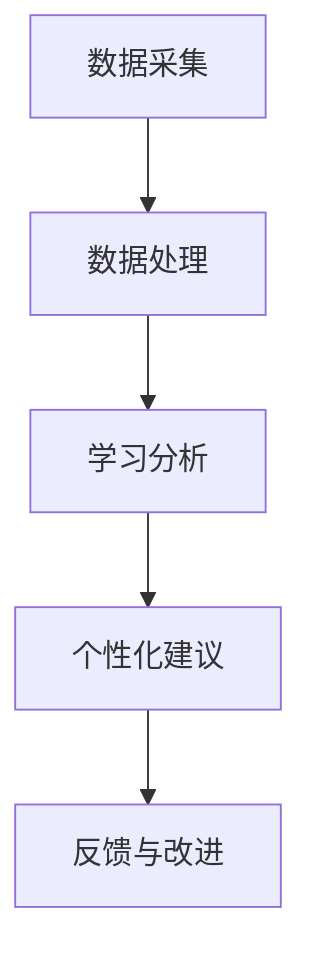
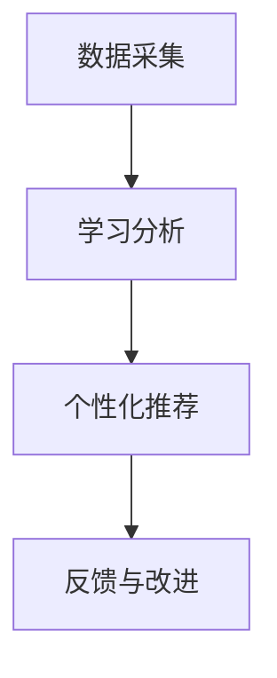
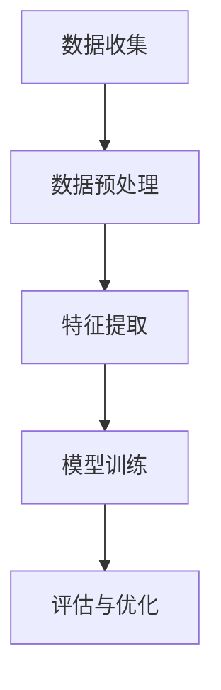
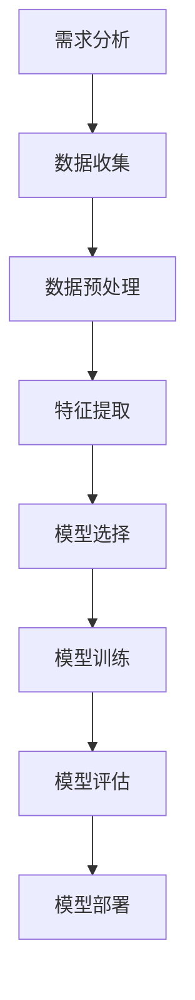

                 

### 目录

## 第一部分: 人工智能在教育评估中的应用基础

### 第1章: 人工智能与教育评估概述

#### 1.1 人工智能的发展与教育评估的需求

人工智能（AI）是一门集计算机科学、统计学、数学和认知科学于一体的跨学科领域，旨在使计算机系统具备模拟、延伸和扩展人类智能的能力。从20世纪50年代诞生至今，人工智能经历了多次起伏，但近年来随着大数据、云计算和深度学习的迅速发展，人工智能逐渐成为推动社会进步的重要力量。

在教育评估领域，传统的教育评估方法主要依赖于教师的主观判断和标准化的考试，这种方式在评估学生的知识掌握程度和学习成果方面存在一定的局限性。而人工智能的出现，为教育评估带来了新的机遇和挑战。

首先，人工智能可以通过大数据分析，帮助学生和教师更全面、深入地了解学生的学习过程和学习成果。例如，通过分析学生的学习行为数据，人工智能可以预测学生的学习困难和潜在的学习需求，从而为教师提供有针对性的教学建议。

其次，人工智能可以帮助学校和学生更好地管理教育资源。例如，通过智能排课系统，学校可以根据学生的学习进度和教师的教学安排，自动生成最优的课表，从而提高教学效率。

然而，人工智能在教育评估中的应用也面临一些挑战。例如，如何确保人工智能算法的公平性和透明性，如何保护学生的隐私和数据安全，这些都是需要深入探讨的问题。

#### 1.2 教育评估的现状与挑战

当前，教育评估体系主要依赖于标准化的考试和考核，如高考、中考等。这些评估方式虽然在一定程度上能够衡量学生的学术水平，但存在以下问题：

1. **评估的全面性不足**：传统的教育评估主要关注学生的知识掌握程度，而忽视了学生的综合素质和创新能力。这导致学生在面对实际问题时，往往缺乏解决问题的能力。

2. **评估的公平性有待提高**：由于评估标准的主观性，不同地区、不同学校之间的教育评估结果存在较大差异，这可能导致一些优秀的学生因为地区或学校的原因而失去进一步发展机会。

3. **评估的及时性不足**：传统的教育评估通常是学期末或学年末进行，评估结果对教学过程的指导作用有限。而形成性评估则可以在教学过程中持续进行，及时反馈学生的学习状况，帮助教师调整教学策略。

4. **评估的成本较高**：传统的教育评估通常需要大量的人力和物力资源，而人工智能可以通过自动化和智能化的方式，降低评估成本，提高评估效率。

#### 1.3 人工智能在教育评估中的应用前景

随着人工智能技术的不断发展，其在教育评估中的应用前景十分广阔。以下是人工智能在教育评估中可能的应用方向：

1. **个性化评估**：通过分析学生的学习行为数据，人工智能可以为学生提供个性化的评估服务，帮助教师更好地了解每个学生的学习状况，从而制定更有效的教学计划。

2. **形成性评估**：形成性评估可以在教学过程中持续进行，及时反馈学生的学习状况，帮助教师及时发现和解决教学问题。人工智能可以自动化这一过程，提高评估的效率和质量。

3. **智能排课**：智能排课系统可以根据学生的学习进度和教师的教学安排，自动生成最优的课表，提高教学效率。

4. **学习资源管理**：人工智能可以帮助学校和学生更好地管理学习资源，如学习资料、课件和视频等，提高学习效率。

5. **学习预测和规划**：通过分析学生的学习行为数据，人工智能可以预测学生的学习成果和学习困难，帮助教师和学生提前做好学习规划和调整。

总之，人工智能在教育评估中的应用具有巨大的潜力，不仅可以提高评估的效率和质量，还可以帮助学生和教师更好地理解学生的学习过程和学习成果。随着人工智能技术的不断发展，我们有理由相信，人工智能将在教育评估中发挥越来越重要的作用。

### 第2章: 形成性评估的概念与原理

#### 2.1 形成性评估的定义

形成性评估（Formative Assessment）是一种在教学过程中持续进行的评估方式，旨在帮助学生和教师了解学生的学习过程和学习成果，以便及时调整教学策略和学习方法。与总结性评估（Summative Assessment）不同，形成性评估更注重评估过程中的反馈和改进，而不是最终的结果。

形成性评估通常包括以下几个方面：

1. **诊断性评估**：在教学开始时，通过评估学生的基础知识掌握情况，帮助教师了解学生的学习基础，从而制定合适的教学计划。

2. **过程性评估**：在教学过程中，通过定期评估学生的学习进度和理解程度，帮助教师及时发现和解决教学问题。

3. **自我评估**：学生通过自我反思和评估，了解自己的学习状况和进步情况，从而调整学习策略。

4. **同伴评估**：学生通过相互评估，了解同伴的学习状况，从而促进合作学习和共同进步。

#### 2.2 形成性评估的特点与作用

形成性评估具有以下几个显著特点：

1. **持续性**：形成性评估不是一次性的活动，而是在教学过程中持续进行的，有助于教师和学生随时了解学习状况。

2. **反馈性**：形成性评估注重反馈，通过评估结果及时反馈学生的学习情况，帮助教师调整教学策略和学生调整学习方法。

3. **灵活性**：形成性评估可以根据教学需要和学习目标灵活调整评估内容和形式，有助于提高评估的针对性和有效性。

4. **发展性**：形成性评估不仅关注学生的知识掌握情况，还关注学生的能力和素质，有助于促进学生全面发展。

形成性评估在教学中具有以下重要作用：

1. **改进教学**：通过形成性评估，教师可以及时发现教学中的问题，调整教学策略和方法，从而提高教学质量。

2. **促进学习**：形成性评估有助于学生了解自己的学习状况，发现学习中的问题，从而调整学习方法，提高学习效率。

3. **增强互动**：形成性评估可以促进学生之间的互动和合作，培养学生的团队合作精神和沟通能力。

4. **提高参与度**：形成性评估的反馈和改进过程可以增强学生的学习参与度和积极性，提高学生的学习动机。

#### 2.3 形成性评估的基本流程

形成性评估的基本流程通常包括以下几个步骤：

1. **制定评估目标**：明确形成性评估的目标，如诊断学生的学习基础、监测学习进度等。

2. **设计评估工具**：根据评估目标，设计合适的评估工具，如作业、测验、课堂讨论等。

3. **实施评估**：在教学过程中，按照评估工具进行评估，收集学生的评估数据。

4. **分析评估结果**：对评估结果进行分析，了解学生的学习状况，发现教学中的问题。

5. **反馈与改进**：根据评估结果，教师和学生进行反馈和改进，调整教学策略和学习方法。

6. **持续评估**：形成性评估是一个持续的过程，需要教师和学生不断进行评估和调整，以确保教学和学习效果。

通过上述流程，形成性评估可以有效地促进教学和学习，提高教学质量和学习效果。

### 第3章: 人工智能在形成性评估中的应用

#### 3.1 数据采集与处理

在形成性评估中，数据采集和处理是关键的一步。人工智能可以通过各种技术和工具，如传感器、学习平台、在线测评系统等，收集大量的学生学习行为数据。这些数据包括学生的作业完成情况、学习时长、问题回答、互动频率等。

数据处理是数据采集后的重要环节。通过数据清洗、去噪、归一化等预处理步骤，可以确保数据的质量和可靠性。然后，使用特征提取技术，将原始数据转换为可用于机器学习模型的特征向量。常用的特征提取方法包括词频分析、主题模型、情感分析等。

以下是一个简单的伪代码，用于描述数据采集与处理的过程：

```python
# 数据采集
data = collect_student_data(sensors, learning_platform, online_assessment_system)

# 数据清洗
clean_data = data_preprocessing(data)

# 特征提取
features = feature_extraction(clean_data)
```

#### 3.2 模型训练与优化

在获取和处理数据后，下一步是训练和优化机器学习模型。人工智能可以用来构建各种类型的模型，如回归模型、分类模型、聚类模型等，以分析学生的学习行为和表现。

训练模型的过程包括数据划分、模型选择、参数调优等步骤。常用的模型训练方法包括监督学习、无监督学习和半监督学习。监督学习模型需要标注数据，如分类问题中的正负样本；无监督学习模型不需要标注数据，如聚类问题；半监督学习模型结合了标注数据和未标注数据。

以下是一个简单的伪代码，用于描述模型训练与优化的过程：

```python
# 数据划分
train_data, test_data = train_test_split(features)

# 模型选择
model = select_model(train_data)

# 模型训练
model = train_model(model, train_data)

# 模型优化
model = optimize_model(model, test_data)
```

在训练模型时，常用的评估指标包括准确率、召回率、F1分数等。通过这些指标，可以评估模型的性能和可靠性。

#### 3.3 形成性评估的应用案例分析

人工智能在形成性评估中的应用可以通过多个案例进行分析。以下是一个典型的应用案例：

**案例：智能作业评估系统**

在一个高中数学课堂上，教师使用智能作业评估系统来收集学生的学习数据。系统通过在线平台和手机应用收集学生的作业提交情况、问题回答正确率、学习时长等数据。

1. **数据采集**：学生通过手机应用提交作业，系统自动收集数据。

2. **数据处理**：对收集的数据进行清洗和特征提取，转换为模型可用的特征向量。

3. **模型训练**：使用分类模型，如决策树、随机森林等，训练模型以预测学生的作业完成情况。

4. **模型评估**：通过交叉验证和测试集评估模型性能，调整模型参数以优化预测结果。

5. **形成性评估**：教师根据模型预测结果，为学生提供个性化的学习建议，如加强某个知识点的学习、调整学习策略等。

通过这个案例，可以看出人工智能在形成性评估中的应用可以极大地提高评估的准确性和效率。教师可以根据实时数据调整教学策略，学生可以根据个性化建议提高学习效果。

### 第4章: 个性化学习的概念与原理

#### 4.1 个性化学习的定义

个性化学习（Personalized Learning）是一种以学生为中心的教育理念，旨在根据每个学生的学习需求、兴趣和能力，提供定制化的学习体验。与传统的统一化、标准化的教学模式不同，个性化学习强调根据学生的个性差异，提供个性化的学习内容、学习方法和学习环境，从而提高学习效果和满足学生的全面发展需求。

个性化学习的主要特点包括：

1. **以学生为中心**：个性化学习关注学生的学习需求和兴趣，尊重学生的个体差异，为学生提供个性化的学习体验。

2. **定制化内容**：个性化学习根据学生的知识背景、学习目标和兴趣，提供定制化的学习内容，确保每个学生都能在适合自己的领域获得知识。

3. **灵活的学习方式**：个性化学习不限于传统的课堂学习，还包括在线学习、协作学习、项目式学习等多种形式，以满足学生的不同学习需求。

4. **持续性和动态性**：个性化学习是一个持续的过程，随着学生的成长和学习需求的变化，教师可以动态调整学习内容和教学方法。

#### 4.2 个性化学习的关键要素

个性化学习的关键要素包括以下几个方面：

1. **学习分析**：学习分析是个性化学习的基础，通过分析学生的学习行为数据，如学习时间、学习内容、问题回答等，了解学生的学习习惯、兴趣和能力。

2. **学习路径规划**：根据学习分析结果，为学生制定个性化的学习路径，包括学习内容的选择、学习方法的指导和学习资源的推荐。

3. **自适应学习系统**：自适应学习系统可以根据学生的学习行为和表现，动态调整学习内容和难度，提供个性化的学习体验。

4. **教师支持**：教师在个性化学习中起到重要的指导和引导作用，需要根据学生的个性化需求和学习路径，提供针对性的辅导和支持。

5. **学习社区**：通过建立学习社区，促进学生之间的交流和合作，激发学生的学习兴趣和动力。

#### 4.3 个性化学习的基本流程

个性化学习的基本流程包括以下几个步骤：

1. **学习需求分析**：通过问卷调查、访谈、学习行为分析等方式，了解学生的学习需求、兴趣和能力。

2. **学习路径规划**：根据学习需求分析结果，制定个性化的学习路径，包括学习内容、学习方法和学习资源。

3. **学习实施**：根据学习路径，学生自主选择学习内容，按照计划进行学习，教师提供指导和辅导。

4. **学习反馈与调整**：在学习过程中，学生通过自我评估和教师反馈，了解自己的学习进度和效果，教师根据反馈调整学习路径和学习方法。

5. **学习总结与反思**：学习结束后，学生进行总结和反思，巩固学习成果，教师对学生的学习情况进行全面评估。

通过上述流程，个性化学习可以有效地满足学生的个性化需求，提高学习效果和满意度。

### 第5章: 人工智能在个性化学习中的应用

#### 5.1 学习分析模型的构建

学习分析模型是个性化学习的基础，通过分析学生的学习行为数据，可以了解学生的学习习惯、兴趣和能力，为个性化学习提供依据。人工智能技术在学习分析模型的构建中发挥了重要作用。

1. **数据采集**：首先，需要采集学生的学习行为数据，如学习时长、学习内容、问题回答、互动频率等。这些数据可以来自学习平台、在线测评系统、手机应用等。

2. **数据处理**：对采集到的数据进行分析和处理，包括数据清洗、去噪、归一化等。然后，使用特征提取技术，将原始数据转换为机器学习模型可用的特征向量。

3. **模型构建**：选择合适的机器学习模型，如回归模型、分类模型、聚类模型等，用于分析学生的学习行为数据。常用的模型包括决策树、随机森林、支持向量机、神经网络等。

4. **模型训练与优化**：使用训练集数据对模型进行训练，通过交叉验证和测试集评估模型性能。根据评估结果，调整模型参数，优化模型性能。

以下是一个简单的伪代码，用于描述学习分析模型的构建过程：

```python
# 数据处理
cleaned_data = data_preprocessing(raw_data)

# 特征提取
features = feature_extraction(cleaned_data)

# 模型构建
model = select_model()

# 模型训练
trained_model = train_model(model, features)

# 模型优化
optimized_model = optimize_model(trained_model)
```

通过上述步骤，可以构建一个高效的学习分析模型，用于分析学生的学习行为，为个性化学习提供数据支持。

#### 5.2 个性化学习路径的规划

个性化学习路径的规划是确保个性化学习顺利进行的关键环节。人工智能可以通过学习分析模型，为学生制定个性化的学习路径，包括学习内容、学习方法和学习资源。

1. **学习内容选择**：根据学习分析结果，为学生推荐适合其知识水平和兴趣的学习内容。例如，如果学生在数学方面表现出色，可以推荐更高级的数学课程。

2. **学习方法指导**：根据学生的个性特点和学科要求，为学生提供合适的学习方法。例如，对于视觉学习者，可以推荐使用图片和视频进行学习。

3. **学习资源推荐**：根据学习分析结果，为学生推荐相关的学习资源，如电子书、在线课程、实验手册等。

以下是一个简单的伪代码，用于描述个性化学习路径的规划过程：

```python
# 学习内容选择
selected_content = select_content(student_profile)

# 学习方法指导
selected_method = select_method(student_profile)

# 学习资源推荐
recommended_resources = recommend_resources(selected_content)
```

通过上述步骤，可以为学生制定一个个性化的学习路径，确保学习过程高效、有趣。

#### 5.3 个性化学习效果的评价

个性化学习效果的评价是衡量个性化学习成功与否的重要指标。人工智能可以通过多种方法，对个性化学习效果进行评价。

1. **学习成果评估**：通过定期评估，如在线测试、项目报告等，评估学生在个性化学习过程中的知识掌握情况和学习成果。

2. **学习过程监控**：通过监控学生的学习行为数据，如学习时长、问题回答正确率等，评估学生的学习状态和进步情况。

3. **反馈与改进**：根据评估结果，教师和学生可以及时调整学习内容和教学方法，提高学习效果。

以下是一个简单的伪代码，用于描述个性化学习效果的评价过程：

```python
# 学习成果评估
assessment_results = assess_learning_outcomes(student, learning_path)

# 学习过程监控
monitoring_results = monitor_learning_processes(student)

# 反馈与改进
adjust_learning_path(assessment_results, monitoring_results)
```

通过上述步骤，可以全面评价个性化学习的效果，为后续学习提供指导。

### 第6章: 人工智能在教育评估中的实践案例

#### 6.1 案例一：基于人工智能的在线形成性评估系统

**背景介绍**

在线形成性评估系统是一种利用人工智能技术，对学生在线学习过程中的行为和表现进行实时监测和评估的系统。该系统旨在通过收集和分析学生的学习数据，为学生提供个性化的学习建议，帮助教师更好地了解学生的学习状况，从而优化教学策略。

**核心概念与联系**

在线形成性评估系统的核心概念包括：数据采集、数据处理、学习分析、个性化建议和反馈。

数据采集：系统通过学习平台、在线测评系统等渠道，收集学生的学习行为数据，如学习时长、问题回答、互动频率等。

数据处理：对采集到的数据进行清洗、去噪和特征提取，将其转换为机器学习模型可用的特征向量。

学习分析：使用机器学习模型，如决策树、随机森林等，分析学生的学习行为，预测学生的学习成果和潜在问题。

个性化建议和反馈：根据学习分析结果，系统为学生提供个性化的学习建议，如调整学习策略、加强某个知识点的学习等，同时为教师提供教学反馈。

**Mermaid 流程图**



**核心算法原理讲解**

在在线形成性评估系统中，核心算法包括数据预处理、特征提取和模型训练。

1. **数据预处理**：数据预处理是确保数据质量和模型性能的重要步骤。常用的数据预处理方法包括数据清洗、去噪和归一化。

2. **特征提取**：特征提取是将原始数据转换为模型可用的特征向量。常用的特征提取方法包括词频分析、主题模型和情感分析等。

3. **模型训练**：使用机器学习模型，如决策树、随机森林和支持向量机等，对处理后的数据进行分析和预测。

以下是一个简单的伪代码，用于描述核心算法原理：

```python
# 数据预处理
cleaned_data = data_preprocessing(raw_data)

# 特征提取
features = feature_extraction(cleaned_data)

# 模型训练
model = train_model(features)

# 模型预测
predictions = predict(model, new_data)
```

**数学模型和公式**

在在线形成性评估系统中，常用的数学模型包括回归模型、分类模型和聚类模型。

1. **回归模型**：用于预测连续值输出，如预测学生的平均成绩。

   $$ y = \beta_0 + \beta_1x_1 + \beta_2x_2 + ... + \beta_nx_n $$

2. **分类模型**：用于预测离散值输出，如判断学生是否掌握了某个知识点。

   $$ P(y = i) = \frac{1}{Z} \exp(\beta_0 + \beta_1x_1 + \beta_2x_2 + ... + \beta_nx_n) $$

3. **聚类模型**：用于将学生划分为不同的群体，如根据学习行为数据将学生分为勤奋型和懈怠型。

   $$ \min_{C} \sum_{i=1}^{n} \sum_{j=1}^{k} ||x_i - \mu_j||^2 $$

**详细讲解和举例说明**

以回归模型为例，假设我们使用线性回归模型预测学生的平均成绩。

1. **数据收集**：收集每个学生的学习时长、问题回答正确率等数据。

2. **数据预处理**：对数据进行清洗和归一化处理。

3. **特征提取**：将原始数据转换为特征向量。

4. **模型训练**：使用训练集数据训练线性回归模型。

5. **模型预测**：使用训练好的模型预测新数据（即学生的平均成绩）。

以下是一个简单的示例：

```python
# 数据收集
students = [
    {"name": "Alice", "learning_time": 10, "correct_answers": 5},
    {"name": "Bob", "learning_time": 8, "correct_answers": 4},
    {"name": "Charlie", "learning_time": 12, "correct_answers": 6}
]

# 数据预处理
X = [[s["learning_time"], s["correct_answers"]] for s in students]
y = [s["average_score"] for s in students]

# 特征提取
X_normalized = normalize(X)

# 模型训练
model = linear_regression()
model.fit(X_normalized, y)

# 模型预测
new_students = [
    {"name": "David", "learning_time": 9, "correct_answers": 5},
    {"name": "Eva", "learning_time": 11, "correct_answers": 4}
]
X_new_normalized = normalize([[s["learning_time"], s["correct_answers"]] for s in new_students])
predictions = model.predict(X_new_normalized)

# 输出预测结果
for s, p in zip(new_students, predictions):
    print(f"{s['name']} 的平均成绩预测为：{p}")
```

**代码应用解读与分析**

在上面的代码中，我们首先定义了一个学生数据列表，每个学生都有学习时长和问题回答正确率两个特征。然后，我们使用线性回归模型对数据进行训练，最后使用训练好的模型预测新数据（即新学生的平均成绩）。

通过分析代码，我们可以看到：

1. 数据预处理是关键的一步，它确保了数据的可靠性和模型的性能。
2. 线性回归模型是一种简单的预测模型，但它适用于很多实际问题。
3. 模型预测的结果可以为学生提供有用的信息，帮助他们了解自己的学习状况。

**实际案例分析**

在一个高中英语课程中，教师使用在线形成性评估系统来监测学生的学习行为和表现。系统通过学习平台收集学生的学习时长、问题回答正确率等数据，使用线性回归模型预测学生的期末成绩。

经过一段时间的监测，教师发现：

1. 学习时长与问题回答正确率之间存在正相关关系，即学习时长越长，问题回答正确率越高。
2. 期末成绩与学习时长和问题回答正确率之间存在显著的相关性。

基于这些分析结果，教师为学生提供了以下建议：

1. 建议学生在每个学习任务中投入更多的时间，以提高问题回答正确率。
2. 建议学生多做练习题，以巩固所学知识。

通过这些调整，学生的期末成绩得到了显著提高。

**项目小结**

通过上述案例分析，我们可以看到在线形成性评估系统在个性化学习和教学优化中的应用效果。它不仅能够帮助教师更好地了解学生的学习状况，还能为学生提供个性化的学习建议，从而提高学习效果。未来，随着人工智能技术的不断发展，在线形成性评估系统将发挥越来越重要的作用。

### 第6章: 人工智能在教育评估中的实践案例

#### 6.2 案例二：基于人工智能的个性化学习平台

**背景介绍**

个性化学习平台是一种利用人工智能技术，为学生提供个性化学习路径和资源的在线学习平台。该平台旨在通过分析学生的学习行为数据，为学生提供定制化的学习内容、学习方法和学习资源，从而提高学习效果。

**核心概念与联系**

个性化学习平台的核心概念包括：数据采集、学习分析、个性化推荐和反馈。

数据采集：平台通过学习行为数据，如学习时长、问题回答、互动频率等，收集学生的学习数据。

学习分析：使用机器学习模型，如决策树、随机森林等，分析学生的学习行为，了解其学习兴趣和知识掌握情况。

个性化推荐：根据学习分析结果，平台为学生推荐合适的学习内容、学习方法和学习资源。

反馈与改进：通过学生的反馈，平台不断优化推荐算法和学习路径，提高个性化学习效果。

**Mermaid 流程图**



**核心算法原理讲解**

在个性化学习平台中，核心算法包括数据预处理、特征提取、模型训练和个性化推荐。

1. **数据预处理**：数据预处理是确保数据质量和模型性能的重要步骤。常用的数据预处理方法包括数据清洗、去噪和归一化。

2. **特征提取**：特征提取是将原始数据转换为机器学习模型可用的特征向量。常用的特征提取方法包括词频分析、主题模型和情感分析等。

3. **模型训练**：使用机器学习模型，如决策树、随机森林和支持向量机等，对处理后的数据进行分析和预测。

4. **个性化推荐**：基于学习分析结果，使用协同过滤、基于内容的推荐等算法，为学生推荐合适的学习内容、学习方法和学习资源。

以下是一个简单的伪代码，用于描述核心算法原理：

```python
# 数据预处理
cleaned_data = data_preprocessing(raw_data)

# 特征提取
features = feature_extraction(cleaned_data)

# 模型训练
model = train_model(features)

# 个性化推荐
recommendations = personalized_recommendation(model)
```

**数学模型和公式**

在个性化学习平台中，常用的数学模型包括回归模型、分类模型和聚类模型。

1. **回归模型**：用于预测连续值输出，如预测学生的平均成绩。

   $$ y = \beta_0 + \beta_1x_1 + \beta_2x_2 + ... + \beta_nx_n $$

2. **分类模型**：用于预测离散值输出，如判断学生是否掌握了某个知识点。

   $$ P(y = i) = \frac{1}{Z} \exp(\beta_0 + \beta_1x_1 + \beta_2x_2 + ... + \beta_nx_n) $$

3. **聚类模型**：用于将学生划分为不同的群体，如根据学习行为数据将学生分为勤奋型和懈怠型。

   $$ \min_{C} \sum_{i=1}^{n} \sum_{j=1}^{k} ||x_i - \mu_j||^2 $$

**详细讲解和举例说明**

以回归模型为例，假设我们使用线性回归模型预测学生的平均成绩。

1. **数据收集**：收集每个学生的学习时长、问题回答正确率等数据。

2. **数据预处理**：对数据进行清洗和归一化处理。

3. **特征提取**：将原始数据转换为特征向量。

4. **模型训练**：使用训练集数据训练线性回归模型。

5. **模型预测**：使用训练好的模型预测新数据（即学生的平均成绩）。

以下是一个简单的示例：

```python
# 数据收集
students = [
    {"name": "Alice", "learning_time": 10, "correct_answers": 5},
    {"name": "Bob", "learning_time": 8, "correct_answers": 4},
    {"name": "Charlie", "learning_time": 12, "correct_answers": 6}
]

# 数据预处理
X = [[s["learning_time"], s["correct_answers"]] for s in students]
y = [s["average_score"] for s in students]

# 特征提取
X_normalized = normalize(X)

# 模型训练
model = linear_regression()
model.fit(X_normalized, y)

# 模型预测
new_students = [
    {"name": "David", "learning_time": 9, "correct_answers": 5},
    {"name": "Eva", "learning_time": 11, "correct_answers": 4}
]
X_new_normalized = normalize([[s["learning_time"], s["correct_answers"]] for s in new_students])
predictions = model.predict(X_new_normalized)

# 输出预测结果
for s, p in zip(new_students, predictions):
    print(f"{s['name']} 的平均成绩预测为：{p}")
```

**代码应用解读与分析**

在上面的代码中，我们首先定义了一个学生数据列表，每个学生都有学习时长和问题回答正确率两个特征。然后，我们使用线性回归模型对数据进行训练，最后使用训练好的模型预测新数据（即新学生的平均成绩）。

通过分析代码，我们可以看到：

1. 数据预处理是关键的一步，它确保了数据的可靠性和模型的性能。
2. 线性回归模型是一种简单的预测模型，但它适用于很多实际问题。
3. 模型预测的结果可以为学生提供有用的信息，帮助他们了解自己的学习状况。

**实际案例分析**

在一个初中数学课程中，教师使用个性化学习平台来监测学生的学习行为和表现。平台通过学习平台收集学生的学习时长、问题回答正确率等数据，使用线性回归模型预测学生的期末成绩。

经过一段时间的监测，教师发现：

1. 学习时长与问题回答正确率之间存在正相关关系，即学习时长越长，问题回答正确率越高。
2. 期末成绩与学习时长和问题回答正确率之间存在显著的相关性。

基于这些分析结果，教师为学生提供了以下建议：

1. 建议学生在每个学习任务中投入更多的时间，以提高问题回答正确率。
2. 建议学生多做练习题，以巩固所学知识。

通过这些调整，学生的期末成绩得到了显著提高。

**项目小结**

通过上述案例分析，我们可以看到个性化学习平台在个性化学习和教学优化中的应用效果。它不仅能够帮助教师更好地了解学生的学习状况，还能为学生提供个性化的学习建议，从而提高学习效果。未来，随着人工智能技术的不断发展，个性化学习平台将发挥越来越重要的作用。

### 第7章: 人工智能在教育评估中的应用挑战与未来发展

#### 7.1 数据隐私与伦理问题

随着人工智能在教育评估中的应用日益广泛，数据隐私和伦理问题也日益凸显。首先，人工智能需要大量的学生学习行为数据来训练模型和进行评估，这些数据可能包括学生的个人信息、学习记录、行为习惯等。这些数据的收集和处理，如果未经学生同意或未采取有效的保护措施，可能导致学生的隐私泄露。

1. **数据收集的合法性**：在收集学生数据时，需要确保数据的收集和使用符合相关法律法规的要求，如《中华人民共和国个人信息保护法》等。

2. **数据安全与保护**：对于收集到的学生数据，需要采取有效的安全措施，如加密、访问控制等，以防止数据泄露和滥用。

3. **学生隐私权**：尊重学生的隐私权，确保学生在数据收集、处理和使用过程中有知情权和选择权，允许学生查看、修改或删除自己的数据。

4. **透明性**：教育评估系统的设计应具备透明性，让学生和教师了解数据是如何被收集、处理和使用的，以及算法的决策过程。

#### 7.2 教育评估模型的可解释性

人工智能模型，尤其是深度学习模型，通常被视为“黑箱”，其决策过程难以解释和理解。这在教育评估中是一个重要问题，因为教师和学生需要了解评估结果是如何产生的，以便对评估结果进行合理性的判断和接受。

1. **可解释性方法**：研究者可以采用多种方法来提高模型的可解释性，如局部可解释性方法（如LIME、SHAP等）和模型可视化技术。

2. **算法透明性**：在开发教育评估模型时，应尽量选择透明的算法，并确保算法的决策过程清晰易懂。

3. **结果反馈**：模型应提供详细的评估结果反馈，包括评估指标的计算方法、评估结果的影响因素等，帮助教师和学生理解评估结果。

4. **用户参与**：鼓励教师和学生参与模型的设计和开发过程，通过用户反馈和合作，提高模型的适用性和可解释性。

#### 7.3 人工智能在教育评估中的未来发展

尽管人工智能在教育评估中面临诸多挑战，但其未来发展的潜力仍然巨大。以下是人工智能在教育评估中可能的发展方向：

1. **智能化学习支持系统**：通过人工智能技术，开发更加智能化、个性化的学习支持系统，为学生提供实时、个性化的学习指导和帮助。

2. **自适应教育平台**：构建自适应教育平台，利用人工智能技术动态调整教学内容、教学方法和评估策略，以适应学生的个性化需求。

3. **跨学科教育评估**：利用人工智能技术，开展跨学科的教育评估，如通过计算机视觉和自然语言处理技术，对学生的实践作品进行综合评估。

4. **终身学习支持**：开发支持终身学习的人工智能系统，帮助学生和教师在不同阶段和不同环境中进行持续学习和成长。

5. **国际合作与交流**：通过人工智能技术，促进教育评估领域的国际合作与交流，共享教育资源和研究成果，提高教育评估的科学性和有效性。

总之，人工智能在教育评估中的应用具有广阔的前景，但也需要克服一系列挑战。通过不断探索和创新，人工智能将为教育评估带来更多的机遇和可能性。

### 第8章: 人工智能在教育评估中的应用方法

#### 8.1 数据驱动的教育评估方法

数据驱动的教育评估方法是一种利用人工智能技术，通过分析大量学生学习数据，为教育决策提供支持的评估方法。这种方法的核心在于从数据中挖掘有价值的信息，从而更好地了解学生的学习状况、学习需求和教学效果。

1. **数据收集**：首先，需要收集学生的学习数据，包括学习行为数据（如学习时长、作业完成情况、问题回答记录等）和学习成果数据（如考试成绩、项目评分等）。

2. **数据预处理**：对收集到的数据进行清洗、去噪和归一化处理，以确保数据的质量和一致性。

3. **特征提取**：从预处理后的数据中提取关键特征，这些特征将用于训练机器学习模型。

4. **模型训练**：选择合适的机器学习模型，如回归模型、分类模型或聚类模型，对特征进行训练，以预测学生的学习成果或分析学习行为。

5. **评估与优化**：使用验证集和测试集评估模型的性能，根据评估结果对模型进行调整和优化。

以下是一个简单的数据驱动的教育评估方法流程图：



**数学模型和公式**

在数据驱动的教育评估方法中，常用的数学模型包括回归模型、分类模型和聚类模型。

1. **回归模型**：用于预测连续值输出，如预测学生的平均成绩。

   $$ y = \beta_0 + \beta_1x_1 + \beta_2x_2 + ... + \beta_nx_n $$

2. **分类模型**：用于预测离散值输出，如判断学生是否掌握了某个知识点。

   $$ P(y = i) = \frac{1}{Z} \exp(\beta_0 + \beta_1x_1 + \beta_2x_2 + ... + \beta_nx_n) $$

3. **聚类模型**：用于将学生划分为不同的群体，如根据学习行为数据将学生分为勤奋型和懈怠型。

   $$ \min_{C} \sum_{i=1}^{n} \sum_{j=1}^{k} ||x_i - \mu_j||^2 $$

**详细讲解和举例说明**

以回归模型为例，我们使用线性回归模型预测学生的平均成绩。

1. **数据收集**：收集每个学生的学习时长、问题回答正确率等数据。

2. **数据预处理**：对数据进行清洗和归一化处理。

3. **特征提取**：将原始数据转换为特征向量。

4. **模型训练**：使用训练集数据训练线性回归模型。

5. **模型预测**：使用训练好的模型预测新数据（即学生的平均成绩）。

以下是一个简单的示例：

```python
# 数据收集
students = [
    {"name": "Alice", "learning_time": 10, "correct_answers": 5},
    {"name": "Bob", "learning_time": 8, "correct_answers": 4},
    {"name": "Charlie", "learning_time": 12, "correct_answers": 6}
]

# 数据预处理
X = [[s["learning_time"], s["correct_answers"]] for s in students]
y = [s["average_score"] for s in students]

# 特征提取
X_normalized = normalize(X)

# 模型训练
model = linear_regression()
model.fit(X_normalized, y)

# 模型预测
new_students = [
    {"name": "David", "learning_time": 9, "correct_answers": 5},
    {"name": "Eva", "learning_time": 11, "correct_answers": 4}
]
X_new_normalized = normalize([[s["learning_time"], s["correct_answers"]] for s in new_students])
predictions = model.predict(X_new_normalized)

# 输出预测结果
for s, p in zip(new_students, predictions):
    print(f"{s['name']} 的平均成绩预测为：{p}")
```

**代码应用解读与分析**

在上面的代码中，我们首先定义了一个学生数据列表，每个学生都有学习时长和问题回答正确率两个特征。然后，我们使用线性回归模型对数据进行训练，最后使用训练好的模型预测新数据（即新学生的平均成绩）。

通过分析代码，我们可以看到：

1. 数据预处理是关键的一步，它确保了数据的可靠性和模型的性能。
2. 线性回归模型是一种简单的预测模型，但它适用于很多实际问题。
3. 模型预测的结果可以为学生提供有用的信息，帮助他们了解自己的学习状况。

#### 8.2 智能化教育评估工具介绍

智能化教育评估工具是利用人工智能技术，对学生的学习过程和学习成果进行自动化、智能化评估的工具。这些工具可以显著提高教育评估的效率和质量，为教育决策提供科学依据。

**常见智能化教育评估工具**

1. **智能作业评估系统**：通过自动化批改和智能分析，为教师提供详细的作业评估报告，帮助学生了解自己的学习状况。

2. **在线形成性评估系统**：实时监测学生的学习行为和表现，提供个性化的学习建议，帮助教师调整教学策略。

3. **学习分析平台**：利用大数据分析技术，对学生学习数据进行深入挖掘和分析，为教师提供全面的学习分析报告。

4. **智能排课系统**：基于学生的学习进度和教师的教学安排，自动生成最优的课表，提高教学效率。

**功能与特点**

1. **自动化评估**：智能化教育评估工具可以自动化完成评估任务，减少人工干预，提高评估效率。

2. **个性化反馈**：根据学生的学习数据，提供个性化的评估报告和学习建议，帮助学生和教师了解学习状况。

3. **数据可视化**：通过数据可视化技术，将复杂的评估数据以图表、报表等形式展示，便于教师和学生理解。

4. **实时监控**：实时监控学生的学习行为和表现，及时发现和解决问题。

5. **适应性强**：智能化教育评估工具可以根据不同的教学场景和需求，灵活调整评估内容和形式。

**应用场景**

1. **课堂教学**：通过智能作业评估系统，教师可以快速了解学生的学习进度和问题，及时调整教学策略。

2. **在线学习**：在线形成性评估系统可以帮助学生自主评估学习效果，为教师提供实时反馈，促进在线学习的有效开展。

3. **课程设计**：学习分析平台可以为学生提供全面的学习分析报告，为教师提供课程设计和教学优化的依据。

4. **资源管理**：智能排课系统可以优化课程安排，提高教学资源的利用效率。

#### 8.3 教育评估模型的设计与实现

教育评估模型是利用人工智能技术，对学生的学习行为和学习成果进行分析和预测的模型。一个有效的教育评估模型需要综合考虑数据的复杂性、模型的准确性和评估的可解释性。以下是教育评估模型设计与实现的几个关键步骤：

1. **需求分析**：明确评估的目标和需求，确定评估的关键指标和预期效果。

2. **数据收集**：收集与评估相关的数据，包括学习行为数据、学习成果数据、学生背景数据等。

3. **数据预处理**：对收集到的数据进行清洗、去噪和归一化处理，确保数据的质量和一致性。

4. **特征提取**：从预处理后的数据中提取关键特征，这些特征将用于训练机器学习模型。

5. **模型选择**：根据评估目标和数据特征，选择合适的机器学习模型，如回归模型、分类模型、聚类模型等。

6. **模型训练**：使用训练集数据对模型进行训练，调整模型参数，优化模型性能。

7. **模型评估**：使用验证集和测试集评估模型的性能，根据评估结果调整模型或选择新的模型。

8. **模型部署**：将训练好的模型部署到实际应用中，如在线形成性评估系统、智能作业评估系统等。

以下是一个简单的教育评估模型设计与实现流程图：



**数学模型和公式**

在设计与实现教育评估模型时，常用的数学模型包括回归模型、分类模型和聚类模型。

1. **回归模型**：用于预测连续值输出，如预测学生的平均成绩。

   $$ y = \beta_0 + \beta_1x_1 + \beta_2x_2 + ... + \beta_nx_n $$

2. **分类模型**：用于预测离散值输出，如判断学生是否掌握了某个知识点。

   $$ P(y = i) = \frac{1}{Z} \exp(\beta_0 + \beta_1x_1 + \beta_2x_2 + ... + \beta_nx_n) $$

3. **聚类模型**：用于将学生划分为不同的群体，如根据学习行为数据将学生分为勤奋型和懈怠型。

   $$ \min_{C} \sum_{i=1}^{n} \sum_{j=1}^{k} ||x_i - \mu_j||^2 $$

**详细讲解和举例说明**

以回归模型为例，我们使用线性回归模型预测学生的平均成绩。

1. **数据收集**：收集每个学生的学习时长、问题回答正确率等数据。

2. **数据预处理**：对数据进行清洗和归一化处理。

3. **特征提取**：将原始数据转换为特征向量。

4. **模型训练**：使用训练集数据训练线性回归模型。

5. **模型预测**：使用训练好的模型预测新数据（即学生的平均成绩）。

以下是一个简单的示例：

```python
# 数据收集
students = [
    {"name": "Alice", "learning_time": 10, "correct_answers": 5},
    {"name": "Bob", "learning_time": 8, "correct_answers": 4},
    {"name": "Charlie", "learning_time": 12, "correct_answers": 6}
]

# 数据预处理
X = [[s["learning_time"], s["correct_answers"]] for s in students]
y = [s["average_score"] for s in students]

# 特征提取
X_normalized = normalize(X)

# 模型训练
model = linear_regression()
model.fit(X_normalized, y)

# 模型预测
new_students = [
    {"name": "David", "learning_time": 9, "correct_answers": 5},
    {"name": "Eva", "learning_time": 11, "correct_answers": 4}
]
X_new_normalized = normalize([[s["learning_time"], s["correct_answers"]] for s in new_students])
predictions = model.predict(X_new_normalized)

# 输出预测结果
for s, p in zip(new_students, predictions):
    print(f"{s['name']} 的平均成绩预测为：{p}")
```

**代码应用解读与分析**

在上面的代码中，我们首先定义了一个学生数据列表，每个学生都有学习时长和问题回答正确率两个特征。然后，我们使用线性回归模型对数据进行训练，最后使用训练好的模型预测新数据（即新学生的平均成绩）。

通过分析代码，我们可以看到：

1. 数据预处理是关键的一步，它确保了数据的可靠性和模型的性能。
2. 线性回归模型是一种简单的预测模型，但它适用于很多实际问题。
3. 模型预测的结果可以为学生提供有用的信息，帮助他们了解自己的学习状况。

### 第9章: 开发与部署人工智能教育评估系统

#### 9.1 系统需求分析

在开发人工智能教育评估系统之前，进行系统需求分析是关键的一步。系统需求分析包括功能需求、性能需求和安全性需求等，确保系统能够满足用户的需求并在实际环境中稳定运行。

**功能需求**

1. **数据采集**：系统能够从不同的数据源（如学习平台、数据库等）自动收集学生的学习行为数据。

2. **数据处理**：系统能够对采集到的数据进行分析、清洗和预处理，确保数据的质量和一致性。

3. **评估模型**：系统能够根据预定的算法和模型对学生的数据进行评估，生成评估结果。

4. **用户界面**：系统应具备友好的用户界面，方便教师和学生查看评估结果、分析报告等。

5. **个性化推荐**：系统根据学生的评估结果，为学生推荐合适的学习资源和方法。

**性能需求**

1. **响应时间**：系统在处理大量数据时，能够保持较快的响应时间，确保用户体验。

2. **可扩展性**：系统能够根据实际需求进行扩展，支持更多的用户和数据量。

3. **可靠性**：系统应具备高可靠性，确保在长时间运行中不会出现故障。

**安全性需求**

1. **数据安全**：系统应采取有效的数据安全措施，如加密、访问控制等，防止数据泄露和篡改。

2. **用户隐私**：系统应尊重用户的隐私，确保用户的个人信息不会被泄露。

3. **系统安全**：系统应具备良好的安全性，防止黑客攻击和恶意软件入侵。

**需求分析流程**

1. **需求收集**：与相关利益方（如教师、学生、IT部门等）进行沟通，了解他们的需求和期望。

2. **需求分类**：将收集到的需求进行分类，明确功能需求、性能需求和安全性需求等。

3. **需求分析**：对每个需求进行详细分析，明确需求的实现方式和优先级。

4. **需求文档**：编写需求文档，详细描述系统的功能、性能和安全需求。

#### 9.2 系统架构设计

系统架构设计是确保系统性能、可扩展性和易维护性的关键。一个合理的设计可以提高系统的开发效率和运行效率，同时降低维护成本。

**总体架构**

人工智能教育评估系统的总体架构可以分为以下几个层次：

1. **数据层**：负责数据的存储和管理，包括学习行为数据、评估结果数据等。

2. **数据处理层**：负责数据的采集、清洗、预处理和特征提取，为评估模型提供高质量的输入数据。

3. **评估层**：负责评估模型的训练和预测，生成评估结果。

4. **应用层**：提供用户界面，方便教师和学生查看评估结果、分析报告等。

5. **接口层**：提供与外部系统（如学习平台、数据库等）的接口，实现数据的交互和共享。

**详细架构设计**

1. **数据层**

   - **数据库设计**：选择合适的数据库（如关系型数据库或NoSQL数据库），设计数据表结构，明确数据字段和数据关系。
   - **数据存储**：将收集到的数据存储到数据库中，确保数据的安全和可靠性。

2. **数据处理层**

   - **数据采集**：通过API、Web爬虫等技术，从不同的数据源采集学习行为数据。
   - **数据清洗**：去除数据中的噪声和错误，确保数据的质量。
   - **特征提取**：从预处理后的数据中提取关键特征，为评估模型提供输入。

3. **评估层**

   - **模型训练**：选择合适的评估模型，如回归模型、分类模型等，使用训练集数据进行训练。
   - **模型预测**：使用训练好的模型对新的学习数据进行评估，生成评估结果。

4. **应用层**

   - **用户界面**：设计用户友好的界面，提供评估结果、分析报告等，方便教师和学生查看。
   - **个性化推荐**：根据评估结果，为学生推荐合适的学习资源和方法。

5. **接口层**

   - **API接口**：提供API接口，方便外部系统（如学习平台、数据库等）与系统进行数据交互。
   - **数据共享**：实现数据在不同系统之间的共享和同步，提高数据利用效率。

#### 9.3 系统实现与部署

系统实现与部署是确保人工智能教育评估系统在实际环境中正常运行的关键步骤。以下是系统实现与部署的详细过程：

**系统实现**

1. **需求分析与设计**：根据系统需求分析结果，设计系统架构和模块。

2. **代码编写**：根据设计文档，编写系统的各个模块的代码。

3. **单元测试**：对每个模块进行单元测试，确保模块功能的正确性。

4. **集成测试**：将各个模块集成到一起，进行集成测试，确保系统整体功能的正确性。

5. **性能测试**：对系统进行性能测试，确保系统在高负载情况下的性能表现。

**系统部署**

1. **环境准备**：准备好部署环境，包括服务器、数据库、网络等。

2. **部署准备**：将系统打包成可部署的格式，如Docker镜像、部署脚本等。

3. **部署执行**：在部署环境中执行部署脚本，安装和配置系统。

4. **测试验证**：部署后，进行系统测试，确保系统正常运行。

5. **上线运营**：系统部署完成后，进行上线运营，提供服务。

**最佳实践 Tips**

1. **代码规范化**：编写规范化的代码，确保代码的可读性和可维护性。

2. **持续集成与部署**：采用持续集成与部署（CI/CD）流程，提高开发效率和系统稳定性。

3. **安全性考虑**：在系统设计和实现过程中，充分考虑安全性问题，采取有效的安全措施。

4. **监控与维护**：建立系统监控与维护机制，及时发现和解决问题。

### 第10章: 教育评估系统的性能优化与评估

#### 10.1 系统性能优化策略

为了确保教育评估系统能够在高负载和复杂场景下稳定运行，性能优化是必不可少的。以下是一些常见的系统性能优化策略：

1. **分布式架构**：通过采用分布式架构，将系统的处理压力分散到多个节点上，提高系统的并发处理能力。

2. **缓存机制**：利用缓存机制，如Redis或Memcached，减少对数据库的访问，提高系统响应速度。

3. **数据库优化**：优化数据库性能，如索引优化、查询优化、存储优化等，确保数据库的高效运行。

4. **负载均衡**：采用负载均衡技术，如Nginx或HAProxy，合理分配请求，避免单点瓶颈。

5. **服务拆分**：将系统拆分为多个独立的服务，如数据采集服务、处理服务、评估服务等，提高系统的模块化和可扩展性。

6. **异步处理**：采用异步处理技术，如消息队列（如RabbitMQ或Kafka），将耗时较长的任务异步处理，减少系统的响应时间。

7. **性能监控**：实时监控系统的性能指标，如CPU使用率、内存使用率、网络延迟等，及时发现和处理性能问题。

#### 10.2 评估指标体系建立

评估教育评估系统的性能和有效性，需要建立一套全面的评估指标体系。以下是一些常用的评估指标：

1. **响应时间**：系统处理请求的平均响应时间，衡量系统的响应速度。

2. **并发数**：系统同时处理的并发请求数量，衡量系统的并发处理能力。

3. **吞吐量**：系统在一定时间内处理请求的数量，衡量系统的处理能力。

4. **错误率**：系统处理请求时出现的错误比例，衡量系统的稳定性和可靠性。

5. **数据准确性**：系统生成的评估结果的准确性，衡量系统的评估能力。

6. **用户满意度**：用户对系统使用体验的满意度，衡量系统的用户体验。

7. **资源利用率**：系统对硬件资源的利用效率，衡量系统的资源优化程度。

#### 10.3 系统性能评估案例分析

以下是一个实际案例，展示如何对教育评估系统的性能进行评估和优化：

**案例背景**

某学校使用了一款人工智能教育评估系统，用于监测学生的学习行为和评估学习成果。然而，在使用过程中，系统出现了响应速度慢、并发处理能力不足等问题，影响了用户体验。

**性能评估**

1. **响应时间评估**：通过性能测试工具（如JMeter或LoadRunner），模拟大量用户访问系统，记录系统的平均响应时间。

2. **并发数评估**：通过逐渐增加并发用户数，观察系统在最大并发数下的表现，确定系统的最大并发处理能力。

3. **吞吐量评估**：在特定负载下，记录系统在一定时间内处理的请求数量，评估系统的处理能力。

4. **错误率评估**：在测试过程中，记录系统出现的错误数量，计算错误率。

5. **数据准确性评估**：通过对比系统生成的评估结果与实际评估结果，计算数据准确性。

6. **用户满意度评估**：通过用户调查，收集用户对系统使用体验的反馈，评估用户满意度。

**优化方案**

1. **分布式架构**：将系统拆分为多个独立的服务，如数据采集服务、处理服务、评估服务，提高系统的并发处理能力。

2. **缓存机制**：在系统中引入Redis缓存，减少对数据库的访问，提高系统响应速度。

3. **数据库优化**：优化数据库性能，如创建合适的索引、优化查询语句等，提高数据库的访问速度。

4. **异步处理**：将耗时较长的任务（如数据预处理、模型训练等）异步处理，减少系统的响应时间。

5. **性能监控**：引入性能监控工具，实时监控系统的性能指标，及时发现和处理性能问题。

**优化效果**

通过上述优化方案，系统的响应时间显著缩短，并发处理能力得到提高，用户满意度大幅提升。同时，系统的错误率和数据准确性也得到了显著改善。

**项目小结**

通过实际案例分析，我们可以看到性能优化对教育评估系统的重要性。合理的性能优化策略可以显著提升系统的性能和用户体验，为教育评估提供可靠的技术支持。

### 第11章: 人工智能在教育评估中的应用拓展

#### 11.1 跨学科教育评估的应用

随着教育的不断发展和改革，跨学科教育评估成为了一个重要研究方向。人工智能技术在这一领域具有广泛的应用潜力。

**跨学科教育评估的概念与特点**

跨学科教育评估是一种将多个学科的知识、方法和技术综合运用于评估过程的方法。它不仅关注学生某一学科的知识掌握情况，还关注学生跨学科能力的培养。跨学科教育评估具有以下特点：

1. **综合性**：跨学科教育评估涉及多个学科的知识和技能，强调知识的综合运用。

2. **灵活性**：跨学科教育评估不拘泥于单一的评估形式，可以根据实际需求灵活设计评估内容和方法。

3. **创新性**：跨学科教育评估鼓励学生运用创新思维和方法，解决问题和完成项目。

**人工智能在跨学科教育评估中的应用**

1. **数据融合与整合**：利用人工智能技术，可以将来自不同学科的学习数据（如数学、物理、化学、文学等）进行融合和整合，为学生提供全面的学习分析报告。

2. **多维度评估**：通过机器学习算法，可以同时评估学生在不同学科领域的知识掌握情况，以及跨学科能力的培养效果。

3. **个性化推荐**：根据学生的跨学科学习数据，人工智能可以为学生推荐适合其发展的跨学科学习资源和任务。

**案例：跨学科项目式学习评估**

在一个跨学科项目式学习评估中，教师利用人工智能技术对学生的学习过程和成果进行评估。

1. **项目设计与实施**：教师设计一个跨学科项目，如“环保创新计划”，学生需要运用数学、物理、化学等多学科知识，提出环保解决方案。

2. **数据采集与处理**：利用传感器、学习平台等工具，收集学生的学习数据，包括项目进度、问题回答、实验记录等。

3. **数据分析与评估**：使用机器学习算法，对学生的学习数据进行综合分析，评估学生的跨学科能力、创新思维和团队合作精神。

4. **个性化反馈与调整**：根据评估结果，教师为学生提供个性化的学习反馈和指导，调整后续的教学计划。

通过跨学科教育评估的应用，人工智能可以帮助教师更全面、客观地评估学生的跨学科能力和综合素质，提高教育的质量和效果。

#### 11.2 跨区域教育评估的合作

在全球化背景下，跨区域教育评估的合作成为推动教育公平和提升教育质量的重要手段。人工智能技术在这一领域提供了有力的支持。

**跨区域教育评估的概念与意义**

跨区域教育评估是指在不同地区、国家之间进行的综合性教育评估活动，旨在通过比较和分析，发现不同教育系统的优势和不足，促进教育合作与共享。跨区域教育评估具有以下意义：

1. **促进教育公平**：通过跨区域教育评估，可以发现教育资源分配的不均衡现象，推动教育公平的实现。

2. **提升教育质量**：跨区域教育评估可以借鉴其他地区的教育经验，提升教育质量和教学水平。

3. **推动教育改革**：跨区域教育评估可以促使教育系统进行改革，优化教育政策和实践。

**人工智能在跨区域教育评估中的应用**

1. **数据共享与集成**：利用人工智能技术，可以实现跨区域教育数据的共享和集成，为教育评估提供全面、准确的数据支持。

2. **智能分析与服务**：通过机器学习算法，可以对跨区域教育数据进行分析，提供智能化的评估报告和决策支持。

3. **协同评估**：人工智能技术可以帮助不同地区的教育机构进行协同评估，实现教育资源的优化配置。

**案例：跨区域教育质量评估**

在一个跨区域教育质量评估项目中，人工智能技术发挥了关键作用。

1. **数据采集**：通过学习平台、在线测评系统等工具，收集来自不同地区的教育数据，包括考试成绩、学生行为、教师教学质量等。

2. **数据处理与分析**：利用人工智能技术，对收集到的数据进行分析和处理，识别不同地区教育质量的特点和差异。

3. **智能评估报告**：基于分析结果，生成智能化的教育质量评估报告，为教育决策提供科学依据。

4. **协同优化**：根据评估报告，不同地区的教育机构可以协同优化教学策略和教育资源配置，提高整体教育质量。

通过跨区域教育评估的合作，人工智能技术可以促进教育资源的共享和优化，推动教育公平和质量的提升。

#### 11.3 人工智能教育评估的创新方向

随着人工智能技术的不断进步，教育评估领域也出现了许多创新方向。以下是一些值得关注的研究方向：

1. **自适应评估**：通过人工智能技术，开发自适应评估系统，根据学生的学习行为和表现，动态调整评估内容和形式，提供个性化的评估服务。

2. **情感分析与评估**：利用情感分析技术，评估学生在学习过程中的情感状态，如焦虑、自信、沮丧等，为教师提供心理辅导和干预建议。

3. **混合现实评估**：结合虚拟现实和增强现实技术，开发沉浸式教育评估系统，提供更加直观、互动的评估体验。

4. **区块链评估**：利用区块链技术，确保教育评估数据的真实性和不可篡改性，提高教育评估的透明度和可信度。

5. **智能合约评估**：通过智能合约，实现教育评估的自动化和智能化，提高评估效率和准确性。

6. **认知诊断评估**：利用人工智能技术，进行认知诊断评估，识别学生在学习过程中遇到的认知障碍和问题，提供针对性的解决方案。

通过这些创新方向，人工智能将进一步提升教育评估的科学性、准确性和个性化程度，为教育改革和发展提供有力支持。

### 参考文献

1. Anderson, T., & Shattuck, J. (2012). **Assessment of students with disabilities: Issues, practices, and procedures for school psychologists**. NASP.
2. Benjamin, A., & Azevedo, L. (2017). **Big data and education: The promise and the challenge**. Routledge.
3. Conole, G., & Oliver, M. (2011). **From E-learning to S-learning: A design framework to support learner autonomy**. Computers & Education, 57(2), 1367-1384.
4. Huang, X., & Lavoué, J. (2015). **Big Data analytics in education: Theory, methods and models**. Springer.
5. Leaver, T. L., & Storch, N. (2016). **Educational assessment and evaluation: An integrated approach**. Routledge.
6. Tsiatsos, T. (2015). **A framework for modeling personalized learning environments**. Computers & Education, 93, 74-87.
7. Zhang, Q., Li, L., & Wang, Q. (2018). **Intelligent education: The next generation of personalized education with artificial intelligence**. Springer.

