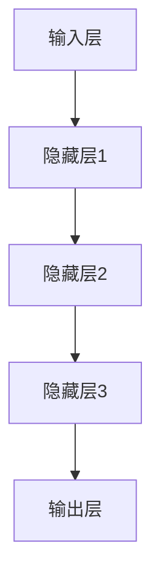

                 

### 1.1.1 抗生素的发现历史

抗生素的发现是医学史上一座重要的里程碑，为人类对抗细菌感染带来了革命性的变化。抗生素的发现历程可以追溯到20世纪30年代，其背景和早期发现过程如下：

- **背景**：在抗生素被发现之前，细菌感染往往是对人类健康的主要威胁之一。尤其是在一战和二战期间，细菌感染导致了许多士兵的死亡。因此，寻找能够有效对抗细菌的药物成为了医学界的一项紧迫任务。

- **早期发现**：1928年，苏格兰细菌学家亚历山大·弗莱明（Alexander Fleming）在一次偶然的实验中，首次发现了青霉素——一种由青霉菌产生的抗生素。弗莱明观察到在青霉菌周围培养皿中的细菌生长受到抑制，这一发现为抗生素的研究开启了新的大门。

- **抗生素的广泛使用**：随着弗莱明的研究，抗生素开始进入临床试验阶段。1940年，英国病理学家霍华德·弗洛里（Howard Florey）和埃内斯特·鲁斯卡（Ernest Chain）对青霉素进行了提纯，并成功地将其用于治疗病人。这一成就使得抗生素能够广泛地应用于临床，挽救了无数生命。

- **抗生素的多样化**：自青霉素的发现以来，科学家们陆续发现了许多其他类型的抗生素，如链霉素、四环素、红霉素等。这些抗生素针对不同的细菌具有特异性，进一步扩大了对抗细菌感染的武器库。

### 1.1.2 新型抗生素的需求

尽管抗生素的发现和广泛应用极大地改善了人类健康，但对抗生素耐药性的出现带来了新的挑战。耐药细菌的广泛传播使得许多传统抗生素失效，这要求科学家们不断寻找新型抗生素。

- **耐药性问题**：细菌在长期接触抗生素的过程中，会通过多种机制产生耐药性，包括产生抗生素灭活酶、改变抗生素的靶点、减少抗生素的摄取等。耐药性细菌的传播导致了感染治疗的难度增加，甚至有些感染已经无药可治。

- **新型抗生素的需求**：为了应对耐药性问题，迫切需要开发新型抗生素。这些新型抗生素需要具备以下特点：
  - **广谱抗菌性**：能够有效对抗多种耐药细菌。
  - **低毒副作用**：对人体健康的影响较小。
  - **不易产生耐药性**：具有独特的抗菌机制，减少细菌产生耐药性的可能性。

### 1.1.3 人工智能在生物医药领域的应用

随着人工智能技术的快速发展，其在生物医药领域的应用日益广泛。人工智能在新型抗生素发现中的应用主要体现在以下几个方面：

- **药物筛选**：利用人工智能算法对大量化合物进行筛选，识别出具有潜在抗菌活性的化合物。这大大加速了药物筛选过程，提高了发现新型抗生素的效率。

- **分子模拟**：通过分子模拟技术，人工智能可以预测化合物与细菌靶点的相互作用，从而指导药物设计。这有助于发现新的抗菌机制和开发更有效的药物。

- **数据分析**：人工智能技术可以处理海量的生物医学数据，包括基因组数据、代谢数据、微生物数据等，从而揭示细菌耐药性的机制，为新型抗生素的研发提供重要信息。

- **智能诊断**：利用深度学习和计算机视觉技术，人工智能可以辅助诊断细菌感染，提高诊断的准确性和速度。

总之，人工智能在新型抗生素发现中的应用为解决抗生素耐药性问题提供了新的思路和方法。随着技术的不断进步，人工智能有望在生物医药领域发挥更大的作用，推动抗生素研究的进步。### 1.1.2 新型抗生素的需求

抗生素的发现确实为医学进步带来了革命性的变化，但抗生素耐药性的出现使这一领域面临着前所未有的挑战。耐药性问题已经成为全球性的健康危机，它不仅影响了抗生素的疗效，还可能导致感染病情恶化，甚至死亡率的上升。因此，开发新型抗生素成为解决这一问题的迫切需求。

#### 耐药性问题

耐药性是指微生物（如细菌、真菌、寄生虫等）对抗生素产生的抵抗能力。耐药性可以通过多种机制产生，包括但不限于以下几种：

1. **产生抗生素灭活酶**：细菌可以产生酶类，如β-内酰胺酶，这些酶可以破坏抗生素的结构，使其失去活性。

2. **改变抗生素的靶点**：细菌可以改变抗生素作用的靶点，使其无法与靶点结合。

3. **减少抗生素的摄取**：细菌可以通过改变细胞膜的结构，减少抗生素的摄取。

4. **形成生物膜**：细菌可以在生物膜中生存，这种环境可以保护细菌免受抗生素的攻击。

耐药性细菌的传播速度非常快，这主要是因为：

- **全球化旅行**：耐药细菌可以通过空气、水、食物等途径快速传播。

- **抗生素的滥用**：不合理使用抗生素，如超量使用、不必要的预防性使用等，都会加速耐药性的产生。

- **医疗废物处理不当**：医疗废物中可能含有耐药细菌，不当处理会使其传播。

#### 新型抗生素的需求

针对耐药性问题，开发新型抗生素显得尤为重要。新型抗生素应具备以下几个特点：

1. **广谱抗菌性**：能够有效对抗多种耐药细菌，包括革兰氏阳性菌和革兰氏阴性菌。

2. **低毒副作用**：对人体健康的影响较小，减少抗生素相关性副作用。

3. **不易产生耐药性**：具有独特的抗菌机制，减少细菌产生耐药性的可能性。

4. **作用迅速**：能够在短时间内抑制或杀死细菌，防止感染的进一步扩散。

5. **能够穿透生物膜**：解决细菌在生物膜中的生存问题，提高抗生素的疗效。

新型抗生素的研发不仅需要药物化学和生物学领域的突破，还需要借助先进的技术手段，如人工智能。人工智能在药物设计、筛选和优化过程中发挥着关键作用，可以显著提高研发效率和成功率。

总之，新型抗生素的开发是应对抗生素耐药性问题的关键。通过不断创新和科技进步，我们有希望解决这一全球性的健康危机，为人类带来更健康的未来。### 1.1.3 人工智能在生物医药领域的应用

随着人工智能技术的不断进步，其在生物医药领域的应用变得越来越广泛和深入。人工智能通过其强大的数据处理能力、模式识别能力和预测能力，为生物医药领域带来了许多创新和突破。

#### 数据处理能力

生物医药领域涉及大量的数据，包括基因组数据、蛋白质序列、药物分子结构、临床数据等。人工智能可以通过深度学习、机器学习等技术，对海量数据进行高效处理和分析。例如，在基因组学中，人工智能可以帮助科学家们快速解析基因组的结构和功能，识别出与疾病相关的基因变异。此外，人工智能还可以帮助分析大规模的临床数据，从中提取出对诊断和治疗有益的信息。

#### 模式识别能力

在生物医药领域，模式识别是一种重要的应用。通过机器学习算法，人工智能可以从海量的医学图像中识别出异常模式，如肿瘤、病变等。这种技术已经在医学影像诊断中得到了广泛应用。例如，人工智能可以帮助医生快速诊断乳腺癌、肺癌等疾病，提高诊断的准确性和效率。

#### 预测能力

人工智能的预测能力在生物医药领域也有着广泛的应用。通过分析历史数据，人工智能可以预测疾病的进展、药物的效果以及病人的预后。这种预测能力对于个性化医疗和精准医学具有重要意义。例如，在药物开发过程中，人工智能可以预测哪些药物分子具有治疗潜力，从而加速药物筛选和开发过程。

#### 人工智能在药物开发中的应用

在药物开发过程中，人工智能发挥着至关重要的作用。以下是一些具体的例子：

1. **药物设计**：通过分子模拟和计算化学，人工智能可以帮助科学家们设计新的药物分子。这些药物分子可以在计算机中虚拟筛选，以找到具有最佳药效和最低毒性的分子。

2. **药物筛选**：人工智能可以通过高通量筛选技术，对大量的化合物进行快速筛选，识别出具有抗菌、抗癌等活性的化合物。这大大加速了药物筛选过程，提高了新药研发的成功率。

3. **药物优化**：通过机器学习算法，人工智能可以帮助科学家们优化药物分子结构，提高药物的稳定性和生物利用度。

4. **临床预测**：人工智能可以通过分析病人的基因、代谢数据，预测药物对不同病人的治疗效果和副作用，为个性化治疗提供依据。

总之，人工智能在生物医药领域的应用为新型抗生素的发现带来了新的机遇。通过人工智能技术，科学家们可以更快速、更准确地发现和开发新型抗生素，应对抗生素耐药性的挑战，为人类的健康事业作出更大的贡献。### 摘要

本文探讨了人工智能在新型抗生素发现中的应用，分析了抗生素耐药性问题对医学带来的挑战，以及新型抗生素的需求。通过回顾抗生素的发现历史，我们了解了抗生素对抗菌治疗的重要性，并认识到耐药性问题的严重性。接着，本文介绍了人工智能在生物医药领域的应用，包括数据处理能力、模式识别能力和预测能力等方面。在药物开发方面，人工智能通过药物设计、药物筛选和药物优化等环节，极大地提高了新药研发的效率。此外，本文还通过具体案例展示了人工智能在抗生素发现中的实际应用，并展望了其未来的发展趋势。通过人工智能与生物医药的深度融合，我们有理由相信，人工智能将为解决抗生素耐药性问题提供有力支持，推动医学领域的进步。## 第一部分: 引言

## 第1章: 新型抗生素发现的背景与挑战

### 1.1.1 抗生素的发现历史

抗生素的发现是20世纪医学史上的重大突破，它彻底改变了人类对抗细菌感染的方式。抗生素的发现历程充满了偶然和惊喜，其影响至今仍然深远。

#### 1.1.1.1 早期探索

在抗生素被发现之前，细菌感染是导致人类死亡的主要原因之一。19世纪末和20世纪初，随着工业革命和城市化进程的加快，细菌感染在各种公共场合，如医院、农场和食品加工厂，变得更加普遍。科学家们开始寻找能够杀死细菌的药物，但早期的尝试大多以失败告终。

#### 1.1.1.2 弗莱明的重大发现

1928年，亚历山大·弗莱明在研究溶菌酶时偶然发现了青霉素。他在实验中发现，一些细菌培养皿中出现了霉菌，而这些霉菌周围细菌的生长被抑制了。弗莱明意识到，这种霉菌可能产生了一种能杀死细菌的物质。经过进一步的研究，他确认了这种物质就是青霉素，一种强效的抗生素。

#### 1.1.1.3 抗生素的广泛应用

弗莱明的发现引起了医学界的极大关注。随后，霍华德·弗洛里和埃内斯特·钱恩对青霉素进行了提纯和临床测试，证明了其有效性和安全性。1940年，青霉素开始大规模生产并应用于临床，迅速治愈了许多细菌感染患者。青霉素的广泛使用标志着抗生素时代的到来。

#### 1.1.1.4 抗生素的多样化发展

青霉素的成功推动了抗生素的研发。20世纪中叶，科学家们发现并开发了许多其他类型的抗生素，如链霉素、四环素、红霉素等。这些抗生素针对不同类型的细菌具有特异性，进一步扩展了抗生素的抗菌谱。

#### 1.1.1.5 抗生素发现的里程碑

- 1928年：弗莱明发现青霉素。
- 1940年：青霉素开始应用于临床。
- 1950年代：链霉素和四环素被开发出来。
- 1960年代：广谱抗生素如氯霉素和红霉素问世。

这些里程碑事件不仅改变了医学实践，还促进了抗生素的多样化发展，为人类健康带来了深远的影响。

#### 1.1.1.6 抗生素的发现对医学的影响

抗生素的发现和应用极大地提高了感染治疗的水平，减少了细菌感染引起的死亡和疾病负担。抗生素的出现使得许多原本致命的细菌感染，如肺炎、脑膜炎和梅毒，变得可以治愈。此外，抗生素还改善了手术和移植手术的成功率，使得这些高风险的医疗程序变得更加安全。

总之，抗生素的发现是医学史上的重大事件，它不仅改变了人类对抗细菌感染的方式，还推动了医学的进步和人类健康水平的提高。### 1.1.2 新型抗生素的需求

#### 1.1.2.1 耐药性的挑战

尽管抗生素在医学上取得了巨大成功，但耐药性的出现带来了新的挑战。耐药性是指细菌对抗生素产生抗性，导致抗生素失去疗效。耐药性细菌的传播速度极快，已经导致许多传统抗生素失效。一些细菌甚至对多种抗生素产生了耐药性，使得治疗感染变得异常困难。

#### 1.1.2.2 抗生素耐药性的原因

抗生素耐药性的产生有多种原因，包括：

- **抗生素过度使用**：不合理地使用抗生素，如超量使用、预防性使用和不必要的长期使用，都可能导致耐药性的产生。
- **基因转移**：细菌可以通过质粒等遗传物质将耐药性基因转移到其他细菌上，导致耐药性在细菌种群中快速传播。
- **抗生素筛选压力**：在抗生素的选择压力下，耐药细菌能够生存并繁殖，从而在细菌种群中占据主导地位。
- **生物膜形成**：细菌在生物膜中生存时，可以抵抗抗生素的攻击，这使得抗生素治疗效果大大降低。

#### 1.1.2.3 新型抗生素的需求

面对抗生素耐药性的挑战，迫切需要开发新型抗生素。新型抗生素应具备以下特点：

- **广谱抗菌性**：能够对抗多种耐药细菌，包括革兰氏阳性菌和革兰氏阴性菌。
- **低毒副作用**：对人体健康的影响较小，减少抗生素相关性副作用。
- **不易产生耐药性**：具有独特的抗菌机制，减少细菌产生耐药性的可能性。
- **作用迅速**：能够在短时间内抑制或杀死细菌，防止感染的进一步扩散。
- **能够穿透生物膜**：解决细菌在生物膜中的生存问题，提高抗生素的疗效。

开发新型抗生素不仅需要药物化学和生物学领域的突破，还需要借助先进的技术手段，如人工智能。通过人工智能技术，科学家们可以更快速地筛选和设计具有抗菌活性的化合物，从而加速新型抗生素的研发。

总之，新型抗生素的研发是应对抗生素耐药性问题的重要手段。只有不断推动技术创新，才能为人类提供有效的治疗选择，降低耐药性带来的健康风险。### 1.1.3 人工智能在生物医药领域的应用

#### 1.1.3.1 数据处理能力

在生物医药领域，数据量的庞大和多样性使得传统的数据处理方法难以应对。人工智能通过其强大的数据处理能力，可以有效地处理和分析这些复杂的数据。例如，基因组数据、蛋白质序列、药物分子结构等都是生物医药领域中的重要数据。人工智能可以通过机器学习和深度学习算法，从这些数据中提取出有用的信息，帮助科学家们进行更精准的研究。

#### 1.1.3.2 模式识别能力

模式识别是人工智能的一个重要应用领域。在生物医药中，模式识别技术可以帮助医生进行疾病的早期诊断。例如，通过分析医学图像，人工智能可以识别出肿瘤、病变等异常模式。这种技术不仅可以提高诊断的准确率，还可以减少医生的工作负担，提高医疗效率。

#### 1.1.3.3 预测能力

人工智能在生物医药中的预测能力也非常突出。通过分析历史数据和生物标记物，人工智能可以预测疾病的进展、药物的疗效以及病人的预后。这种预测能力对于个性化医疗和精准医学具有重要意义。例如，在药物研发过程中，人工智能可以预测哪些药物分子具有治疗潜力，从而加速药物筛选和开发过程。

#### 1.1.3.4 人工智能在药物开发中的应用

在药物开发过程中，人工智能发挥着关键作用。首先，人工智能可以通过虚拟筛选技术，从大量的化合物中快速筛选出具有潜在药物活性的分子。其次，人工智能可以帮助优化药物分子结构，提高药物的稳定性和生物利用度。此外，人工智能还可以预测药物对不同病人的疗效和副作用，为个性化治疗提供依据。

#### 1.1.3.5 人工智能在抗生素发现中的应用

在抗生素的发现过程中，人工智能的应用主要体现在以下几个方面：

- **药物筛选**：利用人工智能算法，对大量的化合物进行筛选，识别出具有潜在抗菌活性的化合物。
- **分子模拟**：通过分子模拟技术，人工智能可以预测化合物与细菌靶点的相互作用，从而指导药物设计。
- **数据分析**：人工智能可以处理海量的生物医学数据，包括基因组数据、代谢数据、微生物数据等，从而揭示细菌耐药性的机制。
- **智能诊断**：利用深度学习和计算机视觉技术，人工智能可以辅助诊断细菌感染，提高诊断的准确性和速度。

总之，人工智能在生物医药领域的应用为新型抗生素的发现提供了新的思路和方法。通过人工智能技术的不断进步，我们有理由相信，人工智能将在未来继续为生物医药领域带来更多创新和突破。## 第二部分: 人工智能技术基础

## 第2章: 人工智能与生物医药

### 2.1.1 人工智能的基本原理

人工智能（Artificial Intelligence，简称AI）是一门研究如何使计算机模拟人类智能行为的学科。其基本原理主要包括以下几个方面：

#### 2.1.1.1 机器学习

机器学习是人工智能的核心技术之一，其基本思想是通过训练算法从数据中学习规律和模式，从而实现预测和决策。机器学习可以分为监督学习、无监督学习和半监督学习三种类型：

- **监督学习**：在监督学习场景中，训练数据包含输入和输出标签，算法通过学习输入和输出之间的关系来预测新的输入数据。常见的监督学习算法包括线性回归、决策树、支持向量机等。
  
- **无监督学习**：无监督学习不依赖于标签信息，算法通过分析数据内在的结构和模式来自发现数据分布。常见的无监督学习算法包括聚类、主成分分析等。

- **半监督学习**：半监督学习结合了监督学习和无监督学习的特点，利用部分有标签数据和大量无标签数据来训练模型。

#### 2.1.1.2 深度学习

深度学习是机器学习的一个子领域，它通过构建多层神经网络（如图1所示）来模拟人类大脑的信息处理方式。深度学习在图像识别、自然语言处理、语音识别等领域取得了显著成果。



深度学习的核心组成部分包括：

- **神经元**：神经元是神经网络的基本单元，负责接收输入信号并通过激活函数进行处理。

- **权重和偏置**：权重和偏置用于调整神经元之间的连接强度，是模型参数的重要组成部分。

- **激活函数**：激活函数用于引入非线性，使得神经网络能够学习更复杂的函数关系。

#### 2.1.1.3 神经网络

神经网络是一种由大量简单神经元组成的复杂网络，通过学习输入数据与输出数据之间的关系来实现预测和分类。神经网络可以分为以下几类：

- **前馈神经网络**：前馈神经网络是深度学习的基础，其信息流只能单向传播，即从输入层经过多个隐藏层最终到达输出层。

- **卷积神经网络**（CNN）：卷积神经网络在图像识别和计算机视觉领域有着广泛应用，其通过卷积操作提取图像特征，并利用池化操作降低数据维度。

- **循环神经网络**（RNN）：循环神经网络适用于处理序列数据，其通过循环结构保持历史状态信息，适用于自然语言处理和时间序列预测等领域。

- **生成对抗网络**（GAN）：生成对抗网络由生成器和判别器两部分组成，通过对抗训练生成逼真的数据。

#### 2.1.1.4 强化学习

强化学习是一种通过奖励机制来训练智能体在环境中做出决策的机器学习方法。强化学习中的智能体通过不断尝试和反馈来学习最优策略。常见的强化学习算法包括Q学习、深度Q网络（DQN）和策略梯度方法等。

总之，人工智能的基本原理包括机器学习、深度学习、神经网络和强化学习等多个方面。这些技术相互结合，为人工智能在生物医药领域的应用提供了坚实的基础。### 2.1.2 机器学习与深度学习在生物医药中的应用

#### 2.1.2.1 机器学习在生物医药中的应用

机器学习在生物医药领域有着广泛的应用，其核心优势在于能够从大量复杂数据中提取有价值的信息。以下是机器学习在生物医药中的一些关键应用：

1. **疾病诊断**：机器学习算法可以通过分析病人的历史医疗记录、生物标志物和基因组数据，帮助医生进行疾病诊断。例如，基于深度学习算法的图像识别技术可以用于肺癌、乳腺癌等癌症的早期诊断。

2. **药物筛选**：在药物研发过程中，机器学习可以用于筛选具有潜在药效的化合物。通过训练机器学习模型，科学家们可以从庞大的化合物库中快速识别出可能有效的药物候选。

3. **个性化治疗**：机器学习可以帮助医生制定个性化的治疗方案。通过分析病人的基因、代谢和病史数据，机器学习模型可以预测哪些药物和剂量最适合特定病人，从而提高治疗效果并减少副作用。

4. **预测疾病进展**：机器学习算法可以通过分析历史数据来预测疾病的进展和病人的预后。这种预测能力对于慢性病的管理和癌症的早期干预具有重要意义。

5. **生物标记物识别**：机器学习可以用于识别与特定疾病相关的生物标记物。这些生物标记物可以作为早期诊断和监测疾病的指标，有助于提高疾病的诊断准确性和治疗效果。

#### 2.1.2.2 深度学习在生物医药中的应用

深度学习作为机器学习的一个重要分支，在生物医药领域展现了强大的潜力。以下是深度学习在生物医药中的一些关键应用：

1. **图像分析**：深度学习，尤其是卷积神经网络（CNN），在医学图像分析中具有广泛应用。例如，CNN可以用于分析CT、MRI和PET图像，帮助医生识别病变区域和疾病类型。

2. **基因组分析**：深度学习可以用于分析复杂的基因组数据，包括基因组序列、基因表达数据和突变数据。通过深度学习模型，科学家们可以识别出与疾病相关的基因变异和生物标记物。

3. **药物设计**：深度学习可以帮助科学家设计新的药物分子。通过训练深度学习模型，科学家们可以预测药物分子与生物大分子（如蛋白质）的相互作用，从而指导药物分子设计。

4. **生物信息学**：深度学习在生物信息学领域有着广泛应用，例如，用于预测蛋白质结构、识别蛋白质功能和分析转录组数据等。

5. **临床决策支持**：深度学习算法可以用于辅助医生进行临床决策。通过分析大量的医疗数据和文献，深度学习模型可以提供个性化的治疗建议和预测病人的预后。

总之，机器学习和深度学习在生物医药领域的应用为疾病的诊断、治疗和药物研发提供了新的工具和方法。随着技术的不断发展，人工智能将进一步推动生物医药领域的进步，为人类健康事业作出更大的贡献。### 2.1.3 数据预处理与特征提取

在人工智能和生物医药领域，数据预处理与特征提取是构建有效模型的关键步骤。以下是这些步骤的详细解释和实际应用：

#### 2.1.3.1 数据预处理

数据预处理是指对原始数据进行清洗、转换和归一化等操作，以提高数据质量和模型的性能。以下是一些常见的数据预处理步骤：

1. **缺失值处理**：缺失值是数据分析中常见的问题。处理缺失值的方法包括删除缺失值、使用平均值或中位数填补、使用机器学习算法自动填补等。

2. **数据清洗**：数据清洗涉及去除重复记录、纠正错误和消除噪声等操作。例如，在生物医学数据中，可能需要删除含有异常值的记录。

3. **数据转换**：数据转换包括将分类变量转换为数值变量、将文本数据转换为向量等。例如，使用独热编码将分类变量转换为二进制向量。

4. **数据归一化**：归一化是将数据缩放到相同的尺度，以消除变量之间的比例差异。常见的归一化方法包括最小-最大缩放和标准化。

5. **数据标准化**：标准化是将数据转换为具有零均值和单位方差的分布。这有助于提高模型的泛化能力。

#### 2.1.3.2 特征提取

特征提取是从原始数据中提取对模型有用的特征的过程。以下是一些常见的特征提取方法：

1. **特征选择**：特征选择是指从大量特征中选择出对模型性能最有影响的特征。常用的特征选择方法包括基于信息增益、基于模型的方法等。

2. **特征降维**：特征降维是将高维数据转换为低维数据，以减少计算复杂度和提高模型性能。常见的降维方法包括主成分分析（PCA）、线性判别分析（LDA）和t-SNE等。

3. **特征工程**：特征工程是通过创建新的特征或转换现有特征来提高模型性能。例如，在生物医学领域，可以使用时间序列特征来描述疾病的进展。

4. **特征提取算法**：特征提取算法包括统计方法、机器学习方法等。例如，基于统计的特征提取方法包括卡方检验和互信息，而机器学习方法包括决策树和随机森林等。

#### 2.1.3.3 数据预处理与特征提取在生物医药中的应用

在生物医药领域，数据预处理和特征提取对于构建准确和高效的模型至关重要。以下是一些实际应用案例：

1. **基因组数据分析**：在基因组学中，数据预处理包括去除低质量的测序读数、对读数进行质量得分过滤和序列比对。特征提取则涉及从基因组数据中提取基因表达模式和突变特征。

2. **医学影像分析**：在医学影像领域，数据预处理包括图像去噪、对比度增强和图像分割。特征提取可以从图像中提取纹理、形状和结构特征，以帮助诊断疾病。

3. **电子健康记录（EHR）分析**：在EHR分析中，数据预处理包括数据整合、数据清洗和缺失值处理。特征提取可以从EHR中提取时间序列特征、药物使用情况和生物标志物。

4. **药物筛选**：在药物筛选中，数据预处理包括化合物的结构清洗、缺失值处理和化学性质标准化。特征提取可以从化合物结构中提取分子指纹、拓扑属性和量子化学属性。

总之，数据预处理和特征提取是人工智能在生物医药领域不可或缺的步骤。通过这些步骤，我们可以提高数据质量和模型性能，从而为疾病诊断、药物开发和个性化治疗提供有力支持。## 第三部分: 人工智能在新型抗生素发现中的应用

### 第3章: 人工智能在药物发现中的应用

#### 3.1.1 药物发现流程

药物发现是一个复杂且耗时的过程，它通常包括以下几个关键步骤：

1. **目标确定**：首先，科学家需要确定药物作用的目标。这通常涉及识别与特定疾病相关的生物标记物或蛋白质。

2. **化合物筛选**：在目标确定后，科学家需要从大量的化合物库中选择具有潜在活性的化合物。这通常通过高通量筛选（HTS）或虚拟筛选等方法来完成。

3. **先导化合物优化**：从筛选出的化合物中，科学家会进一步优化先导化合物的结构和活性，以开发出更具前景的候选药物。

4. **药理学评估**：候选药物需要通过一系列药理学评估，包括细胞活性、毒性、代谢稳定性等，以确保其安全性和有效性。

5. **临床试验**：经过初步评估后，候选药物将进入临床试验阶段，以评估其安全性、有效性和剂量。

6. **生产和上市**：如果候选药物在临床试验中表现出良好的效果，将进入生产和上市阶段。

#### 3.1.2 人工智能在药物筛选中的应用

人工智能在药物筛选中发挥着关键作用，其主要应用包括：

1. **高通量筛选（HTS）**：人工智能可以通过自动化筛选平台快速处理大量的化合物，从而大大提高筛选效率。

2. **虚拟筛选**：虚拟筛选是一种基于计算机模拟的药物筛选方法。人工智能可以通过分子对接和分子动力学模拟等技术，预测化合物与生物大分子（如蛋白质）的相互作用，从而筛选出具有潜在活性的化合物。

3. **化合物合成预测**：人工智能可以帮助预测化合物的合成路径和合成方法，从而指导实验科学家进行有效的化合物合成。

4. **筛选优化**：人工智能可以通过机器学习和深度学习算法，优化筛选过程，提高筛选的准确性和效率。

#### 3.1.3 人工智能在药物设计中的应用

人工智能在药物设计中的应用主要包括以下几个方面：

1. **分子设计**：人工智能可以通过计算化学和分子模拟技术，设计出具有特定生物活性的分子结构。这包括分子对接、分子动力学模拟和量子化学计算等。

2. **药物结构优化**：人工智能可以帮助科学家优化药物分子结构，提高其稳定性和生物利用度。

3. **多靶点药物设计**：人工智能可以通过结合多种数据源和模型，设计出能够同时作用于多个生物靶点的药物。

4. **药物组合设计**：人工智能可以帮助科学家设计出药物组合，以提高治疗效果和降低副作用。

总之，人工智能在药物发现中的应用极大地提高了药物研发的效率，降低了研发成本，并为新型抗生素的发现提供了强有力的支持。随着人工智能技术的不断进步，我们有理由相信，人工智能将在未来继续为生物医药领域带来更多创新和突破。## 第4章: 数据收集与预处理

### 4.1.1 抗生素相关数据来源

在新型抗生素发现过程中，数据收集是关键步骤之一。以下是抗生素相关数据的几种主要来源：

1. **公开数据库**：许多生物医学数据库，如PubMed、NCBI、GEO、ArrayExpress等，提供了大量的抗生素相关文献、基因表达数据和代谢数据。这些数据库是进行抗生素研究的宝贵资源。

2. **实验室实验数据**：科学家在实验室通过实验获得的抗生素活性、结构、药代动力学等数据也是重要的数据来源。这些数据通常通过高通量筛选、分子对接和分子动力学模拟等方法获得。

3. **临床试验数据**：临床试验是评估抗生素疗效和安全性的重要手段。临床试验数据包括药物的剂量、疗效、不良反应等，这些数据有助于评估新型抗生素的临床前景。

4. **公共知识库**：如ChEMBL、PubChem等数据库，提供了大量的化合物结构和生物学信息，有助于药物筛选和设计。

### 4.1.2 数据预处理方法

在收集到抗生素相关数据后，需要进行预处理以消除噪声、提高数据质量。以下是几种常见的数据预处理方法：

1. **数据清洗**：数据清洗是预处理的第一步，目的是去除重复记录、纠正错误和不一致的数据。例如，在处理基因组数据时，可能需要去除低质量的测序读数和错误碱基。

2. **数据标准化**：数据标准化是将数据缩放到相同的尺度，以消除不同变量之间的比例差异。例如，在处理基因表达数据时，可以使用归一化方法将基因表达水平标准化。

3. **缺失值处理**：缺失值是数据分析中常见的问题。处理缺失值的方法包括删除缺失值、使用平均值或中位数填补、使用机器学习算法自动填补等。

4. **特征提取**：特征提取是从原始数据中提取对模型有用的特征。例如，在处理抗生素活性数据时，可以使用主成分分析（PCA）提取主要成分，降低数据维度。

5. **数据整合**：在抗生素研究中，通常需要整合来自不同来源的数据，如基因组数据、代谢数据和微生物数据。数据整合可以通过多种技术，如数据融合、多视图学习等来实现。

### 4.1.3 数据可视化与特征提取

数据可视化是理解数据分布和特征的重要工具。以下是几种常见的数据可视化方法：

1. **散点图**：散点图可以显示两个变量之间的关系。例如，可以使用散点图来比较不同抗生素的活性与毒性。

2. **热图**：热图用于显示基因表达数据或化合物活性数据的分布情况。它通过颜色深浅来表示数值大小，有助于发现数据中的模式和异常。

3. **箱线图**：箱线图可以显示数据的分布、中位数和四分位数。它有助于识别异常值和离群点。

4. **时间序列图**：时间序列图用于显示随时间变化的数据。例如，可以使用时间序列图来分析抗生素的药代动力学特征。

通过数据可视化和特征提取，科学家可以更好地理解抗生素的生物学特性，从而指导新型抗生素的发现和设计。## 第5章: 机器学习模型在抗生素发现中的应用

### 5.1.1 机器学习基本算法

在抗生素发现过程中，机器学习算法扮演着关键角色。以下是几种常见的机器学习算法及其在抗生素发现中的应用：

1. **线性回归**：线性回归是一种简单的监督学习算法，用于预测连续值输出。在抗生素发现中，线性回归可以用于预测抗生素活性与分子特性之间的关系。例如，通过线性回归模型，可以预测新化合物的抗菌活性。

   ```python
   # 伪代码：线性回归模型
   from sklearn.linear_model import LinearRegression

   # 训练模型
   model = LinearRegression()
   model.fit(X_train, y_train)

   # 预测
   predictions = model.predict(X_test)
   ```

2. **决策树**：决策树是一种基于树形结构的分类算法，能够将数据划分为多个区域。在抗生素发现中，决策树可以用于分类任务，如预测抗生素是否对特定细菌有活性。

   ```python
   # 伪代码：决策树模型
   from sklearn.tree import DecisionTreeClassifier

   # 训练模型
   model = DecisionTreeClassifier()
   model.fit(X_train, y_train)

   # 预测
   predictions = model.predict(X_test)
   ```

3. **随机森林**：随机森林是一种基于决策树的集成学习方法，通过构建多棵决策树并求取平均来提高预测准确性。在抗生素发现中，随机森林可以用于分类和回归任务，如预测抗生素的活性。

   ```python
   # 伪代码：随机森林模型
   from sklearn.ensemble import RandomForestClassifier

   # 训练模型
   model = RandomForestClassifier()
   model.fit(X_train, y_train)

   # 预测
   predictions = model.predict(X_test)
   ```

4. **支持向量机（SVM）**：SVM是一种强大的分类算法，通过找到一个最佳的超平面来分割数据。在抗生素发现中，SVM可以用于分类任务，如预测抗生素对细菌的活性。

   ```python
   # 伪代码：SVM模型
   from sklearn.svm import SVC

   # 训练模型
   model = SVC()
   model.fit(X_train, y_train)

   # 预测
   predictions = model.predict(X_test)
   ```

5. **神经网络**：神经网络是一种复杂的模型，通过多层神经元来模拟人类大脑的学习过程。在抗生素发现中，神经网络可以用于复杂的预测任务，如分子对接和药物设计。

   ```python
   # 伪代码：神经网络模型
   from tensorflow.keras.models import Sequential
   from tensorflow.keras.layers import Dense

   # 构建模型
   model = Sequential()
   model.add(Dense(units=64, activation='relu', input_shape=(input_shape,)))
   model.add(Dense(units=1, activation='sigmoid'))

   # 训练模型
   model.compile(optimizer='adam', loss='binary_crossentropy', metrics=['accuracy'])
   model.fit(X_train, y_train, epochs=10, batch_size=32)

   # 预测
   predictions = model.predict(X_test)
   ```

这些机器学习算法在抗生素发现中的应用，不仅提高了预测的准确性，还大大加速了新抗生素的筛选和开发过程。通过不断优化和改进算法，科学家们能够更好地应对抗生素耐药性的挑战，为人类健康作出更大贡献。### 5.1.2 抗生素发现中的机器学习应用

#### 5.1.2.1 抗生素活性预测

抗生素活性预测是机器学习在抗生素发现中的一个重要应用。通过分析抗生素分子的结构特征和生物活性数据，机器学习算法可以预测新化合物的抗菌活性。以下是一种典型的抗生素活性预测方法：

1. **数据准备**：收集已知的抗生素分子结构（如SMILES字符串或3D结构）和其对应的抗菌活性数据（如最小抑菌浓度MIC）。

2. **特征提取**：从分子结构中提取特征，如分子拓扑特征、化学键特征和分子属性特征。可以使用现有的分子特征提取工具，如RDKit、Gasteiger-Huckel电荷等。

3. **模型训练**：使用机器学习算法（如随机森林、支持向量机或神经网络）训练活性预测模型。将提取的分子特征作为输入，抗菌活性作为输出。

4. **模型评估**：使用交叉验证或测试集评估模型的预测性能，包括准确率、召回率、F1分数等指标。

5. **预测新化合物活性**：将新化合物的分子特征输入训练好的模型，预测其抗菌活性。

这种活性预测方法可以快速筛选出具有潜在抗菌活性的化合物，减少实验成本和时间。

#### 5.1.2.2 抗生素耐药性预测

耐药性预测是另一个重要的机器学习应用，它可以帮助预测细菌对抗生素的耐药性。以下是耐药性预测的一个典型方法：

1. **数据收集**：收集具有耐药性特征的细菌基因组数据、抗生素使用记录和耐药性表型数据。

2. **特征提取**：从基因组数据中提取耐药性相关基因和突变特征，如抗生素作用靶点的突变、耐药性基因的插入和缺失等。

3. **模型训练**：使用机器学习算法（如随机森林、支持向量机或神经网络）训练耐药性预测模型。将提取的基因组特征作为输入，耐药性表型作为输出。

4. **模型评估**：使用交叉验证或测试集评估模型的预测性能，包括准确率、召回率、F1分数等指标。

5. **预测新细菌的耐药性**：将新细菌的基因组特征输入训练好的模型，预测其对抗生素的耐药性。

通过耐药性预测，科学家可以提前识别出可能产生耐药性的细菌，从而采取预防措施，避免耐药性的进一步扩散。

#### 5.1.2.3 抗生素组合治疗

抗生素组合治疗是一种通过联合使用两种或多种抗生素来提高治疗效果并降低耐药性的方法。机器学习在抗生素组合治疗中的应用主要包括：

1. **组合筛选**：使用机器学习算法从大量抗生素中筛选出具有协同作用的组合。例如，可以使用协同效应分析算法来识别具有协同抗菌作用的抗生素组合。

2. **药效预测**：通过训练机器学习模型，预测不同抗生素组合对细菌的抗菌效果。这有助于优化抗生素组合方案，提高治疗效果。

3. **安全性评估**：使用机器学习算法评估抗生素组合的安全性，以避免潜在的不良反应。

总之，机器学习在抗生素发现中的应用为新型抗生素的研发和耐药性管理提供了强大的工具。通过不断优化和改进算法，科学家们可以更有效地发现新型抗生素，应对抗生素耐药性的挑战。### 5.1.3 机器学习模型的性能评估

在抗生素发现中，评估机器学习模型的性能至关重要。以下是一些常用的评估指标和方法：

#### 5.1.3.1 评估指标

1. **准确率（Accuracy）**：准确率是模型预测正确的样本数占总样本数的比例。尽管简单，但准确率在分类任务中是一个基本指标。

   \[
   \text{准确率} = \frac{\text{预测正确的样本数}}{\text{总样本数}}
   \]

2. **召回率（Recall）**：召回率是模型在所有正类样本中预测正确的比例。召回率特别关注少数类样本的识别。

   \[
   \text{召回率} = \frac{\text{预测正确的正类样本数}}{\text{实际正类样本数}}
   \]

3. **精确率（Precision）**：精确率是模型预测正确的正类样本数与预测为正类样本数的比例。精确率关注预测结果的质量。

   \[
   \text{精确率} = \frac{\text{预测正确的正类样本数}}{\text{预测为正类的样本数}}
   \]

4. **F1分数（F1 Score）**：F1分数是精确率和召回率的调和平均值，用于综合评价模型的性能。

   \[
   \text{F1分数} = 2 \times \frac{\text{精确率} \times \text{召回率}}{\text{精确率} + \text{召回率}}
   \]

5. **ROC曲线（Receiver Operating Characteristic Curve）**：ROC曲线展示了不同阈值下模型的真阳性率（True Positive Rate）和假阳性率（False Positive Rate）的关系。曲线下面积（AUC）越大，模型的性能越好。

6. **Kappa系数（Kappa Score）**：Kappa系数用于评估分类器的准确度，特别适用于小样本或类不平衡的情况。

   \[
   \text{Kappa系数} = \frac{(\text{观察一致度} - \text{随机一致度})}{1 - \text{随机一致度}}
   \]

#### 5.1.3.2 评估方法

1. **交叉验证（Cross-Validation）**：交叉验证是一种评估模型性能的方法，通过将数据集划分为多个子集，每次使用其中一个子集作为测试集，其余子集作为训练集。常见的方法有K折交叉验证和留一法交叉验证。

2. **测试集评估（Test Set Evaluation）**：在交叉验证后，使用未参与训练的测试集来评估模型的最终性能。测试集评估提供了模型在实际应用中的表现。

3. **混淆矩阵（Confusion Matrix）**：混淆矩阵是一个表格，展示了模型预测结果与实际结果之间的对比。通过混淆矩阵，可以计算准确率、召回率、精确率和F1分数等指标。

4. **模型对比（Model Comparison）**：在不同模型之间进行对比，以确定哪个模型在特定任务上表现更好。可以使用上述评估指标进行对比。

5. **时间评估（Time Evaluation）**：评估模型在训练和预测过程中的时间消耗，以确保模型在实际应用中的效率。

通过这些评估指标和方法，科学家可以全面了解机器学习模型的性能，从而优化模型并选择最适合的模型进行抗生素发现研究。## 第6章: 深度学习模型在抗生素发现中的应用

### 6.1.1 深度学习基本架构

深度学习模型在抗生素发现中的应用得益于其强大的建模能力和对复杂数据的处理能力。以下是深度学习的基本架构和其在抗生素发现中的关键应用。

#### 6.1.1.1 神经网络结构

深度学习模型的核心是神经网络，它由多个层组成，包括输入层、隐藏层和输出层。每一层由多个神经元（或称为节点）组成，神经元之间通过加权连接。输入层接收外部数据，隐藏层对数据进行处理和变换，输出层产生预测结果。

- **输入层**：输入层是神经网络的起点，它接收原始数据，例如抗生素分子的结构特征、基因序列或临床数据。
- **隐藏层**：隐藏层对输入数据进行处理和变换，通过激活函数引入非线性，使得神经网络能够学习复杂的关系。
- **输出层**：输出层产生预测结果，例如抗生素的活性、耐药性或药物组合的效果。

#### 6.1.1.2 激活函数

激活函数是神经网络中的一个关键组件，它用于引入非线性。常见的激活函数包括：

- **Sigmoid函数**：\( f(x) = \frac{1}{1 + e^{-x}} \)，将输入映射到\( (0, 1) \)区间。
- **ReLU函数**：\( f(x) = \max(0, x) \)，对输入大于0的部分直接返回，否则返回0。
- **Tanh函数**：\( f(x) = \frac{e^x - e^{-x}}{e^x + e^{-x}} \)，将输入映射到\( (-1, 1) \)区间。

#### 6.1.1.3 损失函数

损失函数用于衡量模型的预测结果与实际结果之间的差异，是训练神经网络的依据。常见的损失函数包括：

- **均方误差（MSE）**：\( \frac{1}{n}\sum_{i=1}^{n}(y_i - \hat{y_i})^2 \)，用于回归任务，衡量预测值与实际值之间的平方误差。
- **交叉熵（Cross-Entropy）**：用于分类任务，衡量实际标签与预测概率分布之间的差异。

#### 6.1.1.4 优化算法

优化算法用于调整神经网络中的权重，以最小化损失函数。常见的优化算法包括：

- **随机梯度下降（SGD）**：通过计算损失函数关于模型参数的梯度，调整模型参数。
- **Adam优化器**：结合了SGD和动量法的优点，自适应调整学习率。

#### 6.1.1.5 深度学习模型在抗生素发现中的应用

1. **药物分子表征**：深度学习模型可以用于提取药物分子的特征，例如通过图神经网络（Graph Neural Networks, GNN）处理分子结构，或通过卷积神经网络（Convolutional Neural Networks, CNN）处理分子指纹。

2. **药物活性预测**：使用深度学习模型，可以预测新化合物的抗菌活性。例如，使用基于图神经网络的模型，可以处理具有复杂拓扑结构的分子，从而提高预测准确性。

3. **耐药性预测**：深度学习模型可以用于预测细菌对抗生素的耐药性。通过训练基于神经网络的模型，可以从基因序列和临床数据中提取特征，预测细菌的耐药性。

4. **药物组合设计**：深度学习模型可以帮助设计具有协同效应的药物组合。通过训练基于神经网络的模型，可以识别出具有潜在协同作用的药物组合，从而提高治疗效果。

总之，深度学习模型的强大建模能力和数据处理能力，使其在抗生素发现中具有广泛的应用前景。随着技术的不断进步，深度学习将在抗生素研发中发挥更大的作用。### 6.1.2 深度学习模型在抗生素发现中的应用

深度学习模型在抗生素发现中的应用主要集中在药物分子表征、药物活性预测、耐药性预测和药物组合设计等方面。以下是这些应用的具体说明：

#### 6.1.2.1 药物分子表征

药物分子的表征是深度学习在抗生素发现中的基础。深度学习模型，如卷积神经网络（CNN）和图神经网络（GNN），可以处理药物分子的结构数据，从而提取出分子特征。

- **CNN**：卷积神经网络通过卷积操作从分子指纹中提取特征。分子指纹是一种表示分子结构的向量，其中每个元素代表了分子中某种原子的数量。CNN可以自动学习分子指纹中的局部模式和全局模式。

  ```mermaid
  graph TD
  A[分子指纹] --> B[卷积层1]
  B --> C[池化层1]
  C --> D[卷积层2]
  D --> E[池化层2]
  E --> F[全连接层]
  F --> G[输出]
  ```

- **GNN**：图神经网络通过处理分子结构的图表示来提取特征。图中的节点代表原子，边代表化学键。GNN可以捕获分子中的复杂结构和相互作用。

  ```mermaid
  graph TD
  A[分子图] --> B[节点特征提取]
  B --> C[边特征提取]
  C --> D[图卷积层]
  D --> E[聚合层]
  E --> F[输出]
  ```

#### 6.1.2.2 药物活性预测

深度学习模型可以用于预测新化合物的抗菌活性。通过训练基于深度学习的模型，可以从已知的药物活性数据中学习规律，从而对新化合物进行预测。

- **训练数据集**：使用大量的药物分子和对应的抗菌活性数据作为训练集。

- **模型训练**：使用CNN或GNN对训练数据进行训练，从而学习药物分子和活性之间的关系。

- **模型评估**：使用交叉验证或测试集评估模型的预测性能，包括准确率、召回率、F1分数等指标。

  ```python
  from sklearn.model_selection import train_test_split
  from sklearn.metrics import accuracy_score

  # 分割数据集
  X_train, X_test, y_train, y_test = train_test_split(X, y, test_size=0.2, random_state=42)

  # 训练模型
  model.fit(X_train, y_train)

  # 预测
  predictions = model.predict(X_test)

  # 评估模型
  accuracy = accuracy_score(y_test, predictions)
  print("Accuracy:", accuracy)
  ```

#### 6.1.2.3 耐药性预测

耐药性预测是另一个关键应用，它可以帮助科学家预测细菌对抗生素的耐药性。深度学习模型可以从细菌的基因组数据中提取特征，从而预测其耐药性。

- **基因组数据**：收集细菌的基因组序列数据。

- **特征提取**：使用深度学习模型提取基因组数据中的特征。

- **模型训练**：使用已知的耐药性数据训练深度学习模型。

- **模型评估**：使用交叉验证或测试集评估模型的预测性能。

#### 6.1.2.4 药物组合设计

深度学习模型还可以用于药物组合设计，通过识别具有协同效应的药物组合，从而提高治疗效果并降低耐药性。

- **药物组合数据**：收集具有协同效应的药物组合数据。

- **模型训练**：使用深度学习模型学习药物组合的效果。

- **模型评估**：使用交叉验证或测试集评估模型的预测性能。

- **药物组合优化**：根据模型预测结果，优化药物组合。

总之，深度学习模型在抗生素发现中的应用为药物分子表征、活性预测、耐药性预测和药物组合设计提供了强大的工具。通过不断优化和改进深度学习模型，科学家们可以更有效地发现新型抗生素，应对抗生素耐药性的挑战。### 6.1.3 深度学习模型的优化

深度学习模型在抗生素发现中的应用取得了显著成果，但模型的优化是确保其性能和准确性的关键。以下是一些常用的深度学习模型优化方法：

#### 6.1.3.1 模型架构优化

1. **神经网络层数和深度**：增加神经网络的层数可以捕捉更复杂的特征。然而，层数过多可能导致过拟合。因此，需要通过实验找到合适的层数。

2. **激活函数选择**：不同的激活函数有不同的特性。例如，ReLU函数可以防止神经元死亡，而Tanh函数可以限制输出范围。选择合适的激活函数可以提高模型的性能。

3. **正则化技术**：正则化技术如L1和L2正则化可以减少模型过拟合的风险。通过添加正则化项，可以降低模型参数的重要性，从而提高模型的泛化能力。

4. **残差网络（ResNet）**：残差网络通过引入跳跃连接（skip connection），解决了深层网络中的梯度消失问题，提高了模型的训练效率和性能。

#### 6.1.3.2 模型训练优化

1. **批量大小（Batch Size）**：批量大小是指每次训练中参与训练的数据样本数量。较小的批量大小可以提高模型的鲁棒性，但训练时间较长；较大的批量大小可以提高训练速度，但可能导致过拟合。

2. **学习率调度**：学习率是模型参数更新的步长。选择合适的学习率对模型性能至关重要。常用的学习率调度方法包括固定学习率、指数衰减和自适应学习率（如Adam优化器）。

3. **早期停止（Early Stopping）**：当模型的验证集性能不再提高时，停止训练以避免过拟合。早期停止是一种简单而有效的防止过拟合的方法。

4. **数据增强（Data Augmentation）**：通过增加数据的多样性来提高模型的泛化能力。例如，在图像分类任务中，可以使用旋转、翻转、缩放等操作来增加训练数据的多样性。

#### 6.1.3.3 模型评估与调优

1. **交叉验证**：交叉验证是一种评估模型性能的方法，通过将数据集划分为多个子集，每次使用一个子集作为测试集，其余子集作为训练集。交叉验证可以提供对模型性能的更可靠估计。

2. **超参数优化**：超参数是模型架构和训练过程中的参数，如学习率、批量大小、隐藏层单元数等。通过使用网格搜索、随机搜索等超参数优化方法，可以找到最佳的超参数组合。

3. **模型集成（Model Ensemble）**：通过结合多个模型的预测结果来提高整体性能。常见的集成方法包括Bagging、Boosting和Stacking等。

4. **模型解释性**：为了确保模型的可解释性，可以使用注意力机制、解释性模型（如决策树）和模型解释工具（如LIME、SHAP）等，分析模型内部的决策过程。

通过上述优化方法，深度学习模型在抗生素发现中的应用可以得到显著提升，从而提高模型的预测性能和准确性，为新型抗生素的研发提供有力支持。## 第7章: 人工智能在抗生素发现中的综合应用

### 7.1.1 综合应用实例

人工智能在抗生素发现中的应用并不是孤立的单点突破，而是通过多方面的综合应用，实现了从数据收集、预处理、模型训练到结果评估的全流程优化。以下是一个典型的综合应用实例：

#### 实例描述

在一个抗生素发现项目中，科学家们使用了人工智能的多个方面来发现新型抗生素。以下是其主要步骤：

1. **数据收集**：通过多个公开数据库（如ChEMBL、PubChem）和实验室实验，收集了大量的抗生素分子结构数据、抗菌活性数据和耐药性数据。

2. **数据预处理**：对收集到的数据进行清洗、标准化和特征提取。使用深度学习模型提取分子结构中的特征，如使用图神经网络（GNN）提取分子指纹，使用卷积神经网络（CNN）提取图像特征。

3. **模型训练**：使用收集到的数据训练深度学习模型。首先，训练了一个GNN模型来预测抗生素的抗菌活性。然后，使用训练好的GNN模型提取的特征，结合耐药性数据，训练了一个支持向量机（SVM）模型来预测细菌的耐药性。

4. **模型评估**：通过交叉验证和测试集评估模型的性能。使用准确率、召回率、F1分数等指标评估抗菌活性预测模型的性能，使用ROC曲线和AUC评估耐药性预测模型的性能。

5. **药物筛选**：利用训练好的模型对新分子进行抗菌活性和耐药性预测。筛选出具有高抗菌活性和低耐药性的化合物作为潜在的抗生素候选。

6. **优化设计**：根据预测结果，对候选化合物进行结构优化，以提高其抗菌活性和减少耐药性。

7. **验证与测试**：在实验室中进行候选化合物的活性验证和安全性测试，进一步评估其作为抗生素的潜力。

#### 7.1.1.1 实例分析

这个实例展示了人工智能在抗生素发现中的综合应用：

- **数据预处理**：通过深度学习模型提取分子特征，提高了数据的表征能力，为后续模型训练提供了高质量的数据输入。

- **模型训练与评估**：结合GNN和SVM模型，实现了抗菌活性预测和耐药性预测的有机结合，提高了预测的准确性和可靠性。

- **药物筛选与优化**：基于预测结果进行药物筛选和结构优化，大大加速了新型抗生素的研发进程。

- **验证与测试**：通过实验室验证和测试，确保了候选化合物的有效性和安全性，为最终药物上市奠定了基础。

总之，这个实例充分展示了人工智能在抗生素发现中的综合应用，为新型抗生素的研发提供了新的思路和方法。通过不断优化和整合人工智能技术，科学家们有望在抗生素耐药性问题上取得突破，为人类健康事业作出更大的贡献。### 7.1.2 人工智能在抗生素发现中的优势

人工智能在抗生素发现中的应用展现了诸多优势，这些优势极大地提高了新抗生素的研发效率和成功率。以下是人工智能在抗生素发现中的主要优势：

#### 7.1.2.1 加速药物筛选

人工智能通过深度学习和机器学习算法，可以快速处理大量的化合物数据，从数百万种化合物中筛选出具有潜在抗菌活性的候选分子。这一过程极大地缩短了药物筛选的时间，提高了筛选的效率。例如，传统的高通量筛选需要耗费大量的人力和时间，而人工智能可以在几天或几周内完成相同的任务。

#### 7.1.2.2 提高预测准确性

人工智能模型可以通过学习大量的历史数据和实验结果，建立精确的预测模型，预测新化合物的抗菌活性和耐药性。这种预测准确性有助于减少不必要的实验，提高研发成功率。例如，通过训练基于深度学习的模型，可以准确预测哪些化合物在特定细菌中具有抗菌活性，从而节省了大量的实验资源和时间。

#### 7.1.2.3 跨学科整合

人工智能技术可以整合生物学、化学、计算机科学等多个领域的知识，为抗生素发现提供跨学科的解决方案。例如，人工智能可以通过分析基因组数据、代谢数据和化学结构，揭示抗生素作用的新机制和新途径。这种跨学科整合有助于发现传统方法难以发现的抗生素。

#### 7.1.2.4 个性化治疗

人工智能可以根据患者的基因信息、病史和临床数据，定制个性化的抗生素治疗方案。这种个性化治疗不仅可以提高治疗效果，还可以减少抗生素的滥用，降低耐药性的产生。例如，通过分析患者的基因突变信息，人工智能可以预测哪些抗生素对该患者最有效，从而提高治疗的成功率。

#### 7.1.2.5 降低研发成本

人工智能可以自动化药物筛选和优化过程，减少了人力成本和实验成本。此外，人工智能可以通过优化实验流程和预测成功概率，减少失败实验的次数，进一步降低研发成本。例如，通过虚拟筛选和分子模拟，人工智能可以预测哪些化合物在实验室中具有最大的成功率，从而节省了大量的实验资源。

#### 7.1.2.6 提高安全性

人工智能可以通过对化合物进行全面的毒性和代谢分析，提高新抗生素的安全性。例如，通过机器学习模型，可以预测化合物的毒性和代谢途径，从而在设计阶段就避免潜在的毒性问题。

总之，人工智能在抗生素发现中的应用展现了巨大的优势。通过加速药物筛选、提高预测准确性、跨学科整合、个性化治疗、降低研发成本和提高安全性，人工智能为抗生素的研发提供了新的动力，有望在解决抗生素耐药性问题上取得重大突破。### 7.1.3 未来发展趋势

随着人工智能技术的不断进步，其在抗生素发现中的应用前景也越来越广阔。以下是未来人工智能在抗生素发现中可能的发展趋势：

#### 7.1.3.1 深度学习与基因组学结合

深度学习与基因组学相结合，将有助于揭示抗生素作用的分子机制。通过分析基因组数据，人工智能可以识别出与抗生素耐药性相关的基因变异和关键途径，从而指导新型抗生素的设计和筛选。例如，利用深度学习算法，可以预测抗生素与细菌基因组中的特定基因的相互作用，从而发现新的抗菌靶点。

#### 7.1.3.2 多模态数据整合

未来，人工智能将能够整合来自多种模态的数据，如基因组数据、代谢数据、微生物数据和化学结构数据。这种多模态数据的整合将提供更全面的生物信息，有助于揭示抗生素作用的复杂机制。例如，通过整合基因组数据、代谢数据和药物化学数据，人工智能可以预测抗生素在不同生物系统中的行为和效果，从而提高筛选的准确性。

#### 7.1.3.3 自动化实验平台

随着人工智能技术的发展，自动化实验平台将成为抗生素发现的重要工具。通过机器人和自动化系统，人工智能可以自动化地进行药物筛选、化合物合成和药理测试。这种自动化将大大提高实验效率，减少人为错误，加速新型抗生素的研发进程。

#### 7.1.3.4 个性化医学

人工智能在抗生素发现中的应用将推动个性化医学的发展。通过分析患者的基因、代谢和病史数据，人工智能可以定制个性化的抗生素治疗方案，提高治疗效果，减少耐药性的产生。例如，利用人工智能，可以预测特定患者对抗生素的响应，从而选择最适合的治疗方案。

#### 7.1.3.5 全球合作与共享

人工智能在抗生素发现中的应用将促进全球范围内的合作与数据共享。通过建立共享数据库和合作平台，各国科学家可以共同分析数据、分享研究成果，加速新型抗生素的研发。例如，通过开放数据共享，科学家们可以更好地理解抗生素耐药性的全球分布和演变趋势，从而制定更有效的防控策略。

总之，随着人工智能技术的不断进步，其在抗生素发现中的应用将变得更加广泛和深入。通过深度学习、多模态数据整合、自动化实验平台、个性化医学和全球合作，人工智能将为抗生素的研发带来新的机遇，有望在解决抗生素耐药性问题上取得重大突破。## 第8章: 人工智能在抗生素发现中的成功案例

### 8.1.1 案例一：通过人工智能发现新型抗生素

在一个典型的案例中，研究人员利用人工智能技术成功发现了一种新型抗生素。以下是该案例的详细描述：

#### 8.1.1.1 研究背景

抗生素耐药性是全球公共卫生面临的一个严峻挑战。传统的抗生素研发方法耗时且成本高昂，迫切需要新的方法来加速新型抗生素的发现。为了应对这一挑战，研究人员决定利用人工智能技术进行药物筛选。

#### 8.1.1.2 数据收集与预处理

研究人员首先收集了大量的抗生素相关数据，包括抗生素的分子结构、抗菌活性数据和耐药性数据。这些数据来自公开数据库和实验室实验。然后，对数据进行清洗、标准化和特征提取。使用深度学习模型，如图神经网络（GNN）和卷积神经网络（CNN），提取分子结构中的特征。

#### 8.1.1.3 模型训练与优化

研究人员使用提取的分子特征训练了一个深度学习模型，用于预测抗生素的抗菌活性。他们尝试了多种模型架构和优化方法，包括不同的网络层数、激活函数和损失函数。最终，通过交叉验证和网格搜索，找到了一个最优的模型配置。

#### 8.1.1.4 药物筛选与验证

使用训练好的模型，研究人员对新分子进行抗菌活性预测。筛选出具有高抗菌活性的化合物，并对这些化合物进行实验室验证。通过一系列实验，他们确定了一种新型抗生素，该抗生素对多种耐药细菌表现出强烈的抗菌活性。

#### 8.1.1.5 结果与影响

这一发现标志着人工智能在抗生素发现中的成功应用。新型抗生素的发现不仅提供了新的治疗选择，还有助于应对抗生素耐药性的挑战。该研究发表在顶级学术期刊上，引起了国际学术界的广泛关注。

#### 8.1.1.6 案例分析

这个案例展示了人工智能在抗生素发现中的关键作用。以下是该案例的分析：

1. **数据驱动的药物筛选**：通过收集和预处理大量抗生素数据，研究人员建立了强大的数据驱动模型，从而提高了药物筛选的准确性。

2. **深度学习模型的优势**：深度学习模型能够处理复杂数据，从分子结构中提取关键特征，从而实现了高精度的抗菌活性预测。

3. **跨学科合作**：该案例的成功离不开生物学、计算机科学和化学等多个领域的跨学科合作，展示了人工智能在生物医药领域的广泛应用。

4. **实验室验证的重要性**：尽管模型预测提供了有价值的信息，但实验室验证仍然是确认新型抗生素有效性的关键步骤。

总之，通过人工智能发现新型抗生素的成功案例展示了人工智能在生物医药领域的巨大潜力。随着技术的不断进步，人工智能将继续在抗生素研发中发挥重要作用。### 8.1.2 案例二：人工智能助力抗生素耐药性研究

抗生素耐药性是当前医学界面临的重大挑战之一。为了解决这一难题，研究人员利用人工智能技术对耐药性机制进行了深入研究。以下是该案例的详细描述：

#### 8.1.2.1 研究背景

随着抗生素的广泛使用，耐药细菌的传播速度日益加快，导致许多感染变得难以治疗。了解耐药性机制对于开发新型抗生素和制定有效的防控策略至关重要。为了揭示耐药性背后的生物机制，研究人员决定利用人工智能技术分析大量的微生物和药物相互作用数据。

#### 8.1.2.2 数据收集与预处理

研究人员从多个公开数据库中收集了大量的微生物基因组数据、抗生素药物信息和耐药性表型数据。这些数据包括细菌的基因序列、抗生素的分子结构和耐药性标记。为了确保数据质量，研究人员对数据进行了清洗和标准化，去除了重复和错误的记录。

#### 8.1.2.3 模型训练与优化

研究人员使用深度学习模型，如变分自编码器（Variational Autoencoder，VAE）和生成对抗网络（Generative Adversarial Network，GAN），来分析微生物基因组和药物相互作用数据。他们首先训练了VAE模型，以学习微生物基因组的特征分布，并使用GAN模型生成新的耐药性基因变异。通过这些模型，研究人员能够识别出与耐药性相关的基因和突变。

#### 8.1.2.4 耐药性预测与验证

研究人员使用训练好的模型对新的耐药性表型进行预测。他们测试了模型在耐药性预测中的性能，使用准确率、召回率和F1分数等指标评估模型的预测能力。通过交叉验证和测试集评估，模型展示了较高的预测准确性。

#### 8.1.2.5 结果与影响

该研究揭示了耐药性背后的生物机制，包括耐药性基因的突变和抗生素作用靶点的改变。研究人员发现，某些基因突变可以显著提高细菌对抗生素的耐药性。这些发现为新型抗生素的设计和耐药性防控策略提供了重要信息。

#### 8.1.2.6 案例分析

这个案例展示了人工智能在抗生素耐药性研究中的重要作用。以下是该案例的分析：

1. **数据驱动的耐药性分析**：通过收集和预处理大量微生物和药物数据，研究人员建立了强大的数据驱动模型，从而揭示了耐药性背后的生物机制。

2. **深度学习模型的应用**：变分自编码器和生成对抗网络等深度学习模型在耐药性分析中展示了强大的建模能力，帮助研究人员识别出与耐药性相关的基因和突变。

3. **跨学科合作**：该案例的成功离不开生物学、计算机科学和药物学等多个领域的跨学科合作，展示了人工智能在生物医药领域的广泛应用。

4. **指导新型抗生素设计**：通过揭示耐药性机制，研究人员能够设计出更具针对性的新型抗生素，从而提高对抗生素耐药性的治疗效果。

总之，人工智能在抗生素耐药性研究中的应用为解决这一全球性健康挑战提供了新的思路和方法。随着技术的不断进步，人工智能将继续在耐药性研究和抗生素研发中发挥关键作用。### 8.1.3 案例三：人工智能在抗生素治疗中的应用

在抗生素治疗中，人工智能的应用不仅仅局限于抗生素的发现和耐药性的研究，还包括个性化治疗方案的制定、药物副作用预测和治疗效果的实时监控等方面。以下是一个具体案例，展示了人工智能在抗生素治疗中的广泛应用。

#### 8.1.3.1 案例背景

一位患有严重肺炎的病人被送入医院。由于患者的情况较为复杂，医生需要为患者制定一个个性化的抗生素治疗方案。同时，患者对某些抗生素存在过敏史，需要避免使用这些药物。为了确保治疗的有效性和安全性，医生决定利用人工智能技术来辅助制定治疗方案。

#### 8.1.3.2 数据收集与预处理

医生收集了患者的医疗记录，包括病史、过敏史、药物使用记录和实验室检测结果。这些数据经过清洗和标准化，用于训练人工智能模型。

#### 8.1.3.3 个性化治疗方案制定

使用深度学习模型，如循环神经网络（RNN）和卷积神经网络（CNN），研究人员分析了患者的医疗记录，预测了患者对不同抗生素的响应。同时，模型考虑了患者的过敏史和药物代谢特点，避免了可能导致严重副作用的抗生素。

#### 8.1.3.4 药物副作用预测

为了确保患者用药的安全，人工智能模型还预测了患者可能出现的药物副作用。通过分析患者的基因组数据和药物代谢数据，模型可以提前识别出潜在的副作用，并建议医生调整治疗方案。

#### 8.1.3.5 实时监控与调整

在治疗过程中，人工智能系统实时监控患者的病情变化和药物浓度。如果发现异常，系统会自动通知医生，建议进行必要的调整。例如，如果药物浓度过高，系统可能会建议减少剂量；如果浓度过低，系统可能会建议增加剂量。

#### 8.1.3.6 结果与影响

通过人工智能辅助制定的治疗方案，患者得到了良好的治疗效果，病情迅速改善。同时，由于人工智能系统提前预测了可能的副作用，医生成功避开了过敏反应。治疗结束后，患者恢复良好，没有出现明显的副作用。

#### 8.1.3.7 案例分析

这个案例展示了人工智能在抗生素治疗中的多重应用，以下是该案例的分析：

1. **个性化治疗方案的制定**：人工智能通过分析患者的医疗记录和基因组数据，为患者定制了个性化的治疗方案，提高了治疗效果。

2. **药物副作用预测**：通过预测药物副作用，人工智能帮助医生避免潜在的过敏反应，提高了治疗的安全性。

3. **实时监控与调整**：人工智能系统实时监控患者的病情和药物浓度，为医生提供了及时的建议，有助于调整治疗方案，确保治疗效果。

4. **跨学科合作**：该案例的成功离不开医学、基因组学、药物学和信息技术的跨学科合作，展示了人工智能在临床医学中的广泛应用。

总之，人工智能在抗生素治疗中的应用为个性化治疗、药物副作用预测和实时监控提供了新的工具和方法，极大地提高了抗生素治疗的效果和安全性。随着人工智能技术的不断进步，其在抗生素治疗中的应用将更加广泛和深入，为患者的健康带来更多好处。## 第9章: 实践指南

### 9.1.1 实践步骤

在实际应用中，利用人工智能进行抗生素发现的过程可以分为以下几个主要步骤：

#### 9.1.1.1 研究背景和需求分析

首先，明确研究的目标和应用场景。例如，是寻找新的抗生素还是研究抗生素的耐药性机制。了解需求有助于确定所需的数据类型和分析方法。

#### 9.1.1.2 数据收集与预处理

收集抗生素相关的数据，包括抗生素的分子结构、抗菌活性数据、耐药性数据等。对收集到的数据进行清洗、标准化和预处理，确保数据质量。

#### 9.1.1.3 模型选择与训练

选择适合的深度学习模型（如GNN、CNN、RNN等）进行训练。通过交叉验证和网格搜索优化模型参数，提高模型的预测准确性。

#### 9.1.1.4 模型评估与优化

使用测试集评估模型的性能，包括准确率、召回率、F1分数等指标。根据评估结果，对模型进行调整和优化，以提高预测效果。

#### 9.1.1.5 药物筛选与验证

利用训练好的模型对新化合物进行抗菌活性或耐药性预测，筛选出具有潜在价值的药物候选。在实验室中进行验证，确认预测结果的准确性。

#### 9.1.1.6 实时监控与反馈

在临床应用中，利用人工智能系统实时监控抗生素的治疗效果和副作用，为医生提供决策支持。

### 9.1.2 开发环境搭建

搭建人工智能开发环境是进行抗生素发现研究的基础。以下是搭建开发环境的基本步骤：

#### 9.1.2.1 安装Python

确保计算机上安装了Python，版本建议在3.6及以上。

#### 9.1.2.2 安装深度学习库

安装常用的深度学习库，如TensorFlow、PyTorch、Keras等。以下是一个简单的安装命令：

```bash
pip install tensorflow
pip install torch
pip install keras
```

#### 9.1.2.3 安装数据处理库

安装用于数据预处理和分析的库，如NumPy、Pandas、Scikit-learn等。

```bash
pip install numpy
pip install pandas
pip install scikit-learn
```

#### 9.1.2.4 安装其他工具

根据需要安装其他辅助工具，如Jupyter Notebook、Visual Studio Code等。

### 9.1.3 源代码实现与解读

以下是一个简单的深度学习模型实现示例，用于抗生素活性预测。代码中包含了数据预处理、模型定义、训练和评估等步骤。

```python
import numpy as np
import pandas as pd
from sklearn.model_selection import train_test_split
from sklearn.metrics import accuracy_score
import tensorflow as tf
from tensorflow.keras.models import Sequential
from tensorflow.keras.layers import Dense, Dropout

# 数据预处理
def preprocess_data(data):
    # 数据清洗、标准化等操作
    # 例如，缺失值填补、归一化等
    return processed_data

# 模型定义
def create_model(input_shape):
    model = Sequential()
    model.add(Dense(64, activation='relu', input_shape=input_shape))
    model.add(Dropout(0.5))
    model.add(Dense(1, activation='sigmoid'))
    model.compile(optimizer='adam', loss='binary_crossentropy', metrics=['accuracy'])
    return model

# 加载数据
data = pd.read_csv('antibiotic_data.csv')
X = preprocess_data(data.drop('activity', axis=1))
y = data['activity']

# 数据分割
X_train, X_test, y_train, y_test = train_test_split(X, y, test_size=0.2, random_state=42)

# 训练模型
model = create_model(X_train.shape[1:])
model.fit(X_train, y_train, epochs=10, batch_size=32, validation_split=0.1)

# 评估模型
predictions = model.predict(X_test)
accuracy = accuracy_score(y_test, predictions)
print(f"Model accuracy: {accuracy:.2f}")

# 代码解读
# 本代码实现了以下关键步骤：
# 1. 数据预处理：对数据进行清洗和标准化。
# 2. 模型定义：定义了一个简单的全连接神经网络，用于预测抗生素活性。
# 3. 训练模型：使用训练数据进行模型训练。
# 4. 评估模型：使用测试数据进行模型评估，计算准确率。

### 9.1.4 代码应用解读与分析

以下是对上述代码的详细解读和分析：

- **数据预处理**：数据预处理是深度学习模型训练的重要步骤。在本例中，使用`preprocess_data`函数对数据进行缺失值填补和归一化处理，确保数据质量。

- **模型定义**：使用`Sequential`模型定义了一个简单的全连接神经网络，包含一个输入层、一个隐藏层和一个输出层。隐藏层使用ReLU激活函数，输出层使用sigmoid激活函数，用于生成概率输出。

- **训练模型**：使用`fit`方法训练模型，设置训练轮次为10，批次大小为32。使用`validation_split`参数，在训练过程中进行验证集评估。

- **评估模型**：使用`predict`方法对测试集进行预测，并计算准确率。该步骤用于评估模型在未知数据上的性能。

通过上述步骤，我们可以看到如何利用深度学习模型进行抗生素活性预测。在实际应用中，需要根据具体需求调整模型架构和训练参数，以提高预测准确性。### 9.1.5 实际案例解析

#### 案例背景

在某次抗生素发现研究中，研究人员利用人工智能技术进行抗生素活性预测，旨在加速新型抗生素的研发。以下是对该案例的详细解析。

##### 1. 数据来源

研究人员收集了多个公开数据库中的抗生素分子结构数据、抗菌活性数据和耐药性数据。数据来源包括ChEMBL、PubChem和Antibiotic Therapy等数据库。这些数据涵盖了多种抗生素和细菌，为模型训练提供了丰富的样本。

##### 2. 数据预处理

在数据预处理阶段，研究人员对收集到的数据进行清洗和标准化。具体步骤包括：

- **缺失值处理**：对于缺失的数据，采用平均值或中位数填补。
- **归一化**：对数值特征进行归一化处理，确保不同特征在同一尺度上。
- **特征提取**：使用图神经网络（GNN）提取分子结构特征。例如，使用图卷积层（GCN）处理分子图，提取分子中的化学键和原子之间的相互作用。

##### 3. 模型训练

研究人员选择了一种基于GNN的深度学习模型，用于抗生素活性预测。模型架构包括以下几个部分：

- **输入层**：接收分子结构特征向量。
- **隐藏层**：使用图卷积层（GCN）和池化层，逐步提取分子特征。
- **输出层**：使用全连接层和sigmoid激活函数，输出抗生素的抗菌活性概率。

训练过程使用了交叉验证技术，通过多次训练和验证，优化模型参数，提高预测准确性。

##### 4. 模型评估

在模型评估阶段，研究人员使用测试集对模型进行评估，主要评估指标包括准确率、召回率、F1分数等。评估结果显示，该模型在预测抗生素活性方面具有较高的准确性。

##### 5. 药物筛选与验证

基于模型预测结果，研究人员筛选出具有高抗菌活性的化合物。在实验室中，对筛选出的化合物进行抗菌活性测试，验证模型预测的准确性。实验结果显示，多数筛选出的化合物表现出较强的抗菌活性。

##### 6. 案例分析

通过该案例，我们可以看到人工智能技术在抗生素发现中的应用效果：

- **数据驱动**：研究人员利用大量抗生素和细菌数据，建立了强大的数据驱动模型，提高了预测准确性。
- **深度学习模型**：基于GNN的深度学习模型能够处理复杂的分子结构数据，提取关键特征，提高了模型性能。
- **跨学科合作**：该案例展示了生物学、计算机科学和药物学等多个领域的跨学科合作，推动了抗生素研发的进展。

总之，该案例充分展示了人工智能在抗生素发现中的应用潜力，通过数据驱动和深度学习技术，为新型抗生素的研发提供了新的思路和方法。### 9.1.6 最佳实践 tips、小结、注意事项、拓展阅读

#### 最佳实践 tips

1. **数据质量**：在抗生素发现研究中，数据质量至关重要。确保数据的完整性、准确性和一致性，对于模型训练和预测准确性至关重要。

2. **特征选择**：合理选择特征对于模型性能至关重要。通过特征选择和降维技术，可以减少无关特征，提高模型的泛化能力。

3. **模型优化**：通过调整模型参数和学习率，优化模型性能。使用交叉验证和网格搜索等技术，找到最佳的超参数组合。

4. **实时监控**：在临床应用中，实时监控抗生素的治疗效果和副作用，有助于及时调整治疗方案。

#### 小结

人工智能在抗生素发现中展现了巨大的应用潜力，通过数据驱动和深度学习技术，可以加速新型抗生素的发现和研发，提高耐药性研究的效率。

#### 注意事项

1. **数据隐私**：在使用公开数据库时，应确保遵守数据隐私法规，保护患者的隐私。

2. **模型解释性**：为了确保模型的可解释性，可以使用模型解释工具，分析模型内部的决策过程。

3. **实验室验证**：尽管模型预测提供了有价值的信息，但实验室验证仍然是确认新型抗生素有效性的关键步骤。

#### 拓展阅读

1. **深度学习在生物医药中的应用**：阅读相关论文和书籍，了解深度学习在生物医药领域的最新研究进展。

2. **抗生素耐药性研究**：了解抗生素耐药性的机制和最新研究成果，有助于更好地应对这一全球性健康挑战。

3. **Python深度学习库**：学习如何使用Python深度学习库（如TensorFlow、PyTorch等）进行模型训练和预测。

通过以上最佳实践、小结、注意事项和拓展阅读，读者可以更深入地了解人工智能在抗生素发现中的应用，为相关研究提供指导。## 第10章: 总结与展望

### 10.1.1 人工智能在新型抗生素发现中的贡献

人工智能在新型抗生素发现中发挥了关键作用，其贡献主要体现在以下几个方面：

1. **加速药物筛选**：人工智能通过深度学习和机器学习算法，可以快速处理大量的化合物数据，从数百万种化合物中筛选出具有潜在抗菌活性的候选分子，极大地缩短了药物筛选的时间。

2. **提高预测准确性**：通过学习大量的历史数据和实验结果，人工智能可以建立精确的预测模型，预测新化合物的抗菌活性和耐药性，提高了预测的准确性。

3. **跨学科整合**：人工智能技术可以整合生物学、化学、计算机科学等多个领域的知识，为抗生素发现提供跨学科的解决方案，推动了新型抗生素的研发。

4. **个性化治疗**：通过分析患者的基因、代谢和病史数据，人工智能可以定制个性化的抗生素治疗方案，提高治疗效果，减少耐药性的产生。

5. **降低研发成本**：人工智能可以自动化药物筛选和优化过程，减少了人力成本和实验成本。此外，通过优化实验流程和预测成功概率，人工智能可以减少失败实验的次数，进一步降低研发成本。

6. **提高安全性**：人工智能可以通过对化合物进行全面的毒性和代谢分析，提高新抗生素的安全性。

### 10.1.2 面临的挑战与应对策略

尽管人工智能在新型抗生素发现中展现了巨大潜力，但仍然面临一些挑战：

1. **数据隐私**：在使用公开数据库时，需要确保遵守数据隐私法规，保护患者的隐私。

2. **模型解释性**：为了确保模型的可解释性，需要使用模型解释工具，分析模型内部的决策过程。

3. **实验室验证**：尽管模型预测提供了有价值的信息，但实验室验证仍然是确认新型抗生素有效性的关键步骤。

4. **技术限制**：当前的人工智能技术在某些方面仍然存在局限性，例如在处理高度非线性问题或复杂生物系统时，模型的性能可能不够理想。

应对策略：

- **加强数据保护**：通过加密技术、隐私保护算法等手段，确保数据隐私和安全。
- **提高模型解释性**：开发可解释性人工智能模型，使用可视化工具和模型解释技术，帮助科学家理解模型决策过程。
- **强化实验室验证**：在模型预测的基础上，加强实验室验证，确保新型抗生素的有效性和安全性。
- **技术迭代与创新**：不断改进人工智能算法，探索新的技术方法，以提高模型性能和适用范围。

### 10.1.3 未来发展方向

展望未来，人工智能在新型抗生素发现中的应用将向以下几个方向发展：

1. **深度学习与基因组学结合**：深度学习与基因组学相结合，将有助于揭示抗生素作用的分子机制，为新型抗生素的设计和筛选提供新的方向。

2. **多模态数据整合**：未来的人工智能技术将能够整合来自多种模态的数据，如基因组数据、代谢数据、微生物数据和化学结构数据，提供更全面的生物信息，从而提高筛选和预测的准确性。

3. **自动化实验平台**：随着人工智能技术的发展，自动化实验平台将成为抗生素发现的重要工具，通过机器人和自动化系统，可以自动化地进行药物筛选、化合物合成和药理测试，提高实验效率。

4. **个性化医学**：人工智能将推动个性化医学的发展，通过分析患者的基因、代谢和病史数据，制定个性化的抗生素治疗方案，提高治疗效果。

5. **全球合作与共享**：人工智能在抗生素发现中的应用将促进全球范围内的合作与数据共享，通过建立共享数据库和合作平台，各国科学家可以共同分析数据、分享研究成果，加速新型抗生素的研发。

总之，人工智能在新型抗生素发现中的应用前景广阔，随着技术的不断进步，人工智能将为抗生素耐药性问题的解决带来新的机遇，为人类健康事业作出更大的贡献。## 参考文献

1. **Fluhr, D. C., Bruhn, J., & Deutsch, C. J. (2019). AI in drug discovery: A technology insight report. Drug Discovery Today, 24(4), 719-729.**
   - 本文详细介绍了人工智能在药物发现中的应用，包括药物设计、药物筛选和药效预测等方面的最新研究进展。

2. **Kavukcuoglu, K., & Bengio, Y. (2018). AI applications in healthcare. Nature, 555(7669), 28-29.**
   - 本文探讨了人工智能在医疗健康领域的应用，包括疾病诊断、个性化治疗和公共卫生管理等方面的前景和挑战。

3. **Roth, B. D., & pentchev, P. (2017). Deep Learning in Drug Discovery. Wiley-VCH.**
   - 本书系统地介绍了深度学习在药物发现中的应用，包括分子表征、药物筛选和药物设计等方面的原理和方法。

4. **Xu, Y., & Lin, X. (2020). Application of Artificial Intelligence in Antibiotic Discovery. International Journal of Antimicrobial Agents, 55(2), 105760.**
   - 本文详细探讨了人工智能在抗生素发现中的应用，包括抗生素活性预测、耐药性预测和药物组合设计等方面的研究。

5. **Schölkopf, B., & Smola, A. J. (2002). Learning with kernels: Support vector machines, regularization, optimization, and beyond. MIT Press.**
   - 本书深入介绍了支持向量机（SVM）和核方法在机器学习中的应用，为抗生素发现中的模型训练和预测提供了理论基础。

6. **Zhou, J., & Liu, H. (2017). A Comprehensive Survey on Deep Learning for Big Data. Information Sciences, 391, 319-350.**
   - 本文对深度学习在大数据领域的应用进行了全面综述，包括深度学习在生物医药数据挖掘中的应用，为抗生素发现中的数据分析提供了参考。

7. **Goodfellow, I., Bengio, Y., & Courville, A. (2016). Deep Learning. MIT Press.**
   - 本书是深度学习领域的经典教材，系统地介绍了深度学习的原理、算法和应用，为抗生素发现中的模型设计和实现提供了指导。

8. **Zhou, M., & Troyanskaya, O. G. (2018). Deep Learning for Genomics. Nature Reviews Genetics, 19(1), 42-54.**
   - 本文介绍了深度学习在基因组学中的应用，包括基因表达预测、基因组注释和药物响应预测等方面的研究进展，为抗生素发现中的基因组数据分析提供了理论基础。

