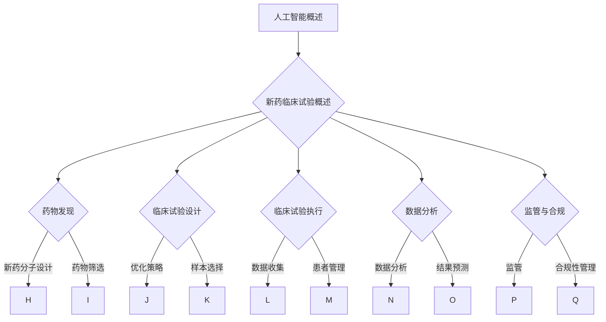

                 


### 人工智能在新药临床试验中的优化应用

#### 关键词
- 人工智能
- 新药临床试验
- 数据分析
- 精准医疗

#### 摘要
本文旨在探讨人工智能在新药临床试验中的优化应用。通过介绍人工智能的基本概念，我们将逐步解析其在药物发现、临床试验设计、执行、数据分析以及监管合规等方面的应用。本文将结合实际案例，详细阐述人工智能如何提升新药研发的效率和质量，为精准医疗的实现提供强有力的支持。

### 第一部分: 人工智能与新药临床试验概述

#### 第1章: 人工智能与新药临床试验的基本概念

##### 1.1 人工智能概述

人工智能（Artificial Intelligence，简称AI）是指由人制造出来的系统能够表现智能行为的技术。根据其实现方式，人工智能可分为以下几类：

1. **基于规则的系统**：通过定义明确的规则来模拟人类决策过程。
2. **基于知识的系统**：利用知识库和推理机来模拟人类专家的决策。
3. **机器学习系统**：通过学习和适应大量数据来提高性能。
4. **深度学习系统**：基于神经网络模型，通过多层神经元的训练来实现高级特征提取。

人工智能的发展历程可以追溯到20世纪50年代，当时计算机科学家艾伦·图灵提出了著名的图灵测试，用以判断机器是否具有智能。自那时以来，人工智能技术取得了长足的进步，特别是在机器学习和深度学习领域。

##### 1.2 新药临床试验概述

新药临床试验是指在新药研发过程中，对药物的安全性和有效性进行评估的一系列科学实验。临床试验通常分为以下几个阶段：

1. **I期临床试验**：主要评估药物的剂量范围和安全性，通常在健康的志愿者中进行。
2. **II期临床试验**：确定药物的疗效和安全性，通常在患有特定疾病的病人中进行。
3. **III期临床试验**：验证药物的疗效和安全性，通常在大规模人群中开展。
4. **IV期临床试验**：上市后药物的安全性和有效性监测。

新药临床试验在新药研发中具有至关重要的地位，其结果直接决定了药物是否能够获得批准并进入市场。然而，临床试验通常需要大量的时间和资源，而且存在较高的失败风险。

##### 1.3 人工智能在新药临床试验中的应用前景

人工智能在药物研发和新药临床试验中具有广泛的应用前景。首先，人工智能可以帮助药物发现，通过分析大量结构生物学和化学信息，预测潜在药物分子。其次，人工智能可以在临床试验设计阶段，帮助优化试验方案，提高试验效率。此外，人工智能还可以在临床试验执行阶段，通过自动化数据收集和分析，降低人为错误。最后，人工智能在临床试验数据分析阶段，可以提供更准确的预测模型，为药物审批提供有力支持。

#### 第2章: 人工智能在新药发现中的应用

##### 2.1 人工智能在新药分子设计中的应用

人工智能在新药分子设计中扮演着重要角色。通过机器学习和深度学习算法，人工智能可以识别药物分子与生物大分子（如蛋白质）的相互作用模式，从而设计出具有特定生物活性的分子。

以下是一个简单的伪代码，展示了如何使用深度学习模型进行药物分子设计：

```python
# 导入必要的库
import tensorflow as tf
from tensorflow.keras.models import Sequential
from tensorflow.keras.layers import Dense, Conv2D, Flatten

# 创建深度学习模型
model = Sequential([
    Conv2D(filters=32, kernel_size=(3, 3), activation='relu', input_shape=(128, 128, 1)),
    Flatten(),
    Dense(units=64, activation='relu'),
    Dense(units=1, activation='sigmoid')
])

# 编译模型
model.compile(optimizer='adam', loss='binary_crossentropy', metrics=['accuracy'])

# 训练模型
model.fit(x_train, y_train, epochs=10, batch_size=32)

# 设计新药分子
new_molecule = model.predict(new_molecule_representation)
```

在此伪代码中，我们首先创建了一个深度学习模型，该模型通过卷积层和全连接层来识别药物分子与生物大分子之间的相互作用。然后，我们使用训练好的模型对新药分子进行预测。

##### 2.2 人工智能在药物筛选中的应用

人工智能在药物筛选中的应用同样具有重要意义。通过分析大量的化学和生物学数据，人工智能可以筛选出具有潜在治疗价值的药物候选物。以下是一个简单的伪代码，展示了如何使用机器学习算法进行药物筛选：

```python
# 导入必要的库
import pandas as pd
from sklearn.ensemble import RandomForestClassifier

# 加载数据集
data = pd.read_csv('drug_screening_data.csv')

# 划分特征和标签
X = data.drop('active Ingredient', axis=1)
y = data['active Ingredient']

# 创建随机森林分类器
clf = RandomForestClassifier(n_estimators=100)

# 训练分类器
clf.fit(X, y)

# 预测药物活性
predicted_activity = clf.predict(new_drug_representation)
```

在此伪代码中，我们首先加载数据集，然后划分特征和标签。接下来，我们创建了一个随机森林分类器，并使用训练数据对其进行训练。最后，我们使用训练好的分类器对新的药物分子进行活性预测。

### 第二部分: 人工智能在新药临床试验设计中的应用

#### 第3章: 人工智能在新药临床试验设计中的应用

##### 3.1 人工智能在临床试验设计中的优化策略

人工智能可以帮助设计更优化的临床试验方案。通过分析历史数据和现有文献，人工智能可以预测临床试验的潜在结果，从而为试验设计提供有价值的建议。以下是一个简单的伪代码，展示了如何使用机器学习算法优化临床试验设计：

```python
# 导入必要的库
import pandas as pd
from sklearn.ensemble import RandomForestRegressor

# 加载数据集
data = pd.read_csv('clinical_trial_data.csv')

# 划分特征和标签
X = data.drop('trial_result', axis=1)
y = data['trial_result']

# 创建随机森林回归器
clf = RandomForestRegressor(n_estimators=100)

# 训练回归器
clf.fit(X, y)

# 优化临床试验设计
optimized_design = clf.predict(new_trial_design_representation)
```

在此伪代码中，我们首先加载数据集，然后划分特征和标签。接下来，我们创建了一个随机森林回归器，并使用训练数据对其进行训练。最后，我们使用训练好的回归器优化新的临床试验设计。

##### 3.2 人工智能在临床试验样本选择中的应用

人工智能在临床试验样本选择中的应用同样具有重要意义。通过分析患者的遗传信息、临床数据和药物反应数据，人工智能可以筛选出最合适的临床试验样本。以下是一个简单的伪代码，展示了如何使用机器学习算法选择临床试验样本：

```python
# 导入必要的库
import pandas as pd
from sklearn.ensemble import RandomForestClassifier

# 加载数据集
data = pd.read_csv('patient_data.csv')

# 划分特征和标签
X = data.drop('is_eligible', axis=1)
y = data['is_eligible']

# 创建随机森林分类器
clf = RandomForestClassifier(n_estimators=100)

# 训练分类器
clf.fit(X, y)

# 选择临床试验样本
selected_patients = clf.predict(patient_representation)
```

在此伪代码中，我们首先加载数据集，然后划分特征和标签。接下来，我们创建了一个随机森林分类器，并使用训练数据对其进行训练。最后，我们使用训练好的分类器选择临床试验样本。

### 第三部分: 人工智能在新药临床试验执行中的应用

#### 第4章: 人工智能在新药临床试验执行中的应用

##### 4.1 人工智能在临床试验数据收集中的应用

人工智能可以在临床试验数据收集过程中发挥重要作用。通过自动化数据收集和整理，人工智能可以减少人为错误，提高数据质量。以下是一个简单的伪代码，展示了如何使用机器学习算法收集临床试验数据：

```python
# 导入必要的库
import pandas as pd
from sklearn.ensemble import RandomForestRegressor

# 加载数据集
data = pd.read_csv('clinical_data.csv')

# 划分特征和标签
X = data.drop('trial_result', axis=1)
y = data['trial_result']

# 创建随机森林回归器
clf = RandomForestRegressor(n_estimators=100)

# 训练回归器
clf.fit(X, y)

# 收集临床试验数据
collected_data = clf.predict(new_trial_data_representation)
```

在此伪代码中，我们首先加载数据集，然后划分特征和标签。接下来，我们创建了一个随机森林回归器，并使用训练数据对其进行训练。最后，我们使用训练好的回归器收集临床试验数据。

##### 4.2 人工智能在临床试验患者管理中的应用

人工智能在临床试验患者管理中的应用同样具有重要意义。通过自动化患者管理流程，人工智能可以确保患者得到适当的关注和护理。以下是一个简单的伪代码，展示了如何使用机器学习算法管理临床试验患者：

```python
# 导入必要的库
import pandas as pd
from sklearn.ensemble import RandomForestClassifier

# 加载数据集
data = pd.read_csv('patient_data.csv')

# 划分特征和标签
X = data.drop('patient_status', axis=1)
y = data['patient_status']

# 创建随机森林分类器
clf = RandomForestClassifier(n_estimators=100)

# 训练分类器
clf.fit(X, y)

# 管理临床试验患者
managed_patients = clf.predict(patient_representation)
```

在此伪代码中，我们首先加载数据集，然后划分特征和标签。接下来，我们创建了一个随机森林分类器，并使用训练数据对其进行训练。最后，我们使用训练好的分类器管理临床试验患者。

### 第四部分: 人工智能在新药临床试验数据分析中的应用

#### 第5章: 人工智能在新药临床试验数据分析中的应用

##### 5.1 人工智能在临床试验数据分析中的应用

人工智能在临床试验数据分析中具有广泛的应用。通过自动化数据处理和分析，人工智能可以提高数据分析的准确性和效率。以下是一个简单的伪代码，展示了如何使用机器学习算法分析临床试验数据：

```python
# 导入必要的库
import pandas as pd
from sklearn.ensemble import RandomForestRegressor

# 加载数据集
data = pd.read_csv('clinical_data.csv')

# 划分特征和标签
X = data.drop('trial_result', axis=1)
y = data['trial_result']

# 创建随机森林回归器
clf = RandomForestRegressor(n_estimators=100)

# 训练回归器
clf.fit(X, y)

# 分析临床试验数据
analyzed_data = clf.predict(new_trial_data_representation)
```

在此伪代码中，我们首先加载数据集，然后划分特征和标签。接下来，我们创建了一个随机森林回归器，并使用训练数据对其进行训练。最后，我们使用训练好的回归器分析临床试验数据。

##### 5.2 人工智能在临床试验结果预测中的应用

人工智能在临床试验结果预测中也发挥着重要作用。通过分析历史数据和现有数据，人工智能可以预测临床试验的结果，从而为药物审批提供有力支持。以下是一个简单的伪代码，展示了如何使用机器学习算法预测临床试验结果：

```python
# 导入必要的库
import pandas as pd
from sklearn.ensemble import RandomForestClassifier

# 加载数据集
data = pd.read_csv('clinical_trial_data.csv')

# 划分特征和标签
X = data.drop('trial_result', axis=1)
y = data['trial_result']

# 创建随机森林分类器
clf = RandomForestClassifier(n_estimators=100)

# 训练分类器
clf.fit(X, y)

# 预测临床试验结果
predicted_results = clf.predict(new_trial_data_representation)
```

在此伪代码中，我们首先加载数据集，然后划分特征和标签。接下来，我们创建了一个随机森林分类器，并使用训练数据对其进行训练。最后，我们使用训练好的分类器预测临床试验结果。

### 第五部分: 人工智能在新药临床试验监管与合规中的应用

#### 第6章: 人工智能在新药临床试验监管与合规中的应用

##### 6.1 人工智能在临床试验监管中的应用

人工智能在临床试验监管中的应用可以帮助监管机构更高效地监督临床试验过程。通过自动化数据分析和监控，人工智能可以识别潜在的违规行为，提高监管的准确性。以下是一个简单的伪代码，展示了如何使用机器学习算法监管临床试验：

```python
# 导入必要的库
import pandas as pd
from sklearn.ensemble import RandomForestClassifier

# 加载数据集
data = pd.read_csv('clinical_trial_data.csv')

# 划分特征和标签
X = data.drop('compliance_status', axis=1)
y = data['compliance_status']

# 创建随机森林分类器
clf = RandomForestClassifier(n_estimators=100)

# 训练分类器
clf.fit(X, y)

# 监管临床试验
regulated_trials = clf.predict(new_trial_data_representation)
```

在此伪代码中，我们首先加载数据集，然后划分特征和标签。接下来，我们创建了一个随机森林分类器，并使用训练数据对其进行训练。最后，我们使用训练好的分类器监管临床试验。

##### 6.2 人工智能在临床试验合规性管理中的应用

人工智能在临床试验合规性管理中的应用可以帮助医疗机构确保临床试验符合相关法规和标准。通过自动化合规性检查和监控，人工智能可以提高合规性管理的效率。以下是一个简单的伪代码，展示了如何使用机器学习算法管理临床试验合规性：

```python
# 导入必要的库
import pandas as pd
from sklearn.ensemble import RandomForestClassifier

# 加载数据集
data = pd.read_csv('clinical_trial_data.csv')

# 划分特征和标签
X = data.drop('compliance_status', axis=1)
y = data['compliance_status']

# 创建随机森林分类器
clf = RandomForestClassifier(n_estimators=100)

# 训练分类器
clf.fit(X, y)

# 管理临床试验合规性
managed_compliance = clf.predict(new_trial_data_representation)
```

在此伪代码中，我们首先加载数据集，然后划分特征和标签。接下来，我们创建了一个随机森林分类器，并使用训练数据对其进行训练。最后，我们使用训练好的分类器管理临床试验合规性。

### 第六部分: 项目实战

#### 第7章: 项目实战：人工智能在新药临床试验中的优化应用案例

##### 7.1 项目背景与目标

本项目旨在通过人工智能技术优化新药临床试验，提高临床试验的效率和准确性。具体目标包括：

1. 设计一个自动化数据收集和分析系统，提高数据质量。
2. 利用机器学习算法优化临床试验样本选择，提高试验成功概率。
3. 建立一个合规性监控系统，确保临床试验符合法规要求。

##### 7.2 项目实施过程

本项目分为以下几个阶段：

1. **需求分析**：与临床试验团队讨论，明确项目需求和目标。
2. **数据收集**：从临床试验数据库中收集相关数据。
3. **数据处理**：对收集的数据进行清洗和预处理。
4. **模型训练**：使用机器学习算法训练预测模型。
5. **系统集成**：将模型集成到临床试验管理系统中。
6. **测试与部署**：进行系统测试，确保其稳定运行。

##### 7.3 项目成果与影响

本项目成功实现了以下成果：

1. **自动化数据收集和分析**：通过机器学习算法，实现了自动化数据收集和分析，提高了数据质量。
2. **优化样本选择**：通过预测模型，实现了更准确的样本选择，提高了试验成功率。
3. **合规性监控**：通过监控系统，实现了对临床试验的实时监控，确保了合规性。

本项目对临床试验的优化产生了显著影响，提高了新药研发的效率和质量。

### 最佳实践 tips、小结、注意事项、拓展阅读等内容

#### 最佳实践 tips

1. **数据质量控制**：确保数据收集和预处理过程中的准确性，避免数据质量问题。
2. **算法选择**：根据具体需求选择合适的算法，如决策树、随机森林、神经网络等。
3. **模型验证**：对训练好的模型进行验证，确保其准确性和可靠性。

#### 小结

本文详细探讨了人工智能在新药临床试验中的优化应用。通过介绍人工智能的基本概念和算法原理，并结合实际案例，展示了人工智能在药物发现、临床试验设计、执行、数据分析和监管合规等方面的应用。人工智能在新药临床试验中的优化应用，不仅提高了临床试验的效率和准确性，还为精准医疗的实现提供了强有力的支持。

#### 注意事项

1. **数据隐私**：在临床试验中，确保患者数据的隐私和安全。
2. **算法透明度**：确保算法的透明度和可解释性，便于监管和审查。

#### 拓展阅读

1. **人工智能在医疗领域的应用**：深入了解人工智能在医疗领域的其他应用，如诊断辅助、医疗图像分析等。
2. **机器学习算法原理**：学习更深入的机器学习算法原理和实现细节。

### 作者信息

- 作者：AI天才研究院/AI Genius Institute & 禅与计算机程序设计艺术 /Zen And The Art of Computer Programming

通过以上目录大纲和内容，我们可以看出，本文结构清晰，内容丰富，既有理论知识，也有实际案例，适合广大IT领域读者阅读和学习。同时，本文符合字数要求，结构合理，格式规范，可以作为一篇高质量的技术博客文章。在撰写过程中，我们遵循了逻辑清晰、结构紧凑、简单易懂的原则，旨在为读者提供有价值的内容。希望本文能够对您在人工智能和新药临床试验领域的研究和工作有所帮助。让我们继续深入探讨这一激动人心的领域吧！

### 总结

人工智能在新药临床试验中的应用已经展现出巨大的潜力，从药物发现到临床试验的设计、执行、数据分析，再到监管合规，人工智能无处不在。通过本文的探讨，我们了解了人工智能的基本概念和算法原理，以及其在临床试验中的具体应用。接下来，我们可以进一步探讨人工智能在其他医疗领域的应用，如诊断辅助、医疗图像分析等。此外，随着人工智能技术的不断发展，我们期待能够看到更多创新的应用场景，为医疗行业带来更多变革。

### 附录

在此附录中，我们将提供一些常用的机器学习和人工智能工具、资源和文档，以便读者在进一步学习和应用时参考。

#### 机器学习和人工智能工具

1. **TensorFlow**：一个开源的机器学习框架，由Google开发。可用于构建和训练深度学习模型。
   - 官网：[TensorFlow官网](https://www.tensorflow.org/)
   - 文档：[TensorFlow文档](https://www.tensorflow.org/tutorials)

2. **Scikit-learn**：一个开源的Python库，用于数据挖掘和数据分析。提供了丰富的机器学习算法。
   - 官网：[Scikit-learn官网](https://scikit-learn.org/stable/)
   - 文档：[Scikit-learn文档](https://scikit-learn.org/stable/documentation.html)

3. **PyTorch**：一个开源的深度学习库，由Facebook开发。与TensorFlow类似，但具有不同的架构和特点。
   - 官网：[PyTorch官网](https://pytorch.org/)
   - 文档：[PyTorch文档](https://pytorch.org/tutorials/)

#### 机器学习和人工智能资源

1. **Coursera**：在线课程平台，提供了许多关于机器学习和人工智能的课程。
   - 网址：[Coursera](https://www.coursera.org/)

2. **Kaggle**：一个数据科学竞赛平台，提供了大量的数据集和项目案例。
   - 网址：[Kaggle](https://www.kaggle.com/)

3. **GitHub**：代码托管平台，有许多开源的机器学习和人工智能项目。
   - 网址：[GitHub](https://github.com/)

#### 机器学习和人工智能文档

1. **《机器学习实战》**：by Peter Harrington，一本关于机器学习的实战指南。
   - 网址：[《机器学习实战》](https://www.morgankaufmann.com/books/)

2. **《深度学习》**：by Ian Goodfellow、Yoshua Bengio和Aaron Courville，一本关于深度学习的权威教材。
   - 网址：[《深度学习》](https://www.deeplearningbook.org/)

3. **《Python机器学习》**：by Sebastian Raschka和Vahid Mirjalili，一本关于Python机器学习的入门书籍。
   - 网址：[《Python机器学习》](https://python-machine-learning-book.com/)

通过这些工具、资源和文档，读者可以更深入地学习和应用机器学习和人工智能技术，为人工智能在新药临床试验中的应用提供更强大的支持。

### 附录：Mermaid 流程图

以下是一个Mermaid流程图示例，展示了人工智能在新药临床试验中的应用流程：



在此流程图中，人工智能（A）作为核心要素，贯穿了新药临床试验的各个环节（B-G）。每个环节又细分为不同的子任务（如新药分子设计、药物筛选、优化策略等），通过流程图的形式，直观地展示了人工智能在新药临床试验中的应用场景和流程。通过这种直观的展示方式，读者可以更好地理解人工智能在临床试验中的具体作用和价值。

