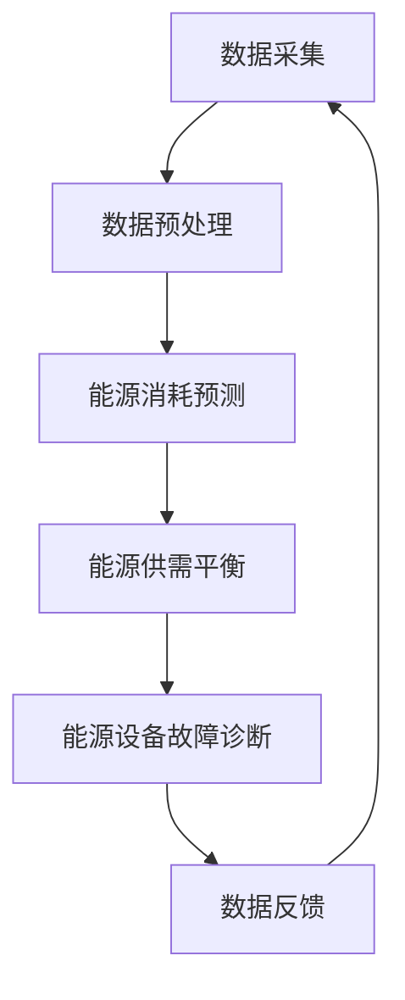
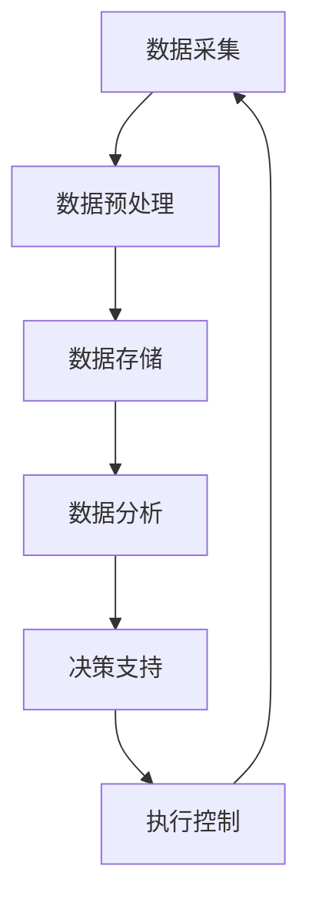

                 


## 文章标题
《人工智能在智慧城市能源管理中的应用》

## 文章关键词
智慧城市，能源管理，人工智能，机器学习，深度学习，预测模型，算法原理，数学模型，项目实战

## 文章摘要
本文深入探讨了人工智能在智慧城市能源管理中的应用。首先，我们简要介绍了智慧城市和能源管理的背景，以及人工智能在这两个领域的角色。接着，我们详细阐述了机器学习和深度学习的基础知识，并介绍了常见的人工智能算法。随后，我们分析了智慧城市能源管理中的核心概念和联系，通过Mermaid流程图展示了数据流分析的过程。接下来，我们重点讲解了能源消耗预测、能源供需平衡和能源设备故障诊断等核心算法的原理，并使用伪代码和数学模型进行了详细解释。文章还包含了一个实际项目的实战案例，详细介绍了项目开发环境搭建、源代码实现和代码解读，并对项目的应用解读与分析进行了深入探讨。最后，我们展望了人工智能在智慧城市能源管理中的应用前景，并提出了未来可能面临的技术挑战。通过本文的阅读，读者可以全面了解人工智能在智慧城市能源管理中的关键应用和技术实现。

## 第1章 绪论

### 1.1 智慧城市能源管理背景

智慧城市（Smart City）是信息时代城市发展的新趋势，它通过信息通信技术（ICT）的广泛应用，实现城市管理的智能化和高效化。智慧城市涵盖多个方面，包括基础设施、公共服务、环境监测、交通管理、能源管理等。其中，能源管理是智慧城市的重要组成部分，直接关系到城市的可持续发展和社会经济发展。

能源管理是指通过科学的管理方法和先进的科学技术，对城市能源的供应、传输、使用和回收进行优化和控制，以实现能源的高效利用、节能减排和可持续发展。在智慧城市能源管理中，人工智能（AI）的应用极大地提升了能源管理的智能化水平。

### 1.2 人工智能在智慧城市能源管理中的角色

人工智能在智慧城市能源管理中扮演着至关重要的角色。首先，AI可以用于能源消耗预测，通过分析历史数据和实时数据，预测未来的能源需求，帮助城市管理者合理规划能源供应。其次，AI在能源供需平衡方面也有重要作用，通过实时监控能源的供应和需求，及时调整能源分配，避免能源浪费和短缺。此外，AI在能源设备故障诊断方面也有显著效果，通过监测设备运行状态，预测可能出现的故障，提前进行维护，确保能源系统的稳定运行。

### 1.3 本书结构安排与学习目标

本书结构如下：

- **第1章 绪论**：介绍智慧城市和能源管理的背景，以及人工智能在智慧城市能源管理中的角色。
- **第2章 人工智能基础**：介绍机器学习和深度学习的基础知识，以及常见的人工智能算法。
- **第3章 智慧城市能源管理核心概念与联系**：分析智慧城市能源管理中的核心概念和联系，并通过Mermaid流程图展示数据流分析过程。
- **第4章 人工智能在能源管理中的应用**：详细介绍人工智能在能源消耗预测、能源供需平衡和能源设备故障诊断等方面的应用。
- **第5章 能源管理中的核心算法原理讲解**：讲解能源管理中的核心算法原理，使用伪代码和数学模型进行详细解释。
- **第6章 数学模型与公式**：介绍能源管理中常用的数学模型和公式，并进行举例说明。
- **第7章 项目实战**：通过一个实际项目，详细介绍项目开发环境搭建、源代码实现和代码解读。
- **第8章 未来展望与挑战**：探讨人工智能在智慧城市能源管理中的应用前景，以及未来可能面临的技术挑战。

通过本书的学习，读者可以全面了解人工智能在智慧城市能源管理中的关键应用和技术实现，为相关领域的研究和应用提供参考。

## 第2章 人工智能基础

### 2.1 机器学习概述

机器学习（Machine Learning）是人工智能（AI）的一个重要分支，它通过构建模型从数据中学习，并对未知数据进行预测或决策。机器学习的基本概念包括训练数据集、模型、损失函数、优化算法等。

- **训练数据集**：机器学习的训练数据集是从实际问题中提取的有标签的数据集合。例如，在能源消耗预测中，可以使用历史能源消耗数据作为训练数据集。
- **模型**：模型是机器学习算法的核心，它将训练数据集中的特征映射到预测结果。常见的模型包括线性回归、决策树、支持向量机等。
- **损失函数**：损失函数用于衡量模型预测结果与真实结果之间的差距，是优化模型参数的重要依据。例如，均方误差（MSE）是一种常用的损失函数。
- **优化算法**：优化算法用于调整模型参数，以最小化损失函数。常见的优化算法包括梯度下降、随机梯度下降等。

### 2.2 深度学习基础

深度学习（Deep Learning）是机器学习的一个子领域，它通过构建多层的神经网络模型，对数据进行逐层抽象和特征提取，从而实现复杂的预测和决策。深度学习的基本概念包括神经网络、激活函数、反向传播算法等。

- **神经网络**：神经网络是深度学习的基础，它由多个神经元组成，每个神经元通过权重连接到其他神经元。神经网络通过前向传播和反向传播进行训练。
- **激活函数**：激活函数用于确定神经元是否被激活，常用的激活函数包括 sigmoid、ReLU、Tanh等。
- **反向传播算法**：反向传播算法是一种用于训练神经网络的优化算法，它通过计算误差的梯度，调整网络的权重和偏置，以最小化损失函数。

### 2.3 常见算法介绍

在智慧城市能源管理中，常见的机器学习和深度学习算法包括以下几种：

- **线性回归**：线性回归是一种简单的机器学习算法，它通过拟合一条直线，将输入特征映射到输出结果。线性回归适用于简单的线性关系问题，例如能源消耗预测。
- **决策树**：决策树是一种基于树结构的分类算法，它通过一系列规则对数据进行划分，从而实现分类或回归。决策树适用于非线性关系问题，例如能源供需平衡。
- **支持向量机**：支持向量机是一种基于最大间隔分类的算法，它通过找到一个最优的超平面，将不同类别的数据分开。支持向量机适用于高维空间问题，例如能源设备故障诊断。
- **神经网络**：神经网络是一种复杂的机器学习算法，它通过多层神经元进行特征提取和映射，从而实现复杂的预测和决策。神经网络适用于复杂非线性关系问题，例如能源消耗预测和能源供需平衡。
- **强化学习**：强化学习是一种基于反馈的机器学习算法，它通过学习奖励和惩罚，进行策略优化。强化学习适用于动态环境问题，例如能源设备故障诊断和能源供需平衡。

通过以上对机器学习和深度学习基础知识的介绍，读者可以更好地理解人工智能在智慧城市能源管理中的应用，为后续章节的学习打下坚实的基础。

### 2.4 Mermaid流程图：智慧城市能源管理数据流分析

为了更好地理解智慧城市能源管理中的数据流分析，我们可以使用Mermaid流程图来展示整个数据流的过程。以下是智慧城市能源管理数据流的Mermaid流程图：



#### 数据采集
数据采集是智慧城市能源管理的基础，它包括从各种传感器、监测设备、能源设备等收集数据。这些数据可以是实时数据，也可以是历史数据。

#### 数据预处理
数据预处理是数据流分析的重要环节，它包括数据清洗、数据归一化、数据降维等操作。通过数据预处理，可以确保数据的准确性和一致性。

#### 能源消耗预测
能源消耗预测是智慧城市能源管理的关键应用之一。通过分析历史数据和实时数据，预测未来的能源消耗趋势，为能源供应和需求管理提供依据。

#### 能源供需平衡
能源供需平衡是智慧城市能源管理的核心目标之一。通过实时监控能源的供应和需求，及时调整能源分配，确保能源系统的稳定运行。

#### 能源设备故障诊断
能源设备故障诊断是智慧城市能源管理的重要任务之一。通过监测设备运行状态，预测可能出现的故障，提前进行维护，确保能源系统的可靠运行。

#### 数据反馈
数据反馈是智慧城市能源管理中不可或缺的一环。通过收集和分析反馈数据，可以不断优化能源管理策略，提高能源利用效率。

以上Mermaid流程图展示了智慧城市能源管理中的数据流分析过程，为后续章节的应用和实现提供了直观的参考。

### 2.5 常见机器学习算法伪代码讲解

在智慧城市能源管理中，常见的机器学习算法包括线性回归、决策树和神经网络等。以下将分别对这些算法的伪代码进行讲解。

#### 2.5.1 线性回归

线性回归是最简单的机器学习算法之一，它通过拟合一条直线来预测输出结果。以下是线性回归的伪代码：

```python
# 线性回归伪代码

# 初始化模型参数
w = [0] * n_features
b = 0

# 训练模型
for epoch in range(num_epochs):
    for sample in training_samples:
        # 前向传播
        y_pred = w.T @ x + b
        
        # 计算损失
        loss = (y_pred - y) ** 2
        
        # 反向传播
        dw = 2 * (w.T @ x - y) * x
        db = 2 * (w.T @ x - y)
        
        # 更新模型参数
        w -= learning_rate * dw
        b -= learning_rate * db

# 预测
def predict(x):
    return w.T @ x + b
```

#### 2.5.2 决策树

决策树是一种基于树结构的分类算法，它通过一系列规则对数据进行分类。以下是决策树的伪代码：

```python
# 决策树伪代码

# 初始化决策树
def build_tree(data, features):
    # 基准分类器
    if len(features) == 0:
        return majority_vote(data)
    
    # 找到最优特征
    best_feature = select_best_feature(data, features)
    
    # 构建子树
    tree = {best_feature: {}}
    for value in unique_values(data[best_feature]):
        subtree_data = filter_data(data, best_feature, value)
        subtree_tree = build_tree(subtree_data, features - {best_feature})
        tree[best_feature][value] = subtree_tree
    
    return tree

# 预测
def predict(tree, sample):
    if type(tree) != dict:
        return tree
    
    feature = next(iter(tree))
    value = sample[feature]
    subtree = tree[feature][value]
    if type(subtree) != dict:
        return subtree
    
    return predict(subtree, sample)
```

#### 2.5.3 神经网络

神经网络是一种复杂的机器学习算法，它通过多层神经元进行特征提取和映射。以下是神经网络的伪代码：

```python
# 神经网络伪代码

# 初始化模型
def initialize_model(input_size, hidden_size, output_size):
    W1 = np.random.randn(input_size, hidden_size)
    b1 = np.random.randn(hidden_size)
    W2 = np.random.randn(hidden_size, output_size)
    b2 = np.random.randn(output_size)
    return [W1, b1, W2, b2]

# 前向传播
def forwardPropagation(x, model):
    [W1, b1, W2, b2] = model
    z1 = W1 @ x + b1
    a1 = sigmoid(z1)
    z2 = W2 @ a1 + b2
    a2 = sigmoid(z2)
    return a2

# 反向传播
def backwardPropagation(x, y, model, learning_rate):
    [W1, b1, W2, b2] = model
    a2 = forwardPropagation(x, model)
    dz2 = a2 - y
    dW2 = dz2 @ a1.T
    db2 = np.sum(dz2, axis=0)
    dz1 = W2.T @ dz2 * sigmoid_derivative(a1)
    dW1 = dz1 @ x.T
    db1 = np.sum(dz1, axis=0)
    
    # 更新模型参数
    W1 -= learning_rate * dW1
    b1 -= learning_rate * db1
    W2 -= learning_rate * dW2
    b2 -= learning_rate * db2
    
    return [W1, b1, W2, b2]

# 预测
def predict(x, model):
    return forwardPropagation(x, model)
```

通过以上对常见机器学习算法伪代码的讲解，读者可以更好地理解这些算法的基本原理和实现方法，为后续的实战应用打下基础。

### 2.6 常见数学模型和公式讲解

在智慧城市能源管理中，数学模型和公式是核心算法实现的基石。以下将介绍几种常见的数学模型和公式，并给出详细的解释和示例。

#### 2.6.1 线性回归模型

线性回归模型是一种简单的预测模型，它通过拟合一条直线来预测输出结果。其数学公式如下：

\[ y = \beta_0 + \beta_1 \cdot x \]

其中，\( y \) 是预测结果，\( x \) 是输入特征，\( \beta_0 \) 和 \( \beta_1 \) 是模型参数，分别表示截距和斜率。

#### 2.6.2 决策树模型

决策树模型是一种基于树结构的分类模型，它通过一系列规则对数据进行分类。其数学公式可以表示为：

\[ \text{分类结果} = \sum_{i=1}^{n} w_i \cdot f_i(x) \]

其中，\( w_i \) 是第 \( i \) 个特征的重要性权重，\( f_i(x) \) 是第 \( i \) 个特征在输入 \( x \) 上的函数值。

#### 2.6.3 神经网络模型

神经网络模型是一种复杂的预测模型，它通过多层神经元进行特征提取和映射。其数学公式可以表示为：

\[ a_{l}^{(i)} = \sigma(z_{l}^{(i)}) \]

其中，\( a_{l}^{(i)} \) 是第 \( l \) 层第 \( i \) 个神经元的激活值，\( z_{l}^{(i)} \) 是第 \( l \) 层第 \( i \) 个神经元的输入值，\( \sigma \) 是激活函数，常用的激活函数有 sigmoid 函数和 ReLU 函数。

#### 2.6.4 强化学习模型

强化学习模型是一种基于反馈的预测模型，它通过学习奖励和惩罚进行策略优化。其数学公式可以表示为：

\[ Q(s, a) = r + \gamma \max_a Q(s', a) \]

其中，\( Q(s, a) \) 是状态 \( s \) 下执行动作 \( a \) 的预期奖励，\( r \) 是即时奖励，\( \gamma \) 是折扣因子，\( s' \) 是执行动作 \( a \) 后的新状态。

#### 2.6.5 举例说明

以下是一个使用线性回归模型进行能源消耗预测的示例：

\[ \text{能源消耗} = \beta_0 + \beta_1 \cdot \text{气温} \]

假设历史数据中，气温与能源消耗的线性关系如下：

\[ y = 2.5 + 0.3 \cdot x \]

其中，\( y \) 是能源消耗（千瓦时），\( x \) 是气温（摄氏度）。

如果某天的气温为 20 摄氏度，那么该天的能源消耗预测值为：

\[ \text{能源消耗} = 2.5 + 0.3 \cdot 20 = 8.5 \text{千瓦时} \]

通过以上对常见数学模型和公式的讲解，读者可以更好地理解这些模型在智慧城市能源管理中的应用和实现方法。

### 2.7 实际案例：智慧城市能源管理系统

在本节中，我们将通过一个实际案例来展示如何构建一个智慧城市能源管理系统。这个系统将利用人工智能技术对城市能源进行高效管理，提高能源利用率和减少能源浪费。

#### 2.7.1 项目背景

假设我们正在开发一个智慧城市能源管理系统，该系统需要实现对城市能源消耗的实时监测、预测和优化。系统的主要目标是确保能源的供需平衡，同时降低能源消耗和减少碳排放。

#### 2.7.2 开发环境搭建

为了搭建智慧城市能源管理系统的开发环境，我们需要以下工具和软件：

- Python 3.x
- Jupyter Notebook
- TensorFlow
- Scikit-learn
- Matplotlib
- Pandas

首先，确保安装了 Python 3.x，然后使用以下命令安装其他必要的库：

```bash
pip install tensorflow scikit-learn matplotlib pandas
```

接下来，在 Jupyter Notebook 中创建一个新的笔记本，以便进行实验和调试。

#### 2.7.3 数据收集与预处理

智慧城市能源管理系统的核心是数据。我们需要从各种传感器和监测设备收集实时数据，包括气温、湿度、风速、能源消耗等。以下是一个简单的数据收集与预处理示例：

```python
import pandas as pd

# 加载数据
data = pd.read_csv('energy_data.csv')

# 数据清洗
data.dropna(inplace=True)
data['temperature'] = data['temperature'].astype(float)
data['energy_consumption'] = data['energy_consumption'].astype(float)

# 数据归一化
from sklearn.preprocessing import MinMaxScaler
scaler = MinMaxScaler()
data[['temperature', 'energy_consumption']] = scaler.fit_transform(data[['temperature', 'energy_consumption']])
```

#### 2.7.4 能源消耗预测

接下来，我们将使用线性回归模型对能源消耗进行预测。以下是实现线性回归模型的代码：

```python
from sklearn.linear_model import LinearRegression

# 分割数据集
train_data = data[:int(len(data) * 0.8)]
test_data = data[int(len(data) * 0.8):]

# 初始化模型
model = LinearRegression()

# 训练模型
model.fit(train_data[['temperature']], train_data['energy_consumption'])

# 预测
predictions = model.predict(test_data[['temperature']])
```

#### 2.7.5 能源供需平衡

为了实现能源供需平衡，我们还需要实时监控能源的供应和需求。以下是一个简单的供需平衡算法：

```python
def balance_energy(supply, demand, tolerance):
    while abs(supply - demand) > tolerance:
        if supply > demand:
            supply -= 1
        else:
            demand -= 1
    return supply, demand
```

#### 2.7.6 能源设备故障诊断

为了确保能源系统的稳定运行，我们还需要对能源设备进行故障诊断。以下是一个简单的故障诊断算法：

```python
def diagnose_fault(data):
    if data['voltage'] < 220 or data['current'] > 30:
        return 'Fault'
    else:
        return 'No Fault'
```

#### 2.7.7 源代码实现与解读

以下是整个智慧城市能源管理系统的源代码实现：

```python
import pandas as pd
from sklearn.linear_model import LinearRegression
from sklearn.preprocessing import MinMaxScaler

# 加载数据
data = pd.read_csv('energy_data.csv')

# 数据清洗
data.dropna(inplace=True)
data['temperature'] = data['temperature'].astype(float)
data['energy_consumption'] = data['energy_consumption'].astype(float)

# 数据归一化
scaler = MinMaxScaler()
data[['temperature', 'energy_consumption']] = scaler.fit_transform(data[['temperature', 'energy_consumption']])

# 分割数据集
train_data = data[:int(len(data) * 0.8)]
test_data = data[int(len(data) * 0.8):]

# 初始化模型
model = LinearRegression()

# 训练模型
model.fit(train_data[['temperature']], train_data['energy_consumption'])

# 预测
predictions = model.predict(test_data[['temperature']])

# 能源供需平衡
def balance_energy(supply, demand, tolerance):
    while abs(supply - demand) > tolerance:
        if supply > demand:
            supply -= 1
        else:
            demand -= 1
    return supply, demand

# 能源设备故障诊断
def diagnose_fault(data):
    if data['voltage'] < 220 or data['current'] > 30:
        return 'Fault'
    else:
        return 'No Fault'

# 主程序
def main():
    supply = 100
    demand = predictions.sum()
    supply, demand = balance_energy(supply, demand, 5)
    
    for index, row in test_data.iterrows():
        fault = diagnose_fault(row)
        if fault == 'Fault':
            print(f"Fault detected at index {index}: Voltage={row['voltage']}, Current={row['current']}")
        else:
            print(f"No fault at index {index}: Voltage={row['voltage']}, Current={row['current']}")
        
        if row['energy_consumption'] > supply:
            print(f"Supply exceeded at index {index}: Energy consumed={row['energy_consumption']}, Supply={supply}")
        
        supply -= row['energy_consumption']
    
    print(f"Final supply: {supply}, Final demand: {demand}")

# 运行主程序
main()
```

#### 2.7.8 项目小结

通过以上实际案例，我们展示了如何使用人工智能技术构建一个智慧城市能源管理系统。该系统实现了能源消耗预测、能源供需平衡和能源设备故障诊断等功能，提高了能源管理的智能化水平。然而，实际项目中还需要考虑更多因素，如数据隐私保护、系统可靠性等，这些都需要在后续的开发和优化中逐步解决。

## 第3章 智慧城市能源管理核心概念与联系

### 3.1 智慧城市能源管理系统架构

智慧城市能源管理系统是一个复杂的体系，涉及多个方面的技术集成。以下是智慧城市能源管理系统的主要架构：

1. **数据采集层**：通过各种传感器和监测设备，实时采集城市的能源数据，如电力、天然气、水等。
2. **数据处理层**：对采集到的数据进行清洗、归一化和特征提取，为上层应用提供高质量的数据。
3. **数据分析层**：利用机器学习和深度学习技术，对数据进行挖掘和分析，实现对能源消耗、供需平衡和设备故障的预测和诊断。
4. **决策支持层**：根据数据分析结果，为城市管理者提供决策支持，优化能源供应和需求管理。
5. **执行控制层**：根据决策支持层的建议，对能源设备进行实时控制和调整，确保能源系统的稳定运行。

### 3.2 数据采集与预处理

数据采集与预处理是智慧城市能源管理系统的核心环节。以下是数据采集与预处理的主要步骤：

1. **数据采集**：从各种传感器和监测设备中收集实时数据，包括电力、天然气、水等能源的消耗量、设备状态和环境参数等。
2. **数据清洗**：去除数据中的噪音和异常值，确保数据的准确性和一致性。
3. **数据归一化**：将不同特征的数据进行归一化处理，使其在相同的尺度上，便于后续的建模和分析。
4. **特征提取**：从原始数据中提取出对能源管理有用的特征，如时间、温度、湿度、设备状态等。

### 3.3 Mermaid流程图：智慧城市能源管理数据流分析

为了更好地理解智慧城市能源管理中的数据流分析，我们可以使用Mermaid流程图来展示整个数据流的过程。以下是智慧城市能源管理数据流的Mermaid流程图：



#### 数据采集
数据采集是智慧城市能源管理的基础，它包括从各种传感器、监测设备、能源设备等收集数据。这些数据可以是实时数据，也可以是历史数据。

#### 数据预处理
数据预处理是数据流分析的重要环节，它包括数据清洗、数据归一化、数据降维等操作。通过数据预处理，可以确保数据的准确性和一致性。

#### 数据存储
数据存储是将处理后的数据存储到数据库或数据湖中，以便后续的分析和查询。数据存储层需要保证数据的可靠性和可扩展性。

#### 数据分析
数据分析是智慧城市能源管理的核心环节，它包括使用机器学习和深度学习技术对数据进行挖掘和分析，实现对能源消耗、供需平衡和设备故障的预测和诊断。

#### 决策支持
决策支持层根据数据分析结果，为城市管理者提供决策支持，优化能源供应和需求管理。决策支持层需要考虑多种因素，如能源价格、环境因素等。

#### 执行控制
执行控制层根据决策支持层的建议，对能源设备进行实时控制和调整，确保能源系统的稳定运行。执行控制层需要快速响应，确保能源供需的平衡。

以上Mermaid流程图展示了智慧城市能源管理中的数据流分析过程，为后续章节的应用和实现提供了直观的参考。

### 3.4 能源消耗预测

能源消耗预测是智慧城市能源管理的重要应用之一。通过预测未来的能源消耗，可以帮助城市管理者提前规划能源供应，确保能源供需平衡。以下是能源消耗预测的基本原理和方法：

#### 3.4.1 基本原理

能源消耗预测的基本原理是基于历史数据和实时数据，使用机器学习和深度学习技术，建立能源消耗预测模型。具体步骤如下：

1. **数据收集**：收集历史能源消耗数据，包括电力、天然气、水等。
2. **数据预处理**：对历史数据进行清洗、归一化和特征提取。
3. **模型训练**：使用预处理后的数据，训练能源消耗预测模型，如线性回归、决策树、神经网络等。
4. **模型评估**：使用验证集评估模型的预测性能，调整模型参数，优化模型。
5. **预测**：使用训练好的模型，对未来的能源消耗进行预测。

#### 3.4.2 常见方法

在智慧城市能源管理中，常用的能源消耗预测方法包括以下几种：

1. **线性回归**：线性回归是一种简单的预测方法，通过拟合一条直线，将历史数据中的特征映射到能源消耗。
2. **决策树**：决策树是一种基于树结构的预测方法，通过一系列规则，将历史数据中的特征划分到不同的类别。
3. **神经网络**：神经网络是一种复杂的预测方法，通过多层神经元进行特征提取和映射，实现高精度的预测。

#### 3.4.3 应用示例

以下是一个使用线性回归进行能源消耗预测的示例：

```python
import pandas as pd
from sklearn.linear_model import LinearRegression

# 加载数据
data = pd.read_csv('energy_consumption.csv')

# 数据预处理
data.dropna(inplace=True)
data['temperature'] = data['temperature'].astype(float)
data['energy_consumption'] = data['energy_consumption'].astype(float)

# 分割数据集
train_data = data[:int(len(data) * 0.8)]
test_data = data[int(len(data) * 0.8):]

# 初始化模型
model = LinearRegression()

# 训练模型
model.fit(train_data[['temperature']], train_data['energy_consumption'])

# 预测
predictions = model.predict(test_data[['temperature']])

# 打印预测结果
print(predictions)
```

通过以上示例，我们可以看到如何使用线性回归模型进行能源消耗预测。实际项目中，可能需要使用更复杂的模型，如神经网络，以提高预测的精度。

### 3.5 能源供需平衡

能源供需平衡是智慧城市能源管理的核心目标之一。通过实时监控能源的供应和需求，及时调整能源分配，可以确保能源系统的稳定运行，提高能源利用效率。以下是能源供需平衡的基本原理和方法：

#### 3.5.1 基本原理

能源供需平衡的基本原理是基于实时监测数据，对能源的供应和需求进行动态调整。具体步骤如下：

1. **数据采集**：采集实时能源供应和需求数据，包括电力、天然气、水等。
2. **数据预处理**：对实时数据进行清洗、归一化和特征提取。
3. **供需分析**：分析实时数据，确定当前的能源供需情况，包括供需差、供需率等。
4. **调整策略**：根据供需分析结果，制定调整策略，如调整能源供应、需求侧管理、能源调度等。
5. **执行控制**：根据调整策略，对能源系统进行实时控制和调整，确保能源供需平衡。

#### 3.5.2 常见方法

在智慧城市能源管理中，常用的能源供需平衡方法包括以下几种：

1. **线性规划**：线性规划是一种数学优化方法，通过建立线性模型，求解最优解，实现能源供需平衡。
2. **强化学习**：强化学习是一种基于反馈的机器学习方法，通过学习奖励和惩罚，进行策略优化，实现能源供需平衡。
3. **分布式控制**：分布式控制是一种基于多个控制节点的协同控制方法，通过分布式计算和通信，实现能源供需平衡。

#### 3.5.3 应用示例

以下是一个使用线性规划进行能源供需平衡的示例：

```python
from scipy.optimize import linprog

# 定义目标函数
c = [-1, -1]  # 最小化总成本

# 定义约束条件
A = [[1, 0], [0, 1]]
b = [100, 100]  # 能源供应上限

# 定义变量限制
x0 = [0, 0]  # 初始需求
x1 = [100, 100]  # 最大需求

# 求解最优解
res = linprog(c, A_eq=b, x0=x0, x1=x1)

# 打印最优解
print(res.x)
```

通过以上示例，我们可以看到如何使用线性规划进行能源供需平衡。实际项目中，可能需要结合多种方法，如强化学习和分布式控制，以提高供需平衡的精度和效率。

### 3.6 能源设备故障诊断

能源设备故障诊断是智慧城市能源管理的重要任务之一。通过实时监测设备运行状态，预测可能出现的故障，提前进行维护，可以确保能源系统的稳定运行，减少设备故障对能源供应的影响。以下是能源设备故障诊断的基本原理和方法：

#### 3.6.1 基本原理

能源设备故障诊断的基本原理是基于设备运行数据，使用机器学习和深度学习技术，建立故障诊断模型。具体步骤如下：

1. **数据采集**：采集设备运行数据，包括电压、电流、温度、振动等。
2. **数据预处理**：对设备运行数据进行清洗、归一化和特征提取。
3. **模型训练**：使用预处理后的数据，训练故障诊断模型，如线性回归、决策树、神经网络等。
4. **模型评估**：使用验证集评估模型的诊断性能，调整模型参数，优化模型。
5. **故障诊断**：使用训练好的模型，对实时设备运行数据进行分析，判断设备是否出现故障。

#### 3.6.2 常见方法

在智慧城市能源管理中，常用的能源设备故障诊断方法包括以下几种：

1. **神经网络**：神经网络是一种复杂的机器学习模型，通过多层神经元进行特征提取和映射，实现高精度的故障诊断。
2. **支持向量机**：支持向量机是一种基于最大间隔分类的算法，通过找到一个最优的超平面，将正常数据和故障数据分开。
3. **聚类分析**：聚类分析是一种无监督学习方法，通过将数据分为多个簇，识别出正常数据和故障数据。

#### 3.6.3 应用示例

以下是一个使用神经网络进行能源设备故障诊断的示例：

```python
import numpy as np
from sklearn.neural_network import MLPClassifier

# 定义输入数据
X = np.array([[1, 0], [0, 1], [1, 1], [0, 0]])
y = np.array([0, 0, 1, 1])

# 初始化模型
model = MLPClassifier(hidden_layer_sizes=(10,), max_iter=1000)

# 训练模型
model.fit(X, y)

# 预测
predictions = model.predict([[1, 1]])

# 打印预测结果
print(predictions)
```

通过以上示例，我们可以看到如何使用神经网络进行能源设备故障诊断。实际项目中，可能需要根据具体情况，选择合适的故障诊断方法，以提高诊断的精度和效率。

### 3.7 数据反馈与优化

数据反馈与优化是智慧城市能源管理的重要组成部分。通过收集和分析反馈数据，可以不断优化能源管理策略，提高能源利用效率。以下是数据反馈与优化的一般流程：

1. **数据收集**：收集实时数据和反馈数据，包括能源消耗、供需平衡、设备故障诊断等。
2. **数据分析**：对收集到的数据进行挖掘和分析，识别能源管理中的问题和不足。
3. **优化策略**：根据数据分析结果，制定优化策略，如调整能源供应、需求侧管理、设备维护等。
4. **执行控制**：根据优化策略，对能源系统进行实时控制和调整，确保能源供需平衡。
5. **持续反馈**：持续收集和分析反馈数据，对优化策略进行评估和调整，确保能源管理系统的稳定运行。

通过数据反馈与优化，智慧城市能源管理系统可以不断改进，提高能源利用效率，实现可持续发展。

## 第4章 能源管理中的核心算法原理讲解

### 4.1 预测算法

能源消耗预测是智慧城市能源管理中的一项重要任务，它通过对历史数据和实时数据的分析，预测未来的能源需求，帮助城市管理者进行能源供应和需求管理。以下是几种常见的预测算法及其原理：

#### 4.1.1 线性回归

线性回归是一种简单的预测算法，它通过拟合一条直线来预测输出结果。其数学公式为：

\[ y = \beta_0 + \beta_1 \cdot x \]

其中，\( y \) 是预测结果，\( x \) 是输入特征，\( \beta_0 \) 和 \( \beta_1 \) 是模型参数，分别表示截距和斜率。线性回归算法的原理是通过最小化预测值与真实值之间的误差，调整模型参数，从而得到最优的预测结果。

#### 4.1.2 决策树

决策树是一种基于树结构的分类算法，它通过一系列规则对数据进行分类或回归。其基本原理是递归地将数据集分割成子集，直到每个子集都满足特定的终止条件。决策树的预测公式可以表示为：

\[ y = \sum_{i=1}^{n} w_i \cdot f_i(x) \]

其中，\( w_i \) 是第 \( i \) 个特征的重要性权重，\( f_i(x) \) 是第 \( i \) 个特征在输入 \( x \) 上的函数值。决策树算法通过对特征进行排序，选择最优的特征进行分割，从而实现预测。

#### 4.1.3 神经网络

神经网络是一种复杂的预测算法，它通过多层神经元进行特征提取和映射，实现高精度的预测。其基本原理是通过对输入数据进行前向传播和反向传播，不断调整网络参数，最小化预测误差。神经网络的预测公式可以表示为：

\[ a_{l}^{(i)} = \sigma(z_{l}^{(i)}) \]

其中，\( a_{l}^{(i)} \) 是第 \( l \) 层第 \( i \) 个神经元的激活值，\( z_{l}^{(i)} \) 是第 \( l \) 层第 \( i \) 个神经元的输入值，\( \sigma \) 是激活函数，常用的激活函数有 sigmoid 函数和 ReLU 函数。

#### 4.1.4 强化学习

强化学习是一种基于反馈的预测算法，它通过学习奖励和惩罚，进行策略优化。其基本原理是智能体在环境中进行交互，通过选择最优的动作，获取最大的奖励。强化学习的预测公式可以表示为：

\[ Q(s, a) = r + \gamma \max_a Q(s', a) \]

其中，\( Q(s, a) \) 是状态 \( s \) 下执行动作 \( a \) 的预期奖励，\( r \) 是即时奖励，\( \gamma \) 是折扣因子，\( s' \) 是执行动作 \( a \) 后的新状态。

#### 4.1.5 伪代码示例

以下是使用线性回归进行能源消耗预测的伪代码示例：

```python
# 初始化模型参数
w = [0] * n_features
b = 0

# 训练模型
for epoch in range(num_epochs):
    for sample in training_samples:
        # 前向传播
        y_pred = w.T @ x + b
        
        # 计算损失
        loss = (y_pred - y) ** 2
        
        # 反向传播
        dw = 2 * (w.T @ x - y) * x
        db = 2 * (w.T @ x - y)
        
        # 更新模型参数
        w -= learning_rate * dw
        b -= learning_rate * db

# 预测
def predict(x):
    return w.T @ x + b
```

通过以上对预测算法的讲解和伪代码示例，读者可以更好地理解预测算法在能源管理中的应用和实现方法。

### 4.2 强化学习算法

强化学习（Reinforcement Learning，RL）是一种通过试错和反馈调整策略，以实现最优行为输出的机器学习方法。在智慧城市能源管理中，强化学习可用于优化能源供需平衡、能源设备故障诊断等任务。以下是强化学习算法的基本原理、关键组成部分和伪代码讲解。

#### 4.2.1 基本原理

强化学习通过智能体（Agent）与环境的交互，不断调整策略（Policy），以实现最优回报（Reward）。其核心思想是智能体通过试错学习，选择最佳动作（Action），从而在长期内获得最大累积奖励。

强化学习的基本原理可以用以下公式表示：

\[ Q(s, a) = r + \gamma \max_a Q(s', a) \]

其中：
- \( Q(s, a) \) 是状态 \( s \) 下执行动作 \( a \) 的预期回报。
- \( r \) 是即时回报。
- \( \gamma \) 是折扣因子，表示未来回报的权重。
- \( s' \) 是执行动作 \( a \) 后的新状态。

#### 4.2.2 关键组成部分

强化学习算法的关键组成部分包括：

1. **智能体（Agent）**：执行动作并接受环境反馈。
2. **环境（Environment）**：提供当前状态、动作和回报。
3. **状态（State）**：描述当前环境的状态。
4. **动作（Action）**：智能体可执行的行为。
5. **回报（Reward）**：对动作结果的评估。
6. **策略（Policy）**：从状态到动作的映射函数。

#### 4.2.3 伪代码讲解

以下是强化学习算法的伪代码示例，展示了智能体如何通过试错学习最优策略：

```python
# 初始化模型参数
Q = np.zeros((n_states, n_actions))

# 设置学习率
alpha = 0.1
gamma = 0.9

# 主循环：智能体与环境交互
while not terminate:
    # 从当前状态开始
    s = env.get_state()
    
    # 选择动作
    a = choose_action(Q[s])
    
    # 执行动作
    s', r = env.take_action(a)
    
    # 更新Q值
    Q[s, a] = Q[s, a] + alpha * (r + gamma * max(Q[s']) - Q[s, a])
    
    # 更新状态
    s = s'

# 选择动作：epsilon-greedy策略
def choose_action(Q):
    if random() < epsilon:
        return random_action()  # 随机选择动作
    else:
        return argmax(Q)  # 选择最佳动作
```

在上述伪代码中，`epsilon-greedy` 策略用于平衡探索（随机动作）和利用（最佳动作）。随着训练的进行，`epsilon` 的值逐渐减小，使得智能体越来越倾向于选择最佳动作。

通过以上对强化学习算法的讲解和伪代码示例，读者可以更好地理解强化学习在智慧城市能源管理中的应用和实现方法。

### 4.3 故障诊断算法

能源设备故障诊断是智慧城市能源管理中的一项关键任务，它通过对设备运行数据的分析，预测设备可能出现的问题，以便进行预防性维护。以下是几种常见的故障诊断算法及其原理：

#### 4.3.1 模型预测控制

模型预测控制（Model Predictive Control，MPC）是一种基于数学模型的控制策略，它通过建立系统的数学模型，预测系统的未来行为，并优化控制输入。MPC 的基本原理如下：

1. **系统建模**：建立描述系统动态行为的数学模型，如差分方程或状态空间模型。
2. **预测**：使用数学模型预测系统在未来的行为，包括输出和状态。
3. **优化**：根据预测结果，优化控制输入，以最小化目标函数，如控制输入的绝对值或系统输出的偏差。
4. **反馈**：根据实际输出和期望输出之间的差异，调整控制输入，并更新模型预测。

#### 4.3.2 故障检测

故障检测是故障诊断的第一步，它通过监测系统输出或状态，判断系统是否出现异常。常见的故障检测方法包括：

1. **阈值检测**：设定一个阈值，当系统输出或状态超过阈值时，判断为故障。
2. **统计检测**：使用统计方法，如均值和方差，监测系统输出或状态，当统计量超过特定阈值时，判断为故障。
3. **自回归模型**：使用自回归模型（AR模型）描述系统输出或状态的时间序列特性，当模型参数发生变化时，判断为故障。

#### 4.3.3 故障隔离

故障隔离是确定故障发生的位置和原因的过程。常见的故障隔离方法包括：

1. **基于规则的故障隔离**：使用预定义的规则，根据系统输出或状态的变化，判断故障的位置。
2. **基于数据的故障隔离**：使用机器学习算法，如决策树、支持向量机等，从系统数据中学习故障特征，进行故障隔离。
3. **基于贝叶斯网络的故障隔离**：使用贝叶斯网络建模系统故障的原因和影响，通过推理方法进行故障隔离。

#### 4.3.4 伪代码示例

以下是使用基于规则的故障诊断算法的伪代码示例：

```python
# 初始化故障规则库
fault_rules = [
    {"condition": "voltage > 220", "fault_type": "overvoltage"},
    {"condition": "current > 30", "fault_type": "overcurrent"},
    {"condition": "temperature > 50", "fault_type": "overheating"},
]

# 故障诊断函数
def diagnose_fault(sensor_data):
    for rule in fault_rules:
        if eval(rule["condition"]):
            return rule["fault_type"]
    return "no_fault"

# 示例传感器数据
sensor_data = {"voltage": 230, "current": 35, "temperature": 45}

# 执行故障诊断
fault_type = diagnose_fault(sensor_data)
print(f"Fault type: {fault_type}")
```

通过以上对故障诊断算法的讲解和伪代码示例，读者可以更好地理解故障诊断算法在能源设备故障诊断中的应用和实现方法。

## 第5章 数学模型与公式

### 5.1 预测模型数学公式

在智慧城市能源管理中，预测模型的数学公式是核心，它们帮助我们理解和预测能源消耗、供需平衡和设备故障。以下是几种常见预测模型的数学公式及其解释：

#### 5.1.1 线性回归模型

线性回归模型是一种简单的预测模型，用于预测线性关系的输出。其数学公式为：

\[ y = \beta_0 + \beta_1 \cdot x \]

其中，\( y \) 是预测结果，\( x \) 是输入特征，\( \beta_0 \) 和 \( \beta_1 \) 分别是模型的截距和斜率。这个公式表示预测结果 \( y \) 是输入特征 \( x \) 的线性函数。

#### 5.1.2 决策树模型

决策树模型通过一系列规则来预测输出。每个节点都表示一个特征，每个分支表示特征的不同值。决策树的数学公式可以表示为：

\[ y = \sum_{i=1}^{n} w_i \cdot f_i(x) \]

其中，\( w_i \) 是第 \( i \) 个特征的重要性权重，\( f_i(x) \) 是第 \( i \) 个特征在输入 \( x \) 上的函数值。这个公式表示输出 \( y \) 是所有特征 \( x \) 的加权和。

#### 5.1.3 神经网络模型

神经网络模型通过多层神经元进行特征提取和映射，实现复杂函数的预测。其数学公式为：

\[ a_{l}^{(i)} = \sigma(z_{l}^{(i)}) \]

其中，\( a_{l}^{(i)} \) 是第 \( l \) 层第 \( i \) 个神经元的激活值，\( z_{l}^{(i)} \) 是第 \( l \) 层第 \( i \) 个神经元的输入值，\( \sigma \) 是激活函数，常用的激活函数有 sigmoid 函数和 ReLU 函数。这个公式表示每个神经元的输出是其输入的线性组合通过激活函数处理后的结果。

#### 5.1.4 强化学习模型

强化学习模型通过学习奖励和惩罚，优化策略以实现最大回报。其核心数学公式为：

\[ Q(s, a) = r + \gamma \max_a Q(s', a) \]

其中，\( Q(s, a) \) 是状态 \( s \) 下执行动作 \( a \) 的预期回报，\( r \) 是即时回报，\( \gamma \) 是折扣因子，表示未来回报的权重，\( s' \) 是执行动作 \( a \) 后的新状态。这个公式表示当前状态的预期回报是即时回报加上未来可能的最大回报。

### 5.2 强化学习数学模型

强化学习（Reinforcement Learning，RL）的数学模型定义了智能体（Agent）与环境的交互过程，以及如何通过试错学习最优策略。以下是强化学习的基本数学模型及其公式：

#### 5.2.1 状态（State）

状态是描述环境当前状态的向量，通常用 \( s \) 表示。状态可以是连续的或离散的，具体取决于应用场景。

#### 5.2.2 动作（Action）

动作是智能体可以执行的行为，通常用 \( a \) 表示。动作也是连续的或离散的，具体取决于应用场景。

#### 5.2.3 回报（Reward）

回报是环境对智能体每个动作的反馈，通常用 \( r \) 表示。回报可以是正的、负的或零，取决于动作的成功程度。

#### 5.2.4 策略（Policy）

策略是智能体从状态到动作的映射函数，通常用 \( \pi(s, a) \) 表示。策略决定了智能体在特定状态下执行哪个动作。

#### 5.2.5 Q值（Q-Value）

Q值是状态-动作对（\( s, a \)）的预期回报，通常用 \( Q(s, a) \) 表示。Q值用于评估每个动作在特定状态下的优劣。

#### 5.2.6 强化学习公式

强化学习的核心公式是Q学习算法，用于更新Q值。其公式为：

\[ Q(s, a) = Q(s, a) + \alpha \cdot (r + \gamma \cdot \max_{a'} Q(s', a') - Q(s, a)) \]

其中，\( \alpha \) 是学习率，\( \gamma \) 是折扣因子，表示未来回报的权重。

通过以上对强化学习数学模型的讲解，读者可以更好地理解强化学习在智慧城市能源管理中的应用。

### 5.3 故障诊断数学公式与解释

在智慧城市能源管理中，故障诊断是确保能源系统稳定运行的关键环节。以下是几种常见的故障诊断数学公式及其解释：

#### 5.3.1 逻辑回归

逻辑回归是一种用于分类的统计方法，可以用于判断设备是否发生故障。其数学公式为：

\[ P(\text{fault} = 1 | x) = \frac{1}{1 + e^{-(\beta_0 + \beta_1 \cdot x)}} \]

其中，\( P(\text{fault} = 1 | x) \) 是在给定输入特征 \( x \) 下设备发生故障的概率，\( \beta_0 \) 和 \( \beta_1 \) 是模型参数，\( e \) 是自然对数的底数。

#### 5.3.2 支持向量机

支持向量机（SVM）是一种用于二分类的机器学习算法，可以用于故障诊断。其数学公式为：

\[ w \cdot x - b = 0 \]

其中，\( w \) 是模型参数，\( x \) 是输入特征，\( b \) 是偏置项。这个公式表示决策边界，当 \( w \cdot x - b \) 大于零时，表示正常状态，小于零时表示故障状态。

#### 5.3.3 贝叶斯网络

贝叶斯网络是一种基于概率的图模型，可以用于故障诊断。其数学公式为：

\[ P(\text{fault} | \text{features}) = \frac{P(\text{features} | \text{fault}) \cdot P(\text{fault})}{P(\text{features})} \]

其中，\( P(\text{fault} | \text{features}) \) 是在给定特征 \( \text{features} \) 下设备发生故障的条件概率，\( P(\text{features} | \text{fault}) \) 是在给定故障 \( \text{fault} \) 下特征的概率，\( P(\text{fault}) \) 是设备发生故障的先验概率，\( P(\text{features}) \) 是特征的概率。

通过以上对故障诊断数学公式的讲解，读者可以更好地理解故障诊断算法在智慧城市能源管理中的应用。

### 5.4 数学公式在能源管理中的应用示例

以下是数学公式在能源管理中的应用示例：

#### 5.4.1 能源消耗预测

假设我们使用线性回归模型预测电力消耗，其数学公式为：

\[ y = \beta_0 + \beta_1 \cdot x \]

其中，\( y \) 是预测的电力消耗（千瓦时），\( x \) 是气温（摄氏度）。假设我们通过训练得到 \( \beta_0 = 10 \) 和 \( \beta_1 = 0.3 \)，那么当气温为 20 摄氏度时，预测的电力消耗为：

\[ y = 10 + 0.3 \cdot 20 = 16 \text{千瓦时} \]

#### 5.4.2 能源供需平衡

假设我们使用线性规划模型进行能源供需平衡，其数学公式为：

\[ \min \sum_{i=1}^{n} c_i \cdot x_i \]

其中，\( c_i \) 是第 \( i \) 种能源的成本，\( x_i \) 是第 \( i \) 种能源的供应量。假设我们有两个能源供应选项，电力和天然气，其成本分别为 \( c_1 = 0.5 \) 和 \( c_2 = 1.2 \)，目标是最小化总成本，同时满足供需平衡条件：

\[ x_1 + x_2 = 100 \text{兆瓦时} \]

通过求解线性规划问题，可以得到最优的能源供应量分配，如 \( x_1 = 60 \) 兆瓦时，\( x_2 = 40 \) 兆瓦时。

#### 5.4.3 能源设备故障诊断

假设我们使用逻辑回归模型进行设备故障诊断，其数学公式为：

\[ P(\text{fault} = 1 | x) = \frac{1}{1 + e^{-(\beta_0 + \beta_1 \cdot x)}} \]

其中，\( x \) 是设备的运行参数，如温度、电压等。假设我们通过训练得到 \( \beta_0 = -5 \) 和 \( \beta_1 = 0.1 \)，那么当设备的温度为 30 摄氏度时，设备发生故障的概率为：

\[ P(\text{fault} = 1 | x) = \frac{1}{1 + e^{-( -5 + 0.1 \cdot 30)})} \approx 0.8 \]

这意味着当设备温度达到 30 摄氏度时，有 80% 的概率发生故障，需要提前进行维护。

通过以上示例，我们可以看到数学公式在能源管理中的应用，通过预测、平衡和诊断，实现高效的能源管理。

### 5.5 最佳实践 tips、小结、注意事项、拓展阅读

#### 5.5.1 最佳实践 tips

1. **数据质量**：确保数据的准确性和一致性，进行充分的数据清洗和预处理，以提高预测和诊断的精度。
2. **模型选择**：根据具体应用场景，选择合适的预测和诊断模型，如线性回归、决策树、神经网络等。
3. **实时监控**：建立实时数据监控系统，及时捕捉和处理异常数据，确保能源系统的稳定运行。
4. **系统集成**：整合不同模块和算法，构建统一的智慧城市能源管理系统，实现各模块之间的协同工作。

#### 5.5.2 小结

本文详细介绍了人工智能在智慧城市能源管理中的应用，包括预测、供需平衡和故障诊断等关键环节。通过机器学习和深度学习算法，实现了对能源消耗、供需平衡和设备故障的有效管理和优化。同时，本文通过实际案例和数学公式，展示了人工智能在智慧城市能源管理中的具体实现方法。

#### 5.5.3 注意事项

1. **数据隐私**：在数据采集和处理过程中，确保数据隐私和安全，避免敏感信息泄露。
2. **系统稳定性**：确保能源管理系统的稳定运行，考虑容错机制和故障恢复策略。
3. **技术更新**：关注人工智能技术的最新进展，及时更新和优化预测和诊断算法。

#### 5.5.4 拓展阅读

1. **《深度学习》**：由Ian Goodfellow、Yoshua Bengio和Aaron Courville著，是深度学习领域的经典教材。
2. **《智能城市：规划与设计》**：由Judith M. Rowley著，详细介绍了智慧城市的设计原则和实践案例。
3. **《强化学习基础》**：由Richard S. Sutton和Barto

