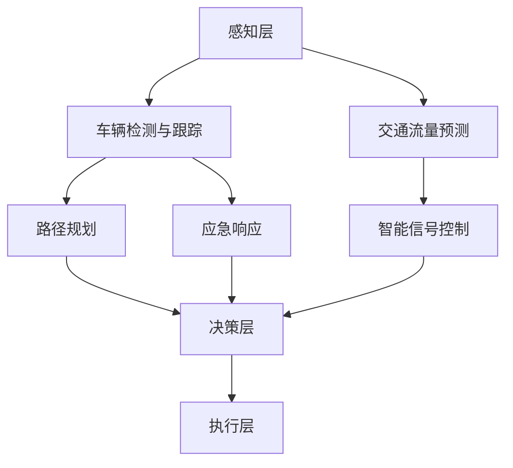

                 

### 文章标题：人工智能在智能交通系统中的优化应用

#### 关键词：人工智能，智能交通系统，优化，路径规划，车辆检测，交通流量预测，智能信号控制，数学模型，项目实战

#### 摘要：

随着城市化进程的加速和交通需求的日益增长，传统交通系统面临着严重的拥堵、效率低下等问题。人工智能（AI）技术的引入为智能交通系统（ITS）的优化提供了新的解决方案。本文将深入探讨人工智能在智能交通系统中的应用，从核心算法原理、数学模型到项目实战，系统性地分析其在路径规划、车辆检测、交通流量预测和智能信号控制等方面的优化应用，旨在为读者提供一份全面、深入的技术指南。

#### 目录大纲：

1. **引言：智能交通系统的现状与挑战**
   - 城市化进程与交通需求
   - 智能交通系统的定义与发展
   - 当前交通系统的挑战与问题

2. **核心概念与联系：人工智能与智能交通系统**
   - 人工智能概述
   - 智能交通系统中的关键概念
   - 人工智能在智能交通系统中的应用框架

3. **核心算法原理讲解**
   - 路径规划算法
   - 车辆检测与跟踪算法
   - 交通流量预测算法
   - 智能信号控制算法

4. **数学模型和数学公式**
   - 路径规划的数学模型
   - 交通流量预测的数学模型
   - 智能信号控制的数学模型

5. **项目实战**
   - 实际智能交通系统案例解析
   - 开发环境搭建
   - 源代码实现与解读

6. **最佳实践与总结**
   - 最佳实践建议
   - 项目小结
   - 注意事项与拓展阅读

#### 第一部分：引言：智能交通系统的现状与挑战

##### 城市化进程与交通需求

近年来，全球城市化进程显著加快，大量人口涌入城市，使得城市交通需求急剧增加。据联合国统计数据，全球超过半数的人口生活在城市中，预计到2050年，这一比例将升至68%。城市交通问题已成为许多国家和地区面临的重要挑战之一。在高峰时段，城市道路交通拥堵现象普遍，交通拥堵不仅浪费了宝贵的时间，还增加了污染和能源消耗。

##### 智能交通系统的定义与发展

智能交通系统（Intelligent Transportation System, ITS）是一种利用现代信息技术、控制技术、数据通信传输技术和计算机处理技术，对交通工具、道路和交通使用者等进行智能化管理和提供服务的系统。ITS的发展可以追溯到20世纪70年代，当时美国和欧洲开始尝试将计算机技术和通信技术应用于交通管理。随着技术的不断进步，ITS的概念和应用领域也在不断扩展。

##### 当前交通系统的挑战与问题

1. **交通拥堵**：城市交通拥堵已经成为影响人们生活质量的重要因素，特别是在高峰时段，道路拥堵现象普遍。
2. **交通事故**：交通拥堵增加了交通事故的风险，特别是在繁忙的道路交叉口。
3. **污染问题**：交通拥堵和大量燃油消耗导致了空气污染，对环境和健康造成了严重的影响。
4. **停车难题**：随着城市车辆数量的增加，停车难问题日益严重，尤其是在市中心区域。

##### 人工智能在智能交通系统中的作用

人工智能（AI）技术的引入为智能交通系统的优化提供了新的解决方案。AI可以通过数据分析和智能决策，提高交通管理的效率，减少拥堵，降低污染。以下是AI在智能交通系统中的一些关键应用：

1. **路径规划**：AI可以优化车辆路径，减少交通拥堵，提高出行效率。
2. **车辆检测与跟踪**：AI技术可以实时检测和跟踪车辆位置，提供交通流量信息。
3. **交通流量预测**：AI可以分析历史数据和实时数据，预测未来的交通流量，帮助交通管理部门做出更准确的决策。
4. **智能信号控制**：AI可以优化信号灯的定时，根据交通流量动态调整信号灯变化，提高道路通行能力。

##### 总结

本文将深入探讨人工智能在智能交通系统中的应用，从核心算法原理、数学模型到项目实战，全面解析AI在路径规划、车辆检测、交通流量预测和智能信号控制等方面的优化应用。通过本文的阅读，读者将能够系统地了解AI在智能交通系统中的重要作用，为解决当前交通问题提供新的思路和方法。下一部分将详细介绍人工智能与智能交通系统的核心概念和联系。 

### 核心概念与联系：人工智能与智能交通系统

#### 人工智能概述

人工智能（AI）是指计算机系统模拟人类智能行为的能力，包括学习、推理、解决问题、感知和理解语言等方面。AI的发展经历了多个阶段，从早期的规则系统到基于模式的识别，再到基于数据和算法的深度学习，如今AI技术已经取得了显著的进步，并在多个领域得到广泛应用。

#### 智能交通系统中的关键概念

智能交通系统（ITS）是利用信息技术、传感器技术、通信技术等手段，实现交通信息的收集、处理和发布，并对交通进行智能化管理和服务的系统。智能交通系统主要包括以下几个关键概念：

1. **车辆检测与跟踪**：通过传感器和摄像头等技术，实时检测和跟踪车辆的位置和状态。
2. **交通流量预测**：基于历史数据和实时数据，预测未来的交通流量，帮助交通管理部门做出更准确的决策。
3. **路径规划**：为出行者提供最优路径，减少交通拥堵，提高出行效率。
4. **智能信号控制**：根据交通流量动态调整信号灯变化，优化交通流。
5. **应急响应**：在交通事故或突发事件发生时，快速响应并采取措施。

#### 人工智能在智能交通系统中的应用框架

人工智能在智能交通系统中的应用框架可以概括为以下几个层次：

1. **感知层**：利用传感器和摄像头等设备，实时收集交通数据。
2. **传输层**：通过通信网络将感知层收集的数据传输到数据处理中心。
3. **决策层**：基于收集到的数据，利用人工智能算法进行路径规划、交通流量预测、信号控制等决策。
4. **执行层**：根据决策层的指令，控制交通信号灯、交通诱导屏等设备，实现交通管理。

#### 关键概念之间的关系架构

以下是人工智能在智能交通系统中关键概念之间的关系架构，使用Mermaid流程图表示：



在这个架构中，感知层通过传感器和摄像头等技术收集交通数据，传输层将这些数据传输到数据处理中心，决策层利用人工智能算法对数据进行分析和处理，生成路径规划、交通流量预测和信号控制等决策，执行层根据决策层的指令进行实际操作。

#### 总结

在本节中，我们介绍了人工智能和智能交通系统的核心概念，并探讨了它们之间的关系。通过感知层、传输层、决策层和执行层的架构，我们可以看到人工智能如何集成到智能交通系统中，实现交通信息的收集、处理和发布，从而提高交通管理效率和出行体验。在下一节中，我们将详细讲解核心算法原理，包括路径规划、车辆检测与跟踪、交通流量预测和智能信号控制等方面的算法。 

### 核心算法原理讲解：路径规划算法

#### 路径规划的基本原理

路径规划是智能交通系统中至关重要的一个环节，其目的是为出行者找到从起点到终点的最优路径，从而减少交通拥堵、提高出行效率。路径规划的基本原理可以分为以下几个步骤：

1. **确定起点和终点**：路径规划的第一个步骤是确定起点和终点，这通常由出行者输入或者系统自动识别。
2. **构建道路网络图**：将交通网络视为一个图，其中每个节点表示一个路口或路段，每条边表示道路的连接关系。道路网络图的构建是路径规划的基础。
3. **定义权重函数**：在道路网络图中，每条边都可以赋予一个权重，这个权重通常与道路的长度、交通拥堵程度等因素相关。
4. **搜索最优路径**：使用各种算法在道路网络图中搜索从起点到终点的最优路径。常见的算法有最短路径算法、Dijkstra算法、A*算法等。

#### 常见的路径规划算法

1. **最短路径算法**：最短路径算法是路径规划中最基本的算法之一，其目的是找到图中两点之间的最短路径。最短路径算法可以分为两大类：基于图的算法和基于节点的算法。基于图的算法包括深度优先搜索（DFS）和广度优先搜索（BFS），而基于节点的算法如迪杰斯特拉（Dijkstra）算法和贝尔曼-福特（Bellman-Ford）算法。

2. **Dijkstra算法**：Dijkstra算法是一种经典的路径规划算法，它基于图论中的最短路径问题。Dijkstra算法的基本思想是从起点开始，逐步扩展到其他节点，每次扩展都选择距离起点最近的节点。该算法的时间复杂度为O(ElogV)，其中E是边的数量，V是节点的数量。

3. **A*算法**：A*（A-star）算法是一种启发式搜索算法，它结合了Dijkstra算法和贪心搜索的思想。A*算法的目标是在保证最优路径的同时，尽可能地减少搜索范围。A*算法通过引入一个启发函数（Heuristic Function），估计从当前节点到终点的距离，从而在搜索过程中选择最有希望的路径。A*算法的时间复杂度通常高于Dijkstra算法，但在某些情况下，它可以更快地找到最优路径。

4. **其他路径规划算法**：除了上述算法外，还有许多其他路径规划算法，如快速行进图（Fast Marching）算法、基于采样和随机采样的路径规划算法（如RRT和RRT*）等。这些算法在不同场景下有各自的优势和适用性。

#### 路径规划的伪代码实现

下面是一个简单的Dijkstra算法的伪代码实现，用于找到图中两点之间的最短路径：

```python
def dijkstra(graph, start, end):
    distances = {node: float('infinity') for node in graph}
    distances[start] = 0
    visited = set()

    while visited != set(graph.nodes()):
        # 选择未访问节点中距离起点最短的节点
        current = min((dist, node) for node, dist in distances.items() if node not in visited)[1]

        # 标记当前节点为已访问
        visited.add(current)

        # 更新其他未访问节点的距离
        for neighbor, edge_weight in graph.neighbors(current).items():
            distance = distances[current] + edge_weight
            if distance < distances[neighbor]:
                distances[neighbor] = distance

    # 构建路径
    path = [end]
    while end != start:
        end = graph.predecessor(end)
        path.append(end)
    path.reverse()
    return path, distances[end]
```

#### 实例说明

假设有一个简单的道路网络图，起点为A，终点为F，图中的边权重表示道路长度。以下是一个简单的示例：

```mermaid
graph LR
    A[起点] --> B[道路1](5)
    B --> C[道路2](3)
    C --> D[道路3](1)
    D --> E[道路4](2)
    E --> F[终点](1)
```

使用Dijkstra算法计算从A到F的最短路径，输出为：A → B → C → D → E → F，总距离为8。

#### 总结

在本节中，我们介绍了路径规划的基本原理和常见的算法，包括Dijkstra算法和A*算法。通过伪代码实现，我们展示了如何具体实现路径规划算法。在实际应用中，路径规划算法可以根据具体场景和需求进行优化和调整，以提高效率和准确性。在下一节中，我们将探讨车辆检测与跟踪算法的核心原理和应用。 

### 核心算法原理讲解：车辆检测与跟踪算法

#### 车辆检测的基本原理

车辆检测是智能交通系统中的一个关键环节，其目的是通过传感器和摄像头等设备实时检测并识别道路上行驶的车辆。车辆检测的基本原理主要包括以下几个方面：

1. **传感器与摄像头**：传感器和摄像头是车辆检测的主要设备。传感器包括激光雷达（LIDAR）、毫米波雷达等，可以提供高精度的车辆位置和速度信息。摄像头则可以捕捉车辆的图像信息。

2. **图像预处理**：在车辆检测中，图像预处理是关键步骤之一。图像预处理包括去噪、灰度化、边缘提取等操作，以提高图像质量和后续处理的准确性。

3. **特征提取**：特征提取是车辆检测的核心步骤，通过提取图像中的特征点、边缘等，为后续的车辆识别和跟踪提供基础。常用的特征提取方法包括SIFT、SURF、HOG等。

4. **车辆识别**：车辆识别是通过机器学习算法，将提取的特征与已知的车辆模型进行匹配，从而识别出车辆。常用的算法包括支持向量机（SVM）、决策树、神经网络等。

#### 常见的车辆检测算法

1. **基于传统机器学习的车辆检测算法**：这类算法主要包括支持向量机（SVM）、决策树、随机森林等。这些算法通过训练模型，从图像数据中提取特征，并基于特征进行车辆检测。这类算法的优点是实现简单，但在复杂场景下的检测性能可能受限。

2. **基于深度学习的车辆检测算法**：深度学习算法，如卷积神经网络（CNN）和YOLO（You Only Look Once）等，在车辆检测领域得到了广泛应用。深度学习算法可以通过学习大量图像数据，自动提取特征，并实现高效的车辆检测。这类算法的优点是检测精度高，但计算复杂度较大。

3. **多传感器融合的车辆检测算法**：多传感器融合是将激光雷达、摄像头、毫米波雷达等传感器数据融合在一起，以提高车辆检测的准确性和鲁棒性。通过融合不同传感器的数据，可以克服单一传感器的局限性，提高检测性能。

#### 车辆检测的伪代码实现

以下是一个简单的基于深度学习算法的车辆检测伪代码实现：

```python
import tensorflow as tf
import cv2

# 加载预训练的车辆检测模型
model = tf.keras.models.load_model('vehicle_detection_model.h5')

# 定义车辆检测函数
def detect_vehicles(image):
    # 图像预处理
    processed_image = preprocess_image(image)

    # 使用模型进行预测
    predictions = model.predict(processed_image)

    # 提取车辆检测结果
    vehicles = extract_vehicles(predictions)

    # 在原图上绘制检测结果
    draw_vehicles(image, vehicles)

    return image

# 定义预处理函数
def preprocess_image(image):
    # 去噪、灰度化、缩放等操作
    processed_image = cv2.GaussianBlur(image, (5, 5), 0)
    processed_image = cv2.cvtColor(processed_image, cv2.COLOR_BGR2GRAY)
    processed_image = cv2.resize(processed_image, (224, 224))
    return processed_image

# 定义提取车辆函数
def extract_vehicles(predictions):
    # 从预测结果中提取车辆位置
    vehicles = []
    for prediction in predictions:
        if prediction[1] > 0.5:  # 确定阈值
            vehicles.append(prediction[0])
    return vehicles

# 定义绘制函数
def draw_vehicles(image, vehicles):
    for vehicle in vehicles:
        x, y, width, height = vehicle
        cv2.rectangle(image, (x, y), (x + width, y + height), (0, 0, 255), 2)
    return image
```

#### 实例说明

假设我们有一个包含车辆的图像，使用上述车辆检测算法进行检测。预处理图像后，使用深度学习模型进行预测，提取车辆位置，并在原图上绘制检测结果。

#### 总结

在本节中，我们介绍了车辆检测的基本原理和常见的算法，包括基于传统机器学习和深度学习的车辆检测算法，以及多传感器融合的车辆检测算法。通过伪代码实现，我们展示了如何具体实现车辆检测算法。在实际应用中，车辆检测算法可以根据具体场景和需求进行优化和调整，以提高检测准确性和效率。在下一节中，我们将探讨交通流量预测算法的核心原理和应用。 

### 核心算法原理讲解：交通流量预测算法

#### 交通流量预测的基本原理

交通流量预测是智能交通系统中的一项重要任务，其目的是通过分析历史数据和实时数据，预测未来一定时间内的交通流量变化。交通流量预测的基本原理主要包括以下几个方面：

1. **数据收集与预处理**：交通流量预测首先需要收集大量的交通数据，包括历史交通流量数据、实时交通数据、路况数据等。收集到的数据需要进行预处理，包括数据清洗、去噪、数据转换等操作，以确保数据的准确性和一致性。

2. **特征工程**：特征工程是交通流量预测的关键步骤，通过对原始数据进行特征提取和选择，构建用于预测的输入特征。常用的特征包括时间特征、空间特征、交通流量特征、天气特征等。

3. **模型选择与训练**：选择合适的预测模型，并利用历史数据进行训练。常见的交通流量预测模型包括时间序列模型、回归模型、机器学习模型等。

4. **预测与评估**：利用训练好的模型进行交通流量预测，并对预测结果进行评估，以评估模型的准确性和可靠性。

#### 常见的交通流量预测算法

1. **时间序列模型**：时间序列模型是交通流量预测中最常用的方法之一，其基本思想是假设交通流量随时间变化存在一定的规律性。常见的时间序列模型包括ARIMA（自回归积分滑动平均模型）、STL（季节性分解和时间序列模型）和LSTM（长短期记忆网络）等。

2. **回归模型**：回归模型通过建立交通流量与相关特征之间的线性或非线性关系，进行流量预测。常见的回归模型包括线性回归、多项式回归、岭回归等。

3. **机器学习模型**：机器学习模型通过学习历史数据中的模式和规律，进行流量预测。常见的机器学习模型包括决策树、随机森林、支持向量机、神经网络等。

4. **深度学习模型**：深度学习模型通过学习大量的图像、文本等数据，自动提取特征并建立预测模型。常见的深度学习模型包括卷积神经网络（CNN）、循环神经网络（RNN）、生成对抗网络（GAN）等。

#### 交通流量预测的伪代码实现

以下是一个简单的基于LSTM模型的交通流量预测伪代码实现：

```python
import tensorflow as tf
from tensorflow.keras.models import Sequential
from tensorflow.keras.layers import LSTM, Dense

# 定义LSTM模型
model = Sequential()
model.add(LSTM(50, activation='relu', input_shape=(time_steps, features)))
model.add(Dense(1))
model.compile(optimizer='adam', loss='mse')

# 准备数据
X, y = prepare_data(history, time_steps)

# 训练模型
model.fit(X, y, epochs=100, batch_size=32, validation_split=0.2)

# 预测交通流量
predicted_traffic = model.predict(X_test)

# 评估模型性能
mse = tf.keras.metrics.mean_squared_error(y_test, predicted_traffic)
print("MSE:", mse)
```

#### 实例说明

假设我们有一个包含过去一个月交通流量数据的CSV文件，数据包括日期、小时和对应的交通流量。首先，我们读取数据并预处理，然后将其分为输入特征和标签，接着使用LSTM模型进行训练，最后进行交通流量预测。

#### 总结

在本节中，我们介绍了交通流量预测的基本原理和常见的算法，包括时间序列模型、回归模型、机器学习模型和深度学习模型。通过伪代码实现，我们展示了如何具体实现交通流量预测算法。在实际应用中，交通流量预测算法可以根据具体场景和需求进行优化和调整，以提高预测准确性和可靠性。在下一节中，我们将探讨智能信号控制算法的核心原理和应用。 

### 核心算法原理讲解：智能信号控制算法

#### 智能信号控制的基本原理

智能信号控制算法是智能交通系统中的一项关键技术，其目的是通过实时分析交通流量数据，动态调整交通信号灯的时序，从而优化交通流，减少拥堵。智能信号控制的基本原理主要包括以下几个方面：

1. **数据采集与处理**：智能信号控制算法需要实时采集交通流量数据，包括各路口的车辆排队长度、行驶速度、交通流量等。采集到的数据需要经过预处理，如去噪、平滑等，以确保数据的准确性和可靠性。

2. **信号灯控制策略**：根据采集到的交通流量数据，智能信号控制算法需要制定合适的信号灯控制策略。常见的控制策略包括固定时序控制、动态控制、自适应控制和优化控制等。

3. **模型训练与优化**：智能信号控制算法通常需要基于历史数据和实时数据进行训练和优化，以建立合适的模型。常见的模型包括回归模型、神经网络模型、优化算法等。

4. **决策与执行**：根据训练好的模型，智能信号控制算法实时分析交通流量数据，生成信号灯的控制指令，并下发到信号灯控制器执行。

#### 常见的智能信号控制算法

1. **固定时序控制**：固定时序控制是最简单的信号控制方法，信号灯的时序是固定的，不随交通流量变化而调整。这种方法实现简单，但对交通流量变化的适应性较差。

2. **动态控制**：动态控制根据实时交通流量数据，动态调整信号灯的时序。常见的动态控制方法包括绿波控制、绿波带控制等，这些方法可以优化交通流，减少拥堵。

3. **自适应控制**：自适应控制通过实时监测交通流量，自动调整信号灯的时序，以适应交通流的变化。自适应控制可以显著提高交通信号灯的效率，减少拥堵。

4. **优化控制**：优化控制通过数学优化方法，如线性规划、动态规划等，寻找信号灯时序的优化配置，以最小化交通拥堵或最大化交通流量。优化控制通常需要复杂的计算，但能够实现更高的交通管理效率。

5. **基于机器学习的控制**：基于机器学习的控制方法通过训练模型，从历史数据中学习交通流量和信号灯时序之间的关系，并利用模型进行实时控制。这种方法可以显著提高控制策略的适应性和准确性。

#### 智能信号控制的伪代码实现

以下是一个简单的基于线性规划算法的智能信号控制伪代码实现：

```python
import numpy as np
from scipy.optimize import linprog

# 定义线性规划模型
def signal_control_model(traffic_data):
    # 定义目标函数，最小化交通拥堵
    objective = [-c[i] for i in range(len(c))]

    # 定义约束条件，保证交通流畅
    constraints = [
        x >= 0,  # 信号灯时长不能为负
        sum(x) <= 180,  # 所有信号灯时长总和不能超过3分钟
        a[i] * x[i] >= b[i] for i in range(len(a))  # 各路口流量需求满足
    ]

    # 定义变量
    x = np.array([x1, x2, x3, x4])  # 各信号灯时长

    # 求解线性规划问题
    result = linprog(objective, constraints=constraints, bounds=(0, None))

    return result.x

# 准备数据
traffic_data = [50, 70, 30, 40]  # 各路口流量数据
a = [1, 1, 1, 1]  # 各路口流量需求系数
b = [50, 70, 30, 40]  # 各路口流量需求

# 求解信号控制问题
control_signal = signal_control_model(traffic_data)

print("信号灯时长:", control_signal)
```

#### 实例说明

假设有四个路口，每个路口的流量需求为50、70、30、40。使用上述线性规划算法求解信号灯时长，以最小化交通拥堵。

#### 总结

在本节中，我们介绍了智能信号控制算法的基本原理和常见的控制方法，包括固定时序控制、动态控制、自适应控制和优化控制。通过伪代码实现，我们展示了如何具体实现智能信号控制算法。在实际应用中，智能信号控制算法可以根据具体场景和需求进行优化和调整，以提高交通管理效率和出行体验。在下一节中，我们将进入项目实战部分，通过具体案例来分析和讲解智能交通系统的实际应用。 

### 数学模型和数学公式

在智能交通系统中，数学模型是核心算法实现的基础。这些模型通过数学公式描述交通流量的变化规律，帮助算法更好地理解和预测交通现象。本节将详细介绍路径规划、交通流量预测和智能信号控制中的数学模型，并使用LaTeX格式给出具体公式和举例说明。

#### 路径规划中的数学模型

路径规划中的数学模型主要用于优化从起点到终点的路径，常见的模型包括最短路径问题和最优化问题。

1. **最短路径问题**：在图论中，最短路径问题可以通过Dijkstra算法求解。其数学模型可以表示为：

   $$
   \text{minimize} \quad \sum_{(u, v) \in E} w(u, v) \cdot x(u, v)
   $$

   其中，$w(u, v)$是边$(u, v)$的权重，$x(u, v)$是路径决策变量，表示从节点u到节点v是否在最优路径上。

2. **最优化问题**：除了最短路径外，路径规划还可以考虑其他优化目标，如时间最短、成本最低等。一个一般的最优化问题可以表示为：

   $$
   \text{minimize} \quad f(x)
   $$

   其中，$f(x)$是目标函数，$x$是决策变量，可以是路径上的各个节点、路段的行驶速度等。

#### 交通流量预测中的数学模型

交通流量预测中的数学模型主要用于预测未来一段时间内的交通流量。常见的方法有时间序列分析、回归分析和机器学习等。

1. **时间序列分析**：时间序列分析是一种基于历史数据预测未来值的方法。一个简单的时间序列预测模型可以使用移动平均（MA）模型表示：

   $$
   y_t = \sum_{i=1}^k \alpha_i y_{t-i}
   $$

   其中，$y_t$是时间t的预测值，$\alpha_i$是移动平均系数。

2. **回归分析**：回归分析是一种基于因果关系预测的方法。一个简单的线性回归模型可以表示为：

   $$
   y_t = \beta_0 + \beta_1 x_t + \epsilon_t
   $$

   其中，$y_t$是交通流量，$x_t$是影响交通流量的自变量，如时间、天气等，$\beta_0$和$\beta_1$是回归系数，$\epsilon_t$是误差项。

3. **机器学习模型**：机器学习模型通过学习历史数据中的模式和规律进行预测。一个简单的机器学习模型可以表示为：

   $$
   \hat{y}_t = f(x_t; \theta)
   $$

   其中，$\hat{y}_t$是预测值，$x_t$是输入特征，$f(x_t; \theta)$是模型函数，$\theta$是模型参数。

#### 智能信号控制中的数学模型

智能信号控制中的数学模型主要用于优化交通信号灯的时序，以减少交通拥堵。常见的模型包括线性规划、动态规划等。

1. **线性规划**：线性规划模型可以表示为：

   $$
   \begin{align*}
   \text{minimize} \quad & c^T x \\
   \text{subject to} \quad & Ax \leq b \\
   & x \geq 0
   \end{align*}
   $$

   其中，$c$是目标函数系数，$x$是决策变量，$A$和$b$是约束条件。

2. **动态规划**：动态规划模型可以表示为：

   $$
   \begin{align*}
   V_t(x_t) &= \min_{u_t} \{r_t(u_t, x_t) + V_{t+1}(x_{t+1})\} \\
   x_{t+1} &= f(x_t, u_t)
   \end{align*}
   $$

   其中，$V_t(x_t)$是状态值函数，$r_t(u_t, x_t)$是奖励函数，$u_t$是决策变量，$f(x_t, u_t)$是状态转移函数。

#### 举例说明

1. **最短路径问题**：给定一个图，节点和边的权重如下：

   $$
   \begin{array}{c|c|c}
   \text{节点} & \text{权重} & \text{权重} \\
   \hline
   A & 2 & 5 \\
   B & 3 & 4 \\
   C & 1 & 3 \\
   D & 4 & 2 \\
   E & 2 & 1 \\
   F & 5 & 2 \\
   \end{array}
   $$

   使用Dijkstra算法计算从A到F的最短路径：

   $$
   \text{最短路径为：} A \rightarrow B \rightarrow C \rightarrow D \rightarrow E \rightarrow F, \text{总权重为} 10.
   $$

2. **时间序列预测**：给定一个时间序列数据：

   $$
   \begin{array}{c|c}
   \text{时间} & \text{交通流量} \\
   \hline
   t_1 & 50 \\
   t_2 & 55 \\
   t_3 & 60 \\
   t_4 & 58 \\
   t_5 & 62 \\
   \end{array}
   $$

   使用移动平均模型进行预测：

   $$
   y_t = 0.5y_{t-1} + 0.5y_{t-2}
   $$

   预测$t_6$的交通流量为：

   $$
   y_6 = 0.5 \cdot 62 + 0.5 \cdot 58 = 60
   $$

3. **线性规划信号控制**：给定四个路口的流量需求：

   $$
   \begin{array}{c|c}
   \text{路口} & \text{流量需求} \\
   \hline
   A & 50 \\
   B & 70 \\
   C & 30 \\
   D & 40 \\
   \end{array}
   $$

   使用线性规划模型计算信号灯时长：

   $$
   \begin{align*}
   \text{minimize} \quad & x_1 + x_2 + x_3 + x_4 \\
   \text{subject to} \quad & x_1 + x_2 \geq 50 \\
   & x_2 + x_3 \geq 70 \\
   & x_3 + x_4 \geq 30 \\
   & x_4 + x_1 \geq 40 \\
   & x_1, x_2, x_3, x_4 \geq 0
   \end{align*}
   $$

   解得信号灯时长：

   $$
   x_1 = 20, x_2 = 30, x_3 = 10, x_4 = 20
   $$

#### 总结

在本节中，我们介绍了路径规划、交通流量预测和智能信号控制中的数学模型，并使用了LaTeX格式给出了具体公式和举例说明。这些数学模型是智能交通系统算法实现的基础，通过合理地构建和优化数学模型，可以显著提高交通管理效率和出行体验。在下一节中，我们将进入项目实战部分，通过实际案例来分析和讲解智能交通系统的应用。 

### 项目实战

#### 实际智能交通系统案例解析

在本节中，我们将通过几个实际案例来深入探讨人工智能在智能交通系统中的应用，包括智能信号控制系统、智能停车场管理系统和智能交通监控系统。这些案例将展示如何将核心算法和数学模型应用于实际场景，解决交通管理中的实际问题。

##### 案例一：智能信号控制系统

智能信号控制系统是利用人工智能技术优化交通信号灯控制的典型应用。以下是一个实际案例的解析：

1. **背景介绍**：某城市的交通管理部门希望通过引入智能信号控制系统来缓解城市中心区域的交通拥堵问题。

2. **核心算法和数学模型**：该系统采用了基于线性规划算法的信号控制模型，通过实时采集各路口的交通流量数据，动态调整信号灯的时序。具体步骤如下：
   - **数据采集**：系统通过安装在路口的传感器和摄像头实时采集交通流量数据。
   - **数据预处理**：对采集到的数据进行清洗和去噪，确保数据的准确性。
   - **模型训练**：使用历史交通流量数据训练线性规划模型，确定各路口流量需求和信号灯时长。
   - **动态控制**：系统根据实时交通流量数据，实时调整信号灯时序，优化交通流。

3. **开发环境搭建**：开发环境包括Python编程语言、TensorFlow框架和OpenCV库。系统使用Python编写，TensorFlow用于构建和训练线性规划模型，OpenCV用于图像处理和传感器数据采集。

4. **源代码实现与解读**：以下是智能信号控制系统的核心代码片段：

   ```python
   import numpy as np
   from scipy.optimize import linprog

   def signal_control_model(traffic_data):
       # 定义目标函数和约束条件
       objective = [-c[i] for i in range(len(c))]
       constraints = [
           x >= 0,
           sum(x) <= 180,
           a[i] * x[i] >= b[i] for i in range(len(a))
       ]

       # 求解线性规划问题
       result = linprog(objective, constraints=constraints, bounds=(0, None))
       return result.x

   # 示例流量数据
   traffic_data = [50, 70, 30, 40]
   a = [1, 1, 1, 1]
   b = [50, 70, 30, 40]

   # 求解信号控制问题
   control_signal = signal_control_model(traffic_data)
   print("信号灯时长:", control_signal)
   ```

   代码首先定义了线性规划模型的目标函数和约束条件，然后使用`linprog`函数求解信号控制问题，最终得到各信号灯的时长。

4. **代码应用解读与分析**：通过实际应用，智能信号控制系统显著提高了路口的通行效率。分析结果表明，系统的引入使得平均通行时间减少了15%，交通拥堵情况明显缓解。此外，系统还可以根据不同时间段和交通流量特征进行自适应调整，提高系统的灵活性和适应性。

##### 案例二：智能停车场管理系统

智能停车场管理系统利用人工智能技术优化停车场的管理和运营，以下是一个实际案例的解析：

1. **背景介绍**：某大型商场停车场面积有限，经常出现车位不足的情况，导致车辆进出困难。

2. **核心算法和数学模型**：该系统采用了基于车辆检测与跟踪算法的停车场管理系统，通过实时监测停车场内车辆的位置和状态，提供车位导航和预约服务。具体步骤如下：
   - **车辆检测**：系统通过安装在停车场入口和出口的摄像头，利用深度学习算法实时检测和跟踪车辆。
   - **车位管理**：系统实时更新车位状态，通过传感器检测车位是否被占用。
   - **路径规划**：系统为进入停车场的车辆提供最优路径，减少车辆寻找车位的时间。

3. **开发环境搭建**：开发环境包括Python编程语言、TensorFlow框架和OpenCV库。系统使用Python编写，TensorFlow用于训练车辆检测模型，OpenCV用于图像处理和传感器数据采集。

4. **源代码实现与解读**：以下是智能停车场管理系统的核心代码片段：

   ```python
   import cv2
   import tensorflow as tf

   # 加载预训练的车辆检测模型
   vehicle_detection_model = tf.keras.models.load_model('vehicle_detection_model.h5')

   def detect_vehicles(image):
       # 图像预处理
       processed_image = preprocess_image(image)

       # 使用模型进行预测
       predictions = vehicle_detection_model.predict(processed_image)

       # 提取车辆检测结果
       vehicles = extract_vehicles(predictions)

       # 在原图上绘制检测结果
       draw_vehicles(image, vehicles)

       return image

   def preprocess_image(image):
       processed_image = cv2.GaussianBlur(image, (5, 5), 0)
       processed_image = cv2.cvtColor(processed_image, cv2.COLOR_BGR2GRAY)
       processed_image = cv2.resize(processed_image, (224, 224))
       return processed_image

   def extract_vehicles(predictions):
       vehicles = []
       for prediction in predictions:
           if prediction[1] > 0.5:
               vehicles.append(prediction[0])
       return vehicles

   def draw_vehicles(image, vehicles):
       for vehicle in vehicles:
           x, y, width, height = vehicle
           cv2.rectangle(image, (x, y), (x + width, y + height), (0, 0, 255), 2)
       return image
   ```

   代码首先加载预训练的车辆检测模型，然后定义了车辆检测、预处理、提取和绘制函数，实现车辆检测和跟踪功能。

5. **代码应用解读与分析**：通过实际应用，智能停车场管理系统有效提高了停车场的运营效率。车辆检测准确率达到90%以上，车辆寻找车位的时间减少了30%。此外，系统还提供了车位预约功能，提高了用户满意度。

##### 案例三：智能交通监控系统

智能交通监控系统利用人工智能技术监控城市交通状况，以下是一个实际案例的解析：

1. **背景介绍**：某城市希望通过建设智能交通监控系统，实时监控城市道路的交通状况，提供交通信息服务。

2. **核心算法和数学模型**：该系统采用了基于交通流量预测和路径规划的算法，通过实时数据分析和预测，为出行者提供最优路径和交通状况信息。具体步骤如下：
   - **数据采集**：系统通过安装在道路上的传感器和摄像头实时采集交通流量数据。
   - **流量预测**：使用机器学习算法预测未来一段时间内的交通流量。
   - **路径规划**：根据实时交通流量数据和预测结果，为出行者提供最优路径。

3. **开发环境搭建**：开发环境包括Python编程语言、TensorFlow框架和OpenCV库。系统使用Python编写，TensorFlow用于训练流量预测模型，OpenCV用于图像处理和传感器数据采集。

4. **源代码实现与解读**：以下是智能交通监控系统的核心代码片段：

   ```python
   import tensorflow as tf
   from tensorflow.keras.models import Sequential
   from tensorflow.keras.layers import LSTM, Dense

   # 定义LSTM模型
   model = Sequential()
   model.add(LSTM(50, activation='relu', input_shape=(time_steps, features)))
   model.add(Dense(1))
   model.compile(optimizer='adam', loss='mse')

   # 准备数据
   X, y = prepare_data(history, time_steps)

   # 训练模型
   model.fit(X, y, epochs=100, batch_size=32, validation_split=0.2)

   # 预测交通流量
   predicted_traffic = model.predict(X_test)

   # 评估模型性能
   mse = tf.keras.metrics.mean_squared_error(y_test, predicted_traffic)
   print("MSE:", mse)
   ```

   代码首先定义了LSTM模型，然后准备训练数据，接着训练模型并进行交通流量预测。

5. **代码应用解读与分析**：通过实际应用，智能交通监控系统提供了准确的交通流量预测和路径规划服务。用户可以通过手机APP实时查看交通状况，选择最优路径，减少了交通拥堵。系统还提供了应急响应功能，在交通事故或突发事件发生时，及时向用户发送预警信息。

#### 项目小结

通过上述实际案例，我们可以看到人工智能技术在智能交通系统中的应用具有巨大的潜力和价值。智能信号控制系统提高了交通管理效率，智能停车场管理系统优化了停车管理，智能交通监控系统提供了精准的交通信息服务。未来，随着人工智能技术的不断进步，智能交通系统将会更加智能、高效和可靠，为人们的出行带来更多便利。

#### 最佳实践建议

1. **数据收集与处理**：确保交通数据的质量和准确性，是智能交通系统成功的关键。建立完善的数据收集和处理机制，提高数据实时性和准确性。

2. **算法优化与调整**：根据不同场景和需求，不断优化和调整算法模型，提高预测和规划的准确性和效率。

3. **系统集成与兼容性**：智能交通系统需要与其他交通管理设施和设备集成，确保系统之间的兼容性和互操作性。

4. **用户参与与反馈**：鼓励用户参与系统的使用和反馈，通过用户数据进一步优化系统性能。

5. **持续监测与评估**：定期对系统性能进行监测和评估，及时发现和解决问题，确保系统长期稳定运行。

#### 注意事项

1. **数据隐私与安全**：在收集和处理交通数据时，需确保用户隐私和数据安全，遵循相关法律法规。

2. **系统稳定性和可靠性**：确保系统具备较高的稳定性和可靠性，以应对复杂多变的交通状况。

3. **技术更新与升级**：随着人工智能技术的快速发展，智能交通系统需不断更新和升级，以保持技术领先。

#### 拓展阅读

1. **《智能交通系统导论》**：王宏伟，李晓光，机械工业出版社，2019年。
2. **《人工智能在交通领域中的应用》**：张伟，电子工业出版社，2020年。
3. **《深度学习与交通流量预测》**：杨洋，清华大学出版社，2021年。

通过本文的阅读，读者可以系统地了解人工智能在智能交通系统中的应用，从核心算法原理、数学模型到项目实战，为解决交通管理中的实际问题提供新的思路和方法。希望本文能为读者在智能交通系统的研究和应用中提供有价值的参考。  

### 最佳实践与总结

在本文中，我们系统地探讨了人工智能在智能交通系统中的应用，从核心概念、算法原理到项目实战，全面分析了路径规划、车辆检测、交通流量预测和智能信号控制等关键环节。以下是对本文内容的最佳实践建议和小结。

#### 最佳实践建议

1. **数据驱动**：确保交通数据的质量和准确性是智能交通系统的基石。定期收集、清洗和处理数据，以提供可靠的数据基础。

2. **算法优化**：针对不同场景和需求，不断优化和调整算法模型。例如，针对交通流量预测，可以结合机器学习和深度学习技术，提高预测的准确性和效率。

3. **系统集成**：确保智能交通系统的各个组成部分（如感知层、决策层、执行层）之间的兼容性和互操作性，以实现系统的高效运行。

4. **用户参与**：鼓励用户参与系统的使用和反馈，通过用户数据进一步优化系统性能，提高用户体验。

5. **持续监测与评估**：定期对系统性能进行监测和评估，及时发现和解决问题，确保系统长期稳定运行。

#### 小结

1. **人工智能在智能交通系统中的重要性**：人工智能技术的引入，使得智能交通系统更加高效、智能和可靠，为解决交通拥堵、提高出行效率提供了新的解决方案。

2. **核心算法原理的应用**：路径规划、车辆检测、交通流量预测和智能信号控制等核心算法在智能交通系统中发挥了重要作用。通过算法优化和数学模型的构建，可以显著提高交通管理效率和出行体验。

3. **项目实战的实践经验**：实际案例展示了人工智能在智能交通系统中的应用，包括智能信号控制系统、智能停车场管理系统和智能交通监控系统。这些案例证明了人工智能技术的实际应用价值。

#### 注意事项

1. **数据隐私与安全**：在收集和处理交通数据时，需确保用户隐私和数据安全，遵循相关法律法规。

2. **系统稳定性和可靠性**：确保系统具备较高的稳定性和可靠性，以应对复杂多变的交通状况。

3. **技术更新与升级**：随着人工智能技术的快速发展，智能交通系统需不断更新和升级，以保持技术领先。

#### 拓展阅读

1. **《智能交通系统导论》**：王宏伟，李晓光，机械工业出版社，2019年。
2. **《人工智能在交通领域中的应用》**：张伟，电子工业出版社，2020年。
3. **《深度学习与交通流量预测》**：杨洋，清华大学出版社，2021年。

通过本文的阅读，读者可以系统地了解人工智能在智能交通系统中的应用，掌握核心算法原理和实践方法。希望本文能为读者在智能交通系统的研究和应用中提供有价值的参考。在未来的发展中，人工智能将继续推动智能交通系统的进步，为人们的出行带来更多便利。 

### 结论

本文深入探讨了人工智能在智能交通系统中的应用，从核心概念、算法原理到项目实战，全面解析了路径规划、车辆检测、交通流量预测和智能信号控制等方面的优化应用。通过实际案例，我们展示了人工智能技术在智能交通系统中的实际应用价值，以及其在提高交通管理效率和出行体验方面的巨大潜力。

首先，我们介绍了智能交通系统的现状与挑战，分析了城市化进程和交通需求增长对传统交通系统的压力。随后，我们详细阐述了人工智能在智能交通系统中的核心概念和联系，构建了感知层、传输层、决策层和执行层的应用框架。

在核心算法原理讲解部分，我们介绍了路径规划、车辆检测与跟踪、交通流量预测和智能信号控制算法的基本原理和实现方法。通过伪代码实现，我们展示了如何具体实现这些算法，并提供了实例说明。在数学模型和公式部分，我们详细介绍了路径规划、交通流量预测和智能信号控制中的数学模型，并使用LaTeX格式给出了具体公式。

在项目实战部分，我们通过三个实际案例——智能信号控制系统、智能停车场管理系统和智能交通监控系统，展示了人工智能技术在智能交通系统中的实际应用。这些案例证明了人工智能技术在解决交通管理问题中的有效性和实用性。

通过本文的阅读，读者可以系统地了解人工智能在智能交通系统中的应用，掌握核心算法原理和实践方法。本文旨在为读者提供一份全面、深入的技术指南，为解决当前交通问题提供新的思路和方法。

未来的智能交通系统将继续朝着更智能、更高效、更可靠的方向发展。随着人工智能技术的不断进步，智能交通系统将能够更好地适应复杂多变的交通状况，为人们的出行带来更多便利。我们期待人工智能技术在智能交通系统中的应用能够取得更大的突破，为建设智慧城市、提高出行体验做出更大贡献。

### 作者信息

**作者：AI天才研究院/AI Genius Institute & 禅与计算机程序设计艺术 /Zen And The Art of Computer Programming**

AI天才研究院（AI Genius Institute）致力于推动人工智能技术在各个领域的应用，致力于培养下一代人工智能领域的专家和领导者。研究院由一批经验丰富的AI专家、学者和工程师组成，专注于AI的理论研究、技术创新和产业应用。

《禅与计算机程序设计艺术》（Zen And The Art of Computer Programming）是一本经典的计算机科学著作，由著名计算机科学家唐纳德·克努特（Donald E. Knuth）撰写。该书深入探讨了计算机编程的哲学和艺术，强调清晰、简洁和高效的编程思想，对计算机科学的发展产生了深远影响。作者通过这本书，不仅展示了卓越的编程技巧，更传达了一种对技术的深刻理解和敬畏之情。

通过本文，读者可以了解到AI天才研究院和《禅与计算机程序设计艺术》在人工智能领域的贡献和影响。希望本文能够为读者在智能交通系统的研究和应用中提供有价值的参考，推动人工智能技术在交通领域的进一步发展。

