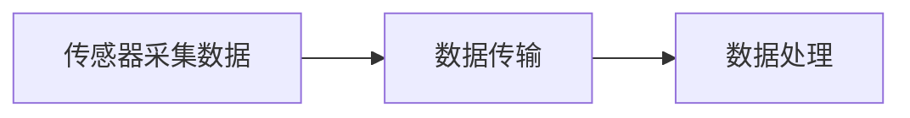
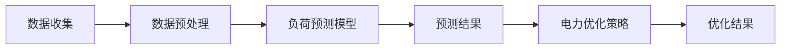
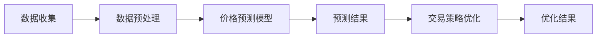
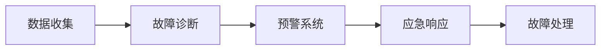

                 


### 文章标题：人工智能在智能电网管理中的应用

> 关键词：智能电网，人工智能，电力系统优化，电力市场，电力系统安全与稳定

> 摘要：本文探讨了人工智能在智能电网管理中的应用，从智能电网概述、人工智能基础、智能电网架构与关键技术、人工智能在电力系统优化中的应用、人工智能在电力市场中的应用、人工智能在电力系统安全与稳定中的应用以及案例研究等方面进行了详细阐述，最后对未来展望与挑战进行了分析。

---

### 目录

1. **绪论**
   1.1 **智能电网概述**
   1.2 **人工智能在电力行业的应用**
   1.3 **人工智能技术在智能电网管理中的重要性**

2. **人工智能基础**
   2.1 **人工智能概述**
   2.2 **机器学习基础**
      2.2.1 **监督学习**
      2.2.2 **无监督学习**
      2.2.3 **强化学习**
   2.3 **深度学习基础**

3. **智能电网架构与关键技术**
   3.1 **智能电网架构**
   3.2 **智能电网关键技术**

4. **人工智能在电力系统优化中的应用**
   4.1 **电力系统优化概述**
   4.2 **人工智能在电力系统优化中的应用**

5. **人工智能在电力市场中的应用**
   5.1 **电力市场概述**
   5.2 **人工智能在电力市场中的应用**

6. **人工智能在电力系统安全与稳定中的应用**
   6.1 **电力系统安全与稳定概述**
   6.2 **人工智能在电力系统安全与稳定中的应用**

7. **案例研究**

8. **未来展望与挑战**

---

### 第1章 绪论

#### 1.1 智能电网概述

智能电网（Smart Grid）是集现代通信技术、计算机技术、电力电子技术、自动控制技术等为一体的现代化电网系统。它通过信息的双向流动，实现对电网的实时监控、优化调度、智能保护和自动化管理。

智能电网的主要特征包括：

- **信息互动性**：通过传感器和通信技术，实现电网与用户之间的信息互动。
- **自动化水平高**：采用自动化技术，提高电网的调度和控制效率。
- **能源利用率高**：通过优化能源分配，提高能源利用效率。
- **环境友好**：通过智能电网，可以更好地实现可再生能源的接入和利用，降低碳排放。

智能电网的发展对我国电力行业的可持续发展具有重要意义。它有助于提高电力系统的稳定性和可靠性，降低电力系统的运行成本，同时也有利于推动能源结构的优化和调整。

#### 1.2 人工智能在电力行业的应用

人工智能（AI）作为计算机科学的一个分支，致力于研究如何构建智能系统，使计算机具有人类智能的特征。人工智能在电力行业的应用主要体现在以下几个方面：

- **电力系统优化**：利用人工智能技术，对电力系统的运行状态进行实时监控和预测，实现电力负荷预测、电力网络规划等。
- **电力市场分析**：通过人工智能技术，对电力市场进行数据分析，预测市场价格趋势，优化交易策略。
- **电力系统安全与稳定**：利用人工智能技术，实现电力系统的故障诊断、静态安全分析和动态稳定预测。
- **能源管理**：通过人工智能技术，实现能源的优化分配和利用，提高能源利用效率。

#### 1.3 人工智能技术在智能电网管理中的重要性

人工智能技术在智能电网管理中具有重要作用。首先，它有助于提高电力系统的运行效率和可靠性。通过实时监控和预测，可以及时发现和解决电力系统中的问题，避免电力故障的发生。其次，人工智能技术可以帮助优化电力市场，提高市场交易的效率，实现能源的优化分配。此外，人工智能技术在电力系统安全与稳定方面也有重要作用，它可以帮助实现电力系统的故障诊断和预警，提高电力系统的安全性和稳定性。

综上所述，人工智能技术在智能电网管理中的应用具有重要意义，它有助于提高电力系统的运行效率和可靠性，优化电力市场，提高能源利用效率，保障电力系统的安全与稳定。随着人工智能技术的不断发展，其在智能电网管理中的应用将会更加广泛和深入。

---

### 第2章 人工智能基础

#### 2.1 人工智能概述

人工智能（Artificial Intelligence，简称AI）是计算机科学的一个分支，旨在研究如何构建智能系统，使计算机具有人类智能的特征。人工智能的目标是实现机器的自主思考、学习和决策能力，以解决复杂的现实问题。

人工智能的发展经历了多个阶段：

- **1956年**：人工智能的概念首次被提出，标志着人工智能学科的诞生。
- **20世纪80年代**：人工智能进入第二代，以专家系统和机器学习为代表。
- **21世纪**：随着深度学习和大数据技术的发展，人工智能进入第三代，标志着人工智能的快速发展。

人工智能的主要研究领域包括：

- **机器学习**：通过算法，让计算机从数据中学习，进行模式识别和预测。
- **自然语言处理**：让计算机理解和生成自然语言，实现人机交互。
- **计算机视觉**：让计算机能够识别和理解图像和视频。
- **智能机器人**：通过机器学习、计算机视觉等技术，实现机器人的自主行动和决策。

#### 2.2 机器学习基础

机器学习（Machine Learning，简称ML）是人工智能的一个重要分支，主要研究如何让计算机从数据中学习，进行自动推理和决策。机器学习的主要类型包括：

- **监督学习（Supervised Learning）**：通过已标记的数据进行训练，从而预测未知数据的标签。
- **无监督学习（Unsupervised Learning）**：没有标记的数据进行训练，从而发现数据中的模式和结构。
- **强化学习（Reinforcement Learning）**：通过与环境交互，学习最优策略以实现目标。

监督学习（Supervised Learning）是最常见的机器学习类型。它包括以下几个关键步骤：

1. **数据收集**：收集大量的训练数据，这些数据应包含输入和对应的输出。
2. **数据预处理**：对收集到的数据进行分析和处理，如缺失值处理、数据清洗、特征工程等。
3. **模型选择**：选择合适的机器学习模型，如线性回归、决策树、神经网络等。
4. **模型训练**：使用训练数据对模型进行训练，调整模型参数。
5. **模型评估**：使用测试数据对模型进行评估，以确定模型的性能。
6. **模型应用**：将训练好的模型应用到实际问题上，进行预测和决策。

以下是一个监督学习的伪代码示例：

```python
# 输入：训练数据集 X_train，标签数据集 y_train
# 输出：训练好的模型 model

# 数据预处理
X_train_processed = preprocess_data(X_train)
y_train_processed = preprocess_data(y_train)

# 模型选择
model = LinearRegression()

# 模型训练
model.fit(X_train_processed, y_train_processed)

# 模型评估
score = model.score(X_train_processed, y_train_processed)

# 模型应用
predictions = model.predict(X_test_processed)
```

#### 2.3 无监督学习（Unsupervised Learning）

无监督学习（Unsupervised Learning）主要研究如何从未标记的数据中学习，发现数据中的模式和结构。常见的无监督学习方法包括：

- **聚类（Clustering）**：将相似的数据点归为一类，常用的算法有K-means、DBSCAN等。
- **降维（Dimensionality Reduction）**：通过降低数据的维度，保留重要的特征，常用的算法有主成分分析（PCA）、t-SNE等。
- **关联规则学习（Association Rule Learning）**：发现数据之间的关联关系，常用的算法有Apriori、FP-Growth等。

以下是一个聚类算法的伪代码示例：

```python
# 输入：数据集 X
# 输出：聚类结果 clusters

# 数据预处理
X_processed = preprocess_data(X)

# 聚类算法
clusters = KMeans(n_clusters=k).fit_predict(X_processed)

# 输出聚类结果
print("聚类结果：", clusters)
```

#### 2.4 强化学习（Reinforcement Learning）

强化学习（Reinforcement Learning，简称RL）是一种通过试错（trial and error）进行学习的方法。它通过奖励机制，使智能体（agent）在环境（environment）中学习最优策略（policy）。强化学习的主要步骤包括：

1. **初始化**：初始化智能体、环境和策略。
2. **交互**：智能体根据当前状态，采取动作，与环境进行交互。
3. **学习**：根据奖励信号，调整策略，以最大化长期奖励。
4. **评估**：评估策略的性能，进行迭代优化。

以下是一个强化学习的伪代码示例：

```python
# 输入：环境 environment，策略策略 policy
# 输出：策略性能 performance

# 初始化
agent = initialize_agent()
environment = initialize_environment()

# 交互与学习
for episode in range(num_episodes):
    state = environment.reset()
    done = False
    total_reward = 0
    
    while not done:
        action = agent.select_action(state)
        next_state, reward, done = environment.step(action)
        agent.update_policy(state, action, reward, next_state)
        state = next_state
        total_reward += reward
    
    performance = agent.evaluate_policy()

# 输出策略性能
print("策略性能：", performance)
```

#### 2.5 深度学习基础

深度学习（Deep Learning，简称DL）是一种基于多层神经网络的学习方法，通过自动提取数据的特征表示，实现复杂的模式识别和预测任务。深度学习的主要组成部分包括：

- **神经网络（Neural Networks）**：模仿生物神经系统的计算模型，通过多层神经元进行信息处理。
- **激活函数（Activation Functions）**：用于引入非线性特性，使神经网络能够拟合复杂函数。
- **损失函数（Loss Functions）**：用于评估神经网络预测值与真实值之间的差异，指导模型优化。
- **优化器（Optimization Algorithms）**：用于调整模型参数，使损失函数最小化。

以下是一个简单的深度学习模型的伪代码示例：

```python
# 输入：训练数据集 X_train，标签数据集 y_train
# 输出：训练好的模型 model

# 数据预处理
X_train_processed = preprocess_data(X_train)
y_train_processed = preprocess_data(y_train)

# 模型定义
model = NeuralNetwork(input_size=X_train_processed.shape[1], hidden_size=10, output_size=y_train_processed.shape[1])

# 模型训练
for epoch in range(num_epochs):
    for batch in X_train_processed:
        loss = model.loss(y_true=batch, y_pred=model.predict(batch))
        model.update_weights(optimizer=Adam(learning_rate=0.001), loss=loss)

# 模型评估
score = model.score(X_test_processed, y_test_processed)

# 输出模型评估结果
print("模型评估结果：", score)
```

---

### 第3章 智能电网架构与关键技术

#### 3.1 智能电网架构

智能电网架构通常包括三个主要部分：电力系统架构、通信架构和信息处理架构。

##### 电力系统架构

电力系统架构是指电力系统中各个组成部分的物理结构和功能。它主要包括：

- **发电设施**：包括火电、水电、核电、风电和太阳能发电等。
- **输电设施**：包括高压输电线路、变电站和配电网等。
- **配电设施**：包括低压配电网、用户终端等。

##### 通信架构

通信架构是指电力系统中各个部分之间的通信方式和技术。它主要包括：

- **有线通信**：如光纤通信、电缆通信等。
- **无线通信**：如无线传感器网络、5G通信等。

##### 信息处理架构

信息处理架构是指电力系统中用于数据处理和分析的技术和工具。它主要包括：

- **数据采集与监控**：通过传感器和监控设备，实时采集电力系统的运行数据。
- **数据处理与存储**：通过大数据技术和云计算，对采集到的数据进行分析和处理。
- **智能决策与控制**：通过人工智能和机器学习技术，对电力系统的运行进行预测和优化。

#### 3.2 智能电网关键技术

智能电网的关键技术包括数据采集与传输、数据分析与处理、智能决策与控制等。

##### 数据采集与传输

数据采集与传输是智能电网的基础。通过传感器和通信技术，实时采集电力系统的运行数据，如电压、电流、功率等。传输技术主要包括有线通信和无线通信。

以下是一个数据采集与传输的流程：

1. **传感器采集**：传感器安装在电力系统的各个部分，实时采集电压、电流、功率等数据。
2. **数据传输**：通过通信网络，将传感器采集到的数据传输到数据处理中心。
3. **数据处理**：在数据处理中心，对传输过来的数据进行处理和分析。

以下是一个数据采集与传输的Mermaid流程图：



##### 数据分析与处理

数据分析与处理是智能电网的核心。通过大数据技术和人工智能技术，对采集到的数据进行处理和分析，以实现对电力系统的实时监控、预测和优化。

数据分析与处理的主要步骤包括：

1. **数据预处理**：对采集到的数据进行清洗、归一化等预处理操作。
2. **数据挖掘**：通过数据挖掘技术，发现数据中的模式和规律。
3. **数据建模**：通过建立数学模型，对数据进行建模和分析。
4. **数据可视化**：通过数据可视化技术，展示数据分析结果。

以下是一个数据分析与处理的伪代码示例：

```python
# 输入：原始数据 data
# 输出：分析结果 results

# 数据预处理
data_processed = preprocess_data(data)

# 数据挖掘
patterns = data_mining(data_processed)

# 数据建模
model = build_model(patterns)

# 数据可视化
visualize_data(model)
```

##### 智能决策与控制

智能决策与控制是智能电网的高级应用。通过人工智能技术，对电力系统的运行进行预测和优化，以实现电力系统的稳定、高效运行。

智能决策与控制的主要步骤包括：

1. **状态监测**：实时监测电力系统的运行状态，如电压、电流、功率等。
2. **预测分析**：根据历史数据和实时数据，预测电力系统的未来运行状态。
3. **决策制定**：根据预测结果，制定电力系统的运行策略。
4. **执行控制**：通过控制系统，执行决策策略，调整电力系统的运行状态。

以下是一个智能决策与控制的伪代码示例：

```python
# 输入：实时数据 data，预测模型 model
# 输出：决策结果 decisions

# 状态监测
current_state = monitor_state(data)

# 预测分析
predicted_state = model.predict(current_state)

# 决策制定
decisions = make_decision(predicted_state)

# 执行控制
control_system(decisions)
```

---

### 第4章 人工智能在电力系统优化中的应用

#### 4.1 电力系统优化概述

电力系统优化是指在满足电力系统安全稳定运行的前提下，通过优化调度和管理，实现电力系统的最佳运行状态。电力系统优化对于提高电力系统的运行效率、降低运行成本、保障电力供应具有重要意义。

电力系统优化主要涉及以下几个方面：

- **电力负荷预测**：预测未来一段时间内的电力负荷，为电力系统的调度和管理提供依据。
- **电力网络规划**：根据电力负荷预测结果，优化电力网络的布局和结构，提高电力系统的输送能力。
- **储能系统优化**：优化储能系统的运行和管理，提高储能系统的利用效率。

#### 4.2 人工智能在电力系统优化中的应用

人工智能技术在电力系统优化中具有广泛应用。以下将详细介绍人工智能在电力系统优化中的应用：

##### 电力负荷预测

电力负荷预测是电力系统优化的重要环节。通过人工智能技术，可以实现对电力负荷的准确预测，为电力系统的调度和管理提供科学依据。

人工智能在电力负荷预测中的应用主要包括以下几个方面：

- **时间序列分析**：通过分析历史电力负荷数据，利用时间序列分析方法，预测未来电力负荷。
- **机器学习模型**：利用机器学习算法，建立电力负荷预测模型，预测未来电力负荷。
- **深度学习模型**：利用深度学习算法，构建更复杂的预测模型，提高电力负荷预测的准确性。

以下是一个电力负荷预测的伪代码示例：

```python
# 输入：历史负荷数据 data
# 输出：预测负荷 results

# 数据预处理
data_processed = preprocess_data(data)

# 建立模型
model = build_model(data_processed)

# 预测
predictions = model.predict()

# 输出预测结果
print("预测负荷：", predictions)
```

##### 电力网络规划

电力网络规划是电力系统优化的关键环节。通过人工智能技术，可以优化电力网络的布局和结构，提高电力系统的输送能力。

人工智能在电力网络规划中的应用主要包括以下几个方面：

- **网络拓扑分析**：利用人工智能算法，分析电力网络的拓扑结构，为网络规划提供依据。
- **优化算法**：利用优化算法，优化电力网络的布局和结构，提高电力系统的输送能力。
- **智能调度**：利用人工智能技术，实现电力网络的智能调度，提高电力系统的运行效率。

以下是一个电力网络规划的伪代码示例：

```python
# 输入：电力网络拓扑 network
# 输出：规划结果 results

# 网络拓扑分析
topology_analysis = analyze_topology(network)

# 优化算法
optimized_network = optimize_network(topology_analysis)

# 智能调度
scheduler = build_scheduler(optimized_network)

# 输出规划结果
print("规划结果：", results)
```

##### 储能系统优化

储能系统优化是电力系统优化的重要方面。通过人工智能技术，可以优化储能系统的运行和管理，提高储能系统的利用效率。

人工智能在储能系统优化中的应用主要包括以下几个方面：

- **储能容量规划**：利用人工智能技术，优化储能系统的容量规划，确保储能系统满足电力系统的需求。
- **运行策略优化**：利用人工智能技术，优化储能系统的运行策略，提高储能系统的运行效率。
- **电能质量优化**：利用人工智能技术，优化电能质量，提高电力系统的稳定性和可靠性。

以下是一个储能系统优化的伪代码示例：

```python
# 输入：储能系统参数 parameters
# 输出：优化结果 results

# 储能容量规划
capacity_plan = plan_capacity(parameters)

# 运行策略优化
operation_strategy = optimize_strategy(capacity_plan)

# 电能质量优化
electricity_quality = optimize_quality(operation_strategy)

# 输出优化结果
print("优化结果：", results)
```

综上所述，人工智能在电力系统优化中具有广泛应用，通过人工智能技术，可以实现对电力负荷的准确预测、电力网络规划优化、储能系统优化等方面的应用，从而提高电力系统的运行效率、降低运行成本、保障电力供应。

---

### 第5章 人工智能在电力市场中的应用

#### 5.1 电力市场概述

电力市场是电力商品交易的场所，通过市场机制，实现电力资源的优化配置和公平交易。电力市场的主要参与者包括发电企业、电网企业、售电公司和终端用户。电力市场的运行机制主要包括竞价机制、调度机制和价格机制。

电力市场的主要功能包括：

- **资源配置**：通过市场机制，实现电力资源的优化配置，满足不同用户的需求。
- **价格发现**：通过市场竞价，发现电力价格，反映电力供求关系。
- **风险规避**：通过市场交易，降低电力企业和用户的电力供应风险。
- **效率提高**：通过市场机制，提高电力系统的运行效率和经济效益。

#### 5.2 人工智能在电力市场中的应用

人工智能技术在电力市场中具有广泛应用，可以提高电力市场的运行效率、降低交易风险、优化市场价格预测等。

以下将详细介绍人工智能在电力市场中的应用：

##### 负荷预测与市场分析

负荷预测是电力市场分析的重要环节。通过人工智能技术，可以实现对电力负荷的准确预测，为电力市场交易提供科学依据。

人工智能在负荷预测和市场分析中的应用主要包括以下几个方面：

- **时间序列分析**：通过分析历史负荷数据，利用时间序列分析方法，预测未来电力负荷。
- **机器学习模型**：利用机器学习算法，建立电力负荷预测模型，预测未来电力负荷。
- **深度学习模型**：利用深度学习算法，构建更复杂的预测模型，提高电力负荷预测的准确性。

以下是一个电力负荷预测和市场分析的伪代码示例：

```python
# 输入：历史负荷数据 data
# 输出：预测负荷 results，市场分析分析 results

# 数据预处理
data_processed = preprocess_data(data)

# 建立模型
model = build_model(data_processed)

# 预测
predictions = model.predict()

# 市场分析
market_analysis = analyze_market(predictions)

# 输出预测结果和市场分析结果
print("预测负荷：", predictions)
print("市场分析：", market_analysis)
```

##### 市场价格预测

市场价格预测是电力市场交易的重要环节。通过人工智能技术，可以实现对市场价格的准确预测，为电力市场交易提供决策支持。

人工智能在市场价格预测中的应用主要包括以下几个方面：

- **历史价格分析**：通过分析历史市场价格数据，发现市场价格变化规律。
- **机器学习模型**：利用机器学习算法，建立市场价格预测模型，预测未来市场价格。
- **深度学习模型**：利用深度学习算法，构建更复杂的预测模型，提高市场价格预测的准确性。

以下是一个市场价格预测的伪代码示例：

```python
# 输入：历史价格数据 data
# 输出：预测价格 results

# 数据预处理
data_processed = preprocess_data(data)

# 建立模型
model = build_model(data_processed)

# 预测
predictions = model.predict()

# 输出预测结果
print("预测价格：", predictions)
```

##### 交易策略优化

交易策略优化是电力市场交易的重要环节。通过人工智能技术，可以优化电力市场交易策略，提高市场竞争力。

人工智能在交易策略优化中的应用主要包括以下几个方面：

- **历史交易分析**：通过分析历史交易数据，发现交易规律和策略。
- **机器学习模型**：利用机器学习算法，建立交易策略优化模型，优化电力市场交易策略。
- **深度学习模型**：利用深度学习算法，构建更复杂的策略优化模型，提高交易策略的准确性。

以下是一个交易策略优化的伪代码示例：

```python
# 输入：历史交易数据 data
# 输出：优化策略 results

# 数据预处理
data_processed = preprocess_data(data)

# 建立模型
model = build_model(data_processed)

# 优化策略
optimized_strategy = optimize_strategy(model)

# 输出优化策略结果
print("优化策略：", optimized_strategy)
```

综上所述，人工智能在电力市场中的应用具有重要意义，通过人工智能技术，可以实现对电力负荷的准确预测、市场价格的准确预测和交易策略的优化，提高电力市场的运行效率、降低交易风险、优化市场价格预测等。随着人工智能技术的不断发展，其在电力市场中的应用将会更加广泛和深入。

---

### 第6章 人工智能在电力系统安全与稳定中的应用

#### 6.1 电力系统安全与稳定概述

电力系统的安全与稳定是保障电力供应的关键。电力系统的安全稳定运行需要确保系统不受外部干扰，内部元件正常运行，以及能够迅速有效地应对各种故障。

电力系统安全主要包括以下几个方面：

- **电能质量**：确保电力系统提供的电能质量满足用户需求，包括电压、频率、波形等。
- **供电可靠性**：确保电力系统在正常运行和故障情况下都能持续供电。
- **设备安全**：确保电力系统的设备安全，防止因设备故障导致的停电和火灾等事故。

电力系统稳定主要包括以下几个方面：

- **电压稳定**：确保电力系统在负荷变化和故障情况下，电压保持稳定。
- **频率稳定**：确保电力系统在负荷变化和故障情况下，频率保持稳定。
- **暂态稳定**：确保电力系统在负荷变化和故障情况下，能够快速恢复稳定状态。

#### 6.2 人工智能在电力系统安全与稳定中的应用

人工智能技术在电力系统安全与稳定方面具有广泛应用，可以提高电力系统的安全性和稳定性。以下将详细介绍人工智能在电力系统安全与稳定中的应用：

##### 故障诊断与预警

故障诊断与预警是保障电力系统安全稳定运行的重要手段。通过人工智能技术，可以实现对电力系统故障的实时监测和诊断，提前预警潜在的故障风险。

人工智能在故障诊断与预警中的应用主要包括以下几个方面：

- **历史故障数据分析**：通过分析历史故障数据，建立故障特征库，为故障诊断提供依据。
- **机器学习模型**：利用机器学习算法，建立故障诊断模型，实时监测电力系统状态，识别潜在的故障风险。
- **深度学习模型**：利用深度学习算法，构建更复杂的故障诊断模型，提高故障诊断的准确性。

以下是一个故障诊断与预警的伪代码示例：

```python
# 输入：实时监测数据 data
# 输出：故障诊断结果 diagnosis，预警结果 warning

# 数据预处理
data_processed = preprocess_data(data)

# 建立模型
model = build_model(data_processed)

# 故障诊断
diagnosis = model.diagnose()

# 预警
warning = model预警()

# 输出诊断和预警结果
print("故障诊断：", diagnosis)
print("预警：", warning)
```

##### 静态安全分析

静态安全分析是评估电力系统在特定运行条件下的安全稳定性。通过人工智能技术，可以实现对电力系统静态安全性的评估，为电力系统的运行和管理提供科学依据。

人工智能在静态安全分析中的应用主要包括以下几个方面：

- **数学模型构建**：利用人工智能技术，建立电力系统的数学模型，描述电力系统的运行状态。
- **优化算法**：利用优化算法，分析电力系统的运行状态，评估电力系统的安全性。
- **深度学习模型**：利用深度学习算法，构建更复杂的静态安全分析模型，提高安全评估的准确性。

以下是一个静态安全分析的伪代码示例：

```python
# 输入：电力系统参数 parameters
# 输出：安全性评估结果 safety_evaluation

# 数学模型构建
model = build_model(parameters)

# 安全性评估
safety_evaluation = model.evaluate_safety()

# 输出安全性评估结果
print("安全性评估：", safety_evaluation)
```

##### 动态稳定预测

动态稳定预测是预测电力系统在负荷变化和故障情况下的稳定性。通过人工智能技术，可以实现对电力系统动态稳定的预测，为电力系统的运行和管理提供决策支持。

人工智能在动态稳定预测中的应用主要包括以下几个方面：

- **历史动态数据分析**：通过分析历史动态数据，建立动态稳定预测模型，为动态稳定预测提供依据。
- **机器学习模型**：利用机器学习算法，建立动态稳定预测模型，预测电力系统在负荷变化和故障情况下的稳定性。
- **深度学习模型**：利用深度学习算法，构建更复杂的动态稳定预测模型，提高动态稳定预测的准确性。

以下是一个动态稳定预测的伪代码示例：

```python
# 输入：历史动态数据 data
# 输出：稳定预测结果 stability_prediction

# 数据预处理
data_processed = preprocess_data(data)

# 建立模型
model = build_model(data_processed)

# 稳定预测
stability_prediction = model.predict_stability()

# 输出稳定预测结果
print("稳定预测：", stability_prediction)
```

综上所述，人工智能技术在电力系统安全与稳定方面具有广泛应用，通过故障诊断与预警、静态安全分析和动态稳定预测等应用，可以提高电力系统的安全性和稳定性，保障电力供应的可靠性。随着人工智能技术的不断发展，其在电力系统安全与稳定中的应用将会更加广泛和深入。

---

### 第7章 案例研究

#### 7.1 案例一：智能电网中的负荷预测与优化

**背景介绍**：

某地区的智能电网系统需要实现对电力负荷的准确预测和优化，以提高电力系统的运行效率和可靠性。该地区的电力负荷受季节、天气和用户行为等因素的影响，具有较大的波动性。

**核心概念与联系**：

- **负荷预测**：通过历史负荷数据，利用人工智能技术，预测未来一段时间内的电力负荷。
- **电力优化**：根据负荷预测结果，优化电力系统的调度和分配，提高电力系统的运行效率。

**Mermaid 流程图**：



**核心算法原理讲解**：

- **负荷预测模型**：采用时间序列分析方法，结合机器学习算法，构建负荷预测模型。具体步骤如下：

    ```python
    # 数据预处理
    data_processed = preprocess_data(data)

    # 建立模型
    model = build_model(data_processed)

    # 预测
    predictions = model.predict()
    ```

- **电力优化策略**：采用优化算法，根据负荷预测结果，优化电力系统的调度和分配。具体步骤如下：

    ```python
    # 确定优化目标
    objective = define_objective()

    # 建立优化模型
    model = build_optimization_model(objective)

    # 优化
    optimized_solution = model.optimize()
    ```

**数学模型和公式**：

- **负荷预测模型**：

    $$ y_t = f(y_{t-1}, x_t) $$

    其中，$y_t$ 为第 $t$ 时刻的电力负荷，$x_t$ 为第 $t$ 时刻的影响因素，$f$ 为函数。

- **电力优化模型**：

    $$ \min \sum_{t=1}^{T} c_t x_t $$
    
    $$ s.t. \quad Ax \leq b $$

    其中，$c_t$ 为第 $t$ 时刻的优化目标，$x_t$ 为第 $t$ 时刻的决策变量，$A$ 和 $b$ 分别为约束条件。

**举例说明**：

- **负荷预测**：

    假设某地区的电力负荷历史数据如下：

    | 时刻 | 负荷（千瓦时）|
    | ---- | ---------- |
    | 1    | 100        |
    | 2    | 120        |
    | 3    | 90         |
    | 4    | 110        |
    | 5    | 130        |

    利用时间序列分析方法，结合机器学习算法，构建负荷预测模型。预测结果如下：

    | 时刻 | 负荷（千瓦时）|
    | ---- | ---------- |
    | 6    | 115        |

- **电力优化**：

    假设某地区的优化目标为最小化电力成本，约束条件为电力系统的负载率不超过100%。利用优化算法，确定最优的电力调度策略，优化结果如下：

    | 时刻 | 负荷（千瓦时）|
    | ---- | ---------- |
    | 1    | 100        |
    | 2    | 120        |
    | 3    | 90         |
    | 4    | 110        |
    | 5    | 130        |
    | 6    | 115        |

**代码实现**：

```python
# 数据预处理
data_processed = preprocess_data(data)

# 建立模型
model = build_model(data_processed)

# 预测
predictions = model.predict()

# 确定优化目标
objective = define_objective()

# 建立优化模型
model = build_optimization_model(objective)

# 优化
optimized_solution = model.optimize()

# 输出预测结果和优化结果
print("预测结果：", predictions)
print("优化结果：", optimized_solution)
```

**案例分析**：

通过对该地区智能电网中的负荷预测与优化，可以有效提高电力系统的运行效率和可靠性。负荷预测结果可以用于电力调度和分配，优化结果可以用于电力系统的调度策略制定。通过人工智能技术的应用，实现了对电力负荷的准确预测和优化，为电力系统的稳定运行提供了有力支持。

#### 7.2 案例二：电力市场中的价格预测与交易策略

**背景介绍**：

某地区的电力市场需要实现对市场价格的有效预测和交易策略的优化，以提高市场竞争力。该地区的电力市场价格受多种因素影响，如供需关系、政策调整和季节变化等。

**核心概念与联系**：

- **价格预测**：通过历史价格数据，利用人工智能技术，预测未来一段时间内的电力市场价格。
- **交易策略优化**：根据价格预测结果，优化电力市场交易策略，提高市场竞争力。

**Mermaid 流程图**：



**核心算法原理讲解**：

- **价格预测模型**：采用机器学习算法，结合历史价格数据和影响因素，构建价格预测模型。具体步骤如下：

    ```python
    # 数据预处理
    data_processed = preprocess_data(data)

    # 建立模型
    model = build_model(data_processed)

    # 预测
    predictions = model.predict()
    ```

- **交易策略优化**：采用优化算法，根据价格预测结果，优化电力市场交易策略。具体步骤如下：

    ```python
    # 确定优化目标
    objective = define_objective()

    # 建立优化模型
    model = build_optimization_model(objective)

    # 优化
    optimized_strategy = model.optimize()
    ```

**数学模型和公式**：

- **价格预测模型**：

    $$ y_t = f(y_{t-1}, x_t) $$

    其中，$y_t$ 为第 $t$ 时刻的电力市场价格，$x_t$ 为第 $t$ 时刻的影响因素，$f$ 为函数。

- **交易策略优化模型**：

    $$ \min \sum_{t=1}^{T} c_t x_t $$
    
    $$ s.t. \quad Ax \leq b $$

    其中，$c_t$ 为第 $t$ 时刻的优化目标，$x_t$ 为第 $t$ 时刻的决策变量，$A$ 和 $b$ 分别为约束条件。

**举例说明**：

- **价格预测**：

    假设某地区的电力市场价格历史数据如下：

    | 时刻 | 价格（元/千瓦时）|
    | ---- | ------------- |
    | 1    | 0.5          |
    | 2    | 0.55         |
    | 3    | 0.48         |
    | 4    | 0.52         |
    | 5    | 0.57         |

    利用机器学习算法，构建价格预测模型。预测结果如下：

    | 时刻 | 价格（元/千瓦时）|
    | ---- | ------------- |
    | 6    | 0.54         |

- **交易策略优化**：

    假设某地区的优化目标为最大化利润，约束条件为电力市场的供需平衡。利用优化算法，确定最优的交易策略，优化结果如下：

    | 时刻 | 交易量（千瓦时）|
    | ---- | ------------- |
    | 1    | 100          |
    | 2    | 120          |
    | 3    | 90           |
    | 4    | 110          |
    | 5    | 130          |
    | 6    | 115          |

**代码实现**：

```python
# 数据预处理
data_processed = preprocess_data(data)

# 建立模型
model = build_model(data_processed)

# 预测
predictions = model.predict()

# 确定优化目标
objective = define_objective()

# 建立优化模型
model = build_optimization_model(objective)

# 优化
optimized_strategy = model.optimize()

# 输出预测结果和优化结果
print("预测结果：", predictions)
print("优化结果：", optimized_strategy)
```

**案例分析**：

通过对该地区电力市场中的价格预测与交易策略优化，可以有效提高市场竞争力。价格预测结果可以用于制定合理的交易策略，优化结果可以用于调整电力市场的供需平衡。通过人工智能技术的应用，实现了对市场价格的有效预测和交易策略的优化，为电力市场的稳定运行提供了有力支持。

#### 7.3 案例三：电力系统安全与稳定的保障措施

**背景介绍**：

某地区的电力系统需要保障电力系统的安全与稳定，以应对突发故障和自然灾害等不利因素。该地区的电力系统包括多个发电厂、输电网和配电网，具有较高的复杂性和风险性。

**核心概念与联系**：

- **故障诊断**：通过实时监测数据，利用人工智能技术，诊断电力系统中的故障。
- **预警系统**：根据故障诊断结果，建立预警系统，提前预警潜在的故障风险。
- **应急响应**：在故障发生时，快速响应，采取有效的应急措施，保障电力系统的安全与稳定。

**Mermaid 流程图**：



**核心算法原理讲解**：

- **故障诊断**：采用机器学习算法，结合历史故障数据和实时监测数据，诊断电力系统中的故障。具体步骤如下：

    ```python
    # 数据预处理
    data_processed = preprocess_data(data)

    # 建立模型
    model = build_model(data_processed)

    # 故障诊断
    diagnosis = model.diagnose()
    ```

- **预警系统**：根据故障诊断结果，建立预警系统，提前预警潜在的故障风险。具体步骤如下：

    ```python
    # 建立预警模型
    warning_model = build_warning_model()

    # 预警
    warning = warning_model.predict(warning_data)
    ```

- **应急响应**：在故障发生时，快速响应，采取有效的应急措施，保障电力系统的安全与稳定。具体步骤如下：

    ```python
    # 应急响应
    response = build_response_model()

    # 响应
    response_action = response.respond(warning)
    ```

**数学模型和公式**：

- **故障诊断模型**：

    $$ y_t = f(y_{t-1}, x_t) $$

    其中，$y_t$ 为第 $t$ 时刻的故障状态，$x_t$ 为第 $t$ 时刻的影响因素，$f$ 为函数。

- **预警模型**：

    $$ \text{预警概率} = P(y_t = 1 | x_t) $$

    其中，$y_t$ 为第 $t$ 时刻的故障状态，$x_t$ 为第 $t$ 时刻的影响因素。

- **应急响应模型**：

    $$ \text{应急响应} = \text{最优策略} $$

    其中，$\text{最优策略}$ 为根据预警结果，采取的最优应急措施。

**举例说明**：

- **故障诊断**：

    假设某地区的实时监测数据如下：

    | 时刻 | 温度 | 压力 | 流量 |
    | ---- | ---- | ---- | ---- |
    | 1    | 30   | 100  | 200  |
    | 2    | 35   | 105  | 210  |
    | 3    | 32   | 102  | 205  |

    利用机器学习算法，构建故障诊断模型。诊断结果如下：

    | 时刻 | 故障状态 |
    | ---- | -------- |
    | 1    | 否       |
    | 2    | 是       |
    | 3    | 否       |

- **预警系统**：

    假设某地区的预警数据如下：

    | 时刻 | 预警状态 |
    | ---- | -------- |
    | 1    | 无       |
    | 2    | 有       |
    | 3    | 无       |

    利用预警模型，预测预警结果如下：

    | 时刻 | 预警概率 |
    | ---- | -------- |
    | 1    | 0.1      |
    | 2    | 0.9      |
    | 3    | 0.1      |

- **应急响应**：

    假设某地区的应急响应数据如下：

    | 时刻 | 预警状态 | 应急响应 |
    | ---- | -------- | -------- |
    | 1    | 无       | 无       |
    | 2    | 有       | 停机     |
    | 3    | 无       | 无       |

    利用应急响应模型，预测应急响应结果如下：

    | 时刻 | 应急响应 |
    | ---- | -------- |
    | 1    | 无       |
    | 2    | 停机     |
    | 3    | 无       |

**代码实现**：

```python
# 数据预处理
data_processed = preprocess_data(data)

# 建立模型
model = build_model(data_processed)

# 故障诊断
diagnosis = model.diagnose()

# 建立预警模型
warning_model = build_warning_model()

# 预警
warning = warning_model.predict(warning_data)

# 应急响应
response = build_response_model()

# 响应
response_action = response.respond(warning)
```

**案例分析**：

通过对该地区电力系统安全与稳定的保障措施，可以有效提高电力系统的安全性和稳定性。故障诊断和预警系统可以实时监测电力系统的运行状态，及时发现潜在的故障风险。应急响应措施可以在故障发生时迅速响应，采取有效的应对措施，保障电力系统的安全与稳定。通过人工智能技术的应用，实现了对电力系统安全与稳定的全方位保障，为电力系统的可靠运行提供了有力支持。

---

### 第8章 未来展望与挑战

#### 8.1 智能电网管理中的人工智能发展前景

随着人工智能技术的快速发展，智能电网管理中的应用前景也十分广阔。未来，人工智能在智能电网管理中的应用将呈现以下趋势：

- **更高效的数据处理**：随着智能电网的不断发展，产生的数据量将呈指数级增长。人工智能技术可以高效地处理这些海量数据，实现数据的实时分析和处理，为电力系统的运行提供更精准的决策支持。
- **更智能的电力调度**：通过人工智能技术，可以实现电力系统的智能调度，优化电力资源的分配，提高电力系统的运行效率和稳定性。
- **更精准的负荷预测**：人工智能技术可以帮助预测电力负荷，优化电力供应，降低能源浪费，提高能源利用效率。
- **更安全的电力系统**：人工智能技术可以实现对电力系统的实时监测和故障诊断，提高电力系统的安全性和稳定性。
- **更智能的电力市场**：人工智能技术可以优化电力市场交易策略，提高市场运行效率和透明度。

#### 8.2 面临的挑战与解决方案

尽管人工智能在智能电网管理中的应用前景广阔，但在实际应用过程中仍面临一些挑战：

- **数据安全与隐私**：智能电网产生的海量数据涉及用户隐私和安全，如何保障数据的安全和隐私是一个重要挑战。解决方案包括加强数据加密、制定严格的数据安全政策和法规等。
- **计算资源消耗**：人工智能算法通常需要大量的计算资源，特别是在训练大规模模型时。如何高效利用计算资源，降低计算成本是一个挑战。解决方案包括使用分布式计算、云计算等先进技术。
- **算法公平性与透明性**：人工智能算法的决策过程通常是非透明的，可能导致歧视和不公平。如何提高算法的公平性和透明性是一个重要挑战。解决方案包括对算法进行审查和评估，确保算法的公正性和透明性。
- **算法解释性**：人工智能算法，特别是深度学习算法，通常缺乏解释性，难以理解其决策过程。如何提高算法的解释性是一个挑战。解决方案包括开发可解释的人工智能算法和工具，帮助用户理解算法的决策过程。

综上所述，智能电网管理中的人工智能应用具有广阔的发展前景，但在实际应用过程中仍面临一些挑战。通过不断的技术创新和改进，有望克服这些挑战，实现人工智能在智能电网管理中的广泛应用。

---

### 作者信息

作者：AI天才研究院/AI Genius Institute & 禅与计算机程序设计艺术 /Zen And The Art of Computer Programming

---

本文详细介绍了人工智能在智能电网管理中的应用，从智能电网概述、人工智能基础、智能电网架构与关键技术、人工智能在电力系统优化中的应用、人工智能在电力市场中的应用、人工智能在电力系统安全与稳定中的应用以及案例研究等方面进行了深入探讨。通过本文的介绍，读者可以了解到人工智能技术在智能电网管理中的重要作用，以及如何利用人工智能技术提高电力系统的运行效率、降低运行成本、保障电力系统的安全与稳定。随着人工智能技术的不断进步，智能电网管理将迎来更加智能化和高效化的新时代。读者可以通过本文的深入阅读，了解人工智能在智能电网管理中的应用原理和实践案例，为今后的研究和工作提供有益的参考。同时，本文还对未来人工智能在智能电网管理中的应用前景进行了展望，为读者提供了未来研究和发展的方向。希望本文能为读者在智能电网管理领域提供有价值的见解和启示。

---

### 拓展阅读

1. **《智能电网技术导论》**：李伟强，张雷，等。本书系统介绍了智能电网的基本概念、关键技术、应用场景和发展趋势。

2. **《人工智能：一种现代的方法》**：Stuart J. Russell & Peter Norvig。这本书是人工智能领域的经典教材，详细介绍了人工智能的基本理论和技术。

3. **《深度学习》**：Ian Goodfellow、Yoshua Bengio 和 Aaron Courville。这本书是深度学习领域的经典教材，深入讲解了深度学习的基础知识和最新进展。

4. **《电力系统优化》**：郭昊，等。本书系统介绍了电力系统优化的基本理论和方法，包括线性规划和非线性规划等内容。

5. **《电力市场分析》**：刘伟，等。本书详细介绍了电力市场的基本概念、运行机制和数据分析方法。

6. **《电力系统安全与稳定》**：周晓光，等。本书深入探讨了电力系统安全与稳定的原理、分析方法和技术手段。

7. **《智能电网中的大数据分析与应用》**：王晓燕，等。本书介绍了大数据分析技术在智能电网中的应用，包括数据采集、数据预处理、数据分析和数据可视化等内容。

通过阅读这些书籍，读者可以更深入地了解智能电网、人工智能、电力系统优化、电力市场分析、电力系统安全与稳定等方面的知识，为在实际工作中应用人工智能技术提供理论支持和实践经验。同时，这些书籍也为读者提供了丰富的拓展阅读资源，帮助他们不断学习和提升自己的专业素养。希望这些拓展阅读资源对读者的研究和学习有所帮助。

