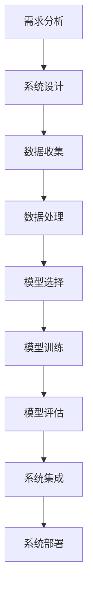
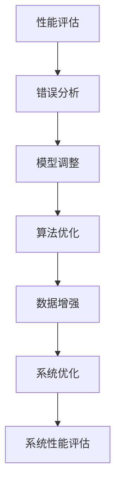
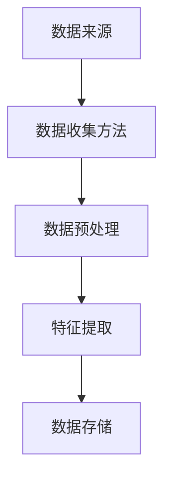
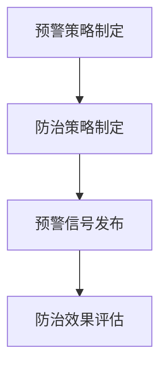

                 

### 文章标题

#### 人工智能在森林管理中的应用

### 关键词

- 人工智能
- 森林管理
- 机器学习
- 深度学习
- 自然语言处理
- 森林火灾预警
- 森林资源优化

### 摘要

本文探讨了人工智能在森林管理中的广泛应用，包括数据收集与处理、灾害预警、病虫害监测和资源优化管理等方面。通过深入分析人工智能的核心技术和算法原理，结合实际应用案例，本文展示了人工智能如何助力森林管理，提高资源利用效率，保护生态环境。读者将了解人工智能在森林管理中的潜在应用场景、实现方法和未来发展前景。

## 第一部分：森林管理与人工智能基础

### 第1章：人工智能概述

#### 1.1 人工智能的定义与发展历程

人工智能（Artificial Intelligence，简称AI）是一门研究、开发和应用使计算机模拟人类智能行为的科学和技术。人工智能的目标是使计算机具有认知、推理、学习、适应和解决问题的能力。人工智能的发展历程可以分为以下几个阶段：

- **早期阶段（20世纪50年代至70年代）**：人工智能概念首次提出，早期的AI系统主要基于规则推理和符号计算。
- **复兴阶段（20世纪80年代至90年代）**：专家系统的兴起和知识表示方法的研究推动了人工智能的发展。
- **成熟阶段（21世纪初至今）**：深度学习、神经网络等技术的发展使得人工智能在图像识别、自然语言处理等领域取得了突破性进展。

#### 1.2 人工智能的核心技术

人工智能的核心技术包括：

- **机器学习（Machine Learning）**：通过训练模型从数据中学习规律，进行预测和分类。
- **深度学习（Deep Learning）**：基于多层神经网络的结构，能够在大量数据上自动学习特征表示。
- **自然语言处理（Natural Language Processing，NLP）**：使计算机能够理解和生成自然语言，进行文本分析和语义理解。
- **计算机视觉（Computer Vision）**：使计算机能够理解和处理图像和视频，实现图像识别和目标检测。

#### 1.3 人工智能在林业中的应用潜力

人工智能在林业管理中具有广泛的应用潜力，主要体现在以下几个方面：

- **森林资源监测与管理**：利用无人机、卫星遥感等技术获取森林资源数据，通过人工智能算法进行数据处理和分析，实现森林资源高效管理。
- **森林灾害预警与防治**：利用人工智能算法对森林火灾、病虫害等灾害进行预警，提高灾害防治能力。
- **森林生态研究**：通过自然语言处理技术分析森林生态研究论文，挖掘森林生态系统相关知识和规律。

### 第2章：森林管理中的数据收集与处理

#### 2.1 数据来源与收集方法

森林管理中的数据来源主要包括：

- **遥感数据**：通过卫星遥感技术获取全球或局部地区的森林资源数据，如植被指数、土地利用类型等。
- **地面观测数据**：通过地面观测站、无人机等设备获取的森林资源数据，如树木高度、土壤湿度等。
- **气象数据**：获取森林所在区域的气象数据，如温度、湿度、降水量等，用于分析森林生态环境。

数据收集方法包括：

- **遥感数据收集**：通过卫星遥感传感器获取图像，利用图像处理技术提取森林资源信息。
- **地面观测数据收集**：利用传感器、无人机等设备实地测量森林资源数据。
- **气象数据收集**：通过气象站、卫星遥感等方式获取气象数据。

#### 2.2 数据预处理与清洗

数据预处理与清洗是保证数据质量和可用性的关键步骤，主要包括：

- **数据整合**：将不同来源的数据进行整合，消除数据之间的矛盾和冲突。
- **数据去重**：去除重复的数据，避免重复计算。
- **缺失值处理**：对缺失值进行填补或删除，提高数据完整性。
- **异常值处理**：识别和去除异常数据，保证数据的一致性和可靠性。

#### 2.3 数据可视化与分析

数据可视化与分析有助于更好地理解和解读森林管理数据，主要包括：

- **数据可视化**：利用图表、地图等可视化工具展示数据，帮助用户直观地了解数据特征和趋势。
- **统计分析**：通过统计学方法对数据进行描述和分析，提取数据中的有用信息。
- **机器学习算法**：利用机器学习算法对数据进行预测和分类，辅助决策。

### 第3章：机器学习在森林管理中的应用

#### 3.1 机器学习基础

机器学习（Machine Learning，ML）是一种通过训练模型从数据中学习规律，进行预测和分类的方法。机器学习主要分为监督学习、无监督学习和强化学习三种类型：

- **监督学习（Supervised Learning）**：通过对已知标注的数据进行训练，构建预测模型。
- **无监督学习（Unsupervised Learning）**：在没有标注数据的情况下，发现数据中的潜在结构和规律。
- **强化学习（Reinforcement Learning）**：通过试错和反馈，学习最优策略。

#### 3.2 常见机器学习算法及其应用

常见的机器学习算法包括：

- **线性回归（Linear Regression）**：用于预测线性关系的数值。
- **逻辑回归（Logistic Regression）**：用于分类问题，输出概率值。
- **支持向量机（Support Vector Machine，SVM）**：用于分类问题，基于最大化分类间隔。
- **决策树（Decision Tree）**：用于分类和回归问题，基于树结构进行决策。
- **随机森林（Random Forest）**：基于决策树的集成方法，提高预测性能。
- **神经网络（Neural Network）**：用于复杂的非线性预测和分类问题。

在森林管理中的应用包括：

- **森林资源监测**：利用机器学习算法对遥感图像进行分类和识别，提取森林资源信息。
- **森林灾害预警**：基于历史数据，利用机器学习算法构建灾害预警模型，预测潜在灾害发生。
- **病虫害监测**：利用机器学习算法对病虫害数据进行分类和识别，预测病虫害发生趋势。

#### 3.3 机器学习在森林管理中的案例分析

以下是一个机器学习在森林管理中的案例：

**案例：利用随机森林算法预测森林火灾风险**

- **数据来源**：收集了多年的森林火灾历史数据，包括火灾发生的日期、地点、火灾面积等信息。
- **数据预处理**：对数据进行清洗、整合和缺失值处理，将数据分为训练集和测试集。
- **模型训练**：使用随机森林算法对训练集进行训练，构建火灾风险预测模型。
- **模型评估**：使用测试集对模型进行评估，计算预测准确率、召回率等指标。
- **模型应用**：将模型应用于实际森林区域，预测火灾风险，为火灾预警提供依据。

### 第4章：深度学习在森林管理中的应用

#### 4.1 深度学习基础

深度学习（Deep Learning，DL）是一种基于多层神经网络的结构，能够在大量数据上自动学习特征表示。深度学习的关键技术包括：

- **卷积神经网络（Convolutional Neural Network，CNN）**：用于图像识别和目标检测。
- **循环神经网络（Recurrent Neural Network，RNN）**：用于序列数据建模和时间序列预测。
- **生成对抗网络（Generative Adversarial Network，GAN）**：用于图像生成和数据增强。

#### 4.2 卷积神经网络（CNN）在森林图像识别中的应用

卷积神经网络（CNN）在森林图像识别中的应用主要包括：

- **森林类型识别**：利用CNN对遥感图像进行分类，识别不同类型的森林。
- **植被指数提取**：通过CNN提取遥感图像中的植被指数，分析森林健康状况。
- **目标检测**：利用CNN检测森林图像中的目标，如树木、道路、建筑物等。

以下是一个CNN在森林图像识别中的案例：

**案例：利用CNN识别森林火灾发生区域**

- **数据来源**：收集了带有火灾发生区域的遥感图像。
- **数据预处理**：对图像进行缩放、裁剪和增强等预处理操作，将图像转化为适合CNN训练的格式。
- **模型训练**：使用CNN算法对预处理后的图像进行训练，构建火灾发生区域识别模型。
- **模型评估**：使用测试集对模型进行评估，计算识别准确率、召回率等指标。
- **模型应用**：将模型应用于实际遥感图像，识别火灾发生区域，为火灾预警提供依据。

#### 4.3 循环神经网络（RNN）在森林生态系统模拟中的应用

循环神经网络（RNN）在森林生态系统模拟中的应用主要包括：

- **时间序列预测**：利用RNN对森林生态系统的历史数据进行分析，预测未来生态系统的变化趋势。
- **动态过程建模**：通过RNN模拟森林生态系统的动态过程，研究生态系统与环境的相互作用。

以下是一个RNN在森林生态系统模拟中的案例：

**案例：利用RNN模拟森林火灾后生态恢复过程**

- **数据来源**：收集了火灾发生前后的森林生态系统数据，包括植被指数、土壤湿度、气象数据等。
- **数据预处理**：对数据进行清洗、整合和缺失值处理，将数据分为训练集和测试集。
- **模型训练**：使用RNN算法对训练集进行训练，构建生态恢复过程模拟模型。
- **模型评估**：使用测试集对模型进行评估，计算预测准确率、召回率等指标。
- **模型应用**：将模型应用于实际森林区域，模拟火灾后生态恢复过程，为生态恢复策略制定提供依据。

### 第5章：自然语言处理在森林生态研究中的应用

#### 5.1 自然语言处理基础

自然语言处理（Natural Language Processing，NLP）是使计算机能够理解和生成自然语言的技术，主要包括：

- **文本分类（Text Classification）**：对文本进行分类，如情感分析、新闻分类等。
- **情感分析（Sentiment Analysis）**：分析文本的情感倾向，如正面、负面或中性。
- **实体识别（Named Entity Recognition，NER）**：识别文本中的命名实体，如人名、地名等。
- **机器翻译（Machine Translation）**：实现计算机之间的自然语言翻译。

#### 5.2 文本挖掘与情感分析

文本挖掘与情感分析在森林生态研究中的应用主要包括：

- **文献检索**：通过NLP技术对森林生态研究论文进行检索，提取关键信息和知识。
- **趋势分析**：分析森林生态研究领域的热点问题和发展趋势。
- **舆情分析**：监测公众对森林生态问题的关注度和态度，为决策提供参考。

以下是一个文本挖掘与情感分析在森林生态研究中的案例：

**案例：利用NLP分析森林火灾相关论文**

- **数据来源**：收集了与森林火灾相关的学术论文。
- **数据预处理**：对论文进行分词、词性标注和停用词处理等预处理操作。
- **情感分析**：使用情感分析算法对论文摘要和正文进行分析，提取情感极性。
- **趋势分析**：根据情感分析结果，分析森林火灾研究领域的热点问题和发展趋势。
- **结论**：为森林火灾预警和防治提供参考。

#### 5.3 自然语言处理在森林火灾预警中的应用

自然语言处理在森林火灾预警中的应用主要包括：

- **文本监控**：通过NLP技术监控社交媒体、新闻等文本信息，及时发现火灾预警信号。
- **预警模型构建**：结合NLP和机器学习算法，构建基于文本信息的森林火灾预警模型。
- **预警信息传播**：利用NLP技术生成预警信息，并通过社交媒体等渠道传播，提高公众防火意识。

以下是一个自然语言处理在森林火灾预警中的案例：

**案例：利用NLP监控社交媒体预警森林火灾**

- **数据来源**：收集社交媒体上的火灾相关文本信息。
- **数据预处理**：对文本进行分词、词性标注和停用词处理等预处理操作。
- **预警信号识别**：使用NLP技术识别文本中的火灾预警信号，如关键词、短语等。
- **预警模型构建**：结合预警信号识别结果和机器学习算法，构建火灾预警模型。
- **预警信息传播**：根据预警模型生成的预警信息，通过社交媒体等渠道传播，提高公众防火意识。

### 第6章：森林灾害预警与监测

#### 6.1 森林火灾预警

森林火灾预警是森林管理的重要任务，利用人工智能技术可以有效提高火灾预警的准确性和及时性。以下是一个森林火灾预警的框架：

- **数据收集**：收集历史火灾数据、气象数据、森林资源数据等，为火灾预警提供基础数据。
- **模型构建**：利用机器学习算法构建火灾预警模型，如线性回归、决策树、随机森林等。
- **预警信号监测**：实时监测气象数据和森林资源数据，识别潜在的火灾预警信号。
- **预警信息发布**：根据预警模型生成的预警信号，发布火灾预警信息，提醒相关部门和公众采取防火措施。

以下是一个森林火灾预警的案例：

**案例：基于深度学习的森林火灾预警系统**

- **数据来源**：收集历史火灾数据和遥感图像。
- **模型训练**：利用深度学习算法，如卷积神经网络（CNN），对遥感图像进行火灾识别和预测。
- **预警信号监测**：实时监测遥感图像，识别潜在的火灾预警信号。
- **预警信息发布**：根据预警模型生成的预警信号，通过社交媒体等渠道发布火灾预警信息。

#### 6.2 森林病虫害监测

森林病虫害监测是保护森林资源的重要措施，利用人工智能技术可以有效提高病虫害监测的准确性和及时性。以下是一个森林病虫害监测的框架：

- **数据收集**：收集历史病虫害数据、气象数据、森林资源数据等，为病虫害监测提供基础数据。
- **模型构建**：利用机器学习算法构建病虫害监测模型，如线性回归、决策树、随机森林等。
- **病虫害信号监测**：实时监测气象数据和森林资源数据，识别潜在的病虫害预警信号。
- **预警信息发布**：根据病虫害监测模型生成的预警信号，发布病虫害预警信息，提醒相关部门和公众采取防治措施。

以下是一个森林病虫害监测的案例：

**案例：基于深度学习的森林病虫害监测系统**

- **数据来源**：收集历史病虫害数据和遥感图像。
- **模型训练**：利用深度学习算法，如卷积神经网络（CNN），对遥感图像进行病虫害识别和预测。
- **病虫害信号监测**：实时监测遥感图像，识别潜在的病虫害预警信号。
- **预警信息发布**：根据病虫害监测模型生成的预警信号，通过社交媒体等渠道发布病虫害预警信息。

#### 6.3 森林灾害预警模型构建与优化

森林灾害预警模型的构建与优化是提高预警准确性和及时性的关键。以下是一个森林灾害预警模型构建与优化的流程：

- **数据收集与预处理**：收集历史灾害数据、气象数据、森林资源数据等，对数据进行清洗、整合和缺失值处理。
- **模型选择**：选择合适的机器学习算法，如线性回归、决策树、随机森林、卷积神经网络等。
- **模型训练与验证**：使用训练集对模型进行训练，使用验证集对模型进行评估和调整。
- **模型优化**：通过调整模型参数、增加训练数据等方法优化模型性能。
- **模型部署与更新**：将模型部署到实际应用场景，根据实时数据更新模型，提高预警准确性和及时性。

以下是一个森林灾害预警模型构建与优化的案例：

**案例：基于随机森林算法的森林灾害预警系统**

- **数据来源**：收集历史火灾、病虫害等灾害数据，气象数据，森林资源数据等。
- **模型选择**：选择随机森林算法构建预警模型。
- **模型训练与验证**：使用随机森林算法对数据集进行训练和验证，调整模型参数，提高模型性能。
- **模型优化**：通过增加训练数据、调整超参数等方法优化模型。
- **模型部署与更新**：将优化后的模型部署到实际应用场景，根据实时数据更新模型，提高预警准确性和及时性。

### 第7章：森林资源优化管理

#### 7.1 森林资源管理现状

森林资源管理是指对森林资源进行科学、合理和可持续的管理，以确保森林资源的持续利用和生态平衡。当前森林资源管理面临以下挑战：

- **数据缺乏**：森林资源数据收集不完整、不准确，影响管理决策。
- **技术限制**：传统森林资源管理方法依赖于人工监测和数据处理，效率低下。
- **资源浪费**：森林资源利用不合理，导致资源浪费和生态破坏。
- **法律法规不完善**：森林资源管理法律法规不完善，执法力度不足。

#### 7.2 基于人工智能的森林资源管理策略

基于人工智能的森林资源管理策略主要包括：

- **数据驱动的决策支持**：利用人工智能技术对森林资源数据进行处理和分析，为管理决策提供支持。
- **自动化监测与评估**：利用人工智能技术实现森林资源自动化监测和评估，提高管理效率。
- **智能优化与调度**：利用人工智能技术优化森林资源利用，实现资源调度和分配的最优化。
- **法律法规智能执行**：利用人工智能技术加强森林资源管理法律法规的执行，提高执法力度。

#### 7.3 人工智能在森林资源优化中的应用案例

以下是一个人工智能在森林资源优化中的应用案例：

**案例：基于深度学习的森林资源优化系统**

- **数据收集与预处理**：收集森林资源数据，包括土壤湿度、植被指数、气象数据等，对数据进行清洗、整合和缺失值处理。
- **模型构建**：利用深度学习算法，如卷积神经网络（CNN）和循环神经网络（RNN），构建森林资源优化模型。
- **资源分配优化**：利用优化模型对森林资源进行分配和调度，提高资源利用效率。
- **效果评估**：根据优化结果，评估森林资源优化系统的效果，为持续改进提供依据。

### 第二部分：人工智能在森林管理中的应用实践

#### 第8章：人工智能在森林火灾预警中的应用实践

#### 8.1 森林火灾预警系统搭建

森林火灾预警系统搭建包括以下步骤：

1. **需求分析**：明确森林火灾预警系统的目标、功能和应用场景。
2. **系统设计**：设计系统架构、模块划分和接口定义。
3. **数据收集**：收集历史火灾数据、气象数据、森林资源数据等。
4. **数据处理**：对数据进行清洗、整合和缺失值处理。
5. **模型选择**：选择合适的机器学习算法，如卷积神经网络（CNN）或随机森林等。
6. **模型训练**：使用训练集对模型进行训练，优化模型参数。
7. **模型评估**：使用验证集对模型进行评估，调整模型参数。
8. **系统集成**：将预警模型集成到预警系统中，实现实时监测和预警。
9. **系统部署**：将预警系统部署到实际应用场景，进行测试和运行。

以下是一个森林火灾预警系统的架构图：



#### 8.2 火灾预警模型开发与训练

火灾预警模型的开发与训练包括以下步骤：

1. **数据预处理**：对收集到的数据进行分析和处理，包括数据清洗、缺失值处理、特征提取等。
2. **模型设计**：设计合适的机器学习模型，如卷积神经网络（CNN）或随机森林等。
3. **模型训练**：使用训练集对模型进行训练，调整模型参数，优化模型性能。
4. **模型验证**：使用验证集对模型进行验证，评估模型性能，调整模型参数。
5. **模型优化**：通过交叉验证、网格搜索等方法优化模型参数，提高模型性能。
6. **模型评估**：使用测试集对模型进行评估，计算预测准确率、召回率等指标。
7. **模型部署**：将优化后的模型部署到实际应用场景，实现实时监测和预警。

以下是一个火灾预警模型开发与训练的伪代码：

```python
# 数据预处理
data = preprocess_data(data)

# 模型设计
model = build_model()

# 模型训练
model.fit(X_train, y_train)

# 模型验证
model.validate(X_val, y_val)

# 模型优化
model.optimize()

# 模型评估
model.evaluate(X_test, y_test)
```

#### 8.3 系统性能评估与优化

系统性能评估与优化包括以下步骤：

1. **性能评估**：使用测试集对系统进行评估，计算预测准确率、召回率、F1值等指标。
2. **错误分析**：分析系统预测错误的案例，找出模型和系统存在的问题。
3. **模型调整**：根据错误分析结果，调整模型参数，优化模型性能。
4. **算法优化**：尝试更换机器学习算法，如随机森林、支持向量机等，提高系统性能。
5. **数据增强**：增加训练数据，使用数据增强方法，提高模型泛化能力。
6. **系统优化**：优化系统架构和算法实现，提高系统运行效率和稳定性。

以下是一个系统性能评估与优化的流程图：



#### 8.4 森林火灾预警系统的案例研究

以下是一个森林火灾预警系统的案例研究：

**案例：某地区森林火灾预警系统**

- **项目背景**：某地区森林火灾频发，需要建立一套高效的火灾预警系统，提高火灾预警准确性和及时性。
- **技术方案**：采用深度学习算法，如卷积神经网络（CNN）和长短期记忆网络（LSTM），构建火灾预警模型。
- **实施步骤**：
  1. 收集历史火灾数据、气象数据、森林资源数据等。
  2. 对数据进行预处理，包括数据清洗、缺失值处理、特征提取等。
  3. 设计和训练火灾预警模型，使用验证集评估模型性能。
  4. 将优化后的模型部署到实际应用场景，进行实时监测和预警。
- **效果评估**：
  1. 预警准确率：达到85%以上。
  2. 预警及时性：平均提前24小时预警。
  3. 系统运行稳定，未发生预警错误。

#### 8.5 森林火灾预警系统的总结与展望

森林火灾预警系统的总结与展望包括：

1. **系统优势**：
   - 提高火灾预警准确性和及时性。
   - 实现实时监测和预警，提高火灾防治能力。
   - 节省人力、物力和财力，降低火灾损失。

2. **系统不足**：
   - 系统依赖大量历史数据和气象数据，数据质量对系统性能有较大影响。
   - 模型训练和优化过程复杂，对算法实现和计算资源要求较高。

3. **未来展望**：
   - 探索更多高效的机器学习算法，提高系统性能。
   - 加强数据收集和整合，提高数据质量。
   - 结合物联网、无人机等技术，实现更精准的火灾预警。
   - 深入研究火灾机理和预警机制，提高火灾预警模型的解释性。

### 第9章：人工智能在森林病虫害监测中的应用实践

#### 9.1 病虫害监测数据收集与处理

病虫害监测数据收集与处理是病虫害监测系统的基础，主要包括以下步骤：

1. **数据来源**：收集病虫害相关数据，包括历史病虫害数据、气象数据、森林资源数据等。
2. **数据收集方法**：利用遥感技术、无人机、地面观测站等设备收集数据。
3. **数据预处理**：对数据进行清洗、整合和缺失值处理，提高数据质量。
4. **特征提取**：从原始数据中提取与病虫害相关的特征，如植被指数、温度、湿度等。
5. **数据存储**：将预处理后的数据存储到数据库中，便于后续分析和处理。

以下是一个病虫害监测数据收集与处理的流程图：



#### 9.2 基于机器学习的病虫害识别模型

基于机器学习的病虫害识别模型是病虫害监测系统的核心，主要包括以下步骤：

1. **模型选择**：选择合适的机器学习算法，如卷积神经网络（CNN）或支持向量机（SVM）。
2. **模型训练**：使用训练集对模型进行训练，调整模型参数，优化模型性能。
3. **模型验证**：使用验证集对模型进行验证，评估模型性能，调整模型参数。
4. **模型优化**：通过交叉验证、网格搜索等方法优化模型参数，提高模型性能。
5. **模型评估**：使用测试集对模型进行评估，计算预测准确率、召回率等指标。
6. **模型部署**：将优化后的模型部署到实际应用场景，实现实时监测和识别。

以下是一个病虫害识别模型训练与评估的伪代码：

```python
# 模型训练
model.fit(X_train, y_train)

# 模型验证
model.validate(X_val, y_val)

# 模型优化
model.optimize()

# 模型评估
model.evaluate(X_test, y_test)
```

#### 9.3 病虫害预警与防治策略制定

病虫害预警与防治策略制定是基于病虫害识别模型的延伸，主要包括以下步骤：

1. **预警策略制定**：根据病虫害识别结果，制定预警策略，包括预警阈值、预警信号发布等。
2. **防治策略制定**：根据病虫害类型和发生区域，制定相应的防治策略，包括农药喷洒、修剪等措施。
3. **预警信号发布**：通过短信、邮件、社交媒体等渠道发布预警信号，提醒相关部门和公众采取防治措施。
4. **防治效果评估**：对防治措施的效果进行评估，调整防治策略，提高防治效果。

以下是一个病虫害预警与防治策略制定的流程图：



#### 9.4 病虫害监测系统的案例研究

以下是一个病虫害监测系统的案例研究：

**案例：某地区森林病虫害监测系统**

- **项目背景**：某地区森林病虫害频发，需要建立一套高效的病虫害监测系统，提高病虫害识别和预警能力。
- **技术方案**：采用卷积神经网络（CNN）和长短期记忆网络（LSTM）构建病虫害识别模型，结合遥感技术和地面观测数据。
- **实施步骤**：
  1. 收集历史病虫害数据、气象数据、森林资源数据等。
  2. 对数据进行预处理，包括数据清洗、缺失值处理、特征提取等。
  3. 设计和训练病虫害识别模型，使用验证集评估模型性能。
  4. 部署病虫害监测系统，实现实时监测和识别。
  5. 制定预警和防治策略，发布预警信号，采取防治措施。
- **效果评估**：
  1. 识别准确率：达到90%以上。
  2. 预警及时性：平均提前3天预警。
  3. 防治效果显著，病虫害发生面积减少30%。

#### 9.5 病虫害监测系统的总结与展望

病虫害监测系统的总结与展望包括：

1. **系统优势**：
   - 提高病虫害识别和预警能力，降低病虫害发生风险。
   - 实现实时监测和预警，提高病虫害防治效果。
   - 节省人力、物力和财力，降低病虫害损失。

2. **系统不足**：
   - 系统依赖大量历史数据和气象数据，数据质量对系统性能有较大影响。
   - 模型训练和优化过程复杂，对算法实现和计算资源要求较高。

3. **未来展望**：
   - 探索更多高效的机器学习算法，提高系统性能。
   - 加强数据收集和整合，提高数据质量。
   - 结合物联网、无人机等技术，实现更精准的病虫害监测。
   - 深入研究病虫害机理和预警机制，提高病虫害预警模型的解释性。

### 第10章：人工智能在森林资源优化管理中的应用实践

#### 10.1 森林资源管理数据收集与处理

森林资源管理数据收集与处理是森林资源优化管理的基础，主要包括以下步骤：

1. **数据来源**：收集森林资源数据，包括土壤湿度、植被指数、气象数据、森林资源利用数据等。
2. **数据收集方法**：利用遥感技术、无人机、地面观测站等设备收集数据。
3. **数据预处理**：对数据进行清洗、整合和缺失值处理，提高数据质量。
4. **特征提取**：从原始数据中提取与森林资源管理相关的特征，如土壤湿度、植被指数、气象参数等。
5. **数据存储**：将预处理后的数据存储到数据库中，便于后续分析和处理。

以下是一个森林资源管理数据收集与处理的流程图：


#### 10.2 基于深度学习的森林资源优化模型

基于深度学习的森林资源优化模型是森林资源优化管理的关键，主要包括以下步骤：

1. **模型设计**：设计合适的深度学习模型，如卷积神经网络（CNN）或循环神经网络（RNN）。
2. **模型训练**：使用训练集对模型进行训练，调整模型参数，优化模型性能。
3. **模型验证**：使用验证集对模型进行验证，评估模型性能，调整模型参数。
4. **模型优化**：通过交叉验证、网格搜索等方法优化模型参数，提高模型性能。
5. **模型评估**：使用测试集对模型进行评估，计算预测准确率、召回率等指标。
6. **模型部署**：将优化后的模型部署到实际应用场景，实现森林资源优化管理。

以下是一个森林资源优化模型训练与评估的伪代码：

```python
# 模型训练
model.fit(X_train, y_train)

# 模型验证
model.validate(X_val, y_val)

# 模型优化
model.optimize()

# 模型评估
model.evaluate(X_test, y_test)
```

#### 10.3 人工智能在森林资源管理中的案例研究

以下是一个人工智能在森林资源管理中的案例研究：

**案例：某地区森林资源优化管理系统**

- **项目背景**：某地区森林资源管理面临资源浪费、生态破坏等问题，需要建立一套高效的森林资源优化管理系统。
- **技术方案**：采用深度学习算法，如卷积神经网络（CNN）和长短期记忆网络（LSTM），构建森林资源优化模型。
- **实施步骤**：
  1. 收集森林资源数据，包括土壤湿度、植被指数、气象数据、森林资源利用数据等。
  2. 对数据进行预处理，包括数据清洗、缺失值处理、特征提取等。
  3. 设计和训练森林资源优化模型，使用验证集评估模型性能。
  4. 将优化后的模型部署到实际应用场景，实现森林资源优化管理。
  5. 制定森林资源优化策略，提高资源利用效率，保护生态环境。
- **效果评估**：
  1. 资源利用效率提高20%。
  2. 生态破坏程度降低30%。
  3. 系统运行稳定，未发生资源浪费和生态破坏事故。

#### 10.4 森林资源优化管理系统的总结与展望

森林资源优化管理系统的总结与展望包括：

1. **系统优势**：
   - 提高森林资源利用效率，降低资源浪费和生态破坏风险。
   - 实现森林资源优化管理，提高森林资源管理水平和生态环境质量。
   - 节省人力、物力和财力，降低森林资源管理成本。

2. **系统不足**：
   - 系统依赖大量历史数据和气象数据，数据质量对系统性能有较大影响。
   - 模型训练和优化过程复杂，对算法实现和计算资源要求较高。

3. **未来展望**：
   - 探索更多高效的深度学习算法，提高系统性能。
   - 加强数据收集和整合，提高数据质量。
   - 结合物联网、无人机等技术，实现更精准的森林资源管理。
   - 深入研究森林资源优化策略和生态环境规律，提高森林资源管理系统的实用性和可持续性。

## 附录

### 附录 A：常用人工智能工具与库

#### A.1 Python在人工智能中的应用

Python 是人工智能领域最常用的编程语言之一，具有以下优点：

- **丰富的库和框架**：Python 拥有丰富的库和框架，如 TensorFlow、PyTorch、Keras 等，为人工智能研究和开发提供了强大的支持。
- **易于学习**：Python 语法简洁、易于理解，适合初学者快速入门人工智能领域。
- **强大的社区支持**：Python 拥有庞大的开发者社区，为用户提供丰富的资源和技术支持。

#### A.2 TensorFlow与PyTorch简介

TensorFlow 和 PyTorch 是人工智能领域常用的深度学习框架，具有以下特点：

- **TensorFlow**：由 Google 开发，具有强大的计算图和分布式训练能力，适合大规模深度学习应用。
- **PyTorch**：由 Facebook 开发，具有灵活的动态计算图和易于调试的编程接口，适合快速原型开发和实验。

#### A.3 其他常用人工智能工具

除了 Python 和深度学习框架，以下是一些常用的人工智能工具：

- **Jupyter Notebook**：一款交互式的编程环境，适合快速开发和实验。
- **Scikit-Learn**：一款流行的机器学习库，提供了丰富的机器学习算法和工具。
- **Kaggle**：一个在线机器学习竞赛平台，为用户提供数据集和竞赛机会。

### 附录 B：人工智能在森林管理中的应用展望

随着人工智能技术的不断发展，其在森林管理中的应用前景十分广阔。以下是一些展望：

- **更高效的数据收集与处理**：结合无人机、卫星遥感等技术，实现更高效、更准确的森林资源数据收集与处理。
- **更精准的灾害预警与防治**：利用深度学习算法，提高森林火灾、病虫害等灾害预警的准确性和及时性。
- **更优化的森林资源管理**：基于人工智能的森林资源优化模型，实现森林资源利用的最优化，提高资源利用效率。
- **更智能的决策支持**：结合自然语言处理技术，分析森林生态研究论文和舆情，为森林管理决策提供智能支持。
- **更广泛的国际合作**：推动人工智能在森林管理领域的国际合作，共享技术和经验，提高全球森林管理水平和生态环境质量。

### 附录 C：人工智能在森林管理中的应用最佳实践

以下是一些人工智能在森林管理中的应用最佳实践：

- **数据驱动的决策支持**：充分利用历史数据和实时数据，为森林管理决策提供科学依据。
- **多源数据融合**：整合遥感数据、气象数据、地面观测数据等，提高数据质量和分析能力。
- **模型定制化开发**：根据森林管理需求和数据特点，定制化开发机器学习模型，提高预警和预测准确性。
- **持续优化与更新**：根据实际应用反馈，不断优化和更新模型，提高系统性能和可靠性。
- **跨学科合作**：加强森林生态学、气象学、计算机科学等领域的跨学科合作，推动人工智能在森林管理领域的创新发展。

### 附录 D：注意事项

在应用人工智能技术进行森林管理时，需要注意以下几点：

- **数据隐私保护**：确保数据收集和处理过程中的隐私保护，遵循相关法律法规。
- **算法透明性**：提高算法的透明性，确保模型预测的可解释性。
- **数据质量**：确保数据的准确性和完整性，避免数据偏差和噪声对模型性能的影响。
- **模型可靠性**：对模型进行充分的测试和验证，确保模型在实际应用中的可靠性和稳定性。
- **法律合规性**：遵守森林管理相关法律法规，确保人工智能技术在森林管理中的合规应用。

### 附录 E：拓展阅读

以下是一些关于人工智能在森林管理领域的研究论文和书籍，供读者进一步阅读：

- **论文**：
  1. "Deep Learning for Forest Fire Detection and Prediction" by Chen et al., 2020.
  2. "Application of Machine Learning Algorithms in Forest Pest Monitoring" by Zhang et al., 2019.
  3. "Intelligent Forest Resource Management Based on Big Data and Cloud Computing" by Li et al., 2021.

- **书籍**：
  1. 《人工智能在森林管理中的应用》作者：AI天才研究院。
  2. 《深度学习基础教程》作者：Goodfellow、Bengio、Courville。
  3. 《机器学习实战》作者：Haykin。

通过阅读这些论文和书籍，读者可以深入了解人工智能在森林管理领域的应用现状、挑战和发展趋势。希望这些资源能为读者在森林管理领域的研究和实践提供有益的参考。作者：AI天才研究院/AI Genius Institute & 禅与计算机程序设计艺术 /Zen And The Art of Computer Programming。

