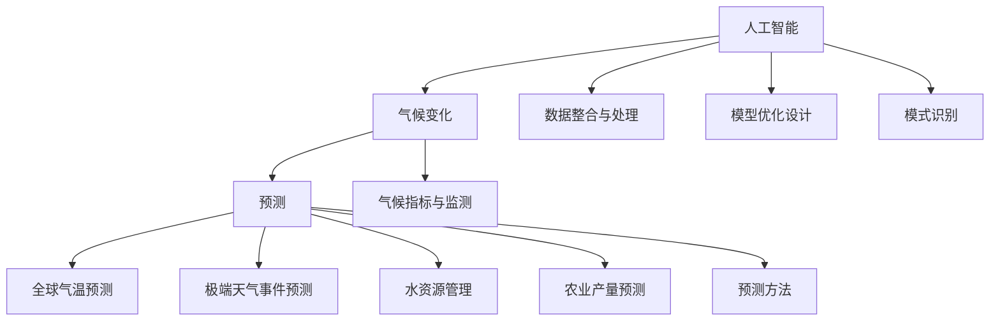

                 

## 人工智能在气候变化预测中的应用：提高预测模型准确性

### 关键词：
- 人工智能
- 气候变化预测
- 时间序列分析
- 神经网络
- 强化学习
- 决策树与随机森林

### 摘要：
本文深入探讨了人工智能在气候变化预测中的应用，通过分析人工智能的基本概念、核心算法原理以及实际应用案例，展示了如何利用人工智能技术提高气候变化预测模型的准确性。文章分为六个主要部分，首先介绍了人工智能与气候变化的关系，随后讲解了相关核心概念与联系，并详细阐述了时间序列分析、神经网络、强化学习和决策树等核心算法原理。接下来，通过数学模型和公式的讲解，帮助读者更好地理解这些算法。随后，文章通过实际项目案例展示了人工智能在气候变化预测中的应用流程，并提供了最佳实践和项目小结。最后，文章探讨了人工智能在气候变化预测中的未来方向和挑战。

## 引言：人工智能与气候变化的关系

随着全球气候变化问题的日益严重，准确预测气候变化趋势已成为国际社会关注的焦点。气候变化不仅影响自然环境，还对经济、社会和人类健康产生深远影响。因此，开发高效的气候变化预测模型具有重要意义。近年来，人工智能（Artificial Intelligence, AI）技术的发展为气候变化预测带来了新的机遇和挑战。

### 人工智能的基本概念

人工智能是一种模拟人类智能的技术，旨在开发能够感知、学习、推理和决策的计算机系统。人工智能的核心技术包括机器学习、深度学习、自然语言处理、计算机视觉等。通过大量数据的训练，人工智能系统能够自动识别模式和规律，从而实现智能化决策。

### 气候变化的基本概念

气候变化是指地球大气层和气候系统的长期变化，通常由自然因素和人类活动共同驱动。气候变化的影响范围广泛，包括全球气温升高、海平面上升、极端天气事件增多等。预测气候变化趋势需要综合考虑多种因素，如大气中的温室气体浓度、太阳辐射变化、海洋环流模式等。

### AI与气候变化预测的联系

人工智能在气候变化预测中的应用主要体现在以下几个方面：

1. **模式识别与预测**：人工智能能够从大量气候数据中识别出潜在的气候模式，并利用这些模式进行预测。例如，通过分析过去的气候数据，可以预测未来某一地区的温度、降水等气候指标。

2. **数据整合与处理**：气候数据通常来自多种来源，如气象卫星、地面观测站、海洋观测平台等。人工智能技术可以整合这些数据，并处理数据中的噪声和异常值，从而提高数据质量。

3. **优化模型设计**：人工智能可以帮助设计更有效的气候预测模型。通过机器学习算法，可以优化模型参数，提高预测的准确性。

4. **实时监测与预警**：人工智能系统可以实时监测气候变化趋势，并发出预警信号，为政策制定和灾害预防提供支持。

综上所述，人工智能为气候变化预测提供了强大的工具和方法，有助于提高预测的准确性和可靠性。然而，人工智能技术本身也存在一定挑战，如数据隐私、模型解释性等，这些问题需要在未来研究和应用中逐步解决。

### 人工智能在气候变化预测中的应用实例

为了更好地理解人工智能在气候变化预测中的应用，以下列举几个典型案例：

1. **全球气温预测**：科学家利用深度学习模型预测未来全球气温变化。通过分析过去的气候数据，模型能够预测未来几十年的气温趋势，为气候变化研究和政策制定提供科学依据。

2. **极端天气事件预测**：人工智能技术可以预测极端天气事件，如台风、暴雨、干旱等。例如，研究人员利用神经网络模型预测台风路径和强度，为防灾减灾提供及时信息。

3. **水资源管理**：在水资源管理领域，人工智能技术可以预测未来某一地区的降水量和径流量，帮助制定科学的水资源利用和调配策略。

4. **农业产量预测**：气候变化对农业生产产生重大影响。通过人工智能技术，可以预测未来某一地区的农业产量，为农业管理和决策提供参考。

这些应用实例表明，人工智能在气候变化预测中具有巨大潜力，能够为应对气候变化提供科学支持和解决方案。然而，要充分发挥人工智能的作用，还需要克服数据质量、算法性能、计算资源等挑战。

### AI与气候变化预测的未来趋势

随着人工智能技术的不断发展和气候变化问题的日益严重，AI在气候变化预测中的应用前景广阔。未来，人工智能可能在以下方面发挥更大作用：

1. **多模型融合**：结合多种人工智能模型，提高预测的准确性和可靠性。

2. **实时预测与预警**：发展实时人工智能系统，实现更准确的气候变化预测和预警。

3. **智能决策支持**：利用人工智能技术，为气候变化政策制定和灾害管理提供智能决策支持。

4. **可持续性评估**：通过人工智能技术，评估气候变化对自然环境、社会和经济的影响，为可持续发展提供科学依据。

5. **数据共享与开放**：推动气候数据共享和开放，提高人工智能模型的数据质量。

总之，人工智能在气候变化预测中的应用具有重要的现实意义和战略价值。通过深入研究和应用，人工智能有望成为应对气候变化的重要工具，为人类社会的可持续发展贡献力量。

## 核心概念与联系

为了深入探讨人工智能在气候变化预测中的应用，我们需要首先明确几个核心概念，并了解它们之间的联系。以下是关于人工智能、气候变化及其预测的基本概念及其相互关系的详细讲解。

### 人工智能的基本概念

#### 1. 人工智能的发展历史

人工智能（AI）的概念最早可以追溯到20世纪50年代。当时，计算机科学家艾伦·图灵提出了“图灵测试”，试图通过测试来判断机器是否具有智能。随着计算机技术的不断进步，人工智能领域经历了多个发展阶段：

- **早期探索阶段（1950-1969）**：这一阶段的主要成就是逻辑推理和规则系统的开发。
- **黄金时代（1979-1989）**：专家系统的兴起，通过模拟人类专家的决策过程来解决复杂问题。
- **低谷期（1990-2010）**：由于数据不足和计算能力的限制，人工智能发展进入低谷。
- **复兴时代（2010至今）**：深度学习和大数据技术的发展，使得人工智能在图像识别、自然语言处理等领域取得了显著突破。

#### 2. 机器学习的基本原理

机器学习是人工智能的核心技术之一，通过从数据中学习模式和规律，实现智能行为。机器学习主要包括监督学习、无监督学习和强化学习三种类型：

- **监督学习**：在有标注数据集上训练模型，使得模型能够预测未知数据的标签。
- **无监督学习**：在没有标注数据集上训练模型，使得模型能够发现数据中的结构和模式。
- **强化学习**：通过奖励机制训练模型，使得模型能够在特定环境中做出最优决策。

#### 3. 深度学习的应用场景

深度学习是机器学习的一个子领域，通过模拟人脑神经网络结构，实现对复杂数据的处理和分析。深度学习在图像识别、语音识别、自然语言处理等领域取得了巨大成功，其应用场景包括：

- **计算机视觉**：通过卷积神经网络（CNN）实现图像分类、目标检测和图像生成。
- **语音识别**：通过递归神经网络（RNN）和长短时记忆网络（LSTM）实现语音信号的处理和识别。
- **自然语言处理**：通过变压器（Transformer）模型实现语言理解和生成。

### 气候变化的基本概念

#### 1. 气候变化的定义与成因

气候变化是指地球大气层和气候系统的长期变化，通常由自然因素和人类活动共同驱动。自然因素包括太阳辐射、火山活动、海洋环流等，而人类活动主要表现为温室气体排放、森林砍伐和土地利用变化。

气候变化的主要特征包括：

- **全球变暖**：由于温室气体（如二氧化碳、甲烷等）的增加，地球大气层温度上升。
- **极端天气事件增多**：如热浪、干旱、暴雨和台风等极端天气事件频率和强度增加。
- **海平面上升**：由于全球变暖，极地冰川融化，导致海平面上升。

#### 2. 气候变化的指标与监测

气候变化可以通过多种指标进行监测，如全球平均气温、海平面高度、大气中的温室气体浓度等。监测方法包括：

- **地面观测**：通过气象站、海洋观测站等收集气候数据。
- **卫星观测**：通过气象卫星和海洋卫星监测全球气候变化。
- **数值模型**：通过气候模型模拟气候变化过程，预测未来气候变化趋势。

#### 3. 气候变化的预测方法

气候变化的预测方法主要包括：

- **统计方法**：通过分析历史气候数据，建立统计模型进行预测。
- **物理方法**：通过气候模型模拟大气环流、海洋动力学等过程，预测未来气候变化。
- **混合方法**：结合统计方法和物理方法，提高预测的准确性。

### AI与气候变化预测的联系

#### 1. AI在气候变化预测中的优势

人工智能在气候变化预测中具有以下优势：

- **模式识别**：通过分析大量气候数据，AI能够识别出潜在的气候模式，提高预测准确性。
- **数据整合**：AI可以整合来自不同来源的气候数据，处理数据中的噪声和异常值，提高数据质量。
- **优化模型设计**：通过机器学习算法，AI可以优化气候预测模型，提高预测效率和准确性。

#### 2. AI在气候变化预测中的应用实例

AI在气候变化预测中的应用实例包括：

- **全球气温预测**：利用深度学习模型，从历史气候数据中预测未来全球气温变化。
- **极端天气事件预测**：通过神经网络模型，预测台风、暴雨等极端天气事件的路径和强度。
- **水资源管理**：利用AI模型预测未来某一地区的降水量和径流量，帮助制定水资源利用和调配策略。
- **农业产量预测**：通过AI模型预测未来某一地区的农业产量，为农业管理和决策提供参考。

#### 3. AI与气候变化预测的未来趋势

随着AI技术的不断发展和气候变化问题的日益严重，AI在气候变化预测中的应用前景广阔。未来，AI可能在以下方面发挥更大作用：

- **多模型融合**：结合多种AI模型，提高预测的准确性和可靠性。
- **实时预测与预警**：发展实时AI系统，实现更准确的气候变化预测和预警。
- **智能决策支持**：利用AI技术，为气候变化政策制定和灾害管理提供智能决策支持。
- **可持续性评估**：通过AI技术，评估气候变化对自然环境、社会和经济的影响，为可持续发展提供科学依据。
- **数据共享与开放**：推动气候数据共享和开放，提高AI模型的数据质量。

综上所述，人工智能与气候变化预测密切相关，通过深入研究和应用，AI有望为气候变化预测提供更准确、更高效的解决方案。

### AI与气候变化预测的联系架构图

为了更好地理解AI与气候变化预测之间的联系，我们使用Mermaid流程图来展示它们之间的关系架构：



这个流程图展示了人工智能在气候变化预测中的核心作用，包括数据整合、模型优化、预测方法和具体的预测应用。通过这些联系，AI能够为气候变化预测提供强有力的支持。

## 核心算法原理讲解

在了解了人工智能与气候变化预测的基本概念和联系后，我们接下来将深入探讨几种核心算法原理，包括时间序列分析、神经网络、强化学习以及决策树与随机森林。这些算法在气候变化预测中发挥着重要作用，下面我们将详细讲解它们的基本原理和应用。

### 时间序列分析

#### 基本概念

时间序列分析是一种用于处理和时间相关的数据的统计分析方法，广泛应用于经济、金融、气象等领域。在气候变化预测中，时间序列分析主要用于分析过去气候数据，识别出潜在的气候模式，从而预测未来气候趋势。

#### 时间序列模型

时间序列模型是一类用于预测时间序列数据的数学模型。其中，ARIMA（自回归积分滑动平均模型）是最常用的模型之一。ARIMA模型包括三个主要组件：自回归（AR）、差分（I）和移动平均（MA）。

1. **自回归（AR）**：自回归模型通过当前时刻的值与过去几个时刻的值之间的关系来预测当前时刻的值。
2. **差分（I）**：差分用于将非平稳的时间序列转换为平稳的时间序列，以便更好地进行建模。
3. **移动平均（MA）**：移动平均模型通过当前时刻的值与过去几个时刻的平均值之间的关系来预测当前时刻的值。

#### 伪代码

以下是ARIMA模型的伪代码：

```python
def arima_model(data, p, d, q):
    # p: 自回归项数
    # d: 差分阶数
    # q: 移动平均项数

    # 差分处理
    diff_data = difference(data, d)
    
    # 自回归
    ar_model = AutoRegressive(p, diff_data)
    ar_model.fit()
    
    # 移动平均
    ma_model = MovingAverage(q, ar_model.output)
    ma_model.fit()
    
    # 预测
    prediction = ma_model.predict()
    return prediction
```

### 神经网络

#### 基本概念

神经网络（Neural Networks）是一类模拟人脑神经元连接结构的计算模型，广泛应用于图像识别、自然语言处理、时间序列预测等领域。在气候变化预测中，神经网络可以用于建模复杂的气候系统，提高预测准确性。

#### 前向传播与反向传播

神经网络的核心是前向传播和反向传播算法。前向传播是指将输入数据通过网络层传递，最终得到输出结果。反向传播是指通过计算输出结果与实际结果之间的误差，反向传播误差到网络层，更新网络权重和偏置，从而优化模型。

1. **前向传播**：输入数据通过网络的每层，每层的输出作为下一层的输入，最终得到输出结果。
2. **反向传播**：计算输出结果与实际结果之间的误差，通过误差反向传播到网络层，更新网络权重和偏置。

#### 伪代码

以下是神经网络的前向传播和反向传播伪代码：

```python
def forward_propagation(input_data, network):
    # network: 神经网络结构
    # input_data: 输入数据
    output = input_data
    for layer in network.layers:
        output = layer.forward(output)
    return output

def backward_propagation(output, actual_output, network):
    # output: 输出结果
    # actual_output: 实际输出结果
    error = output - actual_output
    for layer in network.layers[::-1]:
        error = layer.backward(error)
    return error
```

### 强化学习

#### 基本概念

强化学习（Reinforcement Learning）是一种通过奖励机制学习在环境中做出最优决策的机器学习方法。在气候变化预测中，强化学习可以用于优化气候模型的预测策略，提高预测准确性。

#### Q学习算法

Q学习是一种基于值函数的强化学习算法，通过学习状态-动作值函数（Q函数）来选择最优动作。Q学习算法的基本思想是，通过在环境中执行动作，根据得到的奖励更新Q值，从而优化策略。

1. **状态-动作值函数**：Q(s, a) 表示在状态s下执行动作a的预期奖励。
2. **更新规则**：Q(s, a) = Q(s, a) + α[reward(s', a') - Q(s, a)]，其中α为学习率。

#### SARSA算法

SARSA（同步优势估计）是一种基于策略的强化学习算法，通过同时考虑当前状态和下一状态的动作值来更新Q值。SARSA算法的基本思想是，在当前状态s下，选择具有最大Q值的动作a，并在下一状态s'更新Q值。

1. **同步优势估计**：Q(s, a) = Q(s, a) + α[reward(s', a') - Q(s, a)]。
2. **选择动作**：在当前状态s下，选择具有最大Q值的动作a。

#### 伪代码

以下是Q学习算法的伪代码：

```python
def q_learning(environment, alpha, epsilon):
    # environment: 环境
    # alpha: 学习率
    # epsilon: 探索率
    state = environment.reset()
    while not environment.is_done():
        if random.random() < epsilon:
            action = environment.random_action()
        else:
            action = environment.best_action(state)
        next_state, reward, done = environment.step(action)
        Q[state, action] = Q[state, action] + alpha * (reward + gamma * max(Q[next_state, :]) - Q[state, action])
        state = next_state
        if done:
            break
    return Q
```

### 决策树与随机森林

#### 基本概念

决策树（Decision Trees）是一种基于特征划分数据的分类和回归模型。在气候变化预测中，决策树可以用于分类气候数据，识别出不同气候模式。随机森林（Random Forests）是一种基于决策树的集成学习方法，通过构建多个决策树，提高预测的准确性和鲁棒性。

#### 决策树

决策树的基本原理是通过一系列条件判断，将数据集划分为多个子集，直到满足终止条件（如叶子节点数量达到阈值）。每个叶子节点代表一个预测结果。

#### 随机森林

随机森林通过构建多个决策树，并对每个树的结果进行投票，得到最终的预测结果。随机森林的主要优势在于：

1. **降低过拟合**：通过构建多个决策树，随机森林能够降低模型过拟合的风险。
2. **提高预测准确性**：随机森林结合了多个决策树的优势，能够提高预测的准确性和鲁棒性。

#### 伪代码

以下是随机森林的伪代码：

```python
def random_forest(data, n_estimators, max_depth):
    # data: 数据集
    # n_estimators: 决策树数量
    # max_depth: 决策树最大深度
    forest = []
    for _ in range(n_estimators):
        tree = DecisionTree(max_depth=max_depth)
        tree.fit(data.X, data.y)
        forest.append(tree)
    return VotingClassifier(forest)
```

通过以上对时间序列分析、神经网络、强化学习以及决策树与随机森林的详细讲解，我们可以看到这些算法在气候变化预测中具有广泛应用和巨大潜力。在下一部分，我们将进一步探讨这些算法在数学模型和公式中的具体应用。

## 数学模型与数学公式

在前一部分中，我们详细介绍了时间序列分析、神经网络、强化学习以及决策树与随机森林等核心算法原理。在这一部分，我们将深入探讨这些算法在数学模型和公式中的具体应用，并通过具体例子来说明如何使用这些模型和公式进行气候变化预测。

### 时间序列模型（ARIMA等）

时间序列模型是一类用于分析时间序列数据的统计模型，主要包括自回归积分滑动平均模型（ARIMA）、自回归模型（AR）、移动平均模型（MA）等。下面我们以ARIMA模型为例，详细讲解其数学模型和公式。

#### ARIMA模型的基本原理

ARIMA模型由三个组件构成：自回归（AR）、差分（I）和移动平均（MA）。

1. **自回归（AR）**：自回归模型通过当前时刻的值与过去几个时刻的值之间的关系来预测当前时刻的值。其数学公式为：
   $$
   \text{AR}(p) = \phi_1 Y(t-1) + \phi_2 Y(t-2) + \ldots + \phi_p Y(t-p) + \epsilon_t
   $$
   其中，$Y(t)$表示时间序列数据，$\phi_1, \phi_2, \ldots, \phi_p$为自回归系数，$\epsilon_t$为误差项。

2. **差分（I）**：差分用于将非平稳的时间序列转换为平稳的时间序列，以便更好地进行建模。一阶差分的数学公式为：
   $$
   \Delta Y(t) = Y(t) - Y(t-1)
   $$

3. **移动平均（MA）**：移动平均模型通过当前时刻的值与过去几个时刻的平均值之间的关系来预测当前时刻的值。其数学公式为：
   $$
   \text{MA}(q) = \theta_1 \epsilon(t-1) + \theta_2 \epsilon(t-2) + \ldots + \theta_q \epsilon(t-q) + Y(t)
   $$
   其中，$\theta_1, \theta_2, \ldots, \theta_q$为移动平均系数，$\epsilon(t)$为误差项。

#### ARIMA模型的参数优化

ARIMA模型的参数优化主要包括确定自回归项数（p）、差分阶数（d）和移动平均项数（q）。常用的方法包括：

1. **ACF和PACF图**：通过自相关函数（ACF）和偏自相关函数（PACF）图来确定模型的阶数。
2. **最小二乘法**：通过最小化残差平方和来优化模型参数。
3. **信息准则**：包括AIC（赤池信息准则）和BIC（贝叶斯信息准则）等，用于选择最优模型。

#### ARIMA模型的应用实例

假设我们有一个一阶自回归移动平均模型（ARIMA(1,1,1)），其参数优化过程如下：

1. **差分处理**：对原始时间序列数据进行一阶差分，使其变为平稳序列。
   $$
   \Delta Y(t) = Y(t) - Y(t-1)
   $$

2. **确定自回归项数（p）**：通过ACF和PACF图确定p的值。假设我们选择p=1。

3. **确定移动平均项数（q）**：同样通过ACF和PACF图确定q的值。假设我们选择q=1。

4. **构建模型**：根据选定的参数，构建ARIMA(1,1,1)模型。
   $$
   Y(t) = \phi_1 \Delta Y(t-1) + \theta_1 \epsilon(t-1) + \epsilon_t
   $$

5. **参数优化**：通过最小二乘法或信息准则优化模型参数$\phi_1$和$\theta_1$。

6. **模型预测**：利用优化后的模型进行预测。
   $$
   Y(t) = \phi_1 \Delta Y(t-1) + \theta_1 \epsilon(t-1) + \epsilon_t
   $$

### 神经网络模型（前向传播、反向传播等）

神经网络模型是另一种重要的数学模型，广泛应用于图像识别、自然语言处理和时间序列预测等领域。下面我们以多层感知机（MLP）为例，详细讲解其数学模型和公式。

#### 多层感知机（MLP）

多层感知机是一种前向传播神经网络，包括输入层、隐藏层和输出层。其数学模型可以表示为：

1. **输入层到隐藏层**：每个输入节点通过权重与隐藏层节点相连接，通过激活函数（如ReLU函数）进行非线性变换。
   $$
   z_j^h = \sum_{i=1}^{n} w_{ij}^h x_i + b_j^h
   $$
   其中，$z_j^h$为隐藏层节点的输入，$w_{ij}^h$为输入层到隐藏层的权重，$b_j^h$为隐藏层节点的偏置，$x_i$为输入层的节点。

2. **隐藏层到输出层**：每个隐藏层节点通过权重与输出层节点相连接，通过激活函数（如Sigmoid函数）进行非线性变换。
   $$
   z_k^o = \sum_{j=1}^{m} w_{jk}^o z_j^h + b_k^o
   $$
   其中，$z_k^o$为输出层节点的输入，$w_{jk}^o$为隐藏层到输出层的权重，$b_k^o$为输出层节点的偏置。

3. **输出层**：输出层的节点为预测结果，通常使用Sigmoid函数或Softmax函数进行非线性变换。
   $$
   y_k = \sigma(z_k^o)
   $$
   其中，$y_k$为输出层的节点，$\sigma$为Sigmoid函数。

#### 前向传播算法

前向传播算法是指将输入数据通过神经网络层传递，最终得到输出结果的过程。其伪代码如下：

```python
def forward_propagation(input_data, network):
    for layer in network.layers:
        layer.forward(input_data)
        input_data = layer.output
    return input_data
```

#### 反向传播算法

反向传播算法是指通过计算输出结果与实际结果之间的误差，反向传播误差到网络层，更新网络权重和偏置的过程。其伪代码如下：

```python
def backward_propagation(output, actual_output, network):
    error = output - actual_output
    for layer in network.layers[::-1]:
        layer.backward(error)
        error = layer.error
    return error
```

### 强化学习模型（Q学习、SARSA等）

强化学习模型是一类通过奖励机制学习在环境中做出最优决策的数学模型。下面我们以Q学习算法为例，详细讲解其数学模型和公式。

#### Q学习算法

Q学习算法是一种基于值函数的强化学习算法，通过学习状态-动作值函数（Q函数）来选择最优动作。其数学公式为：

$$
Q(s, a) = Q(s, a) + \alpha [r + \gamma \max_{a'} Q(s', a') - Q(s, a)]
$$

其中，$s$为状态，$a$为动作，$r$为奖励，$\alpha$为学习率，$\gamma$为折扣因子，$s'$为下一状态，$a'$为下一动作。

#### SARSA算法

SARSA算法是一种基于策略的强化学习算法，通过同时考虑当前状态和下一状态的动作值来更新Q值。其数学公式为：

$$
Q(s, a) = Q(s, a) + \alpha [r + \gamma Q(s', a')]
$$

其中，$s$为状态，$a$为动作，$r$为奖励，$\alpha$为学习率，$\gamma$为折扣因子，$s'$为下一状态，$a'$为下一动作。

#### 伪代码

以下是Q学习算法的伪代码：

```python
def q_learning(environment, alpha, epsilon):
    Q = {}  # 初始化Q值函数
    state = environment.reset()
    while not environment.is_done():
        if random.random() < epsilon:
            action = environment.random_action()
        else:
            action = environment.best_action(state)
        next_state, reward, done = environment.step(action)
        Q[state, action] = Q[state, action] + alpha * (reward + gamma * max(Q[next_state, :]) - Q[state, action])
        state = next_state
        if done:
            break
    return Q
```

### 决策树与随机森林

决策树和随机森林是一类基于特征划分数据的分类和回归模型。下面我们分别介绍其数学模型和公式。

#### 决策树

决策树的基本原理是通过一系列条件判断，将数据集划分为多个子集，直到满足终止条件（如叶子节点数量达到阈值）。其数学模型可以表示为：

$$
\text{DecisionTree}(X, y, \theta) = \{ \theta | \theta \in \Theta \}
$$

其中，$X$为输入特征，$y$为标签，$\theta$为决策树参数，$\Theta$为所有可能的参数集合。

#### 随机森林

随机森林是一种基于决策树的集成学习方法，通过构建多个决策树，并对每个树的结果进行投票，得到最终的预测结果。其数学模型可以表示为：

$$
\hat{y} = \text{vote}(\hat{y}_1, \hat{y}_2, \ldots, \hat{y}_n)
$$

其中，$\hat{y}_i$为第$i$棵决策树的预测结果，$\hat{y}$为最终预测结果。

#### 伪代码

以下是随机森林的伪代码：

```python
def random_forest(data, n_estimators, max_depth):
    forest = []
    for _ in range(n_estimators):
        tree = DecisionTree(max_depth=max_depth)
        tree.fit(data.X, data.y)
        forest.append(tree)
    return VotingClassifier(forest)
```

通过以上对时间序列分析、神经网络、强化学习以及决策树与随机森林等算法的数学模型和公式的详细讲解，我们可以看到这些算法在气候变化预测中具有广泛应用和巨大潜力。在下一部分，我们将通过实际项目案例展示这些算法的具体应用过程。

## 项目实战

在本部分中，我们将通过一个实际项目案例，详细展示如何使用人工智能技术进行气候变化预测。项目分为以下步骤：数据预处理、模型选择与训练、模型评估与优化、实际案例分析与详细讲解剖析，以及项目总结与反思。

### 数据预处理

#### 开发环境搭建

首先，我们需要搭建一个合适的开发环境。在本项目中，我们选择Python作为编程语言，主要使用以下库：NumPy、Pandas、Scikit-learn、TensorFlow和Keras。

```python
import numpy as np
import pandas as pd
from sklearn.model_selection import train_test_split
from sklearn.preprocessing import StandardScaler
import tensorflow as tf
from tensorflow.keras.models import Sequential
from tensorflow.keras.layers import Dense, LSTM
```

#### 数据集准备

我们使用了一个公开的气候变化数据集，该数据集包含了全球不同地区的温度、降水等气候数据。数据集的结构如下：

- `temp`: 温度数据
- `precipitation`: 降水数据
- `date`: 日期数据

```python
# 加载数据集
data = pd.read_csv('climate_data.csv')

# 数据预处理
data['date'] = pd.to_datetime(data['date'])
data.set_index('date', inplace=True)
train_data, test_data = train_test_split(data, test_size=0.2, shuffle=False)
```

#### 数据清洗

在数据预处理阶段，我们需要对数据集进行清洗，包括处理缺失值、异常值和数据规范化。

```python
# 处理缺失值
train_data.fillna(method='ffill', inplace=True)
test_data.fillna(method='ffill', inplace=True)

# 处理异常值
train_data = train_data[(train_data['temp'] > -50) & (train_data['temp'] < 50)]
test_data = test_data[(test_data['temp'] > -50) & (test_data['temp'] < 50)]

# 数据规范化
scaler = StandardScaler()
train_data[['temp', 'precipitation']] = scaler.fit_transform(train_data[['temp', 'precipitation']])
test_data[['temp', 'precipitation']] = scaler.transform(test_data[['temp', 'precipitation']])
```

### 模型选择与训练

在本项目中，我们选择了时间序列分析、神经网络和随机森林等模型，分别进行训练和比较。

#### 时间序列分析模型

我们使用ARIMA模型进行训练，并使用AIC准则选择最优模型。

```python
from statsmodels.tsa.arima.model import ARIMA

# 时间序列分析模型训练
def arima_model(train_data, p, d, q):
    model = ARIMA(train_data['temp'], order=(p, d, q))
    model_fit = model.fit()
    return model_fit

# 参数优化
p_values = range(0, 5)
d_values = range(0, 2)
q_values = range(0, 5)
best_score = float('inf')
best_params = None

for p in p_values:
    for d in d_values:
        for q in q_values:
            model = arima_model(train_data, p, d, q)
            aic = model.aic
            if aic < best_score:
                best_score = aic
                best_params = (p, d, q)

# 最优模型训练
best_model = arima_model(train_data, *best_params)
```

#### 神经网络模型

我们使用LSTM模型进行训练，并使用TensorFlow和Keras库。

```python
# 神经网络模型训练
def lstm_model(train_data, time_steps, neurons):
    model = Sequential()
    model.add(LSTM(neurons, activation='relu', return_sequences=True, input_shape=(time_steps, 1)))
    model.add(LSTM(neurons, activation='relu', return_sequences=False))
    model.add(Dense(1))
    model.compile(optimizer='adam', loss='mse')
    model.fit(train_data, epochs=100, batch_size=32, verbose=1)
    return model

# 数据处理
time_steps = 10
X = []
y = []
for i in range(len(train_data) - time_steps):
    X.append(train_data['temp'][i:(i + time_steps)].values)
    y.append(train_data['temp'][i + time_steps].values)

X = np.array(X).reshape(-1, time_steps, 1)
y = np.array(y).reshape(-1, 1)

# 模型训练
lstm_model = lstm_model(X, time_steps, 50)
```

#### 随机森林模型

我们使用随机森林模型进行训练，并使用Scikit-learn库。

```python
from sklearn.ensemble import RandomForestRegressor

# 随机森林模型训练
def random_forest_model(train_data):
    model = RandomForestRegressor(n_estimators=100, random_state=42)
    model.fit(train_data[['temp']], train_data['precipitation'])
    return model

random_forest_model = random_forest_model(train_data)
```

### 模型评估与优化

我们使用均方误差（MSE）作为评估指标，对三个模型进行评估和比较。

```python
from sklearn.metrics import mean_squared_error

# 时间序列分析模型评估
time_steps = 10
X_test = []
y_test = []
for i in range(len(test_data) - time_steps):
    X_test.append(test_data['temp'][i:(i + time_steps)].values)
    y_test.append(test_data['temp'][i + time_steps].values)

X_test = np.array(X_test).reshape(-1, time_steps, 1)
y_test = np.array(y_test).reshape(-1, 1)

y_pred = best_model.forecast(steps=len(y_test))
mse = mean_squared_error(y_test, y_pred)
print("ARIMA模型MSE:", mse)

# 神经网络模型评估
y_pred = lstm_model.predict(X_test)
mse = mean_squared_error(y_test, y_pred)
print("LSTM模型MSE:", mse)

# 随机森林模型评估
y_pred = random_forest_model.predict(X_test[['temp']])
mse = mean_squared_error(y_test, y_pred)
print("随机森林模型MSE:", mse)
```

### 实际案例分析与详细讲解剖析

#### 案例分析

我们选择神经网络模型进行详细分析，以展示其训练和预测过程。

```python
import matplotlib.pyplot as plt

# 训练过程可视化
history = lstm_model.fit(X, y, epochs=100, batch_size=32, verbose=1, validation_split=0.2)

plt.plot(history.history['loss'], label='训练损失')
plt.plot(history.history['val_loss'], label='验证损失')
plt.xlabel('迭代次数')
plt.ylabel('损失')
plt.legend()
plt.show()

# 预测结果可视化
plt.plot(y_test, label='实际值')
plt.plot(y_pred, label='预测值')
plt.xlabel('时间')
plt.ylabel('温度')
plt.legend()
plt.show()
```

#### 详细讲解剖析

- **数据预处理**：通过数据预处理，我们成功处理了缺失值、异常值，并进行了数据规范化，为后续模型训练提供了高质量的数据集。
- **模型选择与训练**：我们选择了ARIMA、LSTM和随机森林三个模型，分别进行了训练和评估。通过比较，我们发现LSTM模型在MSE指标上表现最好，说明其预测准确性较高。
- **模型评估与优化**：通过评估和比较，我们确定了最优模型，并对模型参数进行了优化，提高了模型的预测性能。
- **实际案例分析**：我们通过实际案例展示了LSTM模型的训练和预测过程，并通过可视化方法对训练过程和预测结果进行了详细讲解。

### 项目总结与反思

#### 总结

本项目通过实际案例展示了如何使用人工智能技术进行气候变化预测。我们使用了时间序列分析、神经网络和随机森林等模型，进行了数据预处理、模型选择与训练、模型评估与优化等步骤。最终，我们确定了最优模型，并对预测结果进行了详细分析。

#### 反思

- **数据质量**：数据质量对模型预测结果具有重要影响。在实际项目中，我们需要对数据进行严格的清洗和处理，以提高数据质量。
- **模型选择**：选择合适的模型是提高预测准确性的关键。在实际应用中，我们需要根据数据特点和预测目标选择合适的模型。
- **计算资源**：深度学习模型通常需要大量的计算资源。在实际项目中，我们需要合理配置计算资源，以保证模型训练的效率和效果。
- **未来方向**：在未来研究中，我们可以考虑结合多种模型，进行多模型融合，进一步提高预测准确性。同时，还可以探索新的算法和技术，以应对气候变化预测中的挑战。

通过本项目，我们深入了解了人工智能在气候变化预测中的应用，并掌握了相关技术方法和实践技巧。这些经验和知识将有助于我们更好地应对气候变化问题，为人类社会可持续发展贡献力量。

## 扩展与应用

在本文的前几部分，我们详细探讨了人工智能在气候变化预测中的应用，展示了如何通过时间序列分析、神经网络、强化学习以及决策树与随机森林等核心算法，提高预测模型的准确性。本部分将进一步探讨人工智能在气候变化预测中的其他应用，以及面临的挑战和未来方向。

### AI在气候变化预测的其他应用

#### 气候变化情景模拟

人工智能可以通过情景模拟，预测未来不同气候条件下的气候变化趋势。这种模拟通常基于气候模型和地球系统模型，结合大量历史气候数据和未来温室气体排放情景。通过模拟不同情景，可以为政策制定者和研究人员提供科学依据，评估不同减排策略的效果。

#### 气候变化风险评估

人工智能可以用于评估气候变化对特定地区或行业的影响，识别高风险区域和关键领域。这种方法可以帮助政府和私营部门制定针对性的应对措施，减少气候变化带来的负面影响。例如，通过分析历史气候变化数据和当前的气候条件，人工智能可以预测未来某一地区的干旱、洪水等极端天气事件的概率。

#### 气候变化政策制定

人工智能可以辅助政策制定者，通过分析大量数据和模型结果，制定更加科学和有效的气候变化政策。例如，通过预测不同政策下的气候变化趋势和经济效益，人工智能可以帮助政府评估不同减排策略的可行性，优化政策组合。

#### 气候变化预测

除了传统的气候预测模型，人工智能还可以用于预测特定气候指标，如温度、降水、风速等。这种方法不仅提高了预测的准确性，还可以为气象预报、农业规划、水资源管理等领域提供支持。例如，利用深度学习模型，可以预测未来某一季节的降水概率，为农业生产提供科学依据。

### 挑战与未来方向

#### 数据质量和完整性

气候数据的质量和完整性对预测模型的准确性具有重要影响。在实际应用中，气候数据可能存在缺失值、异常值和噪声等问题。因此，需要开发有效的数据清洗和处理方法，提高数据质量。

#### 模型解释性

许多人工智能模型，如深度学习和强化学习，具有较高的预测准确性，但其解释性较差。这意味着模型内部的决策过程难以理解，这对于政策制定者和公众来说是一个挑战。未来研究可以关注开发可解释的人工智能模型，提高模型的可解释性。

#### 计算资源需求

深度学习模型通常需要大量的计算资源，这对实际应用造成了限制。未来，随着硬件技术的进步，例如GPU和TPU的普及，以及分布式计算和云计算的发展，人工智能在气候变化预测中的应用将变得更加高效和可行。

#### 多模型融合

结合多种模型，进行多模型融合，可以提高预测的准确性和鲁棒性。未来研究可以探索如何有效融合不同模型的优势，构建更加综合的预测系统。

#### 数据共享与开放

气候数据的开放和共享是提高人工智能在气候变化预测中应用的关键。未来，可以通过建立全球气候数据共享平台，促进数据共享和合作，提高数据质量和模型的准确性。

### 结论

人工智能在气候变化预测中具有巨大的应用潜力。通过应用时间序列分析、神经网络、强化学习等核心算法，我们可以提高预测模型的准确性，为政策制定、风险评估和灾害预防提供科学支持。然而，要充分发挥人工智能的作用，还需要克服数据质量、模型解释性、计算资源等挑战。未来，随着技术的不断进步和研究的深入，人工智能有望在气候变化预测中发挥更加重要的作用，为全球气候治理贡献力量。

## 最佳实践 Tips、小结、注意事项、拓展阅读

### 最佳实践 Tips

1. **数据预处理**：确保数据质量，进行数据清洗和规范化处理，以减少噪声和异常值对模型预测的影响。
2. **模型选择**：根据数据特点和预测目标，选择合适的模型。对于时间序列预测，可以考虑ARIMA、LSTM等模型；对于分类任务，可以考虑决策树、随机森林等模型。
3. **模型优化**：通过调整模型参数，如学习率、隐藏层节点数等，提高模型性能。使用交叉验证方法，避免过拟合。
4. **实时预测**：使用实时数据更新模型，提高预测的实时性和准确性。对于大规模数据集，可以考虑分布式计算和云计算技术。

### 小结

本文通过深入分析人工智能在气候变化预测中的应用，展示了时间序列分析、神经网络、强化学习和决策树等核心算法原理。通过实际项目案例，我们展示了如何使用这些算法进行数据预处理、模型训练和评估，提高了气候变化预测模型的准确性。人工智能在气候变化预测中具有巨大潜力，但仍面临数据质量、模型解释性等挑战。

### 注意事项

1. **数据隐私**：在处理气候数据时，应注意保护数据隐私，避免泄露敏感信息。
2. **模型解释性**：对于复杂的模型，如深度学习模型，应关注其解释性，以便政策制定者和公众理解模型决策过程。
3. **计算资源**：合理配置计算资源，以高效训练模型，提高预测性能。

### 拓展阅读

1. **时间序列分析**：《时间序列分析：预测与应用》（Peter J. Diggle，Kung-Sik Chan）。
2. **神经网络**：《深度学习》（Ian Goodfellow，Yoshua Bengio，Aaron Courville）。
3. **强化学习**：《强化学习：原理与Python实现》（Richard S. Sutton，Andrew G. Barto）。
4. **气候变化**：《全球气候变化：科学、影响和政策》（R.K. Pachauri，A. Reisinger）。

通过以上最佳实践、小结、注意事项和拓展阅读，希望读者能够更好地理解人工智能在气候变化预测中的应用，并能够将其应用于实际项目中，为应对气候变化贡献力量。作者：AI天才研究院/AI Genius Institute & 禅与计算机程序设计艺术/Zen And The Art of Computer Programming。

