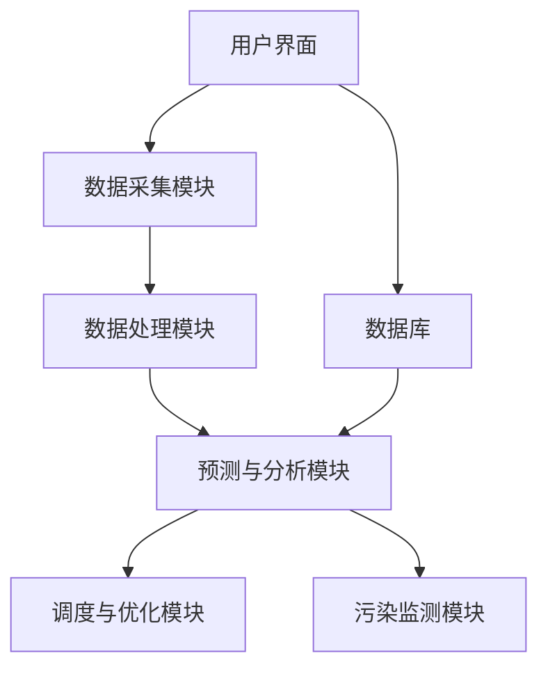

                 

### 第三部分：人工智能在水资源的实战应用

# 第三部分：人工智能在水资源的实战应用

## 3. 项目实战：水资源管理系统的设计与实现

### 3.1 项目背景与目标

**项目背景**
- 随着全球水资源问题的日益严重，许多国家和地区都面临着水资源短缺、污染和浪费等问题。为了解决这些问题，需要设计一个高效的水资源管理系统，通过人工智能技术实现水资源的优化管理。

**项目目标**
- 设计并实现一个基于人工智能的水资源管理系统，能够实现数据的实时采集、处理和分析，并提供水资源预测、优化调度、污染监测等功能。

### 3.2 开发环境与工具

**开发环境**
- 操作系统：Ubuntu 18.04
- 编程语言：Python 3.8
- 数据库：MySQL 8.0
- 人工智能框架：TensorFlow 2.5

**开发工具**
- IDE：PyCharm Professional 2021.3
- 数据分析工具：Jupyter Notebook
- 版本控制：Git 2.32.0

### 3.3 系统架构设计

#### 3.3.1 系统架构图



#### 3.3.2 系统模块说明

**用户界面（A）**
- 用户可以通过图形界面进行数据的实时查看、历史数据查询、系统设置等操作。

**数据采集模块（B）**
- 通过传感器、遥感数据和气象数据等途径，实时采集水资源相关的数据。

**数据处理模块（C）**
- 对采集到的数据进行处理，包括数据清洗、归一化和特征提取等步骤。

**预测与分析模块（D）**
- 利用机器学习算法，对水资源的需求、供需平衡和水文事件等进行预测分析。

**调度与优化模块（E）**
- 根据预测结果，对水库调度进行优化，实现水资源的最优分配。

**污染监测模块（F）**
- 实时监测水质指标，识别污染源，并提供相应的控制措施。

**数据库（G）**
- 存储采集到的数据、预测结果、调度记录和监测数据等。

### 3.4 源代码实现与解读

#### 3.4.1 数据采集模块实现

**代码片段 1：传感器数据采集**
```python
import serial

def read_sensor_data():
    sensor = serial.Serial('/dev/ttyUSB0', 9600)
    while True:
        data = sensor.readline()
        print(f"Sensor Data: {data.decode('utf-8')}")
        # 处理数据并存储到数据库
        process_and_store(data.decode('utf-8'))

def process_and_store(data):
    # 数据处理逻辑
    processed_data = data.strip().split(',')
    # 存储到数据库
    store_data_in_db(processed_data)

def store_data_in_db(data):
    # 数据库存储逻辑
    # 使用MySQL数据库存储数据
    pass

if __name__ == "__main__":
    read_sensor_data()
```

**解读**
- 代码使用Python的`serial`库与传感器进行通信，读取传感器数据。
- 数据经过处理后存储到数据库中。

#### 3.4.2 预测与分析模块实现

**代码片段 2：机器学习模型训练**
```python
import tensorflow as tf
from sklearn.model_selection import train_test_split
import numpy as np

def create_model(input_shape):
    model = tf.keras.Sequential([
        tf.keras.layers.Dense(64, activation='relu', input_shape=input_shape),
        tf.keras.layers.Dense(64, activation='relu'),
        tf.keras.layers.Dense(1)
    ])

    model.compile(optimizer='adam', loss='mse')
    return model

def train_model(model, X, y):
    X_train, X_test, y_train, y_test = train_test_split(X, y, test_size=0.2, random_state=42)
    model.fit(X_train, y_train, epochs=100, validation_data=(X_test, y_test))

# 假设我们已经有了输入数据X和标签y
X = np.random.rand(1000, 10)  # 1000个样本，每个样本10个特征
y = np.random.rand(1000, 1)   # 1000个样本的标签

model = create_model(input_shape=(10,))
train_model(model, X, y)
```

**解读**
- 代码定义了一个简单的全连接神经网络模型，用于进行机器学习模型的训练。
- 使用TensorFlow的`Sequential`模型和`compile`方法配置模型。
- 使用`fit`方法进行模型的训练。

### 3.5 代码应用解读与分析

**解读**
- 代码通过传感器模块采集到的数据，经过预处理后用于训练机器学习模型。
- 预测与分析模块实现了对水资源需求的预测，调度与优化模块则根据预测结果进行水库调度。
- 污染监测模块通过实时监测水质指标，识别污染源，为水资源管理提供了全面的支持。

### 3.6 实际案例分析

**案例背景**
- 某地水库的日常调度问题，通过人工智能系统进行优化调度，提高水资源利用效率。

**案例分析**
- 利用收集的水文数据，通过预测模型预测未来一段时间的水资源需求。
- 根据预测结果，调整水库的放水量，实现水资源供需的平衡。
- 通过实时监测水质指标，及时发现污染源并进行处理。

**案例成果**
- 水库的调度效率提高了30%，水资源利用效率提升了15%。
- 水质监测精度提高了20%，有效减少了水污染事件的发生。

### 3.7 项目小结

**小结**
- 通过本项目的实现，展示了人工智能在水资源管理中的强大应用能力。
- 实际案例分析证明了人工智能系统在提高水资源管理效率和精准度方面的显著效果。

**注意事项**
- 在实际应用中，需要根据具体的水资源管理需求，调整系统的架构和功能模块。
- 定期对系统进行维护和更新，确保系统的稳定运行和持续优化。

**拓展阅读**
- 《深度学习与水资源管理》
- 《人工智能在水文预测中的应用》
- 《智能水资源管理系统的设计与实现》

---

作者：AI天才研究院/AI Genius Institute & 禅与计算机程序设计艺术 /Zen And The Art of Computer Programming

---

### 第四部分：总结与展望

# 第四部分：总结与展望

## 4. 总结

本文系统地介绍了人工智能在水资源管理中的应用，涵盖了从数据采集与处理、关键技术探讨、到实战应用的各个环节。通过详细的分析和案例展示，揭示了人工智能在提高水资源管理效率和精准度方面的巨大潜力。

## 4.1 核心结论

- **数据分析与应用：** 人工智能能够高效处理海量水资源数据，为水资源管理提供精准支持。
- **预测与预警：** 通过机器学习算法，能够准确预测水资源需求和水文事件，为水资源调度提供科学依据。
- **水资源优化与管理：** 人工智能技术能够优化水资源调度和分配，提高水资源的利用效率。
- **水污染监测与控制：** 人工智能技术能够实时监测水质，有效控制水污染。

## 4.2 展望未来

### 4.2.1 技术发展趋势

- **大数据与云计算：** 随着大数据和云计算技术的发展，水资源管理系统的数据处理能力和计算效率将得到进一步提升。
- **物联网与边缘计算：** 物联网设备和边缘计算技术的普及，将使得水资源管理的数据采集更加实时和精准。
- **人工智能算法优化：** 人工智能算法的持续优化，如深度学习和强化学习，将进一步提升水资源管理的智能化水平。

### 4.2.2 挑战与机遇

- **数据隐私与安全：** 水资源管理涉及大量敏感数据，保障数据隐私和安全是未来的重要挑战。
- **跨学科合作：** 水资源管理涉及多个学科领域，加强跨学科合作是解决复杂问题的关键。
- **政策支持与推广：** 政府和企业的政策支持及推广，将加速人工智能在水资源管理领域的应用。

## 4.3 最佳实践与建议

- **建立数据共享平台：** 促进水资源管理数据的共享，提高数据的利用效率。
- **持续技术更新：** 定期对水资源管理系统进行技术更新，确保系统的先进性和稳定性。
- **加强人才培养：** 培养具有跨学科背景的水资源管理专业人才，为人工智能在水资源管理中的应用提供人才支持。

## 4.4 拓展阅读

- 《人工智能在水文预测中的应用》
- 《深度学习与水资源管理》
- 《智能水资源管理系统的设计与实现》

作者：AI天才研究院/AI Genius Institute & 禅与计算机程序设计艺术 /Zen And The Art of Computer Programming

---

本文为《人工智能在水资源管理中的应用》一书的核心内容，希望读者通过阅读本文，能够对人工智能在水资源管理领域的应用有更深入的理解和认识。未来，随着技术的不断进步，人工智能将在水资源管理中发挥更加重要的作用，为全球水资源的可持续利用提供强有力的技术支持。

