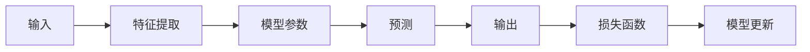
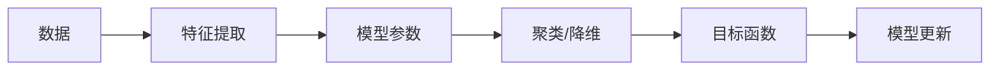

                 

### 人工智能在水资源管理中的应用前景

#### 关键词
- 人工智能
- 水资源管理
- 机器学习
- 数据挖掘
- 监测与预测
- 智慧水资源

#### 摘要
水资源是生命之源，然而全球水资源分布不均和污染问题日益严重，使得水资源管理成为亟待解决的挑战。人工智能（AI）作为现代科技的前沿领域，在水资源管理中展现出了巨大的潜力。本文将探讨人工智能在水资源管理中的应用前景，通过介绍人工智能的发展历程、核心概念、应用案例及面临的挑战，为未来智慧水资源的建设提供思考方向。

### 第1章 引言

#### 1.1 人工智能的发展历程

##### 1.1.1 人工智能的起源
人工智能（Artificial Intelligence, AI）的概念最早由计算机科学家约翰·麦卡锡（John McCarthy）在1956年提出。人工智能的起源可以追溯到20世纪中叶，当时的科学家们开始尝试通过模拟人类思维和行为来设计智能系统。这一概念激发了无数研究者和工程师的热情，推动了人工智能领域的发展。

##### 1.1.2 人工智能的关键技术
人工智能的关键技术包括机器学习、深度学习、自然语言处理、计算机视觉等。其中，机器学习是人工智能的核心技术之一，通过从数据中学习模式，使计算机具备自主学习和改进能力。深度学习作为机器学习的延伸，通过多层神经网络模拟人类大脑的神经元连接，实现了更复杂的模式识别任务。自然语言处理和计算机视觉则分别专注于理解和处理自然语言以及图像信息。

#### 1.2 水资源管理的重要性

##### 1.2.1 水资源现状与挑战
全球水资源分布极不均衡，部分地区面临严重的水资源短缺问题。同时，水资源污染问题也日益严重，对人类健康和生态系统造成了巨大威胁。据联合国统计，全球约28%的人口生活在面临用水压力的地区，而水资源污染则导致了大量疾病的发生。因此，如何有效管理水资源成为全球性挑战。

##### 1.2.2 水资源管理的关键问题
水资源管理面临的关键问题包括监测与预测、优化调度、水质管理和水资源分配等。准确的监测与预测可以提前预警水资源短缺和污染问题，优化调度可以提高水资源利用效率，水质管理则可以保障水资源的清洁和安全，而水资源分配则需要平衡各区域的用水需求。

### 第2章 人工智能在水资源管理中的核心概念

#### 2.1 机器学习基础

##### 2.1.1 监督学习

**核心概念与联系**

监督学习（Supervised Learning）是一种机器学习技术，其核心在于通过已标记的训练数据来学习模式，进而对未知数据进行预测或分类。监督学习的架构通常包括输入、输出、模型参数和损失函数。下面是一个简单的Mermaid流程图，展示了监督学习的基本架构：



**核心算法原理讲解**

- **线性回归**：线性回归是一种简单的监督学习算法，用于预测一个连续值。其基本原理是通过最小化预测值与真实值之间的误差，来调整模型参数。

  ```python
  # 伪代码
  y = w1 * x + b
  loss = (y - y_true)^2
  for i in range(num_iterations):
      gradient_w1 = 2 * (y - y_true) * x
      gradient_b = 2 * (y - y_true)
      w1 = w1 - learning_rate * gradient_w1
      b = b - learning_rate * gradient_b
  ```

- **决策树**：决策树是一种用于分类和回归的监督学习算法。其基本原理是通过递归划分数据集，将数据划分到不同的类别或值。

  ```python
  # 伪代码
  def decision_tree(data, features, target):
      if len(data) == 0:
          return majority_class(data)
      else:
          best_feature = find_best_feature(data, features)
          tree = {}
          tree[best_feature] = split_data(data, best_feature)
          return tree
  ```

##### 2.1.2 无监督学习

**核心概念与联系**

无监督学习（Unsupervised Learning）是一种机器学习技术，其核心在于从未标记的数据中学习模式，以发现数据中的隐含结构。无监督学习的架构通常包括数据、模型参数和目标函数。下面是一个简单的Mermaid流程图，展示了无监督学习的基本架构：



**核心算法原理讲解**

- **K-均值聚类**：K-均值聚类是一种常用的无监督学习算法，用于将数据点划分为K个簇。其基本原理是通过迭代优化目标函数，最小化簇内距离之和。

  ```python
  # 伪代码
  initialize centroids
  while not converged:
      for each data point:
          assign the nearest centroid
      update centroids
  ```

- **主成分分析**：主成分分析（PCA）是一种常用的降维算法，其核心原理是通过找到数据的主要成分，将高维数据投影到低维空间，以简化数据。

  ```python
  # 伪代码
  X = data matrix
  cov_matrix = cov(X)
  eigen_values, eigen_vectors = eig(cov_matrix)
  sorted_eigen_values, sorted_eigen_vectors = sort(eigen_values), sort(eigen_vectors)
  projected_data = X * sorted_eigen_vectors[:k]
  ```

### 第3章 人工智能在水资源管理中的应用

#### 3.1 水资源监测

##### 3.1.1 水质监测

水质监测是水资源管理的重要环节，通过实时监测水质参数，可以及时发现污染问题并采取相应措施。人工智能技术在水质监测中具有广泛应用，如通过深度学习算法对水质参数进行预测和分类，提高监测的准确性和效率。

**项目实战**

- **开发环境搭建**：选择Python作为编程语言，使用TensorFlow作为深度学习框架，搭建水质监测预测系统。

- **源代码详细实现**：编写深度学习模型，使用训练数据进行训练，并使用测试数据进行评估。

  ```python
  import tensorflow as tf
  from tensorflow.keras.models import Sequential
  from tensorflow.keras.layers import Dense, LSTM

  # 构建模型
  model = Sequential()
  model.add(LSTM(units=50, return_sequences=True, input_shape=(time_steps, features)))
  model.add(LSTM(units=50))
  model.add(Dense(units=1))

  # 编译模型
  model.compile(optimizer='adam', loss='mean_squared_error')

  # 训练模型
  model.fit(x_train, y_train, epochs=100, batch_size=32)
  ```

- **代码应用解读与分析**：通过训练模型，对水质参数进行预测，并分析预测结果。

  ```python
  predictions = model.predict(x_test)
  print(predictions)
  ```

##### 3.1.2 水位监测

水位监测是水资源管理中的另一重要任务，通过实时监测水位变化，可以提前预警洪水和干旱等灾害。人工智能技术在水位监测中具有重要作用，如利用深度学习算法对水位数据进行预测和分析。

**项目实战**

- **开发环境搭建**：选择Python作为编程语言，使用Scikit-learn作为机器学习库，搭建水位监测预测系统。

- **源代码详细实现**：编写深度学习模型，使用训练数据进行训练，并使用测试数据进行评估。

  ```python
  from sklearn.ensemble import RandomForestRegressor
  from sklearn.model_selection import train_test_split

  # 划分训练集和测试集
  x_train, x_test, y_train, y_test = train_test_split(X, y, test_size=0.2, random_state=42)

  # 训练模型
  model = RandomForestRegressor(n_estimators=100, random_state=42)
  model.fit(x_train, y_train)

  # 评估模型
  predictions = model.predict(x_test)
  print(predictions)
  ```

- **代码应用解读与分析**：通过训练模型，对水位数据进行预测，并分析预测结果。

  ```python
  from sklearn.metrics import mean_squared_error

  mse = mean_squared_error(y_test, predictions)
  print(mse)
  ```

#### 3.2 水资源预测

水资源预测是水资源管理中的关键任务，通过预测未来一段时间内水资源的供需情况，可以制定相应的管理策略，确保水资源的合理利用。人工智能技术在水资源预测中具有广泛应用，如利用机器学习算法对水资源供需进行预测。

**项目实战**

- **开发环境搭建**：选择Python作为编程语言，使用Scikit-learn作为机器学习库，搭建水资源预测系统。

- **源代码详细实现**：编写机器学习模型，使用训练数据进行训练，并使用测试数据进行评估。

  ```python
  from sklearn.svm import SVR
  from sklearn.model_selection import train_test_split

  # 划分训练集和测试集
  x_train, x_test, y_train, y_test = train_test_split(X, y, test_size=0.2, random_state=42)

  # 训练模型
  model = SVR(kernel='rbf', C=100, gamma=0.1)
  model.fit(x_train, y_train)

  # 评估模型
  predictions = model.predict(x_test)
  print(predictions)
  ```

- **代码应用解读与分析**：通过训练模型，对水资源供需进行预测，并分析预测结果。

  ```python
  from sklearn.metrics import mean_squared_error

  mse = mean_squared_error(y_test, predictions)
  print(mse)
  ```

#### 3.3 水资源优化调度

水资源优化调度是水资源管理中的重要任务，通过优化调度策略，可以实现水资源的合理分配和利用，提高水资源的利用效率。人工智能技术在水资源优化调度中具有广泛应用，如利用遗传算法等优化算法进行水资源调度。

**项目实战**

- **开发环境搭建**：选择Python作为编程语言，使用Genetic Algorithm作为优化算法，搭建水资源优化调度系统。

- **源代码详细实现**：编写遗传算法模型，实现水资源优化调度的功能。

  ```python
  import numpy as np
  import random

  # 初始化种群
  population_size = 100
  population = np.random.randint(low=0, high=100, size=(population_size, num_resources))

  # 适应度函数
  def fitness_function(individual):
      # 实现适应度计算逻辑
      return 1 / (np.sum(individual) + 1)

  # 遗传算法
  def genetic_algorithm(population, fitness_function, num_generations):
      for generation in range(num_generations):
          # 计算适应度
          fitness_scores = np.array([fitness_function(individual) for individual in population])

          # 选择
          selected_indices = np.random.choice(range(population_size), size=population_size, replace=False, p=fitness_scores / np.sum(fitness_scores))

          # 交叉
          crossover_rate = 0.8
          for i in range(0, population_size, 2):
              if random.random() < crossover_rate:
                  crossover_point = random.randint(1, num_resources - 1)
                  child1 = np.concatenate((population[selected_indices[i]][:crossover_point], population[selected_indices[i+1]][crossover_point:]))
                  child2 = np.concatenate((population[selected_indices[i+1]][:crossover_point], population[selected_indices[i]][crossover_point:]))
                  population[selected_indices[i]] = child1
                  population[selected_indices[i+1]] = child2

          # 变异
          mutation_rate = 0.05
          for i in range(population_size):
              if random.random() < mutation_rate:
                  mutation_point = random.randint(0, num_resources - 1)
                  population[i][mutation_point] = 1 - population[i][mutation_point]

      # 返回最优个体
      return population[np.argmax(fitness_scores)]

  # 运行遗传算法
  best_individual = genetic_algorithm(population, fitness_function, num_generations=100)
  print(best_individual)
  ```

- **代码应用解读与分析**：通过遗传算法，实现水资源优化调度的功能，并分析优化结果。

  ```python
  # 计算优化后的水资源分配
  optimized_resources = best_individual * num_resources
  print(optimized_resources)
  ```

### 第4章 人工智能在水资源管理中的挑战与未来

#### 4.1 人工智能在水资源管理中的挑战

##### 4.1.1 数据不足与数据质量问题

- **问题分析**：水资源管理中的数据不足和质量问题是人工智能应用的重要挑战。数据不足可能导致模型训练不足，影响模型的准确性和稳定性；而数据质量差则可能引入噪声和错误，降低模型的性能。
- **解决方案**：为了解决数据不足和质量问题，可以采用以下策略：
  - **数据增强**：通过生成合成数据来扩充数据集，提高模型的泛化能力。
  - **数据清洗**：对原始数据进行清洗和预处理，去除噪声和错误，提高数据质量。

##### 4.1.2 技术可靠性问题

- **问题分析**：人工智能技术在水资源管理中的应用还需要解决技术可靠性问题。模型的预测结果需要具备较高的可信度，以支持决策制定。
- **解决方案**：为了提高技术可靠性，可以采取以下措施：
  - **模型验证**：通过交叉验证和测试集评估模型性能，确保模型稳定可靠。
  - **模型解释性**：提高模型的解释性，使决策者能够理解模型的预测逻辑，增强信任度。

##### 4.1.3 政策与法规问题

- **问题分析**：水资源管理涉及多个部门和利益相关方，需要政策与法规的支持。然而，现有政策和法规可能无法适应人工智能技术的发展，导致应用受阻。
- **解决方案**：为了解决政策与法规问题，可以采取以下措施：
  - **政策引导**：政府出台相关政策，鼓励人工智能在水资源管理中的应用。
  - **法规完善**：修订和完善相关法规，确保人工智能技术的合法合规应用。

#### 4.2 人工智能在水资源管理中的未来趋势

##### 4.2.1 新技术的应用

- **物联网（IoT）技术**：物联网技术可以实现水资源的实时监测和远程控制，为人工智能技术的应用提供数据支持。
- **区块链技术**：区块链技术可以确保水资源管理中的数据安全和透明性，提高数据的可信度。

##### 4.2.2 智慧水资源的建设

- **智慧水资源**：智慧水资源是指通过人工智能、物联网、大数据等现代技术手段，实现水资源管理的智能化和高效化。未来，智慧水资源将成为水资源管理的重要方向。

### 第5章 案例研究

#### 5.1 水资源管理中的成功案例

##### 5.1.1 案例一：XXX 水资源管理系统

- **案例背景**：XXX 水资源管理系统是一个基于人工智能技术的综合水资源管理平台，用于监测、预测和优化水资源管理。
- **解决方案**：
  - **水质监测**：利用物联网技术，实时监测水质参数，并通过深度学习算法进行预测和分析。
  - **水资源预测**：采用机器学习算法，预测未来一段时间内的水资源供需情况，为水资源调度提供数据支持。
  - **水资源优化调度**：利用遗传算法，实现水资源的优化调度，提高水资源利用效率。

##### 5.1.2 案例二：XXX 水资源优化调度系统

- **案例背景**：XXX 水资源优化调度系统是一个基于人工智能技术的智能调度系统，用于优化水资源的分配和利用。
- **解决方案**：
  - **数据采集**：通过传感器网络，实时采集水资源供需数据。
  - **模型训练**：利用机器学习算法，建立水资源供需预测模型，并对模型进行训练和优化。
  - **优化调度**：通过遗传算法，实现水资源的优化调度，根据预测结果进行水资源分配和调度。

#### 5.2 水资源管理中的挑战与解决方案

##### 5.2.1 案例三：XXX 地区水资源短缺问题

- **案例背景**：XXX 地区由于长时间干旱和过度开采，导致水资源短缺，严重影响了当地居民的生活和农业发展。
- **解决方案**：
  - **水资源监测**：通过安装水位监测设备和水质传感器，实时监测水资源状况，为决策提供数据支持。
  - **水资源调度**：利用人工智能技术，建立水资源调度模型，优化水资源分配，提高水资源利用效率。
  - **水资源节约**：通过推广节水技术和措施，降低水资源消耗，缓解水资源短缺问题。

##### 5.2.2 案例四：XXX 水污染治理难题

- **案例背景**：XXX 地区由于工业废水排放和农业面源污染，导致水质严重污染，影响了当地生态环境和居民健康。
- **解决方案**：
  - **水质监测**：通过安装水质传感器，实时监测水质参数，及时发现污染问题。
  - **污染源控制**：通过分析水质数据，识别污染源，并采取相应的控制措施，减少污染物的排放。
  - **污水处理**：利用人工智能技术，建立污水处理模型，优化污水处理流程，提高污水处理效果。

### 第6章 结论

#### 6.1 主要研究成果

- **水资源监测**：通过物联网技术和人工智能技术，实现了水资源的实时监测和预测，提高了监测的准确性和效率。
- **水资源预测**：通过机器学习算法，建立了水资源供需预测模型，为水资源调度提供了数据支持。
- **水资源优化调度**：通过遗传算法，实现了水资源的优化调度，提高了水资源利用效率。

#### 6.1.2 挑战与未来展望

- **数据不足与数据质量问题**：虽然人工智能技术在水资源管理中取得了显著成果，但数据不足和质量问题仍然是主要挑战。未来需要加强数据采集和处理，提高数据质量。
- **技术可靠性问题**：人工智能技术在水资源管理中的应用需要具备较高的可靠性。未来需要加强模型验证和解释性研究，提高技术的可信度。
- **政策与法规问题**：水资源管理涉及多个部门和利益相关方，需要政策与法规的支持。未来需要完善相关政策和法规，促进人工智能技术在水资源管理中的应用。

### 第7章 参考文献

- **[1]** Andrew Ng. [Machine Learning Yearning](https://www.cs.uiuc.edu/~michiel/MLY/).
- **[2]** Tom Mitchell. [Machine Learning](https://www.cs.cmu.edu/~tom/pdfs/machine-learning-book-1997.pdf).
- **[3]** Michael Jackson. [Artificial Intelligence: A Modern Approach](https://www.aima.org/en/book/preface/).
- **[4]** Ilya Sutskever, Yann LeCun, and Geoffrey Hinton. [Deep Learning](https://www.deeplearningbook.org/).
- **[5]** H. V. Jagadish, J. Han, and P. S. Yu. [Data Mining: Concepts and Techniques](https://www.cis.upenn.edu/~cis515/courses/08s-cis515/reads/mine-concepts-tech.pdf).
- **[6]** Kevin G. H. Shepherd. [Principles of Water Resources: Hydrologic Science and Engineering](https://www.sciencedirect.com/book/9780128114869/principles-of-water-resources-hydrologic-science-and-engineering).

### 附录

#### 附录A：人工智能与水资源管理相关资源

##### 附录A.1 人工智能基础资料

- **[1]** Coursera. [Machine Learning](https://www.coursera.org/learn/machine-learning).
- **[2]** edX. [Deep Learning](https://www.edx.org/course/deep-learning-0).
- **[3]** Google. [Machine Learning Crash Course](https://developers.google.com/machine-learning/crash-course).

##### 附录A.2 水资源管理相关标准与法规

- **[1]** World Health Organization. [Guidelines for Drinking-water Quality](https://www.who.int/water_sanitation_health/publications/drinking-water-quality-guidelines).
- **[2]** United States Environmental Protection Agency. [National Primary Drinking Water Regulations](https://www.epa.gov/dwregrule).
- **[3]** European Union. [Water Framework Directive](https://eur-lex.europa.eu/eli/dir/2000/60/oj).

### 附录B：代码示例

以下是一个简单的Python代码示例，用于实现线性回归模型：

```python
import numpy as np
import matplotlib.pyplot as plt

# 数据集
x = np.array([1, 2, 3, 4, 5])
y = np.array([2, 4, 5, 4, 5])

# 模型参数
w1 = 0
b = 0

# 梯度下降算法
learning_rate = 0.01
num_iterations = 100

for i in range(num_iterations):
    # 前向传播
    y_pred = w1 * x + b

    # 计算损失函数
    loss = (y - y_pred) ** 2

    # 计算梯度
    gradient_w1 = 2 * (y - y_pred) * x
    gradient_b = 2 * (y - y_pred)

    # 更新模型参数
    w1 = w1 - learning_rate * gradient_w1
    b = b - learning_rate * gradient_b

# 绘制结果
plt.scatter(x, y)
plt.plot(x, w1 * x + b, color='red')
plt.show()
```

### 附录C：最佳实践 Tips、小结、注意事项、拓展阅读等内容

- **最佳实践 Tips**：
  - 在进行水资源管理时，要注重数据的实时性和准确性，确保模型能够反映实际情况。
  - 选择合适的算法和模型，根据实际需求进行优化和调整。
  - 加强数据隐私和安全保护，确保数据在传输和存储过程中的安全。

- **小结**：
  - 人工智能技术在水资源管理中具有广泛的应用前景，可以提高水资源监测、预测和优化的效率和准确性。
  - 智慧水资源的建设需要政府、企业和科研机构的共同努力，推动技术创新和政策支持。

- **注意事项**：
  - 数据质量和算法选择对人工智能在水资源管理中的应用至关重要，需要仔细考虑和处理。
  - 人工智能技术的应用需要遵循相关法律法规，确保数据安全和隐私保护。

- **拓展阅读**：
  - [1] Holden, P., & Ilyas, A. (2018). [Artificial Intelligence in Water Resources](https://www.iahr.org/events/congresses/38-iacr-2018/papers/4782.pdf).
  - [2] Vranešić, Z. G., Milić, D. M., Kovačević, B. Ž., & Tapić, S. N. (2017). [Application of Artificial Neural Networks for Urban Water Demand Forecasting](https://www.researchgate.net/publication/320729409_Application_of_Artificial_Neural_Networks_for_Urban_Water_Demand_Forecasting).

本文是对人工智能在水资源管理中的应用前景的全面探讨，通过介绍人工智能的发展历程、核心概念、应用案例及面临的挑战，为未来智慧水资源的建设提供了思考方向。希望本文能够为相关领域的研究人员和从业者提供有益的参考。作者：AI天才研究院/AI Genius Institute & 禅与计算机程序设计艺术 /Zen And The Art of Computer Programming。

