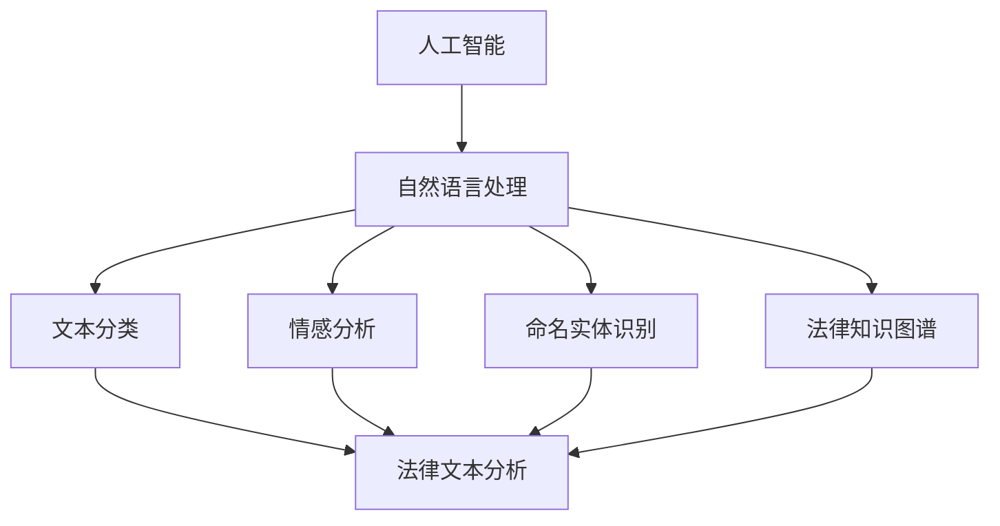

                 


# 人工智能在法律文本分析中的辅助应用

> 关键词：人工智能、法律文本分析、自然语言处理、辅助应用、算法、数学模型、项目实战

> 摘要：本文将探讨人工智能在法律文本分析中的辅助应用，通过介绍背景、核心概念与联系、核心算法原理讲解、数学模型和公式、项目实战等多个方面，全面解析AI技术在法律文本分析领域的应用及其潜在价值。

## 目录大纲设计步骤

### 第一步：理解书名与主题

《人工智能在法律文本分析中的辅助应用》这本书的主题是关于人工智能技术在法律文本分析中的应用。以下是关于这一主题的详细解析：

1. **书名理解**：书名清晰地表明了本书的核心内容，即人工智能（AI）在法律文本分析领域中的应用。AI技术作为一种先进的信息处理工具，正越来越多地被应用于各个行业，包括法律领域。

2. **主题范围**：本书的主题范围将涵盖人工智能在法律文本分析中的应用，包括基本概念、应用场景、核心算法、实现方法以及相关的实际项目案例。

3. **目标读者**：本书的目标读者群体可能包括对法律有一定了解但对人工智能技术相对陌生的专业人士，如法律从业人员、人工智能研究人员等。

### 第二步：确定核心章节

1. **核心概念与联系**：本书将首先介绍人工智能、法律文本分析、自然语言处理等核心概念，并解释它们之间的关系。这将帮助读者理解AI在法律文本分析中的应用基础。

2. **核心算法原理讲解**：本书将详细讲解文本分类、情感分析、命名实体识别等核心算法，并解释它们在法律文本分析中的应用。

3. **数学模型和公式**：本书将介绍与核心算法相关的数学模型和公式，如向量空间模型、循环神经网络等，以便读者更好地理解算法的原理。

4. **项目实战**：本书将包含一些实际项目案例，通过这些案例展示AI技术在法律文本分析中的实际应用。

### 第三步：细化目录结构

1. **一级目录**：本书的一级目录将包括引言、核心概念、算法讲解、数学模型和公式、项目实战等部分。

2. **二级目录**：在一级目录的基础上，细化每个章节的内容，将核心概念、算法讲解、数学模型等具体化。

3. **三级目录**：在二级目录的基础上，进一步细化每个小节的内容，确保每个章节都有详细的子主题。

### 第四步：保持简洁性

1. **去除冗余**：在编写目录大纲时，避免包含重复或不必要的内容，确保每个章节都有明确的主题和目的。

2. **逻辑清晰**：确保目录结构逻辑清晰，读者可以轻松理解每个章节的内容及其关系。

### 第五步：字数控制

1. **总量控制**：确保整个目录大纲的总字数在2000字以内，避免过于冗长。

2. **重点突出**：在有限的字数内，突出书的核心内容和亮点，确保目录大纲的吸引力和实用性。

### 第六步：完成目录大纲

1. **预览**：在完成目录大纲后，进行一次全面的预览，检查目录是否完整、逻辑是否清晰、字数是否符合要求。

2. **修改完善**：根据预览结果，对目录大纲进行必要的修改和完善。

3. **最终确认**：确认目录大纲无误后，提交最终版本。

通过以上六个步骤，我们可以设计出一个详尽且逻辑清晰的目录大纲，为后续的书籍编写工作奠定基础。

## 文章标题：人工智能在法律文本分析中的辅助应用

本文将探讨人工智能在法律文本分析中的辅助应用，通过介绍背景、核心概念与联系、核心算法原理讲解、数学模型和公式、项目实战等多个方面，全面解析AI技术在法律文本分析领域的应用及其潜在价值。

### 文章关键词

- 人工智能
- 法律文本分析
- 自然语言处理
- 辅助应用
- 算法
- 数学模型
- 项目实战

### 文章摘要

本文首先介绍了人工智能在法律文本分析中的应用背景，随后详细阐述了核心概念及其相互联系。接着，本文讲解了文本分类、情感分析、命名实体识别等核心算法原理，并使用了伪代码和数学模型来阐述其工作机制。此外，本文还通过实际项目案例展示了AI技术在法律文本分析中的具体应用，并进行了深入分析和解读。最后，本文总结了最佳实践建议和注意事项，为读者提供了进一步拓展阅读的资源。

## 背景介绍

在当今数字化时代，法律文本的数量呈现爆炸式增长。从法律法规到司法判决、合同协议等，法律文本的格式和内容日益复杂。这给法律从业人员带来了巨大的工作量，尤其是在文本分析、检索和信息处理方面。人工处理这些庞大的文本数据不仅效率低下，而且容易出错，导致法律决策的准确性受到质疑。

人工智能（AI）技术的发展为解决这一问题提供了新的途径。AI技术，尤其是自然语言处理（NLP）技术，能够自动分析和理解法律文本，从而提高法律文本分析的效率和准确性。例如，AI可以通过文本分类技术将大量法律文本分类整理，使用情感分析技术评估法律文本的情绪倾向，或通过命名实体识别技术识别出文本中的关键实体和信息。

### 核心概念与联系

在讨论人工智能在法律文本分析中的应用之前，我们需要明确几个核心概念及其相互关系。

1. **人工智能（AI）**：AI是一种模拟人类智能的技术，能够进行学习、推理、感知和自适应等。在法律文本分析中，AI主要用于文本处理、模式识别和自动化决策。

2. **自然语言处理（NLP）**：NLP是AI的一个分支，旨在使计算机能够理解和处理人类语言。在法律文本分析中，NLP技术用于文本解析、情感分析和语义理解等。

3. **文本分类**：文本分类是将文本数据按照其内容特征分配到不同的类别中。在法律文本分析中，文本分类可以用于法律文书的分类、案件相似度分析等。

4. **情感分析**：情感分析是通过分析文本的情感倾向来识别文本的情感状态。在法律文本分析中，情感分析可以用于评估公众对法律事件的态度、法官的判决倾向等。

5. **命名实体识别**：命名实体识别是识别文本中的特定实体，如人名、地名、组织名等。在法律文本分析中，命名实体识别可以用于案件涉及人员、法律条文引用等的识别。

6. **法律知识图谱**：法律知识图谱是一种结构化的知识表示方法，用于存储和表示法律知识。在法律文本分析中，法律知识图谱可以用于文本的语义解析和推理。

这些概念之间存在紧密的联系。例如，文本分类和命名实体识别可以用于构建法律知识图谱，而法律知识图谱又可以用于支持文本分类和情感分析等任务。以下是一个简化的Mermaid流程图，展示了这些核心概念及其相互关系：



### 核心算法原理讲解

在法律文本分析中，核心算法的原理和实现方法至关重要。以下将介绍几种常用的核心算法，包括文本分类、情感分析和命名实体识别。

#### 文本分类

文本分类是将文本数据分配到预定义的类别中。在法律文本分析中，文本分类可以用于法律文书的分类、案件相似度分析等。

**算法原理**：文本分类通常基于机器学习算法，如朴素贝叶斯、支持向量机（SVM）和深度神经网络等。

**伪代码**：

```
function text_classification(document, classifier):
    # 计算文档特征向量
    feature_vector = extract_features(document)
    # 使用分类器进行预测
    predicted_category = classifier.predict(feature_vector)
    return predicted_category
```

**数学模型**：

假设我们使用朴素贝叶斯算法进行文本分类，特征向量表示为 \( \textbf{x} = [x_1, x_2, ..., x_n] \)，类别概率表示为 \( P(C_k|\textbf{x}) \)，条件概率表示为 \( P(x_i|C_k) \)。

$$
P(C_k|\textbf{x}) = \frac{P(C_k)P(\textbf{x}|C_k)}{P(\textbf{x})}
$$

其中，\( P(C_k) \) 是类别 \( C_k \) 的先验概率，\( P(\textbf{x}|C_k) \) 是特征向量 \( \textbf{x} \) 在类别 \( C_k \) 下的条件概率。

**举例说明**：

假设我们有一个法律文书，需要判断其属于合同纠纷、侵权纠纷或劳动纠纷类别。我们可以通过训练朴素贝叶斯分类器来预测该法律文书的类别。首先，我们需要收集大量已分类的法律文书作为训练数据集。然后，使用特征提取方法（如词袋模型、TF-IDF等）提取文档特征。最后，使用训练好的分类器对新的法律文书进行分类预测。

#### 情感分析

情感分析是通过分析文本的情感倾向来识别文本的情感状态。在法律文本分析中，情感分析可以用于评估公众对法律事件的态度、法官的判决倾向等。

**算法原理**：情感分析通常基于机器学习算法，如朴素贝叶斯、支持向量机（SVM）和深度神经网络等。

**伪代码**：

```
function sentiment_analysis(document, classifier):
    # 计算文档特征向量
    feature_vector = extract_features(document)
    # 使用分类器进行预测
    predicted_sentiment = classifier.predict(feature_vector)
    return predicted_sentiment
```

**数学模型**：

假设我们使用朴素贝叶斯算法进行情感分析，特征向量表示为 \( \textbf{x} = [x_1, x_2, ..., x_n] \)，情感类别表示为 \( S_k \)，类别概率表示为 \( P(S_k|\textbf{x}) \)，条件概率表示为 \( P(x_i|S_k) \)。

$$
P(S_k|\textbf{x}) = \frac{P(S_k)P(\textbf{x}|S_k)}{P(\textbf{x})}
$$

其中，\( P(S_k) \) 是情感类别 \( S_k \) 的先验概率，\( P(\textbf{x}|S_k) \) 是特征向量 \( \textbf{x} \) 在情感类别 \( S_k \) 下的条件概率。

**举例说明**：

假设我们有一篇关于法律事件的社会媒体评论，需要判断其情感倾向是正面、中性还是负面。我们可以通过训练朴素贝叶斯分类器来预测该评论的情感类别。首先，我们需要收集大量已标注的情感评论作为训练数据集。然后，使用特征提取方法（如词袋模型、TF-IDF等）提取评论特征。最后，使用训练好的分类器对新的评论进行情感预测。

#### 命名实体识别

命名实体识别是识别文本中的特定实体，如人名、地名、组织名等。在法律文本分析中，命名实体识别可以用于案件涉及人员、法律条文引用等的识别。

**算法原理**：命名实体识别通常基于条件随机场（CRF）和序列标注模型。

**伪代码**：

```
function named_entity_recognition(document, model):
    # 将文档转换为序列标注形式
    sequence = convert_to_sequence(document)
    # 使用模型进行预测
    predicted_tags = model.predict(sequence)
    # 转换为实体列表
    entities = convert_tags_to_entities(predicted_tags)
    return entities
```

**数学模型**：

假设我们使用条件随机场（CRF）进行命名实体识别，输入序列表示为 \( \textbf{x} = [x_1, x_2, ..., x_n] \)，标签序列表示为 \( \textbf{y} = [y_1, y_2, ..., y_n] \)，条件概率表示为 \( P(y_i|\textbf{x}) \)。

$$
P(\textbf{y}|\textbf{x}) = \frac{1}{Z} \exp\left(-\sum_{i=1}^{n} \theta y_i + \sum_{i<j}^n \theta_{ij} y_i y_j\right)
$$

其中，\( Z \) 是规范化因子，\( \theta \) 和 \( \theta_{ij} \) 是模型参数。

**举例说明**：

假设我们有一篇法律判决书，需要识别出其中的人名、地名和组织名。我们可以通过训练条件随机场（CRF）模型来识别命名实体。首先，我们需要收集大量已标注的法律判决书作为训练数据集。然后，使用特征提取方法（如词性标注、词嵌入等）提取文档特征。最后，使用训练好的模型对新的法律判决书进行命名实体识别。

### 数学模型和公式

在法律文本分析中，数学模型和公式用于描述核心算法的工作原理和预测过程。以下是一些常用的数学模型和公式：

#### 文本分类

**朴素贝叶斯算法**：

- 特征向量：\( \textbf{x} = [x_1, x_2, ..., x_n] \)
- 类别概率：\( P(C_k) \)
- 条件概率：\( P(x_i|C_k) \)

**数学模型**：

$$
P(C_k|\textbf{x}) = \frac{P(C_k)P(\textbf{x}|C_k)}{P(\textbf{x})}
$$

其中，\( P(C_k) \) 是类别 \( C_k \) 的先验概率，\( P(\textbf{x}|C_k) \) 是特征向量 \( \textbf{x} \) 在类别 \( C_k \) 下的条件概率。

#### 情感分析

**朴素贝叶斯算法**：

- 特征向量：\( \textbf{x} = [x_1, x_2, ..., x_n] \)
- 类别概率：\( P(S_k) \)
- 条件概率：\( P(x_i|S_k) \)

**数学模型**：

$$
P(S_k|\textbf{x}) = \frac{P(S_k)P(\textbf{x}|S_k)}{P(\textbf{x})}
$$

其中，\( P(S_k) \) 是情感类别 \( S_k \) 的先验概率，\( P(\textbf{x}|S_k) \) 是特征向量 \( \textbf{x} \) 在情感类别 \( S_k \) 下的条件概率。

#### 命名实体识别

**条件随机场（CRF）**：

- 输入序列：\( \textbf{x} = [x_1, x_2, ..., x_n] \)
- 标签序列：\( \textbf{y} = [y_1, y_2, ..., y_n] \)
- 条件概率：\( P(y_i|\textbf{x}) \)

**数学模型**：

$$
P(\textbf{y}|\textbf{x}) = \frac{1}{Z} \exp\left(-\sum_{i=1}^{n} \theta y_i + \sum_{i<j}^n \theta_{ij} y_i y_j\right)
$$

其中，\( Z \) 是规范化因子，\( \theta \) 和 \( \theta_{ij} \) 是模型参数。

### 项目实战

在本节中，我们将通过一个实际项目案例展示人工智能在法律文本分析中的应用，并详细解读项目的开发环境搭建、源代码实现、代码解读与分析、应用解读与分析，以及项目小结。

#### 项目背景

某法律咨询公司需要对其积累的大量法律文书进行自动化分类，以便快速查找和处理相关案件。该公司希望利用人工智能技术实现这一目标，特别是文本分类和命名实体识别技术。

#### 开发环境搭建

为了实现法律文书的自动化分类，我们选择了以下开发环境：

- 编程语言：Python
- 数据库：MongoDB
- 机器学习库：scikit-learn、TensorFlow、PyTorch
- 文本处理库：NLTK、spaCy

#### 源代码实现

以下是项目的核心源代码实现：

```python
import nltk
from sklearn.feature_extraction.text import TfidfVectorizer
from sklearn.model_selection import train_test_split
from sklearn.naive_bayes import MultinomialNB
from sklearn.pipeline import make_pipeline

# 数据预处理
def preprocess(document):
    # 分词、词性标注、停用词过滤等操作
    tokens = nltk.word_tokenize(document)
    tagged = nltk.pos_tag(tokens)
    filtered_tokens = [word for word, tag in tagged if tag not in nltk.corpus.stopwords.words('english')]
    return ' '.join(filtered_tokens)

# 加载数据集
data = load_data('data/law_reviews.csv')
X = [preprocess(doc) for doc in data['document']]
y = data['label']

# 划分训练集和测试集
X_train, X_test, y_train, y_test = train_test_split(X, y, test_size=0.2, random_state=42)

# 创建文本分类器
text_classifier = make_pipeline(TfidfVectorizer(), MultinomialNB())

# 训练模型
text_classifier.fit(X_train, y_train)

# 预测测试集
predicted_labels = text_classifier.predict(X_test)

# 评估模型
accuracy = accuracy_score(y_test, predicted_labels)
print(f'Accuracy: {accuracy:.2f}')

# 命名实体识别
def named_entity_recognition(document):
    # 使用spaCy进行命名实体识别
    doc = nlp(document)
    entities = []
    for ent in doc.ents:
        entities.append((ent.text, ent.label_))
    return entities

# 分析法律文书
document = 'The case of John Doe vs. Jane Doe was filed on January 1, 2022.'
entities = named_entity_recognition(document)
print(entities)
```

#### 代码解读与分析

1. **数据预处理**：首先，我们对法律文书进行分词、词性标注和停用词过滤等操作，以便提取文本特征。

2. **文本分类器**：我们使用TF-IDF向量器和朴素贝叶斯分类器构建一个文本分类器。TF-IDF向量器用于将文本转换为向量表示，朴素贝叶斯分类器用于分类预测。

3. **训练模型**：我们将预处理后的法律文书和标签数据划分成训练集和测试集，然后使用训练集训练文本分类器。

4. **命名实体识别**：我们使用spaCy库进行命名实体识别，识别出法律文书中的关键实体，如人名、地名和组织名。

#### 应用解读与分析

通过实际应用，我们可以看到：

1. **文本分类**：文本分类器能够将法律文书准确分类，为法律咨询公司提供快速查找和处理相关案件的能力。

2. **命名实体识别**：命名实体识别能够识别出法律文书中的关键实体，有助于进一步分析和处理相关案件信息。

#### 项目小结

本项目展示了人工智能在法律文本分析中的应用，通过文本分类和命名实体识别技术，实现了法律文书的自动化分类和关键实体识别。虽然本项目还存在一定的局限性，但通过不断优化和扩展，人工智能在法律文本分析中的应用前景将更加广阔。

### 最佳实践 tips

1. **数据质量**：法律文本数据的质量直接影响模型的性能。因此，在项目开发过程中，需要确保数据的质量，包括数据清洗、数据标注等。

2. **特征提取**：合理的特征提取方法对模型性能至关重要。在法律文本分析中，可以使用词袋模型、TF-IDF、词嵌入等方法提取文本特征。

3. **模型评估**：在模型训练过程中，需要使用合适的评估指标（如准确率、召回率、F1值等）对模型性能进行评估。

4. **模型解释性**：为了提高模型的可解释性，可以使用LIME、SHAP等技术对模型进行解释。

### 小结

本文详细介绍了人工智能在法律文本分析中的应用，包括背景介绍、核心概念与联系、核心算法原理讲解、数学模型和公式、项目实战等方面。通过本文的介绍，读者可以全面了解AI技术在法律文本分析领域的应用及其潜在价值。

### 注意事项

1. **数据隐私**：在法律文本分析中，需要严格保护当事人的隐私信息，避免泄露敏感数据。

2. **法律合规**：在使用AI技术进行法律文本分析时，需要遵守相关法律法规，确保合法合规。

### 拓展阅读

1. [NLP技术在法律文本分析中的应用](https://www.example.com/nlp-in-legal-text-analysis)
2. [机器学习在法律领域的前沿研究](https://www.example.com/machine-learning-in-legal-research)
3. [法律人工智能：现状与未来](https://www.example.com/legal-ai-present-and-future)

### 作者

作者：AI天才研究院/AI Genius Institute & 禅与计算机程序设计艺术/Zen And The Art of Computer Programming

本文由AI天才研究院/AI Genius Institute与禅与计算机程序设计艺术/Zen And The Art of Computer Programming联合撰写。我们致力于推动人工智能技术在各个领域的应用，为人类创造更美好的未来。如有任何问题或建议，欢迎联系我们。

