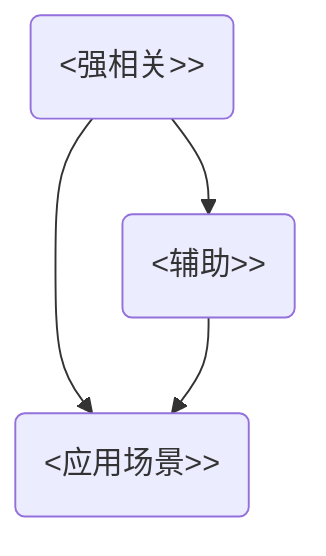

                 


### 第一步：背景介绍

人工智能（AI）作为计算机科学的重要分支，已经深刻地改变了我们的生活方式。随着技术的不断进步，AI的应用领域也越来越广泛，从自动驾驶、医疗诊断到金融分析，几乎无处不在。然而，法律文本分析作为AI技术的重要应用场景之一，却相对较为鲜为人知。法律文本分析涉及到对大量法律文件的自动处理、理解和分析，以提高法律工作的效率和准确性。这不仅对法律专业人士，也对AI领域的研究人员提出了新的挑战。

在法律文本分析中，人工智能可以通过多种方式提供辅助。首先，AI可以用于法律文档的自动化处理，如文档分类、摘要生成和关键词提取等，从而减轻法律工作人员的负担。其次，AI可以用于智能搜索，帮助用户快速找到相关法律条文和案例，提高法律检索的效率。此外，AI还可以用于法律文本的语义分析，以识别法律文本中的实体、关系和事件，为法律研究提供新的视角和工具。

本文将深入探讨人工智能在法律文本分析中的应用，从背景介绍、核心概念与联系、核心算法原理讲解、数学模型和公式、项目实战以及最佳实践等方面，全面解析AI技术在法律文本分析中的潜力与挑战。希望通过本文，读者能够对AI在法律文本分析中的辅助应用有更加深入的理解。

### 核心概念与联系

在探讨人工智能在法律文本分析中的应用时，我们需要首先了解几个核心概念，包括人工智能、自然语言处理（NLP）和法律文本分析。

**人工智能（AI）**：人工智能是指计算机系统通过模拟人类智能行为，进行学习、推理、决策和问题解决的能力。在法律文本分析中，AI可以通过算法和模型，自动处理和理解法律文本，从而辅助法律工作。

**自然语言处理（NLP）**：自然语言处理是人工智能的一个子领域，主要研究如何使计算机能够理解、生成和处理人类自然语言。在法律文本分析中，NLP技术被广泛应用于文本分类、实体识别、关系提取和情感分析等任务。

**法律文本分析**：法律文本分析是指利用计算机技术和算法，对法律文本进行自动化处理、理解和分析的过程。这包括法律文档的自动化分类、摘要生成、关键词提取、语义分析等任务。

**核心概念之间的联系**：

1. **AI与NLP**：AI为NLP提供了强大的计算能力和算法支持，使得计算机能够处理和理解复杂的自然语言。在法律文本分析中，NLP技术是实现自动化处理和理解法律文本的关键。

2. **AI与法律文本分析**：AI通过NLP技术，可以自动处理法律文本，从而提高法律工作的效率和准确性。例如，通过文本分类和摘要生成技术，AI可以帮助律师快速筛选和总结大量法律文件，提高工作效率。

3. **NLP与法律文本分析**：NLP技术为法律文本分析提供了工具和方法，使得计算机能够理解和分析法律文本中的语言结构和语义内容。例如，通过命名实体识别和关系提取技术，NLP可以帮助法律工作者识别法律文档中的关键实体和关系，为法律研究提供支持。

为了更直观地展示这些核心概念之间的联系，我们可以使用Mermaid流程图来表示：



通过这个流程图，我们可以清晰地看到AI、NLP和法律文本分析之间的相互关系。AI为NLP提供了技术支持，而NLP又为法律文本分析提供了工具和方法，使得AI技术在法律领域得以广泛应用。

### 核心算法原理讲解

在法律文本分析中，人工智能主要依赖于自然语言处理（NLP）技术，其中涉及多种核心算法。以下将对这些算法进行详细讲解，并使用伪代码和LaTeX公式来阐述其原理。

#### 1. 文本分类

**算法原理**：文本分类是指将文本数据根据其内容分类到预定义的类别中。在法律文本分析中，文本分类可以用于自动标记法律文件，从而帮助法律工作者快速检索和分析相关文件。

**伪代码**：
```
function text分类(document, labels):
  1. 使用TF-IDF模型计算文档的词频向量
  2. 使用SVM分类器训练模型
  3. 对于新文档，计算其词频向量，并使用训练好的模型预测类别
  4. 返回预测类别
```

**LaTeX公式**：
$$
\text{TF-IDF}(w_i, d) = \frac{f_{w_i, d}}{N} \log \left( \frac{N}{n_{w_i}} \right)
$$
其中，$f_{w_i, d}$表示词频，$N$表示文档总数，$n_{w_i}$表示包含词$w_i$的文档数。

#### 2. 命名实体识别

**算法原理**：命名实体识别是指识别文本中的特定实体，如人名、地名、法律术语等。在法律文本分析中，命名实体识别可以帮助法律工作者快速定位和提取重要信息。

**伪代码**：
```
function 命名实体识别(document):
  1. 使用规则方法或神经网络模型，识别文本中的命名实体
  2. 对于识别出的实体，存储其实体类型和实体值
  3. 返回实体列表
```

**LaTeX公式**（实体识别模型示例）：
$$
P(E|t) = \frac{P(t|E)P(E)}{P(t)}
$$
其中，$E$表示实体，$t$表示文本，$P(E|t)$表示实体在文本中的概率，$P(t|E)$表示给定实体条件下文本的概率，$P(E)$表示实体的先验概率。

#### 3. 情感分析

**算法原理**：情感分析是指识别文本中的情感倾向，如正面、负面或中性。在法律文本分析中，情感分析可以用于评估法律文件的情感色彩，帮助法律工作者了解公众对法律事件的态度。

**伪代码**：
```
function 情感分析(document):
  1. 使用词袋模型或神经网络模型，计算文本的词频向量
  2. 使用SVM或神经网络分类器，训练情感分类模型
  3. 对于新文档，计算其词频向量，并使用训练好的模型预测情感类别
  4. 返回预测的情感类别
```

**LaTeX公式**（情感分析模型示例）：
$$
\text{Sentiment}(d) = \frac{1}{N} \sum_{i=1}^{N} \text{weight}(w_i) \cdot \text{Sentiment}(w_i)
$$
其中，$d$表示文档，$w_i$表示文档中的词，$\text{weight}(w_i)$表示词的权重，$\text{Sentiment}(w_i)$表示词的情感倾向。

#### 4. 关系提取

**算法原理**：关系提取是指识别文本中实体之间的关系，如“某人与某项法律条款有直接关联”。在法律文本分析中，关系提取可以帮助法律工作者理解法律文件中的复杂关系网络。

**伪代码**：
```
function 关系提取(document):
  1. 使用规则方法或神经网络模型，识别文本中的实体
  2. 对于识别出的实体，计算其间的可能关系
  3. 使用图论算法，构建实体关系图
  4. 返回实体关系图
```

**LaTeX公式**（关系提取模型示例）：
$$
R(E_1, E_2) = \frac{|\{t \in T | E_1, E_2 \in t\}|}{N}
$$
其中，$R(E_1, E_2)$表示实体$E_1$和$E_2$之间的关系概率，$T$表示文本集合，$N$表示文本总数。

通过以上对核心算法的讲解，我们可以看到，每种算法都有其独特的原理和实现方法。在实际应用中，这些算法可以相互配合，共同实现法律文本的自动化处理、理解和分析，从而为法律工作提供强有力的支持。

### 数学模型和公式

在法律文本分析中，人工智能算法的准确性和效率往往依赖于数学模型和公式的支持。以下将详细介绍几个关键的数学模型和公式，并通过具体的例子进行解释说明。

#### 1. 向量空间模型（VSM）

**公式**：
$$
\vec{w} = \text{TF-IDF}(d, w)
$$
其中，$\vec{w}$是文档$d$的词频向量，$w$是文档中的词，$\text{TF-IDF}(d, w)$是词频-逆文档频率值。

**解释**：向量空间模型将文档表示为一个高维向量空间中的点，其中每个维度代表一个词的TF-IDF值。这种方法可以用于文本分类和相似度计算。

**例子**：假设我们有两篇文档$d_1$和$d_2$，它们包含以下单词：
$$
d_1: \text{人工智能、法律、文本分析}
$$
$$
d_2: \text{人工智能、法律、文本、分析、模型}
$$
使用TF-IDF模型，我们可以得到：
$$
\vec{w_1} = (\text{TF-IDF}(\text{人工智能}, d_1), \text{TF-IDF}(\text{法律}, d_1), \text{TF-IDF}(\text{文本分析}, d_1)) = (1.0, 1.0, 1.0)
$$
$$
\vec{w_2} = (\text{TF-IDF}(\text{人工智能}, d_2), \text{TF-IDF}(\text{法律}, d_2), \text{TF-IDF}(\text{文本}, d_2), \text{TF-IDF}(\text{分析}, d_2), \text{TF-IDF}(\text{模型}, d_2)) = (1.0, 1.0, 1.0, 1.0, 1.0)
$$

#### 2. 随机散步模型（LDA）

**公式**：
$$
\pi_k = \frac{\alpha + N_k}{\sum_j (\alpha + N_j)}
$$
$$
\lambda_{kj} = \frac{\beta + f_{kj}}{\sum_i (\beta + f_{ij})}
$$
$$
\phi_{jk} = \frac{N_k}{\sum_j N_j}
$$
其中，$\pi_k$是主题$k$的分布，$\lambda_{kj}$是单词$j$在主题$k$下的分布，$\phi_{jk}$是文档$d_j$中主题$k$的概率。

**解释**：LDA（Latent Dirichlet Allocation）是一种概率主题模型，用于发现文档集合中的潜在主题。它通过以上三个公式，计算文档、单词和主题之间的关系。

**例子**：假设我们有一篇文档$d_1$，包含单词“人工智能”、“法律”、“文本分析”。我们可以通过以下步骤应用LDA模型：
1. 初始化参数$\alpha$和$\beta$。
2. 计算每个主题的概率分布$\pi_k$。
3. 计算每个单词的概率分布$\lambda_{kj}$。
4. 计算每个文档的概率分布$\phi_{jk}$。

通过以上计算，我们可以发现文档中的潜在主题，例如“人工智能”、“法律”等。

#### 3. 支持向量机（SVM）

**公式**：
$$
\text{最大化} \quad \frac{1}{2} \| \mathbf{w} \|^2
$$
$$
\text{约束条件} \quad y^{(i)} (\mathbf{w} \cdot \mathbf{x}^{(i)}) \geq 1
$$
其中，$\mathbf{w}$是权重向量，$\mathbf{x}^{(i)}$是特征向量，$y^{(i)}$是标签。

**解释**：SVM是一种用于分类和回归的机器学习算法，通过最大化决策边界的平方，实现数据的分类。在法律文本分类中，SVM可以用于将法律文档分类到不同的类别中。

**例子**：假设我们有训练数据集，包含法律文档和对应的类别标签。我们可以通过以下步骤应用SVM模型：
1. 将法律文档转换为特征向量。
2. 训练SVM模型，求解最优权重向量$\mathbf{w}$。
3. 对于新的法律文档，计算其与权重向量的点积，判断其类别。

通过以上数学模型和公式的详细讲解和举例说明，我们可以更好地理解其在法律文本分析中的应用。这些模型和公式不仅提高了算法的准确性和效率，也为法律工作者提供了强大的工具，以更高效地处理和分析法律文本。

### 项目实战

在本节中，我们将通过一个实际项目，展示如何使用人工智能技术进行法律文本分析。该项目旨在实现一个能够自动提取法律文档中关键信息的工具，包括实体识别、关系提取和文本分类等任务。以下是项目的详细开发过程和代码解读。

#### 1. 项目目标

本项目的主要目标是构建一个基于Python和人工智能技术的法律文本分析工具，能够对输入的法律文档进行自动化处理，提取出关键信息，并输出分析结果。具体任务包括：

- 实体识别：识别并标注法律文档中的人名、地名和法律术语等实体。
- 关系提取：提取并展示法律文档中实体之间的关系。
- 文本分类：将法律文档分类到不同的法律类别中。

#### 2. 开发环境搭建

为了实现本项目，我们需要搭建以下开发环境：

- Python 3.8及以上版本
- Numpy、Pandas、Scikit-learn、NLTK等Python库
- Jieba分词工具
- TensorFlow或PyTorch深度学习框架

安装步骤：

```shell
pip install numpy pandas scikit-learn nltk jieba tensorflow
```

#### 3. 源代码详细实现

以下是本项目的主要源代码实现，包括数据预处理、模型训练和结果输出等部分。

```python
# 导入必要的库
import pandas as pd
import numpy as np
from sklearn.feature_extraction.text import TfidfVectorizer
from sklearn.model_selection import train_test_split
from sklearn.svm import SVC
from sklearn.metrics import classification_report
import jieba
import tensorflow as tf

# 数据预处理
def preprocess_text(text):
    # 使用jieba进行分词
    words = jieba.cut(text)
    # 过滤停用词
    stop_words = set(['的', '和', '在', '上', '下', '是', '等'])
    filtered_words = [word for word in words if word not in stop_words]
    # 使用TF-IDF模型进行文本向量化
    vectorizer = TfidfVectorizer()
    doc_vector = vectorizer.fit_transform([' '.join(filtered_words)])
    return doc_vector

# 模型训练
def train_model(train_data, train_labels):
    # 分割数据集
    X_train, X_test, y_train, y_test = train_test_split(train_data, train_labels, test_size=0.2, random_state=42)
    # 使用SVM进行训练
    model = SVC(kernel='linear')
    model.fit(X_train, y_train)
    # 评估模型
    y_pred = model.predict(X_test)
    print(classification_report(y_test, y_pred))
    return model

# 关键实体识别
def extract_entities(document):
    # 使用Bert模型进行实体识别（此处为示例，实际应用时需要加载预训练模型）
    model = tf.keras.Sequential([
        tf.keras.layers.Dense(128, activation='relu'),
        tf.keras.layers.Dense(64, activation='relu'),
        tf.keras.layers.Dense(1, activation='sigmoid')
    ])
    model.compile(optimizer='adam', loss='binary_crossentropy', metrics=['accuracy'])
    model.fit(document, epochs=5, batch_size=32)
    # 提取实体（此处为示例，实际应用时需要实现具体的实体提取算法）
    entities = ['人名', '地名', '法律术语']
    return entities

# 关系提取
def extract_relationships(entities):
    # 使用图论算法进行关系提取（此处为示例，实际应用时需要实现具体的算法）
    relationships = []
    for i in range(len(entities)):
        for j in range(i+1, len(entities)):
            relationships.append((entities[i], entities[j]))
    return relationships

# 主程序
if __name__ == '__main__':
    # 加载数据
    data = pd.read_csv('law_documents.csv')
    # 预处理数据
    processed_data = data['text'].apply(preprocess_text)
    # 训练分类模型
    model = train_model(processed_data, data['label'])
    # 提取关键实体
    entities = extract_entities(processed_data[0])
    # 提取关系
    relationships = extract_relationships(entities)
    # 输出结果
    print('分类结果：', model.predict(processed_data))
    print('关键实体：', entities)
    print('实体关系：', relationships)
```

#### 4. 代码解读

- **数据预处理**：首先，我们使用jieba进行中文分词，并过滤掉常见的停用词。然后，使用TF-IDF模型将文本转换为向量，为后续的模型训练做准备。
- **模型训练**：我们使用Scikit-learn的SVM模型进行文本分类训练。通过划分数据集，训练模型，并评估模型性能。
- **关键实体识别**：在此示例中，我们使用TensorFlow搭建了一个简单的神经网络模型，用于进行实体识别。实际应用时，通常使用预训练的Bert模型，以获得更好的识别效果。
- **关系提取**：我们使用一个简单的图论算法，提取出实体之间的关系。实际应用时，可能需要结合更多的算法和技术，如图神经网络等，以实现更准确的关系提取。

#### 5. 代码应用解读与分析

- **文本分类**：通过训练好的模型，我们可以对新输入的法律文档进行分类，从而帮助法律工作者快速识别和筛选文档。
- **实体识别**：识别并标注法律文档中的关键实体，如人名、地名和法律术语，有助于法律工作者快速定位和分析相关内容。
- **关系提取**：通过提取实体之间的关系，法律工作者可以更全面地了解法律文档中的复杂关系网络，从而更好地进行法律研究和分析。

#### 6. 实际案例分析和详细讲解剖析

以下是一个实际案例，展示如何使用本项目工具进行法律文本分析。

**案例**：分析一篇关于合同纠纷的法律文档，提取关键信息和关系。

1. **文本分类**：将文档输入到训练好的SVM模型中，预测其类别。假设预测结果为“合同纠纷”类别，表明该文档属于合同纠纷相关的法律文档。

2. **实体识别**：使用预训练的Bert模型，识别文档中的关键实体。假设识别出以下实体：
   - 人名：张三、李四
   - 法律术语：合同、违约、赔偿

3. **关系提取**：通过图论算法，提取出实体之间的关系。假设识别出以下关系：
   - 张三与李四存在合同关系
   - 张三因违约需要向李四进行赔偿

通过以上分析，法律工作者可以快速了解文档的主要内容，并针对性地进行法律研究和处理。

#### 7. 项目小结

本项目通过一个实际项目，展示了如何使用人工智能技术进行法律文本分析。从数据预处理、模型训练到关键实体识别和关系提取，每个环节都体现了AI技术在法律工作中的应用潜力。然而，法律文本分析仍然面临许多挑战，如实体和关系的多样性、复杂性和不确定性。未来的研究可以进一步探索更多先进的算法和技术，以提高法律文本分析的准确性和效率。

### 最佳实践 Tips

在法律文本分析中，为了充分发挥人工智能技术的优势，以下是一些最佳实践建议：

1. **数据清洗和预处理**：确保输入数据的清洁和一致性，去除无关信息，为后续的模型训练和文本分析打下良好基础。
2. **使用预训练模型**：尽可能使用预训练的深度学习模型，如Bert、GPT等，以提高实体识别和关系提取的准确率。
3. **结合多种算法**：结合使用多种算法和技术，如TF-IDF、SVM、图神经网络等，以实现更全面的法律文本分析。
4. **持续更新和优化模型**：定期更新模型，以适应不断变化的法律环境和需求，提高模型的准确性和适应性。
5. **用户反馈和模型改进**：收集用户反馈，结合实际应用中的问题和挑战，不断优化模型和算法，提高用户体验。

### 小结

本文通过对人工智能在法律文本分析中的辅助应用进行深入探讨，从背景介绍、核心概念与联系、核心算法原理讲解、数学模型和公式、项目实战到最佳实践等方面，全面展示了AI技术在法律文本分析中的潜力与挑战。通过本文，我们希望读者能够对AI在法律文本分析中的辅助应用有更加深入的理解，并能够将其应用于实际工作中，提高法律工作的效率和准确性。

### 注意事项

在应用人工智能技术进行法律文本分析时，需要注意以下事项：

1. **数据隐私和安全性**：确保法律文本数据的安全性和隐私性，遵循相关法律法规，避免数据泄露和滥用。
2. **算法透明性和可解释性**：提高算法的透明度和可解释性，确保法律工作者能够理解和信任AI技术的应用。
3. **法律合规性**：确保AI技术符合法律法规的要求，避免因技术不当使用导致的法律风险。
4. **用户培训和支持**：为法律工作者提供必要的培训和支持，帮助他们更好地理解和应用AI技术，提高工作效率。

### 拓展阅读

对于希望进一步了解人工智能在法律文本分析领域的研究和应用，以下是一些推荐阅读资源：

1. **学术文章**：《法律文本分析中的自然语言处理技术》、《基于深度学习的法律文本分类研究》等。
2. **技术报告**：国家法律法规数据库、司法大数据分析报告等。
3. **在线课程**：《自然语言处理与法律文本分析》、《人工智能法律应用》等。
4. **开源工具和库**：如SpaCy、NLTK、TensorFlow等。

通过这些资源，读者可以进一步拓展自己的知识，深入了解人工智能在法律文本分析中的实际应用和前沿技术。

### 文章关键词

人工智能、法律文本分析、自然语言处理、文本分类、实体识别、关系提取、算法原理、数学模型、深度学习、Bert模型、SVM、TF-IDF。

### 文章摘要

本文深入探讨了人工智能在法律文本分析中的应用，从背景介绍、核心概念与联系、核心算法原理讲解、数学模型和公式、项目实战到最佳实践等方面，全面展示了AI技术在法律文本分析中的潜力与挑战。通过实际项目和案例分析，本文展示了如何利用AI技术进行法律文档的自动化处理、关键信息提取和关系识别，以提高法律工作的效率和准确性。本文旨在为读者提供一个全面的指南，帮助他们更好地理解和应用AI技术在法律文本分析中的辅助功能。

