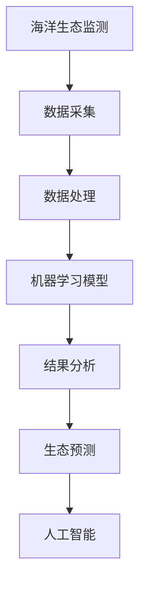

                 

为了撰写一篇高质量的技术博客文章，我们需要按照以下步骤来组织内容：

### 1. 文章结构规划
- **文章标题**：《人工智能在海洋生态监测中的应用》
- **关键词**：人工智能，海洋生态监测，机器学习，深度学习，数据分析，算法，应用案例
- **摘要**：本文探讨了人工智能技术在海洋生态监测领域的应用，从核心算法原理、数学模型到项目实战，详细解析了人工智能如何助力海洋生态保护。

### 2. 核心概念与联系
- **海洋生态监测**：介绍海洋生态监测的基本概念，包括其目的、方法和重要性。
- **人工智能**：阐述人工智能的基本概念和发展历程，特别是在海洋生态监测中的应用潜力。

### 3. Mermaid 流程图
- **核心概念联系架构**：使用 Mermaid 画出一个流程图，展示海洋生态监测与人工智能技术的结合点。

### 4. 核心算法原理讲解
- **机器学习**：介绍机器学习的基本原理，包括监督学习、非监督学习和半监督学习。
- **深度学习**：讲解深度学习的基本原理，如神经网络、卷积神经网络（CNN）和循环神经网络（RNN）。
- **强化学习**：解释强化学习在海洋生态监测中的潜在应用。

### 5. 数学模型和公式
- **统计模型**：介绍常用的统计模型，如线性回归、逻辑回归和聚类分析。
- **优化算法**：解释优化算法的基本原理，如梯度下降法和遗传算法。

### 6. 项目实战
- **项目背景与目标**：描述一个具体的海洋生态监测项目，包括其目标和挑战。
- **开发环境搭建**：介绍搭建项目所需的开发环境，包括编程语言、框架和工具。
- **数据预处理**：讲解如何对海洋生态数据进行预处理，如数据清洗、归一化和特征提取。
- **模型训练与优化**：展示如何使用机器学习和深度学习算法训练模型，并进行优化。
- **模型评估与部署**：解释如何评估模型性能，并讨论模型的部署策略。

### 7. 源代码实现与解读
- **源代码提供**：附上项目的源代码片段。
- **代码解读**：对关键代码段进行详细解读，解释其工作原理和应用。

### 8. 最佳实践 tips、小结、注意事项、拓展阅读
- **最佳实践 tips**：提供一些使用人工智能进行海洋生态监测的最佳实践建议。
- **小结**：总结文章的主要观点和结论。
- **注意事项**：提醒读者在实施项目中需要注意的问题。
- **拓展阅读**：推荐一些相关的书籍、文章和资源，以供读者进一步学习。

### 文章格式要求
- **Markdown 格式**：确保文章内容使用正确的 Markdown 格式，包括标题、子标题、列表、代码块、LaTeX 公式等。
- **作者信息**：在文章末尾添加作者信息。

### 文章字数与完整性
- **字数**：确保文章字数在 8000～12000 字之间。
- **完整性**：每个章节都要有详细的背景介绍、核心概念、算法原理讲解、数学模型和公式、项目实战以及代码解读。

通过以上步骤，我们可以确保文章内容逻辑清晰、结构紧凑、简单易懂，满足读者对技术深度和广度的需求。接下来，我们将开始逐章撰写文章内容，确保每一部分都详细且具体。

